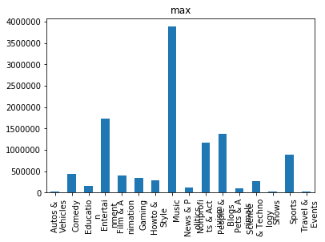
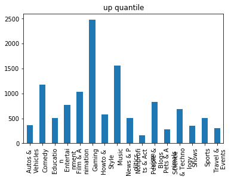
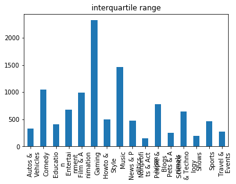
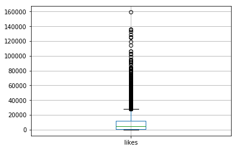
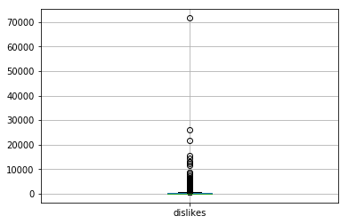

```python
#
```

możemy sprawdzić czy ilość filmików dla każdego kanału daje rozkład normalny
to samo z wyświetleniami dla każdego kanału
i osobno dla filmików


Dodać analize zależności wyśwwietleń i lajków od kategorii

policzyć wskaźniki normalizacji, testy chi^2
może jakiś model przewidujący

# Youtube video data analysis

Importing libraries


```python
import numpy as np
import pandas as pd
import matplotlib.pyplot as plt
from sklearn import linear_model
from pandas import read_csv
import scipy.stats as scp
```


```python
from scipy.stats import shapiro
import seaborn as sns
from scipy import stats

```

Uploading dataset


```python
from google.colab import files
uploaded = files.upload()
```


     <input type="file" id="files-e98fdbcd-4589-4c0e-8a15-740d29d7205d" name="files[]" multiple disabled />
     <output id="result-e98fdbcd-4589-4c0e-8a15-740d29d7205d">
      Upload widget is only available when the cell has been executed in the
      current browser session. Please rerun this cell to enable.
      </output>
      <script src="/nbextensions/google.colab/files.js"></script> 


    Saving USvideos.csv to USvideos.csv


```python
videos = read_csv("USvideos.csv")
```

Podstawowe informacje o zbiorze danych


```python
videos.info()
```

    <class 'pandas.core.frame.DataFrame'>
    RangeIndex: 40949 entries, 0 to 40948
    Data columns (total 16 columns):
    video_id                  40949 non-null object
    trending_date             40949 non-null object
    title                     40949 non-null object
    channel_title             40949 non-null object
    category_id               40949 non-null int64
    publish_time              40949 non-null object
    tags                      40949 non-null object
    views                     40949 non-null int64
    likes                     40949 non-null int64
    dislikes                  40949 non-null int64
    comment_count             40949 non-null int64
    thumbnail_link            40949 non-null object
    comments_disabled         40949 non-null bool
    ratings_disabled          40949 non-null bool
    video_error_or_removed    40949 non-null bool
    description               40379 non-null object
    dtypes: bool(3), int64(5), object(8)
    memory usage: 4.2+ MB


```python
videos.describe()
```


<div>
<style scoped>
    .dataframe tbody tr th:only-of-type {
        vertical-align: middle;
    }

    .dataframe tbody tr th {
        vertical-align: top;
    }

    .dataframe thead th {
        text-align: right;
    }
</style>
<table border="1" class="dataframe">
  <thead>
    <tr style="text-align: right;">
      <th></th>
      <th>category_id</th>
      <th>views</th>
      <th>likes</th>
      <th>dislikes</th>
      <th>comment_count</th>
    </tr>
  </thead>
  <tbody>
    <tr>
      <th>count</th>
      <td>40949.000000</td>
      <td>4.094900e+04</td>
      <td>4.094900e+04</td>
      <td>4.094900e+04</td>
      <td>4.094900e+04</td>
    </tr>
    <tr>
      <th>mean</th>
      <td>19.972429</td>
      <td>2.360785e+06</td>
      <td>7.426670e+04</td>
      <td>3.711401e+03</td>
      <td>8.446804e+03</td>
    </tr>
    <tr>
      <th>std</th>
      <td>7.568327</td>
      <td>7.394114e+06</td>
      <td>2.288853e+05</td>
      <td>2.902971e+04</td>
      <td>3.743049e+04</td>
    </tr>
    <tr>
      <th>min</th>
      <td>1.000000</td>
      <td>5.490000e+02</td>
      <td>0.000000e+00</td>
      <td>0.000000e+00</td>
      <td>0.000000e+00</td>
    </tr>
    <tr>
      <th>25%</th>
      <td>17.000000</td>
      <td>2.423290e+05</td>
      <td>5.424000e+03</td>
      <td>2.020000e+02</td>
      <td>6.140000e+02</td>
    </tr>
    <tr>
      <th>50%</th>
      <td>24.000000</td>
      <td>6.818610e+05</td>
      <td>1.809100e+04</td>
      <td>6.310000e+02</td>
      <td>1.856000e+03</td>
    </tr>
    <tr>
      <th>75%</th>
      <td>25.000000</td>
      <td>1.823157e+06</td>
      <td>5.541700e+04</td>
      <td>1.938000e+03</td>
      <td>5.755000e+03</td>
    </tr>
    <tr>
      <th>max</th>
      <td>43.000000</td>
      <td>2.252119e+08</td>
      <td>5.613827e+06</td>
      <td>1.674420e+06</td>
      <td>1.361580e+06</td>
    </tr>
  </tbody>
</table>
</div>


```python
videos.title
```


    0                       WE WANT TO TALK ABOUT OUR MARRIAGE
    1        The Trump Presidency: Last Week Tonight with J...
    2        Racist Superman | Rudy Mancuso, King Bach & Le...
    3                         Nickelback Lyrics: Real or Fake?
    4                                 I Dare You: GOING BALD!?
    5                                    2 Weeks with iPhone X
    6                Roy Moore & Jeff Sessions Cold Open - SNL
    7                      5 Ice Cream Gadgets put to the Test
    8        The Greatest Showman | Official Trailer 2 [HD]...
    9        Why the rise of the robots won’t mean the end ...
    10       Dion Lewis' 103-Yd Kick Return TD vs. Denver! ...
    11       (SPOILERS) 'Shiva Saves the Day' Talked About ...
    12              Marshmello - Blocks (Official Music Video)
    13                  Which Countries Are About To Collapse?
    14                                SHOPPING FOR NEW FISH!!!
    15                                        The New SpotMini
    16        One Change That Would Make Pacific Rim a Classic
    17       How does your body know you're full? - Hilary ...
    18                              HomeMade Electric Airplane
    19                Founding An Inbreeding-Free Space Colony
    20                        How Can You Control Your Dreams?
    21       The Making of Hela's Headdress from Thor: Ragn...
    22       Is It Dangerous To Talk To A Camera While Driv...
    23       What $4,800 Will Get You In NYC | Sweet Digs H...
    24                            Using Other People's Showers
    25                  SPAGHETTI BURRITO VS SPAGHETTI BURRITO
    26                    78557 and Proth Primes - Numberphile
    27         A Smart... MUG?! - Take apart a Heated Thermos!
    28       LeBron James admits he was ripping Phil Jackso...
    29                                 Nick Andopolis: Drummer
                                   ...                        
    40919    The History of Fortnite Battle Royale - Did Yo...
    40920    Christina Aguilera - Fall In Line (Official Vi...
    40921    James Bay - Delicate (Taylor Swift cover) in t...
    40922    Mindy Kaling Is Mad She Wasn't Invited to the ...
    40923                           Camels vs. Cactus!!!   جمل
    40924    GIANT Bowl of Lucky Charms CHALLENGE (5,000+ C...
    40925    Diplo, French Montana & Lil Pump ft. Zhavia - ...
    40926                                                  435
    40927            That Time It Rained for Two Million Years
    40928    Watch a Hercules Beetle Metamorphose Before Yo...
    40929                       Mustard, Nick Jonas - Anywhere
    40930    Maddie Poppe Wins American Idol 2018 - Finale ...
    40931    Terrible Magicians | Rudy Mancuso & Juanpa Zurita
    40932      The Voice 2018 Brynn Cartelli - Finale: Skyfall
    40933    8 Survival Myths That Will Definitely Make Thi...
    40934                                  Royal Wedding - SNL
    40935           Nicki Minaj - Chun-Li (Live on SNL / 2018)
    40936                LIE DETECTOR TEST WITH MY GIRLFRIEND!
    40937                      Lucas the Spider - Giant Spider
    40938                 Daddy Yankee - Hielo (Video Oficial)
    40939      SZA - Garden (Say It Like Dat) (Official Video)
    40940    Brad Pitt Bid $120k For A Night With Emilia Cl...
    40941              Dan + Shay - Speechless (Wedding Video)
    40942                Fifth Harmony - Don't Say You Love Me
    40943    BTS Plays With Puppies While Answering Fan Que...
    40944                         The Cat Who Caught the Laser
    40945                           True Facts : Ant Mutualism
    40946    I GAVE SAFIYA NYGAARD A PERFECT HAIR MAKEOVER ...
    40947                  How Black Panther Should Have Ended
    40948    Official Call of Duty®: Black Ops 4 — Multipla...
    Name: title, Length: 40949, dtype: object


```python
videos.head()
```


<div>
<style scoped>
    .dataframe tbody tr th:only-of-type {
        vertical-align: middle;
    }

    .dataframe tbody tr th {
        vertical-align: top;
    }

    .dataframe thead th {
        text-align: right;
    }
</style>
<table border="1" class="dataframe">
  <thead>
    <tr style="text-align: right;">
      <th></th>
      <th>video_id</th>
      <th>trending_date</th>
      <th>title</th>
      <th>channel_title</th>
      <th>category_id</th>
      <th>publish_time</th>
      <th>tags</th>
      <th>views</th>
      <th>likes</th>
      <th>dislikes</th>
      <th>comment_count</th>
      <th>thumbnail_link</th>
      <th>comments_disabled</th>
      <th>ratings_disabled</th>
      <th>video_error_or_removed</th>
      <th>description</th>
    </tr>
  </thead>
  <tbody>
    <tr>
      <th>0</th>
      <td>2kyS6SvSYSE</td>
      <td>17.14.11</td>
      <td>WE WANT TO TALK ABOUT OUR MARRIAGE</td>
      <td>CaseyNeistat</td>
      <td>22</td>
      <td>2017-11-13T17:13:01.000Z</td>
      <td>SHANtell martin</td>
      <td>748374</td>
      <td>57527</td>
      <td>2966</td>
      <td>15954</td>
      <td>https://i.ytimg.com/vi/2kyS6SvSYSE/default.jpg</td>
      <td>False</td>
      <td>False</td>
      <td>False</td>
      <td>SHANTELL'S CHANNEL - https://www.youtube.com/s...</td>
    </tr>
    <tr>
      <th>1</th>
      <td>1ZAPwfrtAFY</td>
      <td>17.14.11</td>
      <td>The Trump Presidency: Last Week Tonight with J...</td>
      <td>LastWeekTonight</td>
      <td>24</td>
      <td>2017-11-13T07:30:00.000Z</td>
      <td>last week tonight trump presidency|"last week ...</td>
      <td>2418783</td>
      <td>97185</td>
      <td>6146</td>
      <td>12703</td>
      <td>https://i.ytimg.com/vi/1ZAPwfrtAFY/default.jpg</td>
      <td>False</td>
      <td>False</td>
      <td>False</td>
      <td>One year after the presidential election, John...</td>
    </tr>
    <tr>
      <th>2</th>
      <td>5qpjK5DgCt4</td>
      <td>17.14.11</td>
      <td>Racist Superman | Rudy Mancuso, King Bach &amp; Le...</td>
      <td>Rudy Mancuso</td>
      <td>23</td>
      <td>2017-11-12T19:05:24.000Z</td>
      <td>racist superman|"rudy"|"mancuso"|"king"|"bach"...</td>
      <td>3191434</td>
      <td>146033</td>
      <td>5339</td>
      <td>8181</td>
      <td>https://i.ytimg.com/vi/5qpjK5DgCt4/default.jpg</td>
      <td>False</td>
      <td>False</td>
      <td>False</td>
      <td>WATCH MY PREVIOUS VIDEO ▶ \n\nSUBSCRIBE ► http...</td>
    </tr>
    <tr>
      <th>3</th>
      <td>puqaWrEC7tY</td>
      <td>17.14.11</td>
      <td>Nickelback Lyrics: Real or Fake?</td>
      <td>Good Mythical Morning</td>
      <td>24</td>
      <td>2017-11-13T11:00:04.000Z</td>
      <td>rhett and link|"gmm"|"good mythical morning"|"...</td>
      <td>343168</td>
      <td>10172</td>
      <td>666</td>
      <td>2146</td>
      <td>https://i.ytimg.com/vi/puqaWrEC7tY/default.jpg</td>
      <td>False</td>
      <td>False</td>
      <td>False</td>
      <td>Today we find out if Link is a Nickelback amat...</td>
    </tr>
    <tr>
      <th>4</th>
      <td>d380meD0W0M</td>
      <td>17.14.11</td>
      <td>I Dare You: GOING BALD!?</td>
      <td>nigahiga</td>
      <td>24</td>
      <td>2017-11-12T18:01:41.000Z</td>
      <td>ryan|"higa"|"higatv"|"nigahiga"|"i dare you"|"...</td>
      <td>2095731</td>
      <td>132235</td>
      <td>1989</td>
      <td>17518</td>
      <td>https://i.ytimg.com/vi/d380meD0W0M/default.jpg</td>
      <td>False</td>
      <td>False</td>
      <td>False</td>
      <td>I know it's been a while since we did this sho...</td>
    </tr>
  </tbody>
</table>
</div>


```python
first_5000 = videos[1:5000]
first_5000.shape
```


    (4999, 16)


```python
stat, p = shapiro(videos.views)
stat2, p2 = stats.normaltest(videos.views)
```

    /usr/local/lib/python3.6/dist-packages/scipy/stats/morestats.py:1660: UserWarning: p-value may not be accurate for N > 5000.
      warnings.warn("p-value may not be accurate for N > 5000.")


```python

```


```python
print("shapiro test p: " + str(p))
print("normal test p: " + str(p2))
```

    shapiro test p: 0.0
    normal test p: 0.0


Testy wskazują na to, że dane dotyczące wyświetleń nie pochodzą z rozkładu normalnego. Jest to spoodziewany wynik biorąc pod uwagę nasz zbiór danych.


```python
videos.shape
```


    (40949, 16)


Removing duplicate video occurances


```python
cleared = videos.drop_duplicates("title") # each title occurs only once
```


```python
cleared.describe()
```


<div>
<style scoped>
    .dataframe tbody tr th:only-of-type {
        vertical-align: middle;
    }

    .dataframe tbody tr th {
        vertical-align: top;
    }

    .dataframe thead th {
        text-align: right;
    }
</style>
<table border="1" class="dataframe">
  <thead>
    <tr style="text-align: right;">
      <th></th>
      <th>category_id</th>
      <th>views</th>
      <th>likes</th>
      <th>dislikes</th>
      <th>comment_count</th>
    </tr>
  </thead>
  <tbody>
    <tr>
      <th>count</th>
      <td>6455.000000</td>
      <td>6.455000e+03</td>
      <td>6.455000e+03</td>
      <td>6455.000000</td>
      <td>6455.000000</td>
    </tr>
    <tr>
      <th>mean</th>
      <td>20.435167</td>
      <td>7.725127e+05</td>
      <td>3.446944e+04</td>
      <td>1436.518823</td>
      <td>4488.452672</td>
    </tr>
    <tr>
      <th>std</th>
      <td>7.216801</td>
      <td>1.968870e+06</td>
      <td>1.156808e+05</td>
      <td>11993.978470</td>
      <td>21310.200158</td>
    </tr>
    <tr>
      <th>min</th>
      <td>1.000000</td>
      <td>5.490000e+02</td>
      <td>0.000000e+00</td>
      <td>0.000000</td>
      <td>0.000000</td>
    </tr>
    <tr>
      <th>25%</th>
      <td>17.000000</td>
      <td>8.401450e+04</td>
      <td>1.932000e+03</td>
      <td>73.000000</td>
      <td>261.500000</td>
    </tr>
    <tr>
      <th>50%</th>
      <td>24.000000</td>
      <td>2.740600e+05</td>
      <td>8.011000e+03</td>
      <td>244.000000</td>
      <td>922.000000</td>
    </tr>
    <tr>
      <th>75%</th>
      <td>25.000000</td>
      <td>7.591420e+05</td>
      <td>2.519050e+04</td>
      <td>775.500000</td>
      <td>2854.500000</td>
    </tr>
    <tr>
      <th>max</th>
      <td>43.000000</td>
      <td>4.843165e+07</td>
      <td>3.880071e+06</td>
      <td>629120.000000</td>
      <td>733373.000000</td>
    </tr>
  </tbody>
</table>
</div>


```python
cleared.boxplot(column='views')
```


    <matplotlib.axes._subplots.AxesSubplot at 0x7f4fc8b2cb38>


```python
cleared.boxplot(column='likes')
```


    <matplotlib.axes._subplots.AxesSubplot at 0x7f4fc8b352e8>


Widzimy, że średnie odtworzeń, lajków, dislajków i komentarzy są w każdym przypadku większe niż ich mediana.
Co więcej, średnie odtworzeń, lajków, dislajków i komentarzy są większe od kwantyla górnego.
Wynika z tego że istnieje niewielki podzbiór filmików o znacznie większej popularności niż reszta


```python
cleared.boxplot(column='dislikes')
```


    <matplotlib.axes._subplots.AxesSubplot at 0x7f4fc8fd7320>


```python
cleared.boxplot(column='comment_count')
```


    <matplotlib.axes._subplots.AxesSubplot at 0x7f4fc90929e8>


```python
cleared.shape
```


    (6455, 16)


```python
cleared.head()
```


<div>
<style scoped>
    .dataframe tbody tr th:only-of-type {
        vertical-align: middle;
    }

    .dataframe tbody tr th {
        vertical-align: top;
    }

    .dataframe thead th {
        text-align: right;
    }
</style>
<table border="1" class="dataframe">
  <thead>
    <tr style="text-align: right;">
      <th></th>
      <th>video_id</th>
      <th>trending_date</th>
      <th>title</th>
      <th>channel_title</th>
      <th>category_id</th>
      <th>publish_time</th>
      <th>tags</th>
      <th>views</th>
      <th>likes</th>
      <th>dislikes</th>
      <th>comment_count</th>
      <th>thumbnail_link</th>
      <th>comments_disabled</th>
      <th>ratings_disabled</th>
      <th>video_error_or_removed</th>
      <th>description</th>
    </tr>
  </thead>
  <tbody>
    <tr>
      <th>0</th>
      <td>2kyS6SvSYSE</td>
      <td>17.14.11</td>
      <td>WE WANT TO TALK ABOUT OUR MARRIAGE</td>
      <td>CaseyNeistat</td>
      <td>22</td>
      <td>2017-11-13T17:13:01.000Z</td>
      <td>SHANtell martin</td>
      <td>748374</td>
      <td>57527</td>
      <td>2966</td>
      <td>15954</td>
      <td>https://i.ytimg.com/vi/2kyS6SvSYSE/default.jpg</td>
      <td>False</td>
      <td>False</td>
      <td>False</td>
      <td>SHANTELL'S CHANNEL - https://www.youtube.com/s...</td>
    </tr>
    <tr>
      <th>1</th>
      <td>1ZAPwfrtAFY</td>
      <td>17.14.11</td>
      <td>The Trump Presidency: Last Week Tonight with J...</td>
      <td>LastWeekTonight</td>
      <td>24</td>
      <td>2017-11-13T07:30:00.000Z</td>
      <td>last week tonight trump presidency|"last week ...</td>
      <td>2418783</td>
      <td>97185</td>
      <td>6146</td>
      <td>12703</td>
      <td>https://i.ytimg.com/vi/1ZAPwfrtAFY/default.jpg</td>
      <td>False</td>
      <td>False</td>
      <td>False</td>
      <td>One year after the presidential election, John...</td>
    </tr>
    <tr>
      <th>2</th>
      <td>5qpjK5DgCt4</td>
      <td>17.14.11</td>
      <td>Racist Superman | Rudy Mancuso, King Bach &amp; Le...</td>
      <td>Rudy Mancuso</td>
      <td>23</td>
      <td>2017-11-12T19:05:24.000Z</td>
      <td>racist superman|"rudy"|"mancuso"|"king"|"bach"...</td>
      <td>3191434</td>
      <td>146033</td>
      <td>5339</td>
      <td>8181</td>
      <td>https://i.ytimg.com/vi/5qpjK5DgCt4/default.jpg</td>
      <td>False</td>
      <td>False</td>
      <td>False</td>
      <td>WATCH MY PREVIOUS VIDEO ▶ \n\nSUBSCRIBE ► http...</td>
    </tr>
    <tr>
      <th>3</th>
      <td>puqaWrEC7tY</td>
      <td>17.14.11</td>
      <td>Nickelback Lyrics: Real or Fake?</td>
      <td>Good Mythical Morning</td>
      <td>24</td>
      <td>2017-11-13T11:00:04.000Z</td>
      <td>rhett and link|"gmm"|"good mythical morning"|"...</td>
      <td>343168</td>
      <td>10172</td>
      <td>666</td>
      <td>2146</td>
      <td>https://i.ytimg.com/vi/puqaWrEC7tY/default.jpg</td>
      <td>False</td>
      <td>False</td>
      <td>False</td>
      <td>Today we find out if Link is a Nickelback amat...</td>
    </tr>
    <tr>
      <th>4</th>
      <td>d380meD0W0M</td>
      <td>17.14.11</td>
      <td>I Dare You: GOING BALD!?</td>
      <td>nigahiga</td>
      <td>24</td>
      <td>2017-11-12T18:01:41.000Z</td>
      <td>ryan|"higa"|"higatv"|"nigahiga"|"i dare you"|"...</td>
      <td>2095731</td>
      <td>132235</td>
      <td>1989</td>
      <td>17518</td>
      <td>https://i.ytimg.com/vi/d380meD0W0M/default.jpg</td>
      <td>False</td>
      <td>False</td>
      <td>False</td>
      <td>I know it's been a while since we did this sho...</td>
    </tr>
  </tbody>
</table>
</div>


```python
stat2, p2 = shapiro(cleared.views)
print(p2)
```

    0.0


    /usr/local/lib/python3.6/dist-packages/scipy/stats/morestats.py:1660: UserWarning: p-value may not be accurate for N > 5000.
      warnings.warn("p-value may not be accurate for N > 5000.")


```python
'''Average views'''
videos['views'].mean()
```


    2360784.6382573447


```python
'''Average likes'''
videos['likes'].mean()
```


    74266.7024347359


```python
'''Average dislikes'''
videos['dislikes'].mean()
```


    3711.400888910596


```python
'''Average comment count'''
videos['comment_count'].mean()
```


    8446.803682629612


Histogram ilości wyświetleń


```python
fig, ax = plt.subplots()
_ = sns.distplot(cleared["views"], ax = ax, kde = False, color = "red")
```


Funkcja mapuje dane funkcją transform_func i zwraca dataFrame z przetransformowanymi danymi. Przykład:
  Dla kolumny : [ 1, 2, 3, 4, 5, 6, 7, 8, 9, 10], i transfor_func zwwracającej True jeśli liczba jest większa od 5, kolumna po wywołaniu będzie wyglądać następująco : [ False, False, False, False, False, True, True, True, True, True]


```python
def get_transformed_data(data, key, transform_func = lambda elem: elem) :
    '''Mapowanie danych w kolumnie przez transform_func'''
    if ( not type(key) == str):
        raise(Exception('Bad argument'))

    res = data.copy(deep = True)

    collumn = res[key]

    for i in range(0, len(collumn)):
        collumn[i] = transform_func(collumn[i])

    return res
```

Funkcja zwraca dataFrame z ununiętymi danymi które nie spełniają keep_if_predicate.


```python
def get_filtered_data(data, key, keep_if_predicate = lambda elem : True):
    '''Usuwanie danych nie spełniających keep_if_predicate'''
    if ( not type(key) == str):
        raise(Exception('Bad argument'))

    res = data.copy(deep=True)
    collumn = res[key]

    for i in range(0, len(collumn)):
        if not keep_if_predicate(collumn[i]):
            res.drop([i], axis=0, inplace=True)

    return res
```


```python
cleared.groupby('channel_title').sum()
```


<div>
<style scoped>
    .dataframe tbody tr th:only-of-type {
        vertical-align: middle;
    }

    .dataframe tbody tr th {
        vertical-align: top;
    }

    .dataframe thead th {
        text-align: right;
    }
</style>
<table border="1" class="dataframe">
  <thead>
    <tr style="text-align: right;">
      <th></th>
      <th>category_id</th>
      <th>views</th>
      <th>likes</th>
      <th>dislikes</th>
      <th>comment_count</th>
      <th>comments_disabled</th>
      <th>ratings_disabled</th>
      <th>video_error_or_removed</th>
    </tr>
    <tr>
      <th>channel_title</th>
      <th></th>
      <th></th>
      <th></th>
      <th></th>
      <th></th>
      <th></th>
      <th></th>
      <th></th>
    </tr>
  </thead>
  <tbody>
    <tr>
      <th>12 News</th>
      <td>22</td>
      <td>85643</td>
      <td>170</td>
      <td>45</td>
      <td>0</td>
      <td>0.0</td>
      <td>0.0</td>
      <td>0.0</td>
    </tr>
    <tr>
      <th>1MILLION Dance Studio</th>
      <td>96</td>
      <td>1733477</td>
      <td>122066</td>
      <td>1276</td>
      <td>8527</td>
      <td>0.0</td>
      <td>0.0</td>
      <td>0.0</td>
    </tr>
    <tr>
      <th>1theK (원더케이)</th>
      <td>50</td>
      <td>7035666</td>
      <td>702920</td>
      <td>8435</td>
      <td>49777</td>
      <td>0.0</td>
      <td>0.0</td>
      <td>0.0</td>
    </tr>
    <tr>
      <th>20th Century Fox</th>
      <td>17</td>
      <td>48572239</td>
      <td>1204019</td>
      <td>21395</td>
      <td>78337</td>
      <td>0.0</td>
      <td>0.0</td>
      <td>0.0</td>
    </tr>
    <tr>
      <th>2CELLOS</th>
      <td>10</td>
      <td>205869</td>
      <td>11198</td>
      <td>120</td>
      <td>446</td>
      <td>0.0</td>
      <td>0.0</td>
      <td>0.0</td>
    </tr>
    <tr>
      <th>3Blue1Brown</th>
      <td>81</td>
      <td>764897</td>
      <td>43188</td>
      <td>262</td>
      <td>3680</td>
      <td>0.0</td>
      <td>0.0</td>
      <td>0.0</td>
    </tr>
    <tr>
      <th>3D Printing Nerd</th>
      <td>56</td>
      <td>88340</td>
      <td>3662</td>
      <td>103</td>
      <td>699</td>
      <td>0.0</td>
      <td>0.0</td>
      <td>0.0</td>
    </tr>
    <tr>
      <th>42Fab - Metalworking and Multi-Medium Fabrication</th>
      <td>26</td>
      <td>17812</td>
      <td>230</td>
      <td>26</td>
      <td>54</td>
      <td>0.0</td>
      <td>0.0</td>
      <td>0.0</td>
    </tr>
    <tr>
      <th>494ta</th>
      <td>1</td>
      <td>637942</td>
      <td>793</td>
      <td>38</td>
      <td>137</td>
      <td>0.0</td>
      <td>0.0</td>
      <td>0.0</td>
    </tr>
    <tr>
      <th>4given4ever1</th>
      <td>25</td>
      <td>191953</td>
      <td>6434</td>
      <td>453</td>
      <td>0</td>
      <td>1.0</td>
      <td>0.0</td>
      <td>0.0</td>
    </tr>
    <tr>
      <th>5-Minute Crafts</th>
      <td>78</td>
      <td>11723195</td>
      <td>114979</td>
      <td>17247</td>
      <td>12377</td>
      <td>0.0</td>
      <td>0.0</td>
      <td>0.0</td>
    </tr>
    <tr>
      <th>52 Skillz</th>
      <td>26</td>
      <td>29469</td>
      <td>418</td>
      <td>18</td>
      <td>50</td>
      <td>0.0</td>
      <td>0.0</td>
      <td>0.0</td>
    </tr>
    <tr>
      <th>5FDPVEVO</th>
      <td>20</td>
      <td>811599</td>
      <td>57099</td>
      <td>1055</td>
      <td>4737</td>
      <td>0.0</td>
      <td>0.0</td>
      <td>0.0</td>
    </tr>
    <tr>
      <th>5MadMovieMakers</th>
      <td>48</td>
      <td>661443</td>
      <td>21439</td>
      <td>327</td>
      <td>1295</td>
      <td>0.0</td>
      <td>0.0</td>
      <td>0.0</td>
    </tr>
    <tr>
      <th>5SOSVEVO</th>
      <td>30</td>
      <td>1813858</td>
      <td>359749</td>
      <td>2092</td>
      <td>44012</td>
      <td>0.0</td>
      <td>0.0</td>
      <td>0.0</td>
    </tr>
    <tr>
      <th>60 Minutes</th>
      <td>50</td>
      <td>198237</td>
      <td>1319</td>
      <td>139</td>
      <td>628</td>
      <td>0.0</td>
      <td>0.0</td>
      <td>0.0</td>
    </tr>
    <tr>
      <th>730 WVFN</th>
      <td>17</td>
      <td>6064</td>
      <td>7</td>
      <td>23</td>
      <td>19</td>
      <td>0.0</td>
      <td>0.0</td>
      <td>0.0</td>
    </tr>
    <tr>
      <th>9-1-1 on FOX</th>
      <td>24</td>
      <td>1172</td>
      <td>12</td>
      <td>0</td>
      <td>0</td>
      <td>0.0</td>
      <td>0.0</td>
      <td>0.0</td>
    </tr>
    <tr>
      <th>90s Commercials</th>
      <td>27</td>
      <td>773</td>
      <td>2</td>
      <td>0</td>
      <td>0</td>
      <td>0.0</td>
      <td>0.0</td>
      <td>0.0</td>
    </tr>
    <tr>
      <th>A Chick Called Albert</th>
      <td>15</td>
      <td>1481728</td>
      <td>64756</td>
      <td>1015</td>
      <td>10121</td>
      <td>0.0</td>
      <td>0.0</td>
      <td>0.0</td>
    </tr>
    <tr>
      <th>A&amp;E</th>
      <td>24</td>
      <td>238953</td>
      <td>2488</td>
      <td>191</td>
      <td>905</td>
      <td>0.0</td>
      <td>0.0</td>
      <td>0.0</td>
    </tr>
    <tr>
      <th>A24</th>
      <td>5</td>
      <td>1944524</td>
      <td>35277</td>
      <td>1659</td>
      <td>3811</td>
      <td>0.0</td>
      <td>0.0</td>
      <td>0.0</td>
    </tr>
    <tr>
      <th>ABC Action News</th>
      <td>74</td>
      <td>1899127</td>
      <td>10695</td>
      <td>1161</td>
      <td>9772</td>
      <td>0.0</td>
      <td>0.0</td>
      <td>0.0</td>
    </tr>
    <tr>
      <th>ABC News</th>
      <td>550</td>
      <td>3951004</td>
      <td>29570</td>
      <td>13841</td>
      <td>30766</td>
      <td>0.0</td>
      <td>0.0</td>
      <td>0.0</td>
    </tr>
    <tr>
      <th>ABC News (Australia)</th>
      <td>50</td>
      <td>3662245</td>
      <td>23527</td>
      <td>1763</td>
      <td>0</td>
      <td>2.0</td>
      <td>0.0</td>
      <td>0.0</td>
    </tr>
    <tr>
      <th>ABC Television Network</th>
      <td>96</td>
      <td>4301253</td>
      <td>93232</td>
      <td>2918</td>
      <td>6414</td>
      <td>0.0</td>
      <td>0.0</td>
      <td>0.0</td>
    </tr>
    <tr>
      <th>ABC7</th>
      <td>25</td>
      <td>299090</td>
      <td>10126</td>
      <td>456</td>
      <td>2807</td>
      <td>0.0</td>
      <td>0.0</td>
      <td>0.0</td>
    </tr>
    <tr>
      <th>AFP news agency</th>
      <td>25</td>
      <td>3634</td>
      <td>19</td>
      <td>2</td>
      <td>2</td>
      <td>0.0</td>
      <td>0.0</td>
      <td>0.0</td>
    </tr>
    <tr>
      <th>AIA awards</th>
      <td>22</td>
      <td>66888</td>
      <td>1098</td>
      <td>427</td>
      <td>313</td>
      <td>0.0</td>
      <td>0.0</td>
      <td>0.0</td>
    </tr>
    <tr>
      <th>ALL URBAN CENTRAL</th>
      <td>24</td>
      <td>481171</td>
      <td>3989</td>
      <td>228</td>
      <td>495</td>
      <td>0.0</td>
      <td>0.0</td>
      <td>0.0</td>
    </tr>
    <tr>
      <th>...</th>
      <td>...</td>
      <td>...</td>
      <td>...</td>
      <td>...</td>
      <td>...</td>
      <td>...</td>
      <td>...</td>
      <td>...</td>
    </tr>
    <tr>
      <th>taalk com</th>
      <td>26</td>
      <td>1107</td>
      <td>19</td>
      <td>2</td>
      <td>4</td>
      <td>0.0</td>
      <td>0.0</td>
      <td>0.0</td>
    </tr>
    <tr>
      <th>thataylaa</th>
      <td>26</td>
      <td>149709</td>
      <td>9401</td>
      <td>105</td>
      <td>868</td>
      <td>0.0</td>
      <td>0.0</td>
      <td>0.0</td>
    </tr>
    <tr>
      <th>the Hacksmith</th>
      <td>56</td>
      <td>1686731</td>
      <td>43101</td>
      <td>1261</td>
      <td>5807</td>
      <td>0.0</td>
      <td>0.0</td>
      <td>0.0</td>
    </tr>
    <tr>
      <th>theCHIVE</th>
      <td>24</td>
      <td>158013</td>
      <td>2232</td>
      <td>72</td>
      <td>197</td>
      <td>0.0</td>
      <td>0.0</td>
      <td>0.0</td>
    </tr>
    <tr>
      <th>theSkimm</th>
      <td>22</td>
      <td>11216</td>
      <td>2</td>
      <td>14</td>
      <td>13</td>
      <td>0.0</td>
      <td>0.0</td>
      <td>0.0</td>
    </tr>
    <tr>
      <th>thegameawards</th>
      <td>20</td>
      <td>1287342</td>
      <td>26557</td>
      <td>1467</td>
      <td>1905</td>
      <td>0.0</td>
      <td>0.0</td>
      <td>0.0</td>
    </tr>
    <tr>
      <th>theneedledrop</th>
      <td>60</td>
      <td>910139</td>
      <td>36595</td>
      <td>1494</td>
      <td>8816</td>
      <td>0.0</td>
      <td>0.0</td>
      <td>0.0</td>
    </tr>
    <tr>
      <th>thevirts</th>
      <td>24</td>
      <td>91085</td>
      <td>4085</td>
      <td>75</td>
      <td>586</td>
      <td>0.0</td>
      <td>0.0</td>
      <td>0.0</td>
    </tr>
    <tr>
      <th>todrickhall</th>
      <td>96</td>
      <td>693281</td>
      <td>57820</td>
      <td>982</td>
      <td>4228</td>
      <td>0.0</td>
      <td>0.0</td>
      <td>0.0</td>
    </tr>
    <tr>
      <th>tonyvera1902</th>
      <td>22</td>
      <td>103423</td>
      <td>1248</td>
      <td>81</td>
      <td>272</td>
      <td>0.0</td>
      <td>0.0</td>
      <td>0.0</td>
    </tr>
    <tr>
      <th>toofacedcosmetics</th>
      <td>26</td>
      <td>13747</td>
      <td>877</td>
      <td>39</td>
      <td>77</td>
      <td>0.0</td>
      <td>0.0</td>
      <td>0.0</td>
    </tr>
    <tr>
      <th>tovestyrkeVEVO</th>
      <td>10</td>
      <td>8720</td>
      <td>1155</td>
      <td>7</td>
      <td>96</td>
      <td>0.0</td>
      <td>0.0</td>
      <td>0.0</td>
    </tr>
    <tr>
      <th>truTV</th>
      <td>120</td>
      <td>923273</td>
      <td>16800</td>
      <td>1891</td>
      <td>2541</td>
      <td>0.0</td>
      <td>0.0</td>
      <td>0.0</td>
    </tr>
    <tr>
      <th>videogamedunkey</th>
      <td>60</td>
      <td>8128634</td>
      <td>479810</td>
      <td>11749</td>
      <td>34342</td>
      <td>0.0</td>
      <td>0.0</td>
      <td>0.0</td>
    </tr>
    <tr>
      <th>vlogbrothers</th>
      <td>242</td>
      <td>1751991</td>
      <td>129582</td>
      <td>1601</td>
      <td>16286</td>
      <td>0.0</td>
      <td>0.0</td>
      <td>0.0</td>
    </tr>
    <tr>
      <th>vnbreyes</th>
      <td>17</td>
      <td>2863</td>
      <td>2</td>
      <td>0</td>
      <td>0</td>
      <td>0.0</td>
      <td>0.0</td>
      <td>0.0</td>
    </tr>
    <tr>
      <th>voordeel</th>
      <td>24</td>
      <td>50741</td>
      <td>5963</td>
      <td>27</td>
      <td>448</td>
      <td>0.0</td>
      <td>0.0</td>
      <td>0.0</td>
    </tr>
    <tr>
      <th>wdwmagic</th>
      <td>19</td>
      <td>188213</td>
      <td>4174</td>
      <td>2743</td>
      <td>2525</td>
      <td>0.0</td>
      <td>0.0</td>
      <td>0.0</td>
    </tr>
    <tr>
      <th>weezer</th>
      <td>10</td>
      <td>1191202</td>
      <td>37446</td>
      <td>1281</td>
      <td>3226</td>
      <td>0.0</td>
      <td>0.0</td>
      <td>0.0</td>
    </tr>
    <tr>
      <th>yeokm1</th>
      <td>28</td>
      <td>24311</td>
      <td>176</td>
      <td>2</td>
      <td>42</td>
      <td>0.0</td>
      <td>0.0</td>
      <td>0.0</td>
    </tr>
    <tr>
      <th>yovo68</th>
      <td>2</td>
      <td>304017</td>
      <td>3446</td>
      <td>158</td>
      <td>1925</td>
      <td>0.0</td>
      <td>0.0</td>
      <td>0.0</td>
    </tr>
    <tr>
      <th>zefrank1</th>
      <td>66</td>
      <td>2178525</td>
      <td>185964</td>
      <td>1336</td>
      <td>20571</td>
      <td>0.0</td>
      <td>0.0</td>
      <td>0.0</td>
    </tr>
    <tr>
      <th>Алексей Навальный</th>
      <td>29</td>
      <td>5579079</td>
      <td>365439</td>
      <td>63579</td>
      <td>77462</td>
      <td>0.0</td>
      <td>0.0</td>
      <td>0.0</td>
    </tr>
    <tr>
      <th>Никита Ордынский</th>
      <td>1</td>
      <td>282380</td>
      <td>35093</td>
      <td>303</td>
      <td>1944</td>
      <td>0.0</td>
      <td>0.0</td>
      <td>0.0</td>
    </tr>
    <tr>
      <th>ТСН</th>
      <td>25</td>
      <td>180711</td>
      <td>1667</td>
      <td>418</td>
      <td>1082</td>
      <td>0.0</td>
      <td>0.0</td>
      <td>0.0</td>
    </tr>
    <tr>
      <th>ワーナー ブラザース 公式チャンネル</th>
      <td>1</td>
      <td>755014</td>
      <td>15686</td>
      <td>558</td>
      <td>1768</td>
      <td>0.0</td>
      <td>0.0</td>
      <td>0.0</td>
    </tr>
    <tr>
      <th>圧倒的不審者の極み!</th>
      <td>28</td>
      <td>294419</td>
      <td>7310</td>
      <td>378</td>
      <td>2780</td>
      <td>0.0</td>
      <td>0.0</td>
      <td>0.0</td>
    </tr>
    <tr>
      <th>杰威爾音樂 JVR Music</th>
      <td>20</td>
      <td>22873768</td>
      <td>180699</td>
      <td>11758</td>
      <td>20164</td>
      <td>0.0</td>
      <td>0.0</td>
      <td>0.0</td>
    </tr>
    <tr>
      <th>郭韋辰</th>
      <td>28</td>
      <td>12594</td>
      <td>48</td>
      <td>1</td>
      <td>4</td>
      <td>0.0</td>
      <td>0.0</td>
      <td>0.0</td>
    </tr>
    <tr>
      <th>영국남자 Korean Englishman</th>
      <td>23</td>
      <td>588820</td>
      <td>18317</td>
      <td>254</td>
      <td>2214</td>
      <td>0.0</td>
      <td>0.0</td>
      <td>0.0</td>
    </tr>
  </tbody>
</table>
<p>2198 rows × 8 columns</p>
</div>


```python
cleared.groupby('channel_title').count()

```


<div>
<style scoped>
    .dataframe tbody tr th:only-of-type {
        vertical-align: middle;
    }

    .dataframe tbody tr th {
        vertical-align: top;
    }

    .dataframe thead th {
        text-align: right;
    }
</style>
<table border="1" class="dataframe">
  <thead>
    <tr style="text-align: right;">
      <th></th>
      <th>video_id</th>
      <th>trending_date</th>
      <th>title</th>
      <th>category_id</th>
      <th>publish_time</th>
      <th>tags</th>
      <th>views</th>
      <th>likes</th>
      <th>dislikes</th>
      <th>comment_count</th>
      <th>thumbnail_link</th>
      <th>comments_disabled</th>
      <th>ratings_disabled</th>
      <th>video_error_or_removed</th>
      <th>description</th>
    </tr>
    <tr>
      <th>channel_title</th>
      <th></th>
      <th></th>
      <th></th>
      <th></th>
      <th></th>
      <th></th>
      <th></th>
      <th></th>
      <th></th>
      <th></th>
      <th></th>
      <th></th>
      <th></th>
      <th></th>
      <th></th>
    </tr>
  </thead>
  <tbody>
    <tr>
      <th>12 News</th>
      <td>1</td>
      <td>1</td>
      <td>1</td>
      <td>1</td>
      <td>1</td>
      <td>1</td>
      <td>1</td>
      <td>1</td>
      <td>1</td>
      <td>1</td>
      <td>1</td>
      <td>1</td>
      <td>1</td>
      <td>1</td>
      <td>1</td>
    </tr>
    <tr>
      <th>1MILLION Dance Studio</th>
      <td>4</td>
      <td>4</td>
      <td>4</td>
      <td>4</td>
      <td>4</td>
      <td>4</td>
      <td>4</td>
      <td>4</td>
      <td>4</td>
      <td>4</td>
      <td>4</td>
      <td>4</td>
      <td>4</td>
      <td>4</td>
      <td>4</td>
    </tr>
    <tr>
      <th>1theK (원더케이)</th>
      <td>5</td>
      <td>5</td>
      <td>5</td>
      <td>5</td>
      <td>5</td>
      <td>5</td>
      <td>5</td>
      <td>5</td>
      <td>5</td>
      <td>5</td>
      <td>5</td>
      <td>5</td>
      <td>5</td>
      <td>5</td>
      <td>5</td>
    </tr>
    <tr>
      <th>20th Century Fox</th>
      <td>17</td>
      <td>17</td>
      <td>17</td>
      <td>17</td>
      <td>17</td>
      <td>17</td>
      <td>17</td>
      <td>17</td>
      <td>17</td>
      <td>17</td>
      <td>17</td>
      <td>17</td>
      <td>17</td>
      <td>17</td>
      <td>17</td>
    </tr>
    <tr>
      <th>2CELLOS</th>
      <td>1</td>
      <td>1</td>
      <td>1</td>
      <td>1</td>
      <td>1</td>
      <td>1</td>
      <td>1</td>
      <td>1</td>
      <td>1</td>
      <td>1</td>
      <td>1</td>
      <td>1</td>
      <td>1</td>
      <td>1</td>
      <td>1</td>
    </tr>
    <tr>
      <th>3Blue1Brown</th>
      <td>3</td>
      <td>3</td>
      <td>3</td>
      <td>3</td>
      <td>3</td>
      <td>3</td>
      <td>3</td>
      <td>3</td>
      <td>3</td>
      <td>3</td>
      <td>3</td>
      <td>3</td>
      <td>3</td>
      <td>3</td>
      <td>3</td>
    </tr>
    <tr>
      <th>3D Printing Nerd</th>
      <td>2</td>
      <td>2</td>
      <td>2</td>
      <td>2</td>
      <td>2</td>
      <td>2</td>
      <td>2</td>
      <td>2</td>
      <td>2</td>
      <td>2</td>
      <td>2</td>
      <td>2</td>
      <td>2</td>
      <td>2</td>
      <td>2</td>
    </tr>
    <tr>
      <th>42Fab - Metalworking and Multi-Medium Fabrication</th>
      <td>1</td>
      <td>1</td>
      <td>1</td>
      <td>1</td>
      <td>1</td>
      <td>1</td>
      <td>1</td>
      <td>1</td>
      <td>1</td>
      <td>1</td>
      <td>1</td>
      <td>1</td>
      <td>1</td>
      <td>1</td>
      <td>1</td>
    </tr>
    <tr>
      <th>494ta</th>
      <td>1</td>
      <td>1</td>
      <td>1</td>
      <td>1</td>
      <td>1</td>
      <td>1</td>
      <td>1</td>
      <td>1</td>
      <td>1</td>
      <td>1</td>
      <td>1</td>
      <td>1</td>
      <td>1</td>
      <td>1</td>
      <td>1</td>
    </tr>
    <tr>
      <th>4given4ever1</th>
      <td>1</td>
      <td>1</td>
      <td>1</td>
      <td>1</td>
      <td>1</td>
      <td>1</td>
      <td>1</td>
      <td>1</td>
      <td>1</td>
      <td>1</td>
      <td>1</td>
      <td>1</td>
      <td>1</td>
      <td>1</td>
      <td>0</td>
    </tr>
    <tr>
      <th>5-Minute Crafts</th>
      <td>3</td>
      <td>3</td>
      <td>3</td>
      <td>3</td>
      <td>3</td>
      <td>3</td>
      <td>3</td>
      <td>3</td>
      <td>3</td>
      <td>3</td>
      <td>3</td>
      <td>3</td>
      <td>3</td>
      <td>3</td>
      <td>3</td>
    </tr>
    <tr>
      <th>52 Skillz</th>
      <td>1</td>
      <td>1</td>
      <td>1</td>
      <td>1</td>
      <td>1</td>
      <td>1</td>
      <td>1</td>
      <td>1</td>
      <td>1</td>
      <td>1</td>
      <td>1</td>
      <td>1</td>
      <td>1</td>
      <td>1</td>
      <td>1</td>
    </tr>
    <tr>
      <th>5FDPVEVO</th>
      <td>2</td>
      <td>2</td>
      <td>2</td>
      <td>2</td>
      <td>2</td>
      <td>2</td>
      <td>2</td>
      <td>2</td>
      <td>2</td>
      <td>2</td>
      <td>2</td>
      <td>2</td>
      <td>2</td>
      <td>2</td>
      <td>2</td>
    </tr>
    <tr>
      <th>5MadMovieMakers</th>
      <td>2</td>
      <td>2</td>
      <td>2</td>
      <td>2</td>
      <td>2</td>
      <td>2</td>
      <td>2</td>
      <td>2</td>
      <td>2</td>
      <td>2</td>
      <td>2</td>
      <td>2</td>
      <td>2</td>
      <td>2</td>
      <td>2</td>
    </tr>
    <tr>
      <th>5SOSVEVO</th>
      <td>3</td>
      <td>3</td>
      <td>3</td>
      <td>3</td>
      <td>3</td>
      <td>3</td>
      <td>3</td>
      <td>3</td>
      <td>3</td>
      <td>3</td>
      <td>3</td>
      <td>3</td>
      <td>3</td>
      <td>3</td>
      <td>3</td>
    </tr>
    <tr>
      <th>60 Minutes</th>
      <td>2</td>
      <td>2</td>
      <td>2</td>
      <td>2</td>
      <td>2</td>
      <td>2</td>
      <td>2</td>
      <td>2</td>
      <td>2</td>
      <td>2</td>
      <td>2</td>
      <td>2</td>
      <td>2</td>
      <td>2</td>
      <td>2</td>
    </tr>
    <tr>
      <th>730 WVFN</th>
      <td>1</td>
      <td>1</td>
      <td>1</td>
      <td>1</td>
      <td>1</td>
      <td>1</td>
      <td>1</td>
      <td>1</td>
      <td>1</td>
      <td>1</td>
      <td>1</td>
      <td>1</td>
      <td>1</td>
      <td>1</td>
      <td>1</td>
    </tr>
    <tr>
      <th>9-1-1 on FOX</th>
      <td>1</td>
      <td>1</td>
      <td>1</td>
      <td>1</td>
      <td>1</td>
      <td>1</td>
      <td>1</td>
      <td>1</td>
      <td>1</td>
      <td>1</td>
      <td>1</td>
      <td>1</td>
      <td>1</td>
      <td>1</td>
      <td>1</td>
    </tr>
    <tr>
      <th>90s Commercials</th>
      <td>1</td>
      <td>1</td>
      <td>1</td>
      <td>1</td>
      <td>1</td>
      <td>1</td>
      <td>1</td>
      <td>1</td>
      <td>1</td>
      <td>1</td>
      <td>1</td>
      <td>1</td>
      <td>1</td>
      <td>1</td>
      <td>1</td>
    </tr>
    <tr>
      <th>A Chick Called Albert</th>
      <td>1</td>
      <td>1</td>
      <td>1</td>
      <td>1</td>
      <td>1</td>
      <td>1</td>
      <td>1</td>
      <td>1</td>
      <td>1</td>
      <td>1</td>
      <td>1</td>
      <td>1</td>
      <td>1</td>
      <td>1</td>
      <td>1</td>
    </tr>
    <tr>
      <th>A&amp;E</th>
      <td>1</td>
      <td>1</td>
      <td>1</td>
      <td>1</td>
      <td>1</td>
      <td>1</td>
      <td>1</td>
      <td>1</td>
      <td>1</td>
      <td>1</td>
      <td>1</td>
      <td>1</td>
      <td>1</td>
      <td>1</td>
      <td>1</td>
    </tr>
    <tr>
      <th>A24</th>
      <td>5</td>
      <td>5</td>
      <td>5</td>
      <td>5</td>
      <td>5</td>
      <td>5</td>
      <td>5</td>
      <td>5</td>
      <td>5</td>
      <td>5</td>
      <td>5</td>
      <td>5</td>
      <td>5</td>
      <td>5</td>
      <td>5</td>
    </tr>
    <tr>
      <th>ABC Action News</th>
      <td>3</td>
      <td>3</td>
      <td>3</td>
      <td>3</td>
      <td>3</td>
      <td>3</td>
      <td>3</td>
      <td>3</td>
      <td>3</td>
      <td>3</td>
      <td>3</td>
      <td>3</td>
      <td>3</td>
      <td>3</td>
      <td>3</td>
    </tr>
    <tr>
      <th>ABC News</th>
      <td>22</td>
      <td>22</td>
      <td>22</td>
      <td>22</td>
      <td>22</td>
      <td>22</td>
      <td>22</td>
      <td>22</td>
      <td>22</td>
      <td>22</td>
      <td>22</td>
      <td>22</td>
      <td>22</td>
      <td>22</td>
      <td>22</td>
    </tr>
    <tr>
      <th>ABC News (Australia)</th>
      <td>2</td>
      <td>2</td>
      <td>2</td>
      <td>2</td>
      <td>2</td>
      <td>2</td>
      <td>2</td>
      <td>2</td>
      <td>2</td>
      <td>2</td>
      <td>2</td>
      <td>2</td>
      <td>2</td>
      <td>2</td>
      <td>2</td>
    </tr>
    <tr>
      <th>ABC Television Network</th>
      <td>4</td>
      <td>4</td>
      <td>4</td>
      <td>4</td>
      <td>4</td>
      <td>4</td>
      <td>4</td>
      <td>4</td>
      <td>4</td>
      <td>4</td>
      <td>4</td>
      <td>4</td>
      <td>4</td>
      <td>4</td>
      <td>4</td>
    </tr>
    <tr>
      <th>ABC7</th>
      <td>1</td>
      <td>1</td>
      <td>1</td>
      <td>1</td>
      <td>1</td>
      <td>1</td>
      <td>1</td>
      <td>1</td>
      <td>1</td>
      <td>1</td>
      <td>1</td>
      <td>1</td>
      <td>1</td>
      <td>1</td>
      <td>1</td>
    </tr>
    <tr>
      <th>AFP news agency</th>
      <td>1</td>
      <td>1</td>
      <td>1</td>
      <td>1</td>
      <td>1</td>
      <td>1</td>
      <td>1</td>
      <td>1</td>
      <td>1</td>
      <td>1</td>
      <td>1</td>
      <td>1</td>
      <td>1</td>
      <td>1</td>
      <td>1</td>
    </tr>
    <tr>
      <th>AIA awards</th>
      <td>1</td>
      <td>1</td>
      <td>1</td>
      <td>1</td>
      <td>1</td>
      <td>1</td>
      <td>1</td>
      <td>1</td>
      <td>1</td>
      <td>1</td>
      <td>1</td>
      <td>1</td>
      <td>1</td>
      <td>1</td>
      <td>1</td>
    </tr>
    <tr>
      <th>ALL URBAN CENTRAL</th>
      <td>1</td>
      <td>1</td>
      <td>1</td>
      <td>1</td>
      <td>1</td>
      <td>1</td>
      <td>1</td>
      <td>1</td>
      <td>1</td>
      <td>1</td>
      <td>1</td>
      <td>1</td>
      <td>1</td>
      <td>1</td>
      <td>1</td>
    </tr>
    <tr>
      <th>...</th>
      <td>...</td>
      <td>...</td>
      <td>...</td>
      <td>...</td>
      <td>...</td>
      <td>...</td>
      <td>...</td>
      <td>...</td>
      <td>...</td>
      <td>...</td>
      <td>...</td>
      <td>...</td>
      <td>...</td>
      <td>...</td>
      <td>...</td>
    </tr>
    <tr>
      <th>taalk com</th>
      <td>1</td>
      <td>1</td>
      <td>1</td>
      <td>1</td>
      <td>1</td>
      <td>1</td>
      <td>1</td>
      <td>1</td>
      <td>1</td>
      <td>1</td>
      <td>1</td>
      <td>1</td>
      <td>1</td>
      <td>1</td>
      <td>1</td>
    </tr>
    <tr>
      <th>thataylaa</th>
      <td>1</td>
      <td>1</td>
      <td>1</td>
      <td>1</td>
      <td>1</td>
      <td>1</td>
      <td>1</td>
      <td>1</td>
      <td>1</td>
      <td>1</td>
      <td>1</td>
      <td>1</td>
      <td>1</td>
      <td>1</td>
      <td>1</td>
    </tr>
    <tr>
      <th>the Hacksmith</th>
      <td>2</td>
      <td>2</td>
      <td>2</td>
      <td>2</td>
      <td>2</td>
      <td>2</td>
      <td>2</td>
      <td>2</td>
      <td>2</td>
      <td>2</td>
      <td>2</td>
      <td>2</td>
      <td>2</td>
      <td>2</td>
      <td>2</td>
    </tr>
    <tr>
      <th>theCHIVE</th>
      <td>1</td>
      <td>1</td>
      <td>1</td>
      <td>1</td>
      <td>1</td>
      <td>1</td>
      <td>1</td>
      <td>1</td>
      <td>1</td>
      <td>1</td>
      <td>1</td>
      <td>1</td>
      <td>1</td>
      <td>1</td>
      <td>1</td>
    </tr>
    <tr>
      <th>theSkimm</th>
      <td>1</td>
      <td>1</td>
      <td>1</td>
      <td>1</td>
      <td>1</td>
      <td>1</td>
      <td>1</td>
      <td>1</td>
      <td>1</td>
      <td>1</td>
      <td>1</td>
      <td>1</td>
      <td>1</td>
      <td>1</td>
      <td>1</td>
    </tr>
    <tr>
      <th>thegameawards</th>
      <td>1</td>
      <td>1</td>
      <td>1</td>
      <td>1</td>
      <td>1</td>
      <td>1</td>
      <td>1</td>
      <td>1</td>
      <td>1</td>
      <td>1</td>
      <td>1</td>
      <td>1</td>
      <td>1</td>
      <td>1</td>
      <td>1</td>
    </tr>
    <tr>
      <th>theneedledrop</th>
      <td>6</td>
      <td>6</td>
      <td>6</td>
      <td>6</td>
      <td>6</td>
      <td>6</td>
      <td>6</td>
      <td>6</td>
      <td>6</td>
      <td>6</td>
      <td>6</td>
      <td>6</td>
      <td>6</td>
      <td>6</td>
      <td>6</td>
    </tr>
    <tr>
      <th>thevirts</th>
      <td>1</td>
      <td>1</td>
      <td>1</td>
      <td>1</td>
      <td>1</td>
      <td>1</td>
      <td>1</td>
      <td>1</td>
      <td>1</td>
      <td>1</td>
      <td>1</td>
      <td>1</td>
      <td>1</td>
      <td>1</td>
      <td>1</td>
    </tr>
    <tr>
      <th>todrickhall</th>
      <td>4</td>
      <td>4</td>
      <td>4</td>
      <td>4</td>
      <td>4</td>
      <td>4</td>
      <td>4</td>
      <td>4</td>
      <td>4</td>
      <td>4</td>
      <td>4</td>
      <td>4</td>
      <td>4</td>
      <td>4</td>
      <td>4</td>
    </tr>
    <tr>
      <th>tonyvera1902</th>
      <td>1</td>
      <td>1</td>
      <td>1</td>
      <td>1</td>
      <td>1</td>
      <td>1</td>
      <td>1</td>
      <td>1</td>
      <td>1</td>
      <td>1</td>
      <td>1</td>
      <td>1</td>
      <td>1</td>
      <td>1</td>
      <td>0</td>
    </tr>
    <tr>
      <th>toofacedcosmetics</th>
      <td>1</td>
      <td>1</td>
      <td>1</td>
      <td>1</td>
      <td>1</td>
      <td>1</td>
      <td>1</td>
      <td>1</td>
      <td>1</td>
      <td>1</td>
      <td>1</td>
      <td>1</td>
      <td>1</td>
      <td>1</td>
      <td>1</td>
    </tr>
    <tr>
      <th>tovestyrkeVEVO</th>
      <td>1</td>
      <td>1</td>
      <td>1</td>
      <td>1</td>
      <td>1</td>
      <td>1</td>
      <td>1</td>
      <td>1</td>
      <td>1</td>
      <td>1</td>
      <td>1</td>
      <td>1</td>
      <td>1</td>
      <td>1</td>
      <td>1</td>
    </tr>
    <tr>
      <th>truTV</th>
      <td>5</td>
      <td>5</td>
      <td>5</td>
      <td>5</td>
      <td>5</td>
      <td>5</td>
      <td>5</td>
      <td>5</td>
      <td>5</td>
      <td>5</td>
      <td>5</td>
      <td>5</td>
      <td>5</td>
      <td>5</td>
      <td>5</td>
    </tr>
    <tr>
      <th>videogamedunkey</th>
      <td>3</td>
      <td>3</td>
      <td>3</td>
      <td>3</td>
      <td>3</td>
      <td>3</td>
      <td>3</td>
      <td>3</td>
      <td>3</td>
      <td>3</td>
      <td>3</td>
      <td>3</td>
      <td>3</td>
      <td>3</td>
      <td>3</td>
    </tr>
    <tr>
      <th>vlogbrothers</th>
      <td>11</td>
      <td>11</td>
      <td>11</td>
      <td>11</td>
      <td>11</td>
      <td>11</td>
      <td>11</td>
      <td>11</td>
      <td>11</td>
      <td>11</td>
      <td>11</td>
      <td>11</td>
      <td>11</td>
      <td>11</td>
      <td>11</td>
    </tr>
    <tr>
      <th>vnbreyes</th>
      <td>1</td>
      <td>1</td>
      <td>1</td>
      <td>1</td>
      <td>1</td>
      <td>1</td>
      <td>1</td>
      <td>1</td>
      <td>1</td>
      <td>1</td>
      <td>1</td>
      <td>1</td>
      <td>1</td>
      <td>1</td>
      <td>1</td>
    </tr>
    <tr>
      <th>voordeel</th>
      <td>1</td>
      <td>1</td>
      <td>1</td>
      <td>1</td>
      <td>1</td>
      <td>1</td>
      <td>1</td>
      <td>1</td>
      <td>1</td>
      <td>1</td>
      <td>1</td>
      <td>1</td>
      <td>1</td>
      <td>1</td>
      <td>1</td>
    </tr>
    <tr>
      <th>wdwmagic</th>
      <td>1</td>
      <td>1</td>
      <td>1</td>
      <td>1</td>
      <td>1</td>
      <td>1</td>
      <td>1</td>
      <td>1</td>
      <td>1</td>
      <td>1</td>
      <td>1</td>
      <td>1</td>
      <td>1</td>
      <td>1</td>
      <td>1</td>
    </tr>
    <tr>
      <th>weezer</th>
      <td>1</td>
      <td>1</td>
      <td>1</td>
      <td>1</td>
      <td>1</td>
      <td>1</td>
      <td>1</td>
      <td>1</td>
      <td>1</td>
      <td>1</td>
      <td>1</td>
      <td>1</td>
      <td>1</td>
      <td>1</td>
      <td>1</td>
    </tr>
    <tr>
      <th>yeokm1</th>
      <td>1</td>
      <td>1</td>
      <td>1</td>
      <td>1</td>
      <td>1</td>
      <td>1</td>
      <td>1</td>
      <td>1</td>
      <td>1</td>
      <td>1</td>
      <td>1</td>
      <td>1</td>
      <td>1</td>
      <td>1</td>
      <td>1</td>
    </tr>
    <tr>
      <th>yovo68</th>
      <td>1</td>
      <td>1</td>
      <td>1</td>
      <td>1</td>
      <td>1</td>
      <td>1</td>
      <td>1</td>
      <td>1</td>
      <td>1</td>
      <td>1</td>
      <td>1</td>
      <td>1</td>
      <td>1</td>
      <td>1</td>
      <td>1</td>
    </tr>
    <tr>
      <th>zefrank1</th>
      <td>3</td>
      <td>3</td>
      <td>3</td>
      <td>3</td>
      <td>3</td>
      <td>3</td>
      <td>3</td>
      <td>3</td>
      <td>3</td>
      <td>3</td>
      <td>3</td>
      <td>3</td>
      <td>3</td>
      <td>3</td>
      <td>1</td>
    </tr>
    <tr>
      <th>Алексей Навальный</th>
      <td>1</td>
      <td>1</td>
      <td>1</td>
      <td>1</td>
      <td>1</td>
      <td>1</td>
      <td>1</td>
      <td>1</td>
      <td>1</td>
      <td>1</td>
      <td>1</td>
      <td>1</td>
      <td>1</td>
      <td>1</td>
      <td>1</td>
    </tr>
    <tr>
      <th>Никита Ордынский</th>
      <td>1</td>
      <td>1</td>
      <td>1</td>
      <td>1</td>
      <td>1</td>
      <td>1</td>
      <td>1</td>
      <td>1</td>
      <td>1</td>
      <td>1</td>
      <td>1</td>
      <td>1</td>
      <td>1</td>
      <td>1</td>
      <td>1</td>
    </tr>
    <tr>
      <th>ТСН</th>
      <td>1</td>
      <td>1</td>
      <td>1</td>
      <td>1</td>
      <td>1</td>
      <td>1</td>
      <td>1</td>
      <td>1</td>
      <td>1</td>
      <td>1</td>
      <td>1</td>
      <td>1</td>
      <td>1</td>
      <td>1</td>
      <td>1</td>
    </tr>
    <tr>
      <th>ワーナー ブラザース 公式チャンネル</th>
      <td>1</td>
      <td>1</td>
      <td>1</td>
      <td>1</td>
      <td>1</td>
      <td>1</td>
      <td>1</td>
      <td>1</td>
      <td>1</td>
      <td>1</td>
      <td>1</td>
      <td>1</td>
      <td>1</td>
      <td>1</td>
      <td>1</td>
    </tr>
    <tr>
      <th>圧倒的不審者の極み!</th>
      <td>1</td>
      <td>1</td>
      <td>1</td>
      <td>1</td>
      <td>1</td>
      <td>1</td>
      <td>1</td>
      <td>1</td>
      <td>1</td>
      <td>1</td>
      <td>1</td>
      <td>1</td>
      <td>1</td>
      <td>1</td>
      <td>1</td>
    </tr>
    <tr>
      <th>杰威爾音樂 JVR Music</th>
      <td>2</td>
      <td>2</td>
      <td>2</td>
      <td>2</td>
      <td>2</td>
      <td>2</td>
      <td>2</td>
      <td>2</td>
      <td>2</td>
      <td>2</td>
      <td>2</td>
      <td>2</td>
      <td>2</td>
      <td>2</td>
      <td>2</td>
    </tr>
    <tr>
      <th>郭韋辰</th>
      <td>1</td>
      <td>1</td>
      <td>1</td>
      <td>1</td>
      <td>1</td>
      <td>1</td>
      <td>1</td>
      <td>1</td>
      <td>1</td>
      <td>1</td>
      <td>1</td>
      <td>1</td>
      <td>1</td>
      <td>1</td>
      <td>1</td>
    </tr>
    <tr>
      <th>영국남자 Korean Englishman</th>
      <td>1</td>
      <td>1</td>
      <td>1</td>
      <td>1</td>
      <td>1</td>
      <td>1</td>
      <td>1</td>
      <td>1</td>
      <td>1</td>
      <td>1</td>
      <td>1</td>
      <td>1</td>
      <td>1</td>
      <td>1</td>
      <td>1</td>
    </tr>
  </tbody>
</table>
<p>2198 rows × 15 columns</p>
</div>


```python
stat3, p3 = shapiro(cleared.groupby('channel_title').count())
stat4, p4 = stats.normaltest(cleared.groupby('channel_title').count())
```

    /usr/local/lib/python3.6/dist-packages/scipy/stats/morestats.py:1660: UserWarning: p-value may not be accurate for N > 5000.
      warnings.warn("p-value may not be accurate for N > 5000.")


```python
print(str(p3) + " " + str(p4))
```

    0.0 [0. 0. 0. 0. 0. 0. 0. 0. 0. 0. 0. 0. 0. 0. 0.]


Rozkład ilości filmików w zależności od kanałów też nie jest normalny

Funkcja mapuje indeks kategorii w nazwę kategorii.


```python
def get_category_name( category_id ):

    category_map = {
    2 : 'Autos & Vehicles',
    1 :'Film & Animation',
    10 : 'Music',
    15 : 'Pets & Animals',
    17 : 'Sports',
    18 : 'Short Movies',
    19 : 'Travel & Events',
    20 : 'Gaming',
    21 : 'Videoblogging',
    22 : 'People & Blogs',
    23 : 'Comedy',
    24 : 'Entertainment',
    25 : 'News & Politics',
    26 : 'Howto & Style',
    27 : 'Education',
    28 : 'Science & Technology',
    29 : 'Nonprofits & Activism',
    30 : 'Movies',
    31 : 'Anime / Animation',
    32 : 'Action / Adventure',
    33 : 'Classics',
    34 : 'Comedy',
    35 : 'Documentary',
    36 : 'Drama',
    37 : 'Family',
    38 : 'Foreign',
    39 : 'Horror',
    40 : 'Sci - Fi / Fantasy',
    41 : 'Thriller',
    42 : 'Shorts',
    43 : 'Shows',
    44 : 'Trailers',
    }
    return category_map[category_id]
```

Zmapowanie numerów kategorii na ich nazwy 


```python
cleared['category_id'] = cleared['category_id'].map(get_category_name)
```

    /usr/local/lib/python3.6/dist-packages/ipykernel_launcher.py:1: SettingWithCopyWarning: 
    A value is trying to be set on a copy of a slice from a DataFrame.
    Try using .loc[row_indexer,col_indexer] = value instead
    
    See the caveats in the documentation: http://pandas.pydata.org/pandas-docs/stable/indexing.html#indexing-view-versus-copy
      """Entry point for launching an IPython kernel.


Funkcja formatująca opisy poszczególnych słupków w histogramie


```python
def slice_collumn_description(collumn_description, slice_length):
    if ( type(collumn_description) != str ):
        raise(Exception('Cannot format non string object'))
    result = ""
    for i in range(0,len(collumn_description)):
        if ( i % slice_length == 0 ):
            result = result + "\n"
        result = result + collumn_description[i]

    return result

```

Inicjalizacja słownika przechowującego zliczenia do rysowania wykresów


```python
counts = {}
```

Funkcja wstawiająca do słownika powtórzeń danych


```python
def insert_to_counts(key,val):
    global counts
    if ( type(key) != str):
        return
    if ( key not in counts.keys() ):
        counts.update({key : val})
    else:
        counts[key] += val
```

Funkcja tworząca medianę danego pogrupowanego DataFrame według danej kolumny


```python
def print_histogramme_median(groups, collumn):
    global counts
    counts = {}
    if ( type(collumn) != str ):
        raise(Exception("Collumn name must be string"))
    for key, group in groups:
        #print('{:>20}:{:>16}'.format(key, (group['dislikes']).median()) )
        insert_to_counts(slice_collumn_description(key, 8), int(round((group[collumn]).median())) )
    serie = pd.Series(counts)
    serie.plot.bar()
    plt.title('median')
    plt.show()
```

Funkcja tworząca dolny kwartyl danego pogrupowanego DataFrame według danej kolumny


```python
def print_histogramme_down_quantile(groups, collumn):
    global counts
    counts = {}
    if ( type(collumn) != str ):
        raise(Exception("Collumn name must be string"))
    histogram_data = []
    for key, group in groups:
        #print('{:>20}:{:>16}'.format(key, (group['dislikes']).median()) )
        insert_to_counts(slice_collumn_description(key, 8), int(round((group[collumn]).quantile(0.25))) )
    serie = pd.Series(counts)
    serie.plot.bar()
    plt.title('down quantile')
    plt.show()
```

Funkcja tworząca górny kwartyl danego pogrupowanego DataFrame według danej kolumny


```python
def print_histogramme_up_quantile(groups, collumn):
    global counts
    counts = {}
    if ( type(collumn) != str ):
        raise(Exception("Collumn name must be string"))
    histogram_data = []
    for key, group in groups:
        #print('{:>20}:{:>16}'.format(key, (group['dislikes']).median()) )
        insert_to_counts(slice_collumn_description(key, 8), int(round((group[collumn]).quantile(0.75))) )
        #histogram_data += int(round((group[collumn]).quantile(0.75))) * [slice_collumn_description(key, 6)]
    serie = pd.Series(counts)
    serie.plot.bar()
    plt.title('up quantile')
    plt.show()
```

Funkcja tworząca rozstęp międzykwartylowy danego pogrupowanego DataFrame według danej kolumny


```python
def print_histogramme_interquartile_range(groups, collumn):
    global counts
    counts = {}
    if ( type(collumn) != str ):
        raise(Exception("Collumn name must be string"))
    histogram_data = []
    for key, group in groups:
        #print('{:>20}:{:>16}'.format(key, (group['dislikes']).median()) )
        #histogram_data += int(round((group[collumn]).quantile(0.75) - (group[collumn]).quantile(0.25)) ) * [slice_collumn_description(key,6)]
        insert_to_counts(slice_collumn_description(key, 8), int(round((group[collumn]).quantile(0.75) - (group[collumn]).quantile(0.25)) ))
    serie = pd.Series(counts)
    serie.plot.bar()
    plt.title('interquartile range')
    plt.show()
```

Funkcja tworząca rozstęp maksymalną wartość danego pogrupowanego DataFrame według danej kolumny


```python
def print_histogramme_max(groups, collumn):
    global counts
    counts = {}
    if ( type(collumn) != str ):
        raise(Exception("Collumn name must be string"))
    histogram_data = []
    for key, group in groups:
        #print('{:>20}:{:>16}'.format(key, (group['dislikes']).median()) )
        #histogram_data += int(round((group[collumn]).max() ) ) * [slice_collumn_description(key, 6 )]
        insert_to_counts(slice_collumn_description(key, 8), int(round((group[collumn]).max())))
    serie = pd.Series(counts)
    serie.plot.bar()
    plt.title('max')
    plt.show()
```

Funkcja tworząca rozstęp minimalną wartość danego pogrupowanego DataFrame według danej kolumny


```python
def print_histogramme_min(groups, collumn):
    global counts
    counts = {}
    if ( type(collumn) != str ):
        raise(Exception("Collumn name must be string"))
    histogram_data = []
    for key, group in groups:
        #print('{:>20}:{:>16}'.format(key, (group['dislikes']).median()) )
        #histogram_data += int(round((group[collumn]).min() ) ) * [slice_collumn_description(key, 6 )]
        insert_to_counts(slice_collumn_description(key, 8), int(round((group[collumn]).min())))
    serie = pd.Series(counts)
    serie.plot.bar()
    plt.title('min')
    plt.show()
```

Funkcja tworząca różnicę między wartością maksymalną, a minimalną dla danego pogrupowanego DataFrame według danej kolumny


```python
def print_histogramme_difference(groups, collumn):
    global counts
    counts = {}
    if ( type(collumn) != str ):
        raise(Exception("Collumn name must be string"))
    histogram_data = []
    for key, group in groups:
        #print('{:>20}:{:>16}'.format(key, (group['dislikes']).median()) )
        #histogram_data += int(round((group[collumn]).max() - (group[collumn]).min() ) ) * [slice_collumn_description(key, 6)]
        insert_to_counts(slice_collumn_description(key, 8), int(round((group[collumn]).max() - (group[collumn]).min() ) ) )
    serie = pd.Series(counts)
    serie.plot.bar()
    plt.title('difference')
    plt.show()
```

Funkcja tworząca wartiancję dla danego pogrupowanego DataFrame według danej kolumny


```python
def print_histogramme_var(groups, collumn):
    global counts
    counts = {}
    if ( type(collumn) != str ):
        raise(Exception("Collumn name must be string"))
    histogram_data = []
    for key, group in groups:
        #print('{:>20}:{:>16}'.format(key, (group['dislikes']).median()) )
        #histogram_data += int(round(np.sqrt((group[collumn]).var())) ) * [slice_collumn_description(key, 6)]
        insert_to_counts(slice_collumn_description(key, 8), int(round(np.sqrt((group[collumn]).var())) ))
    serie = pd.Series(counts)
    serie.plot.bar()
    plt.title('var')
    plt.show()
```

Funkcja wypisująca wszystkie powyższe histogramy dla danej kolumny


```python
def print_all_histogramms(groups, collumn):
  print_histogramme_median(groups, collumn)
  print_histogramme_down_quantile(groups, collumn)
  print_histogramme_up_quantile(groups, collumn)
  print_histogramme_interquartile_range(groups, collumn)
  print_histogramme_max(groups, collumn)
  print_histogramme_min(groups, collumn)
  print_histogramme_difference(groups, collumn)
  print_histogramme_var(groups, collumn)
```


```python

```

**WYŚWIETLENIA:**

Średnia liczba wyświetlań dla poszczególnych kategorii:


```python
groups = cleared.groupby('category_id')
means = groups.mean()['views']
means.sort_values(ascending = False)
```


    category_id
    Music                    1.476113e+06
    Gaming                   1.207646e+06
    Nonprofits & Activism    9.574350e+05
    Film & Animation         9.261853e+05
    Entertainment            8.278752e+05
    Sports                   8.226218e+05
    Comedy                   7.745786e+05
    People & Blogs           7.093150e+05
    Science & Technology     5.813676e+05
    Howto & Style            4.724811e+05
    Autos & Vehicles         3.969387e+05
    Shows                    3.923588e+05
    Education                3.610156e+05
    Pets & Animals           2.947162e+05
    Travel & Events          2.686901e+05
    News & Politics          2.501705e+05
    Name: views, dtype: float64


Mediana dla liczby wyświetlań dla poszczególnych kategorii:


```python
for key, group in groups:
    print('{:>20}:{:>16}'.format(key, (group['views']).median()) )
```

        Autos & Vehicles:        150609.0
                  Comedy:        488580.0
               Education:        233448.0
           Entertainment:        325804.0
        Film & Animation:        349383.0
                  Gaming:        656404.5
           Howto & Style:        240659.0
                   Music:        380480.0
         News & Politics:         84968.0
    Nonprofits & Activism:         23866.0
          People & Blogs:        224742.0
          Pets & Animals:        157979.5
    Science & Technology:        235349.0
                   Shows:        383647.5
                  Sports:        300075.0
         Travel & Events:        200068.0


Kwantyl dolny:


```python
for key, group in groups:
    print('{:>20}:{:>16}'.format(key, (group['views']).quantile(0.25)) )
```

        Autos & Vehicles:         33272.5
                  Comedy:        149097.0
               Education:        145226.5
           Entertainment:       103180.25
        Film & Animation:         56072.0
                  Gaming:        161524.5
           Howto & Style:         84715.5
                   Music:        110822.0
         News & Politics:         21759.5
    Nonprofits & Activism:          7772.5
          People & Blogs:         84490.0
          Pets & Animals:        64873.75
    Science & Technology:        72806.75
                   Shows:        91736.25
                  Sports:        98725.25
         Travel & Events:         59758.0


Kwantyl górny:


```python
for key, group in groups:
    print('{:>20}:{:>16}'.format(key, (group['views']).quantile(0.75)) )
```

        Autos & Vehicles:       546863.25
                  Comedy:       1030313.0
               Education:        396935.0
           Entertainment:       839683.25
        Film & Animation:       1267983.0
                  Gaming:       1663793.0
           Howto & Style:       575034.25
                   Music:       1063265.5
         News & Politics:        316235.5
    Nonprofits & Activism:        166376.5
          People & Blogs:        739895.0
          Pets & Animals:        355153.5
    Science & Technology:        622540.5
                   Shows:        684270.0
                  Sports:       753776.25
         Travel & Events:        365603.0


Rozstęp międzykwartlowy:


```python
for key, group in groups:
    print('{:>20}:{:>16}'.format(key, (group['views']).quantile(0.75) - (group['views']).quantile(0.25)) )
```

        Autos & Vehicles:       513590.75
                  Comedy:        881216.0
               Education:        251708.5
           Entertainment:        736503.0
        Film & Animation:       1211911.0
                  Gaming:       1502268.5
           Howto & Style:       490318.75
                   Music:        952443.5
         News & Politics:        294476.0
    Nonprofits & Activism:        158604.0
          People & Blogs:        655405.0
          Pets & Animals:       290279.75
    Science & Technology:       549733.75
                   Shows:       592533.75
                  Sports:        655051.0
         Travel & Events:        305845.0


Maksymalna liczba wyświetleń dla poszczególnych kategorii:


```python
for key, group in groups:
    print('{:>20}:{:>16}'.format(key, (group['views']).max()) )
```

        Autos & Vehicles:         4361881
                  Comedy:         7177410
               Education:         2769297
           Entertainment:        37736281
        Film & Animation:        10385748
                  Gaming:         6886948
           Howto & Style:         7566372
                   Music:        48431654
         News & Politics:         4857665
    Nonprofits & Activism:         8041970
          People & Blogs:        20921796
          Pets & Animals:         2184856
    Science & Technology:        15006579
                   Shows:          765531
                  Sports:        14647590
         Travel & Events:         1851299


Minimalna liczba wyświetleń dla poszczególnych kategorii:


```python
for key, group in groups:
    print('{:>20}:{:>16}'.format(key, (group['views']).min()) )
```

        Autos & Vehicles:            2860
                  Comedy:            1807
               Education:             773
           Entertainment:             798
        Film & Animation:             943
                  Gaming:            1237
           Howto & Style:            1107
                   Music:            1591
         News & Politics:             549
    Nonprofits & Activism:            1456
          People & Blogs:             884
          Pets & Animals:            3393
    Science & Technology:             983
                   Shows:           36609
                  Sports:             658
         Travel & Events:             789


Rozstęp liczby wyświetleń dla poszczególnych kategorii:


```python
for key, group in groups:
    print('{:>20}:{:>16}'.format(key, (group['views'].max() - group['views'].min() ) ) )

```

        Autos & Vehicles:         4359021
                  Comedy:         7175603
               Education:         2768524
           Entertainment:        37735483
        Film & Animation:        10384805
                  Gaming:         6885711
           Howto & Style:         7565265
                   Music:        48430063
         News & Politics:         4857116
    Nonprofits & Activism:         8040514
          People & Blogs:        20920912
          Pets & Animals:         2181463
    Science & Technology:        15005596
                   Shows:          728922
                  Sports:        14646932
         Travel & Events:         1850510


Odchylenie standardowe dla liczby wyświetleń:


```python
for key, group in groups:
    print('{:>20}:{:>20}'.format(key, np.sqrt((group['views']).var())) )
```

        Autos & Vehicles:   638376.9285051583
                  Comedy:   937083.9681337501
               Education:   424058.5573772929
           Entertainment:  2002553.2523835364
        Film & Animation:  1493236.5348523648
                  Gaming:  1504321.2455531708
           Howto & Style:   729933.3770968313
                   Music:   3898330.169350798
         News & Politics:   434371.8189158471
    Nonprofits & Activism:   2422783.559440905
          People & Blogs:  1513615.4434677702
          Pets & Animals:   394434.2836900752
    Science & Technology:  1277857.3677477553
                   Shows:   372205.3752382547
                  Sports:  1774740.9436058681
         Travel & Events:  307891.82383146504


Histogramy:


```python
print_all_histogramms(groups, 'views')
```


**KLIKNIĘCIA 'LIKE':**

Średnia liczba kliknięć dla poszczególnych kategorii:


```python
#videos['category_id'] = videos['category_id'].map(get_category_name)
groups = cleared.groupby('category_id')
means = groups.mean()['likes']
means.sort_values(ascending = False)
```


    category_id
    Music                    103725.312576
    Nonprofits & Activism    103604.666667
    Gaming                    49470.538462
    Comedy                    39093.529946
    People & Blogs            32012.178218
    Film & Animation          30317.915888
    Entertainment             27172.359927
    Howto & Style             23814.669435
    Sports                    19690.260965
    Science & Technology      17831.912821
    Education                 15891.746094
    Shows                     11786.250000
    Pets & Animals            11277.063380
    Autos & Vehicles           6260.708333
    Travel & Events            5681.000000
    News & Politics            3890.405088
    Name: likes, dtype: float64


```python
for key, group in groups:
    print('{:>20}:{:>16}'.format(key, (group['likes']).median()) )

```

        Autos & Vehicles:          1798.5
                  Comedy:         17037.0
               Education:          9798.0
           Entertainment:          7639.0
        Film & Animation:          6563.0
                  Gaming:         22783.5
           Howto & Style:         11295.0
                   Music:         23709.0
         News & Politics:           736.0
    Nonprofits & Activism:           686.0
          People & Blogs:          9195.0
          Pets & Animals:          6711.0
    Science & Technology:          8135.0
                   Shows:         11114.0
                  Sports:          3561.0
         Travel & Events:          3300.0


```python
for key, group in groups:
    print('{:>20}:{:>16}'.format(key, (group['likes']).quantile(0.25)))
```

        Autos & Vehicles:          374.25
                  Comedy:          5160.5
               Education:          5658.0
           Entertainment:         2153.75
        Film & Animation:          1291.0
                  Gaming:          6797.0
           Howto & Style:         3525.25
                   Music:          5074.5
         News & Politics:           167.0
    Nonprofits & Activism:            70.5
          People & Blogs:          2724.0
          Pets & Animals:         2382.75
    Science & Technology:         1524.25
                   Shows:         2862.75
                  Sports:          1129.0
         Travel & Events:           766.0


```python
for key, group in groups:
    print('{:>20}:{:>16}'.format(key, (group['likes']).quantile(0.75)) )
```

        Autos & Vehicles:          9339.0
                  Comedy:         45842.0
               Education:         14892.0
           Entertainment:        22349.25
        Film & Animation:         35093.0
                  Gaming:        75677.75
           Howto & Style:         28167.0
                   Music:         85955.5
         News & Politics:          3399.0
    Nonprofits & Activism:          4273.5
          People & Blogs:         29162.0
          Pets & Animals:        15621.25
    Science & Technology:         19732.5
                   Shows:         20037.5
                  Sports:         8289.75
         Travel & Events:          9156.0


```python
for key, group in groups:
    print('{:>20}:{:>16}'.format(key, (group['likes']).quantile(0.75) - (group['likes']).quantile(0.25)) )
```

        Autos & Vehicles:         8964.75
                  Comedy:         40681.5
               Education:          9234.0
           Entertainment:         20195.5
        Film & Animation:         33802.0
                  Gaming:        68880.75
           Howto & Style:        24641.75
                   Music:         80881.0
         News & Politics:          3232.0
    Nonprofits & Activism:          4203.0
          People & Blogs:         26438.0
          Pets & Animals:         13238.5
    Science & Technology:        18208.25
                   Shows:        17174.75
                  Sports:         7160.75
         Travel & Events:          8390.0


```python
for key, group in groups:
    print('{:>20}:{:>16}'.format(key, (group['likes']).max()) )
```

        Autos & Vehicles:           28361
                  Comedy:          442915
               Education:          163576
           Entertainment:         1735895
        Film & Animation:          409750
                  Gaming:          340240
           Howto & Style:          293145
                   Music:         3880071
         News & Politics:          125700
    Nonprofits & Activism:         1167488
          People & Blogs:         1366736
          Pets & Animals:          108555
    Science & Technology:          278743
                   Shows:           24107
                  Sports:          889008
         Travel & Events:           21626


```python
for key, group in groups:
    print('{:>20}:{:>16}'.format(key, (group['likes']).min()) )
```

        Autos & Vehicles:               4
                  Comedy:               6
               Education:               0
           Entertainment:               0
        Film & Animation:               0
                  Gaming:               2
           Howto & Style:               0
                   Music:               0
         News & Politics:               0
    Nonprofits & Activism:               0
          People & Blogs:               0
          Pets & Animals:               6
    Science & Technology:               0
                   Shows:             810
                  Sports:               0
         Travel & Events:               3


```python
for key, group in groups:
    print('{:>20}:{:>16}'.format(key, (group['likes'].max() - group['likes'].min() ) ) )
```

        Autos & Vehicles:           28357
                  Comedy:          442909
               Education:          163576
           Entertainment:         1735895
        Film & Animation:          409750
                  Gaming:          340238
           Howto & Style:          293145
                   Music:         3880071
         News & Politics:          125700
    Nonprofits & Activism:         1167488
          People & Blogs:         1366736
          Pets & Animals:          108549
    Science & Technology:          278743
                   Shows:           23297
                  Sports:          889008
         Travel & Events:           21623


```python
for key, group in groups:
    print('{:>20}:{:>20}'.format(key, np.sqrt((group['likes']).var())) )
```

        Autos & Vehicles:    8465.91883391666
                  Comedy:  59377.191300781145
               Education:  26177.752235363172
           Entertainment:   86769.16839172764
        Film & Animation:  54903.126181163665
                  Gaming:  62347.209757939025
           Howto & Style:   35767.03616877136
                   Music:  263412.29769357806
         News & Politics:   8719.703707993163
    Nonprofits & Activism:   308878.2113158302
          People & Blogs:     82397.329063204
          Pets & Animals:  14073.230921519855
    Science & Technology:   29633.20517083412
                   Shows:  11368.109821631153
                  Sports:   76620.37977922041
         Travel & Events:   5733.788739786285


Histogramy:


```python
print_all_histogramms(groups, 'likes')
```





**KLIKNIĘCIA 'DISLIKE':**


```python
# videos['category_id'] = videos['category_id'].map(get_category_name)
groups = cleared.groupby('category_id')
means = groups.mean()['dislikes']
print(means.sort_values(ascending = False))
```

    category_id
    Nonprofits & Activism    14161.666667
    Gaming                    3652.423077
    Music                     2550.748474
    Entertainment             1852.656516
    People & Blogs            1686.172277
    Comedy                    1044.036298
    Sports                    1042.618421
    News & Politics            952.500978
    Film & Animation           928.015576
    Science & Technology       779.515385
    Howto & Style              608.189369
    Education                  444.527344
    Autos & Vehicles           366.916667
    Travel & Events            314.030769
    Shows                      254.250000
    Pets & Animals             216.225352
    Name: dislikes, dtype: float64


```python
for key, group in groups:
    print('{:>20}:{:>16}'.format(key, (group['dislikes']).median()) )
```

        Autos & Vehicles:           108.5
                  Comedy:           448.0
               Education:           215.0
           Entertainment:           268.0
        Film & Animation:           266.0
                  Gaming:           703.5
           Howto & Style:           229.5
                   Music:           367.0
         News & Politics:           167.0
    Nonprofits & Activism:            33.0
          People & Blogs:           209.0
          Pets & Animals:           108.0
    Science & Technology:           214.5
                   Shows:           245.0
                  Sports:           168.5
         Travel & Events:            94.0


```python
for key, group in groups:
    print('{:>20}:{:>16}'.format(key, (group['dislikes']).quantile(0.25)))
```

        Autos & Vehicles:           32.25
                  Comedy:           132.0
               Education:           100.0
           Entertainment:            92.0
        Film & Animation:            42.0
                  Gaming:          156.75
           Howto & Style:            84.0
                   Music:           105.0
         News & Politics:            38.5
    Nonprofits & Activism:             3.0
          People & Blogs:            60.0
          Pets & Animals:            31.5
    Science & Technology:           44.75
                   Shows:           151.5
                  Sports:            44.0
         Travel & Events:            31.0


```python
for key, group in groups:
    print('{:>20}:{:>16}'.format(key, (group['dislikes']).quantile(0.75)) )
```

        Autos & Vehicles:          367.25
                  Comedy:          1181.5
               Education:          508.25
           Entertainment:           767.5
        Film & Animation:          1028.0
                  Gaming:         2476.75
           Howto & Style:           579.5
                   Music:          1566.0
         News & Politics:           508.0
    Nonprofits & Activism:           159.0
          People & Blogs:           835.0
          Pets & Animals:           283.0
    Science & Technology:           690.0
                   Shows:          347.75
                  Sports:          509.75
         Travel & Events:           300.0


```python
for key, group in groups:
    print('{:>20}:{:>16}'.format(key, (group['dislikes']).quantile(0.75) - (group['dislikes']).quantile(0.25)) )
```

        Autos & Vehicles:           335.0
                  Comedy:          1049.5
               Education:          408.25
           Entertainment:           675.5
        Film & Animation:           986.0
                  Gaming:          2320.0
           Howto & Style:           495.5
                   Music:          1461.0
         News & Politics:           469.5
    Nonprofits & Activism:           156.0
          People & Blogs:           775.0
          Pets & Animals:           251.5
    Science & Technology:          645.25
                   Shows:          196.25
                  Sports:          465.75
         Travel & Events:           269.0


```python
for key, group in groups:
    print('{:>20}:{:>16}'.format(key, (group['dislikes']).max()) )
```

        Autos & Vehicles:            9681
                  Comedy:           28023
               Education:            5684
           Entertainment:          629120
        Film & Animation:           10274
                  Gaming:          164004
           Howto & Style:           21877
                   Music:           96407
         News & Politics:          110707
    Nonprofits & Activism:          147643
          People & Blogs:          218841
          Pets & Animals:            2499
    Science & Technology:           26234
                   Shows:             461
                  Sports:          117128
         Travel & Events:            3068


```python
for key, group in groups:
    print('{:>20}:{:>16}'.format(key, (group['dislikes']).min()) )
```

        Autos & Vehicles:               0
                  Comedy:               0
               Education:               0
           Entertainment:               0
        Film & Animation:               0
                  Gaming:               0
           Howto & Style:               0
                   Music:               0
         News & Politics:               0
    Nonprofits & Activism:               0
          People & Blogs:               0
          Pets & Animals:               0
    Science & Technology:               0
                   Shows:              66
                  Sports:               0
         Travel & Events:               0


```python
for key, group in groups:
    print('{:>20}:{:>16}'.format(key, (group['dislikes'].max() - group['dislikes'].min() ) ) )
```

        Autos & Vehicles:            9681
                  Comedy:           28023
               Education:            5684
           Entertainment:          629120
        Film & Animation:           10274
                  Gaming:          164004
           Howto & Style:           21877
                   Music:           96407
         News & Politics:          110707
    Nonprofits & Activism:          147643
          People & Blogs:          218841
          Pets & Animals:            2499
    Science & Technology:           26234
                   Shows:             395
                  Sports:          117128
         Travel & Events:            3068


```python
for key, group in groups:
    print('{:>20}:{:>20}'.format(key, np.sqrt((group['dislikes']).var())) )
```

        Autos & Vehicles:   1154.524007155586
                  Comedy:   2002.033820109416
               Education:   688.8118152996841
           Entertainment:  21017.513717562568
        Film & Animation:  1577.0395692187371
                  Gaming:  16367.199997587119
           Howto & Style:   1438.509269749303
                   Music:   7574.826554308369
         News & Politics:   5243.146479677251
    Nonprofits & Activism:  40384.762511314075
          People & Blogs:  11236.618327438715
          Pets & Animals:   321.5863029960975
    Science & Technology:   2166.869735567766
                   Shows:  170.10266507808356
                  Sports:   5998.286848760367
         Travel & Events:   585.0540832166386


Histogramy:


```python
print_all_histogramms(groups, 'dislikes')
```








**KOMENTARZE**


```python
groups = cleared.groupby('category_id')
means = groups.mean()['comment_count']
print(means.sort_values(ascending = False))
```

    category_id
    Nonprofits & Activism    29612.466667
    Music                    10340.279609
    Gaming                   10193.298077
    People & Blogs            4670.429703
    Comedy                    4206.023593
    Entertainment             4189.474421
    Film & Animation          4076.713396
    Howto & Style             3885.458472
    Sports                    2564.848684
    Science & Technology      2469.853846
    Education                 1952.835938
    Pets & Animals            1669.823944
    News & Politics           1498.356164
    Autos & Vehicles          1250.694444
    Shows                     1228.750000
    Travel & Events           1025.061538
    Name: comment_count, dtype: float64


```python
for key, group in groups:
    print('{:>20}:{:>16}'.format(key, (group['comment_count']).median()) )
```

        Autos & Vehicles:           288.5
                  Comedy:          1399.0
               Education:          1014.0
           Entertainment:           825.5
        Film & Animation:           782.0
                  Gaming:          3694.5
           Howto & Style:          1052.5
                   Music:          1667.0
         News & Politics:           445.0
    Nonprofits & Activism:            37.0
          People & Blogs:           914.0
          Pets & Animals:           590.5
    Science & Technology:           873.0
                   Shows:          1435.0
                  Sports:           670.0
         Travel & Events:           451.0


```python
for key, group in groups:
    print('{:>20}:{:>16}'.format(key, (group['comment_count']).quantile(0.25)))
```

        Autos & Vehicles:           47.75
                  Comedy:           421.5
               Education:          548.75
           Entertainment:          268.25
        Film & Animation:           139.0
                  Gaming:          605.75
           Howto & Style:           371.0
                   Music:           413.5
         News & Politics:            81.0
    Nonprofits & Activism:            13.0
          People & Blogs:           289.0
          Pets & Animals:          220.75
    Science & Technology:          178.25
                   Shows:          1124.5
                  Sports:          203.25
         Travel & Events:           113.0


```python
for key, group in groups:
    print('{:>20}:{:>16}'.format(key, (group['comment_count']).quantile(0.75)) )
```

        Autos & Vehicles:          1676.0
                  Comedy:          4126.5
               Education:          2335.5
           Entertainment:          2446.5
        Film & Animation:          4170.0
                  Gaming:        12057.25
           Howto & Style:          2740.5
                   Music:          6859.5
         News & Politics:          1410.5
    Nonprofits & Activism:           665.5
          People & Blogs:          2685.0
          Pets & Animals:         1632.75
    Science & Technology:         2334.25
                   Shows:         1539.25
                  Sports:         1826.25
         Travel & Events:          1586.0


```python
for key, group in groups:
    print('{:>20}:{:>16}'.format(key, (group['comment_count']).quantile(0.75) - (group['comment_count']).quantile(0.25)) )
```

        Autos & Vehicles:         1628.25
                  Comedy:          3705.0
               Education:         1786.75
           Entertainment:         2178.25
        Film & Animation:          4031.0
                  Gaming:         11451.5
           Howto & Style:          2369.5
                   Music:          6446.0
         News & Politics:          1329.5
    Nonprofits & Activism:           652.5
          People & Blogs:          2396.0
          Pets & Animals:          1412.0
    Science & Technology:          2156.0
                   Shows:          414.75
                  Sports:          1623.0
         Travel & Events:          1473.0


```python
for key, group in groups:
    print('{:>20}:{:>16}'.format(key, (group['comment_count']).max()) )
```

        Autos & Vehicles:            8316
                  Comedy:           75753
               Education:           17991
           Entertainment:          733373
        Film & Animation:           87691
                  Gaming:          115501
           Howto & Style:          171128
                   Music:          692305
         News & Politics:           35908
    Nonprofits & Activism:          363133
          People & Blogs:          321455
          Pets & Animals:           32598
    Science & Technology:           89194
                   Shows:            1825
                  Sports:           71486
         Travel & Events:            4533


```python
for key, group in groups:
    print('{:>20}:{:>16}'.format(key, (group['comment_count']).min()) )
```

        Autos & Vehicles:               0
                  Comedy:               0
               Education:               0
           Entertainment:               0
        Film & Animation:               0
                  Gaming:               0
           Howto & Style:               0
                   Music:               0
         News & Politics:               0
    Nonprofits & Activism:               0
          People & Blogs:               0
          Pets & Animals:               0
    Science & Technology:               0
                   Shows:             220
                  Sports:               0
         Travel & Events:               0


```python
for key, group in groups:
    print('{:>20}:{:>16}'.format(key, (group['comment_count'].max() - group['comment_count'].min() ) ) )
```

        Autos & Vehicles:            8316
                  Comedy:           75753
               Education:           17991
           Entertainment:          733373
        Film & Animation:           87691
                  Gaming:          115501
           Howto & Style:          171128
                   Music:          692305
         News & Politics:           35908
    Nonprofits & Activism:          363133
          People & Blogs:          321455
          Pets & Animals:           32598
    Science & Technology:           89194
                   Shows:            1605
                  Sports:           71486
         Travel & Events:            4533


```python
for key, group in groups:
    print('{:>20}:{:>20}'.format(key, np.sqrt((group['comment_count']).var())) )
```

        Autos & Vehicles:  1999.9421445074734
                  Comedy:   8016.253583891952
               Education:   2767.958625660813
           Entertainment:  26034.449466774633
        Film & Animation:   8637.559275417521
                  Gaming:  16513.852384594895
           Howto & Style:  12830.104251612982
                   Music:   37931.56205729364
         News & Politics:   3303.816541450943
    Nonprofits & Activism:   94383.62106308991
          People & Blogs:     21433.755590697
          Pets & Animals:  3395.1729424596138
    Science & Technology:    6174.82289134754
                   Shows:   697.2160712433413
                  Sports:   6840.882045910763
         Travel & Events:  1221.9699627666166


Histogramy:


```python
print_all_histogramms(groups, 'comment_count')
```


# Korelacje


```python
cleared.corr()
```


<div>
<style scoped>
    .dataframe tbody tr th:only-of-type {
        vertical-align: middle;
    }

    .dataframe tbody tr th {
        vertical-align: top;
    }

    .dataframe thead th {
        text-align: right;
    }
</style>
<table border="1" class="dataframe">
  <thead>
    <tr style="text-align: right;">
      <th></th>
      <th>views</th>
      <th>likes</th>
      <th>dislikes</th>
      <th>comment_count</th>
      <th>comments_disabled</th>
      <th>ratings_disabled</th>
      <th>video_error_or_removed</th>
    </tr>
  </thead>
  <tbody>
    <tr>
      <th>views</th>
      <td>1.000000</td>
      <td>0.750826</td>
      <td>0.392653</td>
      <td>0.589413</td>
      <td>0.011443</td>
      <td>0.009686</td>
      <td>0.002591</td>
    </tr>
    <tr>
      <th>likes</th>
      <td>0.750826</td>
      <td>1.000000</td>
      <td>0.361905</td>
      <td>0.806204</td>
      <td>-0.025570</td>
      <td>-0.020362</td>
      <td>-0.002543</td>
    </tr>
    <tr>
      <th>dislikes</th>
      <td>0.392653</td>
      <td>0.361905</td>
      <td>1.000000</td>
      <td>0.680250</td>
      <td>-0.003154</td>
      <td>-0.008185</td>
      <td>0.000418</td>
    </tr>
    <tr>
      <th>comment_count</th>
      <td>0.589413</td>
      <td>0.806204</td>
      <td>0.680250</td>
      <td>1.000000</td>
      <td>-0.027217</td>
      <td>-0.013956</td>
      <td>-0.001755</td>
    </tr>
    <tr>
      <th>comments_disabled</th>
      <td>0.011443</td>
      <td>-0.025570</td>
      <td>-0.003154</td>
      <td>-0.027217</td>
      <td>1.000000</td>
      <td>0.295850</td>
      <td>-0.003217</td>
    </tr>
    <tr>
      <th>ratings_disabled</th>
      <td>0.009686</td>
      <td>-0.020362</td>
      <td>-0.008185</td>
      <td>-0.013956</td>
      <td>0.295850</td>
      <td>1.000000</td>
      <td>-0.001702</td>
    </tr>
    <tr>
      <th>video_error_or_removed</th>
      <td>0.002591</td>
      <td>-0.002543</td>
      <td>0.000418</td>
      <td>-0.001755</td>
      <td>-0.003217</td>
      <td>-0.001702</td>
      <td>1.000000</td>
    </tr>
  </tbody>
</table>
</div>


Dzięki powyszej tabeli widzimy korelacje ilości wyświetleń, polubień i komentarzy, czego można było się spodziewać - częściej oglądany filmik powinien być częściej komentowany i lubiany. Z "dislikami" nie ma tak mocnej korelacji prawdopodobnie dlatego, że większość ludzi którzy nie lubią filmiku rzadko go wyświetla więcej niż raz, a osoby które go polubiły, mogą go wyświetlać więcej razy. Zbiór danych opiera się na filmikach z listy polecanych, więc raczej są to filmiki mające dużo więcej "lajków" niż "dislików". 

Co ciekawe istnieje też korelacja między ilością komentarzy i "dislajków". Prawdopodobnie wynika to z tego, że osoby którym filmik się nie podobał często uargumentowują w komentarzu czemu, niekiedy doprowadzając do dyskusji

Sprawdźmy jak by to wyglądało dla filmików z wyłączonymi komentarzami


```python
comments_disabled = cleared[cleared.comments_disabled == False]
```


```python
comments_disabled.corr()
```


<div>
<style scoped>
    .dataframe tbody tr th:only-of-type {
        vertical-align: middle;
    }

    .dataframe tbody tr th {
        vertical-align: top;
    }

    .dataframe thead th {
        text-align: right;
    }
</style>
<table border="1" class="dataframe">
  <thead>
    <tr style="text-align: right;">
      <th></th>
      <th>views</th>
      <th>likes</th>
      <th>dislikes</th>
      <th>comment_count</th>
      <th>comments_disabled</th>
      <th>ratings_disabled</th>
      <th>video_error_or_removed</th>
    </tr>
  </thead>
  <tbody>
    <tr>
      <th>views</th>
      <td>1.000000</td>
      <td>0.759012</td>
      <td>0.395660</td>
      <td>0.596935</td>
      <td>NaN</td>
      <td>-0.005786</td>
      <td>0.002659</td>
    </tr>
    <tr>
      <th>likes</th>
      <td>0.759012</td>
      <td>1.000000</td>
      <td>0.361891</td>
      <td>0.806301</td>
      <td>NaN</td>
      <td>-0.013543</td>
      <td>-0.002627</td>
    </tr>
    <tr>
      <th>dislikes</th>
      <td>0.395660</td>
      <td>0.361891</td>
      <td>1.000000</td>
      <td>0.680762</td>
      <td>NaN</td>
      <td>-0.005402</td>
      <td>0.000408</td>
    </tr>
    <tr>
      <th>comment_count</th>
      <td>0.596935</td>
      <td>0.806301</td>
      <td>0.680762</td>
      <td>1.000000</td>
      <td>NaN</td>
      <td>-0.008961</td>
      <td>-0.001843</td>
    </tr>
    <tr>
      <th>comments_disabled</th>
      <td>NaN</td>
      <td>NaN</td>
      <td>NaN</td>
      <td>NaN</td>
      <td>NaN</td>
      <td>NaN</td>
      <td>NaN</td>
    </tr>
    <tr>
      <th>ratings_disabled</th>
      <td>-0.005786</td>
      <td>-0.013543</td>
      <td>-0.005402</td>
      <td>-0.008961</td>
      <td>NaN</td>
      <td>1.000000</td>
      <td>-0.001137</td>
    </tr>
    <tr>
      <th>video_error_or_removed</th>
      <td>0.002659</td>
      <td>-0.002627</td>
      <td>0.000408</td>
      <td>-0.001843</td>
      <td>NaN</td>
      <td>-0.001137</td>
      <td>1.000000</td>
    </tr>
  </tbody>
</table>
</div>


# Linear regression of likes and views


```python
views_and_likes = cleared[['views', 'likes']]
views_and_likes.head()
```


<div>
<style scoped>
    .dataframe tbody tr th:only-of-type {
        vertical-align: middle;
    }

    .dataframe tbody tr th {
        vertical-align: top;
    }

    .dataframe thead th {
        text-align: right;
    }
</style>
<table border="1" class="dataframe">
  <thead>
    <tr style="text-align: right;">
      <th></th>
      <th>views</th>
      <th>likes</th>
    </tr>
  </thead>
  <tbody>
    <tr>
      <th>0</th>
      <td>748374</td>
      <td>57527</td>
    </tr>
    <tr>
      <th>1</th>
      <td>2418783</td>
      <td>97185</td>
    </tr>
    <tr>
      <th>2</th>
      <td>3191434</td>
      <td>146033</td>
    </tr>
    <tr>
      <th>3</th>
      <td>343168</td>
      <td>10172</td>
    </tr>
    <tr>
      <th>4</th>
      <td>2095731</td>
      <td>132235</td>
    </tr>
  </tbody>
</table>
</div>


```python
plt.scatter(views_and_likes[['views']], views_and_likes[['likes']])
plt.xlabel("views")
plt.ylabel("likes")
plt.show()
```


```python
lm = linear_model.LinearRegression()
model = lm.fit(views_and_likes[['views']], views_and_likes[['likes']])
lm.score(views_and_likes[['views']], views_and_likes[['likes']]) # współczynnik determinacji
```


    0.5637401826719866


```python
likes_predict = model.predict # linear regression
likes_predict(views_and_likes[['views']])
```


    array([[ 33404.56522102],
           [107094.21504431],
           [141179.50890086],
           ...,
           [ 38513.71321668],
           [ 24218.77459462],
           [ 13461.2200867 ]])


```python
plt.scatter(views_and_likes[['views']], views_and_likes[['likes']], color = "red")
plt.plot(views_and_likes[['views']], likes_predict(views_and_likes[['views']]))
plt.xlabel("views")
plt.ylabel("likes") 
plt.title('likes[views]')
```


    Text(0.5, 1.0, 'likes[views]')


# Analiza i Regresja tylko dla odtworzeń mniejszych niż średnia


```python
means = []
for i in range (cleared.shape[0]):
  means.append(int((cleared["views"].mean())))
#mean_vals = pd.DataFrame({"mean": means})
```


```python
lower_vals = cleared[cleared.views < cleared["views"].mean()]
```


```python
lower_vals.describe()
```


<div>
<style scoped>
    .dataframe tbody tr th:only-of-type {
        vertical-align: middle;
    }

    .dataframe tbody tr th {
        vertical-align: top;
    }

    .dataframe thead th {
        text-align: right;
    }
</style>
<table border="1" class="dataframe">
  <thead>
    <tr style="text-align: right;">
      <th></th>
      <th>views</th>
      <th>likes</th>
      <th>dislikes</th>
      <th>comment_count</th>
    </tr>
  </thead>
  <tbody>
    <tr>
      <th>count</th>
      <td>4862.000000</td>
      <td>4862.000000</td>
      <td>4862.000000</td>
      <td>4862.000000</td>
    </tr>
    <tr>
      <th>mean</th>
      <td>227565.126697</td>
      <td>9427.861785</td>
      <td>362.295969</td>
      <td>1191.065611</td>
    </tr>
    <tr>
      <th>std</th>
      <td>206097.533025</td>
      <td>13904.876430</td>
      <td>1353.824158</td>
      <td>2380.529183</td>
    </tr>
    <tr>
      <th>min</th>
      <td>549.000000</td>
      <td>0.000000</td>
      <td>0.000000</td>
      <td>0.000000</td>
    </tr>
    <tr>
      <th>25%</th>
      <td>52612.250000</td>
      <td>1124.750000</td>
      <td>47.250000</td>
      <td>169.250000</td>
    </tr>
    <tr>
      <th>50%</th>
      <td>165197.500000</td>
      <td>4603.000000</td>
      <td>143.000000</td>
      <td>563.000000</td>
    </tr>
    <tr>
      <th>75%</th>
      <td>352645.250000</td>
      <td>11981.750000</td>
      <td>356.000000</td>
      <td>1383.750000</td>
    </tr>
    <tr>
      <th>max</th>
      <td>771035.000000</td>
      <td>159356.000000</td>
      <td>71617.000000</td>
      <td>83363.000000</td>
    </tr>
  </tbody>
</table>
</div>


w przypadku filmików o ilości odtworzeń mniejszej niż średnia zbiór jest bardziej "zbity" - średnie odtworzeń, lajków i komentarzy są mniejsz niż kwantyl górny, ale, co ciekawe, dislajków nie


```python
lower_vals.boxplot(column="views")
```


    <matplotlib.axes._subplots.AxesSubplot at 0x7f4fc8fdd198>


```python
lower_vals.boxplot(column="likes")
```


    <matplotlib.axes._subplots.AxesSubplot at 0x7f4fc8bdc4e0>





```python
lower_vals.boxplot(column="dislikes")
```


    <matplotlib.axes._subplots.AxesSubplot at 0x7f4fc910bb70>





```python
lower_vals.boxplot(column="comment_count")
```


    <matplotlib.axes._subplots.AxesSubplot at 0x7f4fc86e29b0>


```python
cleared.shape[0]
```


    6455


```python
lower_vals.shape
```


    (4862, 16)


```python
fig, ax = plt.subplots()
_ = sns.distplot(lower_vals["views"], ax = ax, kde = False, color = "red")
```


```python
m = cleared["views"].mean()
print(m)
```

    772512.7439194423


```python
cleared["views"][2]
```


    3191434


```python
cleared[2:3]
```


<div>
<style scoped>
    .dataframe tbody tr th:only-of-type {
        vertical-align: middle;
    }

    .dataframe tbody tr th {
        vertical-align: top;
    }

    .dataframe thead th {
        text-align: right;
    }
</style>
<table border="1" class="dataframe">
  <thead>
    <tr style="text-align: right;">
      <th></th>
      <th>video_id</th>
      <th>trending_date</th>
      <th>title</th>
      <th>channel_title</th>
      <th>category_id</th>
      <th>publish_time</th>
      <th>tags</th>
      <th>views</th>
      <th>likes</th>
      <th>dislikes</th>
      <th>comment_count</th>
      <th>thumbnail_link</th>
      <th>comments_disabled</th>
      <th>ratings_disabled</th>
      <th>video_error_or_removed</th>
      <th>description</th>
    </tr>
  </thead>
  <tbody>
    <tr>
      <th>2</th>
      <td>5qpjK5DgCt4</td>
      <td>17.14.11</td>
      <td>Racist Superman | Rudy Mancuso, King Bach &amp; Le...</td>
      <td>Rudy Mancuso</td>
      <td>Comedy</td>
      <td>2017-11-12T19:05:24.000Z</td>
      <td>racist superman|"rudy"|"mancuso"|"king"|"bach"...</td>
      <td>3191434</td>
      <td>146033</td>
      <td>5339</td>
      <td>8181</td>
      <td>https://i.ytimg.com/vi/5qpjK5DgCt4/default.jpg</td>
      <td>False</td>
      <td>False</td>
      <td>False</td>
      <td>WATCH MY PREVIOUS VIDEO ▶ \n\nSUBSCRIBE ► http...</td>
    </tr>
  </tbody>
</table>
</div>


```python
lower_vals
```


<div>
<style scoped>
    .dataframe tbody tr th:only-of-type {
        vertical-align: middle;
    }

    .dataframe tbody tr th {
        vertical-align: top;
    }

    .dataframe thead th {
        text-align: right;
    }
</style>
<table border="1" class="dataframe">
  <thead>
    <tr style="text-align: right;">
      <th></th>
      <th>video_id</th>
      <th>trending_date</th>
      <th>title</th>
      <th>channel_title</th>
      <th>category_id</th>
      <th>publish_time</th>
      <th>tags</th>
      <th>views</th>
      <th>likes</th>
      <th>dislikes</th>
      <th>comment_count</th>
      <th>thumbnail_link</th>
      <th>comments_disabled</th>
      <th>ratings_disabled</th>
      <th>video_error_or_removed</th>
      <th>description</th>
    </tr>
  </thead>
  <tbody>
    <tr>
      <th>0</th>
      <td>2kyS6SvSYSE</td>
      <td>17.14.11</td>
      <td>WE WANT TO TALK ABOUT OUR MARRIAGE</td>
      <td>CaseyNeistat</td>
      <td>People &amp; Blogs</td>
      <td>2017-11-13T17:13:01.000Z</td>
      <td>SHANtell martin</td>
      <td>748374</td>
      <td>57527</td>
      <td>2966</td>
      <td>15954</td>
      <td>https://i.ytimg.com/vi/2kyS6SvSYSE/default.jpg</td>
      <td>False</td>
      <td>False</td>
      <td>False</td>
      <td>SHANTELL'S CHANNEL - https://www.youtube.com/s...</td>
    </tr>
    <tr>
      <th>3</th>
      <td>puqaWrEC7tY</td>
      <td>17.14.11</td>
      <td>Nickelback Lyrics: Real or Fake?</td>
      <td>Good Mythical Morning</td>
      <td>Entertainment</td>
      <td>2017-11-13T11:00:04.000Z</td>
      <td>rhett and link|"gmm"|"good mythical morning"|"...</td>
      <td>343168</td>
      <td>10172</td>
      <td>666</td>
      <td>2146</td>
      <td>https://i.ytimg.com/vi/puqaWrEC7tY/default.jpg</td>
      <td>False</td>
      <td>False</td>
      <td>False</td>
      <td>Today we find out if Link is a Nickelback amat...</td>
    </tr>
    <tr>
      <th>5</th>
      <td>gHZ1Qz0KiKM</td>
      <td>17.14.11</td>
      <td>2 Weeks with iPhone X</td>
      <td>iJustine</td>
      <td>Science &amp; Technology</td>
      <td>2017-11-13T19:07:23.000Z</td>
      <td>ijustine|"week with iPhone X"|"iphone x"|"appl...</td>
      <td>119180</td>
      <td>9763</td>
      <td>511</td>
      <td>1434</td>
      <td>https://i.ytimg.com/vi/gHZ1Qz0KiKM/default.jpg</td>
      <td>False</td>
      <td>False</td>
      <td>False</td>
      <td>Using the iPhone for the past two weeks -- her...</td>
    </tr>
    <tr>
      <th>9</th>
      <td>TUmyygCMMGA</td>
      <td>17.14.11</td>
      <td>Why the rise of the robots won’t mean the end ...</td>
      <td>Vox</td>
      <td>News &amp; Politics</td>
      <td>2017-11-13T13:45:16.000Z</td>
      <td>vox.com|"vox"|"explain"|"shift change"|"future...</td>
      <td>256426</td>
      <td>12654</td>
      <td>1363</td>
      <td>2368</td>
      <td>https://i.ytimg.com/vi/TUmyygCMMGA/default.jpg</td>
      <td>False</td>
      <td>False</td>
      <td>False</td>
      <td>For now, at least, we have better things to wo...</td>
    </tr>
    <tr>
      <th>10</th>
      <td>9wRQljFNDW8</td>
      <td>17.14.11</td>
      <td>Dion Lewis' 103-Yd Kick Return TD vs. Denver! ...</td>
      <td>NFL</td>
      <td>Sports</td>
      <td>2017-11-13T02:05:26.000Z</td>
      <td>NFL|"Football"|"offense"|"defense"|"afc"|"nfc"...</td>
      <td>81377</td>
      <td>655</td>
      <td>25</td>
      <td>177</td>
      <td>https://i.ytimg.com/vi/9wRQljFNDW8/default.jpg</td>
      <td>False</td>
      <td>False</td>
      <td>False</td>
      <td>New England Patriots returner Dion Lewis blast...</td>
    </tr>
    <tr>
      <th>11</th>
      <td>VifQlJit6A0</td>
      <td>17.14.11</td>
      <td>(SPOILERS) 'Shiva Saves the Day' Talked About ...</td>
      <td>amc</td>
      <td>Entertainment</td>
      <td>2017-11-13T03:00:00.000Z</td>
      <td>The Walking Dead|"shiva"|"tiger"|"king ezekiel...</td>
      <td>104578</td>
      <td>1576</td>
      <td>303</td>
      <td>1279</td>
      <td>https://i.ytimg.com/vi/VifQlJit6A0/default.jpg</td>
      <td>False</td>
      <td>False</td>
      <td>False</td>
      <td>Shiva arrives just in time as King Ezekiel att...</td>
    </tr>
    <tr>
      <th>12</th>
      <td>5E4ZBSInqUU</td>
      <td>17.14.11</td>
      <td>Marshmello - Blocks (Official Music Video)</td>
      <td>marshmello</td>
      <td>Music</td>
      <td>2017-11-13T17:00:00.000Z</td>
      <td>marshmello|"blocks"|"marshmello blocks"|"block...</td>
      <td>687582</td>
      <td>114188</td>
      <td>1333</td>
      <td>8371</td>
      <td>https://i.ytimg.com/vi/5E4ZBSInqUU/default.jpg</td>
      <td>False</td>
      <td>False</td>
      <td>False</td>
      <td>WATCH SILENCE MUSIC VIDEO ▶ https://youtu.be/T...</td>
    </tr>
    <tr>
      <th>13</th>
      <td>GgVmn66oK_A</td>
      <td>17.14.11</td>
      <td>Which Countries Are About To Collapse?</td>
      <td>NowThis World</td>
      <td>News &amp; Politics</td>
      <td>2017-11-12T14:00:00.000Z</td>
      <td>nowthis|"nowthis world"|"world news"|"nowthis ...</td>
      <td>544770</td>
      <td>7848</td>
      <td>1171</td>
      <td>3981</td>
      <td>https://i.ytimg.com/vi/GgVmn66oK_A/default.jpg</td>
      <td>False</td>
      <td>False</td>
      <td>False</td>
      <td>The world at large is improving, but some coun...</td>
    </tr>
    <tr>
      <th>14</th>
      <td>TaTleo4cOs8</td>
      <td>17.14.11</td>
      <td>SHOPPING FOR NEW FISH!!!</td>
      <td>The king of DIY</td>
      <td>Pets &amp; Animals</td>
      <td>2017-11-12T18:30:01.000Z</td>
      <td>shopping for new fish|"new fish"|"aquarium fis...</td>
      <td>207532</td>
      <td>7473</td>
      <td>246</td>
      <td>2120</td>
      <td>https://i.ytimg.com/vi/TaTleo4cOs8/default.jpg</td>
      <td>False</td>
      <td>False</td>
      <td>False</td>
      <td>Today we go shopping for new fish for some of ...</td>
    </tr>
    <tr>
      <th>15</th>
      <td>kgaO45SyaO4</td>
      <td>17.14.11</td>
      <td>The New SpotMini</td>
      <td>BostonDynamics</td>
      <td>Science &amp; Technology</td>
      <td>2017-11-13T20:09:58.000Z</td>
      <td>Robots|"Boston Dynamics"|"SpotMini"|"Legged Lo...</td>
      <td>75752</td>
      <td>9419</td>
      <td>52</td>
      <td>1230</td>
      <td>https://i.ytimg.com/vi/kgaO45SyaO4/default.jpg</td>
      <td>False</td>
      <td>False</td>
      <td>False</td>
      <td>For more information . . . stay tuned.</td>
    </tr>
    <tr>
      <th>16</th>
      <td>ZAQs-ctOqXQ</td>
      <td>17.14.11</td>
      <td>One Change That Would Make Pacific Rim a Classic</td>
      <td>Cracked</td>
      <td>Comedy</td>
      <td>2017-11-12T17:00:05.000Z</td>
      <td>pacific rim|"pacific rim 2"|"pacific rim seque...</td>
      <td>295639</td>
      <td>8011</td>
      <td>638</td>
      <td>1256</td>
      <td>https://i.ytimg.com/vi/ZAQs-ctOqXQ/default.jpg</td>
      <td>False</td>
      <td>False</td>
      <td>False</td>
      <td>Pacific Rim was so good, we can’t believe they...</td>
    </tr>
    <tr>
      <th>17</th>
      <td>YVfyYrEmzgM</td>
      <td>17.14.11</td>
      <td>How does your body know you're full? - Hilary ...</td>
      <td>TED-Ed</td>
      <td>Education</td>
      <td>2017-11-13T16:00:07.000Z</td>
      <td>TED|"TED-Ed"|"TED Education"|"TED Ed"|"Hilary ...</td>
      <td>78044</td>
      <td>5398</td>
      <td>53</td>
      <td>385</td>
      <td>https://i.ytimg.com/vi/YVfyYrEmzgM/default.jpg</td>
      <td>False</td>
      <td>False</td>
      <td>False</td>
      <td>Check out our Patreon page: https://www.patreo...</td>
    </tr>
    <tr>
      <th>18</th>
      <td>eNSN6qet1kE</td>
      <td>17.14.11</td>
      <td>HomeMade Electric Airplane</td>
      <td>PeterSripol</td>
      <td>Science &amp; Technology</td>
      <td>2017-11-13T15:30:17.000Z</td>
      <td>ultralight|"airplane"|"homemade"|"DIY"|"hoverb...</td>
      <td>97007</td>
      <td>11963</td>
      <td>36</td>
      <td>2211</td>
      <td>https://i.ytimg.com/vi/eNSN6qet1kE/default.jpg</td>
      <td>False</td>
      <td>False</td>
      <td>False</td>
      <td>aaaannnd now to fly out of ground effect! The ...</td>
    </tr>
    <tr>
      <th>19</th>
      <td>B5HORANmzHw</td>
      <td>17.14.11</td>
      <td>Founding An Inbreeding-Free Space Colony</td>
      <td>SciShow</td>
      <td>Education</td>
      <td>2017-11-12T22:00:01.000Z</td>
      <td>SciShow|"science"|"Hank"|"Green"|"education"|"...</td>
      <td>223871</td>
      <td>8421</td>
      <td>191</td>
      <td>1214</td>
      <td>https://i.ytimg.com/vi/B5HORANmzHw/default.jpg</td>
      <td>False</td>
      <td>False</td>
      <td>False</td>
      <td>Thanks to 23AndMe for supporting SciShow. Thes...</td>
    </tr>
    <tr>
      <th>20</th>
      <td>vU14JY3x81A</td>
      <td>17.14.11</td>
      <td>How Can You Control Your Dreams?</td>
      <td>Life Noggin</td>
      <td>Education</td>
      <td>2017-11-13T14:00:03.000Z</td>
      <td>life noggin|"life noggin youtube"|"youtube lif...</td>
      <td>115791</td>
      <td>9586</td>
      <td>75</td>
      <td>2800</td>
      <td>https://i.ytimg.com/vi/vU14JY3x81A/default.jpg</td>
      <td>False</td>
      <td>False</td>
      <td>False</td>
      <td>What if there was a way to control your dreams...</td>
    </tr>
    <tr>
      <th>21</th>
      <td>6VhU_T463sU</td>
      <td>17.14.11</td>
      <td>The Making of Hela's Headdress from Thor: Ragn...</td>
      <td>Tested</td>
      <td>Science &amp; Technology</td>
      <td>2017-11-12T15:00:01.000Z</td>
      <td>tested|"testedcom"|"designercon 2017"|"preview...</td>
      <td>224019</td>
      <td>3585</td>
      <td>138</td>
      <td>208</td>
      <td>https://i.ytimg.com/vi/6VhU_T463sU/default.jpg</td>
      <td>False</td>
      <td>False</td>
      <td>False</td>
      <td>At this year's DesignerCon, we meet up with Ir...</td>
    </tr>
    <tr>
      <th>22</th>
      <td>_-aDHxoblr4</td>
      <td>17.14.11</td>
      <td>Is It Dangerous To Talk To A Camera While Driv...</td>
      <td>Tom Scott</td>
      <td>Education</td>
      <td>2017-11-13T16:00:03.000Z</td>
      <td>tom scott|"tomscott"|"built for science"|"nati...</td>
      <td>144418</td>
      <td>11758</td>
      <td>89</td>
      <td>1014</td>
      <td>https://i.ytimg.com/vi/_-aDHxoblr4/default.jpg</td>
      <td>False</td>
      <td>False</td>
      <td>False</td>
      <td>I'm visiting the University of Iowa's National...</td>
    </tr>
    <tr>
      <th>23</th>
      <td>JBZTZZAcFTw</td>
      <td>17.14.11</td>
      <td>What $4,800 Will Get You In NYC | Sweet Digs H...</td>
      <td>Refinery29</td>
      <td>Howto &amp; Style</td>
      <td>2017-11-12T16:00:01.000Z</td>
      <td>refinery29|"refinery 29"|"r29"|"r29 video"|"vi...</td>
      <td>145921</td>
      <td>1707</td>
      <td>578</td>
      <td>673</td>
      <td>https://i.ytimg.com/vi/JBZTZZAcFTw/default.jpg</td>
      <td>False</td>
      <td>False</td>
      <td>False</td>
      <td>On this episode of Sweet Digs, we tour Social ...</td>
    </tr>
    <tr>
      <th>24</th>
      <td>lZ68j2J_GOM</td>
      <td>17.14.11</td>
      <td>Using Other People's Showers</td>
      <td>Gus Johnson</td>
      <td>Comedy</td>
      <td>2017-11-13T14:44:24.000Z</td>
      <td>using other peoples showers|"gus"|"gus shower"...</td>
      <td>33980</td>
      <td>4884</td>
      <td>52</td>
      <td>234</td>
      <td>https://i.ytimg.com/vi/lZ68j2J_GOM/default.jpg</td>
      <td>False</td>
      <td>False</td>
      <td>False</td>
      <td>Why is it so hard to figure out other people's...</td>
    </tr>
    <tr>
      <th>25</th>
      <td>dRpNZV18N_g</td>
      <td>17.14.11</td>
      <td>SPAGHETTI BURRITO VS SPAGHETTI BURRITO</td>
      <td>HellthyJunkFood</td>
      <td>Entertainment</td>
      <td>2017-11-12T14:00:04.000Z</td>
      <td>spaghetti burrito|"diy burrito"|"spaghetti"|"b...</td>
      <td>223077</td>
      <td>8676</td>
      <td>193</td>
      <td>1392</td>
      <td>https://i.ytimg.com/vi/dRpNZV18N_g/default.jpg</td>
      <td>False</td>
      <td>False</td>
      <td>False</td>
      <td>Visit http://www.Bongiovibrand.com\nand get 20...</td>
    </tr>
    <tr>
      <th>26</th>
      <td>fcVjitaM3LY</td>
      <td>17.14.11</td>
      <td>78557 and Proth Primes - Numberphile</td>
      <td>Numberphile</td>
      <td>Science &amp; Technology</td>
      <td>2017-11-13T12:13:36.000Z</td>
      <td>numberphile|"prime numbers"|"proth prime"</td>
      <td>80705</td>
      <td>4687</td>
      <td>41</td>
      <td>437</td>
      <td>https://i.ytimg.com/vi/fcVjitaM3LY/default.jpg</td>
      <td>False</td>
      <td>False</td>
      <td>False</td>
      <td>James Grime is back and talking prime numbers....</td>
    </tr>
    <tr>
      <th>27</th>
      <td>qeWvgZLz9yU</td>
      <td>17.14.11</td>
      <td>A Smart... MUG?! - Take apart a Heated Thermos!</td>
      <td>JerryRigEverything</td>
      <td>Howto &amp; Style</td>
      <td>2017-11-13T16:00:03.000Z</td>
      <td>Smart mug|"Heated thermos"|"tech"|"gift idea"|...</td>
      <td>120727</td>
      <td>9033</td>
      <td>224</td>
      <td>1346</td>
      <td>https://i.ytimg.com/vi/qeWvgZLz9yU/default.jpg</td>
      <td>False</td>
      <td>False</td>
      <td>False</td>
      <td>YouTubes new channel!: https://www.youtube.com...</td>
    </tr>
    <tr>
      <th>28</th>
      <td>iIxy3JN3-jc</td>
      <td>17.14.11</td>
      <td>LeBron James admits he was ripping Phil Jackso...</td>
      <td>Cleveland Cavaliers on cleveland.com</td>
      <td>News &amp; Politics</td>
      <td>2017-11-13T15:42:28.000Z</td>
      <td>auth-jvardon-auth</td>
      <td>27943</td>
      <td>156</td>
      <td>36</td>
      <td>83</td>
      <td>https://i.ytimg.com/vi/iIxy3JN3-jc/default.jpg</td>
      <td>False</td>
      <td>False</td>
      <td>False</td>
      <td>LeBron James gave another all-time press confe...</td>
    </tr>
    <tr>
      <th>29</th>
      <td>n30k5CwLhS4</td>
      <td>17.14.11</td>
      <td>Nick Andopolis: Drummer</td>
      <td>FaeryInLoveInc</td>
      <td>Film &amp; Animation</td>
      <td>2011-05-29T17:03:12.000Z</td>
      <td>freaks and geeks|"jason segel"|"judd apatow"|"...</td>
      <td>50867</td>
      <td>715</td>
      <td>238</td>
      <td>246</td>
      <td>https://i.ytimg.com/vi/n30k5CwLhS4/default.jpg</td>
      <td>False</td>
      <td>False</td>
      <td>False</td>
      <td>The opening of Freaks and Geeks Episode 6, I'm...</td>
    </tr>
    <tr>
      <th>30</th>
      <td>U0hAC8O7RoI</td>
      <td>17.14.11</td>
      <td>I TOOK THE $3,000,000 LAMBO TO CARMAX! They of...</td>
      <td>hp_overload</td>
      <td>Autos &amp; Vehicles</td>
      <td>2017-11-13T01:43:12.000Z</td>
      <td>carmax|"lamborghini miura"|"miura carmax"|"lam...</td>
      <td>98378</td>
      <td>4035</td>
      <td>495</td>
      <td>486</td>
      <td>https://i.ytimg.com/vi/U0hAC8O7RoI/default.jpg</td>
      <td>False</td>
      <td>False</td>
      <td>False</td>
      <td>Finally took the Miura to Carmax! Hope you enj...</td>
    </tr>
    <tr>
      <th>31</th>
      <td>CBVGjS_EJok</td>
      <td>17.14.11</td>
      <td>Amazon Christmas Advert 2017 - Toys &amp; Games</td>
      <td>Amazon.co.uk</td>
      <td>Entertainment</td>
      <td>2017-11-06T17:52:50.000Z</td>
      <td>Amazon|"Amazon Christmas"|"Amazon Xmas"|"Chris...</td>
      <td>26000</td>
      <td>119</td>
      <td>69</td>
      <td>0</td>
      <td>https://i.ytimg.com/vi/CBVGjS_EJok/default.jpg</td>
      <td>True</td>
      <td>False</td>
      <td>False</td>
      <td>Shhhh. See how Amazon helps Dad create a magic...</td>
    </tr>
    <tr>
      <th>33</th>
      <td>hz7ukDjuq4w</td>
      <td>17.14.11</td>
      <td>What's Inside a Detectives Car?</td>
      <td>officer401</td>
      <td>Entertainment</td>
      <td>2017-11-12T23:41:37.000Z</td>
      <td>detective|"officer"|"401"|"officer401"|"police...</td>
      <td>67661</td>
      <td>3781</td>
      <td>84</td>
      <td>626</td>
      <td>https://i.ytimg.com/vi/hz7ukDjuq4w/default.jpg</td>
      <td>False</td>
      <td>False</td>
      <td>False</td>
      <td>Intro Song: Dion Timmer - Lost\nEnding Song: S...</td>
    </tr>
    <tr>
      <th>34</th>
      <td>p2hJxyF7mok</td>
      <td>17.14.11</td>
      <td>New Emirates First Class Suite | Boeing 777 | ...</td>
      <td>Emirates</td>
      <td>Travel &amp; Events</td>
      <td>2017-11-12T05:55:42.000Z</td>
      <td>Emirates|"First Class"</td>
      <td>141148</td>
      <td>1661</td>
      <td>70</td>
      <td>236</td>
      <td>https://i.ytimg.com/vi/p2hJxyF7mok/default.jpg</td>
      <td>False</td>
      <td>False</td>
      <td>False</td>
      <td>We are the changing the game in First Class tr...</td>
    </tr>
    <tr>
      <th>35</th>
      <td>0mlNzVSJrT0</td>
      <td>17.14.11</td>
      <td>Me-O Cats Commercial</td>
      <td>Nobrand</td>
      <td>People &amp; Blogs</td>
      <td>2017-04-21T06:47:32.000Z</td>
      <td>cute|"cats"|"thai"|"eggs"</td>
      <td>98966</td>
      <td>2486</td>
      <td>184</td>
      <td>532</td>
      <td>https://i.ytimg.com/vi/0mlNzVSJrT0/default.jpg</td>
      <td>False</td>
      <td>False</td>
      <td>False</td>
      <td>Kittens come out of the eggs in a Thai commerc...</td>
    </tr>
    <tr>
      <th>36</th>
      <td>Om_zGhJLZ5U</td>
      <td>17.14.11</td>
      <td>TL;DW - Every DCEU Movie Before Justice League</td>
      <td>Screen Junkies</td>
      <td>Film &amp; Animation</td>
      <td>2017-11-12T18:00:03.000Z</td>
      <td>screenjunkies|"screen junkies"|"sj news"|"hone...</td>
      <td>288922</td>
      <td>7515</td>
      <td>792</td>
      <td>2111</td>
      <td>https://i.ytimg.com/vi/Om_zGhJLZ5U/default.jpg</td>
      <td>False</td>
      <td>False</td>
      <td>False</td>
      <td>With Justice League approaching fast we rewatc...</td>
    </tr>
    <tr>
      <th>...</th>
      <td>...</td>
      <td>...</td>
      <td>...</td>
      <td>...</td>
      <td>...</td>
      <td>...</td>
      <td>...</td>
      <td>...</td>
      <td>...</td>
      <td>...</td>
      <td>...</td>
      <td>...</td>
      <td>...</td>
      <td>...</td>
      <td>...</td>
      <td>...</td>
    </tr>
    <tr>
      <th>39757</th>
      <td>ObDgFUTP0PA</td>
      <td>18.09.06</td>
      <td>Ghosts (Official Video) - Mike Shinoda</td>
      <td>Mike Shinoda</td>
      <td>Music</td>
      <td>2018-06-08T04:00:22.000Z</td>
      <td>Mike Shinoda|"Ghosts"|"Other"|"Post Traumatic"...</td>
      <td>281755</td>
      <td>33802</td>
      <td>266</td>
      <td>3370</td>
      <td>https://i.ytimg.com/vi/ObDgFUTP0PA/default.jpg</td>
      <td>False</td>
      <td>False</td>
      <td>False</td>
      <td>Pre-Order Post Traumatic: http://mshnd.co/PTPr...</td>
    </tr>
    <tr>
      <th>39758</th>
      <td>K5lmXgKi6V0</td>
      <td>18.09.06</td>
      <td>Sandra Bullock, Sarah Paulson &amp; Awkwafina's Se...</td>
      <td>The Late Late Show with James Corden</td>
      <td>Entertainment</td>
      <td>2018-06-08T08:35:00.000Z</td>
      <td>The Late Late Show|"Late Late Show"|"James Cor...</td>
      <td>216239</td>
      <td>4542</td>
      <td>123</td>
      <td>171</td>
      <td>https://i.ytimg.com/vi/K5lmXgKi6V0/default.jpg</td>
      <td>False</td>
      <td>False</td>
      <td>False</td>
      <td>After asking Awkwafina about the rap song that...</td>
    </tr>
    <tr>
      <th>39762</th>
      <td>Nd3zqXro_P0</td>
      <td>18.09.06</td>
      <td>Why 350°F is the magic number for baking</td>
      <td>Vox</td>
      <td>News &amp; Politics</td>
      <td>2018-06-07T12:00:02.000Z</td>
      <td>baking|"maillard reaction"|"s pen"|"Vox.com"|"...</td>
      <td>429174</td>
      <td>10910</td>
      <td>374</td>
      <td>1111</td>
      <td>https://i.ytimg.com/vi/Nd3zqXro_P0/default.jpg</td>
      <td>False</td>
      <td>False</td>
      <td>False</td>
      <td>Turns out there’s a lot of chemistry in cookin...</td>
    </tr>
    <tr>
      <th>39763</th>
      <td>4wIBCoxuOJ0</td>
      <td>18.09.06</td>
      <td>How one scientist averted a national health cr...</td>
      <td>TED-Ed</td>
      <td>Education</td>
      <td>2018-06-07T15:02:33.000Z</td>
      <td>TED|"TED-Ed"|"Teded"|"Ted Education"|"TED Ed"|...</td>
      <td>227695</td>
      <td>13435</td>
      <td>444</td>
      <td>866</td>
      <td>https://i.ytimg.com/vi/4wIBCoxuOJ0/default.jpg</td>
      <td>False</td>
      <td>False</td>
      <td>False</td>
      <td>TED wants to promote student ideas! Learn more...</td>
    </tr>
    <tr>
      <th>39765</th>
      <td>UXNnAB3ugPU</td>
      <td>18.09.06</td>
      <td>How My Makeup Looks Under a Microscope</td>
      <td>Tina Yong</td>
      <td>Howto &amp; Style</td>
      <td>2018-06-07T23:48:17.000Z</td>
      <td>Tina yong|"Tina Tries It"|"Microscope Makeup"|...</td>
      <td>676111</td>
      <td>23613</td>
      <td>525</td>
      <td>1773</td>
      <td>https://i.ytimg.com/vi/UXNnAB3ugPU/default.jpg</td>
      <td>False</td>
      <td>False</td>
      <td>False</td>
      <td>In this video, I look at my makeup under a mic...</td>
    </tr>
    <tr>
      <th>39770</th>
      <td>97Gh0LRdKu4</td>
      <td>18.09.06</td>
      <td>Queer Eye: Season 2 | Trailer [HD] | Netflix</td>
      <td>Netflix</td>
      <td>Entertainment</td>
      <td>2018-06-07T14:59:35.000Z</td>
      <td>Netflix|"Trailer"|"Netflix Original Series"|"N...</td>
      <td>249342</td>
      <td>4827</td>
      <td>316</td>
      <td>418</td>
      <td>https://i.ytimg.com/vi/97Gh0LRdKu4/default.jpg</td>
      <td>False</td>
      <td>False</td>
      <td>False</td>
      <td>I'M NOT CRYING, YOU'RE CRYING. Your best frien...</td>
    </tr>
    <tr>
      <th>39787</th>
      <td>sxS9h8mU2Yk</td>
      <td>18.09.06</td>
      <td>Sabrina Carpenter - Almost Love (Official Lyri...</td>
      <td>SabrinaCarpenterVEVO</td>
      <td>Music</td>
      <td>2018-06-06T04:00:01.000Z</td>
      <td>sabrina carpenter|"almost love"|"wango tango"|...</td>
      <td>489002</td>
      <td>49225</td>
      <td>480</td>
      <td>4041</td>
      <td>https://i.ytimg.com/vi/sxS9h8mU2Yk/default.jpg</td>
      <td>False</td>
      <td>False</td>
      <td>False</td>
      <td>Almost Love is available here:Download: http:/...</td>
    </tr>
    <tr>
      <th>39949</th>
      <td>L4pkD78oKSo</td>
      <td>18.10.06</td>
      <td>Belmont Stakes 2018 I FULL RACE I Justify's Pu...</td>
      <td>NBC Sports</td>
      <td>Sports</td>
      <td>2018-06-09T23:10:07.000Z</td>
      <td>Horse racing|"horses"|"horse"|"racing"|"Triple...</td>
      <td>594004</td>
      <td>4470</td>
      <td>520</td>
      <td>1195</td>
      <td>https://i.ytimg.com/vi/L4pkD78oKSo/default.jpg</td>
      <td>False</td>
      <td>False</td>
      <td>False</td>
      <td>Watch as Justify attempts to become only the 1...</td>
    </tr>
    <tr>
      <th>39954</th>
      <td>Js04hvdVUA8</td>
      <td>18.10.06</td>
      <td>Madden NFL 19 – Official Reveal Trailer</td>
      <td>EA SPORTS</td>
      <td>Gaming</td>
      <td>2018-06-09T18:42:53.000Z</td>
      <td>madden|"madden 19"|"madden nfl 19"|"nfl madden...</td>
      <td>454950</td>
      <td>7769</td>
      <td>1109</td>
      <td>2080</td>
      <td>https://i.ytimg.com/vi/Js04hvdVUA8/default.jpg</td>
      <td>False</td>
      <td>False</td>
      <td>False</td>
      <td>Available August 10th. Madden 19 challenges yo...</td>
    </tr>
    <tr>
      <th>39958</th>
      <td>KRc50VFUsTk</td>
      <td>18.10.06</td>
      <td>FASHION PHOTO RUVIEW: Evil Twin with Raja and ...</td>
      <td>WOWPresents</td>
      <td>Entertainment</td>
      <td>2018-06-09T13:00:02.000Z</td>
      <td>world of wonder|"world of wonder productions"|...</td>
      <td>274294</td>
      <td>7285</td>
      <td>1365</td>
      <td>2268</td>
      <td>https://i.ytimg.com/vi/KRc50VFUsTk/default.jpg</td>
      <td>False</td>
      <td>False</td>
      <td>False</td>
      <td>Is Drag Race available in your country? Watch ...</td>
    </tr>
    <tr>
      <th>39965</th>
      <td>L8RxxVYWTIQ</td>
      <td>18.10.06</td>
      <td>Shootout with Ronaldinho at Nicky Jam World Cu...</td>
      <td>Will Smith</td>
      <td>Entertainment</td>
      <td>2018-06-09T01:01:19.000Z</td>
      <td>comedy|"entertainment"|"will smith"|"will"|"sm...</td>
      <td>724963</td>
      <td>35342</td>
      <td>359</td>
      <td>1943</td>
      <td>https://i.ytimg.com/vi/L8RxxVYWTIQ/default.jpg</td>
      <td>False</td>
      <td>False</td>
      <td>False</td>
      <td>Go behind the scenes of the music video shoot ...</td>
    </tr>
    <tr>
      <th>39975</th>
      <td>L9FA9U4s3Tg</td>
      <td>18.10.06</td>
      <td>Josh Groban - Granted (Official Lyric Video)</td>
      <td>Josh Groban</td>
      <td>Music</td>
      <td>2018-06-08T04:00:20.000Z</td>
      <td>josh groban|"granted"|"new song"|"new single"|...</td>
      <td>116841</td>
      <td>6767</td>
      <td>75</td>
      <td>403</td>
      <td>https://i.ytimg.com/vi/L9FA9U4s3Tg/default.jpg</td>
      <td>False</td>
      <td>False</td>
      <td>False</td>
      <td>The Official Lyric Video for Josh Groban's new...</td>
    </tr>
    <tr>
      <th>40152</th>
      <td>NBupCHcJ914</td>
      <td>18.11.06</td>
      <td>DIY MASTER EP 3: Boho Shibori Tie Dye</td>
      <td>LaurDIY</td>
      <td>Howto &amp; Style</td>
      <td>2018-06-10T16:00:01.000Z</td>
      <td>DIY|"do it yourself"|"how to"|"laurDIY"|"laure...</td>
      <td>669641</td>
      <td>52938</td>
      <td>596</td>
      <td>7608</td>
      <td>https://i.ytimg.com/vi/NBupCHcJ914/default.jpg</td>
      <td>False</td>
      <td>False</td>
      <td>False</td>
      <td>✂ click to join the #prettylittlelaurs fam!! h...</td>
    </tr>
    <tr>
      <th>40352</th>
      <td>Gv1xjf8BUrY</td>
      <td>18.12.06</td>
      <td>CHRIS PRATT is on our Game Show!</td>
      <td>Smosh</td>
      <td>Comedy</td>
      <td>2018-06-11T16:04:02.000Z</td>
      <td>chris pratt|"chris pratt game show"|"chriss pr...</td>
      <td>670902</td>
      <td>52024</td>
      <td>466</td>
      <td>7176</td>
      <td>https://i.ytimg.com/vi/Gv1xjf8BUrY/default.jpg</td>
      <td>False</td>
      <td>False</td>
      <td>False</td>
      <td>Thanks to Jurassic World for sponsoring this e...</td>
    </tr>
    <tr>
      <th>40353</th>
      <td>srkj63VBSHM</td>
      <td>18.12.06</td>
      <td>Marjory Stoneman Douglas High School Students ...</td>
      <td>CBS</td>
      <td>Entertainment</td>
      <td>2018-06-11T06:00:04.000Z</td>
      <td>tony|"awards"|"broadway"|"musical"</td>
      <td>509062</td>
      <td>8667</td>
      <td>1047</td>
      <td>672</td>
      <td>https://i.ytimg.com/vi/srkj63VBSHM/default.jpg</td>
      <td>False</td>
      <td>False</td>
      <td>False</td>
      <td>Students from Marjory Stoneman Douglas High Sc...</td>
    </tr>
    <tr>
      <th>40355</th>
      <td>4V3Y8Sbz9HI</td>
      <td>18.12.06</td>
      <td>TEENS GUESS THAT SONG CHALLENGE #8 (REACT)</td>
      <td>REACT</td>
      <td>Entertainment</td>
      <td>2018-06-11T19:00:00.000Z</td>
      <td>Guess that song|"Usher"|"Halsey"|"TEENS GUESS ...</td>
      <td>380532</td>
      <td>14644</td>
      <td>239</td>
      <td>2200</td>
      <td>https://i.ytimg.com/vi/4V3Y8Sbz9HI/default.jpg</td>
      <td>False</td>
      <td>False</td>
      <td>False</td>
      <td>SUBSCRIBE THEN HIT THE 🔔! New Videos 12pm PT o...</td>
    </tr>
    <tr>
      <th>40357</th>
      <td>XQSvN2Wd5MQ</td>
      <td>18.12.06</td>
      <td>International Dunkin' Donuts Taste Test</td>
      <td>Good Mythical Morning</td>
      <td>Entertainment</td>
      <td>2018-06-11T10:00:02.000Z</td>
      <td>gmm|"good mythical morning"|"rhettandlink"|"rh...</td>
      <td>716521</td>
      <td>23381</td>
      <td>375</td>
      <td>2871</td>
      <td>https://i.ytimg.com/vi/XQSvN2Wd5MQ/default.jpg</td>
      <td>False</td>
      <td>False</td>
      <td>False</td>
      <td>Can we guess where in the world these Dunkin' ...</td>
    </tr>
    <tr>
      <th>40363</th>
      <td>3tYpfAPVEs0</td>
      <td>18.12.06</td>
      <td>Stephen A. and Max react to LeBron James' brok...</td>
      <td>ESPN</td>
      <td>Sports</td>
      <td>2018-06-11T14:43:53.000Z</td>
      <td>espn|"espn live"|"lebron broken hand"|"lebron ...</td>
      <td>746980</td>
      <td>6918</td>
      <td>950</td>
      <td>4662</td>
      <td>https://i.ytimg.com/vi/3tYpfAPVEs0/default.jpg</td>
      <td>False</td>
      <td>False</td>
      <td>False</td>
      <td>First Take's Stephen A. Smith and Max Kellerma...</td>
    </tr>
    <tr>
      <th>40364</th>
      <td>hKNRieaN0ZI</td>
      <td>18.12.06</td>
      <td>Shaq's Babysitting Gig Led to His Google Riches</td>
      <td>TheEllenShow</td>
      <td>Entertainment</td>
      <td>2018-06-11T13:00:10.000Z</td>
      <td>ellen|"ellen degeneres"|"the ellen show"|"seas...</td>
      <td>206975</td>
      <td>4233</td>
      <td>59</td>
      <td>293</td>
      <td>https://i.ytimg.com/vi/hKNRieaN0ZI/default.jpg</td>
      <td>False</td>
      <td>False</td>
      <td>False</td>
      <td>Shaquille O'Neal explained to Ellen how a brie...</td>
    </tr>
    <tr>
      <th>40488</th>
      <td>X9fHoWLf1w0</td>
      <td>18.12.06</td>
      <td>The Best BBQ Meat | Great Taste</td>
      <td>All Def Digital</td>
      <td>Entertainment</td>
      <td>2018-05-26T16:00:04.000Z</td>
      <td>The Best BBQ Meat|"barbecue"|"barbeque"|"doboy...</td>
      <td>596062</td>
      <td>21629</td>
      <td>174</td>
      <td>3512</td>
      <td>https://i.ytimg.com/vi/X9fHoWLf1w0/default.jpg</td>
      <td>False</td>
      <td>False</td>
      <td>False</td>
      <td>The SquADD discusses their all-time favorite B...</td>
    </tr>
    <tr>
      <th>40550</th>
      <td>uHRwMmwbFnA</td>
      <td>18.13.06</td>
      <td>Super Smash Bros. Ultimate - Everyone is Here ...</td>
      <td>GameXplain</td>
      <td>Gaming</td>
      <td>2018-06-12T16:24:41.000Z</td>
      <td>Smash|"Super Smash Bros."|"Smash Bros."|"Super...</td>
      <td>470844</td>
      <td>13922</td>
      <td>402</td>
      <td>4843</td>
      <td>https://i.ytimg.com/vi/uHRwMmwbFnA/default.jpg</td>
      <td>False</td>
      <td>False</td>
      <td>False</td>
      <td>Every fighter in the Super Smash Bros. series'...</td>
    </tr>
    <tr>
      <th>40552</th>
      <td>nBpxVdpMBZk</td>
      <td>18.13.06</td>
      <td>Loaded Baked Potato - You Suck at Cooking (epi...</td>
      <td>You Suck At Cooking</td>
      <td>Howto &amp; Style</td>
      <td>2018-06-12T12:41:58.000Z</td>
      <td>potatoes|"baked potatoes"|"loaded potato"|"loa...</td>
      <td>335348</td>
      <td>22487</td>
      <td>286</td>
      <td>1634</td>
      <td>https://i.ytimg.com/vi/nBpxVdpMBZk/default.jpg</td>
      <td>False</td>
      <td>False</td>
      <td>False</td>
      <td>For a 30 day trial and free book go to http://...</td>
    </tr>
    <tr>
      <th>40554</th>
      <td>s_SJZSAtLBA</td>
      <td>18.13.06</td>
      <td>Assassin's Creed Odyssey: E3 2018 Official Wor...</td>
      <td>Ubisoft North America</td>
      <td>Gaming</td>
      <td>2018-06-11T21:16:16.000Z</td>
      <td>Assassin's Creed Odyssey|"Assassin's Creed Ody...</td>
      <td>669475</td>
      <td>14059</td>
      <td>1133</td>
      <td>3615</td>
      <td>https://i.ytimg.com/vi/s_SJZSAtLBA/default.jpg</td>
      <td>False</td>
      <td>False</td>
      <td>False</td>
      <td>Watch the world premiere of Assassin’s Creed O...</td>
    </tr>
    <tr>
      <th>40563</th>
      <td>6fi1RZNWCDI</td>
      <td>18.13.06</td>
      <td>It’s Just Water Weight | Kevin Hart: What The ...</td>
      <td>LOL Network</td>
      <td>Comedy</td>
      <td>2018-06-11T17:00:00.000Z</td>
      <td>What the Fit|"Kevin Hart What the Fit"|"Kevin ...</td>
      <td>226849</td>
      <td>5788</td>
      <td>130</td>
      <td>242</td>
      <td>https://i.ytimg.com/vi/6fi1RZNWCDI/default.jpg</td>
      <td>False</td>
      <td>False</td>
      <td>False</td>
      <td>Fight your way to fitness with a firefighter’s...</td>
    </tr>
    <tr>
      <th>40567</th>
      <td>DjLr06pne6Q</td>
      <td>18.13.06</td>
      <td>Jorja Smith Gets Ready for Bed | Beauty Secret...</td>
      <td>Vogue</td>
      <td>Howto &amp; Style</td>
      <td>2018-06-12T13:48:29.000Z</td>
      <td>beauty|"beauty secrets"|"celebrity"|"celebrity...</td>
      <td>279728</td>
      <td>19691</td>
      <td>135</td>
      <td>579</td>
      <td>https://i.ytimg.com/vi/DjLr06pne6Q/default.jpg</td>
      <td>False</td>
      <td>False</td>
      <td>False</td>
      <td>“It’s not about looking cute,” says the rising...</td>
    </tr>
    <tr>
      <th>40755</th>
      <td>-9rdDeWzvsU</td>
      <td>18.14.06</td>
      <td>Stampede - Alexander Jean Ft. Lindsey Stirling</td>
      <td>Lindsey Stirling</td>
      <td>Music</td>
      <td>2018-06-13T16:00:24.000Z</td>
      <td>lindsey|"lindsay"|"violin"|"dubstep"|"electron...</td>
      <td>296615</td>
      <td>38671</td>
      <td>463</td>
      <td>2348</td>
      <td>https://i.ytimg.com/vi/-9rdDeWzvsU/default.jpg</td>
      <td>False</td>
      <td>False</td>
      <td>False</td>
      <td>Lindsey Stirling &amp; Evanescence Co-Headline Sum...</td>
    </tr>
    <tr>
      <th>40759</th>
      <td>Gi56dSh8Fq8</td>
      <td>18.14.06</td>
      <td>Gourmet Chef Makes A Big Mac Super Fancy</td>
      <td>BuzzFeedVideo</td>
      <td>People &amp; Blogs</td>
      <td>2018-06-13T18:00:32.000Z</td>
      <td>mcdonalds|"big mac"|"fancy"|"fast food"|"jacqu...</td>
      <td>402418</td>
      <td>10070</td>
      <td>3303</td>
      <td>2142</td>
      <td>https://i.ytimg.com/vi/Gi56dSh8Fq8/default.jpg</td>
      <td>False</td>
      <td>False</td>
      <td>False</td>
      <td>It's your good ol' McDonald's Big Mac, but lik...</td>
    </tr>
    <tr>
      <th>40760</th>
      <td>dS5Thrl-4Kc</td>
      <td>18.14.06</td>
      <td>CRAYOLA MAKEUP | HIT OR MISS?</td>
      <td>Laura Lee</td>
      <td>Howto &amp; Style</td>
      <td>2018-06-12T18:55:26.000Z</td>
      <td>Laura88Lee|"crayola"|"crayon makeup"|"crayola ...</td>
      <td>607422</td>
      <td>26166</td>
      <td>895</td>
      <td>3517</td>
      <td>https://i.ytimg.com/vi/dS5Thrl-4Kc/default.jpg</td>
      <td>False</td>
      <td>False</td>
      <td>False</td>
      <td>Hey Larlees, todays video is me testing Crayol...</td>
    </tr>
    <tr>
      <th>40764</th>
      <td>mpnshdmtE2Y</td>
      <td>18.14.06</td>
      <td>Carla Makes BA Smashburgers | From the Test Ki...</td>
      <td>Bon Appétit</td>
      <td>Howto &amp; Style</td>
      <td>2018-06-12T16:03:58.000Z</td>
      <td>bon appetit|"burgers"|"cheeseburgers"|"how to ...</td>
      <td>540149</td>
      <td>14206</td>
      <td>693</td>
      <td>1211</td>
      <td>https://i.ytimg.com/vi/mpnshdmtE2Y/default.jpg</td>
      <td>False</td>
      <td>False</td>
      <td>False</td>
      <td>Ground chuck is a great all-purpose, buy-it-an...</td>
    </tr>
    <tr>
      <th>40766</th>
      <td>yz7Xq3T0YPs</td>
      <td>18.14.06</td>
      <td>Katherine Langford on 13 Reasons Why, Australi...</td>
      <td>Jimmy Kimmel Live</td>
      <td>Entertainment</td>
      <td>2018-06-13T09:00:06.000Z</td>
      <td>jimmy|"kimmel"|"live"|"late"|"night"|"talk"|"s...</td>
      <td>296295</td>
      <td>8157</td>
      <td>294</td>
      <td>764</td>
      <td>https://i.ytimg.com/vi/yz7Xq3T0YPs/default.jpg</td>
      <td>False</td>
      <td>False</td>
      <td>False</td>
      <td>Katherine talks about learning accents, growin...</td>
    </tr>
  </tbody>
</table>
<p>4862 rows × 16 columns</p>
</div>


```python
lower_vals.shape
```


    (4862, 16)


```python
plt.scatter(lower_vals[['views']], lower_vals[['likes']])
plt.xlabel("views")
plt.ylabel("likes")
plt.show()
```


```python
lm_lower = linear_model.LinearRegression()
model_lower = lm_lower.fit(lower_vals[['views']], lower_vals[['likes']])
lm_lower.score(lower_vals[['views']], lower_vals[['likes']]) # współczynnik determinacji
```


    0.3925046974725276


```python
likes_predict_lower = model_lower.predict # linear regression
likes_predict_lower(lower_vals[['views']])
```


    array([[31441.6682837 ],
           [14314.22108906],
           [ 4846.58575732],
           ...,
           [25483.8395818 ],
           [22640.31121568],
           [12332.96999121]])


```python
plt.scatter(lower_vals[['views']], lower_vals[['likes']], color = "red")
plt.plot(lower_vals[['views']], likes_predict_lower(lower_vals[['views']]))
plt.xlabel("views")
plt.ylabel("likes") 
plt.title('likes[views] for lower vals')
```


    Text(0.5, 1.0, 'likes[views] for lower vals')


# Analiza i  Regresja tylko dla odtworzeń >= średnia


```python
higher_vals = cleared[cleared.views >= cleared["views"].mean()]
```


```python
higher_vals.describe()
```


<div>
<style scoped>
    .dataframe tbody tr th:only-of-type {
        vertical-align: middle;
    }

    .dataframe tbody tr th {
        vertical-align: top;
    }

    .dataframe thead th {
        text-align: right;
    }
</style>
<table border="1" class="dataframe">
  <thead>
    <tr style="text-align: right;">
      <th></th>
      <th>views</th>
      <th>likes</th>
      <th>dislikes</th>
      <th>comment_count</th>
    </tr>
  </thead>
  <tbody>
    <tr>
      <th>count</th>
      <td>1.593000e+03</td>
      <td>1.593000e+03</td>
      <td>1593.000000</td>
      <td>1593.000000</td>
    </tr>
    <tr>
      <th>mean</th>
      <td>2.435749e+06</td>
      <td>1.108989e+05</td>
      <td>4715.157564</td>
      <td>14552.417451</td>
    </tr>
    <tr>
      <th>std</th>
      <td>3.451154e+06</td>
      <td>2.142439e+05</td>
      <td>23734.286679</td>
      <td>41099.567108</td>
    </tr>
    <tr>
      <th>min</th>
      <td>7.733340e+05</td>
      <td>0.000000e+00</td>
      <td>0.000000</td>
      <td>0.000000</td>
    </tr>
    <tr>
      <th>25%</th>
      <td>1.001371e+06</td>
      <td>2.462500e+04</td>
      <td>730.000000</td>
      <td>2520.000000</td>
    </tr>
    <tr>
      <th>50%</th>
      <td>1.469703e+06</td>
      <td>5.203200e+04</td>
      <td>1416.000000</td>
      <td>5746.000000</td>
    </tr>
    <tr>
      <th>75%</th>
      <td>2.457390e+06</td>
      <td>1.146610e+05</td>
      <td>3064.000000</td>
      <td>12368.000000</td>
    </tr>
    <tr>
      <th>max</th>
      <td>4.843165e+07</td>
      <td>3.880071e+06</td>
      <td>629120.000000</td>
      <td>733373.000000</td>
    </tr>
  </tbody>
</table>
</div>


Z kolei dla filmików bardziej popularnych niż średnia, średnia ilość odtworzeń jest minimalnie mniejsz niż kwantyl górny, podobnie jak i średnia ilość lajków.
Średnia ilość dislajków i komentarzy jest większa niż ich kwantyl górny


```python
higher_vals.boxplot(column="views")
```


    <matplotlib.axes._subplots.AxesSubplot at 0x7f4fc8bb4780>


```python
higher_vals.boxplot(column="likes")
```


    <matplotlib.axes._subplots.AxesSubplot at 0x7f4fc86ee320>


```python
higher_vals.boxplot(column="dislikes")
```


    <matplotlib.axes._subplots.AxesSubplot at 0x7f4fc8a537b8>


```python
higher_vals.boxplot(column="comment_count")
```


    <matplotlib.axes._subplots.AxesSubplot at 0x7f4fc89dc4a8>


```python
higher_vals.shape
```


    (1593, 16)


```python
fig, ax = plt.subplots()
_ = sns.distplot(higher_vals["views"], ax = ax, kde = False, color = "red")
```


```python
plt.scatter(higher_vals[['views']], higher_vals[['likes']])
plt.xlabel("views")
plt.ylabel("likes")
plt.show()
```


```python
lm_higher = linear_model.LinearRegression()
model_higher = lm_higher.fit(higher_vals[['views']], higher_vals[['likes']])
lm_higher.score(higher_vals[['views']], higher_vals[['likes']]) # współczynnik determinacji
```


    0.4925430250666701


```python
lm_higher.get_params()
```


    {'copy_X': True, 'fit_intercept': True, 'n_jobs': None, 'normalize': False}


```python
likes_predict_higher = model_higher.predict # linear regression
likes_predict_higher(higher_vals[['views']])
```


    array([[110159.74157257],
           [143822.49122476],
           [ 96085.05765882],
           ...,
           [ 98139.71787876],
           [ 40191.8952012 ],
           [ 42429.40972443]])


```python
plt.scatter(higher_vals[['views']], higher_vals[['likes']], color = "red")
plt.plot(higher_vals[['views']], likes_predict_higher(higher_vals[['views']]))
plt.xlabel("views")
plt.ylabel("likes") 
plt.title('likes[views] for higher vals')
```


    Text(0.5, 1.0, 'likes[views] for higher vals')


# Probabilities and chi analyzis

Funkcja zliczająca średnią ilość kliknięć Like dla wybranego DataFame


```python
def get_like_propability(dataframe):
    views = dataframe['views']
    likes = dataframe['likes']

    zipped = zip(views,likes)

    like_propabilities = []
    for i in zipped:
        like_propabilities.append(i[1] / i[0] )

    average_like_propability = sum(like_propabilities) / len(like_propabilities)

    return average_like_propability
```

Funkcja zliczająca średnią ilość kliknięć Dislike dla wybranego DataFame


```python
def get_dislike_propability(dataframe):
    views = dataframe['views']
    dislikes = dataframe['dislikes']

    zipped = zip(views, dislikes)

    dislike_propabilities = []
    for i in zipped:
        dislike_propabilities.append(i[1] / i[0] )


    average_dislike_propability = sum(dislike_propabilities) / len(dislike_propabilities)
    return average_dislike_propability

```

Funkcja zliczająca średnią ilość komentarzy dla wybranego DataFame


```python
def get_comment_propability(dataframe):
    views = dataframe['views']
    comments = dataframe['comment_count']

    zipped = zip(views, comments)

    comment_propabilities = []
    for i in zipped:
        comment_propabilities.append(i[1] / i[0] )

    average_comment_propability = sum(comment_propabilities) / len(comment_propabilities)
    return average_comment_propability
```

Funkcja wypisująca wszystkie możliwe prawodpodobieństwa dla danej kategorii


```python
def print_all_propabilities(dataframe, category):
    if (type(category) != str ):
        raise(Exception("Given category name is not string"))
    print(category + ":")
    print("Like probability:", end = "\t")
    print(get_like_propability(dataframe))
    print("Dislike probability:", end = "\t")
    print(get_dislike_propability(dataframe))
    print("Comment probability:", end = "\t")
    print(get_comment_propability(dataframe))
    print("\n")
```

Wypisanie wszystkich prawdopodobieństw dla wszystkich filmików


```python
print_all_propabilities(cleared, "All")

grouped_by_category = cleared.groupby('category_id')
```

    All:
    Like probability:	0.04008573498768022
    Dislike probability:	0.0017176409051281802
    Comment probability:	0.005610980414914208
    
    


Wypisanie wszystkich prawdopodobieństw dla każdej kategorii osobno


```python
like_propabilities = []
dislike_propabilities = []
comment_propabilities = []
```


```python

def print_all_propabilities_all_categories(dataframe):
    global like_propabilities
    global dislike_propabilities
    global comment_propabilities

    grouped_by_category = dataframe.groupby('category_id')

    keys = []
    for key, _ in grouped_by_category:
        keys.append(key)

    like_propabilities = []
    dislike_propabilities = []
    comment_propabilities = []


    for key in keys:
        bool_category_table = dataframe['category_id'] == key
        category_dataframe = dataframe[bool_category_table]

        like_propabilities.append(get_like_propability(category_dataframe))
        dislike_propabilities.append(get_dislike_propability(category_dataframe))
        comment_propabilities.append(get_comment_propability(category_dataframe))

        print_all_propabilities(category_dataframe, key)
```

Wypisanie wszystkich prawdopodobieństw dla każdej kategorii


```python
print_all_propabilities_all_categories(cleared)
```

    Autos & Vehicles:
    Like probability:	0.017855856411111804
    Dislike probability:	0.0009764972165759346
    Comment probability:	0.003564466976982662
    
    
    Comedy:
    Like probability:	0.04965295503376354
    Dislike probability:	0.0014130706545664353
    Comment probability:	0.005765394608319075
    
    
    Education:
    Like probability:	0.04162769677809599
    Dislike probability:	0.0012995913366435634
    Comment probability:	0.0053735472774983275
    
    
    Entertainment:
    Like probability:	0.03198048080664675
    Dislike probability:	0.0016619458344495667
    Comment probability:	0.004698136999201604
    
    
    Film & Animation:
    Like probability:	0.0339219768795319
    Dislike probability:	0.0015084511724707582
    Comment probability:	0.004805151346573241
    
    
    Gaming:
    Like probability:	0.043621415957708604
    Dislike probability:	0.0019291661049829281
    Comment probability:	0.009005803040502447
    
    
    Howto & Style:
    Like probability:	0.05131032897859301
    Dislike probability:	0.0013101399776570453
    Comment probability:	0.006968298621107184
    
    
    Music:
    Like probability:	0.07284680903217203
    Dislike probability:	0.0016230929178255912
    Comment probability:	0.0065932912738347
    
    
    News & Politics:
    Like probability:	0.014472774216015248
    Dislike probability:	0.004003808042894789
    Comment probability:	0.007829460928763993
    
    
    Nonprofits & Activism:
    Like probability:	0.03519231610614695
    Dislike probability:	0.0029461822271774993
    Comment probability:	0.007222233693876197
    
    
    People & Blogs:
    Like probability:	0.04699793849488535
    Dislike probability:	0.0020979223630114116
    Comment probability:	0.005932149594877898
    
    
    Pets & Animals:
    Like probability:	0.044170532200649336
    Dislike probability:	0.0007736312299223069
    Comment probability:	0.005387188726440099
    
    
    Science & Technology:
    Like probability:	0.03570733281376095
    Dislike probability:	0.0013441441904512923
    Comment probability:	0.0051534962431342346
    
    
    Shows:
    Like probability:	0.02885583923085668
    Dislike probability:	0.0011278603206828922
    Comment probability:	0.005905794589244518
    
    
    Sports:
    Like probability:	0.016162238159680927
    Dislike probability:	0.0010903222795354667
    Comment probability:	0.0031695770484283185
    
    
    Travel & Events:
    Like probability:	0.024977422872039096
    Dislike probability:	0.001363518402189086
    Comment probability:	0.0041990587313784685
    
    


```python

```

Analiza Chi-square


```python
print("Chi analysis:")

all_videos_like_propability = get_like_propability(cleared)
all_videos_dislike_propability = get_dislike_propability(cleared)
all_videos_comment_propability = get_comment_propability(cleared)

all_videos_like_propability = [all_videos_like_propability] * len(like_propabilities)
all_videos_dislike_propability = [all_videos_dislike_propability] * len(dislike_propabilities)
all_videos_comment_propability = [all_videos_comment_propability] * len(comment_propabilities)

phi_likes = scp.chisquare(like_propabilities,f_exp = all_videos_like_propability)
phi_dislikes = scp.chisquare(dislike_propabilities,f_exp = all_videos_dislike_propability)
phi_comments = scp.chisquare(comment_propabilities,f_exp = all_videos_comment_propability)

print(phi_likes)
print(phi_dislikes)
print(phi_comments)
```

    Chi analysis:
    Power_divergenceResult(statistic=0.0896541780635618, pvalue=0.9999999999999947)
    Power_divergenceResult(statistic=0.005741210805259146, pvalue=1.0)
    Power_divergenceResult(statistic=0.006416766785149404, pvalue=1.0)


Analiza chi wykazuje brak zależności prawdopodobieństwa kliknięcia lajków, dislajków i dodawania komentarzy od kategorii

Wypisanie wszystkich prawdopodobieństw dla wyłączonych komentarzach i porównanie z przypadkiem ogólnym( wszystkie filmiki )


```python
print_all_propabilities(cleared,'All')
bool_comments_disabled_table = cleared['comments_disabled']
comments_disabled = cleared[bool_comments_disabled_table]
print_all_propabilities(comments_disabled,'comments_disabled')
```

    All:
    Like probability:	0.04008573498768022
    Dislike probability:	0.0017176409051281802
    Comment probability:	0.005610980414914208
    
    
    comments_disabled:
    Like probability:	0.012805255167537099
    Dislike probability:	0.003113634317776765
    Comment probability:	0.0
    
    


Filmiki z wyłączonymi komentarzami cechują się o wiele większym prawdopodobieństwem tego że odwiedzająca osoba kliknie dislajk i dużo mniejszym że kliknie lajk

Wypisanie wszystkich prawdopodobieństw dla wszystkich kategorii przy wyłączonych komentarzach


```python
print_all_propabilities(comments_disabled, 'All')
```

    All:
    Like probability:	0.012805255167537099
    Dislike probability:	0.003113634317776765
    Comment probability:	0.0
    
    


ogólne prawdopodobieństwo dislika rośnie przy wyłączonych komentarzach z ok 0.0017 do 0.0031
prawdopodobieństwo lajka maleje z 0.040 do 0.018


```python
print_all_propabilities_all_categories(comments_disabled)
```

    Autos & Vehicles:
    Like probability:	0.0033406509496993414
    Dislike probability:	0.0013362603798797365
    Comment probability:	0.0
    
    
    Comedy:
    Like probability:	0.0020168067226890756
    Dislike probability:	0.01310924369747899
    Comment probability:	0.0
    
    
    Education:
    Like probability:	0.0004344048653344917
    Dislike probability:	0.0
    Comment probability:	0.0
    
    
    Entertainment:
    Like probability:	0.020365586366536514
    Dislike probability:	0.001088578430700642
    Comment probability:	0.0
    
    
    Film & Animation:
    Like probability:	0.0028140732881021236
    Dislike probability:	0.0015994634727253885
    Comment probability:	0.0
    
    
    Gaming:
    Like probability:	0.037175265196353224
    Dislike probability:	0.0055422504282380885
    Comment probability:	0.0
    
    
    Howto & Style:
    Like probability:	0.0
    Dislike probability:	0.0
    Comment probability:	0.0
    
    
    Music:
    Like probability:	0.007057737921692212
    Dislike probability:	0.0004628758938679144
    Comment probability:	0.0
    
    
    News & Politics:
    Like probability:	0.008849676627749497
    Dislike probability:	0.004029912217189677
    Comment probability:	0.0
    
    
    Nonprofits & Activism:
    Like probability:	0.0
    Dislike probability:	0.0
    Comment probability:	0.0
    
    
    People & Blogs:
    Like probability:	0.00861471987818528
    Dislike probability:	0.012492171306026012
    Comment probability:	0.0
    
    
    Pets & Animals:
    Like probability:	0.010730507980164188
    Dislike probability:	0.0008021836062841189
    Comment probability:	0.0
    
    
    Science & Technology:
    Like probability:	0.01537746919102425
    Dislike probability:	0.0018630396723694168
    Comment probability:	0.0
    
    
    Sports:
    Like probability:	0.009168066827220574
    Dislike probability:	0.0005554417021284034
    Comment probability:	0.0
    
    


Najczęściej lubiana kategoria: Music
Najmniej lubiana: News and Politics
Najbardziej nielubiana: News and Politics
Najmniej nielubiana: Pets & Animals

Wypisanie wszystkich prawdopodobieństw dla wyłączonym ocenianiu i porównanie z przypadkiem ogólnym( wszystkie filmiki )


```python
print_all_propabilities(cleared, 'All')
bool_rating_disabled_table = cleared['ratings_disabled']
rating_disabled = cleared[bool_rating_disabled_table]
print_all_propabilities(rating_disabled, 'rating_disabled')

```

    All:
    Like propability:	0.04008573498768022
    Dislike propability:	0.0017176409051281802
    Comment propability:	0.005610980414914208
    
    
    rating_disabled:
    Like propability:	0.0
    Dislike propability:	0.0
    Comment propability:	0.002004482437898499
    
    


Wypisanie wszystkich prawdopodobieństw dla każdej kategorii przy wyłączonym ocenianiu


```python
print_all_propabilities_all_categories(rating_disabled)
```

    Education:
    Like probability:	0.0
    Dislike probability:	0.0
    Comment probability:	0.000415401929232818
    
    
    Entertainment:
    Like probability:	0.0
    Dislike probability:	0.0
    Comment probability:	0.0002555652913761794
    
    
    Film & Animation:
    Like probability:	0.0
    Dislike probability:	0.0
    Comment probability:	0.0004195755311060733
    
    
    Howto & Style:
    Like probability:	0.0
    Dislike probability:	0.0
    Comment probability:	0.0
    
    
    Music:
    Like probability:	0.0
    Dislike probability:	0.0
    Comment probability:	0.001230938672761469
    
    
    News & Politics:
    Like probability:	0.0
    Dislike probability:	0.0
    Comment probability:	0.0
    
    
    Nonprofits & Activism:
    Like probability:	0.0
    Dislike probability:	0.0
    Comment probability:	0.0
    
    
    People & Blogs:
    Like probability:	0.0
    Dislike probability:	0.0
    Comment probability:	0.011757454107100825
    
    
    Science & Technology:
    Like probability:	0.0
    Dislike probability:	0.0
    Comment probability:	0.0010286198342106855
    
    
    Sports:
    Like probability:	0.0
    Dislike probability:	0.0
    Comment probability:	0.00022965468744925383
    
    


# Najpopularniejsze kanały


najpopularniejsze pod względem wyświetleń


```python
channels = cleared.groupby("channel_title").sum()
```


```python
channels.head()
```


<div>
<style scoped>
    .dataframe tbody tr th:only-of-type {
        vertical-align: middle;
    }

    .dataframe tbody tr th {
        vertical-align: top;
    }

    .dataframe thead th {
        text-align: right;
    }
</style>
<table border="1" class="dataframe">
  <thead>
    <tr style="text-align: right;">
      <th></th>
      <th>views</th>
      <th>likes</th>
      <th>dislikes</th>
      <th>comment_count</th>
      <th>comments_disabled</th>
      <th>ratings_disabled</th>
      <th>video_error_or_removed</th>
    </tr>
    <tr>
      <th>channel_title</th>
      <th></th>
      <th></th>
      <th></th>
      <th></th>
      <th></th>
      <th></th>
      <th></th>
    </tr>
  </thead>
  <tbody>
    <tr>
      <th>12 News</th>
      <td>85643</td>
      <td>170</td>
      <td>45</td>
      <td>0</td>
      <td>0.0</td>
      <td>0.0</td>
      <td>0.0</td>
    </tr>
    <tr>
      <th>1MILLION Dance Studio</th>
      <td>1733477</td>
      <td>122066</td>
      <td>1276</td>
      <td>8527</td>
      <td>0.0</td>
      <td>0.0</td>
      <td>0.0</td>
    </tr>
    <tr>
      <th>1theK (원더케이)</th>
      <td>7035666</td>
      <td>702920</td>
      <td>8435</td>
      <td>49777</td>
      <td>0.0</td>
      <td>0.0</td>
      <td>0.0</td>
    </tr>
    <tr>
      <th>20th Century Fox</th>
      <td>48572239</td>
      <td>1204019</td>
      <td>21395</td>
      <td>78337</td>
      <td>0.0</td>
      <td>0.0</td>
      <td>0.0</td>
    </tr>
    <tr>
      <th>2CELLOS</th>
      <td>205869</td>
      <td>11198</td>
      <td>120</td>
      <td>446</td>
      <td>0.0</td>
      <td>0.0</td>
      <td>0.0</td>
    </tr>
  </tbody>
</table>
</div>


```python
channels_sorted = channels.sort_values("views", ascending = False)
```


```python

```


```python
channels_sorted.head(50)
```


<div>
<style scoped>
    .dataframe tbody tr th:only-of-type {
        vertical-align: middle;
    }

    .dataframe tbody tr th {
        vertical-align: top;
    }

    .dataframe thead th {
        text-align: right;
    }
</style>
<table border="1" class="dataframe">
  <thead>
    <tr style="text-align: right;">
      <th></th>
      <th>views</th>
      <th>likes</th>
      <th>dislikes</th>
      <th>comment_count</th>
      <th>comments_disabled</th>
      <th>ratings_disabled</th>
      <th>video_error_or_removed</th>
    </tr>
    <tr>
      <th>channel_title</th>
      <th></th>
      <th></th>
      <th></th>
      <th></th>
      <th></th>
      <th></th>
      <th></th>
    </tr>
  </thead>
  <tbody>
    <tr>
      <th>Dude Perfect</th>
      <td>108024253</td>
      <td>4447335</td>
      <td>86018</td>
      <td>319353</td>
      <td>0.0</td>
      <td>0.0</td>
      <td>0.0</td>
    </tr>
    <tr>
      <th>ibighit</th>
      <td>103235984</td>
      <td>16434967</td>
      <td>153241</td>
      <td>2420258</td>
      <td>0.0</td>
      <td>0.0</td>
      <td>0.0</td>
    </tr>
    <tr>
      <th>jypentertainment</th>
      <td>87356902</td>
      <td>3657159</td>
      <td>195893</td>
      <td>587408</td>
      <td>0.0</td>
      <td>0.0</td>
      <td>0.0</td>
    </tr>
    <tr>
      <th>Marvel Entertainment</th>
      <td>80171420</td>
      <td>3731846</td>
      <td>41194</td>
      <td>455700</td>
      <td>0.0</td>
      <td>0.0</td>
      <td>0.0</td>
    </tr>
    <tr>
      <th>TheEllenShow</th>
      <td>71542914</td>
      <td>1821187</td>
      <td>41753</td>
      <td>106142</td>
      <td>4.0</td>
      <td>0.0</td>
      <td>0.0</td>
    </tr>
    <tr>
      <th>Jimmy Kimmel Live</th>
      <td>63270493</td>
      <td>1215868</td>
      <td>68477</td>
      <td>118705</td>
      <td>1.0</td>
      <td>0.0</td>
      <td>0.0</td>
    </tr>
    <tr>
      <th>WWE</th>
      <td>60802364</td>
      <td>1103822</td>
      <td>60036</td>
      <td>143783</td>
      <td>1.0</td>
      <td>0.0</td>
      <td>0.0</td>
    </tr>
    <tr>
      <th>MalumaVEVO</th>
      <td>60445923</td>
      <td>1106425</td>
      <td>85784</td>
      <td>59955</td>
      <td>0.0</td>
      <td>0.0</td>
      <td>0.0</td>
    </tr>
    <tr>
      <th>Ed Sheeran</th>
      <td>54453856</td>
      <td>3468220</td>
      <td>46087</td>
      <td>183023</td>
      <td>0.0</td>
      <td>0.0</td>
      <td>0.0</td>
    </tr>
    <tr>
      <th>The Tonight Show Starring Jimmy Fallon</th>
      <td>53807761</td>
      <td>1527726</td>
      <td>33199</td>
      <td>93361</td>
      <td>0.0</td>
      <td>0.0</td>
      <td>0.0</td>
    </tr>
    <tr>
      <th>Sony Pictures Entertainment</th>
      <td>52862493</td>
      <td>1399335</td>
      <td>68433</td>
      <td>185928</td>
      <td>0.0</td>
      <td>0.0</td>
      <td>0.0</td>
    </tr>
    <tr>
      <th>The Late Late Show with James Corden</th>
      <td>50906286</td>
      <td>2067552</td>
      <td>48389</td>
      <td>127793</td>
      <td>0.0</td>
      <td>0.0</td>
      <td>0.0</td>
    </tr>
    <tr>
      <th>Safiya Nygaard</th>
      <td>49031717</td>
      <td>2644275</td>
      <td>30820</td>
      <td>508544</td>
      <td>0.0</td>
      <td>0.0</td>
      <td>0.0</td>
    </tr>
    <tr>
      <th>BuzzFeedVideo</th>
      <td>48751283</td>
      <td>1284069</td>
      <td>64256</td>
      <td>128539</td>
      <td>0.0</td>
      <td>0.0</td>
      <td>0.0</td>
    </tr>
    <tr>
      <th>20th Century Fox</th>
      <td>48572239</td>
      <td>1204019</td>
      <td>21395</td>
      <td>78337</td>
      <td>0.0</td>
      <td>0.0</td>
      <td>0.0</td>
    </tr>
    <tr>
      <th>Saturday Night Live</th>
      <td>45433555</td>
      <td>642215</td>
      <td>64272</td>
      <td>76789</td>
      <td>0.0</td>
      <td>0.0</td>
      <td>0.0</td>
    </tr>
    <tr>
      <th>Warner Bros. Pictures</th>
      <td>43601508</td>
      <td>681135</td>
      <td>60824</td>
      <td>107384</td>
      <td>0.0</td>
      <td>0.0</td>
      <td>0.0</td>
    </tr>
    <tr>
      <th>Logan Paul Vlogs</th>
      <td>42794469</td>
      <td>3972175</td>
      <td>1143913</td>
      <td>1664199</td>
      <td>0.0</td>
      <td>0.0</td>
      <td>0.0</td>
    </tr>
    <tr>
      <th>FoxStarHindi</th>
      <td>42397445</td>
      <td>1099079</td>
      <td>34405</td>
      <td>76163</td>
      <td>0.0</td>
      <td>0.0</td>
      <td>0.0</td>
    </tr>
    <tr>
      <th>Universal Pictures</th>
      <td>42061134</td>
      <td>881298</td>
      <td>37799</td>
      <td>117668</td>
      <td>0.0</td>
      <td>0.0</td>
      <td>0.0</td>
    </tr>
    <tr>
      <th>ESPN</th>
      <td>41744126</td>
      <td>372908</td>
      <td>62162</td>
      <td>159221</td>
      <td>0.0</td>
      <td>0.0</td>
      <td>0.0</td>
    </tr>
    <tr>
      <th>Lele Pons</th>
      <td>39703115</td>
      <td>1942757</td>
      <td>98718</td>
      <td>117102</td>
      <td>0.0</td>
      <td>0.0</td>
      <td>0.0</td>
    </tr>
    <tr>
      <th>The Late Show with Stephen Colbert</th>
      <td>34705708</td>
      <td>487566</td>
      <td>55890</td>
      <td>82314</td>
      <td>0.0</td>
      <td>0.0</td>
      <td>0.0</td>
    </tr>
    <tr>
      <th>FBE</th>
      <td>33025152</td>
      <td>1047726</td>
      <td>59519</td>
      <td>219077</td>
      <td>0.0</td>
      <td>0.0</td>
      <td>0.0</td>
    </tr>
    <tr>
      <th>SMTOWN</th>
      <td>32764003</td>
      <td>4303591</td>
      <td>53763</td>
      <td>482029</td>
      <td>0.0</td>
      <td>0.0</td>
      <td>0.0</td>
    </tr>
    <tr>
      <th>TaylorSwiftVEVO</th>
      <td>32408000</td>
      <td>2392627</td>
      <td>101030</td>
      <td>215413</td>
      <td>0.0</td>
      <td>0.0</td>
      <td>0.0</td>
    </tr>
    <tr>
      <th>ChildishGambinoVEVO</th>
      <td>31648454</td>
      <td>1405355</td>
      <td>51547</td>
      <td>149473</td>
      <td>0.0</td>
      <td>0.0</td>
      <td>0.0</td>
    </tr>
    <tr>
      <th>EminemVEVO</th>
      <td>31226491</td>
      <td>2051215</td>
      <td>87211</td>
      <td>258229</td>
      <td>0.0</td>
      <td>0.0</td>
      <td>0.0</td>
    </tr>
    <tr>
      <th>Screen Junkies</th>
      <td>27784564</td>
      <td>908575</td>
      <td>29649</td>
      <td>122830</td>
      <td>0.0</td>
      <td>0.0</td>
      <td>0.0</td>
    </tr>
    <tr>
      <th>NFL</th>
      <td>27563523</td>
      <td>304395</td>
      <td>30664</td>
      <td>116242</td>
      <td>0.0</td>
      <td>0.0</td>
      <td>0.0</td>
    </tr>
    <tr>
      <th>YouTube Spotlight</th>
      <td>26192343</td>
      <td>1205883</td>
      <td>557520</td>
      <td>522211</td>
      <td>0.0</td>
      <td>0.0</td>
      <td>0.0</td>
    </tr>
    <tr>
      <th>Marques Brownlee</th>
      <td>26141827</td>
      <td>1437578</td>
      <td>29492</td>
      <td>179795</td>
      <td>0.0</td>
      <td>0.0</td>
      <td>0.0</td>
    </tr>
    <tr>
      <th>MigosVEVO</th>
      <td>25138267</td>
      <td>782197</td>
      <td>37398</td>
      <td>95732</td>
      <td>0.0</td>
      <td>0.0</td>
      <td>0.0</td>
    </tr>
    <tr>
      <th>MLG Highlights</th>
      <td>25005083</td>
      <td>84409</td>
      <td>120580</td>
      <td>57173</td>
      <td>0.0</td>
      <td>0.0</td>
      <td>0.0</td>
    </tr>
    <tr>
      <th>Netflix</th>
      <td>24458611</td>
      <td>685639</td>
      <td>28778</td>
      <td>66783</td>
      <td>0.0</td>
      <td>0.0</td>
      <td>0.0</td>
    </tr>
    <tr>
      <th>DrakeVEVO</th>
      <td>24421448</td>
      <td>641546</td>
      <td>16517</td>
      <td>42949</td>
      <td>0.0</td>
      <td>0.0</td>
      <td>0.0</td>
    </tr>
    <tr>
      <th>The Slow Mo Guys</th>
      <td>24142511</td>
      <td>1077530</td>
      <td>18887</td>
      <td>67033</td>
      <td>0.0</td>
      <td>0.0</td>
      <td>0.0</td>
    </tr>
    <tr>
      <th>JenniferLopezVEVO</th>
      <td>24039551</td>
      <td>646748</td>
      <td>67239</td>
      <td>48774</td>
      <td>0.0</td>
      <td>0.0</td>
      <td>0.0</td>
    </tr>
    <tr>
      <th>The Film Theorists</th>
      <td>23931467</td>
      <td>991965</td>
      <td>44129</td>
      <td>176915</td>
      <td>0.0</td>
      <td>0.0</td>
      <td>0.0</td>
    </tr>
    <tr>
      <th>jacksfilms</th>
      <td>23547923</td>
      <td>1757253</td>
      <td>34412</td>
      <td>552916</td>
      <td>0.0</td>
      <td>0.0</td>
      <td>0.0</td>
    </tr>
    <tr>
      <th>Simply Nailogical</th>
      <td>23543404</td>
      <td>1325960</td>
      <td>11638</td>
      <td>166770</td>
      <td>0.0</td>
      <td>0.0</td>
      <td>0.0</td>
    </tr>
    <tr>
      <th>Vox</th>
      <td>23483348</td>
      <td>804882</td>
      <td>101831</td>
      <td>135483</td>
      <td>0.0</td>
      <td>0.0</td>
      <td>0.0</td>
    </tr>
    <tr>
      <th>CamilaCabelloVEVO</th>
      <td>23033935</td>
      <td>1779420</td>
      <td>26387</td>
      <td>124974</td>
      <td>0.0</td>
      <td>0.0</td>
      <td>0.0</td>
    </tr>
    <tr>
      <th>杰威爾音樂 JVR Music</th>
      <td>22873768</td>
      <td>180699</td>
      <td>11758</td>
      <td>20164</td>
      <td>0.0</td>
      <td>0.0</td>
      <td>0.0</td>
    </tr>
    <tr>
      <th>Tasty</th>
      <td>22747749</td>
      <td>790262</td>
      <td>14954</td>
      <td>44839</td>
      <td>0.0</td>
      <td>0.0</td>
      <td>0.0</td>
    </tr>
    <tr>
      <th>CNN</th>
      <td>22366886</td>
      <td>252184</td>
      <td>93013</td>
      <td>274638</td>
      <td>0.0</td>
      <td>0.0</td>
      <td>0.0</td>
    </tr>
    <tr>
      <th>James Charles</th>
      <td>21742072</td>
      <td>1611807</td>
      <td>31952</td>
      <td>252489</td>
      <td>0.0</td>
      <td>0.0</td>
      <td>0.0</td>
    </tr>
    <tr>
      <th>IISuperwomanII</th>
      <td>21705840</td>
      <td>1886396</td>
      <td>20655</td>
      <td>158459</td>
      <td>0.0</td>
      <td>0.0</td>
      <td>0.0</td>
    </tr>
    <tr>
      <th>Star Wars</th>
      <td>21440411</td>
      <td>503332</td>
      <td>46321</td>
      <td>94174</td>
      <td>0.0</td>
      <td>0.0</td>
      <td>0.0</td>
    </tr>
    <tr>
      <th>Global Road Entertainment</th>
      <td>21197227</td>
      <td>7846</td>
      <td>700</td>
      <td>838</td>
      <td>0.0</td>
      <td>0.0</td>
      <td>0.0</td>
    </tr>
  </tbody>
</table>
</div>


najpopularniejsze pod względem ilości filmików w "trending"


```python
channels_videos_amount = cleared.groupby("channel_title").size()
```


```python
channels_videos_amount.head()
```


    channel_title
    12 News                   1
    1MILLION Dance Studio     4
    1theK (원더케이)              5
    20th Century Fox         17
    2CELLOS                   1
    dtype: int64


```python
channels_videos_amount.sort_values(ascending = False).head(50)
```


    channel_title
    ESPN                                       84
    TheEllenShow                               74
    The Tonight Show Starring Jimmy Fallon     72
    Jimmy Kimmel Live                          70
    The Late Show with Stephen Colbert         58
    Netflix                                    58
    NBA                                        54
    CNN                                        52
    Vox                                        48
    The Late Late Show with James Corden       46
    Refinery29                                 41
    BuzzFeedVideo                              40
    INSIDER                                    39
    Late Night with Seth Meyers                37
    NFL                                        36
    Saturday Night Live                        35
    WWE                                        34
    First We Feast                             31
    WIRED                                      29
    Tasty                                      28
    Washington Post                            27
    Great Big Story                            26
    SciShow                                    26
    CollegeHumor                               26
    Screen Junkies                             25
    Vogue                                      25
    FBE                                        25
    The King of Random                         25
    Life Noggin                                25
    Good Mythical Morning                      24
    Warner Bros. Pictures                      24
    Tom Scott                                  24
    jacksfilms                                 23
    Bon Appétit                                23
    HellthyJunkFood                            23
    NBC News                                   23
    TED-Ed                                     23
    ABC News                                   22
    Marques Brownlee                           22
    Vanity Fair                                22
    Watch What Happens Live with Andy Cohen    21
    BBC Radio 1                                20
    TODAY                                      20
    NBC Sports                                 19
    E! Entertainment                           19
    BBC News                                   19
    The Voice                                  19
    The Slow Mo Guys                           19
    IISuperwomanII                             18
    The Dodo                                   18
    dtype: int64


Który kanał ma najwięcej lajków?


```python
channels_sorted_likes = channels.sort_values("likes", ascending = False)
channels_sorted_likes.head(50)
```


<div>
<style scoped>
    .dataframe tbody tr th:only-of-type {
        vertical-align: middle;
    }

    .dataframe tbody tr th {
        vertical-align: top;
    }

    .dataframe thead th {
        text-align: right;
    }
</style>
<table border="1" class="dataframe">
  <thead>
    <tr style="text-align: right;">
      <th></th>
      <th>views</th>
      <th>likes</th>
      <th>dislikes</th>
      <th>comment_count</th>
      <th>comments_disabled</th>
      <th>ratings_disabled</th>
      <th>video_error_or_removed</th>
    </tr>
    <tr>
      <th>channel_title</th>
      <th></th>
      <th></th>
      <th></th>
      <th></th>
      <th></th>
      <th></th>
      <th></th>
    </tr>
  </thead>
  <tbody>
    <tr>
      <th>ibighit</th>
      <td>103235984</td>
      <td>16434967</td>
      <td>153241</td>
      <td>2420258</td>
      <td>0.0</td>
      <td>0.0</td>
      <td>0.0</td>
    </tr>
    <tr>
      <th>Dude Perfect</th>
      <td>108024253</td>
      <td>4447335</td>
      <td>86018</td>
      <td>319353</td>
      <td>0.0</td>
      <td>0.0</td>
      <td>0.0</td>
    </tr>
    <tr>
      <th>SMTOWN</th>
      <td>32764003</td>
      <td>4303591</td>
      <td>53763</td>
      <td>482029</td>
      <td>0.0</td>
      <td>0.0</td>
      <td>0.0</td>
    </tr>
    <tr>
      <th>Logan Paul Vlogs</th>
      <td>42794469</td>
      <td>3972175</td>
      <td>1143913</td>
      <td>1664199</td>
      <td>0.0</td>
      <td>0.0</td>
      <td>0.0</td>
    </tr>
    <tr>
      <th>Marvel Entertainment</th>
      <td>80171420</td>
      <td>3731846</td>
      <td>41194</td>
      <td>455700</td>
      <td>0.0</td>
      <td>0.0</td>
      <td>0.0</td>
    </tr>
    <tr>
      <th>jypentertainment</th>
      <td>87356902</td>
      <td>3657159</td>
      <td>195893</td>
      <td>587408</td>
      <td>0.0</td>
      <td>0.0</td>
      <td>0.0</td>
    </tr>
    <tr>
      <th>Ed Sheeran</th>
      <td>54453856</td>
      <td>3468220</td>
      <td>46087</td>
      <td>183023</td>
      <td>0.0</td>
      <td>0.0</td>
      <td>0.0</td>
    </tr>
    <tr>
      <th>Safiya Nygaard</th>
      <td>49031717</td>
      <td>2644275</td>
      <td>30820</td>
      <td>508544</td>
      <td>0.0</td>
      <td>0.0</td>
      <td>0.0</td>
    </tr>
    <tr>
      <th>TaylorSwiftVEVO</th>
      <td>32408000</td>
      <td>2392627</td>
      <td>101030</td>
      <td>215413</td>
      <td>0.0</td>
      <td>0.0</td>
      <td>0.0</td>
    </tr>
    <tr>
      <th>The Late Late Show with James Corden</th>
      <td>50906286</td>
      <td>2067552</td>
      <td>48389</td>
      <td>127793</td>
      <td>0.0</td>
      <td>0.0</td>
      <td>0.0</td>
    </tr>
    <tr>
      <th>EminemVEVO</th>
      <td>31226491</td>
      <td>2051215</td>
      <td>87211</td>
      <td>258229</td>
      <td>0.0</td>
      <td>0.0</td>
      <td>0.0</td>
    </tr>
    <tr>
      <th>BANGTANTV</th>
      <td>10981855</td>
      <td>2017520</td>
      <td>5096</td>
      <td>137562</td>
      <td>0.0</td>
      <td>0.0</td>
      <td>0.0</td>
    </tr>
    <tr>
      <th>Lele Pons</th>
      <td>39703115</td>
      <td>1942757</td>
      <td>98718</td>
      <td>117102</td>
      <td>0.0</td>
      <td>0.0</td>
      <td>0.0</td>
    </tr>
    <tr>
      <th>IISuperwomanII</th>
      <td>21705840</td>
      <td>1886396</td>
      <td>20655</td>
      <td>158459</td>
      <td>0.0</td>
      <td>0.0</td>
      <td>0.0</td>
    </tr>
    <tr>
      <th>TheEllenShow</th>
      <td>71542914</td>
      <td>1821187</td>
      <td>41753</td>
      <td>106142</td>
      <td>4.0</td>
      <td>0.0</td>
      <td>0.0</td>
    </tr>
    <tr>
      <th>CamilaCabelloVEVO</th>
      <td>23033935</td>
      <td>1779420</td>
      <td>26387</td>
      <td>124974</td>
      <td>0.0</td>
      <td>0.0</td>
      <td>0.0</td>
    </tr>
    <tr>
      <th>jacksfilms</th>
      <td>23547923</td>
      <td>1757253</td>
      <td>34412</td>
      <td>552916</td>
      <td>0.0</td>
      <td>0.0</td>
      <td>0.0</td>
    </tr>
    <tr>
      <th>Liza Koshy</th>
      <td>16410327</td>
      <td>1632413</td>
      <td>13899</td>
      <td>81214</td>
      <td>0.0</td>
      <td>0.0</td>
      <td>0.0</td>
    </tr>
    <tr>
      <th>James Charles</th>
      <td>21742072</td>
      <td>1611807</td>
      <td>31952</td>
      <td>252489</td>
      <td>0.0</td>
      <td>0.0</td>
      <td>0.0</td>
    </tr>
    <tr>
      <th>NikkieTutorials</th>
      <td>19752858</td>
      <td>1552782</td>
      <td>17940</td>
      <td>407965</td>
      <td>0.0</td>
      <td>0.0</td>
      <td>0.0</td>
    </tr>
    <tr>
      <th>ArianaGrandeVevo</th>
      <td>17600956</td>
      <td>1530896</td>
      <td>46003</td>
      <td>150996</td>
      <td>0.0</td>
      <td>0.0</td>
      <td>0.0</td>
    </tr>
    <tr>
      <th>The Tonight Show Starring Jimmy Fallon</th>
      <td>53807761</td>
      <td>1527726</td>
      <td>33199</td>
      <td>93361</td>
      <td>0.0</td>
      <td>0.0</td>
      <td>0.0</td>
    </tr>
    <tr>
      <th>ShawnMendesVEVO</th>
      <td>7997332</td>
      <td>1522953</td>
      <td>8078</td>
      <td>118426</td>
      <td>0.0</td>
      <td>0.0</td>
      <td>0.0</td>
    </tr>
    <tr>
      <th>Marques Brownlee</th>
      <td>26141827</td>
      <td>1437578</td>
      <td>29492</td>
      <td>179795</td>
      <td>0.0</td>
      <td>0.0</td>
      <td>0.0</td>
    </tr>
    <tr>
      <th>ChildishGambinoVEVO</th>
      <td>31648454</td>
      <td>1405355</td>
      <td>51547</td>
      <td>149473</td>
      <td>0.0</td>
      <td>0.0</td>
      <td>0.0</td>
    </tr>
    <tr>
      <th>Sony Pictures Entertainment</th>
      <td>52862493</td>
      <td>1399335</td>
      <td>68433</td>
      <td>185928</td>
      <td>0.0</td>
      <td>0.0</td>
      <td>0.0</td>
    </tr>
    <tr>
      <th>nigahiga</th>
      <td>19641995</td>
      <td>1374131</td>
      <td>22046</td>
      <td>137070</td>
      <td>0.0</td>
      <td>0.0</td>
      <td>0.0</td>
    </tr>
    <tr>
      <th>David Dobrik</th>
      <td>16884972</td>
      <td>1366736</td>
      <td>59930</td>
      <td>237907</td>
      <td>0.0</td>
      <td>0.0</td>
      <td>0.0</td>
    </tr>
    <tr>
      <th>Simply Nailogical</th>
      <td>23543404</td>
      <td>1325960</td>
      <td>11638</td>
      <td>166770</td>
      <td>0.0</td>
      <td>0.0</td>
      <td>0.0</td>
    </tr>
    <tr>
      <th>BuzzFeedVideo</th>
      <td>48751283</td>
      <td>1284069</td>
      <td>64256</td>
      <td>128539</td>
      <td>0.0</td>
      <td>0.0</td>
      <td>0.0</td>
    </tr>
    <tr>
      <th>Jimmy Kimmel Live</th>
      <td>63270493</td>
      <td>1215868</td>
      <td>68477</td>
      <td>118705</td>
      <td>1.0</td>
      <td>0.0</td>
      <td>0.0</td>
    </tr>
    <tr>
      <th>YouTube Spotlight</th>
      <td>26192343</td>
      <td>1205883</td>
      <td>557520</td>
      <td>522211</td>
      <td>0.0</td>
      <td>0.0</td>
      <td>0.0</td>
    </tr>
    <tr>
      <th>20th Century Fox</th>
      <td>48572239</td>
      <td>1204019</td>
      <td>21395</td>
      <td>78337</td>
      <td>0.0</td>
      <td>0.0</td>
      <td>0.0</td>
    </tr>
    <tr>
      <th>Vogue</th>
      <td>17429848</td>
      <td>1195882</td>
      <td>15326</td>
      <td>64425</td>
      <td>0.0</td>
      <td>0.0</td>
      <td>0.0</td>
    </tr>
    <tr>
      <th>CaseyNeistat</th>
      <td>19231304</td>
      <td>1138499</td>
      <td>44483</td>
      <td>115861</td>
      <td>0.0</td>
      <td>0.0</td>
      <td>0.0</td>
    </tr>
    <tr>
      <th>Kurzgesagt – In a Nutshell</th>
      <td>16158632</td>
      <td>1111936</td>
      <td>22676</td>
      <td>109469</td>
      <td>0.0</td>
      <td>0.0</td>
      <td>0.0</td>
    </tr>
    <tr>
      <th>Shawn Mendes</th>
      <td>8217435</td>
      <td>1106630</td>
      <td>6113</td>
      <td>84032</td>
      <td>0.0</td>
      <td>0.0</td>
      <td>0.0</td>
    </tr>
    <tr>
      <th>MalumaVEVO</th>
      <td>60445923</td>
      <td>1106425</td>
      <td>85784</td>
      <td>59955</td>
      <td>0.0</td>
      <td>0.0</td>
      <td>0.0</td>
    </tr>
    <tr>
      <th>WWE</th>
      <td>60802364</td>
      <td>1103822</td>
      <td>60036</td>
      <td>143783</td>
      <td>1.0</td>
      <td>0.0</td>
      <td>0.0</td>
    </tr>
    <tr>
      <th>FoxStarHindi</th>
      <td>42397445</td>
      <td>1099079</td>
      <td>34405</td>
      <td>76163</td>
      <td>0.0</td>
      <td>0.0</td>
      <td>0.0</td>
    </tr>
    <tr>
      <th>The Slow Mo Guys</th>
      <td>24142511</td>
      <td>1077530</td>
      <td>18887</td>
      <td>67033</td>
      <td>0.0</td>
      <td>0.0</td>
      <td>0.0</td>
    </tr>
    <tr>
      <th>ZaynVEVO</th>
      <td>13520090</td>
      <td>1070589</td>
      <td>20855</td>
      <td>88444</td>
      <td>0.0</td>
      <td>0.0</td>
      <td>0.0</td>
    </tr>
    <tr>
      <th>SelenaGomezVEVO</th>
      <td>9969546</td>
      <td>1064539</td>
      <td>23464</td>
      <td>74141</td>
      <td>0.0</td>
      <td>0.0</td>
      <td>0.0</td>
    </tr>
    <tr>
      <th>FBE</th>
      <td>33025152</td>
      <td>1047726</td>
      <td>59519</td>
      <td>219077</td>
      <td>0.0</td>
      <td>0.0</td>
      <td>0.0</td>
    </tr>
    <tr>
      <th>Jaiden Animations</th>
      <td>11752672</td>
      <td>1019467</td>
      <td>12679</td>
      <td>257516</td>
      <td>0.0</td>
      <td>0.0</td>
      <td>0.0</td>
    </tr>
    <tr>
      <th>The Film Theorists</th>
      <td>23931467</td>
      <td>991965</td>
      <td>44129</td>
      <td>176915</td>
      <td>0.0</td>
      <td>0.0</td>
      <td>0.0</td>
    </tr>
    <tr>
      <th>KendrickLamarVEVO</th>
      <td>12960419</td>
      <td>955675</td>
      <td>12499</td>
      <td>70633</td>
      <td>0.0</td>
      <td>0.0</td>
      <td>0.0</td>
    </tr>
    <tr>
      <th>HarryStylesVEVO</th>
      <td>10228276</td>
      <td>946967</td>
      <td>16472</td>
      <td>65765</td>
      <td>0.0</td>
      <td>0.0</td>
      <td>0.0</td>
    </tr>
    <tr>
      <th>Charlie Puth</th>
      <td>10762133</td>
      <td>932041</td>
      <td>9562</td>
      <td>61139</td>
      <td>0.0</td>
      <td>0.0</td>
      <td>0.0</td>
    </tr>
    <tr>
      <th>Unbox Therapy</th>
      <td>19947708</td>
      <td>927262</td>
      <td>40927</td>
      <td>145728</td>
      <td>0.0</td>
      <td>0.0</td>
      <td>0.0</td>
    </tr>
  </tbody>
</table>
</div>


```python

```

# Najczęściej używane słowa w kategoriach

Inicjalizacja słownika przechowującego wystąpienia słów


```python
word_occurances = {}
```

Funkcja wstawiająca słowo do słownika, jeśli dane słowo występuje w słowniku, to inkrementuje licznik wystąpień o 1. W przeciwnym przypadku wstawia do słownika, za bazową wartością licznika 1. 


```python
def insert_to_word_occurances(word):
    global word_occurances
    if ( type(word) != str):
        return
    if ( word not in word_occurances.keys() ):
        word_occurances.update({word : 1})
    else:
        word_occurances[word] += 1
```

Funkcja wyliczająca wystąpienia słów w kolumnie description w podanym dataset


```python
def print_word_occurances_in_dataset(dataset):
    global word_occurances
    word_occurances = {}

    for not_splitted_yet in dataset['description']:

        try:
            words = not_splitted_yet.split()
        except(AttributeError):
            words = []
        for word in words:
            insert_to_word_occurances(word)

    word_occurances = sorted(word_occurances.items(), key = lambda kv : kv[1] )

    print("\n50 least commonly used words")
    for i in range(0,50):
        print(word_occurances[i])
    word_occurances = word_occurances[-1::-1]
    print("\n50 most commonly used words")
    for i in range(0,50):
        print(word_occurances[i])
    print()
```

Funkcja wypisująca wszystkie wystąpienia słów w podanym datasecie , grupując po kluczach kolumny description


```python
def print_word_occurances_by_collumn_in_dataset(dataframe):
    grouped_by_category = dataframe.groupby('category_id')

    keys = []
    for key, _ in grouped_by_category:
        keys.append(key)


    for key in keys:
        bool_category_table = dataframe['category_id'] == key
        category_dataframe = dataframe[bool_category_table]
        print()
        print(key)
        print_word_occurances_in_dataset(category_dataframe)
        print()
```

Wypisanie wszystkich wystąpień słów we wszystkich opisach


```python
print_word_occurances_in_dataset(cleared)
```

    
    50 least commonly used words
    ("SHANTELL'S", 1)
    ('https://www.youtube.com/shantellmartin\\nCANDICE', 1)
    ('https://www.lovebilly.com\\n\\nfilmed', 1)
    ('https://twitter.com/CaseyNeistat\\n\\namazing', 1)
    ('https://soundcloud.com/discoteeth\\n\\nad', 1)
    ('disclosure.', 1)
    ('AD.', 1)
    ("'GALAXY", 1)
    ("PROJECT'", 1)
    ('clear.', 1)
    ('specifics.', 1)
    ('election,', 1)
    ('catheter', 1)
    ("hasn't.\\n\\nConnect", 1)
    ('http://youtube.com/c/rudymancuso\\nLele', 1)
    ('http://youtube.com/c/lelepons\\nKing', 1)
    ('https://youtube.com/user/BachelorsPadTv\\n\\nVideo', 1)
    ('Effects:', 1)
    ('\\nCaleb', 1)
    ('Natale', 1)
    ('https://instagram.com/calebnatale\\n\\nPA:\\nPaulina', 1)
    ('Gregory\\n\\n\\nShots', 1)
    ('http://youtube.com/c/shots\\n\\n#Rudy\\n#RudyMancuso', 1)
    ('devotee.', 1)
    ("#1218\\nDon't", 1)
    ('https://goo.gl/xeZNQt\\nWatch', 1)
    ('https://youtu.be/MhCdiiB8CQg', 1)
    ('https://youtu.be/7qiOrNao9fg\\nWatch', 1)
    ('http://bit.ly/GMM1218\\n\\nPick', 1)
    ('yet!\\nLeave', 1)
    ('\\n\\nOrder', 1)
    ('thoughts!\\nAll', 1)
    ('https://www.youtube.com/watch?v=vqztGUwhRlQ&list=PLoYRB6C09WUDbCndtEDELX-Fpk_pgATvF\\n►', 1)
    ('http://www.youtube.com/subscription_center?add_user=ijustine\\n►', 1)
    ('http://ijustinebook.com\\n►', 1)
    ('STICKERS!', 1)
    ('http://ijustinestickers.com\\n\\n▼', 1)
    ('SOCIAL\\nhttp://instagram.com/ijustine\\nhttp://facebook.com/ijustine\\nhttp://twitter.com/ijustine\\nSnapchat:', 1)
    ('iJustine\\n\\n————————————\\n\\n▼', 1)
    ('VIDEOS\\n\\nSony', 1)
    ('http://amzn.to/2jesbxA\\nG7X', 1)
    ('http://amzn.to/2f6n2Bs\\nCanon', 1)
    ('http://amzn.to/2eRKhQo\\nSony', 1)
    ('http://amzn.to/2okeG2a\\nGoPro', 1)
    ('http://amzn.to/2e1KyhM\\nGoPro', 1)
    ('http://amzn.to/2oksMQT\\nEpidemic', 1)
    ('\\n\\nFavorite', 1)
    ('lenses:', 1)
    ('http://amzn.to/2dT7mFr\\nCanon', 1)
    ('http://amzn.to/2dT62SU\\nSony', 1)
    
    50 most commonly used words
    ('the', 20922)
    ('and', 15161)
    ('to', 13811)
    ('on', 11577)
    ('of', 10083)
    ('-', 9703)
    ('a', 9003)
    ('in', 6405)
    ('for', 6309)
    ('with', 5057)
    ('you', 4600)
    ('is', 4574)
    ('The', 4288)
    ('I', 3802)
    ('by', 3459)
    ('_', 3403)
    ('from', 3013)
    ('at', 2747)
    ('this', 2661)
    ('that', 2429)
    ('more', 2347)
    ('my', 2323)
    ('our', 2125)
    ('out', 2122)
    ('as', 2118)
    ('|', 2108)
    ('&', 2058)
    ('it', 1991)
    ('your', 1961)
    ('us', 1832)
    ('all', 1708)
    ('are', 1683)
    ('video', 1632)
    ('we', 1373)
    ('about', 1351)
    ('new', 1350)
    ('me', 1346)
    ('be', 1337)
    ('his', 1333)
    ('or', 1331)
    ('videos', 1254)
    ('an', 1232)
    ('was', 1217)
    ('Jimmy', 1190)
    ('have', 1165)
    ('can', 1158)
    ('up', 1134)
    ('Show', 1126)
    ('Late', 1080)
    ('get', 1054)
    


Wypisanie wystąpień wszystkich słów po kolumnach


```python
print_word_occurances_by_collumn_in_dataset(cleared)
```

    
    Autos & Vehicles
    
    50 least commonly used words
    ('Finally', 1)
    ('Miura', 1)
    ('Carmax!', 1)
    ('Hope', 1)
    ('enjoyed!\\nMake', 1)
    ('@Hp_overload', 1)
    ('10,', 1)
    ('Ha', 1)
    ('Noi,', 1)
    ('Vietnam\\n\\nWhen', 1)
    ('walking', 1)
    ('dog', 1)
    ('street,', 1)
    ('train', 1)
    ('parked', 1)
    ('trail.', 1)
    ('However,', 1)
    ('pavement', 1)
    ('opposite', 1)
    ('trail', 1)
    ('hearing', 1)
    ('horn', 1)
    ('train.', 1)
    ('result,', 1)
    ('destroyed', 1)
    ('train.\\n\\n\\nTO', 1)
    ('Olympic', 1)
    ('Hoy', 1)
    ('stranger', 1)
    ('record-breaking', 1)
    ('achievements', 1)
    ('wheels,', 1)
    ('now', 1)
    ('Scot', 1)
    ('lay', 1)
    ('claim', 1)
    ('record', 1)
    ('four', 1)
    ('wheels.', 1)
    ('Joining', 1)
    ('celebrate', 1)
    ('60', 1)
    ('Seven,', 1)
    ('‘60', 1)
    ('Challenge’', 1)
    ('Donington', 1)
    ('Park.', 1)
    ('completed.\\n\\nTo', 1)
    ('visit:', 1)
    ('https://tinyurl.com/ybvgpbfq', 1)
    
    50 most commonly used words
    ('the', 284)
    ('and', 165)
    ('to', 153)
    ('a', 119)
    ('of', 107)
    ('on', 97)
    ('in', 81)
    ('is', 73)
    ('for', 63)
    ('with', 47)
    ('-', 45)
    ('The', 45)
    ('you', 39)
    ('us', 36)
    ('more', 35)
    ('that', 32)
    ('car', 32)
    ('at', 31)
    ('our', 30)
    ('this', 30)
    ('your', 29)
    ('be', 28)
    ('are', 28)
    ('by', 27)
    ('will', 25)
    ('new', 25)
    ('it', 24)
    ('was', 20)
    ('from', 20)
    ('all', 19)
    ('or', 17)
    ('video', 17)
    ('I', 17)
    ('as', 16)
    ('my', 15)
    ('has', 14)
    ('about', 14)
    ('out', 14)
    ('their', 13)
    ('we', 13)
    ('but', 13)
    ('2018', 12)
    ('not', 12)
    ('so', 12)
    ('an', 12)
    ('can', 12)
    ('any', 12)
    ('one', 11)
    ('Ford', 11)
    ('This', 11)
    
    
    
    Comedy
    
    50 least commonly used words
    ('http://youtube.com/c/rudymancuso\\nLele', 1)
    ('http://youtube.com/c/lelepons\\nKing', 1)
    ('https://youtube.com/user/BachelorsPadTv\\n\\nVideo', 1)
    ('Effects:', 1)
    ('\\nCaleb', 1)
    ('Natale', 1)
    ('https://instagram.com/calebnatale\\n\\nPA:\\nPaulina', 1)
    ('Gregory\\n\\n\\nShots', 1)
    ('http://youtube.com/c/shots\\n\\n#Rudy\\n#RudyMancuso', 1)
    ('Pacific', 1)
    ('Rim', 1)
    ('good,', 1)
    ('freaking', 1)
    ('perfect.', 1)
    ('no.', 1)
    ('“Add', 1)
    ('swords.”\\n\\nCHECK', 1)
    ('showers?\\n-', 1)
    ('http://gustoonz.cottoncart.com/\\n\\nIt', 1)
    ('difficult', 1)
    ('showers.', 1)
    ('Celebrities', 1)
    ('2017!\\nWhat', 1)
    ('Swift', 1)
    ('invited', 1)
    ('enemies', 1)
    ('toThanksgiving?', 1)
    ('Kanye,', 1)
    ('Harris,', 1)
    ('Demi', 1)
    ('Lovato,', 1)
    ('Kylie', 1)
    ('Jenner.', 1)
    ('games', 1)
    ('begin!', 1)
    ('➜', 1)
    ('http://bit.ly/2vxi9ch\\n\\nSpecial', 1)
    ('to:\\nJoe', 1)
    ('Jonas-', 1)
    ('http://youtube.com/dahberger\\nKaty', 1)
    ('Perry-', 1)
    ('Alessandra', 1)
    ('DeMartino', 1)
    ('@alessandralorenn\\nhttps://www.youtube.com/xxYourPalAlxx\\nDemi', 1)
    ('Lovato-', 1)
    ('@therealjessemarie\\nKanye', 1)
    ('West-', 1)
    ('Juvany', 1)
    ('Georges\\n\\nIf', 1)
    ('Parody', 1)
    
    50 most commonly used words
    ('and', 1033)
    ('the', 889)
    ('-', 883)
    ('|', 874)
    ('to', 865)
    ('on', 758)
    ('Jimmy', 646)
    ('of', 584)
    ('The', 550)
    ('with', 538)
    ('Tonight', 513)
    ('a', 460)
    ('for', 454)
    ('Show', 392)
    ('more', 347)
    ('Night', 340)
    ('Late', 299)
    ('NBC:', 292)
    ('Starring', 291)
    ('in', 273)
    ('Kimmel', 247)
    ('Tumblr:', 238)
    ('is', 221)
    ('Fallon:', 216)
    ('I', 212)
    ('by', 209)
    ('Seth', 208)
    ('you', 208)
    ('my', 190)
    ('►', 184)
    ('\\nFollow', 180)
    ('Google+:', 166)
    ('from', 163)
    ('&', 161)
    ('Fallon', 150)
    ('this', 150)
    ('Show:', 144)
    ('Jimmy:', 144)
    ('us', 140)
    ('Live', 127)
    ('videos', 126)
    ('celebrity', 120)
    ('comedy', 117)
    ('YouTube', 115)
    ('about', 113)
    ('his', 112)
    ('features', 110)
    ('Weeknights', 109)
    ('our', 108)
    ('out', 107)
    
    
    
    Education
    
    50 least commonly used words
    ('https://ed.ted.com/lessons/how-does-your-body-know-you-re-full-hilary-coller\\n\\nHunger', 1)
    ('claws', 1)
    ('belly.', 1)
    ('tugs', 1)
    ('intestines,', 1)
    ('writhe,', 1)
    ('aching', 1)
    ('fed.', 1)
    ('hungry', 1)
    ('unpleasant', 1)
    ('physical', 1)
    ('sensation', 1)
    ('that’s', 1)
    ('impossible', 1)
    ('ignore.', 1)
    ('reacted', 1)
    ('gorging', 1)
    ('morning', 1)
    ('pancakes,', 1)
    ('force:', 1)
    ('fullness.', 1)
    ('you’re', 1)
    ('full?', 1)
    ('Coller', 1)
    ('explains.\\n\\nLesson', 1)
    ('Coller,', 1)
    ('Sashko', 1)
    ('Danylenko.\\n\\nThank', 1)
    ('possible.\\nNoa', 1)
    ('Bijan', 1)
    ('Bayat', 1)
    ('Mokhtari,', 1)
    ('Wewel,', 1)
    ('Ayaan', 1)
    ('Heban,', 1)
    ('Khory,', 1)
    ('Monica', 1)
    ('Ward,', 1)
    ('Scheelings.', 1)
    ('23AndMe', 1)
    ('kits', 1)
    ('gifts,', 1)
    ('https://23AndMe.com/SciShow\\n\\nHow', 1)
    ('genetic', 1)
    ('diversity', 1)
    ('colony', 1)
    ('planet?\\n\\nHosted', 1)
    ('http://instagram.com/thescishow\\n----------\\nSources:\\nhttps://www.newscientist.com/article/dn1936-magic-number-for-space-pioneers-calculated/', 1)
    ('\\nhttp://www.popularmechanics.com/space/deep-space/a10369/how-many-people-does-it-take-to-colonize-another-star-system-16654747/', 1)
    ('\\nhttp://www.sciencedirect.com/science/article/pii/S0094576513004669', 1)
    
    50 most commonly used words
    ('the', 890)
    ('to', 668)
    ('and', 597)
    ('a', 471)
    ('of', 457)
    ('you', 344)
    ('on', 338)
    ('for', 335)
    ('by', 302)
    ('in', 254)
    ('is', 237)
    ('our', 210)
    ('at', 207)
    ('this', 199)
    ('from', 165)
    ('that', 151)
    ('your', 151)
    ('video', 150)
    ('-', 143)
    ('can', 132)
    ('out', 121)
    ('with', 118)
    ('more', 116)
    ('about', 109)
    ('\\n', 105)
    ('Life', 103)
    ('as', 102)
    ('are', 101)
    ('we', 86)
    ('it', 85)
    ('or', 84)
    ('The', 84)
    ('be', 84)
    ('us', 79)
    ('Kevin', 79)
    ('but', 78)
    ('how', 77)
    ('every', 75)
    ('Noggin', 75)
    ('all', 73)
    ('my', 69)
    ('videos', 68)
    ('Patreon', 68)
    ('other', 63)
    ('Patreon:', 63)
    ('get', 61)
    ('What', 61)
    ('so', 61)
    ('have', 59)
    ('&', 58)
    
    
    
    Entertainment
    
    50 least commonly used words
    ('election,', 1)
    ('catheter', 1)
    ('cowboy', 1)
    ("hasn't.\\n\\nConnect", 1)
    ('amateur', 1)
    ('devotee.', 1)
    ("#1218\\nDon't", 1)
    ('https://goo.gl/xeZNQt\\nWatch', 1)
    ('https://youtu.be/MhCdiiB8CQg', 1)
    ('https://youtu.be/7qiOrNao9fg\\nWatch', 1)
    ('http://bit.ly/GMM1218\\n\\nPick', 1)
    ('yet!\\nLeave', 1)
    ('dares', 1)
    ('section!', 1)
    ('\\n\\nOrder', 1)
    ('Embattled', 1)
    ('candidate', 1)
    ('Vice', 1)
    ('Shiva', 1)
    ('Ezekiel', 1)
    ('walkers.\\n\\n#TheWalkingDead', 1)
    ('4\\n\\nSubscribe', 1)
    ('http://www.Bongiovibrand.com\\nand', 1)
    ('CODE:', 1)
    ('BURRITO\\n\\nI', 1)
    ('scenario,', 1)
    ('decide!\\n\\nJP', 1)
    ('NEED\\nBongiovi', 1)
    ('https://www.bongiovibrand.com/\\nDeep', 1)
    ('http://amzn.to/2nHDBe6\\nLarge', 1)
    ('Loaf', 1)
    ('http://amzn.to/2yLu4Ij\\n\\nMerchandise:\\nhttp://bit.ly/HJFMerch\\n\\nFULL', 1)
    ('DETAILS:\\nhttp://www.hellthyjunkfood.com/spaghetti-burrito/\\n\\n🍔Social', 1)
    ('Shhhh.', 1)
    ('Roger', 1)
    ('Hodgson’s', 1)
    ('“Give', 1)
    ('Bit”#givealittlebit', 1)
    ('http://www.rogerhodgson.com', 1)
    ('Intro', 1)
    ('Dion', 1)
    ('Timmer', 1)
    ('Lost\\nEnding', 1)
    ('Slips', 1)
    ('Slurs', 1)
    ('Divided', 1)
    ('VIP\\nNEW', 1)
    ('STORE:', 1)
    ('https://store.officer401.com/\\n-------------------------------------------------------------------------------\\nPATREON:', 1)
    ('https://www.patreon.com/officer401\\nDISCORD', 1)
    
    50 most commonly used words
    ('the', 6230)
    ('and', 4877)
    ('on', 3668)
    ('to', 3370)
    ('of', 3177)
    ('_', 3040)
    ('a', 2447)
    ('The', 1875)
    ('with', 1867)
    ('-', 1848)
    ('in', 1745)
    ('for', 1739)
    ('is', 1303)
    ('from', 1047)
    ('by', 1019)
    ('as', 947)
    ('at', 875)
    ('you', 837)
    ('&', 724)
    ('Late', 714)
    ('I', 694)
    ('this', 690)
    ('Show', 655)
    ('that', 640)
    ('more', 621)
    ('|', 595)
    ('all', 580)
    ('his', 559)
    ('Kimmel', 544)
    ('out', 541)
    ('HERE:', 532)
    ('Jimmy', 532)
    ('it', 525)
    ('new', 498)
    ('my', 449)
    ('Netflix', 446)
    ('her', 429)
    ('about', 397)
    ('videos', 389)
    ('your', 372)
    ('Live', 358)
    ('have', 353)
    ('an', 349)
    ('are', 344)
    ('their', 334)
    ('CBS', 325)
    ('or', 325)
    ('was', 321)
    ('can', 317)
    ('us', 311)
    
    
    
    Film & Animation
    
    50 least commonly used words
    ('Christmas\\n\\nDirected', 1)
    ('http://bit.ly/FOXSubscribe\\n\\n\\nVisit', 1)
    ('Freaks', 1)
    ('Geeks', 1)
    ('6,', 1)
    ('Band', 1)
    ('fast', 1)
    ('rewatched', 1)
    ('DCEU', 1)
    ('too.', 1)
    ('Gilbert', 1)
    ('important', 1)
    ('forward!\\n\\nGot', 1)
    ('apps', 1)
    ('creativity', 1)
    ('productive!\\nSponsored', 1)
    ('http://kingston.gg/BoltSaraDietschy', 1)
    ('\\nKingston', 1)
    ('https://www.youtube.com/user/KingstonTechMemory', 1)
    ('\\nMy', 1)
    ('https://www.youtube.com/watch?v=Q-GgCnQr2Nk\\n\\n\\n-', 1)
    ('\\nAndrewApplePie', 1)
    ('https://soundcloud.com/andrewapplepie\\nHanvai', 1)
    ('https://soundcloud.com/hanvai', 1)
    ('\\n\\n\\n-', 1)
    ('APP', 1)
    ('AFFILIATE', 1)
    ('\\nFree', 1)
    ('Bitcoin', 1)
    ('coinbase:', 1)
    ('https://www.coinbase.com/join/59a64e671c4383008ff909fc\\nLYFT', 1)
    ('(rideshare', 1)
    ('uber)', 1)
    ('SARA177146\\nPostmates', 1)
    ('(dope', 1)
    ('food', 1)
    ('delivery)', 1)
    ('QU5Q\\n\\n\\n-', 1)
    ('RECENTS', 1)
    ('VIDS', 1)
    ('\\nWatching', 1)
    ("Subscribers'", 1)
    ('Videos!!', 1)
    ('https://www.youtube.com/watch?v=Xpjb8Wvtu9Y&t=1s\\nMoving', 1)
    ('NYC', 1)
    ('Office', 1)
    ('Studio!', 1)
    ('https://www.youtube.com/watch?v=VMj9Es0iISI&t=26s\\nMispronouncing', 1)
    ('X!?!', 1)
    ('VID', 1)
    
    50 most commonly used words
    ('the', 1188)
    ('and', 886)
    ('to', 689)
    ('of', 617)
    ('a', 562)
    ('on', 539)
    ('-', 369)
    ('in', 324)
    ('is', 307)
    ('for', 301)
    ('by', 291)
    ('with', 240)
    ('The', 205)
    ('you', 151)
    ('us', 147)
    ('his', 144)
    ('►', 143)
    ('I', 129)
    ('as', 128)
    ('that', 126)
    ('this', 124)
    ('from', 123)
    ('at', 101)
    ('be', 87)
    ('it', 86)
    ('an', 85)
    ('more', 83)
    ('are', 81)
    ('Century', 79)
    ('20th', 79)
    ('our', 78)
    ('my', 78)
    ('we', 75)
    ('me', 74)
    ('your', 73)
    ('●', 69)
    ('out', 67)
    ('&', 67)
    ('he', 66)
    ('all', 66)
    ('movie', 65)
    ('or', 63)
    ('about', 63)
    ('►►', 63)
    ('will', 62)
    ('In', 61)
    ('was', 59)
    ('new', 59)
    ('have', 59)
    ('up', 57)
    
    
    
    Gaming
    
    50 least commonly used words
    ('Amid', 1)
    ('post-war', 1)
    ('boom', 1)
    ("Hollywood's", 1)
    ('Age,', 1)
    ('Cole', 1)
    ('Phelps,', 1)
    ('LAPD', 1)
    ('detective', 1)
    ('thrown', 1)
    ('headfirst', 1)
    ('city', 1)
    ('drowning', 1)
    ('success.', 1)
    ('Search', 1)
    ('chase', 1)
    ('suspects', 1)
    ('interrogate', 1)
    ('witnesses', 1)
    ('struggle', 1)
    ('truth.', 1)
    ('14th', 1)
    ('Switch!\\n\\nLearn', 1)
    ('https://goo.gl/2W69Rs\\n\\n#NintendoSwitch', 1)
    ('#LANoire\\n\\nSubscribe', 1)
    ('Date!', 1)
    ('watching!\\n\\nAnimated', 1)
    ('After', 1)
    ('appearance', 1)
    ('GTLive,', 1)
    ('MatPat', 1)
    ('(Game', 1)
    ('Theory)', 1)
    ("Cuphead!\\nCuphead's", 1)
    ('ODDEST', 1)
    ('Adventure', 1)
    ('(GTLive)', 1)
    ('https://youtu.be/T4alTnUUxbk\\n\\nYes,', 1)
    ('guy.', 1)
    ('childhood', 1)
    ('AKA', 1)
    ('Fairly', 1)
    ('Odd', 1)
    ('Parents,', 1)
    ('Danny', 1)
    ('Phantom,', 1)
    ('TUFF', 1)
    ('Puppy,', 1)
    ('now...the', 1)
    ('NOOG', 1)
    
    50 most commonly used words
    ('the', 262)
    ('and', 197)
    ('to', 176)
    ('on', 166)
    ('of', 142)
    ('-', 126)
    ('for', 116)
    ('a', 110)
    ('►', 93)
    ('us', 85)
    ('in', 81)
    ('you', 58)
    ('Nintendo', 57)
    ('with', 55)
    ('your', 51)
    ('is', 51)
    ('more', 43)
    ('I', 41)
    ('by', 41)
    ('The', 37)
    ('as', 36)
    ('new', 34)
    ('at', 31)
    ('out', 29)
    ('►►', 28)
    ('this', 28)
    ('my', 28)
    ('all', 26)
    ('our', 25)
    ('from', 24)
    ('me', 23)
    ('Instagram:', 22)
    ('Twitter:', 22)
    ('Facebook:', 20)
    ('or', 19)
    ('are', 19)
    ('Clash', 18)
    ('game', 18)
    ('it', 18)
    ('about', 16)
    ('be', 16)
    ('some', 15)
    ('Pokémon', 15)
    ('battle', 14)
    ('world', 14)
    ('that', 14)
    ('http://google.com/+Nintendo', 14)
    ('Google+:', 14)
    ('Pinterest:', 14)
    ('latest!', 14)
    
    
    
    Howto & Style
    
    50 least commonly used words
    ('Media', 1)
    ("Hickson's", 1)
    ('Upper', 1)
    ('Side.', 1)
    ('walks', 1)
    ('R29er', 1)
    ('$2,600', 1)
    ('NYC\\nhttps://www.youtube.com/watch?v=jihpJRqUTn0&t=21s\\n\\nSEE', 1)
    ('Hickson', 1)
    ('https://instagram.com/aphickson/', 1)
    ('channel!:', 1)
    ('https://www.youtube.com/unboxed', 1)
    ('creators!', 1)
    ('list.', 1)
    ('coming,', 1)
    ('go,', 1)
    ('desk!', 1)
    ('Ember', 1)
    ('http://amzn.to/2zC9VFE\\n\\nThe', 1)
    ('curious', 1)
    ("Apple's", 1)
    ('Recognization', 1)
    ('spoilers', 1)
    ('Brows,', 1)
    ('Makeup,', 1)
    ('Lips,', 1)
    ('contacts.', 1)
    ('Anyways', 1)
    ('notifications.\\n\\nProducts', 1)
    ('\\nWashable', 1)
    ('Elmers', 1)
    ('glue\\nMac', 1)
    ('foundation\\nColourpop', 1)
    ('Pencil\\nUrban', 1)
    ('Concealer\\nClinique', 1)
    ('\\nLily', 1)
    ('\\nGerard', 1)
    ('Highlight\\nTrestique', 1)
    ('stick\\nKat', 1)
    ('Palette\\nBen', 1)
    ('Scar', 1)
    ('Watching', 1)
    ('!!!', 1)
    ('monster:\\nhttp://bit.ly/2mboXgj\\n\\nJoe', 1)
    ('befriends', 1)
    ('noisy', 1)
    ('Monster', 1)
    ('tired', 1)
    ('Joe', 1)
    ('receives', 1)
    
    50 most commonly used words
    ('the', 2075)
    ('-', 1909)
    ('to', 1735)
    ('and', 1680)
    ('a', 1216)
    ('of', 1153)
    ('I', 1001)
    ('on', 951)
    ('for', 914)
    ('in', 843)
    ('you', 825)
    ('is', 650)
    ('my', 638)
    ('this', 511)
    ('with', 498)
    ('_', 353)
    ('&', 351)
    ('are', 331)
    ('or', 323)
    ('out', 320)
    ('//', 297)
    ('me', 295)
    ('your', 292)
    ('A', 281)
    ('from', 272)
    ('video', 267)
    ('that', 256)
    ('it', 254)
    ('by', 223)
    ('E', 211)
    ('make', 208)
    ('not', 197)
    ('T', 194)
    ('at', 193)
    ('O', 189)
    ('This', 187)
    ('how', 185)
    ('The', 184)
    ('be', 178)
    ('some', 174)
    ('more', 174)
    ('N', 173)
    ('all', 169)
    ('so', 167)
    ('like', 160)
    ('Refinery29', 159)
    ('videos', 152)
    ('an', 148)
    ('S', 147)
    ('code', 146)
    
    
    
    Music
    
    50 least commonly used words
    ('http://www.youtube.com/marshmellomusic?sub_confirmation=1\\n\\nMARSHMELLO:', 1)
    ('http://spoti.fi/2lxqzzm\\nSoundCloud', 1)
    ('https://shop.marshmellomusic.com/\\n\\nCREDITS:\\nAgency:', 1)
    ('Creative\\nDirector:', 1)
    ('Burke\\nCreative', 1)
    ('Malikyar,', 1)
    ('Gill\\nExecutive', 1)
    ('Huffman\\nProducer:', 1)
    ('Chennisi\\nDP:', 1)
    ('Quill\\nProduction', 1)
    ('Richoux\\nEditor:', 1)
    ('Jungquist\\nColorist:', 1)
    ('Roth', 1)
    ('http://shady.sr/WOWEminem', 1)
    ('Eminem:', 1)
    ('https://goo.gl/AquNpo\\nSubscribe', 1)
    ('https://goo.gl/DxCrDV\\n\\nFor', 1)
    ('\\nhttp://eminem.com\\nhttp://facebook.com/eminem\\nhttp://twitter.com/eminem\\nhttp://instagram.com/eminem\\nhttp://eminem.tumblr.com\\nhttp://shadyrecords.com\\nhttp://facebook.com/shadyrecords\\nhttp://twitter.com/shadyrecords\\nhttp://instagram.com/shadyrecords\\nhttp://trustshady.tumblr.com\\n\\nMusic', 1)
    ('Records\\nhttp://vevo.ly/gA7xKt', 1)
    ('Should', 1)
    ('Loved', 1)
    ('Shadowboxers)', 1)
    ('https://HunterHayes.lnk.to/ysbl\\n\\nLike', 1)
    ('Album,', 1)
    ('‘Feed', 1)
    ('Machine’,', 1)
    ('http://smarturl.it/FeedTheMachine\\n\\nProduced', 1)
    ('Films\\n\\nFor', 1)
    ('Nickelback,', 1)
    ('visit:\\nhttp://www.nickelback.com\\nhttp://www.facebook.com/nickelback\\nhttp://www.twitter.com/nickelback\\nhttp://www.instagram.com/nickelback', 1)
    ('Blackout’', 1)
    ('now.\\n', 1)
    ('https://U2.lnk.to/ISID\\n', 1)
    ('\\n#U2TheBlackout', 1)
    ('\\n#U2SongsofExperience', 1)
    ('see\\n\\nMusic', 1)
    ('Blackout.', 1)
    ('Limited\\n\\nhttp://vevo.ly/TETtx3', 1)
    ('HEADPHONES!', 1)
    ('🎧.', 1)
    ('4K!', 1)
    ('👀\\nProduced', 1)
    ('Ellevan.', 1)
    ('Strø.', 1)
    ('Shot', 1)
    ('RED.\\nSpecial', 1)
    ('EllevanMusic', 1)
    ('HumbleThePoet', 1)
    ('tireless', 1)
    ('produce,', 1)
    
    50 most commonly used words
    ('the', 1675)
    ('-', 1640)
    ('to', 1082)
    ('I', 825)
    ('you', 760)
    ('and', 759)
    ('on', 721)
    ('a', 676)
    ('of', 639)
    ('by', 631)
    ('in', 520)
    ('for', 513)
    ('my', 424)
    ('with', 368)
    ('Music', 355)
    ('me', 352)
    ('is', 351)
    ('it', 343)
    ('&', 332)
    ('The', 313)
    ('video', 303)
    ('just', 287)
    ('we', 284)
    ('that', 257)
    ('this', 237)
    ('from', 237)
    ('–', 234)
    ('|', 216)
    ('at', 211)
    ('out', 209)
    ('your', 196)
    ('all', 196)
    ('performing', 195)
    ('know', 187)
    ('2018', 180)
    ('album', 177)
    ('new', 169)
    ('get', 168)
    ('be', 167)
    ('up', 163)
    ('like', 162)
    ('our', 149)
    ('available', 148)
    ('▶', 142)
    ('here:', 138)
    ('MUSIC', 138)
    ('Music:', 131)
    ('@', 128)
    ('(C)', 128)
    (':', 120)
    
    
    
    News & Politics
    
    50 least commonly used words
    ('least,', 1)
    ('worry', 1)
    ('about.\\n\\n\\nSubscribe', 1)
    ('http://goo.gl/0bsAjO\\n\\nSources:', 1)
    ('\\nhttps://economics.mit.edu/files/11563\\nhttps://www.aeaweb.org/full_issue.php?doi=10.1257/jep.29.3#page=33\\nhttp://voxeu.org/article/how-computer-automation-affects-occupations\\nhttps://www.opensocietyfoundations.org/sites/default/files/future-work-lit-review-20150428.pdf\\nhttps://obamawhitehouse.archives.gov/sites/whitehouse.gov/files/documents/Artificial-Intelligence-Automation-Economy.PDF\\nhttps://www.vox.com/2015/7/27/9038829/automation-myth\\nhttps://www.amazon.com/dp/B00PWX7RPG/ref=dp-kindle-redirect\\nhttps://www.amazon.com/Second-Machine-Age-Prosperity-Technologies-ebook/dp/B00D97HPQI/ref=sr_1_1\\nhttps://www.amazon.com/New-Division-Labor-Computers-Creating/dp/0691124027/ref=sr_1_1?\\nhttps://www.oxfordmartin.ox.ac.uk/downloads/academic/The_Future_of_Employment.pdf\\n\\nClips:\\nhttps://www.youtube.com/watch?v=VTlV0Y5yAww\\nhttps://www.youtube.com/watch?v=_luhn7TLfWU\\nhttps://www.youtube.com/watch?v=rVlhMGQgDkY\\nhttps://www.youtube.com/watch?v=rCoFKUJ_8Yo\\nhttps://www.youtube.com/watch?v=yeyn9zzrC84\\nhttps://www.youtube.com/watch?v=7Pq-S557XQU\\nhttps://www.youtube.com/watch?v=WSKi8HfcxEk\\n\\n///\\n\\nRecent', 1)
    ('advancements', 1)
    ('robotics', 1)
    ('commentators', 1)
    ('worrying', 1)
    ('obsolescence', 1)
    ('worker.', 1)
    ('Silicon', 1)
    ('Valley', 1)
    ('assumption', 1)
    ('scarce.', 1)
    ('economists', 1)
    ('skeptical', 1)
    ('claims,', 1)
    ('notion', 1)
    ('fixed', 1)
    ('debunked', 1)
    ('productivity', 1)
    ('boom.', 1)
    ('Fortunately,', 1)
    ('divine', 1)
    ('labor', 1)
    ('\\n\\n///\\n\\nVox.com', 1)
    ('improving,', 1)
    ('governments', 1)
    ('function.', 1)
    ('Although', 1)
    ('disputed,', 1)
    ('collapse,', 1)
    ('video.\\n»', 1)
    ('World:', 1)
    ('http://go.nowth.is/World_Subscribe\\n»', 1)
    ('http://go.nowth.is/NowThisWorld_Twitter\\n\\nConnect', 1)
    ('NowThis\\n»', 1)
    ('http://go.nowth.is/News_Subscribe\\n»', 1)
    ('http://go.nowth.is/News_Facebook\\n»', 1)
    ('Tweet', 1)
    ('http://go.nowth.is/News_Twitter\\n»', 1)
    ('http://go.nowth.is/News_Instagram\\n»', 1)
    ('http://go.nowth.is/News_Snapchat\\n\\nNowThis', 1)
    ('topical', 1)
    ('9am', 1)
    ('ET.\\n\\nhttp://www.youtube.com/nowthisworld', 1)
    ('all-time', 1)
    ('7.2-magnitude', 1)
    ('rattled', 1)
    
    50 most commonly used words
    ('the', 2213)
    ('to', 1460)
    ('and', 1446)
    ('on', 1116)
    ('of', 1050)
    ('a', 786)
    ('in', 709)
    ('News', 459)
    ('for', 381)
    ('news', 355)
    ('is', 346)
    ('you', 333)
    ('CBS', 330)
    ('from', 325)
    ('with', 291)
    ('The', 278)
    ('that', 271)
    ('our', 263)
    ('NBC', 245)
    ('HERE:', 245)
    ('at', 211)
    ('more', 194)
    ('TODAY', 193)
    ('as', 187)
    ('Subscribe', 182)
    ('are', 175)
    ('it', 165)
    ('This', 164)
    ('has', 162)
    ('Morning', 161)
    ('latest', 156)
    ('out', 156)
    ('Twitter:', 155)
    ('was', 153)
    ('Facebook:', 148)
    ('about', 146)
    ('by', 143)
    ('your', 141)
    ('his', 129)
    ('all', 123)
    ('video', 122)
    ('their', 119)
    ('have', 119)
    ('an', 115)
    ('up', 107)
    ('full', 105)
    ('how', 100)
    ('people', 94)
    ('►', 92)
    ('will', 92)
    
    
    
    Nonprofits & Activism
    
    50 least commonly used words
    ('Undocumented', 1)
    ('Hollywood?', 1)
    ('Yes,', 1)
    ('#HereToStay!', 1)
    ('Actor', 1)
    ('Bambadjan', 1)
    ('Bamba,', 1)
    ('starred', 1)
    ('Good', 1)
    ('Place', 1)
    ('Black', 1)
    ('Panther', 1)
    ('2018,', 1)
    ('revealed', 1)
    ('he', 1)
    ('DACA', 1)
    ('today', 1)
    ('LA', 1)
    ('Times.', 1)
    ('Please', 1)
    ('join', 1)
    ('us', 1)
    ('encouraging', 1)
    ('Hollywood', 1)
    ('stand', 1)
    ('sign', 1)
    ('petition', 1)
    ('at:', 1)
    ('https://defineamerican.com/bamba/\\n\\nLearn', 1)
    ("Bamba's", 1)
    ('http://www.latimes.com/entertainment/movies/la-et-mn-bambadjan-bamba-undocumented-20171128-htmlstory.html\\n\\nDefine', 1)
    ('American', 1)
    ('non-profit', 1)
    ('culture', 1)
    ('uses', 1)
    ('transcend', 1)
    ('politics', 1)
    ('shift', 1)
    ('conversation', 1)
    ('identity,', 1)
    ('America.\\n\\nHow', 1)
    ('do', 1)
    ('define', 1)
    ('American?\\n\\nSee', 1)
    ('http://defineamerican.com/stories\\n\\nSubscribe:', 1)
    ('\\nEmail:', 1)
    ('http://defineamerican.com/subscribe', 1)
    ('\\nYoutube:', 1)
    ('http://www.youtube.com/defineamerican\\nTwitter:', 1)
    ('https://twitter.com/defineamerican\\nFacebook:', 1)
    
    50 most commonly used words
    ('and', 59)
    ('the', 50)
    ('to', 37)
    ('in', 29)
    ('a', 28)
    ('of', 27)
    ('for', 17)
    ('is', 15)
    ('by', 14)
    ('that', 13)
    ('on', 11)
    ('with', 11)
    ('her', 9)
    ('I', 9)
    ('from', 9)
    ('at', 9)
    ('about', 9)
    ('—', 8)
    ('shark', 8)
    ('more', 8)
    ('The', 8)
    ('(The', 7)
    ('homeless', 7)
    ('are', 7)
    ('his', 6)
    ('–', 6)
    ('can', 6)
    ('out', 6)
    ('she', 6)
    ('people', 6)
    ('you', 6)
    ('Guild', 5)
    ('Writers', 5)
    ('в', 5)
    ('на', 5)
    ('New', 5)
    ('hard', 5)
    ('be', 5)
    ('presented', 4)
    ('fins', 4)
    ('U.S.', 4)
    ('finning', 4)
    ('their', 4)
    ('social', 4)
    ('works', 4)
    ('She', 4)
    ('or', 4)
    ('Manda', 4)
    ('was', 4)
    ('21', 4)
    
    
    
    People & Blogs
    
    50 least commonly used words
    ("SHANTELL'S", 1)
    ('https://www.youtube.com/shantellmartin\\nCANDICE', 1)
    ('https://www.lovebilly.com\\n\\nfilmed', 1)
    ('https://twitter.com/CaseyNeistat\\n\\namazing', 1)
    ('https://soundcloud.com/discoteeth\\n\\nad', 1)
    ('disclosure.', 1)
    ('AN', 1)
    ('AD.', 1)
    ('promoting', 1)
    ('anything.', 1)
    ('samsung', 1)
    ('produce', 1)
    ("'GALAXY", 1)
    ("PROJECT'", 1)
    ('initiative', 1)
    ('enables', 1)
    ('otherwise', 1)
    ('opportunity', 1)
    ('make.', 1)
    ('clear.', 1)
    ("i'll", 1)
    ('specifics.', 1)
    ('Kittens', 1)
    ('commercial\\n\\nReuploaded', 1)
    ('Youku', 1)
    ('deleted.', 1)
    ('Molly', 1)
    ('god', 1)
    ('damn', 1)
    ('challenged', 1)
    ('blind', 1)
    ('cake', 1)
    ('decorating', 1)
    ('contest!', 1)
    ('won?', 1)
    ('(YES,', 1)
    ('AGREE', 1)
    ('THAT', 1)
    ('MOLLY', 1)
    ('DEFINITELY', 1)
    ('WON)\\nWatch', 1)
    ('subscribe!\\nhttps://www.youtube.com/user/MollyBurkeOfficial\\n\\nSnapChat:', 1)
    ('ShopMissA', 1)
    ('sells', 1)
    ('primer,', 1)
    ('eyebrow', 1)
    ('pencil,', 1)
    ('bronzer,', 1)
    ('this?\\n\\nThis', 1)
    ("just...I'm", 1)
    
    50 most commonly used words
    ('-', 1557)
    ('the', 1148)
    ('to', 874)
    ('and', 845)
    ('a', 660)
    ('on', 632)
    ('of', 593)
    ('I', 388)
    ('in', 384)
    ('for', 359)
    ('you', 339)
    ('with', 282)
    ('via', 263)
    ('is', 238)
    ('Music', 235)
    ('at', 234)
    ('The', 234)
    ('my', 216)
    ('Production', 209)
    ('Chappell', 209)
    ('Warner', 209)
    ('out', 185)
    ('videos', 179)
    ('us', 171)
    ('from', 162)
    ('our', 160)
    ('this', 146)
    ('more', 139)
    ('by', 136)
    ('as', 133)
    ('that', 132)
    ('was', 108)
    ('&', 104)
    ('it', 102)
    ('all', 99)
    ('me', 98)
    ('we', 97)
    ('video', 95)
    ('an', 94)
    ('your', 90)
    ('MORE', 89)
    ('have', 87)
    ('so', 85)
    ('about', 84)
    ('New', 75)
    ('are', 75)
    ('Audio', 74)
    ('his', 71)
    ('be', 71)
    ('up', 71)
    
    
    
    Pets & Animals
    
    50 least commonly used words
    ('shopping', 1)
    ('aquariums.', 1)
    ('based', 1)
    ('aquarium...', 1)
    ('luck.', 1)
    ('did', 1)
    ('have...', 1)
    ('course.', 1)
    ('lol\\n\\nDetails', 1)
    ('buying', 1)
    ('tickets:\\n\\nBuy', 1)
    ('tickets', 1)
    ('store:\\n75', 1)
    ('Macdonald', 1)
    ('Ave\\nDartmouth,', 1)
    ('Nova', 1)
    ('Scotia\\nOR\\nCall', 1)
    ('buy:', 1)
    ('\\n1', 1)
    ('(902)', 1)
    ('446-3474\\nOR', 1)
    ('https://goo.gl/4BaMqb\\n\\nTickets', 1)
    ('$10', 1)
    ('each\\nDraw', 1)
    ('Dec', 1)
    ('3rd', 1)
    ('store(store', 1)
    ('\\n\\n3rd', 1)
    ('$200', 1)
    ('\\n2nd', 1)
    ('$300', 1)
    ('\\n1st', 1)
    ('1/2', 1)
    ('trip', 1)
    ('King', 1)
    ('Gallery', 1)
    ('dinner.', 1)
    ('\\nWinner', 1)
    ('store.', 1)
    ('Date', 1)
    ('Saturday.', 1)
    ('http://customaquariums.com', 1)
    ('Hours\\n\\nEnjoy', 1)
    ('Week!\\nWith', 1)
    ('daylight', 1)
    ('shrinking,', 1)
    ('can.', 1)
    ('Set', 1)
    ('Hours', 1)
    ('pm;', 1)
    
    50 most commonly used words
    ('the', 686)
    ('to', 542)
    ('and', 534)
    ('-', 391)
    ('on', 336)
    ('a', 319)
    ('of', 298)
    ('in', 164)
    ('is', 157)
    ('our', 156)
    ('for', 153)
    ('us', 143)
    ('Cat', 122)
    ('you', 120)
    ('BBC', 116)
    ('this', 112)
    ('more', 103)
    ('out', 100)
    ("Simon's", 98)
    ('from', 96)
    ('with', 94)
    ('are', 92)
    ('Earth', 89)
    ('your', 89)
    ('Peterson', 79)
    ('can', 79)
    ('Instagram:', 73)
    ('his', 73)
    ('we', 71)
    ('as', 69)
    ('at', 69)
    ('new', 67)
    ('he', 65)
    ('it', 65)
    ('they', 64)
    ('their', 62)
    ('animal', 62)
    ('about', 59)
    ('I', 59)
    ('The', 58)
    ('that', 57)
    ('amazing', 55)
    ('Facebook:', 54)
    ('was', 54)
    ('an', 54)
    ('Coyote', 51)
    ('by', 51)
    ('videos', 49)
    ('be', 49)
    ('Wilderness', 47)
    
    
    
    Science & Technology
    
    50 least commonly used words
    ('thoughts!\\nAll', 1)
    ('Videos:', 1)
    ('https://www.youtube.com/watch?v=vqztGUwhRlQ&list=PLoYRB6C09WUDbCndtEDELX-Fpk_pgATvF\\n►', 1)
    ('http://www.youtube.com/subscription_center?add_user=ijustine\\n►', 1)
    ('BOOK!', 1)
    ('http://ijustinebook.com\\n►', 1)
    ('STICKERS!', 1)
    ('http://ijustinestickers.com\\n\\n▼', 1)
    ('SOCIAL\\nhttp://instagram.com/ijustine\\nhttp://facebook.com/ijustine\\nhttp://twitter.com/ijustine\\nSnapchat:', 1)
    ('iJustine\\n\\n————————————\\n\\n▼', 1)
    ('STUFF', 1)
    ('VIDEOS\\n\\nSony', 1)
    ('http://amzn.to/2jesbxA\\nG7X', 1)
    ('http://amzn.to/2f6n2Bs\\nCanon', 1)
    ('80D', 1)
    ('http://amzn.to/2eRKhQo\\nSony', 1)
    ('http://amzn.to/2okeG2a\\nGoPro', 1)
    ('http://amzn.to/2e1KyhM\\nGoPro', 1)
    ('http://amzn.to/2oksMQT\\nEpidemic', 1)
    ('\\n\\nFavorite', 1)
    ('lenses:', 1)
    ('\\nCanon', 1)
    ('EF', 1)
    ('24-70mm', 1)
    ('http://amzn.to/2dT7mFr\\nCanon', 1)
    ('EF-S', 1)
    ('http://amzn.to/2dT62SU\\nSony', 1)
    ('16-35mm', 1)
    ('http://amzn.to/2ftPaTf\\nSony', 1)
    ('Distagon', 1)
    ('35mm', 1)
    ('http://amzn.to/2oB0XQj\\nSony', 1)
    ('angle', 1)
    ('http://amzn.to/2e1Myqz\\n\\nRode', 1)
    ('Small', 1)
    ('http://amzn.to/2fkiVGJ\\nRode', 1)
    ('Larger', 1)
    ('(battery', 1)
    ('required)', 1)
    ('http://amzn.to/2ftNkl8\\nSony', 1)
    ('XLR', 1)
    ('adapter', 1)
    ('http://amzn.to/2kCcIDH\\nSmall', 1)
    ('http://amzn.to/2oX7Eih\\n\\nFavorite', 1)
    ('Card', 1)
    ('http://amzn.to/2oWRGoD\\n\\nDJI', 1)
    ('http://amzn.to/2f6nL5E\\nPhantom', 1)
    ('http://amzn.to/2pbDrN1\\nPhantom', 1)
    ('http://amzn.to/2oX63Jz', 1)
    ('Pint', 1)
    
    50 most commonly used words
    ('the', 1337)
    ('to', 881)
    ('and', 858)
    ('a', 651)
    ('of', 619)
    ('on', 551)
    ('-', 467)
    ('in', 394)
    ('for', 390)
    ('is', 362)
    ('you', 294)
    ('by', 251)
    ('The', 251)
    ('with', 232)
    ('this', 229)
    ('that', 228)
    ('at', 220)
    ('I', 217)
    ('our', 201)
    ('more', 169)
    ('from', 165)
    ('it', 159)
    ('are', 146)
    ('video', 142)
    ('your', 141)
    ('us', 126)
    ('be', 124)
    ('we', 115)
    ('out', 109)
    ('will', 106)
    ('my', 105)
    ('an', 103)
    ('or', 103)
    ('iPhone', 98)
    ('can', 93)
    ('all', 90)
    ('not', 87)
    ('as', 86)
    ('make', 83)
    ('about', 82)
    ('was', 80)
    ('do', 79)
    ('have', 78)
    ('up', 78)
    ('new', 75)
    ('if', 75)
    ('how', 71)
    ('one', 71)
    ('first', 70)
    ('like', 70)
    
    
    
    Shows
    
    50 least commonly used words
    ('comes', 1)
    ('clean', 1)
    ('after', 1)
    ('overwhelming', 1)
    ('evidence', 1)
    ('shows', 1)
    ("it's", 1)
    ('throttling', 1)
    ('speed', 1)
    ('older', 1)
    ('iPhones.', 1)
    ('But', 1)
    ('why?', 1)
    ("Here's", 1)
    ('reaction', 1)
    ('slowing', 1)
    ('your', 1)
    ('SE', 1)
    ('Plus.\\n\\nSubscribe', 1)
    ("We'll", 1)
    ('break', 1)
    ('all', 1)
    ('HomePod', 1)
    ('details', 1)
    ('you', 1)
    ('need', 1)
    ('know.', 1)
    ('announced', 1)
    ("HomePod's", 1)
    ('Jan.', 1)
    ('26', 1)
    ('preorder', 1)
    ('open', 1)
    ('before', 1)
    ('its', 1)
    ('Feb.', 1)
    ('9', 1)
    ('release', 1)
    ('date.\\n\\nSubscribe', 1)
    ('In', 1)
    ('season', 1)
    ('5', 1)
    ('premiere', 1)
    ('Zones,', 1)
    ('Warriors', 1)
    ('get', 1)
    ('news', 1)
    ('big', 1)
    ('offseason', 1)
    ('trades', 1)
    
    50 most commonly used words
    ('on', 10)
    ('us', 10)
    ('the', 8)
    ('of', 6)
    ('Twitter:', 4)
    ('Facebook:', 4)
    ('and', 4)
    ('iPhone', 4)
    ('to', 4)
    ('Apple', 4)
    ('new', 3)
    ('our', 3)
    ('down', 3)
    ('http://www.facebook.com/bleacherreport', 2)
    ('coverage:', 2)
    ('sports', 2)
    ('exclusive', 2)
    ('more', 2)
    ('Game', 2)
    ('http://bit.ly/2icCYYm', 2)
    ('Instagram:', 2)
    ('https://www.twitter.com/cnet\\nFollow', 2)
    ('https://www.facebook.com/cnet\\nFollow', 2)
    ('https://cnet.app.link/GWuXq8ExzG\\nLike', 2)
    ('app:', 2)
    ('CNET', 2)
    ('http://cnet.co/2g8kcf4\\nDownload', 2)
    ('playlists:', 2)
    ('out', 2)
    ('http://cnet.co/2heRhep\\nCheck', 2)
    ('CNET:', 2)
    ('7', 2)
    ('6S', 2)
    ('Plus,', 2)
    ('6', 2)
    ('http://www.twitter.com/bleacherreportLike', 1)
    ('https://www.youtube.com/user/BleacherReport?sub_confirmation=1Follow', 1)
    ('http://bleacherreport.com/Subscribe:', 1)
    ('Find', 1)
    ('https://www.gameofzonesstore.com/', 1)
    ('MERCH!:', 1)
    ('ZONES', 1)
    ('OF', 1)
    ('GAME', 1)
    ('GET', 1)
    ('🏝🗣', 1)
    ('Blake', 1)
    ('for', 1)
    ('trading', 1)
    ('into', 1)
    
    
    
    Sports
    
    50 least commonly used words
    ('returner', 1)
    ('Dion', 1)
    ('blasts', 1)
    ('kickoff', 1)
    ('Broncos', 1)
    ('Stoyle', 1)
    ('Demetrius', 1)
    ('Magee', 1)
    ('gain,', 1)
    ('laterals', 1)
    ('tackle,', 1)
    ('Riggs,', 1)
    ('comes', 1)
    ('Heidelberg.', 1)
    ('Student', 1)
    ('Princes', 1)
    ('49-20', 1)
    ('Capital', 1)
    ('Nov.', 1)
    ('11,', 1)
    ('timely', 1)
    ('distraction', 1)
    ('trouble', 1)
    ('steps', 1)
    ('ring.', 1)
    ('wildest', 1)
    ('distractions', 1)
    ('targeted', 1)
    ('defeated.\\nGet', 1)
    ('Parking', 1)
    ('Lot', 1)
    ('Chronicles', 1)
    ('return,', 1)
    ('rainy', 1)
    ('11/8', 1)
    ('Timberwolves.', 1)
    ('Area', 1)
    ('legend', 1)
    ('E-40', 1)
    ('stop', 1)
    ('by,', 1)
    ('guest', 1)
    ('Arthur', 1)
    ('Renowitzky', 1)
    ('Life', 1)
    ('Goes', 1)
    ('Foundation', 1)
    ('(http://www.lgof.org).\\n\\nWho', 1)
    ('episode?', 1)
    ('Leave', 1)
    
    50 most commonly used words
    ('the', 1662)
    ('on', 1549)
    ('to', 1080)
    ('and', 947)
    ('of', 474)
    ('for', 458)
    ('in', 453)
    ('with', 358)
    ('ESPN', 347)
    ('a', 324)
    ('NFL', 324)
    ('our', 286)
    ('YouTube', 262)
    ('us', 249)
    ('Watch', 216)
    ('you', 216)
    ('your', 216)
    ('at', 207)
    ('-', 201)
    ('is', 192)
    ('Twitter:', 186)
    ('highlights', 185)
    ('more', 178)
    ('Facebook:', 176)
    ('Follow', 175)
    ('from', 162)
    ('YouTube:', 159)
    ('Instagram:', 155)
    ('out', 143)
    ('The', 138)
    ('sports', 137)
    ('get', 136)
    ('all', 133)
    ('NFL,', 132)
    ('NBA,', 126)
    ('NBA', 124)
    ('First', 118)
    ('official', 118)
    ('WWE', 116)
    ('&', 115)
    ('Subscribe', 113)
    ('that', 107)
    ('news', 104)
    ('NCAA', 99)
    ('Social', 99)
    ('videos', 97)
    ('College', 96)
    ('more.', 94)
    ('TV:', 94)
    ('favorite', 94)
    
    
    
    Travel & Events
    
    50 least commonly used words
    ('Inspired', 1)
    ('@MercedesBenz,', 1)
    ('fully', 1)
    ('enclosed', 1)
    ('@Boeing', 1)
    ('777', 1)
    ('Suites', 1)
    ('floor-to-ceiling', 1)
    ('sliding', 1)
    ('doors,', 1)
    ('combine', 1)
    ('technology', 1)
    ('intelligent', 1)
    ('deliver', 1)
    ('function,', 1)
    ('luxury', 1)
    ('comfort.', 1)
    ('http://bit.ly/emiratesgamechanger', 1)
    ('(For', 1)
    ('licensing', 1)
    ('usage,', 1)
    ('licensing@viralhog.com)\\nLightning', 1)
    ('strike', 1)
    ('KL743', 1)
    (',heading', 1)
    ('Lima.', 1)
    ('footages', 1)
    ('perfectly', 1)
    ('aircrafts', 1)
    ('responds', 1)
    ('lightning.', 1)
    ('Early', 1)
    ('drone', 1)
    ('beach', 1)
    ('Haifa,', 1)
    ('Israel.', 1)
    ('Bicycle', 1)
    ('equipped', 1)
    ('Vostok', 1)
    ('Titanium', 1)
    ('extremities', 1)
    ('rack.', 1)
    ("World's", 1)
    ('BBJ', 1)
    ('Configuration', 1)
    ('operated', 1)
    ('Deer', 1)
    ('Jet.\\n\\nThis', 1)
    ('opened', 1)
    ('display', 1)
    
    50 most commonly used words
    ('the', 325)
    ('and', 274)
    ('to', 195)
    ('a', 174)
    ('in', 151)
    ('of', 140)
    ('on', 134)
    ('for', 115)
    ('food', 76)
    ('is', 71)
    ('I', 69)
    ('you', 69)
    ('street', 64)
    ('with', 58)
    ('our', 57)
    ('as', 50)
    ('was', 48)
    ('we', 47)
    ('this', 47)
    ('Disney', 46)
    ('that', 46)
    ('from', 43)
    ('at', 42)
    ('-', 40)
    ('by', 40)
    ('us', 37)
    ('more', 33)
    ('Walt', 32)
    ('can', 31)
    ('so', 30)
    ('an', 30)
    ('delicious', 29)
    ('Instagram:', 28)
    ('up', 28)
    ('The', 28)
    ('best', 27)
    ('videos', 27)
    ('my', 27)
    ('all', 24)
    ('amazing', 24)
    ('Indian', 24)
    ('around', 23)
    ('it', 23)
    ('much', 22)
    ('World', 21)
    ('their', 21)
    ('most', 21)
    ('Subscribe', 20)
    ('INSIDER', 20)
    ('world', 20)
    
    


Ogólnie dominują najczęściej występujące słowa w języku angielskim, szczególnie słowo "The"
Dodatkowo dla poszczególnych kategorii często pojawiają się np. tytuły programmów i nazwika np. "Jimmy" w "Comedy" od słynnego late night show Jimmiego Kimmela

# Tagi

Inicjalizacja słownika przechowującego informacje dla poszczególnych tagów


```python
tag_views = {}
```

Funkcja wstawiająca nazwę taga oraz ilość pewnej cechy taga do powyższego słownika


```python
def insert_to_tag_view(key,val):
    global tag_views
    if ( type(key) != str):
        return
    if ( key not in tag_views.keys() ):
        tag_views.update({key : val})
    else:
        tag_views[key] += val
```


```python
tag_views = {}
all_tags = cleared['tags']
first = cleared['views']
for j in range(0,len(all_tags)):
    try:
      tags = all_tags[j].split("|\"")
    except(Exception):
      continue
    for i in range(1,len(tags)):
        tags[i] = tags[i][:-1]
    for i in range(0,len(tags)):
        try:
          insert_to_tag_view(tags[i], first[j])
        except(Exception):
          print(j)
```


```python
print(tag_views)
```

    {'SHANtell martin': 748374, 'last week tonight trump presidency': 2418783, 'last week tonight donald trump': 2418783, 'john oliver trump': 2418783, 'donald trump': 4745942, 'racist superman': 6204934, 'rudy': 10959539, 'mancuso': 10959539, 'king': 3611322, 'bach': 3191434, 'racist': 3191434, 'superman': 4248999, 'love': 7501305, 'rudy mancuso poo bear black white official music video': 3962469, 'iphone x by pineapple': 3191434, 'lelepons': 38943570, 'hannahstocking': 27840245, 'rudymancuso': 27840245, 'inanna': 25719204, 'anwar': 27840245, 'sarkis': 25719204, 'shots': 27840245, 'shotsstudios': 27840245, 'alesso': 27840245, 'anitta': 24629388, 'brazil': 24372329, "Getting My Driver's License | Lele Pons": 3191434, 'rhett and link': 1456525, 'gmm': 1456525, 'good mythical morning': 1456525, 'rhett and link good mythical morning': 1456525, 'good mythical morning rhett and link': 1456525, 'mythical morning': 1456525, 'Season 12': 1456525, 'nickelback lyrics': 343168, 'nickelback lyrics real or fake': 343168, 'nickelback': 343168, 'nickelback songs': 343168, 'nickelback song': 343168, 'rhett link nickelback': 343168, 'gmm nickelback': 343168, 'lyrics (website category)': 343168, 'nickelback (musical group)': 343168, 'rock': 3287674, 'music': 31953531, 'lyrics': 51156609, 'chad kroeger': 343168, 'canada': 1693544, 'music (industry)': 343168, 'mythical': 959440, 'gmm challenge': 343168, 'comedy': 94141557, 'funny': 115302736, 'challenge': 5358579, 'ryan': 4268286, 'higa': 3332407, 'higatv': 3332407, 'nigahiga': 9415948, 'i dare you': 2095731, 'idy': 2095731, 'rhpc': 2095731, 'dares': 2095731, 'no truth': 2095731, 'comments': 2095731, 'stupid': 4202071, 'fail': 4404655, 'ijustine': 795232, 'week with iPhone X': 119180, 'iphone x': 9399559, 'apple': 8757524, 'iphone': 17143972, 'iphone x review': 4048316, 'iphone x unboxing': 4048316, 'SNL': 12188347, 'Saturday Night Live': 13281233, 'SNL Season 43': 11456580, 'Episode 1730': 2103417, 'Tiffany Haddish': 2229840, 'Roy Moore': 6406246, 'Mikey Day': 2103417, 'Mike Pence': 2103417, 'Beck Bennett': 2219479, 'Jeff Sessions': 2240420, 'Kate McKinnon': 9105226, 's43': 11616722, 's43e5': 2103417, 'episode 5': 2103417, 'live': 74014159, 'new york': 14049446, 'sketch': 21390662, 'hilarious': 19292826, 'late night': 51094185, 'host': 23987692, 'guest': 12002456, 'laugh': 14115896, 'impersonation': 11616722, 'actor': 13744002, 'improv': 15364017, 'musician': 11719974, 'comedian': 50133838, 'actress': 6687257, 'If Loving You Is Wrong': 2103417, 'Oprah Winfrey': 2103417, 'OWN': 2103417, 'Girls Trip': 2103417, 'The Carmichael Show': 2103417, 'Keanu': 2103417, 'Taylor Swift': 7768104, 'Reputation': 4469472, 'Look What You Made Me Do': 2696683, 'ready for it?': 2103417, 'cold open': 2103417, '5 Ice Cream Gadgets': 817732, 'Ice Cream': 817732, 'Cream Sandwich Maker': 817732, 'gadgets': 3140277, 'gadget review': 817732, 'review': 26548420, 'unboxing': 8584576, 'kitchen gadgets': 817732, 'Gadgets put to the Test': 817732, 'testing': 3623651, '10 Kitchen Gadgets': 817732, '7 Camping Coffee Gadgets': 817732, '10 Kitchen Gadgets put to the Test': 817732, 'Trailer': 16428936, 'Hugh Jackman': 980101, 'Michelle Williams': 826059, 'Zac Efron': 826059, 'Zendaya': 2084925, 'Rebecca Ferguson': 826059, 'pasek and paul': 826059, 'la la land': 826059, 'moulin rouge': 826059, 'high school musical': 1657540, 'hugh jackman musical': 826059, 'zac efron musical': 826059, 'musical': 2912215, 'the greatest showman': 980101, 'greatest showman': 826059, 'Michael Gracey': 826059, 'P.T. Barnum': 826059, 'Barnum and Bailey': 826059, 'Barnum Circus': 826059, 'Barnum and Bailey Circus': 826059, '20th century fox': 826059, 'greatest showman trailer': 826059, 'trailer': 18667644, 'official trailer': 4607098, 'the greatest showman trailer': 826059, 'logan': 9379167, 'Benj Pasek': 826059, 'Justin Paul': 826059, 'vox.com': 8074721, 'vox': 8074721, 'explain': 8077958, 'shift change': 711715, 'future of work': 809687, 'automation': 1264976, 'robots': 809687, 'jobs': 809687, 'technological unemployment': 256426, 'joss fong': 256426, 'heidi shierholz': 256426, 'martin ford': 256426, 'rise of the robots': 256426, 'humans': 2174633, 'workers': 1709943, 'employment': 1264976, 'economics': 946257, 'macroeconomics': 256426, 'silicon valley': 256426, 'basic income': 1262945, 'NFL': 9638812, 'Football': 9603660, 'offense': 9364377, 'defense': 9898167, 'afc': 9364377, 'nfc': 9364377, 'American Football': 9364377, 'highlight': 19234449, 'highlights': 10832600, 'game': 14505457, 'games': 13987130, 'sport': 9533904, 'sports': 20025777, 'action': 11724506, 'play': 12606592, 'plays': 10441134, 'season': 10201142, '2017': 32882915, 'rookie': 3087523, 'rookies': 1802193, 'recap': 10773352, 'run': 9284702, 'sprint': 9284702, 'catch': 10169306, 'huge': 9620604, 'amazing': 10820921, 'touchdown': 9470880, 'td': 9284702, 'week 9': 1802193, 'wk 9': 1802193, 'new england': 1372941, 'patriots': 1372941, 'pats': 1372941, 'denver': 81377, 'broncos': 81377, 'lewis': 200879, 'kickoff': 81377, 'kick return': 81377, 'return td': 81377, 'special teams': 81377, 'sp:dt=2017-11-12T20:30:00-05:00': 81377, 'sp:vl=en-US': 9745846, 'sp:st=football': 9745846, 'sp:li=nfl': 9284702, 'sp:ti:home=Den': 81377, 'sp:ti:away=NE': 1372941, 'sp:scp=athlete_in_match': 3047829, 'sp:ty=high': 12412518, 'nfl-lewdio': 81377, 'The Walking Dead': 472776, 'shiva': 104578, 'tiger': 104578, 'king ezekiel': 104578, 'episode 804': 104578, 'episode 4': 104578, 'some guy': 104578, 'sad': 2151879, 'zombies': 468044, 'all out war': 468044, 'war': 468044, 'walkers': 1214136, 'the kingdom': 468044, 'the saviors': 468044, 'Rick': 468044, 'Rick Grimes': 468044, 'Negan': 468044, 'Ezekiel': 468044, 'Daryl': 472776, 'Michonne': 468044, 'Morgan': 468044, 'Carl': 554788, 'Dwight': 468044, 'Jeffrey Dean Morgan': 3053237, 'Andrew Lincoln': 468044, 'Norman Reedus': 472776, 'Danai Gurira': 468044, 'Lennie James': 468044, 'robert kirkman': 468044, 'scott m. gimple': 468044, 'apocalypse': 689841, 'season 8': 468044, 'alexandria': 468044, 'AMC': 472776, 'tv': 2639757, 'tv show': 4896624, 'television': 13448947, '11/12_TWD': 104578, 'Featured': 1158550, 'marshmello': 687582, 'blocks': 687582, 'marshmello blocks': 687582, 'blocks music video': 687582, 'marshmello music video': 687582, 'roblox bully story': 687582, 'marshmello alone': 687582, 'roblox': 687582, 'cuphead': 743042, 'marshmello nightcore': 687582, 'marshmello musically': 687582, 'music for kids': 687582, 'happy music': 687582, 'videos that make you happy': 687582, 'sad songs': 687582, 'childrens music': 687582, 'joytime': 687582, 'marshmello joytime': 687582, 'frat bro': 687582, 'band': 820794, 'high school': 709019, 'crush': 4418371, 'mellogang': 687582, 'nowthis': 544770, 'nowthis world': 544770, 'world news': 914803, 'nowthis news': 544770, 'international news': 544770, 'countries': 1093527, 'collapse': 544770, 'failing countries': 544770, 'war in the world': 544770, 'fragile states': 544770, 'the fragile states index': 544770, 'fund for peace': 544770, 'social': 550583, 'economic': 551515, 'political': 661988, 'which countries are failing': 544770, 'Central African Republic': 544770, 'CAR': 544770, 'countries that are sinking': 544770, 'countries that are dying': 544770, 'countries that are going to disappear': 544770, 'Somalia': 544770, 'colonization': 544770, 'dictatorship': 941116, 'south sudan': 544770, 'shopping for new fish': 207532, 'new fish': 207532, 'aquarium fish': 207532, 'aquarium': 207532, 'uarujoey': 207532, 'king of diy': 207532, 'aquarium gallery': 207532, 'the king of diy': 207532, 'fish tank': 207532, 'fish (animal)': 207532, 'diy king': 207532, 'arowana': 207532, 'flower horn': 207532, 'fish': 368062, 'Robots': 75752, 'Boston Dynamics': 1679167, 'SpotMini': 75752, 'Legged Locomotion': 1679167, 'Dynamic robot': 75752, 'pacific rim': 295639, 'pacific rim 2': 295639, 'pacific rim sequel': 295639, 'Guillermo del Toro': 295639, 'Cracked': 1398307, 'cracked.com': 1398307, 'spoof': 2634983, 'satire': 11764959, 'parody': 19472603, 'spoofs': 1398307, 'josh sargent': 295639, 'fix a movie': 295639, 'how to fix': 295639, 'charlie day': 295639, 'idris elba': 295639, 'fighting robots': 295639, 'fight scenes': 295639, 'pacific rim problems': 295639, 'pacific rim epic': 295639, 'pacific rim comic con': 295639, 'pacific rim characters': 295639, 'pacific rim robots': 295639, 'pacific rim machines': 295639, 'mako mori': 295639, 'fan theory': 295639, 'headcanon': 295639, 'how it should have ended': 295639, 'TED': 366861, 'TED-Ed': 366861, 'TED Education': 366861, 'TED Ed': 366861, 'Hilary Coller': 78044, 'Sashko Danylenko': 78044, 'hunger': 2552327, 'fullness': 78044, 'appetite': 78044, 'food': 13769822, 'stomach': 78044, 'digestion': 78044, 'vagus nerve': 78044, 'hypothalamus': 78044, 'hormones': 78044, 'endocrine cells': 78044, 'digestive system': 78044, 'intestine': 78044, 'ghrelin': 78044, 'insulin': 78044, 'leptin': 78044, 'water': 1432669, 'fiber': 78044, 'protein': 78044, 'ultralight': 97007, 'airplane': 1286191, 'homemade': 220566, 'DIY': 9637283, 'hoverbike': 97007, 'part 103': 97007, 'ultra light': 97007, 'aircraft': 827835, 'aviation': 272859, 'do it yourself': 3142335, 'basement': 97007, 'petersripol': 97007, 'peter sripol': 248746, 'biplane': 97007, 'flitetest': 97007, 'flite test': 97007, 'electric vehicle': 454059, 'electric': 713702, 'SciShow': 1036414, 'science': 6760587, 'Hank': 1036414, 'Green': 1036414, 'education': 2982219, 'learn': 2553537, 'stefan chin': 223871, 'mars': 2129358, 'colony': 223871, 'genetic diversity': 223871, 'founder effect': 223871, 'alleles': 223871, 'effective population size': 223871, 'mutations': 223871, 'interstellar mission': 223871, 'acta astronautica': 223871, 'Founding An Inbreeding-Free Space Colony': 223871, 'life noggin': 741317, 'life noggin youtube': 741317, 'youtube life noggin': 741317, 'life noggin channel': 741317, 'education channel': 741317, 'life noggin face reveal': 741317, 'edutainment': 741317, 'edutainment videos': 741317, 'blocko': 741317, 'blocko life noggin': 741317, 'technology': 4459873, 'educational': 2935839, 'school': 3977742, 'lucid dream': 115791, 'lucid dreaming': 115791, 'control your dreams': 115791, 'how to control your dreams': 115791, 'how to lucid dream': 115791, 'sleep': 115791, 'dreaming': 407898, 'nightmare': 115791, 'dream': 115791, 'REM sleep': 115791, 'what is lucid dreaming': 115791, 'sleep study': 115791, 'brain activity': 115791, 'consciousness': 115791, 'PTSD': 115791, 'lucid dreaming experience': 115791, 'tested': 310096, 'testedcom': 224019, 'designercon 2017': 224019, 'preview': 688275, 'toys': 1379133, 'props': 224019, 'costumes': 224019, 'ironhead studio': 224019, 'marvel': 40668991, 'thor': 1230658, 'thor 3': 224019, 'thor ragnorok': 224019, 'thor ragnarok': 423374, 'hela': 224019, 'helmet': 224019, 'cosplay': 906338, 'headdress': 224019, 'costume': 799023, 'tom scott': 1168907, 'tomscott': 1168907, 'built for science': 336777, 'national advanced driving simulator': 144418, 'university of iowa': 144418, 'driving simulation': 144418, 'driver safety': 144418, 'driver distraction': 144418, 'refinery29': 533309, 'refinery 29': 533309, 'r29': 533309, 'r29 video': 533309, 'video': 27897638, 'refinery29 video': 533309, 'female': 533309, 'empowerment': 741536, 'house tour': 1318893, 'sweet digs': 188145, 'new york city': 6288215, 'apartment decor': 188145, 'interior design': 475256, 'home tour': 1059535, 'big apple': 188145, 'real estate': 188145, 'apartment': 188145, 'new apartment tour': 145921, 'bedroom tour': 1026696, 'new apartment': 480342, 'house tour 2017': 145921, 'living room': 248068, 'living room decor': 145921, 'walk through': 145921, 'nyc apartment': 188145, 'new house': 462689, 'kitchen tour': 188145, 'modern home': 188145, 'decorating on a budget': 188145, 'my new house': 145921, 'moving out': 438118, 'video blog': 174652, 'manhattan': 1070908, 'NY': 1172749, 'central park': 145921, 'using other peoples showers': 33980, 'gus': 1190993, 'gus shower': 33980, 'other people shower': 33980, 'ketchup shower': 33980, 'funny bathroom': 33980, 'gustoonz': 1190993, 'gus johnson': 1190993, 'gus other peoples showers': 33980, 'funny video': 40759360, 'trending': 2722080, 'youtube trending': 1305400, 'trending video': 991474, 'viral video': 3369879, 'advertiser friendly': 991474, 'family friendly': 15706485, 'clean': 16307795, 'shower joke': 33980, 'sketch comedy': 5256229, 'youtube haiku': 233499, 'shower meme': 33980, 'meme': 211104, 'new meme': 1190993, 'meme 2017': 1190993, 'meme 2018': 1190993, 'spaghetti burrito': 223077, 'diy burrito': 223077, 'spaghetti': 970619, 'burrito': 223077, 'burrito recipe': 223077, 'spaghetti deep fried': 223077, 'deep fried spaghetti': 223077, 'spgahetti sandwich': 223077, 'giant burrito': 223077, 'numberphile': 203346, 'prime numbers': 80705, 'proth prime': 80705, 'Smart mug': 120727, 'Heated thermos': 120727, 'tech': 5322308, 'gift idea': 744530, 'unboxed': 171429, 'Ember mug': 120727, 'ember': 120727, 'Ember review': 120727, 'Heated mug': 120727, 'teardown': 120727, 'Thermous': 120727, 'winter': 1286468, 'holiday': 6324904, 'christmas': 30508263, 'gift': 4151239, 'mug': 120727, 'auth-jvardon-auth': 27943, 'freaks and geeks': 50867, 'jason segel': 50867, 'judd apatow': 50867, 'drums': 50867, 'rush': 1422373, 'paul feig': 50867, 'drummer': 50867, 'nick andopolis': 50867, 'carmax': 98378, 'lamborghini miura': 98378, 'miura carmax': 98378, 'lamborghini carmax': 98378, 'took lamborghini to carmax': 98378, 'supercar carmax': 98378, 'selling my car at acrmax': 98378, 'lambo carmax': 98378, 'stradman': 98378, 'vehicle virgins': 98378, 'doug demuro': 803547, 'Amazon': 383649, 'Amazon Christmas': 26000, 'Amazon Xmas': 26000, 'Christmas': 3692651, 'Xmas': 26000, 'ad': 163904, 'christmas ad': 7250515, 'commercial': 214412, 'Holidays': 248091, 'advert': 26000, 'christmas advert': 26000, 'Amazon ad': 26000, 'UK': 296078, 'Amazon Christmas Advert': 26000, 'Christmas (Holiday)': 26000, 'Amazon Christmas advert 2017': 26000, 'Amazon xmas ad 2017': 26000, 'Amazon Holiday Advert': 26000, 'Delivery': 26000, 'Gift': 64219, 'Amazon Delivery': 26000, 'boxes': 26000, 'singing boxes': 26000, 'smile': 26000, 'give a littlle bit': 26000, 'Roger Hodgson - Give a Little Bit': 26000, 'Roger Hodgson': 26000, 'Eminem': 25194267, 'Walk': 19064018, 'On': 19121836, 'Water': 19288669, 'Aftermath/Shady/Interscope': 21127713, 'Rap': 27064903, 'detective': 222533, 'officer': 67661, '401': 67661, 'officer401': 67661, 'police': 1049011, 'cop': 67661, 'cops': 109132, 'law': 67661, 'enforcement': 67661, 'investigator': 67661, 'ford': 937990, 'fusion': 67661, 'crown vic': 67661, 'charger': 67661, 'dodge': 67661, 'patrol': 165703, 'cid': 67661, 'criminal': 67661, 'investigations': 67661, 'division': 319344, 'mre': 67661, 'survival food': 67661, 'trunk': 67661, '2011': 195182, '2012': 67661, '2013': 67661, '2014': 67661, '2015': 128782, '2016': 87629, 'fusion se': 67661, 'ford fusion': 67661, 'ford fusion se': 67661, 'vest': 67661, 'outter': 67661, 'carrier': 67661, 'bullet-proof': 67661, 'bullet-proof vest': 67661, 'level 2 armor': 67661, 'level 3 armor': 67661, 'Emirates': 141148, 'First Class': 141148, 'cute': 5963055, 'cats': 2543607, 'thai': 98966, 'eggs': 252612, 'screenjunkies': 5184992, 'screen junkies': 5184992, 'sj news': 288922, 'honest trailers': 5030079, 'honest trailer': 5030079, 'wonder woman': 3476353, 'batman': 2908805, 'the joker jared leto': 288922, 'man of steel': 288922, 'justice league': 2550456, 'justice league review': 952839, 'batman vs superman': 288922, 'bvs': 288922, 'dceu': 1780959, 'dc movie plot': 288922, 'justice league plot': 288922, 'wonder woman plot': 288922, 'batman plot': 288922, 'motherbox': 288922, 'justice league trailer': 428877, 'suicide squad': 288922, 'will smith': 1212790, 'deadshot': 288922, 'joker harley quinn': 288922, 'margot robbie': 1654921, 'suicide squad review': 288922, 'dc marvel': 288922, 'Hunter': 160068, 'Hayes': 32547, 'you should be loved': 32547, 'the shadowboxers': 13917, 'pictures': 32547, 'part one': 13917, 'official': 64627415, 'music video': 6141149, 'trilogy': 763662, 'hunter hayes': 32547, 'wanted': 754850, 'i want crazy': 13917, 'storm warning': 13917, 'niki and gabi': 1177520, 'nikiandgabibeauty': 605932, 'celebrities on thanksgiving': 605932, 'celebrities': 40874910, 'thanksgiving': 8193204, 'celebrity thanksgiving': 605932, 'thanksgiving 2017': 609278, 'celebrities in high school': 605932, 'celebrities at prom': 605932, 'celebrities have a sleepover': 605932, 'celebrity talent show': 605932, 'celebrities at the beach': 605932, 'taylor swift': 1620445, 'Nickelback': 57169, 'Feed The Machine': 57169, 'The Betrayal Act III': 57169, 'The Betrayal': 57169, 'Rock': 289996, 'Alternative': 4308658, 'Anthem Films': 57169, 'Kevin Slack': 57169, 'Chad Kroeger': 57169, 'Ryan Peake': 57169, 'Mike Kroeger': 57169, 'Daniel Adair': 57169, 'How You Remind Me': 57169, 'Rockstar': 57169, 'U2': 181020, 'The': 1877369, 'Blackout': 60506, 'Island': 8487787, 'Records': 15289744, 'bbc': 2648907, 'bbc news': 781322, 'news': 11565859, 'iran': 133411, 'iran news': 133411, 'iraq': 133411, 'iraq news': 40089, 'earthquake': 409834, 'breaking news': 2109019, 'Iraq-Iran earthquake': 34785, '[none]': 11528800, 'matthew santoro facts': 328330, 'matthew santoro': 328330, 'Ellevan': 328330, 'EllevanMusic': 328330, 'HumbleThePoet': 328330, 'Humble The Poet': 328330, 'FACTS': 328330, 'whats that facts': 328330, 'shawn johnson': 667977, 'andrew east': 667977, 'shawn east': 667977, 'shawn and andrew': 667977, 'olympian': 667977, 'nfl player': 667977, 'athletes': 1830820, 'vlog': 14443332, 'couples': 1718326, 'google irl': 667977, 'google feud': 667977, 'google markiplier': 667977, 'google myself': 667977, 'reactions': 5126155, 'reacts': 6690627, 'internet': 5089680, 'memes': 725940, 'birthday': 1738113, 'cringe': 667977, 'laughing': 837216, 'daily': 11282437, 'vlogger': 5842165, 'boy': 1046106, 'diy': 8577638, 'google': 1547261, 'myself': 667977, 'googled': 667977, 'googling': 667977, 'liza': 7181809, 'lizakoshy': 4246479, 'wednesdays': 4246479, 'liza koshy': 8546765, 'googling myself': 667977, 'liza koshy net worth': 667977, 'liza koshy google': 667977, 'liza facts': 667977, 'liza panties': 667977, 'net worth': 667977, 'youtuber net worth': 667977, 'youtuber facts': 667977, 'iphonex makeup': 1456472, 'iphonex test': 1456472, 'new iphone': 7211313, 'iphone vs makeup': 1456472, 'face id': 4878863, 'face id test': 1456472, 'iphone x challenge': 1456472, 'iphone hack': 1456472, 'iphone x makeup tutorial': 1456472, 'makup tutorial': 1456472, '2017 makeup': 1456472, 'promise phan': 1456472, 'twins face id': 1456472, 'twins iphonex': 1456472, 'iphonex face': 1456472, 'iphonex review': 1456472, 'people are awesome': 1710043, 'people are awesome 2017': 911688, 'youtube': 4955974, 'hd': 1109588, 'compilation': 2870732, 'amazing people': 911688, 'incredible': 2870732, 'gopro': 4095790, 'gopro hero': 911688, 'extreme sports': 1841241, 'adventure travel': 911688, 'people are awesome videos': 911688, 'PAA': 911688, 'the pet collective': 225129, 'pet collective TV': 225129, 'I love my pets': 225129, 'awesome pets': 225129, 'pets are awesome': 225129, 'Adventure Pup': 225129, 'Adventure Dogs': 225129, 'Good Doggo': 225129, 'Adventure Cats': 225129, 'Surfing': 225129, 'snowboarding': 225129, 'skiing': 225129, 'wakeboarding': 225129, 'NBA': 1143887, 'Basketball': 967007, 'Sports': 5994114, 'D3sports': 4569, 'NCAA Division III': 4569, 'D3sports.com': 4569, 'D3football.com': 4569, 'Division III football': 4569, '#d3fb': 4569, 'college football': 530445, 'Division III (Sports Association)': 4569, 'iPhone X': 4271091, 'animojis': 2045386, 'facial recognition': 3871091, 'ELDERS REACT TO iPHONE X Facial Recognition Animojis': 2045386, 'elders react': 6503564, 'react': 7180754, 'reaction': 10066077, 'thefinebros': 8383867, 'fine brothers': 8383867, 'fine brothers entertainment': 8383867, 'finebros': 3062573, 'fine bros': 4666123, 'FBE': 7520751, 'watch': 6503564, 'for the first time': 6812872, 'reviews': 6739379, 'responds': 6503564, 'respond': 6503564, 'youtubers react': 6503564, 'teens react': 6503564, 'kids react': 6503564, 'adults react': 6503564, 'parents react': 6503564, 'teenagers react': 2045386, 'iphone 8': 5748867, 'nails': 13549199, 'nail art': 13549199, 'nail tutorial': 13549199, 'beauty tutorial': 13694136, 'nail art tutorial': 13549199, 'diy nails': 13549199, 'easy nail art': 13549199, 'diy nail art': 13549199, 'cute nail art': 11164216, 'simply nailogical': 14925720, 'simplynailogical sister': 1842393, 'simplynailogical jen': 1842393, 'jenny': 1842393, "what's on my iphone": 1842393, 'phone games': 1842393, 'best fiends': 1842393, 'sister fun': 1842393, 'watermarble': 1842393, 'will it watermarble': 1842393, 'simplynailogical watermarble': 1842393, 'watermarble nails': 1842393, 'watermarble objects': 1842393, 'hydrodipping': 1842393, 'marble': 1842393, 'nail polish marble': 1842393, 'CBS Sunday Morning': 6473, 'CBS News': 261309, 'On The Road': 6473, 'lin manuel miranda': 6473, 'puerto rico': 6473, 'hamilton': 192180, 'hurricane maria': 6473, 'wwe': 8774696, 'world wrestling entertainment': 7645994, 'wrestling': 8774696, 'wrestler': 8241814, 'wrestle': 7645994, 'superstars': 7645994, 'कुश्ती': 7645994, 'पहलवान': 7645994, 'डब्लू डब्लू ई': 7645994, 'मैच': 7645994, 'सुपरस्टार': 7645994, 'व्यावसायिक कुश्ती': 7645994, 'مصارعه': 7645994, 'WWE Top 10': 2913708, 'Stone Cold Steve Austin': 1044813, 'Undertaker': 1044813, 'Kurt Angle': 1044813, 'Kofi Kingston': 2233139, 'Xavier Woods': 1044813, 'Big E': 1044813, 'Christian': 1044813, 'Dean Ambrose': 1725382, 'John Cena': 1640633, 'Boogeyman': 1044813, 'top 10': 4234625, 'wwe distraction': 1044813, 'wwe best distractions': 1044813, 'wwe clips': 1044813, 'wwe youtube': 1044813, 'best of wwe': 1044813, 'best wrestling distractions': 1044813, 'Jennifer Lopez ft. Wisin': 9548677, 'Jennifer Lopez ft. Wisin Music': 9548677, 'Jennifer Lopez ft. Wisin Official Video': 9548677, 'Jennifer Lopez ft. Wisin Video': 9548677, 'Jennifer Lopez ft. Wisin Video Oficial': 9548677, 'Jennifer Lopez ft. Wisin Nuevo Video': 9548677, 'Jennifer Lopez ft. Wisin New Video': 9548677, 'Amor': 9548677, 'Amor Official Video': 9548677, 'Official Video': 14068207, 'Amor Single': 9548677, 'Single': 9669950, 'Jennifer Lopez ft. Wisin New Single': 9548677, 'Jennifer Lopez ft. Wisin Single': 9548677, 'Jennifer Lopez ft. Wisin Amor': 9548677, 'Jennifer': 9548677, 'Lopez': 9548677, 'itsgrace': 887212, 'grace': 887212, 'helbig': 887212, 'gracehelbig': 887212, 'dailygrace': 887212, 'tutorial': 6217675, 'lifestyle': 4281073, 'Graham Norton': 1887274, 'Graham Norton Show Official': 1887274, 'Entertainment': 2075440, 'Chat Show': 1887274, 'Graham Norton full episodes': 1887274, 'the graham Norton show full eps': 1887274, 'graham Norton full eps': 1887274, 'watch graham Norton online': 1887274, 'jason momoa': 1887274, 'hugh grant': 1887274, 'sarah millican': 1887274, 'kelly clarkson': 1941276, 'graham norton red chair': 1887274, 'game of thrones': 1929652, 'javale mcgee': 162597, 'golden state warriors': 162597, 'kevin durant': 162597, 'oakland': 162597, 'bay area': 184034, 'san francisco': 947534, 'oracle arena': 162597, 'e40': 162597, 'e-40': 162597, 'hip hop': 2748885, 'rap': 8661317, 'beats': 162597, 'beats by dre': 162597, 'life goes on': 162597, 'arthur': 459903, 'renowitzky': 162597, 'klay thompson': 162597, 'minnesota timberwolves': 162597, 'nick young': 162597, 'swaggy p': 162597, 'KELLYANNE CONWAY ROY MOORE': 9132, 'KELLYANNE CONWAY ROY MOORE THIS WEEK ABC': 9132, 'KELLYANNE CONWAY ROY MOORE THIS WEEK': 9132, 'KELLYANNE CONWAY THIS WEEK ABC 11/12/17': 9132, 'KELLYANNE CONWAY THIS WEEK ABC': 9132, 'KELLYANNE CONWAY': 9132, 'ROY MOORE': 9132, 'THIS WEEK ABC': 9132, 'POLITICS': 9132, 'viralhog': 732965, 'Crash': 21336, 'Fail': 1319864, 'train': 1648093, 'swipe': 7265, 'crashes': 7265, 'destroy': 7265, 'destroys': 7265, 'vehicle': 7265, 'parked': 7265, 'car': 2286116, 'truck': 19477, 'Vietnam': 7265, 'accident': 29355, 'collision': 7265, "daddy's home": 291597, "daddy's home 2": 291597, 'mel gibson': 291597, 'john lithgow': 291597, 'family': 18899611, 'movie': 21460867, 'Awesometacular': 1319280, 'jeremy jahns': 1319280, 'Google': 1157004, 'Pixel 2': 290801, 'Pixel 2 XL': 290801, 'Pixel 2 Camera': 290801, 'Moment Lens': 290801, 'Pixel 2 Moment case': 290801, 'Moment Case Lens': 290801, 'Smartphone': 290801, 'Apple': 504964, 'google pixel': 290801, 'apple iphone x': 4219937, 'pixel 2 xl review': 290801, 'google pixel 2': 290801, 'camera': 4321495, 'google pixel xl': 290801, 'pixel 2 unboxing': 290801, 'pixel': 290801, 'android': 4092267, 'jonathan morrison': 290801, 'tld': 290801, '7.3 magnitude earthquake': 5304, 'earthquake iraq iran': 5304, 'iraq iran earthquake': 5304, 'iraq-iran earthquake': 5304, 'pakistan': 539094, 'iran earthquake': 5304, 'iran-iraq earthquake': 5304, 'iraq earthquake': 5304, 'magnitude': 255497, '7.3 magnitude': 5304, 'iraq-iran': 5304, 'iran iraq earthquake': 5304, 'iran iraq border earthquake': 5304, '400 dead iran iraq earthquake': 5304, 'Time': 85925, 'time magazine': 227530, 'magazine': 252420, 'time (magazine)': 7121, 'time.com': 85925, 'news today': 85925, 'interview': 25316617, 'health': 2667863, 'politics': 2496221, 'entertainment': 3668754, 'business': 146796, 'vets': 812516, 'veterans day': 812516, 'veterans': 812516, 'veteransday': 812516, 'veterans day 2017': 812516, 'BPG/RVG/RCA Records': 5203557, 'G-Eazy': 2642930, 'The Plan': 2642930, 'navy': 105058, 'united states navy': 105058, 'us navy': 105058, 'military': 523144, 'sailors': 105058, 'united states': 1730675, 'america': 2596054, 'usa': 1895840, 'usn': 105058, 'service members': 105058, 'IGN': 1303803, 'Batman': 809991, 'Elseworlds': 537715, 'DC Comics': 614648, 'DC Universe Movie': 537715, 'Warner Bros. Home Entertainment': 537715, 'batman gotham by gaslight': 537715, 'batman animated movie': 537715, 'dc animated movie': 537715, 'wearing online dollar store makeup for a week': 2744430, 'online dollar store makeup': 2744430, 'dollar store makeup': 2744430, 'daiso': 2744430, 'shopmissa makeup': 2744430, 'shopmissa haul': 2744430, 'dollar store makeup haul': 2744430, 'dollar store': 2968941, 'shopmissa': 2744430, 'foundation': 2952657, 'concealer': 2794968, 'eye primer': 2744430, 'eyebrow pencil': 2744430, 'eyeliner': 2744430, 'bronzer': 2744430, 'contour': 3291230, 'face powder': 2744430, 'lipstick': 6244484, '$1': 2744430, '$1 makeup': 2744430, 'safiya makeup': 2744430, 'safiya dollar store': 2744430, 'safiya nygaard': 8024228, 'safiya': 6158586, 'safiya and tyler': 4610072, 'getting my drivers license': 10586956, 'lele': 25880725, 'pons': 25880725, 'getting': 3358068, 'my': 3963790, 'drivers': 3358068, 'license': 3358068, 'terrible soccer players': 10586956, 'halloween costume contest': 8112673, 'first time flying': 3358068, 'how to not get bullied': 3358068, 'Craziest Wisdom Teeth Removal Story | Hannah Stocking': 3358068, '| Hannah Stocking': 3358068, 'Hannah Stocking': 3358068, 'Ride With Norman Reedus': 4732, 'behind the scenes': 2606850, 'INSIDER': 708385, 'pop culture': 69054, 'john lewis christmas': 7224515, 'john lewis': 7224515, 'mozthemonster': 7224515, 'christmas 2017': 7224515, 'christmas ad 2017': 7224515, 'john lewis christmas advert': 7224515, 'moz': 7224515, 'edsheeran': 47640195, 'ed sheeran': 49085780, 'acoustic': 48506136, 'cover': 51434547, 'remix': 51217842, 'official video': 52871744, 'session': 47778688, 'best productivity apps 2017': 52591, 'best iphone apps for creativity 2016': 52591, '10 Essential Productivity Apps for iPhone and Android thomas frank': 52591, '6 iPhone Apps You NEED in Your Life Right Now! | Best iOS Apps for Productivity (2017)': 52591, 'iphone x unboxing apple mkbhd ijustine jonathan morrison': 52591, 'apple iphone x review first impressions sara dietschy': 52591, 'sara dietschy tech': 52591, 'kingston bolt thunderbolt review': 52591, 'best apps for editing video on phone': 52591, 'best app for video editing on iphone': 52591, 'best photo editing app': 52591, 'megan batoon': 75822, 'cooking': 11193856, 'how': 1617746, 'to': 10283228, 'freestyle': 369580, 'recipe': 8313536, 'weight': 75822, 'loss': 318020, 'youtuber': 4705723, 'exercise': 1131631, 'health and fitness': 75822, 'reacting': 1640258, 'marathon': 75822, 'running': 163482, 'hard': 194983, 'half marathon': 75822, 'training': 1053107, 'los angeles': 2774548, 'Justice LEague': 43715, 'Movie': 2967728, 'Reactions': 137329, 'Reviews': 43715, 'Film': 3001992, 'Disney': 4924782, 'Netflix': 4912205, 'DC': 2083818, 'John Campea': 597739, 'Movie News': 214192, 'Show': 348265, 'Foster': 303956, 'People': 470451, 'Sit': 303956, 'Next': 303956, 'Me': 7608933, '(Vertical': 303956, 'Video)': 303956, 'Columbia': 13145349, 'Alternative/Indie': 303956, 'What What Happens live': 729815, 'reality': 1094770, 'fun': 6249359, 'celebrity': 39189767, 'Andy Cohen': 729815, 'talk': 8569471, 'show': 18717366, 'program': 1088589, 'Bravo': 958210, 'Watch What Happens Live': 599436, 'WWHL': 599436, 'bravo andy': 634903, 'Watch': 714015, 'What': 599436, 'Happens': 599436, 'Trump': 3927609, "Rosie O'Donnell": 238643, 'President of the United States': 238643, 'public distaste': 238643, "Rosie O'Donnel wwhl": 238643, "Rosie O'Donnel and Donald Trump": 238643, 'Donald Trump': 814903, 'President Trump': 403244, "Donald Trump and Rosie O'Donnel": 238643, "Rosie O'Donnell Watch What Happens Live": 238643, 'hillary clinton': 1066352, 'rosie wwhl': 238643, "rosie o'donnell andy cohen": 238643, 'plead the fifth': 274110, 'talk show': 25639938, 'Mayo Clinic': 237307, 'Health Care (Issue)': 237307, 'Healthcare Science (Field Of Study)': 237307, 'organ transplant': 237307, 'Essam and Dalal Obaid Center for Reconstructive Transplant Surgery': 237307, 'face transplant': 237307, 'plastic surgery': 2025427, 'reconstructive surgery': 237307, 'Jason Derulo': 1282413, 'French Montana': 3197601, 'Pop': 46645525, 'Other': 1448111, 'Tip Toe': 1282413, 'Official Music Video': 1489285, 'Jason Desrouleaux': 1282413, 'James Corden': 29880177, 'The Late Late Show': 29453021, 'Colbert': 29453021, 'late night show': 22174978, 'Stephen Colbert': 58824077, 'Comedy': 39142170, 'monologue': 30416883, 'impressions': 29453021, 'carpool': 22506620, 'karaoke': 23168941, 'CBS': 32576448, 'Late Late Show': 29453021, 'Corden': 29453021, 'joke': 29662862, 'jokes': 39808873, 'funny videos': 29561639, 'humor': 59776188, 'celeb': 29872757, 'hollywood': 40886890, 'famous': 29623169, 'Harvey Weinstein': 148226, 'Howard Stern': 2913347, 'Howard Stern Show': 148226, 'Hollywood': 1981084, 'casting couch': 148226, 'angie everhart': 148226, 'robin quivers': 148226, 'george takei': 148226, 'Star Terk': 148226, 'Star Trek': 189229, 'Gay': 148226, 'Homo': 148226, 'LBGT': 148226, 'ebay': 1484136, 'haul': 4102572, 'cheap': 8136797, 'extra': 484185, 'amber scholl': 1622743, 'online': 492385, 'shopping': 2467648, 'try on': 1523496, 'CLOTHES': 484185, 'shoes': 484185, 'Extreme Tan': 300617, 'Tanning': 300617, 'Tanning Bed': 300617, 'How to get best Tan': 300617, 'Black to White': 300617, 'White To Tan': 300617, 'How to apply fake tan': 300617, 'Tanning Routine': 300617, 'Best fake tan': 300617, 'How to tan faster in the sun': 300617, 'How to make tan last': 300617, 'tanned skin': 300617, 'tan makeup': 300617, 'cave': 92523, 'cheese': 1651443, 'goat': 92523, 'rind': 92523, "sheep's milk": 92523, 'crown finish caves': 92523, 'brooklyn': 194819, 'crown heights': 92523, 'aging cheese': 92523, 'affinage': 92523, 'artisanal food': 92523, 'benton brown': 92523, 'how to age cheese': 92523, 'cheese aging': 92523, 'cheese caves': 92523, 'how cheese is made': 92523, 'how to make cheese': 1205075, 'how cheese is aged': 92523, 'cheese recipe': 92523, 'cheese making': 92523, 'best cheese': 92523, 'cheeses': 1205075, 'how cheese aging works': 92523, 'cheese is aged': 92523, 'i got a guy': 92523, 'bon appetit': 428905, 'bon appétit': 669071, 'seattle': 7524, 'seahawks': 1278001, 'richard': 7524, 'sherman': 7524, 'nfl': 299861, 'thursday': 7524, 'night': 6451481, 'football': 12143140, 'injuries': 7524, 'gma': 213659, 'ice primer': 103927, 'beauty hack': 157429, 'weird beauty hack': 103927, 'ice under foundation': 103927, 'pore minimizer': 103927, 'BuzzFeed': 794552, 'buzzfeed celeb': 177707, 'Mark Ruffalo': 177707, 'Thor': 177707, 'Ragnarok': 177707, 'thirst': 177707, 'thirsty': 177707, 'tweet': 931034, 'surprise': 177707, 'flattered': 177707, 'embarrassing': 1139053, 'embarrassed': 177707, 'LOL': 177707, 'awkward': 1728252, 'daddy': 177707, 'Game Night': 1751064, '2018': 1976702, 'Jason Bateman': 1751064, 'Rachel McAdams': 1751064, 'Official': 9993862, 'Clip': 2377564, 'TV Spot': 1751064, 'International': 1796019, 'Teaser': 3635575, 'Little': 46746, 'Big': 108723, 'Town': 46746, 'with': 8260133, 'Jimmy': 1082550, 'Webb': 46746, 'Wichita': 46746, 'Lineman': 46746, '(Live': 46746, 'from': 46746, 'the': 13168747, 'CMA': 46746, 'Awards)': 46746, 'Country': 702160, 'Music': 1586500, 'Association': 46746, 'Classic': 46746, 'Alan Walker': 1285400, 'DJ Walkzz': 1285400, 'K-391': 1285400, 'House': 2703742, 'Techno': 2703742, 'Behind the senes': 746092, 'All Falls Down': 1285400, 'Noah Cyrus': 746092, 'World Of Walker': 746092, 'WoW': 746092, 'Alan': 746092, 'Walker': 746092, 'EDM': 2169372, 'Alone': 1285400, 'Faded': 1285400, 'Tired': 746092, 'The making of': 746092, 'unmasked': 746092, 'production': 764889, 'whats the trick': 746092, 'hello hello': 746092, 'Norway': 746092, 'Buzludzha': 746092, 'Bulgaria': 746092, 'Digital Farm Animals': 746092, 'electro': 746092, 'cryptogram': 746092, 'walkers join': 746092, 'drone': 899002, 'ill be fine': 746092, 'kristian berg': 746092, 'juliander': 746092, 'allan': 746092, 'valker': 746092, 'croatia': 746092, 'Robin Bøe': 746092, 'superfruit': 1063977, 'super': 9781668, 'fruit': 2139436, 'scott': 1063977, 'hoying': 1063977, 'mitch': 1079359, 'grassi': 1063977, 'fcute': 1063977, 'weekly': 1063977, 'obsessions': 1105448, 'everyone': 1063977, 'heres': 1063977, 'good': 1129677, 'song': 5582285, 'dont': 1063977, 'listen': 1364500, 'anything': 1063977, 'else': 1063977, 'today': 1075722, 'future': 2657665, 'friends': 6595285, 'Chess': 289986, 'Saint Louis': 289986, 'Club': 67429, 'American Broadcasting Company': 2237404, 'ABC': 2274423, 'ABC Network': 2237404, 'Television': 12319408, 'TV': 2554748, 'what to watch': 2237404, 'Television Program': 2324509, "New Year's Day": 2237404, 'Performance': 2237404, 'Giraffe': 45455, 'Zoo': 45455, 'New York': 854564, 'giraffe cam': 45455, 'Animal': 45455, 'Adventure': 45455, 'Animal Adventure': 45455, 'Harpursville': 45455, 'Park': 74709, 'how to dry a shirt in 30 seconds': 2063667, 'how to dry a shirt': 2063667, 'life hack': 2063667, 'how to quickly dry clothing': 2063667, 'how to dry a shirt fast': 2063667, 'quickly dry clothes': 2063667, 'quickly dry clothing': 2063667, 'dry a shirt fast': 2063667, 'howtobasic': 2063667, 'baby driver': 2736733, 'edgar wright': 2736733, 'everything wrong with': 10098946, 'eww': 10098946, 'cinemasins': 10098946, 'cinema sins': 10098946, 'mistakes': 10098946, 'Kimbra': 165698, 'Top of the World': 165698, 'Primal Heart': 165698, 'Gotye': 165698, 'Somebody I Used To Know': 165698, 'Vows': 165698, 'Settle Down': 165698, 'Cameo Lover': 165698, 'capitalfmofficial': 1429810, 'capital': 1474765, 'capital fm': 1429810, 'capital radio': 1429810, 'radio': 3994643, 'capital tv': 1429810, 'camila cabello': 23965669, 'camila': 21386160, 'camila fifth harmony': 836544, '5th harmony': 956046, 'harmonizers': 19798454, 'Ally Brooke': 836544, 'Ally Brooke 5th harmony': 836544, 'Ally fifth harmony': 836544, 'Ally 5th harmony': 836544, 'Normani Kordei': 836544, 'Normani 5th harmony': 836544, 'Lauren Jauregui': 836544, 'Lauren fifth harmony': 836544, 'Dinah Jane': 836544, 'Dinah 5th harmony': 836544, 'shawn mendes': 11939869, 'justin bieber': 2108264, 'despacito': 836544, 'ed sheeran live': 836544, 'iisuperwomanii': 10727022, 'iisuperwomenii': 3371669, 'superwoman': 10727022, 'superwomen': 3371669, 'brown': 5537813, 'indian': 4247043, 'desi': 3371669, 'punjabi': 3371669, 'hindi': 3371669, 'when someone has a crush on you': 3371669, 'crush on you': 3371669, 'when a crush': 3371669, 'crush you': 3371669, 'on you': 3371669, 'someone on': 3371669, 'when someone': 3371669, 'llsuperwomanll': 4070095, 'lilly singh': 9067250, 'lily singh': 5667395, 'lily sing': 6217726, 'lilly sing': 3371669, 'IIsuperwomanII': 3371669, 'someone has': 3371669, 'you crush': 3371669, 'when you': 3371669, 'lilly': 10727022, 'singh': 10727022, 'when someone likes you': 3371669, 'when someone has a crush': 3371669, 'that feeling when': 3371669, 'someone likes you': 3371669, 'someone has a crush on you': 3371669, 'lilly singh crush': 3371669, 'Hopeless Records': 195685, 'neck deep': 295304, 'parachute': 746527, 'the peace and the panic': 195685, 'in bloom': 195685, 'tpatp': 195685, 'neckdeepuk': 195685, 'ben barlow': 195685, 'dani washington': 195685, 'fil thorpe evans': 195685, 'sam bowden': 195685, 'matt west': 195685, 'pop punk': 195685, 'Japan': 1323548, 'Japanese': 2569461, 'yt:cc=on': 2579481, "idiot's": 1098897, 'guide': 1855628, 'squat': 1098897, 'toilets': 1098897, 'washiki': 1098897, 'toilet': 1098897, 'japanese toilets': 1098897, 'how to': 21448493, 'use': 1098897, 'bathroom': 1937448, 'japanese bathroom': 1098897, "idiot's guide": 1098897, '和式': 1098897, '使い方': 1098897, 'rachel': 1951614, 'jun': 1098897, 'rachel & jun': 1098897, 'rachel and jun': 1098897, '日本': 2569461, 'ガイド': 1098897, '面白': 1098897, '海外': 1592176, 'おもしろ': 1098897, 'アメリカ': 1098897, '英会話': 1592176, '英語': 2569461, '外国': 1098897, 'レイチェル': 1592176, 'ジュン': 2569461, 'トイレ': 1098897, 'ネタ': 1098897, '様式': 1098897, '便所': 1098897, 'bbc music': 893462, 'Sam Smith': 1119724, 'Wedding': 1088848, 'Sam Smith At The BBC': 893462, 'At the BBC': 893462, 'Late Night': 882182, 'Seth Meyers': 6986402, 'Mark Wahlberg': 277888, 'Kids': 225286, 'Celeb Connections': 225286, 'NBC': 22642704, 'NBC TV': 20260014, 'stand-up': 12830627, 'snl seth meyers': 10366652, 'promo': 12683913, 'seth': 11209166, 'meyers': 10366652, 'weekend update': 10366652, 'news satire': 10366652, 'Boogie Nights': 225286, 'Ted': 225286, 'Lone Survivor': 225286, 'Transformers': 225286, "Daddy's Home": 277888, 'The Fighter': 225286, 'The Departed': 225286, 'H&M Holiday': 264793, 'H&M Holiday Collection': 264793, 'H&M': 264793, 'Fashion': 3913864, 'Nicki Minaj': 25597959, 'John Turturro': 264793, 'Jesse Williams': 6561186, 'Johan Renck': 264793, 'young thug': 15914831, 'havana': 20843219, 'fifth harmony': 20127982, '5h': 18961910, 'crying in the club': 18961910, 'omg': 19284728, 'i have questions': 18961910, 'know no better': 18961910, 'lauren jauregui': 5725530, 'dinah jane': 5596239, 'normandi kordei': 5476737, 'ally brooke': 5476737, 'LeLe Pons': 11103325, 'LuJuan James': 11103325, 'influencers': 11103325, 'instagram influencer': 11103325, 'lele instagram': 11103325, 'latina influencer': 11103325, 'lelepons dance videos': 11103325, 'lele pons dance battle': 11103325, 'Camila Cabello feat. Young Thug': 5476737, 'Havana': 11103325, 'Syco Music/Epic': 18961910, 'lizza': 3578502, 'lizzza': 6513832, 'lizzzavine': 3578502, 'lizzzak': 3578502, 'lizzzako': 3578502, 'koshy': 3578502, 'top picks topics': 3578502, 'conversations': 3578502, 'boob talk': 3578502, 'period talk': 3578502, 'girl talk': 3640563, 'talking to you': 3578502, 'liza q and a': 3578502, 'liza topics': 3578502, 'liza koshy too': 3578502, 'liza koshy characters': 3578502, 'tea with liza': 3578502, 'boobs': 3578502, 'boob size': 3578502, 'breast milk': 3578502, 'having kids': 3578502, 'when im having kids': 3578502, 'liza pregnant': 3578502, 'liza david pregnant': 3578502, 'liza david kids': 3578502, 'naming kids': 3578502, 'kids names': 3578502, 'series': 6070040, 'owen wilson': 704417, 'owen': 304926, 'wilson': 2525546, 'julia roberts': 308471, 'tandem biking': 304926, 'wonder': 322412, 'wonder the movie': 304926, 'Ellen': 9220805, 'degeneres': 8811391, 'ellen degeneres': 8811391, 'the ellen show': 8811391, 'ellen fans': 8811391, 'ellen tickets': 8811391, 'ellentube': 8811391, 'ellen audience': 8811391, 'jenn im': 804420, 'jenn im vlog': 580548, 'imjennim': 804420, 'october vlog': 247319, 'monthly vlog': 580548, 'ben jolliffe': 247319, 'birthday vlog': 247319, 'surprise vlog': 247319, 'Michael Shannon': 1688275, 'Richard Jenkins': 645817, 'Doug Jones': 1149488, 'sally hawkins': 645817, 'guillermo del toro': 645817, 'the shape of water': 645817, 'shape of water': 645817, 'fox searchlight': 645817, 'fox movie': 645817, 'fox movies': 645817, 'new trailer': 5550550, 'octavia spencer': 645817, 'hidden figures': 645817, 'Shape of water': 645817, 'Luke': 240870, 'Bryan': 232174, 'Holy': 268253, 'Night': 268253, 'Capitol': 2433566, 'Nashville': 422805, 'Holiday': 1550687, 'Niall Horan': 538838, 'Niall': 419341, 'Horan': 419341, 'Too Much To Ask': 419341, 'Too Much Too Ask': 419341, 'To Much To Ask': 419341, 'To Much Too Ask': 419341, 'TMTA': 419341, 'Too Much To Ask Acoustic': 419341, 'Too Much Too Ask Acoustic': 419341, 'To Much To Ask Acoustic': 419341, 'To Much Too Ask Acoustic': 419341, 'TMTA Acoustic': 419341, 'Acoustic': 582434, 'Acoustic Video': 419341, 'Empire': 350584, 'Of': 187382, 'Sun': 138988, 'Way': 811998, 'To': 2177567, 'Go': 1147572, 'EMI': 138988, 'eots': 138988, 'waay': 138988, 'too': 217792, 'goo': 138988, 'emipre of the sun': 138988, 'son': 138988, 'electronic': 1868183, 'edm': 2260029, 'australian': 167527, 'adm': 138988, 'aussie music. triplej': 138988, 'like a version': 138988, 'two leaves': 138988, 'flume': 138988, 'alison wonderland': 138988, 'cut copy': 138988, 'pnau': 138988, 'mgmt': 138988, 'hot chip': 138988, 'the presets': 138988, 'phoenix': 138988, 'hermitude': 138988, 'Nobumichi Asai': 138988, 'Ryo Kitabatake': 138988, 'NF': 1774018, 'Let You Down': 1774018, "I'm sorry that I let you down": 1774018, 'nfrealmusic': 1774018, 'perception': 1774018, 'nf official': 1774018, 'hip-hop': 2588418, 'singer': 6692266, 'Google Pixelbook': 1575525, 'Chromebook': 1575525, 'Pixel': 1575525, '$1000': 1575525, '1000 dollar': 1575525, '1000': 5500096, 'expensive chromebook': 1575525, 'pixelbook review': 1575525, 'pixelbook pen': 1575525, 'chromebook pixel': 1575525, 'chromebook': 1575525, 'best chromebook': 1575525, 'MKBHD': 10066975, 'Bright': 1379580, 'Bright: The Album': 1743704, 'Bright The Album': 1743704, 'Bastille': 626688, 'World Gone Mad': 626688, 'Atlantic Records': 1351872, 'orc': 626688, '11-8-17': 219030, 'danny sapko': 493662, 'bass': 550258, 'funk bass': 493662, 'bass solo': 493662, 'free mp3 download': 493662, 'best bass': 493662, 'davie504': 493662, 'bass boosted songs': 493662, 'MEME': 493662, 'FUNNY VIDEO': 493662, 'VIRAL VIDEO': 493662, 'COWS': 493662, 'FUNK BASS': 493662, 'funk bass solo': 493662, 'anna wintour': 1017803, 'meryl streep': 1017803, 'meryl streep interview': 1017803, 'meryl streep harvey weinstein': 1017803, 'harvey weinstein': 1323454, 'meryl streep interview vogue': 1017803, 'meryl streep vogue': 1017803, 'anna wintour interview': 1017803, 'anna wintour meryl streep': 1017803, 'miranda priestly': 1017803, 'meryl streep miranda priestly': 1017803, 'anna': 2393038, 'devil wears prada': 1017803, 'vogue': 4903079, 'the post': 1017803, 'the post meryl streep': 1017803, 'katharine graham': 1017803, 'katharine graham meryl streep': 1017803, 'the devil wears prada': 1017803, 'vogue.com': 4903079, 'dc comics': 1151986, 'michelle khare': 343535, 'buzzfeed michelle': 343535, 'michelle': 139955, 'khare': 139955, 'wonderwoman': 153896, 'I Trained Like Batman For A Month': 139955, 'I Trained Like Batman': 139955, 'extreme': 866649, 'weightloss': 139955, 'release': 139955, 'filmselect': 139955, 'the flash': 287957, 'aquaman': 713903, 'gal godot': 139955, 'ben affleck': 969087, 'batman v superman': 139955, 'superhero': 38252595, 'mk ultra': 139955, 'fitness': 448116, 'trends': 1888615, 'google trends': 313926, 'film': 5243009, 'justice league movie': 1083050, 'spoiler': 534664, 'leaked': 139955, 'tay zonday': 139955, 'fight': 156957, 'worldstar': 146290, 'stunt': 1186691, 'Full Frontal with Samantha Bee': 1358943, 'Full Frontal': 1358943, 'Samantha Bee': 1358943, 'Sam Bee': 1358943, 'TBS': 2190424, 'Russia': 1650740, 'nicole guerriero': 294387, 'arriba liqud lipstick': 294387, 'colourpop cosmetics': 294387, 'classic glam': 294387, 'makeup tutorial': 6190753, 'holiday glam': 294387, 'red lip makeup tutorial': 294387, 'how to wear a red lip': 294387, 'beauty vlogger': 294387, 'beauty guru': 326152, 'iluvsarahii': 294387, 'long lasting red lip': 294387, 'bulletproof makeup': 294387, 'long lasting makeup': 294387, 'The Late Show': 7278043, 'Late Show': 7278043, 'skits': 7386661, 'bit': 7278043, 'letterman': 7470652, 'david letterman': 7470652, 'jimmy': 11845520, 'jimmy kimmel': 7211924, 'jimmy kimmel live': 6451583, 'comedic': 21738882, 'clip': 26657529, 'mean tweets': 7211924, 'country music': 1329783, 'cma awards': 1315873, 'Zac Brown Band': 1315873, 'Cassadee Pope': 1315873, 'Blake Shelton': 1656221, 'Luke Combs': 1336829, 'Randy Houser': 1315873, 'Old Dominion': 1315873, 'Trace Adkins': 1315873, 'Darius Rucker': 1315873, 'Dan + Shay': 1315873, 'Jana Kramer': 1315873, 'Chris Young': 1315873, 'Florida Georgia Line': 1692429, 'Lady Antebellum': 1315873, 'Chris Stapleton': 1315873, 'Jake Owen': 1493221, 'Little Big Town': 1315873, 'justin moore': 1315873, 'twitter': 6451536, 'SuperCarlinBrothers': 188003, 'disney': 824287, 'fox': 1142586, 'disney princess': 188003, 'anastasia': 188003, 'is anastasia a disney princess': 188003, 'is anastasia disney': 188003, 'is disney buying fox': 188003, 'super carlin brothers': 188003, 'ben carlin': 188003, 'j carlin': 188003, 'jonathan carlin': 188003, 'moana': 188003, 'frozen': 342874, 'snubbed disney princesses': 188003, 'anna and elsa': 188003, 'could anastasia become a disney princess': 188003, 'don bluth': 188003, 'disney history': 188003, 'netflix': 2638018, 'hercules': 515939, 'disney renaissance': 188003, 'meg ryan': 188003, 'the little mermaid': 188003, 'anastasia december': 188003, 'once upon december anastasia': 188003, 'once upon a december': 188003, 'anastasia music': 188003, 'Sia Snowman Holiday': 1624771, 'Business Insider': 231575, 'Tesla': 2791567, 'Elon Musk': 2791567, 'Business': 125970, 'Sara Silverstein': 125970, 'Model 3': 125970, 'Battery': 125970, 'Gigafactory': 125970, '2CELLOS': 205869, 'Luka Sulic': 205869, 'Stjepan Hauser': 205869, 'cello': 286680, 'cellist': 205869, 'cellists': 205869, 'Glee': 1308472, 'The Piano Guys': 356810, 'crossover': 213985, '2 Cellos': 205869, 'two cellos': 205869, 'Hauser': 205869, 'Ennio Morricone': 205869, 'Cinema Paradiso': 205869, 'soundtrack': 205869, 'classical': 205869, 'passion': 205869, 'Oliver Dragojevic': 205869, 'LSO': 205869, 'London Symphony Orchestra': 205869, 'new album': 278190, 'score': 205869, 'album': 387375, 'indie': 290047, 'underground': 897044, 'new': 6995315, 'latest': 229048, 'full song': 220848, 'track': 759227, 'concert': 543147, 'performance': 1478482, 'update': 1088436, 'the needle drop': 220848, 'anthony fantano': 220848, 'discussion': 220848, 'music nerd': 220848, 'pop': 5819560, 'soul': 1397948, 'sam smith': 98422, 'the thrill of it all': 98422, 'in the lonely hour': 98422, 'too good at goodbyes': 98422, 'say it first': 98422, 'pray': 98422, 'london': 732978, 'cartoon': 6272255, 'simons cat': 955908, "simon's cat": 955908, 'simonscat': 1073319, 'simon tofield': 955908, 'simon the cat': 955908, 'funny cats': 1073319, 'cute cats': 955908, 'cat fails': 1088419, 'animated animals': 955908, 'animated cats': 955908, 'tofield': 955908, "simon's katze": 1073319, 'simon': 1180559, 'cat': 2749245, 'black and white': 955908, 'kitty': 605055, 'black and white cat': 1073319, 'Кот Саймона': 1073319, 'cat lovers': 1073319, 'animal (film character)': 955908, 'funny cat': 955908, 'kitten': 1411192, 'kittens': 1319742, 'pets': 3748559, 'simons cats': 955908, 'Cat': 1267807, 'Simon': 955908, 'Tofield': 955908, 'cartoons': 955908, 'Toons': 955908, 'Animated': 961166, 'Animation': 12790860, 'Kitten': 1073319, 'Funny': 11039159, 'Humour': 1073319, 'videos': 778324, 'Guide to Birthdays': 426078, "Birthdays Simon's Cat": 426078, 'Cat Birthday': 426078, 'andy': 297947, 'grammer': 33315, 'parts': 33315, 'smoke': 33315, 'clears': 33315, 'songwriter': 1708072, 'mu': 33315, 'Hip Hop': 2792916, "Remy Ma feat. Lil' Kim": 2035881, 'Wake Me Up': 2035881, 'nintendo': 3333231, 'play nintendo': 1736094, 'gameplay': 3078896, 'video game': 2522809, 'kids': 5122646, 'adventure': 1911946, 'rpg': 1736094, 'nintendo switch': 1736094, 'pro controller': 1627066, 'l.a. noire': 154872, 'la noire': 154872, 'noire': 154872, 'crime': 528392, 'cole phelps': 154872, 'lapd': 154872, 'clues': 154872, 'detective game': 154872, 'interrogate': 154872, 'thriller': 190339, 'l.a. noire for nintendo switch': 154872, 'real crimes': 154872, 'abilities': 154872, 'skills': 1779350, 'unlockables': 154872, 'Rockstar Games': 154872, 'Dina': 72626, 'Tokio': 72626, 'Dinatokio': 72626, 'Torkia': 72626, 'Hijab': 72626, 'Hijabi': 72626, 'outfit diary': 72626, 'diary': 72626, 'outfits i wore this week': 72626, 'lookbook': 2316366, 'modest': 72626, 'dressing': 72626, 'muslim': 72626, 'islam': 72626, 'outfits': 658803, 'fashion': 7020734, 'fashionista': 72626, 'blogging': 72626, 'blogger': 2643528, 'instagram': 1620853, 'logan paul': 7970218, 'zoella': 2915323, 'jake paul': 2038005, 'creative': 111722, 'looks': 125213, 'ideas': 626751, 'autumn': 2021058, 'spring': 265566, 'summer': 438149, 'fashion week': 72626, 'buzzfeed': 5858484, 'buzzfeed boldly': 1984820, 'what to wear': 72626, 'outfits of the week': 72626, 'outfit': 606651, 'outfit of the day': 72626, 'how to style': 72626, 'ootd': 104391, 'clothing': 1342873, 'outfit ideas': 72626, 'makeup': 10030261, 'style': 7468406, 'fall looks': 72626, 'how to wear': 72626, 'ootw': 72626, 'Jungle': 264511, 'Mr.305/Polo Grounds Music/RCA Records': 264511, 'Pitbull & Stereotypes feat. E-40 & Abraham Mateo': 264511, 'cbs': 807134, 'late show': 192609, 'dave letterman': 192609, 'letterman clips': 192609, 'celebrity guests': 431848, 'celebrity interviews': 496082, 'late night talk show': 192609, 'paul shaffer': 192609, 'Biff': 192609, 'late': 5586546, 'david': 1129821, '“top 10”': 192609, 'top ten': 192609, 'list': 1520839, 'paul': 8077815, 'shaffer': 192609, 'tricks': 9057636, 'Elbow': 154494, 'Golden': 154494, 'Slumbers': 154494, 'Polydor': 371291, 'madonna': 77371, 'skincare': 477243, 'beauty': 7257311, 'face masks': 53321, 'masks': 53321, 'chrome clay mask': 53321, 'clay masks': 53321, 'clay mask': 53321, 'eye mask': 198258, 'face wash': 53321, 'routine': 1628775, 'express yourself': 53321, 'serum': 53321, 'cash': 498377, "Wayne's": 95085, 'World': 828328, 'wayne': 95085, 'waynes': 95085, 'fender': 95085, 'strat': 95085, 'stratocaster': 95085, 'cassandra': 95085, 'Sigrid': 198717, 'Strangers': 198717, 'Chess Club/RCA Victor': 764716, 'MØ': 764716, 'When I Was Young': 764716, 'the script': 287070, 'the script new single': 135337, 'the script arms open': 287070, 'the script arms open acoustic': 176364, 'the script arms open acoustic version': 135337, 'rain': 135337, 'hall of fame': 135337, 'breakeven': 135337, 'superheroes': 135337, 'rain lyrics': 135337, "the man who can't be moved": 135337, 'if you could see me now': 135337, 'Arms Open (Acoustic)': 135337, 'The Script': 246043, 'brothers green eats': 77630, 'budget cooking': 77630, 'cooking for the price of coffee': 77630, 'banana pancakes': 77630, 'falafel': 77630, 'cabbage rolls': 77630, 'steamed cabbage rolls': 77630, 'homemade almond milk': 77630, 'oat flour': 77630, 'simple cooking': 77630, 'simple recipes': 77630, 'budget cooking recipes': 77630, 'budget recipes': 77630, 'apple compote': 77630, 'apple jam': 77630, 'pear compote': 77630, 'Baran Bo Odar': 378750, 'Jantje Friese': 378750, 'DARK': 378750, 'darkmain': 378750, 'Netflix Original Series': 3458341, 'Netflix Series': 2067028, 'movies streaming': 378750, 'movies online': 1436302, 'television online': 1827941, 'documentary': 2756628, 'drama': 4239341, '08282016NtflxUKIE': 378750, 'watch movies': 1827941, 'featured': 378750, 'Dark': 378750, 'Louis Hofmann': 378750, 'Oliver Masucci': 378750, 'Netflix Dark': 378750, 'Netflix Drama': 378750, 'Crime Series': 378750, 'PLvahqwMqN4M35d1XdbUEWZT_r36Z6tIz3': 378750, 'PLvahqwMqN4M2N01FfQy2wXkyVyucAL86b': 811863, 'PLvahqwMqN4M0MGkARAHH7sCVVEepIBVYe': 811863, 'tokyo': 410019, 'japan': 963800, 'skytree': 151709, 'metropolitan': 151709, 'tower': 151709, 'japanese': 3328452, 'observation': 151709, 'odaiba': 151709, 'paramotor': 175852, 'tucker': 175852, 'gott': 175852, 'tucker gott': 175852, 'paramotor crash': 175852, 'paramotor accident': 175852, 'paramotor training': 175852, 'paravlog': 175852, 'vlogging': 1644488, 'motovlog': 175852, 'hero': 175852, 'flying': 885934, 'paragliding': 175852, 'adrenaline': 175852, 'flight': 729088, 'fly': 885934, 'pilot': 175852, 'av geek': 175852, 'action sports': 929553, 'flying car': 175852, 'take off': 175852, 'landing': 747440, 'aviator ppg': 175852, 'team fly halo': 175852, 'scout': 175852, 'flying to mcdonalds': 175852, '15000': 175852, 'improvise classical music': 5149, 'improvisation': 113767, 'classical music improv': 5149, 'debussy improv': 5149, 'whole tone scale': 5149, 'bach improv': 5149, 'chopin': 5149, 'chopin improv': 5149, 'classical music': 5149, 'piano improv': 5149, 'nahre sol': 5149, 'nahre sol music': 5149, 'classical composers imitation': 5149, 'classical music funny': 5149, 'music funny': 5149, 'music satire': 5149, 'music imitation': 5149, 'piano improviser': 5149, 'Thirty': 1905487, 'Seconds': 1905487, 'Mars': 2206752, 'Mars/Interscope': 1905487, 'Thirty Seconds To Mars': 1905487, 'Thirty Seconds to Mars Ellen': 1905487, '30 seconds to mars ellen': 1905487, 'mars ellen': 1905487, 'ellen': 1935414, 'Walk On Water': 1905487, 'Thirty Seconds to Mars': 1905487, '30 seconds to mars walk on water': 1905487, 'thirty seconds to mars walk on water': 1905487, 'mars walk on water': 1905487, 'walk on water vid': 1905487, '30 sec to mars': 1905487, '30 secs to mars walk on water': 1905487, 'walk on water video': 1905487, 'vid': 1905487, 'Harry Styles': 10289104, 'Kiwi': 10289104, 'swiftie': 476389, 'reputation': 3443116, 'ready for it': 753510, 'gorgeous': 1358659, 'are you ready for it': 476389, 'speak now': 476389, 'sparks fly': 476389, 'call it what you want': 598815, 'look what you made me do': 753510, 'boyfriend': 3421317, 'relationship': 1557297, 'new taylor swift': 476389, 'joe alwyn': 476389, 'tom hiddleston': 476389, 'john mayer': 476389, 'our song': 476389, 'aclu': 476389, 'twsift': 476389, 'wildest dreams': 476389, 'break up': 476389, 'Keith Urban': 754558, 'Female': 810025, 'New Music': 754558, 'CMA Awards': 754558, 'Maroon 5 SZA What Lovers Do Red Pill Blues Ellen show Ellen DeGeneres': 762616, 'X Factor': 199429, 'X Factor Italia': 199429, 'X Factor Italy': 199429, 'XFactor': 199429, 'Talent Show': 199429, 'Talent (Tv Genre)': 199429, 'Talent Show (Tv Genre)': 199429, 'Talent': 199429, 'Sky Uno': 199429, 'Sky Uno HD': 199429, 'SkyUno': 199429, 'Tv': 199429, 'Tv Entertainment': 199429, 'Music (Tv Genre)': 199429, 'Entertainment (Tv genre)': 199429, 'Musica': 199429, 'xf11': 199429, '#xf11': 199429, 'mara maionchi': 199429, 'manuel agnelli': 199429, 'fedez': 199429, 'levante': 199429, 'alessandro cattelan': 199429, 'harry styles': 199429, 'sign of the times': 199429, 'ospite terzo live': 199429, 'ospite x factor': 199429, "i picked my girlfriend's outfit blindfolded": 691229, 'blindfolded outfit shopping': 691229, 'blindfolded outfit challenge': 691229, 'blindfolded outfit': 691229, 'picking my girlfriends outfit': 691229, 'i picked my girlfriends outfit': 691229, 'boyfriend picks my outfit': 691229, 'boyfriend and girlfriend': 691229, 'couples shopping': 691229, 'tyler and safiya': 691229, 'tyler williams': 691229, 'thrift store outfit': 691229, 'thrift store': 691229, 'thrifting': 691229, 'googlevideo': 6412, 'chris': 204105, 'jack': 196854, 'smith': 1210074, 'de sena': 108618, 'chris & jack': 108618, 'heist': 108618, 'robbery': 373520, 'funny videos 2017': 108618, 'james bond': 108618, 'jason bourne': 108618, 'mission impossible': 108618, 'the italian job': 108618, 'oceans eleven': 108618, 'oceans 11': 108618, "ocean's 11": 108618, 'George Clooney': 108618, 'brad pitt': 108618, 'Matt Damon': 108618, 'stake out': 108618, 'investigation': 614504, 'twizzlers': 108618, 'ride along': 108618, 'montage': 108618, 'gender roles': 108618, 'feminism': 375301, 'trope': 108618, 'driving': 1572297, 'coffee': 2055536, 'jordan riggs': 108618, 'the school of life': 324943, 'life': 4861498, 'relationships': 1165631, 'mood': 79306, 'alain de botton': 324943, 'sermon': 79306, 'philosophy': 324943, 'lecture': 83315, 'wisdom': 324943, 'London': 1815772, 'secular': 145089, 'self': 79306, 'improvement': 282162, 'curriculum': 145089, 'big questions': 145089, 'wellness': 384866, 'mindfullness': 324943, 'psychology': 601387, 'language': 109575, 'shipping': 573994, 'diminutives': 79306, 'origins': 79306, 'etymology': 79306, 'origin': 79306, 'understanding': 79306, 'learn languages': 79306, 'teaching': 316962, 'PL-SELF': 145089, 'Diminateurs': 79306, '爱称': 79306, 'Diminutivos': 79306, 'Diminutive': 79306, 'Sprache verstehen': 79306, 'lenguaje de comprensión': 79306, 'समझ भाषा': 79306, '理解语言': 79306, 'entendendo linguagem': 79306, 'comprendre la langue': 79306, 'vocabulary': 79306, 'school of life': 259160, 'Kardashians': 2121708, 'Real Time': 1884601, 'Kim Kardashian': 2358849, 'Kourtney Kardashian': 2127889, 'Scott Disick': 1941711, 'Khloe Kardashian': 1399650, 'New Season': 2127889, 'E! Entertainment Schedule': 1890782, 'Celebrity': 5690621, 'Celeb Gossip': 2127889, 'Celeb News': 2136337, 'E! News': 2143472, 'E! News Now': 2136337, 'Chelsea Handler': 2392864, 'The Soup': 2127889, 'Celebrity News': 2135024, 'Celebrity Pictures': 2127889, 'Gossip': 2130156, 'Giuliana Rancic': 2127889, 'Chelsea Lately': 2392864, 'Comedians': 2127889, 'Kanye West': 1969357, 'Keeping Up with the Kardashians': 1636757, 'Kardashian': 2041288, 'KUWTK': 1941711, 'Kendall Jenner': 1941711, 'Kylie Jenner': 2293748, 'Whitney Port': 55398, 'I Love My Baby But': 55398, 'Grief': 55398, 'Grieving': 55398, 'Death of a Parent': 55398, 'Parenting': 93103, '90s commercials': 773, 'Huffy': 773, 'the breakfast club': 2550747, 'power1051': 2550747, 'celebrity news': 2812543, 'angela yee': 2550747, 'charlamagne tha god': 2550747, 'dj envy': 2550747, 'enter': 99619, 'shikari': 99619, 'Enter Shikari': 99619, 'The Sights': 99619, 'The Spark': 99619, 'Ally Pally': 99619, 'Radio 1': 1371710, 'Lower Than Atlantis': 99619, 'Twenty one pilots': 99619, 'Pvris': 99619, 'royal blood': 99619, 'Pierce the veil': 99619, 'don broco': 99619, 'sleeping with sirens': 99619, "sorry you're not a winner": 99619, 'Caterham': 4850, 'Chris Hoy': 4850, 'Caterham Seven': 4850, 'Avon Tyres': 4850, 'Caterham 7': 4850, 'Seven 620R': 4850, 'Caterham 620R': 4850, 'last friday night': 226088, 'ella fitzgerald': 226088, 'jazz': 709914, 'swing': 226088, 'olivia kuper harris': 226088, 'katy perry': 317567, 'katie perry': 226088, 'pmj': 226088, 'katy perry cover': 226088, 'last friday night cover': 226088, 'katy perry last friday night': 226088, 'last friday night katy perry': 226088, 'katy perry last friday night cover': 226088, 'last friday night katy perry cover': 226088, 'katy perry cover last friday night': 226088, 'last friday night cover katy perry': 226088, 'cover katy perry': 226088, 'cover last friday night': 226088, 'cover last friday night katy perry': 226088, 'olivia kuper harris cover': 226088, 'olivia kuper harris live': 226088, 'Barbies': 651036, 'P!nk': 3254622, 'RCA Records Label': 3594874, 'tamar': 451356, 'tamar braxton': 468358, 'tamar braxton vince herbert': 451356, 'tamar and vince': 468358, 'vince herbert': 451356, 'tamar braxton talk show': 451356, 'tamar vince interview': 451356, 'tamar vince season 5': 451356, 'tamar braxton marriage': 451356, 'tamar vince divorce': 451356, 'tamar chronicles': 451356, 'the braxtons': 451356, 'braxton family values': 451356, 'tamar and vince trailer': 451356, 'tamar braxton interview': 451356, 'tamar and vince premiere': 451356, 'lanai': 46571, 'sanctuary': 77147, 'feral': 46571, 'hawaii': 78210, 'hawaiian': 46571, 'lenai': 46571, 'island': 129103, 'tropical': 61924, 'travel': 2465799, 'tourist': 46571, 'destination': 46571, 'visit': 411108, 'best': 5009729, 'GWR': 28539, 'Guinness World Records': 28539, 'Guinness Records': 28539, 'Guinness': 28539, 'World Record': 28539, 'Guinness Book': 28539, 'World Record Book': 28539, 'record book': 28539, 'record breakers': 28539, 'Record': 327283, 'Officially Amazing': 28539, 'guinness buch der rekorde': 28539, 'ギネス世界記録': 28539, 'ギネス': 28539, 'ギネスブック': 28539, 'fire': 1344458, 'fire breathing': 28539, 'flame': 28539, 'backflip': 28539, 'back flip': 28539, 'fire breathing backflip': 28539, 'twist backflips': 28539, 'full twist backflips': 28539, 'backflip tutorial': 28539, 'how to backflip': 28539, 'flip': 532412, 'fire flip': 28539, 'house fire flip': 28539, 'fire flips': 28539, 'steve-o': 28539, 'slomo': 3965578, 'the slow mo guys': 3953110, 'slowmoguys': 3965578, 'slow motion': 692029, 'australia': 1532199, 'Blockbuster': 12609, 'blockbuster.dk': 12609, 'blockbuster.se': 12609, 'blockbuster.no': 12609, 'blockbuster.fi': 12609, 'in': 1704778, 'tahoe': 30021, 'surgery': 471266, 'transformation': 3539162, 'surgery makeup': 471266, 'before and after': 2324257, 'christen dominique': 471266, 'christen': 471266, 'dominique': 471266, 'make up': 679818, 'plastic surgery makeup': 471266, 'power of makeup': 584079, 'glam': 555702, 'full coverage': 480223, 'the power of makeup': 690953, 'makeup transformation': 522998, 'glam makeup tutorial': 471266, 'glam makeup': 471266, 'nose contour': 471266, 'nose job': 471266, 'highlight and contour': 521804, 'sculpt': 471266, 'how to contour': 471266, 'james': 4686128, 'james charles': 2363551, 'charles': 2405929, 'mua': 2363551, 'makeup artist': 2671435, 'covergirl': 2363551, 'coverboy': 2363551, 'easy makeup': 2387678, 'beauty guru gets a makeover': 1073134, 'beauty guru gets a makeover at mac': 1073134, 'beauty guru gets a makeover at sephora': 1073134, 'beauty guru gets a makeover at ulta': 1073134, 'sephora': 1073134, 'ulta': 1073134, 'mac': 1073134, 'makeover': 3122787, 'jaclyn hill': 1763486, 'nba': 5209943, 'basketball': 5007350, 'dawkins': 139048, 'dawk': 139048, 'ins': 139048, 'dawkinsmta': 139048, 'Highlights': 139048, 'biggest earthquake': 250193, 'biggest earthquakes': 250193, 'earthquakes': 250193, 'earth': 297854, 'tsunami': 250193, 'richter scale': 250193, 'san andreas': 250193, 'quakes': 250193, 'quake': 250193, 'earthquake forecasting': 250193, 'earthquake forecast': 250193, 'tectonic': 250193, 'aftershock': 250193, 'indian ocean': 250193, 'san andreas fault': 250193, 'the infographics show': 935060, 'theinfographicsshow': 935060, 'biggest': 250193, 'Biggest Earthquakes Ever': 250193, 'Biggest Earthquakes': 250193, 'Biggest Earthquake': 250193, 'goprohero4': 2457408, 'lava': 2854737, 'volcano': 2539940, 'Viral': 555306, 'Video': 5069578, 'Epic': 777147, 'cupcakes': 503516, 'cupcake': 187482, 'cup cake': 122669, 'cake': 1546566, 'cakes': 297573, 'bake': 215098, 'bakes': 122669, 'baking': 1336390, 'baker': 333789, 'crumbs and doilies': 232100, 'C&D': 122669, 'cupcake jemma': 232100, 'jemma wilson': 232100, 'gemma': 187482, 'chocolate': 1292005, 'orange': 122669, 'chocorange': 122669, "terry's": 122669, 'autumns': 122669, 'autumnal': 122669, 'oranges': 1088492, 'baking with': 122669, 'for': 1756715, 'how to make': 3156266, 'making': 1425666, 'chocolate leaves': 122669, 'sugarcraft': 122669, 'cupcake decorating': 167287, 'treacle': 122669, 'british': 3775095, 'english': 820869, 'swish swish': 56012, 'making of': 62757, 'just dance': 56012, 'bts': 5515928, 'im with her': 6148, "i'm with her": 6148, 'folk music': 6148, 'indie folk': 6148, 'sara watkins': 6148, 'folk': 6148, 'indie folk music': 6148, 'new folk': 6148, 'indie folk songs': 6148, 'acoustic music': 6148, 'prairie home companion': 6148, "aoife o'donovan": 6148, 'indie folk playlist': 6148, 'acoustic indie': 6148, 'see you around': 6148, "i'm with her see you around": 6148, "see you around i'm with her": 6148, 'im with her see you around': 6148, 'see you around im with her': 6148, 'aoife odonovan': 6148, "i'm with her band": 6148, 'im with her band': 6148, 'Sarah Jarosz': 6148, 'Sara Jarosz': 6148, 'Rounder Records': 6148, 'indie folk music love songs': 6148, 'zoe sugg': 2694291, 'zoe': 2694291, 'sugg': 2160701, 'cosmetics': 6306921, 'collaboration': 2325888, 'chatty': 2231965, 'everyday': 1443027, 'berry': 1390440, 'gold': 1390440, 'viral': 815271, 'dramatic': 244532, 'selena gomez instagram full': 82087, 'instagram live selena gomez': 82087, 'teens': 1099274, 'guitar': 1427124, 'home': 1891431, 'selana at home': 82087, 'hannah': 3881346, 'hart': 1079082, 'hannah hart': 365171, 'harto': 359120, 'my drunk kitchen': 359120, 'girlfriend': 805198, 'buzzfeed ella': 359120, 'ella mielniczenko': 359120, 'buzzfeed video': 1782184, 'ella': 359120, 'lgbt': 2046564, 'buzzfeedvideo': 1944759, 'violet': 5066647, 'buzzfeed violet': 359120, 'couple': 826305, 'dating': 777777, 'buzzfeedviolet': 359120, 'ashly perez': 359120, 'date': 359120, 'lesbian': 359120, 'dating advice': 359120, 'relationship advice': 359120, 'coming out': 1998618, 'dating tips': 359120, 'dating coach': 359120, 'handcraft': 359120, 'Phillip': 38068, 'Phillips': 38068, 'Magnetic': 38068, 'Interscope': 2997122, 'YouTube': 3553568, 'Beauty': 5864982, 'Makeup': 2783345, 'Tutorial': 9046928, 'Review': 3576238, 'Tati': 2570902, 'Westbrook': 2570902, 'GlamLifeGuru': 2570902, 'Beauty expert': 2570902, 'drugstore': 5444445, 'luxury': 2579859, 'Haul': 2570902, 'favorites': 2761952, 'Best': 2989659, 'worst': 3706841, 'Natasha Denona': 1277364, 'Holiday collection': 1277364, 'Holiday Makeup 2017': 1277364, 'Holiday Gift Set': 1277364, 'Metallic Shadow': 1277364, 'Sephora': 1277364, 'Giveaway': 1277364, 'Regret': 1277364, 'Ozuna': 2860083, 'Reggaeton': 1498866, 'Odisea': 1498866, 'Odisea The Album': 1498866, 'Música Sin Fronteras': 1498866, 'Documentary': 1498866, 'YouTube Documentary': 1498866, 'Documental': 1498866, 'Musica Sin Fronteras': 1498866, 'madelaine': 812167, 'madelainepetsch': 812167, 'madelaine petsch': 855288, 'petsch': 812167, 'cheryl': 812167, 'blossom': 812167, 'cherylblossom': 812167, 'cheryl blossom': 815889, 'riverdale': 2872667, 'travis mills': 360947, 'espn': 2044776, 'espn live': 1805639, 'first take': 1327510, 'first take espn': 670426, 'espn first take': 670426, 'first take daily': 1327510, 'first take today': 1127275, 'nba first take': 470191, 'first take nba': 470191, 'first take stephen a smith': 470191, 'stephen a smith': 1094186, 'stephen a. smith': 1094186, 'stephen a smith rant': 670426, '76ers': 602761, 'joel embiid': 476004, 'trust the process': 470191, 'stephen a smith 76ers': 470191, 'stephen a smith nba rant': 470191, 'DubNation': 16305, 'Golden State Warriors': 16305, 'Golden State': 16305, 'Warriors': 16305, 'GSW': 16305, 'Stephen Curry': 16305, 'Steph Curry': 16305, 'Steph': 16305, 'Curry': 16305, 'Steve Kerr': 16305, 'Kerr': 16305, 'Coach Kerr': 16305, 'Kevin Durant': 16305, 'Durant': 64892, 'KD': 16305, 'Draymond Green': 16305, 'Draymond': 16305, 'Klay Thompson': 16305, 'Klay': 16305, 'Andre Iguodala': 16305, 'Andre': 16305, 'Iguodala': 16305, 'Zaza Pachulia': 16305, 'Zaza': 16305, 'Pachulia': 16305, 'Jordan Bell': 16305, 'Nick Young': 16305, 'Swaggy': 16305, 'Swaggy P': 16305, 'David West': 16305, 'D.West': 16305, 'Patrick McCaw': 16305, 'Pat McCaw': 16305, 'McCaw': 16305, 'McGawd': 16305, 'P-Nice': 16305, 'Minnesota Timberwolves': 16305, 'Minnesota': 16305, 'Timberwolves': 16305, 'Technology': 1137590, 'self-driving car': 169511, 'Las Vegas': 169511, 'News': 901987, 'Thanksgiving': 1860395, 'keanu reeves': 704363, 'keanu': 704363, 'the matrix': 704363, 'john wick': 704363, 'john wick 2': 704363, 'arch motorcycles': 704363, 'krgt-1': 704363, 'motorcycle': 2176557, 'harley': 704363, 'chopper': 704363, 'norton': 704363, 'triumph': 704363, 'virtual reality': 4151539, 'vr': 4142085, 'htc vive': 704363, 'augmented realty': 704363, 'design': 2763102, 'california cruiser': 704363, 'arch s1': 704363, 'arch 143': 704363, 'keanu reeves motorcycle': 704363, 'keanu reeves vr': 704363, 'vive': 704363, 'keanu motorcycle': 704363, 'keanu reeves cool': 704363, 'wired': 9354530, 'arch': 704363, 'gard hollinger': 704363, 'keanu reeves interview': 704363, 'keanu reeves nice': 704363, 'bike': 780548, 'custom bike': 704363, 'custom motorcycle': 704363, 'oculus': 704363, 'motorcycle building': 704363, 'wired.com': 9354530, 'illustrator': 130778, 'kids describe': 130778, 'hiho': 293612, 'hiho kids': 130778, 'kids shows': 130778, 'kids videos for kids': 130778, 'kids describe to an illustrator': 130778, 'kids try': 130778, 'pbs kids': 130778, 'Hiho': 293612, 'electrical': 972893, 'electroboom': 972893, 'electronics': 1275687, 'engineering': 1086552, 'equipment': 972893, 'mehdi': 972893, 'mehdi sadaghdar': 972893, 'arc': 1595553, 'mishap': 972893, 'physics': 3185188, 'Sadaghdar': 972893, 'test': 3631733, 'tools': 1282688, 'circuit': 1012008, 'shock': 2017726, 'spark': 978858, 'protection': 972893, 'short circuit': 972893, 'Muzo': 560569, 'Noise cancelling': 560569, 'active noise cancelling': 560569, 'kickstarter': 560569, 'indiegogo': 560569, 'crowd funding': 560569, 'fake': 560569, 'project': 2063337, 'amplifier': 972893, 'ambient': 560569, 'speaker': 560569, 'surface': 831428, 'actuator': 560569, 'spirit airlines': 462490, 'spirit': 462490, 'brent': 462490, 'pella': 462490, 'animation': 4059020, 'illustration': 996430, 'travel jokes': 462490, 'saturday night live': 622632, 'snl': 10515994, 'saturday': 462490, 'holiday travel': 462490, 'airline review': 462490, 'airplane review': 462490, 'slow': 3924571, 'mo': 4284572, 'motion': 3963667, 'Slow Motion': 4215371, '1000fps': 3924571, 'gav': 3924571, 'dan': 4505367, 'phantom': 3924571, 'guys': 3924571, 'HD': 9880721, 'flex': 3924571, 'gavin': 3924571, 'free': 4015656, 'gavin free': 3924571, 'high speed camera': 3924571, '2000': 3924571, '2000fps': 3924571, '5000': 3924571, '5000fps': 3924571, 'slicing': 1525400, 'samurai': 2352396, 'iphone 10': 5765555, 'walmart': 2549563, 'techsmartt': 1836419, 'keaton keller': 1836419, 'trained': 977285, 'how i trained my cats': 977285, 'cook': 6998223, 'Jun': 1470564, 'Rachel': 1470564, 'paw': 977285, 'trick': 1237897, 'キッチン': 1470564, '料理': 1470564, 'ねこ': 1470564, 'ぬこ': 1470564, 'お手': 977285, 'Juns kitchen': 977285, "Jun's kitchen": 977285, 'Face ID': 2216669, 'Face ID Fooled': 390964, 'Face ID Fail': 390964, 'Face ID Test': 390964, 'Face ID Review': 390964, 'iPhone X Review': 907420, 'Facial Recognition': 390964, "Son unlocks mom's iphone x": 390964, "Ten-Year-Old's Face Unlocks Face ID": 390964, 'Jimmy Fallon': 9893362, 'Tonight Show Starring Jimmy Fallon': 1611093, 'The Tonight Show': 9893362, 'Talk Show': 10132601, 'tonight': 9893362, 'comedy sketches': 9893362, 'talent': 11199734, 'Fallon Stand-up': 9893362, 'Fallon monologue': 9893362, 'variety': 9893362, 'I Love You': 1611093, 'hand squeeze': 1611093, 'tribute': 1633046, 'mother': 1996827, 'Gloria Fallon': 1611093, 'lie detector': 1602868, 'jibawi': 4940041, 'alphacat': 983365, 'lie': 983365, 'detector': 983365, 'aladdin gets a car': 1602868, 'alesso anitta is that for me anwar jibawi dance': 1602868, 'movie spoilers': 983365, 'Lie Detector | Anwar Jibawi & Alphacat': 983365, 'Ray Romano': 2765121, 'Michael Keaton': 2765121, 'Halle Berry': 2765121, 'Anthony Anderson': 2773099, 'David Spade': 2765121, 'Chris Hemsworth': 3807579, 'Kristen Bell': 2765121, 'Jon Stewart': 4588898, 'Tracy Morgan': 2765121, 'Amy Schumer': 2765121, 'Liam Neeson': 2765121, 'Larry David': 2765121, 'Mike Tyson': 2765121, 'Jeff Bridges': 2765121, 'Zach Galifianakis': 2765121, 'Kim Kardashian West': 2765121, 'Jennifer Lawrence': 2873907, 'David Letterman': 2765121, 'will ferrell': 2765121, 'batman forever': 829132, 'batman justice league': 829132, 'justice league release': 829132, 'jim carrey': 829132, 'jim carrey riddler': 829132, 'val kilmer': 829132, 'batman and robin': 829132, 'tommy lee jones': 829132, 'tim burton batman': 829132, 'batman movie': 829132, 'chritopher nolan batman': 829132, 'dc movie': 898068, 'batman wonder woman': 829132, 'breaking news video': 1278694, 'video updates': 1278694, 'live video': 1290688, 'live updates': 1278694, 'press conference': 1278694, 'live speeches': 1278694, 'real time coverage': 1278694, 'Attorney General Jeff Sessions': 137003, 'House Judiciary Committee': 137003, 'jeff sessions testimony': 137003, 'jeff sessions live': 137003, 'jeff sessions live testimony': 137003, 'Dolan Twins': 25674070, 'Spilling Tea': 891912, 'Spilling Tea On Each Other': 891912, 'DOlan TWins London': 891912, 'morphe': 175539, 'morphe 350': 175539, 'morphe 3502 review': 175539, 'morphe 3502 swatches': 175539, 'morphe 3502 review dark skin': 175539, 'morphe discount code': 175539, 'morphe code': 175539, 'Donatella Versace': 14565, "Antonio D' Amico": 14565, 'Penelope Cruz': 14565, 'American Crime Story: The Assassination of Gianni Versace': 14565, 'American Crime Story: The Assassination of Gianni Versace Trailer': 14565, 'American Crime Story: The Assassination of Gianni Versace Official Trailer': 14565, 'American Crime Story: The Assassination of Gianni Versace Promo': 14565, 'season 1': 1991179, 'FX': 14565, 'FX series': 14565, 'FX tv series': 14565, 'Max Greenfield': 14565, 'tvpromosdb': 14565, 'DIRECTV': 125645, 'DIRECTVNOW': 125645, 'ATT': 125645, 'AT&T': 2612580, 'The Making of a Song': 125645, 'Taylor Swift NOW': 125645, 'Swifties': 125645, 'Delicate': 125645, 'venting online': 394709, 'dark souls': 394709, 'dragon': 394709, 'reddit': 794200, 'youtube comments': 394709, 'beat the game': 394709, 'spoilers': 394709, 'ending': 394709, 'final': 394709, 'tweeting': 394709, 'easy life hacks': 7178665, 'life hacks that will change your life': 863116, 'life hack ideas': 863116, '10 AWESOME LIFE HACKS with TEENS REACT': 863116, 'staff react': 863116, 'fbe staff': 863116, 'fbe': 863116, 'employees': 863116, 'coworkers': 863116, 'co-workers': 863116, 'laugh challenge': 1880303, 'try not to laugh': 2749946, 'try to watch without laughing or grinning': 1880303, 'react gaming': 1880303, 'kids versus food': 1880303, 'do they know it': 1880303, 'lyric breakdown': 1880303, 'the 10s': 1880303, 'the 10': 1880303, 'simple life hacks': 7198524, 'hacks': 1372640, 'life hacks': 3836435, 'staff reacts': 1880303, 'jay cutler': 200235, 'first take nfl': 200235, 'nfl first take': 200235, 'stephen a smith jay cutler': 200235, 'jay cutler stephen a smith': 200235, 'first take jay cutler': 200235, 'miami dolphins': 200235, 'dolphins qb': 200235, 'miami qb': 200235, 'TAYLOR SWIFT': 122426, 'poprvwz': 122426, '1989': 123906, 'shake it off': 122426, 'delicate': 122426, 'trap': 142170, 'r&b': 901667, 'blank space': 122426, 'First we feast': 5442735, 'fwf': 5442735, 'firstwefeast': 5442735, 'food porn': 5670718, 'chef': 7354407, 'kitchen': 12717512, 'cocktail': 5602105, 'bartender': 5442735, 'craft beer': 5442735, 'complex': 6292120, 'complex media': 6292120, 'Cook (Profession)sean evans': 5442735, 'sean evans': 5294504, 'sean in the wild': 569201, 'frank pinello': 145100, 'the pizza show': 145100, 'japanese food': 145100, 'sakura yagi': 145100, 'little tokyo': 145100, 'east village': 145100, 'soba noodles': 145100, 'omurice': 145100, 'Brian Hull': 52743, 'Brian Hull Impressions': 52743, 'Mickey Mouse': 52743, 'Brian Hull Voices': 52743, 'Brian Hull Vlogs': 52743, 'Mickey Mouse Surprise': 52743, 'Walt Disney': 52743, 'Mickey Came to My House': 52743, 'Mickey Mouse in the House': 52743, 'Mickey Mouse in My House': 52743, 'Magic Moments': 52743, 'Disney Surprise': 52743, 'Disney Magic Moments': 52743, 'Dreams Come True': 52743, 'laser cutter': 1536072, 'william osman': 1640582, 'crappy science': 1640582, 'sandals': 121681, 'flip flops': 121681, 'laser sandals': 121681, 'zip ties': 121681, 'make sandals': 121681, 'tap dancing': 121681, 'zip tie': 121681, 'laser': 160796, 'access hollywood': 93527, 'blake shelton and gwen stefani': 11404, '“you make it feel like chris': 11404, 'gwen stefani': 122154, 'gwen stefani 2017': 11404, 'gwen stefani and blake shelton': 11404, 'interviews': 1467514, 'people magazine': 177899, 'access': 95301, 'gossip': 2634555, 'wednesday': 11404, 'november 15.': 11404, 'gwen stefani new album sexiest': 11404, 'entertainment news': 1402168, 'gwen stefani latest': 11404, 'gwen stefani christmas album': 11404, 'American Things Europeans Find Weird': 419965, 'americans': 645072, 'american behavior': 419965, 'things americans do': 419965, 'weird americans': 419965, 'united states of america': 431764, 'american people': 419965, 'american customs': 419965, 'europeans': 419965, 'european thinking': 419965, 'weird american things': 419965, 'things people do': 419965, 'things america does': 419965, 'Carey Mulligan': 137749, 'Tell People': 137749, 'Actress': 3429662, 'Drive': 137749, 'An Education': 137749, 'Never Let Me Go': 137749, 'Inside Llewyn Davis': 137749, 'The Great Gatsby': 137749, 'Shame': 137749, 'Wildlife': 195953, 'emma chamberlain': 126438, 'emma chambie': 126438, 'cooking with emma': 126438, 'funfetti': 126438, 'how to make cake': 126438, 'funfetti cake recipe': 126438, 'healthy': 219016, 'vegan': 544164, 'paleo': 126438, 'the room': 2464272, 'so bad its good': 206319, "movies that are so bad they're good": 206319, 'worst movies': 206319, 'The Room': 206319, 'sharknado': 206319, 'the disaster artist': 2534408, 'the disaster artist the room': 206319, 'the princess bride': 206319, 'so bad its good movies': 206319, 'best so bad its good movies': 206319, 'video essay': 700655, 'now you see it': 206319, 'abc': 1078970, 'dancing': 974877, 'stars': 621108, 'dwts': 617455, 'Lindsey Stirling': 271379, 'Maksim Chmerkovskiy': 60564, 'Meryl Davis': 60564, 'Tango': 60564, 'Feel\u200b \u200bSo\u200b \u200bClose': 60564, 'Calvin\u200b \u200bHarris': 60564, 'Season 25': 617455, 'Mark Ballas': 485684, 'Dancing with the Stars': 617455, 'Colin': 137860, 'Farrell': 137860, 'Colin Farrell': 137860, 'The killing of a sacred deer': 137860, 'colin farrell family': 137860, 'the lobster': 137860, 'the beguiled': 137860, 'summit': 4009, 'conference': 4009, 'talks': 4009, 'performances': 33263, 'gathering': 4009, 'community': 4009, 'bezos': 4009, 'jeff bezos': 4009, 'mark bezos': 4009, 'amazon.com': 4009, 'amazon': 3762305, 'la17': 4009, 'summit la17': 4009, 'festival': 92245, 'ideas conference': 4009, 'ideas festival': 4009, "world's richest man": 4009, 'Taylor swift Instagram Story': 3006, 'Target': 116489, 'Taylorswift': 3006, 'Taylor swift': 3006, 'taylurking': 3006, 'instagram Story': 3006, 'Tay': 3006, 'NBA Highlights': 145350, 'Joel Embiid': 46954, 'Willie Reed': 46954, 'breath': 190669, 'hold': 190669, 'holding breath': 190669, 'breathing': 190669, 'holding your breath': 190669, 'record': 296090, 'watchcut': 359908, 'cut': 359908, 'cut video': 190669, 'how to make vanilla cupcakes': 121530, 'over the top recipes': 121530, 'easy cupcake recipes': 121530, 'vanilla cupcakes': 121530, 'chocolate cupcakes': 121530, 'french macarons': 121530, 'how to make macarons': 121530, 'the scran line': 121530, 'the scranline': 121530, 'nick makrides': 121530, 'pastry design': 121530, 'how to pipe cupcakes': 121530, 'Ice Boats': 94694, 'Lake Geneva': 94694, '5D Mark II': 94694, 'Fontana': 94694, 'Wisconsin': 298987, 'Matt Mason Photography': 94694, 'Ice Boat': 94694, 'victoria beckham': 18438, 'victoria beckham advice': 18438, 'victoria beckham style': 18438, 'victoria beckham fashion': 18438, 'fashion advice': 18438, 'victoria beckham fashion advice': 18438, 'derek does stuff with a friend': 753032, 'ddswaf': 18438, 'derek does stuff with friends': 753032, 'derek blasberg': 1383394, 'man buns': 18438, 'maternity fashion': 18438, 'maternity clothes': 18438, 'white after labor day': 18438, 'victoria beckham 2017': 18438, 'victoria beckham interview': 18438, 'interview victoria beckham': 18438, 'vanity fair': 2634335, 'vanity fair magazine': 2634335, 'vf': 2634335, 'red bull': 1205674, 'redbull': 2645085, 'Matt Jones': 71661, 'Matt': 71661, 'Jones': 71661, 'MTB': 71661, 'masterclass': 71661, 'Frames of mind': 71661, 'mountain bike': 71661, 'mountain biking': 71661, 'downhill mountain biking': 71661, 'downhill': 71661, 'biking': 71661, 'trail': 71661, 'mountain': 71661, 'mountainbike': 71661, 'transworld': 71661, 'eurosport': 71661, 'trek': 71661, 'plus bike': 71661, 'rampage 2017': 71661, 'mx nation': 71661, 'specialized': 71661, 'cycling': 71661, 'cyclist': 71661, 'how to manual': 71661, 'cornering': 71661, 'down': 133638, 'dh': 71661, 'difficult': 622503, 'fancy': 186836, 'editing': 71661, 'rotoscoping': 71661, 'impossible': 368967, 'stunts': 710163, 'riding': 71661, 'ride': 71661, 'freeride': 71661, 'dirt': 71661, 'enduro': 71661, 'jump': 1104286, 'downhill mtb': 71661, 'uci': 71661, 'dallas': 2920766, 'cowboys': 2920766, 'atlanta': 938273, 'falcons': 935879, 'prescott': 1864630, 'dak': 1864630, 'td pass': 2920766, 'julio jones': 935879, 'sack': 935879, 'tackle': 1015554, 'clayborn': 935879, 'falcons win': 935879, 'sp:dt=2017-11-12T16:25:00-05:00': 1720816, 'sp:ti:home=Atl': 935879, 'sp:ti:away=Dal': 935879, 'Demi Lovato': 8482531, 'Sorry Not Sorry': 1840207, 'Live Lounge': 1403244, 'BBC Radio 1': 131153, 'unisex': 34138, 'clothing haul': 34138, 'giveaway': 2007535, 'men': 741441, 'women': 4250566, 'mark ferris': 61754, 'gender': 588506, 'velvet': 34138, 'suede': 34138, 'fei fei sun': 144937, 'beauty secrets': 415079, 'vogue beauty secrets': 144937, 'fei fei sun beauty secrets': 144937, 'estee lauder': 144937, 'fei fei': 144937, 'fei sun': 144937, 'fei fei sun estee lauder': 144937, 'complexion': 157727, 'shandong china': 144937, 'weifang': 144937, 'how to makeup': 213642, 'morning beauty routine': 144937, 'morning beauty': 144937, 'beauty how to': 144937, 'face massager': 144937, 'face serum': 144937, 'makeup powder': 144937, 'eye makeup': 195475, 'blush': 144937, 'Todrick Hall': 227446, 'Pentatonix': 1856820, 'GAY': 227446, 'cyborg': 113963, 'j. Fla': 113963, 'j fla': 113963, 'samantha harvey': 113963, 'clara marz': 113963, 'mario bautista': 113963, 'Gary Clark Jr': 113963, 'come together': 113963, 'come together song': 113963, 'come together cover': 113963, 'super heros': 113963, 'dc entertainment': 113963, 'warner brothers': 127904, 'wb pictures': 3714652, 'warner bros': 2699156, 'Beatles': 127313, 'Beatle cover': 113963, 'sam harvey': 113963, 'alter ego': 113963, 'beyonce': 9024323, 'irak': 93322, 'زلزال العراق': 93322, 'زلزال ايران': 93322, 'هزة ارضية': 93322, 'هزة ارضية ايران': 93322, 'زلزله': 93322, 'زلزله ايران': 93322, 'زمين لرزه ايران': 93322, 'iran quake': 93322, 'Iran-Iraq border earthquake': 93322, 'bbc world news': 93322, 'bbc news coverage': 93322, 'bbc news live': 93322, 'Jeep': 93829, 'jeep wrangler': 93829, 'jeep 4x4': 93829, 'jeep cj': 93829, 'cj-7': 93829, 'cj-5': 93829, 'jeep renagade': 93829, 'wrangler': 93829, 'off-roading': 93829, 'four wheel drive': 93829, '4x4': 93829, 'lifted truck': 93829, 'utility vehicle': 93829, 'military vehicle': 93829, 'rock crawling': 93829, 'desert racing': 93829, 'camping vehicle': 93829, 'jeep sahara': 93829, 'lifted jeep': 93829, 'mudding': 93829, 'sand dunes': 93829, 'hunting': 111421, 'fishing': 93829, 'camping': 456851, 'classic car': 93829, 'evolution': 1024941, 'ham': 31639, 'ice cream': 263363, 'candied': 31639, 'candy': 650897, 'pineapple': 31639, 'candied fruit': 31639, 'ice cream flavor': 31639, 'flavor': 31639, 'pinapple': 31639, 'oddfellows': 31639, 'sam mason': 31639, 'maple bacon': 31639, 'bacon ice cream': 31639, 'ice cream shop': 31639, 'hawaiian pizza': 31639, 'creation': 31639, 'invention': 31639, 'try it': 308083, 'dessert': 387842, 'steak': 1375171, 'sushi': 227983, 'eater': 227983, 'eater.com': 227983, 'foodie': 227983, 'dining': 227983, 'dish': 227983, 'restaurant': 1279331, 'restaurants': 227983, 'munchies': 192230, 'Cooking (Interest)': 227983, 'Eating': 227983, 'barbecue': 227983, 'the meat show': 31639, 'nick solares': 31639, 'Hanson': 45200, "Finally It's Christmas": 45200, 'Snowed In': 45200, 'ION Bottleless Water Cooler': 399491, 'Stonyrbook': 399491, 'stonybrook': 399491, 'stonybrook cooler review': 399491, 'stonybrook review': 399491, 'botleless review': 399491, 'hot': 1266282, 'cold': 399491, 'carbonated': 399491, 'wow': 676455, 'radiator': 399491, 'boot': 399491, 'nba video': 5813, 'nba interview': 5813, 'joel': 5813, 'embiid': 5813, 'win': 8207, 'clippers': 5813, 'los angeles clippers': 5813, 'scuffle': 5813, 'willie': 5813, 'reed': 5813, 'willie reed': 5813, 'media': 5813, 'social media': 1190533, 'philadelphia 76ers': 119739, 'Sirah': 18317, 'Skrillex': 1436659, 'female rapper': 54137, 'Owsla': 18317, 'Deadbeat': 18317, 'Dead Beat': 18317, 'Rick and Morty': 246134, 'Rick and Morty Season 3': 246134, 'Rick and Morty Full Episodes': 246134, 'Rick Sanchez': 246134, 'Morty Smith': 246134, 'MortyMatters': 246134, 'Rick and Morty Explained': 246134, 'Valk Aviation': 571588, 'Amsterdam Airport': 571588, 'Schiphol': 571588, 'Airport': 571588, 'planes': 571588, 'planespotting': 571588, 'takeoff': 571588, 'Boeing': 571588, 'KLM': 571588, 'lightning strike': 571588, 'thunderstrike': 571588, 'B777-300': 571588, 'PH-BVS': 571588, 'spray takeoff': 571588, 'wongcondensation': 571588, 'wingvortex': 571588, '12-11-2017': 571588, 'Bokito TV': 571588, 'KL743': 571588, 'galexy note 8': 42336, 'samsung creators': 42336, 'neistat': 42336, 'casey neistat': 1725638, 'shantell martin': 42336, 'drawing': 118553, 'HuskerOnline.com': 6684, 'Nebraska Football': 6684, 'Huskers': 6684, 'Riovals.com': 6684, 'essiebutton': 128523, 'Estée Lalonde': 128523, 'Estee Lalonde': 128523, 'Essie Button': 128523, 'Essie': 128523, 'No Makeup Makeup': 128523, 'Drugstore Makeup Tutorial': 128523, 'Cute Outfits': 128523, 'Makeup Tutorials': 128523, 'Healthy Foods': 128523, 'Eye Makeup': 128523, 'Outfit Ideas': 128523, 'Natural Makeup': 128523, 'Easy Healthy Recipes': 128523, 'Skin Care Products': 128523, 'Best Makeup': 128523, 'favourites': 128523, 'november': 128523, 'new in': 128523, 'glossier': 166399, 'you': 2550181, 'perfume': 128523, 'ouai': 128523, 'messy hair': 128523, 'charlotte tilbury': 166399, 'lancome': 128523, 'highlighter': 424994, 'glow': 141313, 'scandinavian': 188446, 'rupi kaur': 128523, 'the office': 200060, 'the office full episodes': 200060, 'rainn wilson': 200060, 'john krasinski': 2536588, 'steve carell': 200060, 'michael scott': 200060, 'the office fire drill': 200060, 'jim and dwight pranks': 200060, 'dwight schrute': 200060, 'jim halpert': 200060, 'jenna fischer': 363027, 'the office thug life': 200060, 'the office funniest moments': 200060, 'the office bloopers season 1': 200060, 'the office cpr': 200060, 'the office parkour': 200060, 'Best The Office Moments': 200060, 'The Office Best Pranks': 200060, 'Funny Pranks': 200060, 'Office Pranks': 200060, 'lord of the rings tv show': 11741, 'lord of the rings': 3653, 'the hobbit': 3653, 'lotr': 3653, 'tv series': 3653, 'peter jackson': 3653, 'jrr tolkien': 3653, 'fantasy': 3653, 'the two towers': 3653, 'the return of the king': 3653, 'the lord of the rings': 3653, 'book': 1800640, 'aragorn': 3653, 'rumors': 170148, 'the lord speaks': 3653, 'tv shows like lord of the rings': 3653, 'Entertainment Weekly': 3653, 'EW': 3653, 'movies': 5878127, 'celebs': 1300686, 'film (media genre)': 3653, 'daddy yankee': 5626588, 'Camila Cabello & Daddy Yankee': 5626588, 'Latin': 6126534, 'Arizona': 85643, 'Bill gates': 85643, 'land': 1983255, 'tech city': 85643, 'smart city': 85643, 'bkav': 1080230, 'iphonex': 1080230, 'faceid': 1080230, 'iphone10': 1080230, 'face id beaten': 1080230, 'bphone2017': 1080230, 'bphone': 1080230, 'Nguyen Tu Quang': 1080230, 'Ngo Tuan Anh': 1080230, 'Nguyễn Tử Quảng': 1080230, 'Ngô Tuấn Anh': 1080230, 'dapulse': 3931, 'monday.com': 3931, 'monday': 132064, 'project management': 3931, 'coats': 101233, 'poutine': 101233, 'stranger things': 11596307, 'stranger things 2': 5772085, '80s': 265751, 'audition': 1294139, 'stranger things 2017': 101233, 'stranger things audition': 101233, 'stranger things season 2': 5772085, 'gq magazine': 101233, 'stranger things characters': 101233, 'stranger things steve': 101233, 'steve stranger things': 101233, 'joe keery': 6175706, 'joe keery 2017': 101233, 'stranger things joe keery': 101233, 'joe': 101233, 'keery': 101233, 'stranger things joe': 101233, 'cast of stranger things': 101233, 'stranger things cast': 5772085, 'joe keery hair': 5772085, 'stranger': 101233, 'gq': 101233, 'TMZ': 3562732, 'TMZ Sports': 3505996, 'TMZ Sports Channel': 3505996, 'TMZ 2017': 3505996, 'TMZ Sports 2017': 3505996, 'Athletes': 3505996, 'TMZ News': 3505996, 'Famous': 3562732, 'Hall of Fame': 3505996, 'Sports News': 3505996, 'TMZ 2016': 3505996, 'TMZ2016FS11221': 3562732, 'Roy Halladay': 3505996, 'Roy halladay Plane Crash': 3505996, 'Roy Halladay Plane Crash Video': 3505996, 'Roy Halladay Video Footage': 3505996, 'Roy Halladay Plane footage': 3505996, 'Raw Video': 3505996, 'Trending': 3514444, 'MLB': 3505996, 'Roy Halladay MLB': 3505996, 'TMZ Roy Halladay': 3505996, 'box': 1532584, 'bulky': 90454, 'case': 90454, 'caters': 90454, 'clips': 90454, 'conceal': 90454, 'engagement': 1111021, 'happy': 538641, 'mobile': 90454, 'partner': 90454, 'phone': 1100317, 'position': 90454, 'proposal': 415267, 'propose': 90454, 'ring': 422106, 'slimline': 90454, 'subtle': 90454, 'traditional': 90454, 'user': 90454, "world's": 90454, 'york': 90454, 'Deadpool': 3979891, '20th Century Fox (Production Company)': 3979891, 'Deadpool Movie': 3979891, 'Ryan Reynolds (Celebrity)': 3979891, 'Ed Skrein (Musical Artist)': 3979891, 'T. J. Miller (TV Writer)': 3979891, 'Gina Carano (Martial Artist)': 3979891, 'Red band': 3979891, 'Red band deadpool': 3979891, 'Marvel': 10627326, 'Marvel Comics': 3984034, 'Comic Book (Comic Book Genre)': 3979891, 'Dead pool': 3979891, 'Deadpool green band': 3979891, 'Deadpool red band': 3979891, 'Action': 5595736, 'Action Comedy': 3979891, 'X-Men (Award-Winning Work)': 3979891, 'Forest': 387902, 'Cooking': 387902, 'cooking tutorial': 387902, 'you suck at cooking': 867943, 'ysac': 748782, 'pumpkin': 1056830, 'pumpkin pie': 810871, 'pie': 1796194, 'spices': 387902, 'tanner': 1803724, 'tanner braungardt': 1803724, 'trampoline tricks': 1803724, 'cliff jumping': 1803724, 'teaching a backflip': 1803724, 'flip over car': 1803724, 'flipping over supercar': 1803724, 'flip over car gone wrong': 1803724, 'car flip accident': 1803724, 'horrible accident': 1803724, 'near death experience': 1803724, 'near death fail': 1803724, 'car fail caught on camera': 1803724, 'tumbling fails': 1803724, 'gymnastic fails': 1803724, 'worst fails compilation': 1803724, 'epic fail compilation': 1803724, 'audi r8 crash': 1803724, 'supercar crash compilation': 1803724, 'supercar crash': 1803724, 'luxary car crash': 1803724, 'parkour fail': 1803724, 'parkour and freerunning': 1803724, 'first date': 224426, 'animated': 6549156, 'short': 1185772, 'shorts': 4722180, 'animation shorts': 224426, 'ihascupquake': 224426, 'redb15': 224426, 'cupquake': 224426, 'red': 274340, 'cupquake and red first date': 224426, 'ihascupquake first date': 224426, 'funny animation': 224426, 'funny cartoon': 224426, 'funny first date': 224426, 'jlo': 224426, 'anaconda': 315511, 'married couple': 224426, 'gamer couple': 224426, 'our first date': 224426, 'ihascupquake animated': 224426, 'cupquake animation': 224426, 'ihascupquake animation': 224426, 'Justice league': 593969, 'avengers': 40108967, 'wb': 4031691, 'comic book': 593969, 'heroes': 593969, 'pawpaw': 533940, 'paw paw': 533940, 'papaya': 533940, 'andrew moore': 533940, 'maeve turner': 533940, 'sustainable fruit': 533940, 'organic': 553799, 'plants': 533940, 'taste test': 2095799, 'eating': 1175915, 'eat': 612800, 'american history': 533940, 'american': 533940, 'all-american': 533940, 'apples': 533940, 'controlled atmosphere storage': 533940, 'farming': 533940, 'farms': 533940, 'industrial agriculture': 533940, 'paw-paw': 533940, 'weird fruit': 533940, 'food tasting': 533940, 'unusual fruit': 533940, 'exotic fruit': 533940, "world's strangest fruits": 533940, 'facts': 1265979, 'bizarre': 533940, 'odd': 533940, 'brooklyn botanic garden': 533940, 'top weirdest fruits in the world': 533940, 'kim': 1638866, 'kardashian': 1676313, 'kim kardashian west': 1676313, 'kim k': 1638866, 'kim k make up': 1559003, 'kim and kanye': 1638866, 'kanye west': 1559003, 'north west': 1559003, 'saint west': 1559003, 'kim kardashian baby': 1559003, 'kimmel': 5393937, 'larry': 760341, 'outtakes': 763985, 'curb': 760341, 'your': 2450223, 'enthusiasm': 760341, 'seinfeld': 760341, 'laughter': 760341, 'larry david': 760341, 'curb your enthusiasm': 760341, 'jimmy kimmel birthday': 760341, 'Fall Out Boy': 1258937, 'Hold Me Tight Or Don’t': 1258937, 'Hold Me Tight': 1258937, 'MANIA': 1258937, 'FOB': 1258937, 'Patrick Stump': 1258937, 'Pete Wentz': 1258937, 'Joe Trohman': 1258937, 'Andy Hurley': 1258937, 'Fall': 1601524, 'Out': 1649918, 'Boy': 1601524, 'HOLD': 1258937, 'ME': 1258937, 'TIGHT': 1258937, 'OR': 1258937, 'DON’T': 1258937, 'alt-j': 133212, 'alt j': 133212, 'altj': 133212, 'an awesome': 133212, 'wave': 155302, 'this is all yours': 133212, 'relaxer': 133212, '∆': 133212, 'Relaxer': 133212, 'Pleader': 133212, 'Deadcrush': 133212, 'Luis Fonsi': 24990275, 'Echame La Culpa': 208117, 'kickflip': 229515, 'ollie': 368148, 'skate': 711298, 'skateboarding': 229515, 'tech support': 229515, 'tony hawk': 229515, 'twitter support': 229515, 'twitter tech support': 229515, '900': 229515, 'how to skateboard': 229515, 'tony hawk skateboarding': 229515, 'tony hawk twitter': 229515, "tony hawk's pro skater": 229515, 'tony hawk questions': 229515, 'tony hawk interview': 229515, 'tony hawk skate': 229515, 'skateboarding tutorial': 229515, 'how to skate': 229515, 'how to do a kickflip': 229515, 'how to ollie': 229515, 'tony hawk interview 2017': 229515, 'handplant': 229515, 'how to handplant': 229515, 'invert': 229515, 'mctwist': 229515, 'how to put on griptape': 229515, 'skating': 229515, 'gal gadot': 1496471, 'Joe Keery': 241250, 'Talks About': 211596, 'Famous Hair': 211596, 'Stranger Things': 1743006, "Molly's Game": 211596, 'Slice': 211596, 'Chicago Fire': 211596, 'Steve Harrington': 211596, 'Ben Schwartz': 211596, 'pointless tech gadgets': 623803, 'smart product': 623803, 'cool gadgets': 1051941, 'new gadget': 623803, 'weird things online': 623803, 'tech under': 623803, 'tech invention': 623803, 'unbox': 5803299, 'on amazon': 1687131, 'reacting to': 2322545, 'inventions': 1710868, 'gadgets from': 623803, 'things on amazon': 623803, 'shopping gadget': 623803, 'latest tech': 623803, 'weird tech': 623803, 'gag gift': 1259217, 'mathias': 623803, 'matthias': 623803, 'matthiasiam': 623803, 'hi5 studios': 623803, '#M757': 623803, 'Zodiac': 42571, 'aquarius': 2180401, 'Kris Jenner': 444750, 'Khloe Kardashian Odom': 237107, 'Bruce Jenner': 237107, 'Robert Kardashian Jr.': 237107, 'E! Entertainment': 258871, 'Keeping Up With the Kardashian': 237107, 'iPhone 10': 2342161, 'iPhone ten': 1825705, 'notch': 1825705, 'iPhone notch': 1825705, 'fullscreen iphone': 1825705, 'iPhone X review': 1825705, 'iPhone 10 review': 1825705, 'super retina display': 1825705, 'super retina': 1825705, 'super retina hd': 1825705, 'FaceID': 1825705, 'iPhone X Face ID': 1825705, 'iPhone facial recognition': 1825705, 'ios 11': 1825705, 'iOS 11.1': 1825705, 'iPhone update': 1825705, 'iOS update': 1825705, 'iPhone X features': 1825705, 'iPhone X gestures': 1825705, 'keeping up with the kardashians': 2395050, 'kylie jenner': 1742484, 'khloe kardashians': 79863, 'Dashboard Confessional': 50934, 'Dashboard': 50934, 'Chris Carrabba': 50934, 'Chris Caraba': 50934, 'Chris Carraba': 50934, 'Dashboard Music': 50934, 'Dashbaord Band': 50934, 'New Dashboard Confessional Song': 50934, 'New Song': 50934, 'new single': 50934, 'We Fight': 50934, 'Crooked Shadows': 50934, 'We Fight Song': 50934, 'We fight our way in': 50934, 'we fight our way out': 50934, 'Fueled By Ramen': 874219, 'FBR': 874219, 'New FBR signing': 50934, 'fueled by': 50934, 'dashboard signs with FBR': 50934, 'New Dashboard Record': 50934, 'New Dashboard Confessional': 50934, 'New Dashboard Album': 50934, 'New Dashboard Confessional Album': 50934, 'New dashboard track': 50934, 'emo': 180161, 'alternative': 50934, 'john green': 375916, 'mental floss': 64118, 'koalas': 21740, 'marsupial': 21740, 'joey': 874457, 'pouch': 21740, 'chlamydia': 21740, 'animals': 2942769, 'history': 600366, 'zoo': 221095, 'buck': 21740, 'mammel': 21740, 'bear': 1214287, 'eons': 21740, 'hank green': 550459, 'eucalyptus': 21740, 'camels': 21740, 'lindsay': 1731191, 'imperial force': 21740, 'home range': 21740, 'trees': 66358, 'pap': 21740, 'Mundu': 21740, 'SmackDown LIVE': 2570663, 'AJ Styles': 1863499, 'Daniel Bryan': 845763, 'survivor series': 2034089, 'sdl': 845763, 'smackdown results': 845763, 'smackdown winners': 845763, 'What Does A Cochlear Implant Sound Like?': 177648, 'Inner ear': 177648, 'deaf': 177648, 'hard of hearing': 177648, 'hearing aid': 177648, 'electrical currents': 177648, 'hair cells': 177648, 'ear': 177648, 'auditory nerve': 177648, 'channels': 177648, 'frequency': 177648, 'pitch': 1005122, 'timbre': 177648, 'speech': 3914644, 'jillian vessey': 51466, 'pixielocks': 51466, 'pink': 593269, 'silver play button': 17901, 'youtube play button': 17901, 'playbutton': 17901, 'showtime': 15232, 'shosports': 15232, 'Los Angeles Lakers': 10838, 'Phoenix Suns': 10838, 'Devin Booker': 109234, 'Titanic': 17129, 'Titanic Movie': 17129, 'Leonardo DiCaprio': 17129, 'Kate Winslet': 17129, 'James Cameron': 17129, 'Jim Cameron': 17129, 'Atlanta Hawks': 2394, 'ATL Hawks': 2394, 'Hawks basketball': 2394, 'Atlanta basketball': 2394, 'Hawks NBA': 2394, 'Hawks videos': 2394, 'Hawks players': 2394, 'Hawks highlights': 2394, 'ATL sports': 2394, 'dunks': 2394, 'starters': 418074, 'Julius Randle': 98396, 'Devin Booker And Julius Randle Fight': 98396, 'tobeornottobethatisthequestion': 342855, 'Justice League': 386364, 'DCEU': 90641, 'Zack Snyder': 90641, 'Joss Whedon': 90641, 'Warner Bros.': 517797, 'WB': 1733849, 'Comic Book': 90641, 'Superhero': 167574, 'Superman': 152763, 'Flash': 173499, 'Aquaman': 100086, 'Cyborg': 100086, 'Wonder Woman': 1860438, 'Steppenwolf': 90641, 'Mother Box': 90641, 'Ben Afleck': 90641, 'Gal Gadot': 1788871, 'Ezra Miller': 90641, 'Jason Momoa': 90641, 'Henry Cavill': 90641, 'Amy Adams': 90641, 'J.K. Simmons': 90641, 'Robin Wright': 90641, 'Amber Heard': 90641, 'Diane Lane': 90641, 'Ciarán Hinds': 90641, 'Jeremy Irons': 90641, 'animal': 499880, 'animal videos': 30576, 'big cat rescue': 30576, 'big cat rescue florida': 30576, 'cat videos': 163087, 'cougars': 30576, 'cute animals': 30576, 'large': 30576, 'Lions': 30576, 'panthers': 30576, 'tigers': 30576, 'watch cats online': 30576, 'animal sanctuary': 30576, 'big cat videos': 30576, 'hybrid cats': 30576, 'hybrids': 30576, 'Savannah cat': 30576, 'conservation': 30576, 'non-profit organization': 30576, 'Tampa': 30576, 'Florida': 1413008, 'rescue': 52666, 'new cat': 30576, 'Rachel Platten': 33887, 'Whole Heart': 33887, 'maths': 100472, 'math': 100472, 'mathematics': 100472, 'matt parker': 100472, 'menace': 100472, 'machine learning': 106056, 'naughts and crosses': 100472, 'tic tac toe': 100472, 'matthew scroggs': 100472, 'manchester': 100472, 'mosi': 100472, 'simple': 621387, 'easy': 2612369, 'matchboxes': 100472, 'beads': 100472, 'remy ma': 414929, 'wendy williams': 866310, 'lil kim': 414929, 'vincent herbert': 414929, '#youtubeblack': 866310, 'documentaries': 689546, 'docs': 489121, 'culture': 1931646, 'world': 2741511, 'exclusive': 734737, 'independent': 745395, 'journalism': 676196, 'vice guide': 34221, 'vice.com': 34221, 'vice': 698286, 'vice magazine': 34221, 'vice mag': 34221, 'vice videos': 676196, 'short films': 34221, 'transgender': 34221, 'civil rights': 34221, 'trans rights': 34221, 'lgbtq': 733123, 'virginia': 34221, 'house of representatives': 34221, 'state legislature': 34221, 'danica roem': 34221, 'election': 34221, 'democrat': 125007, 'republican': 125007, 'progressive politics': 34221, 'district 13': 34221, 'northern virginia': 34221, 'local politics': 34221, 'Jordan Fisher': 346076, 'Lindsay Arnold': 346076, 'Paige VanZant': 214305, 'Jive': 214305, 'Proud\u200b \u200bMary': 214305, 'Tina\u200b \u200bTurner': 214305, 'BBC': 1414570, 'BBC Worldwide': 58204, 'Nature': 58204, 'Natural History': 58204, 'Animals': 1984314, 'Wild': 80899, 'blue planet': 162795, 'blue planet II': 162795, 'blue planet 2': 162795, 'bbc earth': 162795, 'ted griffiths': 31910, 'nature documentary': 162795, 'animal documentary': 136501, 'bbc documentary': 162795, 'wildlife cameraman': 31910, 'antarctic': 31910, 'alucia productions': 31910, 'What Does It Take To Be A Blue Planet II Cameraman?': 31910, 'clean bandit': 37575, 'i miss you': 37575, 'live lounge': 37575, 'julie michaels': 37575, 'sarasota': 1338, 'sarasota police': 1338, 'city of sarasota': 1338, 'srq': 1338, '941': 1338, 'florida': 507224, 'sarasota pd': 1338, 'sarasotapd': 1338, 'traffic': 1878811, 'sarasota police traffic unit': 1338, 'traffic unit': 1338, 'suncoast': 1338, 'florida police': 1338, 'law enforcement': 507224, 'police officer': 1338, 'Vostok.bike': 1118, 'Brompton Bicycle': 1118, 'Brompton Alfine': 1118, 'Vostok Titanium Components': 1118, 'Oregon': 687, 'Ducks': 687, 'college athletics': 687, 'college basketball': 687, 'Tracktown USA': 687, 'Track & Field': 687, 'Hayward Field': 687, 'Autzen Stadium': 687, 'NIKE': 687, 'lord of the rings tv series': 8088, 'lord of the rings amazon': 8088, 'lord of the rings amazon original': 8088, 'lord of the rings tv': 8088, 'lord of the rings tv series everything to know': 8088, 'Hybrid Network': 8088, 'lord of the rings tv announced': 8088, 'lord of the rings tv silmarillion': 8088, 'Apple iPhone X': 9036, 'iPhone X One Week Later': 9036, 'iPhone X Accessories': 9036, 'iPhone X Real Review': 9036, 'iPhone X Overview': 9036, 'iPhone X Space Gray': 9036, 'iPhone X Cases': 9036, 'FCPX': 9036, 'iPhone X vs iPhone 8': 9036, 'Best iPhone 2018': 9036, 'iPhone X vs Galaxy Note 8': 9036, 'dbrand': 1076177, 'Google Pixel XL 2 vs iPhone X': 9036, 'Animoji': 9036, 'Portrait Mode': 9036, 'MMA': 1249702, 'Mixed Martial Arts': 1249702, 'Bellator': 1249702, 'Bellator MMA': 1249702, 'Fighting': 1506083, 'Fight': 1776636, 'Fighter': 1249702, 'UFC': 1249702, 'Ultimate Fighting Championship': 1249702, 'Strikeforce': 1249702, 'WWE': 1845522, 'Punch': 1452399, 'Kick': 1249702, 'Grappling': 1249702, 'MMA highlights': 1249702, 'MMA KO': 1249702, 'MMA Knockouts': 1249702, 'MMA best moments': 1249702, 'MMA fights': 1249702, 'MMA moves': 1249702, 'MMA best fights': 1249702, 'Analysis': 1249702, 'Sports Analysis': 1249702, 'Breakdown': 1249702, 'Boxing': 1249702, 'Martial Arts': 1249702, 'Karate': 1249702, 'BJJ': 1249702, 'Brazilian Jiu-Jitsu': 1249702, 'Judo': 1249702, 'Taekwondo': 1249702, 'Wrestling': 1249702, 'Combat': 1249702, 'Submission': 1249702, 'Knock out': 1249702, 'KO': 1249702, 'Spike': 1249702, 'Spike TV': 1249702, 'Sports Highlights': 1249702, 'Conor McGregor': 1337959, 'crab': 465893, 'bird': 8262386, 'biology': 824185, 'ecology': 496027, 'nature': 813878, 'Robotics': 1629187, 'Humanoid Robots': 1603415, 'Dynamic robots': 1603415, 'Rampage': 2585193, 'Rampage the Movie': 2585193, 'The Rock': 3305155, 'Dwayne Johnson': 3305155, 'gurilla': 2585193, 'george': 2778497, 'lizzy': 2585193, 'crispr': 2615327, 'dwayne': 5410118, 'warner': 2585193, 'wb trailer': 2585193, 'niomi harris': 2585193, 'Malin Akerman': 2585193, 'Jake Lacy': 2585193, 'Joe Manganiello': 2585193, 'P.J. Byrne': 2585193, 'Marley Shelton': 2585193, 'Breanne Hill': 2585193, 'Jack Quaid': 2585193, 'Matt Gerald': 2585193, 'Brad Peyton': 2585193, 'New Line': 2585193, 'New Line Cinema': 2585193, 'Dany Garcia': 2585193, 'Rampage World Tour': 2585193, 'WB Pictures': 3627651, 'Warner Bros Entertainment': 2585193, 'warner bros pics': 2585193, 'Rampage movie': 2585193, 'horror movie': 2336528, 'thriller movie': 2336528, 'science fiction': 2336528, 'sci fi': 2336528, 'emily blunt': 2336528, 'new movie': 8237047, 'new movie trailers': 2336528, 'movie trailer': 2340416, '2018 movies': 2336528, 'upcoming movies': 2336528, 'bob saget': 645131, 'hot ones': 4980366, 'spicy wings': 3927363, 'full house': 501670, 'hot wing challenge': 3927363, 'danny tanner': 645131, 'food challenge': 2304282, '10 questions': 2829106, '10 wings': 1960038, 'hot sauce': 4984753, 'pepper x': 501670, 'the last dab': 2304282, 'hot ones hot sauce': 2304282, 'hiccups': 501670, 'roast': 8193572, 'standup': 501670, 'miranda sings': 2558626, 'tinder': 334497, 'tinder takeover': 334497, 'miranda sings tinder': 334497, 'hijacks dating account': 334497, 'hijacks tinder account': 334497, 'dating profile': 334497, 'hijacks tinder': 334497, 'miranda sings funny': 334497, 'miranda sings 2017': 334497, 'colleen miranda sings': 334497, 'miranda sings challenge': 334497, 'miranda sings songs': 334497, 'mirandasings08': 2309470, 'miranda': 2309470, 'sings': 2309470, 'tinder account': 334497, 'tinder takeover miranda sings': 334497, 'miranda sings vanity fair': 334497, 'Luis': 499946, 'Fonsi': 499946, 'Demi': 8505393, 'Lovato': 8505393, 'Échame': 499946, 'La': 499946, 'Culpa': 499946, 'UMLE': 499946, 'Latino': 499946, 'emergence': 1164713, 'ants': 1164713, 'intelligence': 1344567, 'ant': 1164713, 'sum of its part': 1164713, 'more is more': 1164713, 'conciousness': 1164713, 'fascinating': 1164713, 'human': 1788709, 'cell': 1575766, 'kurzgesagt': 1164713, 'in a nutshell': 1164713, '73 qs': 3087097, '73 questions': 3087097, 'celeb style': 2935330, 'homes': 3017229, 'liza koshy 73 questions': 2935330, '73 questions vogue': 2935330, 'jet packinski': 3565692, '73': 2935330, 'jet packinski 73 questions': 2935330, '73 questions with helga': 2935330, 'liza koshy youtube': 2935330, 'liza koshy funny': 4300286, 'liza koshy funny moments': 4300286, 'liza koshy 73': 2935330, '73qs': 2935330, 'david dobrik': 2935330, 'liza koshy apartment': 2935330, 'liza koshy home': 2935330, 'liza koshy boyfriend': 2935330, 'real 73 questions': 2935330, 'parody 73 questions': 2935330, 'liza koshy parody': 2935330, 'BIGHIT': 17429472, '빅히트': 19017178, '방탄소년단': 26723679, 'BTS': 26804432, 'BANGTAN': 17429472, '방탄': 19017178, 'race': 2123845, 'poverty': 1512405, 'tickets': 505886, 'propublica': 505886, 'pedestrian': 1337843, 'infrastructure': 505886, 'walking': 2341521, 'walking while black': 505886, 'profiling': 505886, 'racial profiling': 505886, 'policing': 505886, 'jacksonville': 505886, 'duval county': 505886, 'citation': 505886, 'urban planning': 1224788, 'topher sanders': 505886, 'ben conarck': 505886, 'jaywalking': 505886, 'devonte shipman': 505886, 'JSO': 505886, 'florida times-union': 505886, 'African American': 505886, 'city planning': 1224788, 'pedestrian deaths': 505886, 'pedestrian safety': 505886, "Jacksonville Sheriff's Office": 505886, 'data': 505886, 'violations': 505886, 'electric drill': 178977, 'short animation': 529830, 'shelf': 178977, 'ledge': 178977, 'drill': 178977, 'OnePlus 5T': 1117997, 'OnePlus 5T preview': 1117997, 'OnePlus 5T review': 1117997, 'OnePlus 5T features': 1117997, 'OnePlus': 1548454, '5T': 1548454, 'OnePlus 6': 1117997, 'OnePlus 5T vs': 1117997, 'OnePlus camera': 1117997, 'OnePlus 5T camera': 1117997, 'jacksfilms': 5350967, 'yiay': 4303239, 'emojis': 1117510, 'emoji': 1117510, 'The Talk': 239239, 'Julie Chen': 239239, 'Aisha Tyler': 239239, 'Sharon Osbourne': 239239, 'Sara Gilbert': 239239, 'Sheryl Underwood': 239239, 'daytime talk': 239239, 'The View': 532743, 'redo you': 239239, 'issues': 239239, 'hot topic': 239239, 'discussions': 239239, 'Daytime': 239239, 'i tried period yoga pants': 1276326, 'period yoga pants': 1276326, 'period': 1663439, 'menstruation': 1663439, 'period clothes': 1276326, 'period leggings': 1276326, 'period products': 1276326, 'tampons': 1663439, 'pads': 1276326, 'girl': 2059631, 'feminine care': 1276326, 'girls': 1754852, 'yoga pants': 1276326, 'activewear': 1276326, 'safiya period': 1276326, 'safiya period videos': 1276326, 'what the period': 1276326, 'Blake': 340348, 'Shelton': 340348, 'Country music': 340348, 'Sexiest Man Alive': 340348, 'peoples magazine': 340348, "people's Sexiest Man Alive": 340348, 'Gigi Hadid': 1035804, 'Gives': 1035804, 'Only': 1064787, "Men's Pair": 1035804, 'EyeLoveMore': 1035804, 'Mules': 1035804, 'IMG Models': 1035804, "Victoria's Secret": 1247207, 'Gigi By Tommy Hilfiger': 1035804, 'American Music Awards': 3600154, 'surface book': 270859, 'surface book 2': 270859, 'microsoft surface book 2': 270859, 'microsoft surface book': 270859, 'microsoft surface': 270859, 'macbook': 270859, 'macbook pro': 270859, 'surface book 2 review': 270859, 'new surface book': 270859, 'new surface': 270859, 'microsoft': 270859, 'windows 10': 270859, 'laptop': 270859, 'tablet': 270859, 'windows': 270859, 'austin evans': 580711, 'pixel buds': 218153, 'google pixel buds': 218153, 'google pixel buds review': 218153, 'wireless earbuds': 218153, 'google assistant': 218153, 'airpods': 905474, 'translate': 218153, 'translation': 218153, 'the verge': 293933, 'verge': 293933, "sean o'kane": 218153, 'Sony Pictures': 177348, 'holiday movie': 672660, 'Christmas movie': 177348, 'The Star OST': 177348, 'The Story of the First Christmas': 177348, 'Steven Yeun': 177348, 'Gina Rodriguez': 2715086, 'Keegan-Michael Key': 177348, 'Kelly Clarkson': 355522, 'Fifth Harmony': 1538565, 'Kelsea Ballerini': 177348, 'Kirk Franklin': 177348, 'Zara Larsson': 177348, 'A Great Big World': 177348, 'Yolanda Adams': 177348, 'Jessie James Decker': 177348, 'Saving Forever': 177348, 'Casting Crowns': 177348, 'Bo': 177348, 'Ruth': 177348, 'All I Want For Christmas': 177348, 'All I Want For Christmas Is You': 177348, 'Mariah Christmas Song': 177348, 'Mariah Xmas Song': 177348, 'Mariah': 177348, 'Collegehumor': 4174473, 'CH originals': 4174473, 'adam ruins lab rats': 655161, 'adam ruins lab mice': 655161, 'the truth about lab mice': 655161, 'animal welfare': 655161, 'animal testing': 655161, 'lab animals': 655161, 'adam ruins lab animals': 655161, 'holosexual': 3069532, 'holo': 3069532, 'holographic': 4077994, 'diamond': 1693011, 'glitter': 1989830, 'holo glitter': 1693011, 'latte': 1693011, 'cappuccino': 1693011, 'diy latte': 1693011, 'holo cappuccino': 1693011, 'diamond cappuccino': 1693011, 'glitter coffee': 1693011, 'gold coffee': 1693011, 'edible glitter': 1693011, 'food glitter': 1693011, 'drink glitter': 1693011, 'disco dust': 1693011, 'cake glitter': 1693011, 'fancy cappucino': 1693011, 'diy cappuccino': 1693011, 'simplybakelogical': 1693011, 'edible holo': 1693011, 'auth-jking413-auth': 5938, 'Jay-King': 5938, 'victoria secret fashion show': 459591, 'vs fashion show': 895486, 'vsfs': 597857, "victoria's secret": 1207723, 'vs': 4993903, 'karlie kloss': 2175086, 'klossy': 901730, 'karlie': 2001115, 'kloss': 2001115, 'shanghai': 727759, 'shanghai china': 206393, 'china': 1261549, 'moon juice': 76491, 'brad kale chip': 76491, 'nutritionist': 76491, 'dietitian': 76491, 'healthy snacks': 76491, 'healthy on the road': 76491, "what's in my bag": 76491, 'hillary': 769769, 'clinton': 778905, 'donald': 1158849, 'trump': 11070722, 'justice': 769769, 'department': 769769, 'jeff': 769769, 'sessions': 769769, 'impeachment': 769769, 'blvd': 769769, 'jeff sessions': 769769, 'department of justice': 769769, 'impeach hillary': 769769, 'Matt Reeves': 39504, 'Ben Affleck': 48949, 'Villains': 39504, 'Basmati Blues': 39504, 'Brie Larson': 39504, 'Movies': 4878474, 'blissing me': 81947, 'björk': 225642, 'Indie Pop': 225642, 'utopia': 225642, 'one little indian records': 81947, 'bjork': 315848, 'DJ Snake': 673010, 'Lauv': 673010, 'A Different Way': 673010, 'Arc De Triomphe': 673010, 'Paris': 673010, 'DJ': 673010, 'Snake': 673010, 'Different': 673010, 'Geffen': 673010, 'Dance': 673010, 'Total Divas': 326709, 'The Miz': 326709, 'Maryse': 326709, 'iPhone 10 Review': 516456, 'iphone 2017': 516456, 'iphone x hands on': 3929136, 'iphone x vs': 3929136, 'iphone x vs iphone 8': 3929136, 'iphone x specs': 516456, 'animoji': 516456, 'iphone 10 review': 516456, 'iphone x vs 8': 3929136, 'smartphone': 946913, 'iPhone X Camera': 516456, 'iphone x vs iphone 8 plus': 3929136, 'iphone ten': 516456, 'game theory': 131677, 'film theory': 1513734, "don't deal with the devil": 55460, 'matpat': 1513734, 'gtlive': 131677, 'butch hartman': 131677, 'fairly oddparents': 131677, 'danny phantom': 131677, 'nickelodeon': 408121, 'global warming': 558560, 'climate change': 2802149, 'global climate models': 116732, 'computer models': 116732, 'supercomputers': 116732, 'atmosphere': 116732, 'hindcasting': 116732, 'temperature increase': 116732, 'un reports': 116732, 'ice sheets': 116732, 'sea level rise': 482780, 'melting ice sheets': 116732, 'carbon dioxide': 482780, 'greenhouse gasses': 116732, 'greenhouse effect': 116732, 'us global change research program': 116732, 'melting ice caps': 1997553, 'growing season': 116732, 'hurricanes': 482780, 'hurricane season': 116732, 'hurricane landfalls': 116732, 'irma': 116732, 'harvey': 223182, 'ocean warming': 116732, 'collider': 65241, 'movie talk': 235838, 'deadpool': 93909, 'deadpool 2': 59190, 'bob ross': 59190, 'rotten tomatoes': 257090, 'dc': 93909, 'mcu': 73131, 'quentin tarantino': 100623, 'super mario bros': 59190, 'halloween': 501582, 'michael myers': 59190, 'danny mcbride': 59190, 'what women want': 59190, 'taraji p henson': 59190, 'nba countdown': 113926, 'ben simmons': 113926, 'ben simmons rookie': 113926, 'ben simmons highlights': 113926, 'ben simmons nba countdown': 113926, 'ben simmons espn': 113926, 'sixers': 113926, 'best rookies': 113926, 'nba rookies': 113926, 'rookie highlights': 113926, 'best nba highlights': 113926, 'nba espn': 113926, 'espn nba': 113926, 'Music video': 174757, 'mv': 174757, 'linkin park': 174757, 'isa': 174757, 'isatv': 174757, 'internation secret agents': 174757, 'dumbfoundead': 174757, 'korean': 345155, 'kpop': 2684310, 'escape from L.A.': 174757, 'LA': 238778, 'los Angeles': 174757, 'pbs digital studios': 76475, 'pbs': 76475, 'joe hanson': 76475, "it's okay to be smart": 76475, 'its okay to be smart': 76475, "it's ok to be smart": 76475, 'its ok to be smart': 76475, 'public broadcasting service': 76475, 'moon': 827853, 'moon cycles': 76475, 'moon phases': 76475, 'lunar cycles': 76475, 'lunar biological cycles': 76475, 'lunar biology': 76475, 'biological clock': 76475, 'biological rhythms': 76475, 'moonlight': 76475, 'tides': 76475, 'reproductive cycles': 76475, 'circadian rhythm': 76475, 'itsokaytobesmart': 76475, 'neuroscience': 106609, 'ocean': 124859, 'time': 1521187, 'clock': 76475, 'rhythms': 76475, 'circadian clock': 76475, 'Get It Right Diplo feat. Mø': 360001, 'Get it Right': 360001, 'Get It Right Song': 360001, 'Major Lazer': 360001, 'Give Me Future Soundtrack': 360001, 'Give Me Future Documentary': 360001, 'Get It Right Mø': 360001, 'Get it right momomoyouth': 360001, 'Get It Right Diplo': 360001, 'Diplo': 360001, 'Major Lazer Documentary Soundtrack': 360001, 'Momomoyouth': 360001, 'Mø new song': 360001, 'Diplo new song': 360001, 'Mayor lazor': 360001, 'Mayor lasor': 360001, 'mØ': 360001, 'moe': 360001, 'official lyric video diplo': 360001, 'mØ official lyric video': 360001, 'major laser': 360001, 'get it right lyric video': 360001, 'diplo get it right': 360001, 'diplo': 360001, 'major lazer': 360001, 'walshy fire': 360001, 'MTV': 286360, 'American Idol': 1742857, 'Beyonce': 4180037, 'Flash Mob': 113483, '90s Disney': 113483, 'Scooter Braun': 113483, 'Mashup': 274115, 'Parody': 1095326, 'Ratchet': 113483, 'Ghetto': 113483, 'Grown Woman': 113483, 'Evolution of Disney': 113483, 'Low': 133044, 'Wizard of Ahhhs': 113483, 'Mean Gurlz': 113483, 'Hungry Games': 113483, 'Reality Show': 113483, 'katherine fairfax wright': 69199, 'call me kuchu': 69199, 'pride': 127162, 'pulse': 69199, 'mass shooting': 69199, 'gun violence': 69199, 'racism': 507178, 'acceptance': 1743956, 'artist': 2037272, 'r&B': 69199, 'netlifx': 69199, 'itunes': 70808, 'hulu': 69199, 'dance': 3032302, 'dua lipa': 297668, 'golden slumbers': 276231, 'xmas songs': 276231, 'christmas music': 9571083, 'john lewis advert': 276231, 'festive': 1536449, 'spa': 6582, 'rose': 44176, 'nyc': 4112901, 'Philadelphia': 12831, 'Sixers': 12831, 'Ben': 12831, 'Simmons': 12831, 'Los Angeles': 43262, 'Lakers': 12831, 'story': 324298, 'storytime': 417658, 'stories': 194704, '90s': 405174, 'child': 2171389, 'childhood': 1240329, 'memories': 77486, 'mascara': 72921, 'lashes': 72921, 'long lashes': 22383, 'eyelashes': 22383, 'maybelline': 22383, 'waterproof mascara': 22383, 'eyelash hacks': 22383, 'eyelash': 22383, 'beauty review': 22383, 'drugstore makeup': 745819, 'industry': 22383, 'affordable makeup': 22383, 'everyday makeup': 881101, 'full face': 410998, 'fall makeup': 22383, 'morning routine': 942366, 'makeup haul': 39755, 'makeup routine': 124172, 'new drugstore makeup': 22383, 'makeup tips': 22383, 'production line': 34435, 'how stuff is made': 41180, 'maybelline mascara': 22383, 'drugstore mascara': 22383, 'Kesha': 28169, 'Learn To Let Go': 28169, 'Devel': 298744, 'Sixteen': 298744, 'Devel Sixteen': 298744, 'Hypercar': 298744, 'Drag Racer': 298744, '5000hp': 298744, 'Crazy': 298744, 'Fast': 298744, 'Ridiculous': 298744, 'Insane': 298744, 'Dubai': 298744, 'UAE': 298744, 'Motorshow': 298744, 'Launch': 342518, 'Premiere': 298744, 'Dubai Motorshow': 298744, 'DIMS': 298744, 'Exclusive': 298744, 'Introduction': 298744, 'Intro': 298744, 'V16': 298744, '5000bhp': 298744, 'Fastest': 298744, 'Top Speed': 298744, 'Shmee': 298744, 'Shmee150': 298744, 'The TODAY Show': 1874161, 'TODAY Show': 1874161, 'TODAY': 1874161, 'NBC News': 1874161, 'Celebrity Interviews': 1874161, 'TODAY Show Recipes': 1874161, 'Fitness': 1918233, 'Lifestyle': 1986777, 'TODAY Show Interview': 1874161, 'Ambush Makeover': 1874161, 'Kathie Lee and Hoda': 1874161, 'KLG and Hoda': 1874161, 'olympic gold medalist aly raisman': 83497, 'aly raisman': 83497, 'aly raisman interview': 83497, 'sexual abuse allegations': 83497, 'team us doctor': 83497, 'team usa doctor larry nassar': 83497, 'larry nassar sexual abuse allegation': 83497, 'usa gymnastics leaders': 83497, 'gymnastics': 277607, 'sexual assault': 1195512, 'gymnast': 83497, 'olympic': 83497, 'doctor': 434779, 'sexual abuse': 83497, 'maroney': 83497, 'abuse': 83497, 'usa gymnastics': 83497, 'industrial': 8043, 'time lapse': 8043, 'product': 8043, 'development': 8043, 'tutorial video': 8043, 'products': 29052, 'rendering': 8043, 'sketching': 8043, 'product design': 8043, 'product development': 8043, 'prototype': 167413, 'vacuum forming': 3591, 'laser cutting': 3591, 'solvent welding': 3591, 'solvent bonding': 3591, 'industrial design': 3591, 'low volume production': 3591, 'computer aided design': 3591, 'REN shape': 3591, 'auralnauts': 66800, 'auralnauts star wars': 66800, 'Darth Vader': 941967, 'Darth Vader Helmet': 66800, 'James Earl Jones': 66800, 'Anakin Skywalker': 66800, 'Darth Vader Mask': 66800, 'Darth Vader real voice': 66800, 'Hayden Christensen': 66800, '60 Minutes': 42422, 'Raisman': 42422, 'Aly Raisman': 42422, 'Larry Nassar': 42422, 'Nassar': 42422, 'US National Team': 42422, 'USA Gymnastics': 42422, 'Paramore': 823285, 'Parmore': 823285, 'Paramor': 823285, 'Para more': 823285, 'fake happy': 823285, 'fake happy too': 823285, "i'm sure everybody here is fake happy too": 823285, 'Hayley Williams': 823285, 'Taylor York': 823285, 'Zac Farro': 823285, 'New Paramore Song': 823285, 'new Paramore album': 823285, 'After Laughter': 823285, 'After Lafter': 823285, "paramore's new song": 823285, "paramore's new album": 823285, 'new music from paramore': 823285, 'Hayley williams new song': 823285, '5more': 823285, 'paramore5': 823285, 'new paramore video': 823285, 'paramore new video': 823285, 'upside down smiley face': 823285, 'upside down smile face': 823285, 'ucla': 366048, 'environmentalism': 663971, 'global trade': 366048, 'fossil fuels': 366048, 'climate labs': 366048, 'convervationist': 366048, 'renewable energy': 721821, 'online shopping': 366048, 'environment': 2627324, 'environmental impact': 366048, 'cost': 608246, 'sustainability': 824501, 'extreme weather': 366048, 'weather': 370684, 'emissions': 366048, 'un': 366048, 'temperature': 366048, 'climate': 1563231, 'climate lab': 663971, 'Chris': 190631, 'Stapleton': 190631, "Tryin'": 133092, 'Untangle': 133092, 'My': 133092, 'Mind': 133092, 'Mercury': 190631, 'Search Party': 178325, 'Tim McGraw': 178325, 'Faith Hill': 178325, 'country': 262596, 'The Rest Of Our Life': 178325, 'Sundown Heaven Town': 178325, 'Joy To The World': 178325, 'divorce': 195327, 'The Roots': 178325, 'trucks': 633614, 'drinking': 178325, 'Fireflies': 178325, 'taxes': 522864, 'government': 595323, 'learning': 641848, 'income tax': 81759, 'capital gains': 81759, 'congress': 124279, 'senate': 1493652, 'republicans': 3578645, 'vote': 81759, 'Red Velvet': 4340962, '레드벨벳': 4340962, '피카부': 4340962, 'PeekABoo': 4340962, 'Peek-A-Boo': 4340962, '아이린': 4340962, '웬디': 4340962, '슬기': 4340962, '조이': 4340962, '예리': 4340962, 'IRENE': 4340962, 'WENDY': 4340962, 'SEULGI': 4340962, 'JOY': 4340962, 'YERI': 4340962, 'Perfect Velvet': 4340962, 'smtown': 4340962, 'sm entertainment': 4340962, 'sment': 4340962, 'Green Day': 646615, 'Back in the USA': 646615, "god's favorite band": 646615, 'billie joe armstrong': 646615, 'tre cool': 646615, 'Mike Dirnt': 646615, 'Hailee': 1008584, 'Steinfeld': 1008584, 'Alesso': 1008584, 'Let': 1008584, 'Universal': 751525, 'Hailee Steinfeld new music': 751525, 'Let Me Go video': 751525, 'Alesso and Hailee Steinfeld': 751525, 'Hailee Steinfeld and Florida Georgia Line': 751525, 'Hailee and watt song': 751525, 'AMA performances': 751525, 'LETMEGOxAMAs': 751525, 'Most dangerous drug': 803168, 'Most lethal drug': 803168, 'Is alcohol dangeorus': 803168, 'science of drugs': 803168, 'war on drugs': 803168, 'your brain on drugs': 803168, 'your brain on heroin': 803168, 'is heroin the most dangerous drug': 803168, 'fentanyl': 803168, 'opioid crisis': 803168, 'is alcohol bad for you': 803168, 'alcohol poisoning': 803168, 'harm reduction': 803168, 'drug related crime': 803168, 'what drugs are legal': 803168, 'how to assess risk': 803168, 'why are drugs addictive': 803168, 'what are drugs': 803168, 'ld50': 803168, 'prescription drugs': 803168, 'lil peep': 803168, 'drug overdose': 803168, 'Cheerios': 185707, 'Lin-Manuel Miranda': 185707, 'Lin-Manuel': 185707, 'Miranda': 185707, 'Macey Hensley': 185707, 'kid expert': 185707, 'hamilton broadway': 185707, 'founding fathers': 185707, 'Yas Queen': 33260, 'Yass Queen': 33260, 'Yasss Queen': 33260, 'Transparent': 33260, 'Jeffrey Tambor': 33260, 'secret': 1444495, 'protocal': 544230, 'procedure': 544230, 'process': 616744, 'when': 1242656, 'queen': 682793, 'dies': 544230, 'Queen Elizabeth': 544230, 'Queen of England': 544230, 'death': 675660, 'hyde park corner': 544230, 'the monarch': 544230, 'monarchy': 544230, 'england': 1376187, 'uk': 1615300, 'united kingdom': 544230, 'commonwealth': 544230, 'unknown': 544230, 'obit light': 544230, 'tab for a cause': 544230, 'half as interesting': 1695299, 'hai': 1339526, 'wendover': 1695299, 'productions': 900003, 'wendover productions': 1695299, 'fast': 898254, 'interesting': 1616490, 'educative': 544230, 'coronation': 544230, 'economic impact': 544230, 'real life lore': 681870, 'real life lore maps': 681870, 'real life lore geography': 681870, 'real life maps': 681870, 'world map': 681870, 'world map is wrong': 681870, 'world map with countries': 681870, 'world map real size': 681870, 'map of the world': 681870, 'world geography': 681870, 'geography': 1260896, 'geography (field of study)': 681870, 'facts you didn’t know': 681870, 'computer': 226374, 'upload your brain': 187278, 'upload your mind': 187278, 'mind uploading': 187278, 'mind upload': 187278, 'upload': 605770, 'immortality': 187278, 'upload consciousness': 187278, 'upload memory': 187278, 'what happens to you if': 187278, 'computers': 187278, 'ultra records': 248793, 'ultra music': 248793, 'ultrarecords': 248793, 'ultramusic': 248793, 'house': 1285469, 'premiere': 1984547, 'ultra': 248793, 'steve': 276439, 'aoki': 248793, 'lauren': 540426, 'jauregui': 248793, 'steve aoki': 248793, '5 harmony': 248793, 'all night': 248793, 'steve aoki all night': 248793, 'steve aoki lauren jauregui all night': 248793, 'lauren jauregui all night': 248793, 'lauren jaregui': 248793, 'all night steve aoki lauren jauregui': 248793, 'lauren jauregui fifth harmony': 248793, 'Fifth Harmony - Work from Home ft. Ty Dolla $ign': 248793, 'Steve Aoki & Louis Tomlinson - Just Hold On (Official Video)': 248793, 'Shade45': 26393, 'SiriusXM': 26393, 'Walk on Water': 4066554, 'the real': 608194, 'daytime': 639400, 'tamera mowry': 608194, 'adrienne bailon': 608194, 'loni love': 608194, 'jeannie mai': 608194, 'dice': 123751, 'cheating': 123751, 'loaded dice': 123751, 'woodworking': 1110117, 'Will Smith': 1563047, 'Orc': 985571, 'Soundtrack': 1816944, 'Home': 1158565, 'Machine Gun Kelly': 985571, 'MGK': 985571, 'Bebe Rexha': 985571, 'X Ambassadors': 985571, 'Macklemore': 151313, 'Naked': 329122, 'Justin Bieber': 31816, 'Painting': 31816, 'Rapper': 31816, 'naked painting': 31816, 'Macklemore wwhl': 31816, 'T-Pain': 31816, 'TPain': 31816, 'Justin Bieber painting': 31816, "Macklemore's painting of Justin Bieber": 31816, 'bravo late night': 121443, 'wwhl after show': 121443, 'Tpain wwhl': 31816, 'wwhl caller': 31816, 'Macklemore and Justin Bieber': 31816, 'bieber': 31816, 'macklemore bieber painting': 31816, 'bieber syrup painting': 31816, 'macklemore bieber': 31816, 'lovelaurenelizabeth': 50702, 'livelaurenelizabeth': 50702, 'lolufullyloaded': 50702, 'elizabeth': 50702, 'violet benson': 50702, 'chloe parr': 50702, 'lauren elizabeth': 50702, 'daddyissues': 50702, 'awesomenesstv': 50702, "macy's": 50702, 'gift exchange': 50702, 'white elephant': 50702, 'gift guide': 287162, 'party': 1574170, 'intense': 50702, 'Macy’s': 50702, 'holidays': 5465461, 'gifting': 50702, 'presents': 50702, 'best gift': 50702, 'shopping guide': 50702, 'xmas': 4352740, 'hanukkah': 318630, 'jewelry': 125559, 'huge haul': 89852, 'fall haul': 89852, 'try on haul': 107224, 'fall fashion': 89852, 'casual fashion': 89852, 'jenn im haul': 89852, 'korean fashion': 89852, 'clothesencounters': 557101, 'clothes encounters': 557101, 'EMAS': 172877, 'FASHION REVIEW': 172877, 'kristen mcatee': 172877, 'Hooked': 57818, 'It': 491796, 'lucie fink': 53502, 'lucie r29': 113425, '5 day challenge': 113425, 'try living with lucie': 53502, 'viral challenge': 53502, 'DIY life hacks': 53502, 'DIY makeup': 73361, 'DIY Beauty': 53502, 'tests': 643329, 'makeup look': 348640, 'lip balm': 53502, 'get ready morning routine': 53502, 'projects': 53502, 'makeup collection': 53502, 'crafts': 6539146, 'makeup ideas': 53502, 'the rest of our life': 18346, 'soul to soul': 18346, 'soul 2 soul': 18346, 'break first': 18346, 'this kiss': 18346, 'humble and kind': 18346, 'Arista Nashville': 18346, 'Cowboy Lullaby (Audio)': 18346, 'Tim McGraw & Faith Hill': 18346, 'tracee': 64209, 'ellis': 64209, 'ross': 916926, 'cher': 21007, 'michael': 21007, 'jackson': 21007, 'diana': 106587, 'vacation': 21007, 'black-ish': 208994, 'tennis': 9621936, 'tracee ellis ross': 252196, 'diana ross': 64209, 'michael jackson': 21007, 'streaming': 1449191, '08282016NtflxUSCAN': 2127485, 'a christmas prince': 47358, 'rom com': 47358, 'romance': 1412199, 'Christmas Day': 47358, 'Christmas Eve': 47358, 'Rose McIver': 47358, 'Ben Lamb': 47358, 'Alice Krige': 47358, 'funnyordie': 36294, 'funny or die': 126348, 'lol': 2143272, 'The B Team': 9445, 'Barb Wire': 9445, 'Pamela Anderson': 9445, 'Howard the Duck': 9445, 'Shaq': 9445, "Shaquille O'Neal": 9445, 'Steel': 9445, 'Blankman': 9445, 'Damon Wayans': 9445, 'The Flash': 86378, 'Kardashian Holiday': 304954, 'Sneak Peek': 404520, 'Keeping Up With the Kardashians': 304954, 'A Very Kardashian Holiday': 484951, 'mayim bialik': 87795, 'bialik mayim': 60570, 'the big bang theory': 87795, 'big bang theory': 60570, 'bialik': 46197, 'mayim': 46197, 'turkey': 1387539, 'LAUV': 178887, 'PARIS IN THE RAIN': 178887, 'EASY LOVE': 178887, 'THE OTHER': 178887, 'MUSIC VIDEO': 178887, 'bakery': 109431, 'cookie': 64813, 'cookies': 444052, 'biscuits': 64813, 'pastry': 585728, 'shortcrust pastry': 64813, 'filling': 64813, 'nutella': 64813, 'nutela': 64813, 'hazelnut': 64813, 'hazelnut paste': 64813, 'choc chips': 64813, 'chips': 387631, 'dough': 64813, 'rolled': 64813, 'blind baking': 64813, 'all in one pie': 64813, 'tart': 64813, 'tart case': 64813, 'puff pastry': 64813, 'gemma wilson': 64813, 'bake shop': 64813, 'home baking': 64813, 'quick': 800394, 'UCLA': 25521, 'UCLA basketbal': 25521, 'UCLA basktebal players': 25521, 'UCLA Basketbal china': 25521, 'UCLA Basketball China': 25521, 'UCLA Basketball China Arrest': 25521, 'UCLA China Arrest': 25521, 'Basketball players china': 25521, 'basketball players arrest china': 25521, 'college basketball china': 25521, 'college basketbal players arrest china': 25521, 'ucla basketball players releasted': 25521, 'ucla basketball players return': 25521, 'us news': 2956576, 'ranz': 331642, 'ranz kyle': 331642, 'niana': 331642, 'niana guerrero': 331642, 'ranz niana': 331642, 'ranz and niana': 331642, 'ranz kyle niana': 331642, 'niana ranz': 331642, 'siblings': 331642, 'sibling goals': 331642, '#siblinggoals': 331642, 'goals': 1956120, 'vlogs': 7093914, 'dance choreography': 331642, 'la': 593148, 'la vlog': 331642, 'airport': 429684, 'kid': 402906, 'goes to la': 331642, 'season 2': 2732827, 'carpool karaoke': 331642, 'roadtrip': 331642, 'scary': 331642, 'prank': 732909, 'pranks': 1380575, 'hawkins': 331642, 'headquarters': 331642, 'facebook': 331642, 'pencils': 210266, "how it's made": 229063, 'science channel': 210266, 'factory': 210266, 'INSIDER design': 268372, 'business insider': 703653, 'tech insider': 703653, 'nbc news': 216695, 'current events': 1909817, 'top stories': 272637, 'trump live': 38528, 'president trump': 166627, 'white house': 52053, 'motor sport': 329578, 'cardi b': 293758, 'nicki minaj': 452100, 'migos': 329578, 'quavo': 329578, 'choreography': 293758, 'matt steffanina': 293758, 'hip hop dance': 293758, 'offset': 293758, 'wedding': 986443, 'cardi b offset': 293758, 'cardi b proposal': 293758, 'rapping': 293758, 'kenneth san jose': 293758, 'ken san jose': 293758, '80 fitz': 293758, 'beatbox': 293758, 'MisterWives': 7544, 'Oh': 7544, 'Love': 6390681, 'Photo': 7544, 'Finish': 7544, 'Republic': 7544, 'littleBits': 1387, 'starwars': 1663329, 'inventorswanted': 1387, 'droid': 365924, 'thelastjedi': 167882, 'r2d2': 1387, 'r2d2toy': 1387, 'giftguide': 1387, 'forceawakens': 1387, 'religion of sports': 11807, 'gotham chopra': 11807, 'tom brady': 11807, 'michael strahan': 11807, 'religion of sports strahan': 11807, 'religion of sports brady': 11807, 'words': 13676, 'playing the game': 13676, 'teamwork': 13676, 'team': 2946804, 'athletics': 13676, 'literacy': 13676, 'literature': 13676, 'great minds': 13676, 'typing': 13676, 'Pixar': 4707527, 'Disney Pixar': 4707527, 'Pixar Movie': 4707527, 'the incredibles': 4707527, 'incredibles 2': 4707527, 'jack jack': 4707527, 'elastigirl': 4707527, 'mr. incredible': 4707527, 'dash': 4707527, 'edna mode': 4707527, 'new look': 4707527, 'teaser': 5653413, 'first look': 4707527, 'sneak peek': 4707527, 'family movie': 4707527, 'Selena': 2959054, 'Gomez': 2959054, 'Marshmello': 3078551, 'Wolves': 2959054, 'zimbabwe': 417911, 'coup': 492246, 'military coup': 396346, 'mugabe': 396346, 'robert mugabe': 417911, 'mnangagwa': 396346, 'africa': 396346, 'rhodesia': 396346, 'bob mugabe': 396346, 'grace mugabe': 396346, "cou d'etat": 396346, 'conflict': 396346, 'sub saharan africa': 396346, 'protests': 396346, 'army': 396346, 'tanks': 396346, 'harare': 396346, 'dictator': 396346, 'corruption': 396346, 'zanu pf': 396346, 'politicians': 396346, "coup d'etat": 396346, 'south africa': 396346, 'african': 604573, 'gucci grace': 396346, 'Roman Reigns': 1781688, 'Randy Orton': 1188326, 'Aja Kong': 1188326, 'Beth Phoenix': 1188326, 'André the Giant': 1188326, 'Ultimate Warrior': 1188326, 'Ken Shamrock': 1188326, 'Dolph Ziggler': 1188326, 'Dwayne The Rock': 1188326, 'Johnson': 1908288, 'wwe top matches': 1188326, 'wwe top 10': 1781688, 'pumpkin spice': 322818, 'flavored': 632613, 'psl': 322818, 'spiced': 322818, 'crazy': 1150401, 'tasty': 2196113, 'delicious': 533938, 'opening': 958232, 'yummy': 322818, 'for kids': 1457809, 'justine': 322818, 'justine ezarik': 322818, 'blog': 322818, 'youtubers': 1572542, 'collab': 1048968, 'treats': 322818, 'knife': 536557, 'marshmallows': 322818, 'doritos': 322818, 'potato': 1026865, 'trying': 322818, 'idea': 632613, 'oreo': 322818, 'caramel': 322818, 'werthers': 322818, 'cereal': 487224, 'hersheys': 322818, 'pretzels': 322818, 'coated': 322818, 'dipped': 322818, 'trader joes': 322818, 'whole foods': 329153, 'fall': 525950, 'seasonal': 440229, 'Episode 1731': 4061207, 'Chance the Rapper': 4061207, 'Leslie Jones': 3728411, 'Kenan Thompson Pete Davidson': 21046, 'Cecily Strong': 3823427, 'Heidi Gardner': 21046, 'Luke Null': 21046, 'Kyle Mooney': 181188, 'Chance the Rapper Monologue': 21046, 'Melissa Villasenor': 3728411, 's43e6': 4061207, 'episode 6': 4061207, 'Chance': 4061207, 'Chicago': 4956559, 'Coloring Book': 4061207, 'I’m the One': 28843365, 'Justin Verlander': 195386, 'Kate Upton': 195386, 'Missed': 195386, 'Because': 195386, 'World Series': 195386, 'model': 1307592, 'Houston Astros': 195386, 'Detroit Tigers': 195386, 'pitcher': 195386, 'The Other Woman': 195386, 'Sports Illustrated': 195386, 'The Layover': 195386, 'The Disaster Artist': 2047630, 'Thomas Sanders': 224394, 'thomas sanders vine': 224394, 'thomas sanders vlog': 224394, 'thomas sanders channel': 224394, 'thatsthat24': 101553, 'fosterdawg': 101553, 'foster dawg': 101553, 'fanders': 101553, 'vine': 224394, 'thomas': 1322640, 'sanders': 224394, 'ultimate': 224394, 'no. 6': 101553, 'dragonball super': 101553, 'dragonball': 101553, 'thomas sanders vines': 224394, 'anime': 1611572, 'vine guy': 224394, 'storytime guy': 224394, 'narrator guy': 224394, 'real or fake anime': 101553, 'crunchyroll': 101553, 'gundam': 361471, 'bodacious space pirates': 101553, 'black butler': 101553, 'soul captor': 101553, 'hunter x hunter': 101553, 'erased': 101553, 'yu gi oh': 101553, 'yugioh': 101553, 'sonic the hedgehog': 101553, 'knuckles': 101553, 'knuckles the echidna': 101553, 'black clover': 101553, 'GT Series': 831968, 'Qualification Race': 831968, 'Macau Grand Prix': 831968, 'FIA GT World Cup': 831968, 'Pile Up': 831968, 'traffic jam': 831968, 'start': 831968, '1st lap': 831968, 'big crash': 831968, 'carnage': 831968, 'racing': 1085875, 'wtf': 2193450, 'Circuito da Guia': 831968, 'Sports car racing': 831968, 'Guia Circuit': 831968, 'Macau Peninsula': 831968, 'Macau (China)': 831968, '#MacauGP': 831968, 'red flag': 831968, 'Hiroki Yoshimoto': 831968, 'Chaz Mostert': 831968, 'Fabian Plentz': 831968, 'Robin Frijns': 831968, "Darryl O'Young": 831968, 'Romain Dumas': 831968, 'Mirko Bortolotti': 831968, 'Marco Wittmann': 831968, 'Renger Van der Zande': 831968, 'Felix Rosenqvist': 831968, 'Lucas di Grassi': 831968, '#GTWorldCup': 831968, 'Meanwhile at Macau': 831968, 'Macau street circuit': 831968, 'Tesla Roadster': 2280611, 'Tesla Roadster 2.0': 2280611, 'Roadster 2': 2280611, '2020 Tesla Roadster': 2280611, '2020 Roadster': 2280611, 'fastest productioncar': 2280611, '0-60': 2280611, 'Tesla Roadster launch': 2280611, 'Tesla roadster': 2280611, 'Tesla Roadster 2.5': 2280611, 'Tesla launch': 2280611, 'Tesla Roadster vs': 2280611, 'Roadster vs': 2280611, 'Roadster 0-60': 2280611, 'chicken parm pizza': 370302, 'quality italian': 370302, 'chicken crust pizza': 370302, 'chicken parmesan pizza': 370302, 'chicken base pizza': 370302, 'nyc chicken parm pizza': 370302, 'nile wilson': 194110, 'nile wilson gymnastics': 194110, 'nile wilson olympics': 194110, 'olympic gymnast': 194110, 'amazing gymnastics': 194110, 'strength training': 194110, 'strength': 194110, 'hard work': 194110, 'success': 471103, 'yoga challenge with tom daley': 194110, 'tom daley': 194110, 'gone sexual': 194110, 'tom daley vs nile wilson': 194110, 'tom daley sexual': 194110, 'yoga': 194110, 'trying yoga': 194110, 'ultimate gymnastics challenge': 194110, 'gymnastics meets yoga': 194110, 'anthony padilla': 551566, 'jack douglass': 240931, 'jon cozart': 240931, 'paint': 897998, 'joey graceffa': 439621, 'alex wassabi': 289735, 'laurdiy': 812519, 'merch': 1717098, 'shirts': 240931, 'dad hat': 240931, 'high quality merch': 390162, 'anthony padilla smosh': 390162, 'anthony padilla merch': 390162, 'merch anthony padilla': 240931, 'smosh anthony padilla': 402335, 'anthony padilla merchandise': 240931, 'merchandise anthony padilla': 240931, 'rclbeauty101': 467983, "don't hurt me": 467983, 'you are not alone': 481093, 'I am ugly': 467983, 'PSA': 467983, 'anti bullying': 1630826, 'any cyber cullying': 467983, 'cyber bully': 467983, 'confidence': 676210, 'maddie': 680389, 'ziegler': 680389, 'mckeen': 365523, 'dancer': 680389, 'chandelier': 680389, 'sia': 680389, 'dancemoms': 680389, 'good morning britain': 52602, 'breakfast show': 52602, 'morning news': 52602, 'gmb': 52602, 'good morning britain interview': 52602, 'itv': 1358974, 'piers morgan': 52602, 'susanna reid': 52602, 'Talk Shows - Topic': 52602, 'Will Ferrell': 52602, "Daddy's Home 2": 648422, 'Stream': 52602, 'Step Brothers': 52602, 'marky Mark': 52602, 'Sia Ho Ho Ho Holiday': 610459, 'fanny': 43202, 'pack': 623998, 'marshalls': 43202, 'memory': 43202, 'mom': 142053, 'daughter': 43202, 'fanny pack': 43202, 'Tove': 665727, 'Lo': 126419, 'cycles': 367988, 'Imagine': 433978, 'Dragons': 433978, 'Miss': 433978, 'Congeniality': 433978, 'Whatever': 433978, 'Takes': 433978, 'KIDinaKORNER/Interscope': 433978, 'Chloe x Halle': 7108, 'I Say So': 7108, 'Parkwood Entertainment/Columbia': 7108, 'R&B/Soul': 7108, 'Trucks': 12212, 'Weather': 14912, 'Croatia': 12212, 'windy': 12212, 'small': 759754, 'strong': 12212, 'blow': 12212, 'fsu': 920, 'florida state': 920, 'Seminoles': 920, 'Seminole': 920, 'noles': 920, 'nole': 920, 'florida state university': 920, 'f.s.u.': 920, 'ncaa': 20253, 'college': 308678, 'john thrasher': 920, 'jimbo': 920, 'jimbo fisher': 920, 'coach': 132350, 'fsu football': 920, 'florida state football': 920, 'seminoles football': 920, 'john': 460401, 'thrasher': 920, 'fisher': 229008, 'noles football': 920, 'president': 93417, 'fsu president': 920, 'forever': 581716, 'Textron': 3748, 'Scorpion': 3748, 'ScorpionJet': 3748, 'Textron Defense': 3748, 'Light Attack': 3748, 'ISRT': 3748, 'O-AX': 3748, 'Tegan and Sara': 5258, 'The Con X: Covers': 5258, 'The Con': 5258, 'Tegan': 5258, 'Sara': 5258, 'Sara Bareilles': 1634632, 'Floorplan': 5258, 'Music Video': 640482, 'commerical': 15382, 'y2k': 15382, 'sing': 289006, 'along': 15382, 'DNS': 4759, 'privacy': 4759, 'security': 4759, 'Gin Wigmore': 4843, 'Cabrona': 4843, 'Carbona': 4843, 'Girl Gang': 4843, 'Girlgang': 4843, 'Gin Ivory': 4843, 'Gin Cabrona': 4843, 'Ivory': 4843, 'bad girl': 4843, 'Kill of the night': 4843, 'black sheep': 4843, 'man like that': 4843, 'new rush': 4843, 'written in the water': 4843, 'oh my': 4843, 'i will love you': 4843, 'hey ho': 4843, 'devil in me': 4843, 'instrumental': 61439, 'audio': 213471, 'juice': 4843, 'tonic': 4843, 'chords': 44960, 'Heineken': 4843, 'air new Zealand': 4843, 'blood to bone': 4843, 'dirty love': 4843, 'logic': 1580622, '1-800': 4843, 'black spiderman': 4843, 'take': 312353, 'it': 4843, 'Kpop': 1357577, '1theK': 1357577, '원더케이': 1357577, 'loen': 1357577, '로엔': 1357577, '뮤비': 1357577, '티져': 1357577, 'MV': 1357577, '신곡': 1357577, '한류': 1357577, 'hallyu': 1357577, 'ロエン': 1357577, 'ミュージック': 1357577, 'ミュージックビデオ': 1357577, 'ケーポップ': 1357577, '韓国の歌': 1357577, 'アイドル': 1357577, '韓流': 1357577, '韓国': 1357577, '아이돌': 1357577, 'idol': 1357577, 'Samuel': 1357577, '사무엘': 1357577, 'Candy': 1357577, '캔디': 1357577, '프로듀스 101': 1357577, '용감한형제': 1357577, '무엘이': 1357577, '사무엘 신곡': 1357577, '사무엘 컴백': 1357577, 'corgi': 45834, 'welsh corgi': 45834, 'dog': 1644504, 'pet': 49245, 'husky': 45834, 'gatsby': 45834, 'pembroke': 45834, 'dogtor': 26473, 'appointment': 26473, 'loki': 45834, 'gohan': 45834, 'lääkäri': 26473, 'koira': 26473, 'koiranpentu': 26473, 'söpö': 26473, 'cutest': 45834, 'short movie': 26473, 'giants': 1011737, '49ers': 784937, 'beathard': 784937, 'goodwin': 784937, 'breida': 784937, 'manning': 1011737, 'shepard': 784937, 'post game highlights': 6996969, '49ers win': 784937, 'sp:ti:home=SF': 784937, 'sp:ti:away=NYG': 784937, 'a wrinkle in time': 165139, 'oprah winfrey': 165139, 'reese witherspoon': 165139, 'mindy kaling': 165139, 'storm reid': 165139, 'payoff': 165139, 'tesser': 165139, 'aunt beast': 165139, 'ava duvernay': 165139, 'epic': 662183, 'whatsit': 165139, 'who': 165139, 'which': 165139, 'mrs': 165139, 'meg murry': 165139, 'chris pine': 165139, 'Dwarf': 4575521, 'Squad': 4575521, 'Vlogs': 4575521, 'Evan': 4575521, 'Logan': 4575521, 'Paul': 4575521, 'Rest': 4575521, 'In': 4811978, 'Peace': 4575521, 'Arya': 4575521, 'Mamba': 4575521, 'Weekend Update': 1675419, 'Colin Jost': 1675419, 'Michael Che': 1675419, 'rapper': 5790602, 'Marshall Mathers': 4040161, 'i dressed like it was 1977': 1174413, '1977 fashions': 1174413, '1977 outfits': 1174413, '1970s fashion': 1174413, '1970s outfits': 1174413, 'funky': 1174413, 'disco': 1174413, 'boogie': 1174413, 'jive': 1174413, 'studio 54': 1174413, '1970s clothes': 1174413, '1977': 1174413, '1970s': 1174413, '1987 fashion': 1174413, '1997 fashion': 1174413, '2007 fashion': 1174413, 'punk fashion': 1174413, 'disco fashion': 1174413, 'polyester pantsuit': 1174413, 'safiya 1977': 1174413, 'safiya decades': 1174413, 'what we wore': 1174413, 'safiya fashion': 3312243, 'week 11': 1282936, 'wk 11': 1282936, 'kc': 226800, 'kansas city': 226800, 'chiefs': 226800, 'hunt': 226800, 'hill': 226800, 'upset': 1518364, 'giants win': 226800, 'giants upset': 226800, 'darkwa': 226800, 'sp:dt=2017-11-19T13:00:00-05:00': 226800, 'sp:ti:home=NYG': 226800, 'sp:ti:away=KC': 226800, 'Gordon': 1726301, 'Gordon Ramsay': 1726301, 'Ramsay': 3149447, 'Ramsey': 3149447, 'Chef Ramsay': 1726301, 'Kitchen Nightmares': 1726301, 'Hotel Hell': 1726301, 'gordon Ramsay it’s raw': 3149447, 'gordon Ramsay best insults': 3149447, 'kitchen nightmares full episode': 3149447, 'kitchen nightmares watch online': 3149447, 'gordon ramsay likes the food': 3149447, 'gordon ramsay donkey': 3149447, 'gordon Ramsay idiot sandwich': 3149447, 'gordon Ramsay steak': 3149447, 'gordon Ramsay caviar': 3149447, 'Gordon Ramsey': 3149447, 'soap stairs': 601839, 'Japanese game': 601839, "Don't laugh game": 601839, "Funny Japanese's Game": 601839, 'Funny Japanese Game Show': 601839, 'Slippery Stairs': 601839, 'Funny Japanese': 601839, 'try': 1321337, 'not': 601839, 'funny moments': 601839, 'Game Show': 601839, 'jeux': 601839, 'japonais': 601839, 'humour': 765100, 'rire': 601839, 'funniest video': 601839, 'funniest game': 601839, 'funny game': 601839, 'funny game show': 601839, 'funniest game show': 601839, 'Jokes': 601839, 'Japan Game Show': 601839, 'Weird Japanese game': 601839, 'strange competition': 601839, 'competition': 1628406, 'Challenge': 706954, 'AMA': 38660, 'Lady Gaga': 157974, 'The Cure': 18916, 'Acustico': 18916, 'Live': 2264116, 'Ao Vico': 18916, 'Ao Vivo': 18916, 'Joanne World Tour': 18916, 'HBO': 456348, 'Night of Too Many Stars': 1823777, 'Ron Funches': 214150, 'Abbi Jacobson': 1854516, 'Adam Sandler': 1932563, 'Ben Stiller': 1823777, 'Chris Jackson': 214150, 'Chris Rock': 1823777, 'Edie Falco': 214150, 'Ellie Kemper': 1823777, 'Hasan Minhaj': 214150, 'Howie Mandel': 214150, 'JJ Abrams': 1823777, 'John Mulaney': 1823777, 'John Oliver': 1823777, 'Jordan Klepper': 1823777, 'Olivia Munn': 1823777, 'Rob Corddry': 1823777, 'Robert De Niro': 214150, 'Will Forte': 214150, 'chill': 69884, 'musica': 19744, 'letras': 19744, 'vaporwave': 19744, 'soft': 19744, 'suave': 19744, 'relax': 160969, 'sounds': 99419, 'amas': 2865084, 'amas 2017': 1607450, 'PINK': 19744, 'Skycrapper Presentation': 19744, 'Dangerous': 19744, 'Pink': 19744, 'p!nk': 73746, 'drawings': 851438, 'weird': 3957538, 'gross': 325569, 'horror': 329457, 'commercials': 325569, 'meats': 325569, 'sam reich': 325569, 'CH Shorts': 1123536, 'gross thanksgiving sketch': 325569, 'gross thanksgiving food': 325569, 'ch thanksgiving sketch': 325569, 'ch thanksgiving weird': 325569, 'sally hansen': 1891954, 'drug store': 1891954, 'drugstore fail': 1891954, 'chrome': 4276937, 'chrome nails': 4276937, 'nail powder': 4276937, 'chrome powder for nails': 1891954, 'holo nails': 1891954, 'holographic powder': 1891954, 'drug store test': 1891954, 'testing drug store products': 1891954, 'sally hansen holographic': 1891954, 'sally hansen chrome kit': 1891954, 'not sponsored': 1891954, 'drug store review': 1891954, 'sally hansen review': 1891954, 'American Influencer Awards': 66888, 'AIA': 66888, 'Novo Theatre': 66888, 'Influencer': 66888, 'Live Stream': 66888, 'Live Show': 66888, 'Celebrities': 66888, 'Red Carpet': 184781, 'Award Show': 74023, 'sweet digs home tour': 42224, 'apartment tour': 367260, 'home decor': 552029, 'DIY room decor': 42224, 'rental': 42224, 'decorating': 411942, 'city living': 42224, 'new home': 42224, 'living room ideas': 42224, 'interior design ideas': 42224, 'taylor nicole dean': 738565, 'taylor dean': 738565, 'bathing my pets': 446368, 'bathing a hedgehog': 446368, 'bathing reptiles': 446368, 'bathing snakes': 446368, 'soaking snakes': 446368, 'giving snakes a bath': 446368, 'hedgehog taking a bath': 446368, 'mouse taking a bath': 446368, 'cleaning a mouse': 446368, 'snakes': 446368, 'reptiles': 446368, 'exotic pets': 446368, 'all my pets': 446368, 'all my animals': 446368, 'tarantula': 446368, 'pacman frog': 446368, 'frog care': 446368, 'frogs as pets': 446368, 'frogs': 446368, 'fish tanks': 446368, 'saltwater tanks': 446368, 'aquariums': 446368, 'cheese the fish': 446368, 'mental health': 896262, 'taylor dean mental health': 446368, 'bathing animals': 446368, 'animals taking a bath': 446368, 'submarine': 29041, 'search': 807540, 'missing': 29041, 'Argentine': 29041, '44': 29041, 'crew': 29041, 'members': 29041, 'on': 318955, 'board': 648952, 'ARA': 29041, 'signal': 29041, 'pings': 29041, 'NEWS': 29041, 'chip kelly': 16431, 'florida gators': 16431, 'kelly': 319413, 'chip': 16431, 'gators': 16431, 'oregon': 51803, 'gators chip kelly': 16431, 'chip kelly florida': 16431, 'chip kelly florida gators': 16431, 'chip gators': 16431, 'chip florida': 16431, 'chip kelly espn': 16431, 'gators coach': 16431, 'oregon chip kelly': 16431, 'ducks chip kelly': 16431, 'philadelphia chip kelly': 16431, 'Tesla truck': 2665597, 'Tesla semi truck': 1923738, 'self-driving': 1923738, 'autonomous': 1923738, 'trucking': 2379027, 'semi': 2379027, 'roadster': 1923738, 'tesla roadster': 2224145, '2017 roadster': 1923738, 'Spoiler Review': 44805, 'vpcwochit': 13910, 'wochit': 13910, 'usatsyn': 19243, 'usatoday_custom': 19243, 'vpc': 17634, 'obituary': 17634, 'mel tillis': 13910, 'obit': 13910, 'country music hall of fame': 13910, 'usatyoutube': 19243, 'breaking': 104100, 'live coverage': 180328, 'live news': 95900, 'Mugabe': 180328, 'Zimbabwe': 180328, 'Zanu-PF': 95900, 'Mnangagwa': 95900, 'Grace': 95900, 'Zimbabweans': 95900, 'zimbabwe news': 180328, 'zimbabwe latest news': 95900, 'zimbabwe breaking news': 95900, 'zimbabwe ruling party': 95900, 'Late night': 6104220, 'closer Look': 6104220, 'Sexual harassment': 1577521, 'Congress': 2018626, 'Al Franken': 3449502, 'Alabama': 3463624, 'Senate Race': 1577521, 'Jackie Speier': 1577521, 'Wyoming': 1577521, 'Mike Enzi': 1577521, 'Trenton Garmon': 1577521, 'new orleans videos': 17627, 'Nifty': 50934, 'BuzzFeed Nifty': 50934, 'Friendsgiving': 50934, 'snacks': 50934, 'appetizers': 50934, 'dinner': 1237825, 'pumpkins': 50934, 'decoration': 624346, 'yarn': 50934, 'crafting': 50934, 'crackers': 50934, 'cracker spread': 50934, 'vegetables': 50934, 'dip': 50934, 'chips and dip': 50934, 'cider': 50934, 'Boeing787': 1126715, 'Sam Chui': 1126715, 'B787': 1126715, 'Private Jet': 1126715, 'Business Jet': 1126715, 'Deer Air': 1126715, 'Luxury Travel': 1126715, 'UAS': 1126715, 'Dubai Air Show': 1126715, 'Tech Insider': 869564, 'TI': 869564, 'Tech': 921003, 'Science': 919318, 'Innovation': 893530, 'Digital culture': 869564, 'Design': 869564, 'Tesla Motors': 741859, 'Semi truck': 741859, 'Electric truck': 741859, 'Cars': 746383, 'Truck': 741859, 'Transportation': 741859, 'Electric semi truck': 741859, 'ByStorm Entertainment/RCA Records': 684347, 'Miguel': 300653, 'Pineapple Skies': 300653, 'R&B': 1594226, 'mali music and jennifer hudson': 4970, 'jennifer hudson': 737574, 'mali music': 4970, 'matoma': 15353, 'hakunamatoma': 15353, 'hakuna matoma': 15353, 'good vibes': 15353, 'Jessie': 483212, 'Queen': 554684, 'Lava': 483212, 'Music/Republic': 483212, 'Only You': 18525, 'Parson James': 18525, 'Vlogger': 80851, 'Teen': 80851, 'Beauty and Lifestyle': 80851, 'Vlogging': 80851, 'Video Blogging': 80851, 'maggie lindemann': 80851, 'obsessed': 80851, 'new music': 894254, 'spotify': 80851, 'pat mcgrath': 80851, 'Coping': 6383, 'FRANKIE': 6383, 'Georgia Dome': 578128, 'Implosion': 578128, 'November 20': 578128, 'The Weather Channel': 578128, 'Guy Losing It Live on Air': 578128, 'Swearing': 578128, 'MARTA': 578128, 'bus': 638637, 'ironic': 578128, 'musical fiction': 3013500, 'fiction': 1351831, '21AMukeXNIg': 771035, 'wlS6Ix7mA0w': 771035, 'Anitta': 771035, 'J Balvin': 771035, 'Downtown': 807410, 'anitta downtown': 771035, 'movie hells': 327936, 'bedazzled': 327936, 'all dogs go to heaven': 327936, 'bill and ted bogus journey': 327936, 'Swaim': 327936, 'Michael Swaim': 327936, 'Mike Swaim': 327936, 'Dan O’brien': 327936, 'Dan Obrien': 327936, 'Katy Willert': 327936, 'Katie Willert': 327936, 'Willert': 327936, 'Soren': 327936, 'Soren Bowie': 327936, 'Bowie': 327936, 'Fan Theory': 327936, 'After Hours Original Cast': 327936, 'After Hours Original crew': 327936, 'Hot Takes': 327936, 'After Hours': 327936, 'DOB': 327936, 'types of hell': 327936, 'funny hell': 327936, 'dog hell': 327936, 'robot hell': 327936, 'hades': 327936, 'satan': 327936, 'south park hell': 327936, 'south park heaven': 327936, 'futurama heaven': 327936, 'entertaining hell': 327936, 'hairstyle': 1544233, 'entertainment tonight': 1297033, 'emotional': 1257634, 'Awards': 1946978, 'et': 1928837, 'beliebers': 1257634, '2017 American Music Awards': 1444256, 'blonde': 3045516, 'etonline': 1300755, 'selena gomez wolves': 1271720, 'jelena': 1271720, 'cat-music': 1257634, 'selena amas': 1257634, 'televised': 1257634, 'selena gomez': 3088006, 'bombs': 934366, 'arguments': 353570, 'grandparents': 353570, 'explosions': 353570, 'action movies': 353570, 'reunions': 353570, 'raphael chestang': 1480932, 'ally beardsley': 797967, 'family dinner': 353570, 'thanksgiving dinner': 458080, 'family fights': 353570, 'tense conversations': 353570, 'rafe disarms dinner': 353570, 'rafe bomb disarm': 353570, 'every blank ever': 1239150, 'smosh every blank ever': 1239150, 'every ever': 1239150, 'family gathering': 582747, 'every family ever': 582747, 'every family gathering ever': 582747, 'every thanksgiving ever': 582747, 'ian': 979054, 'ian hecox': 979054, 'smosh': 1140458, 'smosh ebe': 582747, 'every blank ever smosh': 582747, 'every kid ever': 582747, 'every politician ever': 582747, 'gmm food': 836846, 'rhett': 616272, 'link': 616272, 'ear biscuits': 339761, 'mythical show': 339761, 'cooking a turkey on a car engine': 339761, 'cooking a turkey': 339761, 'how to cook a turkey': 339761, 'car engine cooking': 339761, 'cooking on a car engine': 339761, 'car engine oven': 339761, 'rhett link cooking a turkey on a car engine': 339761, 'gmm cooking a turkey on a car engine': 339761, 'car engine': 339761, 'car cooking': 339761, 'how to cook': 906605, 'sp:dt=2017-11-19T20:30:00-05:00': 1056136, 'sp:ti:home=Dal': 1984887, 'sp:ti:away=Phi': 2326613, 'philly': 2326613, 'philadelphia': 2326613, 'eagles': 1135235, 'wentz': 2326613, 'dak prescott': 1056136, 'dez': 1984887, 'beasley': 1056136, 'td run': 1056136, 'ajayi': 1056136, 'blount': 1056136, 'Bruno Mars': 1132975, 'Live At The Apollo Theater': 301265, 'Apollo Theater': 301265, 'Bruno': 301265, '24k Magic': 301265, '24kmagic': 301265, 'Apollo Special': 301265, 'the weather channel': 60509, 'georgia dome': 60509, 'implosion': 60509, 'Georgia': 102954, 'al franken': 1398887, 'roy moore': 1334706, 'the view': 1061206, 'hot topics': 904509, "women's rights": 108339, 'sexual harassment': 3992083, 'sexual misconduct': 1678680, 'mashed potatoes': 870793, 'side dish': 123251, 'creamy': 123251, 'ultra creamy mashed potatoes': 123251, 'yukon gold': 123251, 'best side dish': 123251, 'best thanksgiving classics': 123251, 'mashed potatoes recipe': 123251, 'how to make mashed potatoes': 123251, 'mashed potatoes thanksgiving': 123251, 'thanksgiving recipes': 227761, 'thanksgiving side dishes': 123251, 'potato recipes': 123251, 'mashed potato': 123251, 'mashed potato recipe': 123251, 'how to make mashed potato': 123251, 'thanksgiving sides': 123251, 'thanksgiving ideas': 123251, 'staufen': 372127, 'germany': 372127, 'black forest': 372127, 'geothermal energy': 372127, 'geothermal drilling': 372127, 'anhydrite': 372127, 'aquifer': 372127, 'gypsum': 372127, 'subsidence': 372127, 'property damage': 372127, 'amazing places': 372127, 'c&hshorts': 4497754, 'c&h shorts': 4497754, 'c and h shorts': 4497754, 'cyanide and happiness shorts': 4497754, 'cyanide': 4497754, 'happiness': 4693160, 'C&H': 4497754, 'cy&h': 4497754, 'cyanide and happiness': 4497754, 'explosm': 4497754, 'exlposm': 4497754, 'cyanide & happiness': 4497754, 'explosm.net': 4497754, 'explosm animated': 4497754, 'explosm comics': 4497754, 'cartoon movies': 4497754, 'explosmentertainment': 4497754, 'channelate': 638074, 'chan8': 638074, 'channelate shorts': 638074, 'channel8': 638074, 'thankful': 638074, 'Melvin Sanicas': 128287, 'Andrew Foerster': 128287, 'flu': 128287, 'flu shot': 128287, 'influenza': 128287, 'vaccine': 128287, 'CDC': 128287, 'WHO': 128287, 'virus': 459507, 'flu season': 128287, 'H1N1': 128287, 'DNA': 128287, 'RNA': 128287, 'influenza virus': 128287, 'antigen': 128287, 'antibody': 128287, 'herd immunity': 128287, 'work': 749306, 'transportation': 1287246, 'automobile': 455289, 'surveillance': 455289, 'monitoring': 455289, 'eld': 455289, 'eld or me': 455289, 'operation black and blue': 455289, 'electronic logging device': 455289, 'driver': 2941046, 'worker': 455289, 'device': 455289, 'FMCSA': 455289, 'DOT': 455289, 'federal motor carrier safety administration': 455289, 'department of transportation': 455289, 'otto': 455289, 'uber': 710373, 'tesla': 1112748, 'waymo': 455289, 'daimler': 455289, 'einride': 455289, 'embark': 455289, 'transit': 1287246, 'prime': 1196222, 'delivery': 459813, 'mercedes': 907262, 'wearables': 455289, 'the grand tour': 1493313, 'jeremy clarkson': 1493313, 'grand tour': 705880, 'richard hammond': 1192906, 'james may': 1192906, 'clarkson': 1192906, 'hammond': 1192906, 'may': 1192906, 'gt': 451973, 'porsche': 451973, 'amg': 451973, 'biased': 451973, 'mark': 1613070, 'webber': 451973, 'mark webber': 451973, 'f1': 451973, 'driver wanted': 451973, 'unbiased': 451973, 'series 2': 451973, 'american music awards': 1821245, 'popular': 54002, 'views': 54002, 'legends': 54002, 'vocals': 192565, 'belts': 54002, 'range': 54002, 'demi lovato': 54002, 'studio': 315508, 'xtina': 54002, 'christina aguilera': 136125, 'everybody hurts': 54002, 'AMA Awards': 29254, 'Diana Rose': 29254, 'Linken Park': 29254, 'Selena Gomez': 304011, 'singing': 4825925, 'AMA highlights': 29254, 'AMA winners': 29254, 'Kenan Thompson': 3844894, 'Chris Redd': 2524884, 'Barack Obama': 2364742, 'President Obama': 2364742, 'Hassan Minhaj': 1609627, 'jon stewart': 1609627, 'autism': 1617650, 'benefit': 1609627, 'stand up': 1609627, 'hbo': 1609627, 'Sarah Silverman': 1609627, 'Steve Carell': 1609627, 'amy schumer': 1718413, 'stars for autism': 1609627, 'charity events': 1609627, 'charity': 2052408, 'autistic': 1617650, 'raise funds': 1609627, 'support': 1622737, 'live show': 1609627, 'madison square garden': 1609627, 'NOTMS': 1609627, 'veritasium': 1072652, 'mitosis': 251683, 'cell division': 251683, 'dna': 582903, 'chromosomes': 251683, 'dynein': 251683, 'kinetochore': 251683, 'cell biology': 251683, 'cells': 251683, 'replication': 251683, 'molecular machines': 251683, 'nanotechnology': 251683, 'Josh Groban': 71126, 'Happy Xmas (War Is Over)': 43667, 'john lennon': 43667, 'noel': 71126, 'christmas song': 71126, 'new song': 43667, 'baby': 1263220, 'first': 932749, 'babies': 259293, 'first time': 169239, 'slow motion video': 169239, 'Billboard': 1587706, 'billboard channel': 3266159, 'billboard magazine': 3262463, 'official billboard channel': 3266159, 'bts interview': 1587706, 'bangtan': 1587706, 'bangtan boys': 1587706, 'rap monster': 1587706, 'k-pop': 3136668, 'jin': 1587706, 'jungkook': 1587706, 'bighit': 1587706, 'jimin': 1587706, 'suga': 1587706, 'beyond the scene': 1587706, 'bts funny moments': 1587706, 'cabello': 1587706, 'camila cabello havana': 2285906, 'awards': 2976413, 'ama': 1685120, 'america music awards 2017': 1587706, '2017 amas': 1669829, 'red carpet': 1696157, 'american music awards red carpet': 1587706, 'dance moves': 1587706, 'mc Donalds': 90054, 'happy meal': 90054, 'parenting': 182259, 'dining out': 90054, 'toddlers': 90054, 'new zealand': 205975, 'bigmac': 90054, 'OnePlus 5t': 430457, 'OnePlus 5t durability test': 430457, 'Flagship': 430457, 'Mobile phone': 430457, 'how durable': 430457, 'scratch test': 430457, 'bend test': 430457, 'liquid': 589827, 'water damage': 430457, 'cracked screen': 430457, 'midrange flagship': 430457, 'best smartphone': 819243, 'Breaking Bad': 15058, 'Bryan Cranston': 15058, 'malcom in the middle': 15058, 'a life in parts': 15058, 'Walter White': 15058, 'All the Way': 15058, 'Joe Pascal': 15058, 'Vince Gilligan': 15058, 'Charles Manson': 15058, "Marvel's Agents of SHIELD Season 5": 33620, "Marvel's Agents of SHIELD Season 5 Trailer": 33620, "Marvel's Agents of SHIELD Season 5 Official Trailer": 33620, "Marvel's Agents of SHIELD Season 5 Promo": 33620, "Marvel's Agents of SHIELD ABC": 33620, "Marvel's Agents of SHIELD TV series": 33620, 'season 5': 33620, 'simonandmartina': 224651, 'martina': 224651, 'simon and martina': 224651, 'Tokyo': 224651, 'eatyourkimchi': 224651, 'eat your kimchi': 224651, 'eat your sushi': 224651, 'eatyoursushi': 224651, 'Japanese Water': 224651, 'Flavored Water': 224651, 'Alisha Marie': 999867, 'Obsessed': 999867, '10 ways to tell if': 999867, 'ways to tell if': 999867, 'alisha': 1874142, 'alishamarie': 999867, 'fleurdeforce': 228779, 'fleur de force': 228779, 'fleurdevlog': 228779, 'fleur de vlog': 228779, 'for him': 118227, 'gifts': 563060, 'present': 2153990, 'mike': 460767, 'mike de force': 118227, 'prezzies': 118227, 'de force': 118227, 'male gifts': 118227, 'gifts for men': 118227, 'gifts for dad': 118227, 'dji drone': 118227, 'playstation': 1405569, 'vr headset': 118227, 'gran turismo': 118227, 'American': 684701, 'Soul': 78979, 'Access Hollywood': 121271, 'Nick Jonas': 1103383, '2017 AMAS': 119497, 'Christina Aguilera': 153389, 'Hailee Steinfeld': 127945, 'Diana Ross': 119497, 'Zedd': 119497, 'Shawn Mendes': 616239, 'Whitney Houston': 119497, 'Alessia Cara': 123193, 'The Bodyguard': 119497, 'Skylar Grey': 119497, 'Portugal The Man': 119497, 'Box Office': 162626, 'Disaster': 100504, 'Disappointment': 100504, 'Expectations': 100504, 'Passenger': 144177, 'All the Little Lights': 144177, 'Whispers': 144177, 'Brighton': 144177, 'Guitar': 144177, 'Folk': 144177, 'Busking': 144177, 'Simple Song': 144177, 'The Boy Who Cried Wolf': 144177, 'Lucy Rose': 144177, 'Let Her Go': 144177, 'Ed Sheeran': 26133199, 'Hearts on Fire': 144177, 'the boy who cried wolf': 144177, 'galway girl': 144177, 'holes': 144177, 'shape of you': 553591, 'divide': 144177, 'I Hate': 144177, 'middle of the bed': 144177, 'shiver': 144177, 'second chance': 144177, "something's changing": 144177, 'hotel california': 144177, 'stop motion': 144177, 'when we were young': 144177, 'losing my religion': 144177, 'wrong direction': 144177, "victoria's secret angels": 129902, 'vs angels': 1034368, 'dara hart': 129902, 'dogpound': 129902, 'hotel room workout': 129902, 'hotel work out': 129902, 'train like an angel': 129902, 'body weight workout': 129902, 'model workout': 129902, 'slim workout': 129902, 'mcdonalds': 567518, 'mcdonalds drinks': 191764, 'mcdonalds hi-c': 191764, 'mcdonalds hic': 191764, 'mcdonalds hi-c discontinued': 191764, 'mcdonalds got rid of hi-c': 191764, 'where to get mcdonalds hi-c': 191764, 'mcdonalds hi-c availablilty': 191764, 'hi-c': 191764, 'hic': 191764, 'hi-c orange': 191764, 'hi-c orange lavaburst': 191764, 'mcdonalds orange': 191764, 'mcdonalds orange drink': 191764, 'mcdonalds orange drink discontinued': 191764, 'mcdonalds orange where to get it': 191764, 'what is mcdonalds orange drink': 191764, 'orange drink': 191764, 'hic orange lavaburst': 191764, 'mcdonalds orange availability': 191764, 'Tom Brady': 104713, 'Athlete': 16456, 'Diet': 16456, 'Health': 44072, 'Nutrition': 16456, 'TB12': 16456, 'Food': 190083, 'Workout': 16456, 'how to style outerwear': 134020, 'how to style jackets': 134020, 'how to style coats': 134020, 'fall lookbook': 134020, 'jackets': 134020, 'nordstrom rack': 134020, 'vanity fair summit': 9454, 'vanity fair summit 2017': 9454, 'mark cuban': 9454, 'bob iger': 9454, 'reid hoffman': 9454, 'kevin systrom': 9454, 'brad keywell': 9454, 'david zaslav': 9454, 'dee dee myers': 9454, 'ted saranos': 9454, 'richard plepler': 9454, 'yael aflalo': 9454, 'daniella vitale': 9454, 'bill mcglashan': 9454, 'futurism': 1015973, 'predicting the future': 9454, 'disaster': 1374376, 'survival': 1625328, 'survivalist': 248027, 'preparation': 26230, 'natural disaster': 47109, 'nifty': 193120, 'buzzfeed nifty': 193120, 'burger': 413047, 'hamburger': 78860, 'taste': 78860, 'tasting': 78860, 'diner': 78860, 'cheeseburger': 78860, 'emmy': 78860, 'emmymade': 78860, 'emmymadeinjapan': 78860, 'fries': 83247, 'french fries': 83247, 'Grubhub': 78860, 'order': 78860, 'take out': 78860, 'carry out': 78860, 'Thegn Thrand': 105115, 'sword launch': 105115, 'leroy': 698200, 'sanchez': 698200, 'HAVANA': 698200, 'havana camila cabello': 698200, 'camila havana': 698200, 'habana': 698200, 'leroy sanchez': 698200, 'leroy sanches': 698200, 'leroy sanchez 2017': 698200, 'leroy sanchez havana': 698200, 'spanish': 698200, 'spanglish': 698200, 'espanol': 698200, 'fifth harmonie': 698200, 'havana cover': 698200, 'havana spanish': 698200, 'havana male cover': 698200, 'leroy havana': 698200, 'camila cabello cover': 698200, 'havana acoustic': 698200, 'havana acoustic guitar': 698200, 'fifth harmony cover': 698200, 'fizz': 71637, 'funniest': 129600, 'silliest': 71637, 'silly': 301947, 'too cute': 71637, 'adorable': 129600, 'meowing': 71637, 'yelling': 71637, 'falling': 71637, 'blooper': 162317, 'lindsey': 1709451, 'violin': 1790262, 'dubstep': 1709451, 'sterling': 1709451, 'stirling': 1709451, 'becky g': 831425, 'cmon': 831425, 'come on': 831425, 'warmer in the winter': 1419537, 'original christmas': 831425, 'barbie': 831425, '3D printed': 56759, '3D print': 56759, 'Air engine': 56759, 'Engine': 56759, 'Compressed air': 56759, 'Pneumatic': 56759, 'Diy': 56759, 'Airhogs': 56759, 'clear pumpkin pie': 346110, 'diy pumpkin pie': 346110, 'how to make pumpki pie': 346110, 'crystal clear pumpkin pie': 346110, 'crystal clear': 346110, 'diy clear pumpkin pie': 346110, 'polyphonic': 138563, 'freddie mercury': 138563, 'freddie': 138563, 'we are the champions': 138563, 'tie your mother down': 138563, 'bohemian rhapsody': 191372, 'all dead': 138563, 'all dead all dead': 138563, 'under pressure': 138563, 'somebody to love': 138563, 'crazy little thing called love': 138563, 'i want to break free': 138563, 'greatest singer': 138563, 'best singer': 138563, 'rock history': 138563, 'freeform': 7978, 'shows': 146032, 'channel': 146611, 'network': 271683, 'episodes': 146032, 'ABC Family': 3200325, 'New black-ish': 7978, 'spin-off': 7978, 'grown-ish': 7978, 'original comedy': 7978, 'blackish': 839459, 'Zoey Johnson': 35380, 'Yara Shahidi': 462536, 'adulthood': 7978, 'Trevor Jackson': 7978, 'Chris Parnell': 35380, 'Dre': 7978, 'young adult': 7978, 'Ana': 7978, 'Francia Raisa': 35380, 'Emily Arlook': 35380, 'Nomi Segal': 7978, 'Vivek': 7978, 'Jordan Buhat': 7978, 'autocomplete': 7166299, 'autocomplete interview': 8295001, 'autocorrect': 5670852, 'google autocomplete': 6799554, 'joe keery interview': 5670852, 'joe keery stranger things': 5670852, 'wired autocomplete': 6799554, 'gaten matarazzo interview': 5670852, 'gaten matarazzo': 5989101, 'gaten': 5670852, 'webs most searched': 5670852, 'google interview': 5670852, 'stranger things cast interview': 5670852, 'joe keery stranger things 2': 5670852, 'stranger things stars': 5670852, 'Beautiful Trauma': 2484089, 'trifle': 852717, 'chandler': 852717, 'monica': 852717, 'cornbread': 852717, 'moussaka': 852717, 'mince': 852717, "rachel's trifle": 852717, 'binging with babish': 852717, 'binging with babish FRIENDS': 852717, 'babish': 852717, 'rachels trifle': 852717, 'food from FRIENDS': 852717, 'homemade jam': 852717, 'homemade jelly': 852717, "rachel's trifle recipe": 852717, "rachel's trifle from friends": 852717, "rachel's trifle scene": 852717, 'rachels trifle scene': 852717, 'cornbread recipe': 852717, 'skillen cornbread': 852717, 'custard': 852717, 'custard recipe': 852717, "shepard's pie": 852717, 'whipped cream': 852717, 'pear qwerty horse': 852717, 'friendsgiving': 957227, 'phoebe': 852717, 'moistmaker': 852717, 'CBS This Morning': 1714170, 'Charlie Rose': 1714170, 'Gayle King': 212414, "Norah O'Donnell": 212414, 'allegations': 214231, 'response': 212414, 'Washington post': 212414, 'PBS': 3096602, 'first we feast': 183935, 'pizza': 301581, 'cast-iron': 183935, 'what is': 183935, 'brad': 183935, 'brad leone': 424101, "it's alive": 183935, 'alive': 183935, 'fermented': 183935, 'live food': 183935, 'test kitchen': 213131, 'fermentation': 183935, 'probiotics': 183935, 'make': 1026958, 'pizza recipe': 183935, 'cast iron pizza': 183935, 'how to make pizza': 183935, 'best pizza recipe': 183935, 'sean in the wild pizza': 183935, 'first we feast brad': 183935, 'sean in the wild brad': 183935, 'cast iron skillet pizza': 183935, 'hot sauce challenge': 183935, 'cast iron': 183935, 'first we feast hot ones': 183935, 'Raw': 1922121, 'Matt Hardy': 1922121, 'Elias': 680569, 'Mustafa Ali': 680569, 'Sheamus': 680569, 'Dana Brooke': 680569, 'Asuka': 680569, 'Bo Dallas': 680569, 'Curtis Axel': 680569, 'Seth Rollins': 680569, 'cesaro': 680569, 'enzo amore': 680569, 'roman reigns': 680569, 'sasha banks': 680569, 'bayley': 680569, 'monday night raw': 1922121, 'braun strowman': 680569, 'raw top 10': 680569, 'alexa bliss': 680569, 'finn bálor': 680569, 'Paige': 680569, 'Paige returns': 680569, 'Mandy Rose': 680569, 'Sonya Deville': 680569, 'Debut': 680569, 'NXT': 1387733, 'love story': 114917, 'marriage': 131919, 'smiling': 114917, 'wedding planning': 114917, 'advice': 952794, 'nerdfighters': 457399, 'vlogbrothers': 611166, 'love stories': 114917, 'Nicholas Amendolare': 160530, 'Garrett Hardin': 160530, 'tragedy of the commons': 160530, 'W. F. Lloyd': 160530, 'overgrazing': 160530, 'antibiotics': 160530, 'coal': 160530, 'Casey Neistat': 25968310, 'Casey': 290800, 'Casey Neistat Vlog': 290800, 'Peter McKinnon': 290800, 'Vlog': 290800, 'Amsterdam': 290800, 'Teaching casey how to vlog': 290800, 'Travel Vlog': 290800, 'Filmmaking': 290800, 'BRoll': 290800, '1DXMK2': 290800, 'Casey Neistat Vlogger': 290800, 'Peter and Casey': 290800, 'Netherlands': 290800, 'Cinematic': 290800, 'How to make your vlogs cinematic': 290800, 'Razer Phone': 1238903, 'Razer phone review': 850117, 'razer': 850117, 'razer phone': 850117, 'razer smartphone': 850117, 'gaming phone': 1238903, 'gaming smartphone': 850117, 'best gaming phone': 850117, 'Razer Phone feature': 850117, '120Hz': 850117, 'promotion': 850117, 'Razer gaming': 1238903, 'Razer Android': 850117, 'Razer Phone speakers': 850117, 'Razer speakers': 850117, 'Nexbit': 850117, 'Nexbit Robin': 850117, 'Razer Phone vs': 850117, 'battery': 850117, 'battery life': 850117, 'Sofia Vergara': 1002131, 'Sofia': 1002131, 'Vergara': 1002131, 'Sofia Vergara underwear line': 1002131, 'Sofia Vergara EBY': 1002131, 'Seven Bar Foundation': 1002131, 'nachos': 457087, 'how to make nachos': 240166, 'nbc the voice': 59462, 'watch the voice episode': 59462, 'watch the voice video': 59462, 'miley cyrus coach': 59462, 'jennifer hudson coach': 59462, 'blake shelton coach': 59462, 'adam levine coach': 59462, 'carson daly host': 59462, 'season 13 episode 19': 59462, 'live top 12 eliminations': 59462, 'the voice live': 59462, 'the voice vote': 59462, 'voice live vote': 59462, 'pitch perfect 3': 886936, 'the voice': 732604, 'the voice nbc': 540345, 'the voice season 13': 540345, 'the voice new season': 540345, 'The Voice 2017': 540345, 'The Voice USA': 540345, 'The Voice Season 13': 406971, 'The voice winners': 540345, 'adam levine': 651095, 'miley cyrus': 540345, 'blake shelton': 948385, 'fear box': 1664870, 'liza koshy 2017': 1364956, 'liza koshy scary': 734594, 'liza koshy derek blasberg': 734594, 'liza koshy reaction': 1364956, 'liza koshy react': 734594, 'liza koshy best moments': 1364956, 'liza koshy fear box': 1364956, 'liza koshy scary moments': 734594, 'liza koshy scared': 734594, 'liza koshy vanity fair': 734594, 'liza koshy getting scared': 734594, 'weird stuff': 734594, 'the walking dead no mans land by hannah stocking anwar jibawi inanna sarkis': 1969041, 'dead': 1835635, 'no': 1835635, 'mans': 1835635, 'by': 2441357, 'stocking': 3928329, 'craziest wisdom teeth removal story': 1969041, 'worst school presentations': 1398046, 'halloween roast battle': 308230, 'The Walking Dead: No Man’s Land by Hannah Stocking': 308230, 'Anwar Jibawi & Inanna Sarkis': 308230, 'nuclear': 362961, 'waste': 355773, 'atomic': 355773, 'nuke': 355773, 'spent fuel': 355773, 'nuclear fuel': 355773, 'fuel rods': 355773, 'storage': 355773, 'nuclear waste storage': 355773, 'long term nuclear waste messaging': 355773, 'nuclear semiotics': 355773, 'nuclear waste disposal': 355773, 'explained': 889563, 'nuclear energy': 355773, 'clean energy': 431553, 'nuclear physics': 355773, 'us department of energy': 355773, 'explainer': 385907, 'onkalo': 355773, 'Onkalo spent nuclear fuel repository': 355773, 'yucca mountain': 355773, 'how to make pumpkin pie': 76859, 'thanksgiving dessert': 76859, 'desserts': 104475, 'how to make pie': 76859, 'the walking dead no mans land by inanna sarkis hannah stocking anwar jibawi': 907902, 'wonder woman vs superwoman': 907902, 'secret life 2': 907902, 'The Walking Dead: No Man’s Land by Inanna Sarkis': 907902, 'Hannah Stocking & Anwar Jibawi': 907902, 'jeffree star': 651506, 'manny mua': 1290417, 'thanksgiving makeup tutorial': 651506, 'cut crease': 651506, 'cut crease tutorial': 651506, 'thanksgiving slay': 651506, 'how-to': 2756700, 'tips': 6977520, 'hair': 1276996, 'sara sampaio': 791508, 'sara sampaio makeup': 270142, 'sara sampaio hair': 270142, 'tutorial makeup': 270142, 'makeup tut': 270142, 'victorias secret': 1641043, 'victorias secret model': 270142, 'victorias secret models': 653242, 'vs model': 270142, 'sara sampaio victorias secret': 270142, 'bombshell makeup': 270142, 'moisterizer': 270142, 'victorias secret show': 270142, 'victorias secret angel': 270142, 'sara sampaio model': 270142, 'sara sampaio interview': 270142, 'There’s Nothing Holdin Me Back': 496742, 'There’s Nothing Holding Me Back': 496742, 'Mendes': 2205796, 'TNHMB': 496742, 'AMAs': 3107353, 'NASA': 726863, 'Jet Propulsion Laboratory': 679202, 'JPL': 679202, 'space': 2002549, 'exploration': 679202, 'planets': 679202, 'asteroid': 679202, 'asteroids': 1214009, 'interstellar': 679202, 'object': 679202, 'solar system': 679202, 'ʻOumuamua': 679202, 'Oumuamua': 679202, '1I/2017 U1': 679202, 'C/1980 E1': 679202, 'lindley johnson': 679202, 'NEO': 679202, 'CNEOS': 679202, 'kelly fast': 679202, 'paul chodas': 679202, 'chodas': 679202, 'Freestyle': 210815, 'Palladio': 210815, 'Escala': 210815, 'tyler oakley': 418492, 'tyleroakley': 418492, 'gay': 1462565, 'Q&A': 1894659, 'question': 418492, 'answer': 418492, 'cc': 418492, 'captioned': 418492, 'ingrid nilsen': 48804, 'daniel preda': 48804, 'volunteering': 48804, 'gives back': 48804, 'raymond braun': 48804, 'catfish': 48804, 'mtv': 220608, 'kingsley': 275328, 'wassabi productions': 48804, 'laurDIY': 48804, 'Greta Gerwig': 90980, 'Wrote': 54392, 'Letter': 54392, 'Justin Timberlake': 54392, 'Asking': 54392, 'Use': 54392, 'Lady Bird': 197660, 'Frances Ha': 54392, 'Greenberg': 54392, 'Mistress America': 54392, '20th Century Women': 54392, 'Jackie': 54392, 'Tarte': 51966, 'Eyeshadow': 38219, 'Foundation': 38219, 'first person': 119161, 'wd40': 119161, 'pov': 119161, 'idiot': 119161, 'hands': 119161, 'stupid boy': 119161, 'funny fail': 119161, 'arts and crafts': 119161, 'stupid man': 119161, 'hello': 119161, 'angry': 119161, 'mad': 119161, 'frustrated': 119161, 'triggered': 119161, 'bloody mary': 119161, 'crying': 4389687, 'lmao': 119161, 'ragnarok': 34719, 'spiderman': 1793046, 'antman': 34719, 'infinity war': 39983431, 'iron man': 1813436, 'hulk': 34719, 'super powers': 34719, 'comics': 38033396, 'teleportation': 34719, 'telekinesis': 34719, 'xmen': 60909, 'basic': 2400704, 'Mugabe resigns': 84428, "Zimbabwe's President Mugabe resigns": 84428, 'mugabe news': 84428, 'President Robert Mugabe': 84428, 'President Robert Mugabe news': 84428, 'breaking news mugabe': 84428, 'news coverage': 84428, 'news live': 84428, 'africa news': 84428, 'latest news': 84428, 'YTN': 52869, '뉴스': 52869, '정치': 52869, 'Connor Franta': 276964, 'ConnorFranta': 276964, 'exposing': 198861, 'exposed': 289106, 'expose': 159746, 'haha': 159746, 'fuuny': 159746, 'innocent': 159746, 'sorrrrry': 159746, 'pg': 159746, 'boys': 345477, 'loving': 276964, 'relatable': 159746, 'cell phone': 159746, 'candid': 159746, 'browsing history': 159746, 'search history': 159746, 'internet history': 159746, 'idk': 276964, 'strange': 289994, 'byeeeeeee': 159746, 'nbc': 33853, 'news channel': 54488, 'news station': 54488, 'newspaper': 54488, 'nightly news': 4727, 'president donald trump pardons turkey': 3346, 'turkey pardon': 3346, 'pardon': 3346, 'trump turkey': 3346, 'drumstick': 3346, 'thanksgiving turkey': 3346, 'trump thanksgiving': 3346, 'trump pardons turkey': 3346, 'trump pardons thanksgiving turkey': 3346, 'alex gilbert': 193082, 'birth father': 193082, 'russia': 472909, 'adopted': 193082, 'Colleen': 115921, 'ballinger': 342820, 'colleenb123': 115921, 'colleenvlogs': 115921, 'tour': 4132788, 'latest News': 379104, 'Happening Now': 379104, 'CNN': 379104, 'newsroom': 21565, 'White House': 1997644, 'President': 47666, 'Endorsement': 3892, 'Sexual misconduct': 3892, 'Allegations': 1505648, 'pumpkin cookies': 27225, 'rocket': 42737, 'birthday cake': 42737, 'markers': 4452, 'drill press': 4452, 'cross slide vice': 4452, 'end mills': 4452, 'keyless chuck': 4452, 'hacking': 4452, 'model making': 4452, 'tips and tricks': 37291, 'machining': 4452, 'Bridgeport': 4452, 'lathe': 4452, 'black friday': 2133287, 'black friday sales': 403292, 'How Likely Are You to Die during a Black Friday Sale': 403292, 'black friday 2017': 1572243, 'black friday statistics': 403292, 'black friday facts': 403292, 'black friday spend': 403292, 'money': 1715448, 'spend': 403292, 'black friday death toll': 403292, 'black friday accident': 403292, 'terry crews': 451381, 'good morning america': 451381, 'mariah carey': 1230624, 'gene simmons': 451381, 'the wendy williams show': 451381, 'rick and morty': 1984555, 'season 3': 3929380, 'season three': 1980168, 'adult swim': 1980168, 'rick': 1980168, 'morty': 1980168, 'justin roiland': 1980168, 'dan harmon': 1980168, 'mr. poopybutthole': 1980168, 'extended': 1980168, 'season 3 finale': 1980168, 'alternate': 1980168, 'bonus scene': 1980168, 'adam ruins everything': 1013330, 'are': 1013330, 'adam ruins expiration dates': 1013330, "expiration dates don't mean anything": 1013330, 'whatd do expiration dates mean': 1013330, 'expiration dates fake': 1013330, 'expiration dates debunked': 1013330, 'adam debunks expiration dates': 1013330, 'Jim Carrey': 1501756, 'Andy Kaufman': 1501756, 'Honest Trailers': 1501756, 'FCC': 2486935, 'Pai': 1501756, 'Net Neutrality': 1501756, 'Ajit Pai': 3186031, 'Comcast': 1501756, 'FTC': 1501756, 'Federal Communications Commission': 1501756, 'Federal Trade Commission': 1501756, 'Sexual Harassment': 1501756, 'Sexual Assault': 1501756, 'Bloomberg': 1508735, 'Washington Post': 1501756, 'Yvette Vega': 1501756, 'sxephil': 1501756, 'the philip defranco show': 1501756, 'philip defranco show': 1501756, 'philip defranco': 1501756, 'DeFranco': 1501756, 'proto putty': 589827, 'proto': 589827, 'putty': 589827, 'silicone': 749197, 'corn starch': 589827, 'liquid nitrogen': 589827, 'furnace': 589827, 'backyard foundry': 589827, 'torture test': 589827, 'experiment': 1833979, 'stress': 589827, 'freeze': 589827, 'grant thompson': 1206522, 'king of random': 1206522, 'the king of random': 1206522, 'random happens': 1502962, 'tkor': 1502962, 'thekingofrandom': 1206522, 'random': 2196242, 'build project': 589827, 'weekend project': 589827, 'try this at home': 589827, 'grant thompson king of random': 1206522, 'science experiment': 589827, "Sia Santa's Coming For Us Holiday": 684778, 'https://www.gofundme.com/pmxux-hope-for-holly': 349459, "tv's": 259918, 'gaming': 2553829, 'uravgconsumer': 259918, 'uac': 259918, 'your average consumer': 259918, 'black friday tech deals': 302828, 'best black friday tv deals': 259918, 'tech 2017': 688056, 'best black friday deals 2017': 259918, '4k tv': 259918, 'xbox one s': 259918, 'playstation 4': 259918, 'budget tech': 259918, 'dslr camera': 259918, 'tech under 100': 259918, 'xbox one': 259918, 'ps4 pro': 259918, 'black friday deals': 1676232, 'amazon deals': 612680, 'amazon black friday': 259918, 'gunpla': 259918, 'the walking dead no mans land by anwar jibawi hannah stocking inanna sarkis': 619503, 'The Walking Dead: No Man’s Land by Anwar Jibawi': 619503, 'Hannah Stocking & Inanna Sarkis': 619503, 'Roy Moore.': 1382432, 'Charlie rose': 1382432, 'Senate': 1418206, 'Subway Busking': 1134859, 'Maroon 5': 1134859, 'James Valentine': 1134859, 'Adam Levine': 1134859, 'Red Pill Blues': 1134859, 'Overexposed': 1134859, 'pop rock': 1134859, 'funk rock': 1134859, 'Sugar': 1134859, 'Crazy Little Thing Called Love': 1134859, 'jet packinski liza koshy': 630362, 'jet packinski reaction': 630362, 'jet packinski iii': 630362, 'jet packinski funny moments': 630362, 'jet packinski best moments': 630362, 'liza koshy jet packinski': 630362, 'liza koshy jet': 630362, 'liza koshy reacting': 630362, 'liza koshy reacts': 630362, 'jet liza koshy': 630362, 'allen pan': 420655, 'sufficiently advanced': 420655, 'sufficientlyadvanced': 104510, 'backyard scientist': 104510, 'backyard science': 104510, 'molten aluminum': 104510, 'deep fried turkey': 146888, 'deep fried turkey gone wrong': 104510, 'gravy train': 256249, 'gravy': 256249, 'friendsgiving recipes': 104510, 'friendsgiving vlog': 104510, 'friendsgiving ideas': 104510, 'gravy recipe': 104510, 'molten': 104510, 'molten metal': 116978, 'molten aluminum vs': 104510, 'molten aluminum casting': 104510, 'shitty robot': 310933, 'gravy boat': 151739, 'SNS': 1709054, 'cars 3': 1273343, 'cars': 2236498, 'pixar': 1317173, 'the emoji movie': 1586719, 'emoji movie': 1586719, 'the emoji movie review': 1586719, 'the emoji movie plot': 1586719, 'emoji movie review': 1586719, 'the emoji movie honest trailer': 1586719, 'inside out': 9445304, 'wreck-it ralph': 1586719, 'inside out 2': 1586719, 'the emoji movie sequel': 1586719, 'the lego movie': 1586719, 'Lady': 614355, 'Gaga': 605722, 'Cure': 605722, 'Joanne': 605722, 'Tour': 2189496, 'will': 902902, 'be': 605722, 'right': 605722, 'side': 605722, 'I’ll': 605722, 'fix': 6921271, 'cyber monday': 439366, 'best black friday deals': 309852, 'cyber monday 2017': 439366, 'best buy': 309852, 'Brat': 2437554, 'Chicken Girls': 2437554, 'Chicken Girls Episdode 8': 2437554, 'Chicken Girls 8': 2437554, 'Chicken Girls Season 2': 2437554, 'Hannie': 2437554, 'Annie LeBlanc': 2437554, 'Hayden Summerall': 2437554, 'Hayden Annie Chicken Girls': 2437554, 'Brat Chicken Girls': 2437554, 'Brooke Butler': 2437554, 'Carson Lueders': 2437554, 'kandee johnson': 109530, 'kandee': 109530, 'NEW': 89763, 'KYLIE JENNER': 89763, 'KYLIE LIP KIT': 89763, 'KYLIE HOLIDAY': 89763, 'makeup review': 1651152, 'testing makeup': 89763, 'kylie cosmetics': 89763, 'kylie cosmetics holiday 2017': 89763, 'holiday makeup': 131262, 'holiday wet set': 89763, 'sugar lip': 89763, 'spice lip': 89763, 'kylie cosmetics review': 89763, 'testing out': 89763, 'kandy johnson': 109530, 'candy johnson': 109530, 'kylie cosmetics holiday lip kits': 89763, 'SURPRISE VIDEO': 89763, 'kylie review': 89763, 'women owned makeup brands': 295351, 'abh': 295351, 'anastasia beverly hills': 310554, 'makeup brands': 295351, 'indie makeup brands': 295351, 'full face tutorials': 295351, 'the nerdwriter': 143128, 'nerdwriter': 143128, 'youtube nerdwriter': 143128, 'nerd writer': 143128, 'nerdwriter1': 143128, 'video essays': 143128, 'maus comic': 143128, 'art spiegelman maus': 143128, 'maus art spiegelman': 143128, 'maus art spiegelman comic': 143128, 'art spiegelman': 143128, 'maus': 143128, 'maus nerdwriter': 143128, 'art spiegelman nerdwriter': 143128, 'arti spiegelman graphic novel': 143128, 'art spiegelman comix': 143128, 'maus graphic novel': 143128, 'maus comix': 143128, 'graphic novel': 143128, 'comix': 143128, 'comix maus': 143128, 'comix page': 143128, 'how to design a comix page': 143128, 'graphic novel maus': 143128, 'art spiegelman comic': 143128, 'maus case study': 143128, 'comic': 143128, 'comix art spiegelman': 143128, 'channing': 1299846, 'tatum': 1299846, 'channing tatum': 1299846, '12 days': 1219137, 'giveways': 444833, '12 days of giveaways': 444833, 'ellen giveaways': 444833, 'hoildays': 444833, 'christmas gifts': 8136735, 'Whitney Houston Tribute': 33892, 'justiceleague': 594981, 'justice league box office': 663917, 'justice league box office bomb': 594981, 'justice league box office numbers': 594981, 'justice league sucked': 594981, 'justice league film': 594981, 'justice league flop': 594981, 'justice league flopped': 594981, 'justice league fail': 594981, 'justice league failure': 594981, 'justice league box office flop': 594981, 'justice league box office fail': 594981, 'justice league box office failure': 594981, 'justice league profit': 594981, 'justice league bombed': 594981, 'justice league bomb': 594981, 'justice league info': 594981, 'Ruby Riot': 707164, 'Liv Morgan': 707164, 'Sarah Logan': 707164, 'Becky Lynch': 707164, 'Naomi': 707164, 'sp:st=wrestling': 2966452, 'sp:dt=2017-11-21T20:00:00-04:00': 1724900, 'sp:ev=wwe-smack': 1724900, 'sp:ath=wwe-beckly': 707164, 'sp:ath=wwe-naomi': 707164, 'sp:ath=wwe-rubri': 707164, 'sp:ath=wwe-livm': 707164, 'ruby': 831544, 'riot': 707164, 'liv': 707164, 'morgan': 707164, 'sarah': 707164, 'smackdown': 2318262, 'beautiful': 2040718, 'lips': 3291827, 'dear': 93664, 'evan': 93664, 'hansen': 93664, 'broadway': 297316, 'going to broadway': 93664, 'mrianda sings': 93664, 'Bird (Animal)': 42513, 'Kookaburra (Organism Classification)': 42513, 'Wildlife (Film Subject)': 42513, 'Australia (Country)': 42513, 'Penatonix': 1629374, 'PTX': 1629374, 'PTXofficial': 1629374, 'Mitch Grassi': 1629374, 'Kirstie Maldonado': 1629374, 'Scott Hoying': 1629374, 'Avi Kaplan': 1629374, 'Kevin': 1629374, 'Olusola': 1629374, 'K-O.': 1629374, 'Cello': 1629374, 'Cellobox': 1629374, 'Beatbox': 1629374, 'A Cappella': 1629374, 'Harmony': 1629374, 'Acapella': 1647603, 'Acappela': 1629374, 'Choir': 1629374, 'Singing Competition': 1629374, 'The Sing-Off': 1629374, 'Sing-Off': 1629374, 'Reality TV': 1629374, 'Sing': 1629374, 'Singing': 1629374, 'Chorus': 1629374, 'Shawn Stockman': 1629374, 'Ben Folds': 1629374, 'Ben Folds 5': 1629374, 'X-Factor': 1629374, 'The Voice': 1629374, 'Voice': 1629374, 'Pitch Perfect': 2618494, 'deal guy': 171043, 'best deals': 171043, 'top 10 black friday': 42910, 'top 10 black friday 2017': 42910, 'top 10 tech deals': 42910, 'top 10 black friday tech deals': 42910, 'top 10 black friday 2017 tech deals': 42910, 'tech deals': 171043, 'black friday 2017 tech deals': 42910, 'best tech deals': 42910, 'top tech deals': 42910, 'black friday 2017 deals': 42910, 'best deals black friday': 42910, 'amazon tech deals': 42910, 'best black friday tech deals': 42910, 'deals': 44291, 'black': 379456, 'friday': 114174, 'walmart tech deals': 42910, 'secret santa': 431883, 'tree': 1070497, 'decs': 431883, 'hp sprocket': 431883, 'hamper': 431883, 'sneaking into': 199355, 'sneaking in': 199355, 'universal studios': 199355, 'universal': 199355, 'disneyland': 270778, 'los angeles zoo': 199355, 'amusement park': 199355, 'sneaking into amusement park': 199355, 'hi vis jacket': 199355, 'yes theory': 199355, 'exclusive hollywood pool party': 199355, 'sneak into': 199355, 'nightscape': 199355, 'sneaking into movie theatre': 199355, 'universal amusement park': 199355, 'happy potter roller coaster': 199355, 'sneaking into a museum': 199355, 'sneaking into restaurant': 199355, 'life hacks for free': 199355, 'sneaking in for free': 199355, 'social engineering': 199355, 'clever prank': 199355, 'funny prank': 199355, 'The Crown': 151813, 'Royal Family': 41474, 'British': 41474, 'The Queen': 54824, 'Matt Smith': 54824, 'John Lithgow': 41474, 'Claire Foy': 165163, 'Drama': 2929291, 'CRWNS2MT': 41474, 'Philip': 41474, 'Philip Trailer': 41474, 'The Crown Season 2': 41474, 'PLvahqwMqN4M1uQ5JITdkmNrxZnwtUG-DP': 1084881, 'parris goebel': 41474, 'the royal family': 41474, 'royalty': 41474, 'crown show netflix': 41474, 'whisper challenge': 98851, 'Car': 14071, 'Totaled': 14071, 'Memes': 14071, 'Songs': 14071, 'CarCrashMusic': 14071, 'Accident': 14071, 'Fun': 14071, 'Unfortunate': 14071, 'Repeat': 131771, 'Mi\u200b \u200bGente': 131771, 'J\u200b \u200bBalvin\u200b \u200b&\u200b \u200bWilly\u200b \u200bWilliam': 131771, 'Tommy Edison': 19261, 'Blind Film Critic': 19261, 'Ben Churchill': 19261, 'blind': 19261, 'blindness': 19261, 'visually impaired': 19261, 'blind youtuber': 19261, 'disability': 19261, 'disabled': 19261, 'fan mail': 19261, 'mailbag': 19261, 'mail time': 19261, 'mail monday': 19261, 'lps': 19261, 'littlest pet shop': 19261, 'PinkBunnyGirl43': 19261, 'Guessing Objects I Got In The Mail': 19261, 'mylifeaseva': 571588, 'things parents do': 571588, 'things parents do on christmas': 571588, 'things parents do on halloween': 571588, 'your parents on christmas': 571588, 'child you vs high school you': 571588, 'eva gutowski': 571588, 'alisha marie': 1445863, 'mia stammer': 571588, 'remi': 571588, 'child vs teen you': 571588, 'then vs now': 571588, 'parents on christmas': 571588, 'christmas video': 571588, 'christmas funny': 571588, 'christmas diy': 571588, 'holiday diy': 571588, 'holiday funny': 571588, '12 Strong': 1042458, '12 Strong Movie': 1042458, 'Michael Peña': 1042458, 'Navid Negahban': 1042458, 'Trevante Rhodes': 1042458, 'Rob Riggle': 1042458, 'Elsa Pataky': 1042458, 'Geoff Stults': 1042458, 'Nicolai Fuglsig': 1042458, 'Jerry Bruckheimer': 1042458, 'War Movies': 1042458, 'True Story': 1042458, 'Alcon': 1042458, 'Alcon Entertainment': 1042458, 'Black Label Media': 1042458, 'Lionsgate': 1042458, 'Warner Bros': 1070743, 'Warner Bros Pictures': 1070743, 'Horse Soldiers': 1042458, 'U.S. Army': 1042458, 'U.S. Special Forces': 1042458, 'Task Force Dagger': 1042458, 'Green Berets': 1042458, 'twitch': 87397, 'zendaya': 582383, 'curly hair routine': 545535, 'curly hairstyles': 545535, 'curly hair tutorial': 545535, 'zendaya hair tutorial': 545535, 'zendaya hair': 545535, 'zendaya hairstyles': 545535, 'zendaya hair routine': 545535, 'zendaya makeup tutorial': 545535, 'hair tutorial': 545535, 'hair transformation': 572433, 'hair hacks': 545535, 'hair tutorial for black women': 545535, 'hair tutorial easy': 545535, 'zendaya coleman': 545535, 'zendaya replay': 545535, 'zendaya wild n out': 545535, 'zendaya and tom holland': 545535, 'zendaya and zac efron': 545535, 'soccer': 10267804, 'fussball': 1624478, 'futebol': 1624478, 'football boots': 1624478, 'football cleats': 1624478, 'boots': 1624478, 'cleats': 1624478, 'adidas': 1624478, 'adidas football': 1624478, 'allin': 1624478, 'adidas futebol': 1624478, 'ace boots': 1624478, 'x boots': 1624478, 'messi boots': 1624478, 'ace17': 1624478, 'x17': 1624478, 'messi17': 1624478, 'nemeziz boots': 1624478, 'nemesis': 1624478, 'adidas nemeziz': 1624478, 'copa17': 1624478, 'pogba': 1624478, 'predator': 1624478, 'new predator': 1624478, 'adidas predator': 1624478, 'paul pogba': 1624478, 'mesut ozil': 1624478, 'adidas ad': 1624478, 'preds': 1624478, 'pred': 1624478, 'screen junkies news': 206129, 'screenjunkies news': 206129, 'dc box office': 68936, 'wonder woman 2': 68936, 'aquaman movie': 68936, 'wonder woman sequel': 68936, 'portugal the man': 97414, 'portugal. the man': 97414, 'woodstock': 97414, 'feel it still': 97414, 'john gourley': 97414, 'feel it still band': 97414, 'Meaning of Life': 58677, 'Love So Soft': 58677, 'AMAs 2017': 58677, 'Miss Independent': 58677, 'Kelly': 58677, 'Clarkson': 58677, 'Yolanda Gampp': 866203, 'Yolanda Gamp': 866203, 'How To Cake It': 866203, 'Cakes': 866203, 'Cake': 866203, 'Sugar Stars': 548337, 'How To Cake It By Yolanda': 866203, 'Buttercream': 866203, 'Vanilla Cake': 548337, 'Chocolate': 866203, 'Vanilla': 548337, 'Recipe': 1003910, 'Chocolate Cake Recipe': 866203, 'Simple Syrup': 769953, 'thanksgiving ham': 452087, 'cake art': 452087, 'amazing cake decoration': 452087, 'satisfying cake decoration': 452087, 'thanksgiving foods': 452087, 'fondant': 761882, 'mashed potatos': 452087, 'cakeover': 452087, 'roasted ham': 452087, 'roasted ham cake': 452087, 'thanksgiving ham cake': 452087, 'thanksgivin dessert': 452087, 'food cakes': 452087, 'thanksgiving baking': 452087, 'thr': 80122, 'the hollywood reporter': 80122, 'hollywood reporter': 80122, 'close up': 80122, 'saoirse ronan': 107147, 'saoirse ronan lady bird': 66181, 'saoirse ronan interivew': 66181, 'saoirse': 66181, 'ronan': 66181, 'harassment': 1575321, 'equal pay': 66181, 'equal': 66181, 'pay': 66181, 'income inequality': 66181, 'women in hollywood': 66181, 'equality': 67288, 'close up with thr': 80122, 'thr roundtables': 80122, 'roundtable': 80122, 'oscar': 80122, '2018 roundtables': 66181, 'oscars roundtable': 80122, 'Find You': 112466, 'Jonas': 364134, 'green day': 118094, 'green': 1206061, 'day': 689278, 'Ratko Mladic': 18438, 'Mladic': 18438, 'genocide': 18438, 'guilty of genocide': 18438, 'Bosnia war': 18438, 'Bosnia': 18438, 'Butcher of Bosnia': 18438, 'the hague': 18438, 'the sentence of mladic': 18438, 'serbia': 18438, 'serbian': 18438, 'bbc latest news': 18438, 'bbc breaking news': 18438, 'mladić': 18438, 'Ratko Mladić': 18438, 'Critics': 37844, 'movie news': 37844, 'Quentin Tarantino': 78847, 'Sony': 37844, 'Deal': 37844, 'King Kong': 37844, 'Godzilla': 37844, 'Parenting tips': 37705, 'Child development': 37705, 'Child behavior': 37705, 'Success': 37705, 'Discipline': 37705, 'Relationships': 37705, 'most expensive steak': 160591, 'wagyu steak': 160591, 'how to cook wagyu': 160591, 'kobe beef': 160591, 'beef': 839407, 'steakhouse': 160591, 'meat lovers': 160591, 'new york food': 160591, 'best restaurants new york': 160591, 'best steak': 160591, 'where to eat new york': 160591, 'wagu': 160591, 'old homestead': 160591, 'restaurant history': 160591, 'japanese auction': 160591, 'rarest foods': 160591, '2 chainz': 160591, 'CBS 4 News Morning': 1095, 'La David Johnson': 1095, 'Joan Murray': 1095, 'Soldiers Ambushed': 1095, 'Niger': 1095, 'Amazon Alexa': 2869, 'Amazon Echo Show': 2869, 'Echo Show': 2869, 'YouTube videos': 2869, 'amas 2017 ama american music a': 82123, 'american music awards abc': 82123, '2017 amas live': 82123, 'american music awards red carp': 82123, 'american music awards 2017': 82123, 'whitney houston': 82123, 'american music awards news': 82123, 'american music awards host': 82123, 'Yule': 342587, 'Shoot': 342587, 'Your': 342587, 'Eye': 342587, '80s commercial': 1480, 'kamr': 1480, 'amarillo': 1480, 'texas': 37855, 'miami vice': 1480, 'thunderbird': 1480, 'beauty with mi': 61391, 'full face makeup': 41532, 'trendy': 143802, 'eyeshadow': 15203, 'eyeshadow tutorial': 15203, 'eyeshadow palette': 15203, 'too faced': 15203, 'rihanna makeup': 15203, 'best eyeshadow': 15203, 'best makeup': 74698, 'palette': 15203, 'best of beauty': 15203, 'holiday 2017': 41532, 'swatches': 32575, 'new eyeshadow palette': 15203, 'new makeup': 41532, 'beauty writer': 24160, 'Wochit': 8448, 'E!': 21764, 'Top Stories': 8448, 'Pop Culture': 15583, 'Breaking News': 8448, 'Breaking': 8448, 'Interviews': 15583, 'E! Style Collective': 8448, 'Jason Kennedy': 8448, 'Catt Sadler': 8448, 'Sibley Scoles': 8448, 'nichrome': 3391, 'nichrome wire': 3391, 'resistance wire': 3391, 'acrylic bending': 3391, 'lexan bending': 3391, 'electronics enclosure': 3391, 'diy enclosure': 3391, 'diy electronics enclosure': 3391, 'plexiglass bending': 3391, 'Hackaday': 2367, 'AUV': 2367, 'Open Source Underwater Glider': 2367, 'ROV': 2367, 'ocean research drone': 2367, 'Hackaday Prize': 2367, 'hobbyist': 5584, '3D printer': 5584, 'self reliance': 5584, 'open source': 5584, 'traditional animation': 350853, 'fast food': 1384316, 'jolly ranchers': 296440, 'how to make your own candy': 296440, 'can you cast jolly ranchers': 296440, 'grant Thompson': 296440, 'hard candy': 296440, 'suckers': 296440, 'make your own': 299677, 'lollipop': 296440, 'giant candy': 296440, 'big lollipop': 296440, 'world’s biggest': 296440, 'chicken mould': 296440, 'silicone mold': 296440, 'lollipop recipe': 296440, 'diy jolly rancher candy': 296440, 'candy recipes': 296440, 'jolly rancher shot glasses': 296440, "world's largest": 296440, 'giant': 296440, 'candy casting': 296440, 'thumbsuckers': 296440, 'candy play buttons': 296440, 'edible shapes': 296440, 'rainbow': 296440, 'giant lollipop': 296440, 'Denzel Washington': 184579, 'Wonders': 184579, 'Exactly': 184579, 'Drake': 184579, 'Tattooed': 184579, 'Face': 184579, 'Roman J. Israel': 184579, 'Training day': 184579, 'American Gangster': 184579, 'Man on Fire': 184579, 'Inside Man': 184579, 'The Magnificent Seven': 184579, 'The Equalizer': 184579, 'Games With Guests': 184579, 'Roman J. Israel Esq': 184579, 'He Got Game': 184579, 'Fences': 184579, 'Viola Davis': 184579, 'airpods dancing ad': 687321, 'airpods snow ad': 687321, 'airpods holiday ad': 687321, 'airpods sway': 687321, 'apple dancing ad': 687321, 'apple snow ad': 687321, 'apple holiday': 687321, 'apple holiday ad': 687321, 'apple sway': 687321, 'iphone dancing ad': 687321, 'iphone snow ad': 687321, 'iphone holiday': 687321, 'iphone holiday ad': 687321, 'iphone sway': 687321, 'iphone x snow ad': 687321, 'iphone x holiday': 687321, 'iphone x holiday ad': 687321, 'iphone x sway': 687321, 'christopher grant': 687321, 'lauren yelango-grant': 687321, 'sam smith ad': 687321, 'sam smith palace': 687321, 'move someone this': 687321, 'sway': 687321, 'mousetrap car': 588908, 'thebackyardscientist': 601376, 'Mousetrap': 588908, 'street science': 588908, 'mousetrap': 588908, 'Neymar': 434617, 'Neymar entrevista': 434617, 'Neymar fala': 434617, 'Neymar se irrita': 434617, 'Neymar abandona a entrevista': 434617, 'PSG': 434617, 'Celtic': 434617, 'Neymar caneta': 434617, 'Neymar goal': 434617, 'Neymar gol': 434617, 'Neymar PSG': 434617, 'Real Madrid': 434617, 'Neymar Real Madrid': 434617, 'Paris Saint Germain vs Celtic': 434617, 'UEFA': 434617, 'champions league': 434617, 'Liga dos campeões': 434617, 'Jinder Mahal': 1017736, 'Samir Singh': 1017736, 'Sunil Singh': 1017736, 'sp:ath=wwe-girsi': 1017736, 'sp:ath=wwe-harsi': 1017736, 'sp:ath=wwe-ajst': 1017736, 'sp:ath=wwe-jinma': 1017736, 'jinder': 1017736, 'mahal': 1017736, 'champion': 1017736, 'rematch': 1017736, 'styles': 1017736, 'aj': 1017736, 'wwe smackdown': 1017736, 'aj styles vs jinder mahal': 1017736, 'wwe smackdown live': 1017736, 'Jonathan Cheban': 179997, 'hackaday': 2078, 'mechanical keyboard': 41174, 'hack': 1487725, 'hacker': 3503, 'maker': 203781, 'maker space': 2078, 'hacker space': 2078, 'Royal Academy of Arts': 17164, 'art': 1684293, 'visual arts': 17164, 'Jackson Pollock': 17164, 'Abstract Exhibition': 17164, 'ford fairlane': 5997, 'loaded': 5997, 'gun': 270899, 'toss': 5997, 'Mcdonalds': 4387, 'Wendys': 4387, 'Burger king': 4387, 'hardees': 4387, 'kfc': 4387, 'chick fil a': 4387, "carl's jr": 4387, 'jack in the box': 4387, 'dairy queen': 4387, 'sonic': 4387, 'taco bell': 46765, 'in-and-out burger': 4387, "rally's": 4387, "checker's": 4387, "arby's": 4387, 'ketchup': 4387, 'bbq sauce': 4387, 'mustard': 4387, 'sauce': 4387, 'condiments': 4387, 'nuggets': 4387, 'fry': 4387, 'mcnuggets': 4387, 'tenders': 4387, 'chicken': 2122600, 'dipping': 4387, 'vent': 4387, 'holder': 4387, 'road trip': 4387, 'ranch': 4387, '#safesauce': 4387, 'dipclip': 4387, 'milkmen': 4387, 'sweet and sour': 4387, 'spicy chicken': 873455, 'szechuan sauce': 4387, 'popeyes': 4387, 'honey mustard': 4387, 's’awesome sauce': 4387, 'sriracha': 25824, 'buffalo': 4387, 'mac sauce.': 4387, 'meal': 12787, 'feast': 12787, 'Black Eyed Peas': 4143, 'Masters Of The Sun: The Zombie Chronicles': 4143, 'Augmented Reality': 4143, 'Graphic Novels': 4143, 'Mobile App': 4143, 'Social Justice': 4143, 'Common': 431299, 'Mary J Blidge': 4143, 'KRS-One': 4143, 'Snoop': 4143, 'Snoop Dogg': 4143, 'Rakim': 4143, 'India Love': 4143, 'Charlamagne Tha God': 4143, 'Stan Lee': 6230958, 'Michael Rapaport': 4143, 'Rosario Dawson': 4143, 'Jaden Smith': 4143, 'Pete Rock': 4143, 'John DiMaggio': 4143, 'Redman': 4143, 'Flavor Flav': 4143, 'Eric B.': 4143, 'panel': 49914, 'mount': 49914, '22mm': 49914, 'LED': 49914, 'voltmeter': 49914, 'volt': 49914, 'meter': 49914, 'ac': 49914, '110v': 49914, '120v': 49914, '220v': 49914, '230v': 49914, '240v': 49914, 'yellow': 49914, 'blue': 89029, 'white': 49914, 'digital': 49914, 'display': 49914, 'diagnostic': 49914, 'power': 1239514, 'indicator': 49914, 'Mase': 283379, 'The Oracle': 283379, "Cam'Ron": 283379, 'Diss': 283379, 'MA$E': 283379, 'ok go': 2618344, 'concerts': 2618344, 'obsession': 2860542, 'paper': 2618344, 'printer': 2816699, 'greenpeace': 2618344, 'live stream': 2618344, '360 video': 2618344, 'fun videos for kids': 2618344, 'vzinside360live': 2618344, 'macysparade': 2618344, "macy's thanksgiving day parade": 2618344, 'thanksgiving day parade': 2618344, 'parade': 2618344, "macy's balloons": 2618344, 'thanksgiving parade 360 video': 2618344, 'verizon 360 video': 2618344, 'verizon parade': 2618344, "macy's parade": 2618344, 'nbc parade': 2618344, 'seth meyers': 3380250, 'Bruce Springsteen': 183357, 'Broadway': 183357, 'jitterbug dance': 183357, 'Ashe': 183357, 'dogs': 4116311, 'Albert': 183357, 'pinocchio': 183357, 'Stand-Up Battle': 279273, 'Jerry Seinfeld': 279273, 'wait up': 279273, 'Star Wars': 1753639, 'lightsaber': 279273, 'pizza hut': 279273, 'woman': 3455338, 'skit': 6224095, '“lilly': 2933128, 'singh”': 2933128, '“youtube': 2933128, 'superwoman”': 2933128, 'carlie': 1278294, 'when you meet your exs new girlfriend': 1273356, 'girlfriend kloss': 1273356, 'lily': 1273356, 'lilly karlie kloss': 1273356, 'superwoman karlie kloss': 1273356, 'ex new girlfriend': 1273356, 'new girlfirend karlie kloss': 1273356, 'lilly karlie': 1273356, 'karly kloss': 1273356, 'when you meet karlie': 1273356, 'meet my ex': 1273356, '12 collabs of christmas': 2147631, '12 christmas collab': 1273356, 'christmas collabs lilly singh': 1273356, 'christmas lilly': 1273356, 'superwoman 12 collabs': 1273356, 'Interscope Records': 621447, 'Warner Brothers Records': 621447, 'Smallfoot': 427156, 'Smallfoot Movie': 427156, 'Bigfoot': 427156, 'Yeti': 427156, 'Channing Tatum': 427156, 'LeBron James': 475743, 'Danny DeVito': 427156, 'Ely Henry': 427156, 'Jimmy Tatro': 427156, 'Karey Kirkpatrick': 427156, 'Glenn Ficarra': 427156, 'John Requa': 427156, 'Phil Lord': 6653971, 'Chris Miller': 6653971, 'Warner Brothers': 455441, 'Warner Animation Group': 427156, 'WAG': 427156, 'beauty evolution': 102270, 'celebrity style': 102270, 'pop star': 201847, 'wigs': 102270, 'makeovers': 102270, 'haute couture': 26736, 'trnsformations': 26736, 'music awards': 26736, 'prism': 26736, 'teenage dream': 26736, 'hot n cold': 26736, 'california gurls': 26736, 'recording artist': 26736, 'dark horse': 26736, 'kissed a girl': 26736, 'transform': 1394128, 'transforms': 26736, 'body transformation': 26736, 'olaf': 154871, "olaf's frozen adventure": 198701, 'ilsa': 154871, 'elsa': 154871, 'hans': 154871, 'kristoff': 154871, 'sven': 154871, 'olaf in summer': 154871, "when we're together": 154871, 'let it go': 154871, 'do you want to build a snowman': 154871, 'love is an open door': 154871, 'for the first time in forever': 154871, 'josh gad': 154871, 'idina menzel': 154871, 'Kristen bell': 154871, 'jonathan groff': 154871, 'coco': 198701, 'Disney animation': 154871, 'Disney Pixar coco': 154871, 'alex jones': 101069, 'infowars': 10283, 'prison planet': 10283, 'nwo': 10283, 'Alex Jones (radio Host)': 10283, 'new world order': 10283, 'globalist elite': 10283, 'Alex Jones (presenter)': 10283, 'mike adams': 10283, 'natural news': 10283, 'Pepsi': 10283, 'aborted fetus': 10283, 'aborted babies': 10283, 'food enhancer': 10283, 'babies as food flavouring': 10283, 'soda testing': 10283, 'pepsi vs coke': 10283, 'gmo and soda': 10283, 'Coca-Cola (Invention)': 10283, 'Beach': 86744, 'Boys': 86744, 'Brian': 86744, 'Wilson': 86744, 'Dennis': 86744, 'Al': 86744, 'Jardine': 86744, 'Mike': 248108, 'Pet': 86744, 'Sounds': 86744, 'Tony': 86744, 'Asher': 86744, 'Wrecking': 86744, 'Crew': 86744, 'Roll': 86744, 'Session': 86744, "60's": 86744, 'Los': 86744, 'Angeles': 86744, 'scubadiving': 26294, 'scuba': 26294, 'kelp forest': 26294, '360°': 26294, '360° Norwegian Kelp Forest Soundscape': 26294, '#OurBluePlanet': 26294, 'soundscape': 26294, 'underwater': 26294, 'sea': 26294, 'All Star': 22963, 'Origami': 22963, 'Shrek': 22963, 'Smash Mouth': 22963, 'hoops': 556237, 'finals': 556237, 'zach lee': 27186, 'cavaliers': 960549, 'pistons': 27186, 'SDC': 27186, 'andre drummond': 27186, 'lebron james': 684270, 'elle': 847205, 'elle magazine': 847205, 'elle video': 847205, 'elle magazine videos': 847205, 'romee strijd': 827359, "victoria's secret fashion show": 1384430, 'vs fantasy bra': 305993, "victoria's secret fashion show 2017 fall": 305993, 'romee strijd workout': 305993, 'romee strijd interview': 305993, "romee strijd victoria's secret": 305993, "romee strijd victoria's secret angel": 305993, "victoria's secret runway": 305993, 'Charlie Brooker': 2697065, 'Humans': 1917148, 'arkep': 823882, 'Jesse Plemons': 2697065, 'John Hillcoat': 2305426, 'Black Museum': 2489842, 'Arkangel': 2697065, 'Jodie Foster': 2697065, 'Crocodile': 2551819, 'U.S.S. Callister': 2098203, 'USS Callister': 2489842, 'Jimmi Simpson': 2305426, 'Metalhead': 2697065, 'Orphan Black': 1502176, 'San Junipero': 2697065, 'Hang the DJ': 2305426, 'Michaela Joel': 2305426, 'the twilight zone': 1709399, 'TAGS: Black Mirror': 1191193, 'Timothy Van Patten': 2076710, 'Babs': 2261126, 'Cristin Milioti': 2697065, 'Letitia Wright': 2076710, 'David Slade': 2076710, 'Billy Magnussen': 2305426, 'Olusanmokun': 2261126, 'Toby Haynes': 2697065, 'Colm McCarthy': 2076710, 'Mr. Robot': 1502176, 'casually explained': 917612, 'wealth': 1159810, 'levels of wealth': 917612, 'richest people': 917612, '1%': 917612, '99%': 917612, '99% and 1%': 917612, 'rich vs poor': 917612, 'socioeconomic status': 917612, 'wealth pyramid': 917612, 'how to get rich': 917612, 'does money make you happy': 917612, 'are rich people happier': 917612, 'stand up comedy': 917612, 'animated comedy': 917612, 'threadbanger': 2548833, 'Corinne Leigh': 2218709, 'Rob Czar': 2218709, 'man vs pin': 2218709, 'pinterest': 2218709, 'pinterest fails': 2218709, 'man vs house': 721104, 'lowes': 721104, 'fixer upper': 721104, 'omg we bought a house': 721104, 'the weekender': 721104, 'howto': 307530, 'clothes': 2979646, 'bunny': 282446, 'j beauty': 152198, 'k beauty': 152198, 'korean beauty': 152198, 'japanese makeup': 152198, 'tony moly': 152198, 'korean skincare': 152198, 'beauty routine': 183963, 'skincare routine': 314374, 'sanrio': 152198, 'sailor moon': 152198, 'yesstyle': 152198, 'yes style': 152198, 'wish': 2858874, 'schizophrenia': 276444, 'shizo': 276444, 'mental illness': 436784, 'depression anxiety': 276444, 'healthy mind': 276444, 'unhealthy': 276444, 'pyschology': 276444, 'pyschatrist': 276444, 'mental health professional': 276444, 'diagnosis': 276444, 'treatment': 1593298, 'treat': 276444, 'voices': 276444, 'voice': 816049, 'hearing': 276444, 'hear': 276444, 'hearing things': 276444, 'understand': 276444, 'people try': 276444, 'auditory hallucination': 276444, 'hallucination': 276444, 'simulation': 276444, 'simulator': 276444, 'depression': 581661, 'disorder': 276444, 'bipolar disorder': 276444, 'mental': 568551, 'anxiety': 742001, 'psychologist': 276444, 'psychiatry': 276444, 'psychiatrist': 276444, 'musicals': 122841, 'singers': 122841, 'songs': 1111961, 'piano': 200874, 'theatre': 122841, 'theater': 319722, 'once the musical': 122841, 'once': 122841, 'the producers': 122841, 'holy musical b@tman': 122841, 'holy musical batman': 122841, 'be more chill': 122841, 'urinetown': 122841, 'women on the verge of a nervous breakdown': 122841, '21 chump street': 122841, 'hadestown': 122841, 'death note': 122841, 'deathnote': 122841, 'VR': 1035913, 'funnny': 1035913, 'break tv': 1035913, 'cool': 3202152, 'broken': 8593014, 'shit': 1035913, 'phil is not on fire': 1476167, 'phil is not on fire 9': 1476167, 'dan and phil': 2056963, 'phil lester': 2056963, 'dan howell': 2056963, 'pinof': 1476167, 'pinof9': 1476167, 'philisnotonfire9': 1476167, 'philisnotonfire': 1476167, 'whiskers': 1476167, 'questions': 1693088, 'daniel howell': 1476167, 'danisnotonfire': 2056963, 'amazingphil': 2056963, 'interactive introverts': 1476167, 'dan and phil tour': 1476167, 'electric car': 357052, 'comuta car': 357052, 'citicar': 357052, 'lithium batteries': 357052, 'compact car': 357052, 'small car': 357052, 'weird car': 1062221, 'fun cars': 357052, 'chef vitale': 84924, 'chef laura vitale': 84924, 'laura vitale': 84924, 'chef laura': 84924, 'seasalt': 45929, 'sea salt': 45929, 'pretzel': 45929, 'bark': 45929, 'chocolate bark': 45929, 'how to bake': 695896, 'homemade salted': 45929, 'homemade bark': 45929, 'homemade salted bark': 45929, 'chocolate bark dessert': 45929, 'holiday dessert': 45929, 'fairly oddparents style': 76217, 'Kalisto': 593362, 'Sasha Banks': 593362, 'Triple H': 593362, 'Fandango': 593362, 'Alicia Fox': 593362, 'Goldberg': 593362, 'Jerry the King': 593362, 'Lawler': 593362, 'Charlotte Flair': 593362, 'Paul Heyman': 593362, 'wwe superstars': 593362, 'raw': 2016508, 'wwe quiz': 593362, 'wwe wrestlers': 593362, 'wwe trivia': 593362, 'guessing game': 593362, 'john cena': 1722064, 'funny games': 593362, 'fail compilation': 23108, 'domino fail': 23108, 'domino fail compilation': 23108, 'chain reaction': 482071, 'rube goldberg machine': 482071, 'marble run': 482071, 'marble machine': 23108, 'massive chain reaction': 23108, '2 story chain reaction': 23108, 'domino fall': 482071, 'marble track': 23108, 'rube goldberg': 482071, 'chain reactions': 482071, 'domino': 482071, 'dominos': 486595, 'dominoes': 482071, 'hevesh5': 482071, 'domino tricks': 482071, 'insane domino tricks': 482071, 'Domino Rally (Brand)': 23108, 'amazing triple spiral': 482071, 'domino spiral': 482071, '骨牌': 482071, 'ドミノ': 482071, 'Dominostein': 482071, 'домино': 482071, 'ντόμινο': 482071, '각설탕': 482071, 'Pitagora': 482071, 'Suichi': 482071, 'ピタゴラスイッチ': 482071, 'dog bath': 480037, 'mud bath dog': 143375, 'naughty dog': 143375, 'mud bath': 143375, 'dirty dog': 143375, 'mucky dog': 143375, 'swamp dog': 143375, '4 Ways to Style a Black Bodysuit | Ingrid Nilsen': 44330, 'missglamorazzi': 44330, 'fashion fourplay': 44330, 'fashion inspiration': 44330, 'fashion inspo': 44330, 'black bodysuits': 44330, 'style bodysuit': 44330, 'Sound': 4938, 'Unique': 4938, 'Unique Music': 4938, 'Unique Vibes': 4938, 'Vibes': 4938, 'Electronic Dance Music': 4938, 'Electronic': 4938, 'Electronic Music': 4938, 'Trap': 1366155, 'Chill': 4938, 'Chillstep': 4938, 'Future': 4938, 'Future Bass': 4938, 'Carlie Hanson - Only One (Lyrics)': 4938, 'carlie hanson': 4938, 'only one': 4938, 'carlie only one': 4938, 'hanson': 4938, 'carlie hanson only one': 4938, 'carlie hanson only one lyrics': 4938, 'only one lyrics': 4938, 'lyrics only one carlie hanson': 4938, 'lyrics only one carlie': 4938, 'carlie only one lyrics': 4938, 'carlie hanson lyrics': 4938, 'only one carlie hanson': 4938, 'only one lyrics carlie hanson': 4938, 'iPhone Mod': 636454, 'Glowing Speaker Mod': 636454, 'Glowing': 636454, 'Speaker': 636454, 'Mod': 636454, 'iPhone X Mod': 636454, 'iPhone 7 Mod': 636454, 'Glowing Speaker': 636454, 'Glowing Speakers': 636454, 'Make Your Speakers Glow': 636454, 'iPhone Glowing Mod': 636454, 'RGB': 636454, 'iPhone RGB Mod': 636454, 'Glowing iPhone Logo': 636454, 'Glowing iPhone Apple Logo': 636454, 'Glowing Logo': 636454, 'Logo': 636454, 'Glowing Apple Logo': 636454, 'Glowing Apple Logo Mod': 636454, 'RGB Visualizer': 636454, 'iPhone RGB Visualizer': 636454, 'iPhone X Glowing Apple Logo': 636454, 'Glowing Logo Mod': 636454, 'Glowing Speakers iPhone Mod': 636454, 'iPhone 7 Plus Mod': 636454, 'Glowing iPhone 7 Plus Mod': 636454, 'a Capella': 989120, 'acapella': 1029237, 'Anna Kendrick': 1816594, 'Rebel Wilson': 1816594, 'Skylar Astin': 989120, 'Adam Devine': 989120, 'Brittany Snow': 1816594, 'Anna Camp': 1816594, 'Ester Dean': 989120, 'Alexis Knapp': 989120, 'John Michael Higgins': 989120, 'Elizabeth Banks': 989120, 'Hana Mae Lee': 989120, 'Mean Girls': 989120, 'Bring It On': 989120, 'American Pie': 989120, 'Bridesmaids': 989120, 'sing a long': 989120, 'sing-a-long': 989120, 'The Sing Off': 989120, 'Get Pitch Slapped': 989120, 'Workaholics': 989120, 'Hairspray': 989120, 'Project X': 832700, 'Pitch Perfect 2': 832700, 'Pitch Perfect 2 - Official Trailer': 832700, 'PP2': 832700, 'Harry Connick Jr.': 3560, 'Harry': 3560, 'HCJ': 3560, 'HarryTV': 3560, 'Harry TV': 3560, 'sarah michelle gellar': 3560, 'name': 3560, 'sarah michelle prinze': 3560, 'crossbow': 17592, 'tank': 17592, 'crossbow homemade': 17592, 'crossbow pubg': 17592, 'crossbow hunting deer': 17592, 'crossbow hunting': 17592, 'crossbow shooting': 17592, 'homemade crossbow': 17592, 'turbo conquering mega eagle': 17592, 'the slingshot channel': 17592, 'joerg sprave': 17592, 'armor': 17592, 'bow and arrow': 17592, 'bow and arrow vs crossbow': 17592, 'bow and arrow trick shots': 17592, 'bow and arrow hunting': 17592, 'bow and arrow choke': 17592, 'bow and arrow kid': 17592, '1000 lb crossbow': 17592, 'turbo mega eagle': 17592, 'SAOIRSE': 26482, 'RONAN': 26482, 'MORONIC': 26482, 'IRONIC': 26482, 'IZZIE': 26482, 'COULD': 26482, 'NEVER': 26482, 'BE': 26482, 'WOMAN': 26482, 'EL': 26482, 'NOVIO': 26482, 'DE': 26482, 'MI': 26482, 'MADRE': 26482, 'jontron': 2519348, 'weird workout videos': 2519348, 'workout': 2519348, 'marky mark': 2717248, 'marky mark workout': 2519348, 'prancercise': 2519348, 'mariko takahashi': 2519348, 'poodle': 2519348, 'zuiikin english': 2519348, 'japanese workout': 2519348, 'estelle getty': 2519348, 'millineals hate': 332886, 'millineals killing': 332886, 'millineals are good': 332886, 'truth of millineals': 332886, 'fact about millineals': 332886, 'funny millineals': 332886, 'carmen angelica': 332886, 'bad millineals': 332886, 'millineals dumb': 332886, 'millineals smart': 332886, 'millineals facts': 332886, 'millineals secret': 332886, 'diamond industry': 332886, 'expensive': 1445438, 'PP3': 156420, 'Pitch Perfect 3': 156420, 'Riff off': 156420, 'Dorkly': 931112, 'pokemon disappointed': 931112, 'pokemon': 1079518, 'dorkly bits': 931112, 'serperior': 931112, 'shuckle': 931112, 'shuckle ghost': 931112, 'haunter': 931112, 'octillery evolution': 931112, 'pokemon disappointed evolution': 931112, 'Mount Agung': 82532, 'Mount Agung erupts': 82532, 'Bali': 82532, 'Bali volcano': 82532, 'international flights': 82532, 'spewing ask': 82532, 'volcanic ash': 82532, 'volcanic ash from Mount Agung': 82532, 'alert status': 82532, 'flights': 82532, 'disruption': 82532, 'natural disasters': 82532, 'volcanic eruptions': 82532, 'Bali volcanoes': 82532, 'Lambok': 82532, 'islands': 82532, 'tourists': 82532, 'stranded': 82532, 'emergency relief agencies': 82532, 'disaster relief agencies in Bali': 82532, 'markiplier makes': 580931, 'breakfast': 1085059, 'charity livestream': 580931, 'j.t. barrett': 256851, 'j.t.': 256851, 'barrett': 256851, 'john o’korn': 256851, 'o’korn': 256851, 'chris evans': 95487, 'evans': 95487, 'urban meyer': 256851, 'urban': 1088808, 'meyer': 256851, 'jim harbaugh': 256851, 'jim': 256851, 'harbaugh': 256851, 'ohio state buckeyes': 375537, 'ohio': 256851, 'state': 256851, 'buckeyes': 256851, 'Michigan wolverines': 256851, 'Michigan': 256851, 'wolverines': 256851, 'cfb': 461144, 'ncaa football': 480477, 'cfb highlights': 461144, 'ncaa highlights': 461144, 'fox sports': 461144, 'fs1': 461144, 'sp:ty=play': 299780, 'sp:dt=2017-11-25T12:00:00-05:00': 256851, 'sp:li=cfb': 461144, 'sp:ti:home=Mich': 256851, 'sp:ti:away=OhioSt': 461144, 'failed pitches': 601493, 'writers’ room': 601493, 'meetings': 601493, 'illuminati eye': 601493, 'insults': 601493, 'fuck you': 601493, 'passive aggressive': 1045890, 'katie marovitch': 1127362, 'siobhan thompson': 601493, 'mike trapp': 601493, 'grant o’brien': 601493, 'Hardly Working': 1127362, 'sketch is too real': 601493, 'sketch hits close to home': 601493, 'hardly working is this about me': 601493, 'katie does mean sketch': 601493, 'Hacks': 146011, 'Plunger': 146011, 'Takeout': 146011, 'bobby pins': 146011, 'home hacks': 146011, 'play doh': 146011, 'tic tacs': 146011, 'comic books': 37984736, 'nerdy': 37984736, 'geeky': 37984736, 'super hero': 37984736, 'agents of SHIELD': 248455, 's.h.i.e.l.d.': 248455, 'sneak peak': 248455, 'agents of SHIELD s5': 248455, 'clark gregg': 248455, 'Miss Universe': 437779, 'Pia Wurzbach': 437779, 'Pia Alonzo Wurzbach': 437779, 'Miss Philippines': 437779, 'Binibining Pilipinas': 437779, 'Miss World': 437779, 'Miss Earth': 437779, 'Beauty Pageant': 437779, 'Beauty Queen': 437779, 'Beauty Contest': 437779, 'Bikini Competition': 437779, 'Evening Gown': 437779, 'Iris Mittenaere': 437779, 'Miss Universe 2016': 437779, 'bethany mota': 987801, 'bethany moto': 987801, 'bethany': 987801, 'mota': 987801, 'macbarbie07': 987801, 'black friday haul': 987801, 'forever 21': 987801, 'bath and body works': 987801, 'pacsun': 987801, 'trying on': 987801, 'winter outfits': 987801, 'dad': 2538680, 'father': 1491606, 'family fun': 1491606, 'simply nailogical family': 1491606, 'simply nailogical dad': 1491606, 'dad does my nails': 1491606, 'my dad does my': 1491606, 'dad does my makeup': 1491606, 'dad does my voiceover': 1491606, 'meet my dad': 1491606, 'simplydadlogical': 1491606, 'amking': 740933, 'behind': 740933, 'getaway': 740933, 'get': 753723, 'thief': 740933, "james's": 740933, 'stole': 740933, 'keeping up with the gonzalezs pt 3': 11419332, 'keeping': 4754605, 'up': 4949180, 'gonzalezs': 4754605, 'pt': 4754605, 'Keeping Up With The Gonzalez’s (Pt. 3) | Lele Pons': 4754605, 'Rudy Mancuso & Inanna Sarkis': 4754605, 'mornings': 229631, 'smart duvet': 229631, 'shared': 831957, 'hans monderman': 831957, 'urbanism': 831957, 'planning': 831957, 'city': 831957, 'cities': 831957, 'town': 831957, 'roads': 831957, 'streets': 831957, 'naked streets': 831957, 'europe': 831957, 'structure': 831957, '99% invisible': 831957, 'ben hamilton-baille': 831957, 'radiotopia': 831957, 'safety': 970247, 'walkable': 831957, 'living': 1670508, 'transport': 831957, 'shared streets': 831957, 'hanyuqiao': 16823, 'how to make a gift box out of paper easy': 11028, 'how to make gift box out of paper': 11028, 'how to make a small gift box out of paper': 11028, 'Gift Box': 11028, 'How to make': 11028, 'paper box': 11028, 'craft': 11028, 'diy gift box': 11028, 'how to make gift box': 11028, 'gift box idea': 11028, 'easy gift box idea': 11028, 'how to make : gift box': 11028, 'small gift boxes': 11028, 'homemade gift box': 11028, 'how to make gift box at home': 11028, 'how to make handmade gift boxes': 11028, 'how to make a gift box step by step': 11028, 'sharing things': 318249, 'stranger things parody': 318249, 'sesame street parodies': 318249, 'sesame street parody': 318249, 'sesame street stranger things parody': 318249, 'tv show parodies': 318249, 'sesame street sharing things': 318249, 'the upside down': 318249, 'cookiegorgon': 318249, 'stranger things eleven': 403621, 'stranger things dustin': 318249, 'stranger things mike': 318249, 'stranger things will': 318249, 'stranger things barb': 403621, 'millie bobby brown': 403621, 'caleb mclaughlin': 318249, 'noah schnapp': 318249, 'finn wolfhard': 318249, 'stranger things lucas': 318249, 'clothmap': 72789, 'drew scanlon': 72789, 'são paulo': 72789, 'sao paulo': 72789, 'Santa Ifigênia': 72789, 'Santa Efigenia': 72789, 'pirated games': 72789, 'pirated game consoles': 72789, 'grey market': 72789, 'andré campos': 72789, 'jogabilidade': 72789, 'gus lanzetta': 72789, 'Rafael Quina': 72789, 'bootleg': 72789, 'brazilian game consoles': 72789, 'brazilian games': 72789, 'sega': 72789, 'telejogo': 72789, 'dynavision': 72789, 'telegame': 72789, 'guitar idol': 72789, 'smash mouth all star': 72789, 'clones': 72789, 'turbo game': 72789, 'nes clone': 72789, 'master system clone': 72789, 'dactar': 72789, 'chapolim x dracula': 72789, 'ghost house': 72789, 'mortal kombat nes': 72789, 'street fighter nes': 72789, 'sonic 4 snes': 72789, 'Gatorade': 957603, 'Serena Williams': 957603, 'Sisters In Sweat': 957603, '#SistersInSweat': 957603, 'Olympia': 957603, 'Keep Playing': 957603, 'Serena Baby': 957603, 'Alexis Olympia Ohanian Jr': 957603, 'Alexis Jr': 957603, 'Serena letter': 957603, 'Refinery29': 957603, 'Teen Vogue': 957603, 'Allison Williams': 957603, 'Elaine Welteroth': 957603, 'Tory Burch': 957603, 'Piera Gelardi': 957603, 'Susan Wojcicki': 957603, 'YouTube CEO': 957603, 'message to all girls': 957603, 'baby girl': 957603, 'Win From Within': 957603, '#WinFromWithin': 957603, 'Scene (drama)': 87105, 'Scene (UK TV Series)': 87105, 'Avi': 87105, 'X264': 87105, 'A scene from Suicide Club 2': 87105, 'Mpeg4': 87105, 'Suicide': 87105, 'group': 87105, 'suicide': 87105, 'awesome suicide': 87105, 'great': 87105, 'suicide video': 87105, 'Nice': 87105, 'Good': 87105, 'Amazing': 87105, 'Sad': 87105, 'Cry': 87105, 'Awesome (window Manager)': 87105, 'May': 87105, 'May Cry': 87105, 'NSFW – Language': 4524, 'Australia': 158566, 'bicycle': 4524, 'bikes': 4524, 'Becky G': 1361217, 'Daddy Yankee': 26143375, 'Wisin': 1361217, 'Camila Cabello': 9219802, 'Pitbull': 1365984, 'Yandel': 1361217, 'Bad Bunny': 1361217, 'Dom Omar': 1361217, 'Enrique Iglesias': 1361217, 'Weekend': 1361217, 'Jay z': 1361217, 'Latin music': 1361217, 'reggaeton': 1361217, 'Latin Trap': 1361217, 'Farrucko': 1361217, 'star wars': 9179164, 'smosh star wars': 656403, 'every star wars ever': 656403, 'every star wars fan ever': 656403, 'every fan ever': 656403, 'star wars every blank ever': 656403, 'every blank ever star wars': 656403, 'star wars cosplay': 656403, 'every cosplay ever': 656403, 'star wars fans': 656403, 'every jedi every': 656403, 'every star wars sith ever': 656403, 'ellie and jared': 491113, 'ellie mecham': 491113, 'jared mecham': 491113, 'jared and ellie': 491113, 'ellie': 491113, 'jared': 491113, 'mecham': 491113, 'pregnancy': 2739607, 'pregnant': 1979763, 'pcos': 491113, 'infertility': 491113, 'fertility': 491113, 'miscarriage': 491113, 'pregnancy announcement': 491113, 'pregnancy announcements': 491113, 'ellie and jared pregnant': 491113, 'ellie and jared pregnancy announcement': 491113, 'spyker c8': 705169, 'spyker': 705169, 'spyker c8 spyder': 705169, 'c8 spyder': 705169, 'spyker c12': 705169, 'spyker car': 705169, 'spyker sports car': 705169, 'exotic car': 705169, 'demuro': 705169, 'week 12': 1715346, 'wk 12': 1715346, 'green bay': 1172709, 'packers': 1172709, 'pittsburgh': 2166144, 'steelers': 2166144, 'hundley': 1172709, 'williams': 1172709, 'roethlisberger': 2166144, 'td drive': 2985823, 'sp:dt=2017-11-26T20:30:00-05:00': 1172709, 'sp:ti:home=Pit': 1172709, 'sp:ti:away=GB': 1172709, 'steelers win': 2166144, 'boswell': 1194662, 'fg': 1172709, 'field goal': 1172709, 'Meghan Markle': 665832, 'prince harry': 1471032, 'princess diana': 411001, 'prince harry engaged': 117714, 'prince harry meghan markle engaged': 117714, 'meghan markle': 953486, 'engaged': 117714, 'harry': 548956, 'royal wedding': 579365, 'prince': 1198505, 'meghan': 342821, 'markle': 342821, 'prince harry and meghan markle': 517434, 'harry and meghan': 342821, 'royal': 342821, 'british royals': 117714, 'proposed': 117714, 'meghan markle’s engagement ring': 117714, 'engagement ring': 117714, 'royal family': 1177019, 'things you might not know': 460003, 'hold music': 306872, 'audio compression': 306872, 'cell phones': 306872, 'mobile phones': 306872, 'telephone exchanges': 306872, 'apple iphone': 3412680, 'iphone review': 3412680, 'iphone unboxing': 3412680, 'x review': 3412680, 'x unboxing': 3412680, 'iphone 8 plus': 3412680, 'unbox therapy': 3412680, 'unboxtherapy': 3412680, 'iphone 8 vs x': 3412680, 'iphone x vs 8 plus': 3412680, 'iphone 7 vs 8': 3412680, "don't buy iphone x": 3412680, 'iphone x worth it': 3412680, 'reasons not to buy iphone x': 3412680, 'Harry and Meghan': 219570, 'FULL Interview': 219570, 'Prince Harry': 479938, 'girlfriend gives me a makeover': 161404, 'boyfriend gives me a makeover': 161404, 'surprise makeover': 161404, 'make over': 211942, 'steve harrington': 161404, 'mustache': 338281, 'women in comedy': 153682, 'funny women': 153682, 'sex': 153682, 'just between us jbu just between us comedy gaby dunn allison raskin': 153682, 'gaby dunn': 91925, 'allison raskin': 91925, 'gallison': 91925, 'feelings': 91925, 'friendship': 91925, 'malaysia': 91925, 'tattoos': 1408779, 'tattoo': 1408779, 'nursing': 553261, 'economy': 560006, 'unemployment': 553261, 'labor': 1551489, 'healthcare': 1036811, 'nurse': 553261, 'male nurse': 553261, 'men in nursing': 553261, 'emotion': 713601, 'empathy': 553261, 'caring': 553261, 'emotional intelligence': 553261, 'emotional competency': 553261, 'nursing shortage': 553261, 'gender and emotion': 553261, 'gender norms': 553261, 'emotion expression': 553261, 'crocep': 367311, 'microphone': 412324, 'lapel': 412324, 'lavalier': 412324, 'mic': 283371, 'lav mic': 203696, 'neck mic': 203696, 'collar mic': 203696, 'noise': 203696, 'reduction': 203696, 'audio noise': 203696, 'video noise': 203696, 'gain': 412324, 'attenuate': 203696, 'attenuator': 203696, 'razerphone': 388786, 'razor phone': 388786, 'mobile device': 388786, 'mobile tech': 388786, 'Razer': 388786, '120hz display': 388786, 'Boy band': 1548962, 'BTS band': 1548962, 'bts army': 2323266, 'mic drop lyrics': 1548962, 'BTS tour': 1548962, "cam'ron": 664666, 'camron': 664666, 'killa cam': 664666, "cam'ron 2017": 664666, "cam'ron music": 664666, 'harlem': 664666, 'dipset': 664666, 'new york rap': 664666, 'dinner time': 664666, "can'ron dinner time": 664666, "dinner time cam'ron": 664666, 'mase diss track': 664666, "cam'ron mase": 664666, "cam'ron mase diss track": 664666, 'mass diss': 664666, "cam'ron mase diss": 664666, "cam'ron official": 664666, 'mase 2017': 664666, 'mase official': 664666, 'dinner time official': 664666, 'dinner time 2017': 664666, 'battle with charlie puth': 2242465, 'battle': 769417, 'charlie': 1924220, 'puth': 1809045, 'Battle with Charlie Puth | Rudy Mancuso': 1809045, 'cyber': 128133, 'cyber monday deals': 129514, 'early cyber monday': 128133, 'early cyber monday deals': 128133, 'best cyber monday': 128133, 'best cyber monday deals': 129514, 'best cyber monday 2017': 128133, 'best cyber monday 2017 deals': 128133, 'amazon cyber monday': 129514, 'walmart cyber monday': 128133, 'best buy cyber monday': 128133, 'cyber monday tech deals': 128133, 'best cyber monday tech': 128133, 'best cyber monday tech deals': 128133, 'cyber monday sales': 129514, 'top cyber monday deals': 128133, 'the x factor': 1306372, 'x factor': 1603678, 'X factor UK': 1306372, 'x factor 2017': 1306372, 'simon cowell': 1306372, 'nicole': 1306372, 'sharon': 1306372, 'louis': 1306372, 'auditions': 1306372, 'judges': 1306372, 'season 14': 1306372, 'series 14': 1306372, 'X Factor UK 2017': 1306372, 'X Factor 2017 audition': 1306372, 'The x factor 2017': 1306372, 'XFactor 2017': 1306372, 'revolve awards show': 333229, 'revolve': 333229, 'november vlog': 333229, 'jenn im wedding': 333229, 'jenn im wedding dress': 333229, 'Calgary Stampeders vs Toronto Argonauts': 29733, 'Calgary Stampeders vs Toronto Argonauts 2017': 29733, 'Calgary Stampeders': 29733, 'calgary stampeders highlights': 29733, 'calgary stampeders highlights 2017': 29733, 'Toronto Argonauts': 29733, 'Toronto Argonauts 2017': 29733, 'Toronto Argonauts highlights': 29733, 'Toronto Argonauts highlights 2017': 29733, '105th Grey Cup': 29733, 'CFL': 29733, 'CFL 2017': 29733, 'CFL Grey Cup': 29733, 'CFL Grey Cup 2017': 29733, 'mi anne chan': 17372, 'beauty unboxing': 26329, 'demonstration': 17372, 'unboxing haul': 17372, 'haul 2017': 17372, 'free makeup': 17372, 'colourpop': 17372, 'unboxing video': 17372, 'packages': 17372, 'christmas haul': 29424, 'grwm': 88636, 'get ready with me': 555393, 'Jamaica': 12649, 'Boos': 12649, 'Miss Universe 2017': 12649, 'Colombia': 12649, 'Philippines': 12649, 'Thailand': 96705, 'Vice Ganda': 12649, 'Maine Mendoza': 12649, 'South Africa': 12649, 'west midlands police': 167753, 'vr fail': 810165, 'santa': 8577655, 'mall': 27779, 'toronto': 84375, 'rant': 4570439, 'which programming language to learn first': 124380, 'what programming language to learn first': 124380, 'top programming languages 2017': 124380, 'top programming languages 2018': 124380, 'top programming languages 2019': 124380, 'top programming languages 2020': 124380, 'what programming language should I learn first': 124380, 'which programming language should I learn first': 124380, 'python': 1490379, 'swift': 124380, 'Java': 124380, 'kotlin': 124380, 'SQL': 124380, 'golang': 124380, 'go': 381439, 'javascript': 124380, 'WEB': 3634, 'INDONESIA': 3634, 'BALI': 3634, 'VOLCANO': 3634, 'TRAVEL': 3634, 'katana': 826996, 'samuri': 826996, 'sword': 826996, 'samurai sword': 826996, 'flooring': 826996, 'hardwood flooring': 826996, 'wooden katana': 826996, 'from hardwood flooring': 826996, 'teak': 826996, 'blade': 899510, 'iltms': 826996, 'i like to make stuff': 826996, 'bob clagett': 826996, 'ninja': 826996, 'ninja sword': 826996, 'Bending water': 5965, 'controlling elements': 5965, 'Avatar': 2847840, 'Plasma': 5965, 'Discovery': 5965, 'High Voltage': 5965, '“High Voltage”': 5965, '“Voltage multiplier”': 5965, 'Tesla Coil': 5965, 'Vandergraff Generator': 5965, '“Vandergraff Generator”': 5965, 'Electrostatic': 5965, '“static electricity”': 5965, 'Lightning': 5965, 'Electronics': 5965, 'Plasma globe': 5965, '“plasma globe”': 5965, 'How to': 5965, 'Tabletop': 5965, 'table top': 5965, 'mini': 1616844, '3v': 5965, '3 volt tesla coil': 5965, 'mico coil': 5965, 'bug zapper': 5965, 'instructions': 5965, 'calum scott': 950926, 'you are the reason': 950926, 'you are the reason lyrics': 950926, 'only human': 950926, 'dancing on my own': 950926, 'britains got talent': 950926, 'shane meadows': 187052, 'liam gallagher': 187052, 'oasis': 3624774, 'as you were': 187052, 'come back to me': 187052, 'glasgow': 187052, 'king tuts': 187052, 'live music': 187052, 'pcb': 39115, 'trace': 39115, 'footprint': 39115, '3d': 39115, 'etch': 39115, 'develop': 39115, 'cetus': 39115, 'linear': 39115, 'rail': 520898, '405': 39115, 'nm': 39115, 'diode': 39115, 'transistor': 39115, 'heat': 43751, 'sink': 39115, 'precision': 39115, 'accuracy': 39115, 'resolution': 39115, 'arduino': 336983, 'cnc': 39115, 'stepper': 39115, 'motor': 198485, 'heated': 39115, 'build': 553789, 'platform': 39115, 'modification': 39115, 'extruder': 39115, 'pin': 369239, 'engraving': 39115, 'engraver': 39115, 'etching': 39115, 'developing': 39115, 'module': 39115, 'mw': 39115, 'supply': 39115, 'constant': 39115, 'current': 664010, 'source': 39115, 'forward': 860084, 'voltage': 655810, 'ma': 39115, 'photosensitive': 39115, 'layer': 39115, 'bungard': 39115, 'stl': 39115, 'open': 39115, 'flatcam': 39115, 'milling': 39115, 'isolation': 39115, 'routing': 39115, 'uv': 39115, 'ray': 39115, 'eagle': 39115, 'bga': 39115, 'The Real Housewives of Atlanta': 306414, 'Atlanta': 348859, 'doctors': 744393, 'Bravo TV': 358774, 'Reality Television': 358774, 'Full Episodes': 358774, 'Sneak Peeks': 358774, 'Bravo Show': 358774, 'The Real Housewives Of Atlanta (TV Program)': 306414, 'NeNe Leakes (TV Personality)': 306414, 'real housewives franchise': 306414, 'Sheree Whitfield': 306414, 'Cynthia Bailey': 432837, 'Kenya Moore': 306414, 'Kim Fields': 306414, 'Phaedra Parks': 306414, 'Porsha Williams': 306414, 'Shamea Morton': 306414, 'Atlanta (City/Town/Village)': 306414, 'Kim Zolciak-Biermann': 306414, 'Kim': 306414, "Kenya's Husband": 306414, "Doesn't Exist": 306414, 'bob maxson': 306414, 'Linkin Park': 1139249, 'Too Faced': 13747, 'Jerrod Blandino': 13747, 'Too': 13747, 'Faced': 13747, 'Jerrod': 13747, 'Blandino': 13747, 'Mua': 13747, 'Makeover': 13747, 'Cosmetics': 13747, 'How To': 13747, 'Makeup Tutorial': 13747, 'Makeup Tips': 13747, 'Makeup Tricks': 13747, 'Benefit': 13747, 'Nars': 13747, 'NYX': 13747, 'Kylie Lip': 13747, 'Kylie Cosmetics': 365784, 'Urban Decay': 13747, 'Smashbox': 13747, 'Glossier': 13747, 'KKW Beauty': 13747, 'KKW': 13747, 'ColourPOP': 13747, 'Simple Makeup': 13747, 'Desi Perkins': 13747, 'Face mask': 13747, 'Glam glow': 13747, 'Best mask': 13747, 'Glitter mask': 13747, 'Glow job': 13747, 'Radiant mask': 13747, 'Lush mask': 13747, 'Sheet mask': 13747, 'Mud mask': 13747, 'Face Mask': 13747, 'Peel-off mask': 13747, 'Hydrating mask': 13747, 'Glittery mask': 13747, 'Favorite mask': 13747, 'cheese expert': 1112552, 'parmesan cheese': 1112552, 'goat cheese': 1112552, 'gruyere cheese': 1112552, 'feta cheese': 1112552, 'blue cheese': 1112552, 'cheap cheese vs expensive cheese': 1112552, 'cheap vs expensive': 1112552, 'expensive cheese': 1112552, 'cheap cheese': 1112552, 'cheap cheeses': 1112552, 'expensive cheeses': 1112552, 'cheap vs expensive food': 1112552, 'cheese explained': 1112552, 'cheese test': 1112552, 'cheese tasting': 1112552, 'cheese taste': 1112552, 'cheese making process': 1112552, 'cheesemonger': 1112552, 'cheese taste test': 1112552, 'cheese game': 1112552, 'epicurious': 1112552, 'recipes': 1539317, 'Nick': 251668, 'Say': 78674, 'All': 78674, 'You': 6404050, 'Want': 78674, 'For': 78674, 'sevdaliza': 90206, 'ison': 90206, 'thesuspendedkid': 90206, 'childrenofsilk': 90206, 'thatothergirl': 90206, 'sirensofthecaspian': 90206, 'theformula': 90206, 'radiohead': 90206, 'portishead': 90206, 'massiveattack': 90206, 'pjharvey': 90206, 'jamesblake': 90206, 'kanyewest': 90206, 'fkatwigs': 90206, 'shanedawsontv': 6083541, 'shane': 6083541, 'dawson': 6083541, 'similar': 6083541, 'jenna': 7044887, 'marbles': 6083541, 'smash': 6083541, 'disaster artist': 1347008, 'room': 3045288, 'tommy wisseau': 1080388, 'the room lisa': 1080388, 'the room review': 1080388, 'the disaster artist review': 1080388, 'arrival': 1054285, 'amy adams': 1054285, 'jeremy renner': 1054285, 'arrival movie': 1054285, 'Nick Robinson': 868892, 'Katherine Langford': 868892, 'Alexandra Shipp': 868892, 'Jorge Lendeborg': 868892, 'Miles Heizer': 868892, 'Keiynan Lonsdale': 868892, 'Logan Miller': 868892, 'Jennifer Garner': 868892, 'Josh Duhamel': 868892, 'Tony Hale': 868892, 'Greg Berlanti': 868892, 'Wyck Godfrey': 868892, 'Marty Bowen': 868892, 'Dawson’s Creek': 868892, 'Brothers & Sisters': 868892, 'Becky Albertalli': 868892, 'Simon vs. the Homo Sapiens Agenda': 868892, 'LoveSimon': 868892, '20th Century FOX': 868892, 'coming out story': 868892, 'gay coming out story': 868892, 'base jump': 550842, 'base': 550842, 'wingsuit': 550842, 'fred fugen': 550842, 'vince reffet': 550842, 'soul flyers': 528664, 'wingsuit flyers': 550842, 'mid-air': 550842, 'base jumping': 550842, 'wingsuit flying': 550842, 'skydive': 550842, 'jumps': 550842, 'jumping': 550842, 'skydiving': 1128318, 'flying squirrel': 550842, 'hero5 session': 550842, 'hero 5': 550842, 'rad': 591204, 'basejump': 550842, 'roof': 550842, 'douggs': 550842, 'plane': 710082, 'parachuting': 550842, 'silver': 550842, 'double': 550842, 'tandem': 550842, 'switzerland': 550842, 'action camera': 550842, 'go pro': 591204, 'friend zone texts': 1017187, 'friend zoned': 1017187, 'funny texts': 1017187, 'TEENS READ 10 FUNNY FRIEND ZONE TEXTS (REACT)': 1017187, 'friendzone': 1017187, 'texts': 1017187, 'friend': 1135420, 'zone': 1278693, 'watch voice video': 480883, 'the voice live top 11 eliminat': 133374, 'team adam': 480883, 'team miley': 480883, 'team jennifer': 480883, 'team blake': 480883, 'ashland craft': 133374, 'brooke simpson': 133374, 'janice freeman': 133374, 'man i feel like a woman': 133374, 'carson daly': 480883, 'the voice auditions': 480883, 'superstar': 133374, 'blind auditions': 133374, 'battle rounds': 133374, 'duet': 173491, 'finance': 153801, 'advertising': 145601, 'project for awesome': 145601, 'p4a': 145601, 'nonprofits': 145601, 'fundraising': 145601, 'Munchies': 641975, 'Munchiestv': 641975, 'drinks': 641975, 'VICE': 641975, "chef's night out": 641975, 'matty matheson': 641975, 'action bronson': 641975, 'vicevideos': 641975, 'CHEFS': 641975, 'MUNCHIES': 641975, 'meal kits': 641975, 'Matty Matheson': 641975, 'Steak': 399646, 'Sandwiches': 399646, 'meat': 838794, 'steak sandwich': 399646, 'kale': 399646, 'perfect steak sandwich': 399646, 'chimichurri': 399646, 'tom reimann': 442841, 'old guns': 203615, 'james cagney': 203615, 'old effects': 203615, 'buster keaton': 203615, 'charlie chaplin': 203615, 'bullets': 203615, 'special effects history': 203615, 'old school effects': 203615, 'best old movies': 203615, 'sag aftra': 203615, 'sag history': 203615, 'killed on set': 203615, 'on set disasters': 203615, 'worst movie sets': 203615, 'practical effects': 203615, 'squibs': 203615, 'movie history': 681508, 'cecil b demille': 203615, 'birth of a nation': 203615, 'Variety': 145112, 'Variety Studio': 145112, 'Actors on Actors': 145112, 'jennifer lawrence fans': 108786, 'jennifer lawrence news': 108786, 'jennifer lawrence adam sandler': 108786, 'jennifer lawrence amy schumer': 108786, 'jennifer lawrence rude': 108786, 'jennifer lawrence hunger games': 108786, 'jennifer lawrence variety': 108786, 'joe sugg': 148406, '90s toys': 148406, 'furby': 148406, 'nsync': 148406, 'dirty pop': 148406, 'hit clips': 148406, 'ricky dillon': 148406, 'alfie deyes': 681996, 'gameboy color': 148406, 'gameboy': 148406, 'toy review': 148406, 'caspar lee': 148406, 'how to be british': 148406, 'toy challenge': 148406, 'lion king': 148406, 'reboot': 148406, 'show me more': 774304, 'show me more show': 1183718, '12days': 774304, 'Daisy': 206135, 'Ridley': 206135, 'Star': 206135, 'Wars:': 206135, 'Last': 1735048, 'Jedi': 544043, 'carrie': 228088, 'william': 2327176, 'kane brown deluxe': 211889, 'heaven': 211889, 'setting the night on fire': 149677, "what's mine is yours": 211889, 'kane brown live': 211889, 'used to love you sober': 211889, 'what ifs': 211889, 'kane brown and lauren alaina': 211889, 'lauren alaina': 211889, 'chris young': 211889, 'kane brown and chris young': 211889, 'kane brown and brad paisley': 211889, 'Found You': 149677, 'Kane Brown': 149677, 'RCA Records Label Nashville': 211889, 'dunkin donuts': 317866, 'giant cakes': 317866, 'peppermint chocolate cake': 317866, 'Peppermint Mocha': 317866, 'surprise inside': 317866, 'realistic cakes': 317866, 'cake decoration ideas': 317866, 'candy cane': 317866, 'peppermint mocha cake': 317866, 'surprise inside cakes': 317866, 'easy baking': 317866, 'DIY cakes': 317866, 'satisfying cake decoration 2017': 317866, 'best cake ideas': 317866, 'best cake decorating ideas': 317866, 'the seam hider': 317866, 'youtube quiz': 129360, 'youtuber quiz': 129360, 'truth or dare': 129360, 'youtube crush': 129360, 'molly burk': 129360, 'mario': 347242, 'super mario': 309795, 'mario run': 309795, 'mario bros': 309795, 'how to decorate': 309795, 'how to make a cake': 309795, 'frosting': 309795, 'icing': 309795, 'step by step': 520915, 'have to try': 309795, 'helpful': 309795, 'perfect': 1348389, 'peach': 309795, 'fresh': 1184451, 'from scratch': 649967, 'wardrobe': 309795, 'themed': 309795, 'toadstool': 309795, 'luigi': 309795, 'new game': 309795, 'switch': 595694, 'ios': 311404, 'app': 309795, 'layered': 309795, 'mario odyssey': 309795, 'mario 64': 309795, 'dead-end company': 35467, 'colorful fans': 35467, 'dancing bear': 35467, 'John Mayer': 130379, 'Brazil': 35467, 'annoying travel': 35467, 'collaborate': 35467, 'The Shady Bear': 35467, 'habit': 35467, 'travel habit': 35467, 'John Mayer on Andy Cohen’s': 35467, 'Andy Cohen’s Annoying Habit': 35467, 'Dead and Co': 35467, 'John Mayer wwhl': 130379, 'John Mayer and Andy Cohen': 35467, 'John Mayer on watch what happens live': 35467, 'wwhl': 35467, 'Katy Perry and John Mayer': 35467, 'Bob Saget': 35467, 'dianna cowren': 164406, 'physics girl': 3834458, 'cereal spoon': 164406, 'spoon': 164406, 'milk': 1327249, 'soggy': 164406, 'laser time': 164406, 'peristaltic pump': 164406, 'cereal machine': 164406, 'cereal robot': 164406, 'breakfast robot': 164406, 'milk spoon': 164406, 'Whisper Challenge': 30244, 'Daisy Ridley': 2053428, 'Murder On The Orient Express': 30244, 'games with guests': 270674, 'headphones': 30244, 'leia': 52197, 'Episode 8': 557178, 'The Last Jedi': 787188, 'Lando Calrissian': 30244, 'how to make pancakes': 110091, 'pancakes': 110091, 'egg less pancakes': 110091, 'banana pan cakes': 110091, 'american pancakes': 110091, 'how to cook easy pancakes': 110091, 'grandpa': 152536, 'Fluffy Pancake Recipe': 110091, 'pancakes recipe': 110091, 'banana': 507420, 'homemade pancakes': 110091, 'easy pancakes': 110091, 'perfect pancakes': 110091, 'breakfast recipes': 110091, 'simple pancake recipe': 110091, 'fluffy pancake': 110091, 'american food': 110091, 'american recipes': 110091, 'best pancakes': 110091, 'Allrecipes': 110091, 'with out oven': 110091, 'children favorite recipes': 110091, 'pancake': 110091, 'pancake art challenge': 1159024, 'pancake art': 1159024, 'elle mills': 770606, 'elleofthemills': 770606, 'sexuality': 887824, 'lgbtq+': 770606, 'creed': 151767, 'jordan': 151767, 'michael b jordan': 151767, 'michael jordan': 151767, 'the wire': 151767, 'apollo creed': 151767, 'black panther': 206926, 'marvel universe': 151767, '73 questions with michael b jordan': 151767, 'michael b jordan interview': 151767, '73 questions interview': 151767, 'michael jordan parents': 151767, 'michael b jordan parents': 151767, 'michael jordan actor': 151767, 'michael b jordan actor': 151767, 'michael b jordan 73': 151767, 'erik killmonger': 151767, 'killmonger': 151767, 'killmonger michael b jordan': 151767, 'michael b jordan nba 2k': 151767, 'houston': 542637, 'texans': 542637, 'baltimore': 542637, 'ravens': 542637, 'mnf': 542637, 'monday night football': 542637, 'hopkins': 542637, 'savage': 542637, 'suggs': 542637, 'flacco': 542637, 'allen': 542637, 'collins': 542637, 'ravens win': 542637, 'sp:dt=2017-11-27T20:30:00-05:00': 542637, 'sp:ti:home=Bal': 542637, 'sp:ti:away=Hou': 542637, 'mike boyd': 748482, 'saber': 208877, 'sabre': 208877, 'champagne': 208877, 'bottle': 368117, '500k': 208877, 'this week': 208877, 'learned': 208877, 'learn quick': 748482, 'bucks fizz': 208877, 'moet': 208877, "Simon's Cat": 117411, "Simon's Cat Logic": 117411, 'Cats': 249922, "Simon's": 117411, '#simonscatlogic': 117411, 'simonscatlogic': 117411, 'Simons Katze Logik': 117411, 'Logika Kota Simon': 117411, 'кот Саймона логика': 117411, 'lógica gato de simon': 117411, 'la logique de chat de Simon': 117411, 'cats protection': 117411, 'cat behaviour': 117411, 'cat tips': 117411, 'cat owner help': 117411, 'cat welfare': 117411, 'cat observation': 117411, 'feline festive': 117411, 'los angeles studio': 32839, 'studio tour': 32839, 'small homes': 32839, 'small apartments': 32839, 'tour vlog': 32839, 'home vlog': 32839, 'damon and jo': 75994, 'koreatown apartment': 32839, 'central la': 32839, 'condo tour': 32839, 'flat tour': 32839, 'small space design ideas': 32839, 'small apartment design tips': 32839, 'design hacks': 32839, 'how to design an apartment': 32839, 'tiny homes': 32839, 'house hunters': 32839, 'mtv cribs': 32839, 'youtubers homes': 32839, 'damon dominique': 52807, 'jo franco': 52807, 'travel youtubers': 32839, 'life in los angeles': 32839, 'california': 1168038, 'Wassabi': 388115, 'Alex Wassabi': 388115, 'Wassabi Productions': 388115, 'Alex Wassabi YouTube': 388115, 'Alex Wassabi vlogs': 388115, 'Daily Vlogger': 388115, 'Wassabians': 388115, 'Smile': 388115, 'Mkay bye': 388115, 'youtube couple': 388115, 'puppy': 925116, 'puppies': 388115, 'mic drop': 388115, 'insane': 388115, 'Grammys 2018': 21644, 'Grammy nominations 2018': 21644, 'Kendrick lamar': 21644, 'Bruno mars': 21644, 'jay z': 25340, 'newsfeed': 308449, 'clevver news': 308449, 'trophy life': 21644, 'Darren Criss I Don’t Mind': 31034, 'I Don’t Mind Darren Criss': 31034, 'New music Darren Criss': 31034, 'I Don’t Mind Official Video': 31034, 'Darren Criss I Don’t Mind video': 31034, 'Darren Criss Official Video': 31034, 'Darren Criss': 31034, 'Darren Criss music': 31034, 'Darren Criss Homework': 31034, 'Homework Darren Criss': 31034, 'Darren Criss Dance': 31034, 'Dance Darren Cris': 31034, 'Darren Cris': 31034, 'Darren Chris': 31034, 'Darren Criss Glee': 31034, 'I Don’t Mind': 31034, "I don't mind offiical music video": 31034, 'darren criss official videos': 31034, "don't mind music video": 31034, "i don't mind music video": 31034, 'smartphone giveaway': 1067141, 'iphone x giveaway': 1067141, 'Note 8 giveaway': 1067141, 'phone giveaway': 1067141, 'Cyber Monday': 1067141, 'MKBHD giveaway': 1067141, 'Cool': 673729, 'Cute': 507768, 'Dogs': 605810, 'feel good': 507768, 'Humor': 671029, 'Weird': 507768, 'Win': 507768, 'impatient': 507768, 'honk': 507768, 'horn': 507768, 'owner': 507768, 'attention': 507768, 'Nanaimo': 507768, 'British Columbia': 507768, 'Canada': 507768, 'finding a boyfriend for the holidays': 1660811, 'finding': 1089816, 'charlie puth': 1089816, 'circle of love': 1089816, 'Imagine Dragons Thunder Evolve Ellen DeGeneres Ellen show': 400308, 'andrew': 56596, 'huang': 56596, 'andrew huang': 56596, 'producer': 1546171, 'canadian': 1249143, 'ontario': 56596, 'dotan': 56596, 'dotan negrin': 56596, 'negrin': 56596, 'piano around the world': 56596, 'keys': 56596, 'keyboard': 95692, 'native instruments': 56596, 'ni': 56596, 'komplete': 56596, 'kontrol': 56596, 'komplete kontrol': 56596, 's61': 56596, 'mkii': 56596, 'mk2': 56596, 'maschine': 56596, 'ableton': 56596, 'jam': 98131, 'improvised': 56596, 'beat': 56596, 'dnb': 56596, 'drum and bass': 56596, 'drum n bass': 56596, 'drum': 56596, 'making beats': 56596, 'recording': 56596, 'trance': 56596, 'Zero Mass Water': 75780, 'scarcity': 75780, 'solar panels': 75780, 'sustainable energy': 75780, 'green energy': 75780, 'green tech': 75780, 'Lauren Goode': 75780, 'next level': 75780, 'next level with lauren goode': 75780, 'Cody Friesen': 75780, 'Ashok Gadgil': 75780, 'UC Berkeley': 75780, 'Come Through and Chill': 383694, 'Miguel feat. J. Cole & Salaam Remi': 383694, 'best electric skateboard 2017 2018': 43358, 'boosted board v2 extended battery range review unboxing': 43358, 'acton blink s s2 lite review': 43358, 'sony rx0 video test review unboxing': 43358, 'sony rx0 vs gopro 6': 43358, 'Best Electric Skateboard 2017 - (May 2017)': 43358, 'boostedboard review test ride': 43358, 'riding boosted board in nyc new york city': 43358, 'best nyc vloggers': 43358, 'tech youtuber nyc new york city': 43358, 'sara dietschy': 43358, 'sarah peachy': 43358, 'sara peachy': 43358, 'sarah dietschy': 43358, 'electric skateboard casey neistat': 43358, 'STEVE': 27646, 'Steve Harvey Show': 27646, 'steve harvey show': 27646, 'Steve Harvey Talk Show': 27646, 'steve harvey talk show': 27646, 'Steve Harvey': 27646, 'steve harvey': 27646, 'Harvey': 27646, 'tv host': 27646, 'Laugh': 27646, 'tv personality': 27646, 'hey steve': 27646, 'kuwtk': 27646, 'jennifer lawrence': 27646, 'chelsea handler': 723025, 'chelsea lilly': 723025, 'lily singh chelsea': 723025, '12 collabs of xmas': 3547950, '12 collabs chelsea handler': 723025, 'lilly singh chelsea handler': 723025, 'talk show chelsea': 723025, 'interviews were honest': 723025, 'honest talk shows': 723025, 'super woman 12 collabs': 723025, 'lilly singh 12 collabs of christmas 2017': 723025, 'handler': 723025, 'talk show hosts': 723025, 'talk show interviews': 723025, 'chelsea handler talk show': 723025, 'talk show chelsea handler': 723025, 'chelsea handler 2017': 723025, 'ft chelsea handler': 723025, 'great big story': 454900, 'gbs': 454900, 'lag': 454900, 'Dublin': 135307, 'Runner': 135307, 'Running': 135307, 'Epilepsy': 135307, 'Epileptic': 135307, 'Seizure': 135307, 'Sports & Action': 135307, 'competitive runner': 135307, 'Katie Cooke': 135307, 'Ireland': 135307, 'Irish': 135307, 'banking': 132396, 'banks': 125651, 'bio': 125651, 'biologist': 125651, 'bitcoin': 367849, 'currency': 374594, 'expert': 125651, 'cryptocurrency': 367849, 'cryptography': 125651, 'blockchain': 367849, 'blockchain expert': 125651, 'cryptographer': 125651, 'crypto currency': 125651, 'block chain': 125651, 'satoshi nakamoto': 125651, 'online banking': 125651, 'blockchain network': 125651, 'finn brunton': 125651, 'grad student': 125651, 'blockchain system': 125651, 'blockchain computer': 125651, 'computer network': 125651, 'bettina warburg': 125651, 'peer to peer': 125651, 'peer to peer network': 125651, 'bitcoin expert': 125651, 'bitcoin price': 125651, 'bitcoin currency': 125651, 'Paddington': 28285, 'Paddington 2': 28285, 'Paddington Bear': 28285, 'Paddington Brown': 28285, 'Hugh Bonneville': 28285, 'Sally Hawkins': 28285, 'Julie Walters': 28285, 'Peter Capaldi': 28285, 'Hugh Grant': 28285, 'Ben Whishaw': 28285, 'Madeleine Harris': 28285, 'Samuel Joslin': 28285, 'Imelda Staunton': 28285, 'Paul King': 28285, 'David Heyman': 28285, 'Heyday Films': 28285, 'Marmalade': 28285, 'StudioCanal': 28285, 'Legofreedom1': 8116, 'crisis on earth x': 8116, 'arrow': 8116, 'supergirl': 8116, 'flash duet': 8116, 'supergirl duet': 8116, 'flash musical': 8116, 'crisis on earth x arrow': 8116, 'legends of tomorrow': 8116, 'barry and iris wedding': 8116, "barry and iris's wedding": 8116, 'running home to you': 8116, 'the flash wedding': 8116, 'the flash crisis on earth x': 8116, 'supergirl crisis on earth x': 8116, 'crisis on earth x part 3': 8116, 'crisis on earth part 4': 8116, 'crisis on earth x part 1': 8116, 'crisis on earth part 2': 8116, 'pagey': 8116, 'melissa benoist': 8116, 'supergirl singing': 8116, 'melissa benoist singing': 8116, '2018 grammy': 14645, 'grammys': 452751, 'grammy nominees': 14645, '60th annual gammy awards': 14645, 'nothing more': 14645, 'foo fighters': 14645, 'metallica': 14645, 'mastodon': 14645, 'metallica grammy': 14645, 'foo fighters grammy': 14645, 'hard rock': 14645, 'metal': 261252, 'heavy metal': 14645, 'loudwire': 14645, 'hm': 122522, 'hmlovesfashion': 122522, 'john turturro': 122522, 'jessie williams': 122522, 'womens clothes': 122522, 'ladies clothes': 122522, 'ladies fashion': 122522, 'womens fashion': 122522, 'online shopping for women': 122522, 'womens clothing online': 122522, 'online clothes shopping': 122522, 'long': 122522, 'Timothée chalamet': 12751, 'andy cohen': 12751, 'lourdes': 12751, 'lola': 12751, 'call me by your name': 119933, 'how to take a screenshot on iPhone': 25980, 'how to take a screenshot on iPad': 25980, 'how to take a screenshot on iPod Touch': 25980, 'iPhone screenshot': 25980, 'iPad screenshot': 25980, 'iPod Touch screenshot': 25980, 'iOS Screenshot': 25980, 'Take a photo of iPhone Screen': 25980, 'ARIAS': 60828, 'HD Video': 60828, 'HQ Audio': 60828, 'ARIA Awards': 60828, 'Australian Record Industry Awards': 60828, 'High Quality Audio': 60828, 'High Definition Video': 60828, 'Concert': 654094, '2016 election': 9136, 'pant suit': 9136, 'hrc': 9136, 'hillary rodham clinton': 9136, 'hillary 2016': 9136, 'hillary 2020': 9136, 'hillary clinton 2016': 9136, 'hillary clinton 202': 9136, 'hillary clinton president': 9136, 'president clinton': 9136, 'hillary clinton interview': 9136, 'hillary clinton interview 2017': 9136, 'hillary clinton trump': 9136, 'clinton trump': 9136, 'clinton interview': 9136, 'hillary clinton teen vogue': 9136, 'hillary rodham': 9136, 'teen vogue': 367754, 'teenvogue.com': 367754, 'Mike Weber': 161364, 'Weber': 161364, 'Dwayne Haskins': 161364, 'Dwayne': 881326, 'Haskins': 161364, 'j.k. dobbins': 161364, 'Alfred': 26849, 'Origin Story': 26849, 'Butler': 26849, 'Orphan': 26849, 'Workhouse': 26849, 'Batman Begins': 26849, 'The Dark Knight': 26849, 'lucy moon': 98610, 'lucy': 98610, 'everyday smokey eye tutorial': 37876, 'smokey eye tutorial': 728228, 'wearable smokey eye': 37876, "let's talk money": 37876, 'talking about money': 37876, 'milk makeup': 37876, 'the ordinary': 37876, 'cruelty free': 49928, 'glass': 72485, 'glass making': 72485, 'melting': 72485, 'glass batch': 72485, 'photochromic': 72485, 'applied science': 72485, 'ben krasnow': 72485, 'krasnow': 72485, 'phototropic': 72485, 'how to make glass': 72485, 'borate': 72485, 'silicate': 72485, 'borosilicate': 72485, "jack avery daniel seavey taking you zach herron corbyn besson jonah marais why don't we": 626351, 'why dont we': 626351, 'whydontwemusic': 626351, 'WDW': 626351, 'boyband': 626351, 'boy band': 626351, 'boybands': 626351, 'music videos': 626351, 'taking you': 626351, 'why dont we boys': 626351, "why don't we boys": 626351, 'kiss you this christmas': 626351, "a why don't we christmas": 626351, 'a why dont we christmas': 626351, "why don't we christmas": 626351, 'kiss you this christmas video': 626351, 'kiss you this christmas music video': 626351, "why don't we mashups": 626351, 'saintly': 176871, 'orleans': 176871, 'saints': 176871, 'vivica': 176871, 'anjanetta': 176871, 'alan': 176871, 'grier': 176871, 'football. washington': 176871, 'redskins': 1105622, 'Damascus steel': 72514, 'Damascus': 72514, 'blacksmithing': 72514, 'forging': 72514, 'blacksmith': 72514, 'handmade': 84566, 'custom': 111610, 'hardening': 72514, 'knife making': 72514, 'Maglite': 72514, 'flashlight': 72514, 'Damascus Tesla.': 72514, 'shurap': 72514, 'Dmitry Shevchenko': 72514, 'lyric video': 530539, 'lyrics / lyric video': 443055, 'james arthur': 740361, 'naked': 740361, 'james arthur naked lyrics': 443055, 'james arthur naked': 443055, 'naked james arthur': 443055, 'james arthur naked lyric video': 443055, 'james arthur naked lyrics / lyric video': 443055, 'naked lyrics james arthur': 443055, 'naked james arthur lyrics': 443055, 'james arthur lyrics': 443055, 'Furby': 3595, 'ethincal hacking': 3595, 'lamborghini': 148944, 'urus': 17746, 'suv': 17746, 'avengers: infinity war': 37736281, 'marvel studios': 37736281, 'new snapchat': 867588, 'version 2': 867588, 'snap inc': 867588, 'brandnew': 867588, 'software': 867588, 'snap': 867588, 'new update': 867588, 'redesign': 867588, 'reorganize': 867588, 'Snapchat': 867588, 'matt lauer terminated from nbc': 971123, 'matt lauer': 1272697, 'fired': 2871730, 'matt lauer fired': 1187455, 'nbc fired matt lauer': 971123, 'savannah guthrie': 971123, 'matt lauer nbc': 971123, 'matt lauer today show': 1187455, 'termination of employment': 971123, 'terminated': 971123, 'matt': 2212675, 'lauer': 971123, 'matt lauer fired from today show': 1187455, 'matt lauer gets fired': 971123, 'savannah': 971123, 'fluidized bed': 3670052, 'liquid sand': 3670052, 'fluidized sand bed': 3670052, 'powder coat painting': 3670052, 'mark rober': 3670052, 'nasa': 4140308, 'carnival scam science': 3670052, 'powder coating': 3670052, 'orbeez pool': 3670052, 'hot tub': 3670052, 'liquid sand hot tub': 3670052, 'air bubbles': 3670052, 'aerated water': 3670052, 'aerated sand': 3670052, 'casper': 3670052, 'vsauce': 3670052, 'hostile architecture': 718902, 'bench design': 718902, 'defensive design': 718902, 'urban architecture': 718902, 'crime prevention through environmental design': 718902, 'camden bench': 718902, 'homeless design': 718902, 'benches': 718902, 'natural surveillance': 718902, 'dystopic planning': 718902, 'hostile urban architecture': 718902, 'social control': 718902, 'deterrent design': 718902, 'bird spikes': 718902, 'new york city design': 718902, 'MTA enhanced subway initiative': 718902, 'anti-sleeping spikes': 718902, 'public spaces': 718902, 'uncomfortable benches': 718902, 'mark wahlberg': 197900, 'all the money in the world trailer': 197900, 'all the money in the world': 197900, 'hd trailer': 197900, 'ridley scott': 197900, 'michelle williams': 197900, 'imdb': 197900, 'best movies 2017': 221087, 'All the money in the world (mystery-crime film)': 197900, 'david scarpa': 197900, 'fletcher chase': 197900, 'jean paul getty': 197900, 'gail harris': 197900, 'j. paul getty': 197900, 'true story': 197900, 'kidnapping': 197900, 'ransom': 197900, 'billionaire': 197900, 'scott free productions': 197900, 'Sam': 1958391, 'Smith': 2535867, 'One': 1209233, 'Song': 1928050, 'Jordyn Woods': 352037, 'Kylie': 352037, 'Telegraph': 279561, 'World News': 784766, 'UK Newspaper': 279561, 'Telegraph YouTube': 279561, 'Daily News': 279561, 'Video News': 279561, 'World Events': 279561, 'All The Money In The World': 106614, 'Christopher Plummer': 106614, 'today show': 85242, 'kathie lee gifford': 83425, 'hoda kotb': 83425, 'garrison keillor': 83425, 'louis c.k.': 83425, 'lebron': 3155272, 'ejected': 276279, 'career': 293281, 'lebron james ejected': 276279, 'lebron james cavaliers': 509603, 'cleveland cavaliers': 509603, 'cavs': 509603, 'Saoirse Ronan': 3977597, 'Had to Drink': 138890, 'Before': 138890, 'Watching': 138890, 'First Time': 138890, 'Brooklyn': 1034242, 'Hanna': 138890, 'The Grand Budapest Hotel': 138890, 'Atonement': 138890, 'kendall jenner': 1662621, 'khloe kardashian': 1488650, 'kim kardashian': 2769354, 'kardashians': 1488650, 'jenners': 1488650, 'hollybuzz': 1488650, 'hollywoodlife': 1488650, 'victoria secret': 383100, 'adriana lima': 904466, 'taylor hill': 383100, 'candice swanepoel': 904466, 'stella maxwell': 383100, 'victorias secret sleepover': 383100, 'sleepover': 383100, 'angel': 557071, 'victorias secret angels': 383100, 'models': 591327, 'adriana lima model': 383100, 'adriana lima backstage': 383100, "victoria's secret backstage": 383100, 'TV Series': 29654, 'Fantasy': 29654, 'Horror': 29654, 'Season 2': 298799, 'guitarists': 29654, 'garage': 29654, 'rock band': 29654, 'Post Animal': 29654, 'Winona Ryder': 29654, 'Finn Wolfhard': 29654, 'Millie Bobby Brown': 29654, 'MattF': 29654, 'AOL Advertising': 29654, 'BUILDseriesNYC': 29654, 'AOL Inc': 29654, 'AOL': 29654, 'AOLBUILD': 29654, '#Aolbuild': 29654, 'build speaker series': 29654, 'aol build': 29654, 'content': 29654, 'aolbuildlive': 29654, 'BUILDSeriesNYC': 29654, 'Armie': 102804, 'Hammer': 102804, 'Armie Hammer': 102804, 'Timothee': 102804, 'Chalamet': 102804, 'Timothee Chalamet': 102804, 'actors': 102804, 'max brenner chocolate': 231724, 'smores pizza': 231724, 'fondue': 231724, 'chocolate pizza': 231724, 'max brenner nyc': 231724, 'NYC': 288665, 'smores': 231724, 'marshmallow': 231724, 'sundae': 231724, 'waffles': 231724, 'strawberry': 231724, 'white chocolate': 231724, 'Tasty': 565911, 'BuzzFeed Tasty': 565911, 'travis': 80882, 'mills': 80882, 'boyfriend tag': 80882, 'coco movie': 43830, 'coco movie review': 43830, 'coco review': 43830, 'coco remember me': 43830, 'coco movie reaction': 43830, 'coco reaction': 43830, "olaf's quest": 43830, "olaf's frozen adventure 2017": 43830, 'coco 2017 pixar': 43830, 'coco 2017 movie': 43830, "olaf's frozen adventure review": 43830, 'movie review': 43830, 'black nerd': 43830, 'blacknerd': 43830, 'black nerd comedy': 43830, 'blacknerdcomedy': 43830, 'andre black nerd': 43830, 'black nerd review': 43830, 'coco 2017': 43830, 'top': 3133234, 'thabo': 262865, 'sefolosha': 262865, 'bogdan': 262865, 'bogdanovic': 262865, 'eric': 262865, 'bledsoe': 262865, 'tyler': 262865, 'ulis': 262865, 'oubre': 262865, 'jr': 262865, 'j.r.': 262865, 'giannis': 443542, 'antetokounmpo': 443542, "de'aaron": 262865, 'the room honest trailers': 51216, 'the room honest trailer': 51216, 'vs fashion show 2017': 521366, "victoria's secret fashion show 2017": 521366, 'angel candice': 521366, 'bella hadid': 521366, 'alessandra ambrosio': 521366, 'alessandra': 521366, 'sanne vloet': 521366, 'elsa hosk': 521366, 'romee': 521366, 'fantasy bra': 521366, 'ed razek': 521366, 'annalora': 521366, 'annalora von pentz': 521366, 'katie cali': 521366, 'vsfs 2017': 521366, 'lil aldridge': 521366, 'lily aldridge': 521366, 'cindy bruna': 521366, 'ming xi': 521366, 'liu wen': 521366, 'Nicki Minaj’s': 94912, 'Minaj offline': 94912, 'guys flirted': 94912, 'DM relationship': 94912, 'the membrane': 94912, 'Twitter': 94912, 'puncturing': 94912, 'little flirt': 94912, 'famous person': 94912, 'real life': 459449, 'spoken to singer': 94912, 'tweeted': 94912, 'semi-flirtatious': 94912, 'singer John Mayer': 94912, 'Nicki Minaj’s Twitter Flirting': 94912, 'John Mayer And Nicki Minaj’s': 94912, 'Nicki Minaj and John Mayer tweets': 94912, 'Nicki Minaj and John Mayer': 94912, 'John Mayer watch what happens live': 94912, 'avengers 4': 70136, 'kevin fiege': 70136, 'lady bird': 3872517, 'avatar': 4514728, 'avatar sequel': 70136, 'mark ellis': 122945, 'perri nemiroff': 70136, 'jon schnepp': 176648, 'ashley mova': 176648, 'Entertainment Tonight': 43121, 'et tonight': 43121, 'sweetwater secrets': 43121, 'et sweetwater secrets': 3722, 'riverdale season 2': 43121, 'riverdale sweetwater secrets': 3722, 'ashleigh murray': 3722, 'josie': 3722, 'josie and the pussycats': 3722, 'chapter 20': 3722, 'tales from the dark side': 3722, 'hisses and kisses': 3722, 'cole sprouse': 103193, 'camila mendes': 584333, 'lili reinhart': 584333, 'kj apa': 43121, 'archie comics': 43121, 'cw': 43121, 'jughead': 3722, 'bughead': 43121, 'archie': 3722, 'varchie': 43121, 'archieronnie': 43121, 'veronica lodge': 3722, 'jetty': 3722, 'betty cooper': 3722, 'nitrov2': 25923, 'cw crossover': 25923, 'crisis on earth-x': 25923, 'dctv crossover': 25923, 'crisis on earth-x crossover': 25923, 'ironied': 30690, 'tyler parr': 30690, 'omeleto shorts': 30690, 'omeleto': 30690, 'homeless man': 30690, 'social worker': 30690, 'omeleto drama': 30690, 'how its made': 18797, 'how to made': 18797, 'bath bombs': 12052, 'new product': 12052, 'lush': 12052, 'everday items': 12052, 'bath bomb': 12052, 'lush christmas': 12052, 'bath tub': 12052, 'bathtub': 12052, 'hair care': 348598, 'handmade soap': 12052, 'zero waste': 12052, 'haircare': 122604, 'dandruff': 12052, 'long hair': 12052, 'shampoo for curly hair': 12052, 'dry hair': 12052, 'healthy hair': 12052, 'fast hair growth': 12052, 'lush christmas 2017': 12052, 'bath time': 12052, 'top gear': 300407, 'tesla model x': 300407, 'feel': 12790, 'unique': 12790, 'fragrance': 12790, 'feelunique': 12790, 'grooming': 12790, 'Feelunique': 12790, 'styling': 221017, 'make-up': 50237, 'FUN': 12790, 'funsquad': 12790, 'Howto': 12790, 'look': 12790, 'swatching': 12790, 'man': 45175, 'firm': 12790, 'tone': 12790, 'nichola joss': 12790, 'facial': 12790, 'massage': 12790, 'skin': 72910, 'at': 12790, 'facialist': 12790, 'facegym': 12790, 'caudalie': 12790, 'estee': 12790, 'lauder': 12790, 'emma': 12790, 'hardie': 12790, 'advanced': 12790, 'repair': 12790, 'techniques': 12790, 'radiant': 12790, 'youthful': 12790, 'ready': 29792, 'me': 348653, 'evening': 12790, 'plump': 12790, 'dewy': 12790, 'finish': 176559, 'Lyric video': 131445, 'visualizer': 131445, 'Logic': 131445, 'Rag N Bone Man': 131445, 'Visionary': 131445, 'Bright Movie': 131445, 'Movie soundtrack': 131445, 'car chase': 41471, 'police car chase': 41471, 'police chase': 41471, 'police car': 41471, 'car chase scene': 41471, 'car chase crash': 41471, 'car crash': 41471, 'chase': 41471, 'police chase crash': 41471, 'los angeles chase': 41471, 'los angelese police chase': 41471, 'police chase motorcycle': 41471, 'best police chase': 41471, 'best car chase': 41471, 'cops chase': 41471, 'fast pursuit': 41471, 'hot pursuit': 41471, 'the chase': 41471, 'chase scene': 41471, 'police pursuit': 41471, 'the new yorker': 41471, 'new yorker': 41471, 'new yorker video': 41471, 'harajuku': 62785, 'akihabara': 29220, 'japan vlog': 29220, 'squishie': 29220, 'squishies': 29220, 'pool of squishies': 29220, 'cupquake vlog': 29220, 'tiffyquake': 29220, 'tiffy': 29220, 'moosh': 29220, 'moosh tokyo': 29220, 'howtodraw': 25084, 'conanobrien': 25084, 'jimmyfallon': 25084, 'trippy': 25084, 'Nuke': 43774, 'Nukes': 43774, 'Nuclear': 43774, 'Nuclear buildup': 43774, 'Nuclear arms': 43774, 'Nuclear attack': 43774, 'Nuclear bomb': 43774, 'Nuclear crisis': 43774, 'Politics': 148273, 'Missile': 43774, 'Missile defense': 43774, 'Military and defense': 43774, 'Military': 43774, 'War': 43774, "My Name Isn't": 11042, 'Spike Lee': 11042, 'Anthony Ramos': 11042, 'Jamie Overstreet': 11042, 'NYU': 11042, 'Lyriq Bent': 11042, 'Kierna Mayo': 11042, 'Mars Blackmon': 11042, "She's Gotta Have It": 11042, 'Cleo Anthony': 11042, 'Michael Angela Davis': 11042, 'Greer Childs': 11042, 'Eisa Davis': 11042, 'Tonya Lewis Lee.': 11042, 'DeWanda Wise': 11042, 'Fort Greene': 11042, 'prince william': 783708, 'rings': 52336, 'kate middleton': 277443, 'royals': 452056, 'weddings': 52336, 'harry v william': 52336, 'prince harry and prince william engagement': 52336, 'prince harry and meghan engagement': 52336, 'harry and william comparison': 52336, 'william and kate': 52336, 'prince william proposal': 52336, 'suits': 52336, 'meghan engagment ring': 52336, 'princess diana ring': 52336, 'rainsford': 6593, 'rainey': 6593, 'rainey qualley': 6593, 'twin shadow': 6593, 'intentions': 6593, 'billboard news': 3696, 'billboard': 1678453, 'music news': 3696, 'grammy awards': 3696, '2018 grammys': 3696, 'grammys 2018': 3696, 'grammy awards 2018': 3696, '2018 grammy awards': 3696, 'grammy nominations': 3696, 'jay-z': 227966, 'jayz': 3696, 'Childish Gambino': 3696, 'childish': 3696, 'gambino': 3696, 'Kendrick Lamar': 24785854, 'bruno mars': 3696, 'lorde': 3696, 'kendrick': 831170, 'lamar': 3696, 'Despacito': 24785854, 'julia michaels': 3696, 'sza': 3696, 'khalid': 3696, 'lil uzi vert': 3696, '4:44': 3696, 'damn.': 3696, 'kevan kenney': 3696, 'Petula Clark': 36375, 'PArody': 36375, 'the cuddle squad': 36375, 'hammered': 36375, 'Austin': 199209, 'UCB': 36375, 'macklemore': 36375, 'ryan lewis': 36375, 'downtown official music video': 36375, 'song parody': 36375, 'DACA': 1456, 'Chriselle Lim': 31765, 'TheChriselleFactor': 31765, 'Michelle Pham': 31765, 'Stylist': 31765, 'Styling': 31765, 'Wardrobe Stylist': 31765, 'Blogger': 31765, 'Fashion Blogger': 31765, 'Blogging': 31765, 'fashion blog': 31765, 'beauty blogger': 31765, 'korean skin': 31765, 'kbeauty': 31765, 'ootn': 31765, 'short hair': 31765, 'asian': 31765, 'street style': 31765, 'layering': 31765, 'kpop star': 147543, 'fashion guru': 31765, 'luxury fashion': 31765, 'holiday outfits': 31765, 'christmas outfits': 31765, 'new years eve looks': 31765, 'night out outfits': 31765, 'holiday party': 31765, 'party outfits': 31765, 'Chuck': 127521, 'Norris': 127521, 'Carlos': 127521, 'Ray': 127521, 'MrNorrisVideos': 127521, 'of': 2084473, 'Warcraft': 127521, 'WOW': 127521, 'Commercial': 127521, 'Ad': 127521, 'Ads': 127521, 'Advert': 127521, 'Advertisement': 127521, 'Interview': 187691, 'Blizzard': 127521, 'cyber monday algorithm': 1381, 'cyber monday custom': 1381, 'cyber monday 1': 1381, 'cyber mondays': 1381, 'cyber monday royal': 1381, 'cyber monday deals 2017': 1381, 'cybermonday': 1381, 'новости': 180711, 'ТСН': 180711, 'TSN': 180711, 'АТО': 180711, 'Майское': 180711, 'Гладосово': 180711, 'Светлодарская дуга': 180711, 'mario batali': 918829, 'hot wings': 2492149, 'last dab': 2492149, 'chicken wings': 869068, 'malto mario': 869068, 'leftover sandwich': 869068, 'thanksgiving leftovers': 869068, 'wall of shame': 869068, 'hall of shame': 869068, 'food network': 869068, 'The New York Times': 307556, 'NY Times': 307556, 'NYT': 307556, 'Times Video': 307556, 'New York Times video': 307556, 'nytimes.com': 307556, 'jay z blueprint': 224270, 'dean baquet': 224270, 't magazine': 224270, "trump's america": 224270, 'therapy': 525835, 'thanos': 2212431, 'tommy': 1126349, 'wiseau': 1126349, 'rogen': 842514, 'franco': 1126349, 'director': 2346030, 'cult': 1684238, 'secrets': 842514, 'seth rogen': 842514, 'tommy wiseau': 1126349, 'james franco': 1179158, 'alexa chung': 344244, "it's on with alexa chung": 344244, 'alexa chung interview': 344244, 'spicy food': 344244, 'peppers': 344244, 'buying ebay': 635414, 'ebay shopping': 635414, 'mystery unboxing': 635414, 'mystery box': 635414, 'ebay haul': 635414, 'magic trick': 635414, 'top 5': 1698742, 'gift ideas': 2416710, 'no swearing': 1698742, 'no cursing': 1698742, 'Hi5 Studios': 1698742, 'Hi 5 Studios': 1698742, 'Hi5': 1698742, 'Matthias': 1698742, 'Matthiasiam': 1698742, 'Mathias': 1698742, 'strange products': 1698742, 'eBay': 635414, 'kid friendly': 635414, 'real reaction': 635414, '#M763': 635414, 'ebay items': 635414, 'mini flame thrower': 635414, 'weird things you can buy': 635414, 'funny reactions': 635414, 'crazy toys': 635414, 'cool tech gadgets': 635414, 'closer look': 4344512, 'pass': 1371506, 'tax plan': 1371506, 'tax code': 1371506, 'corporations': 1371506, 'Navajo Code Talkers': 1371506, 'poor person': 1371506, 'Steve Mnuchin': 1371506, 'Treasury Secretary': 1371506, 'James Bond': 1371506, 'Gary Cohn': 1371506, 'tax reform': 1371506, 'super”': 1659772, 'manjeet': 2534047, 'paramjeet': 2534047, 'parents”': 698426, '“types': 1659772, 'people”': 1659772, 'nick jonas': 698426, 'Nick Jonus': 698426, 'lilly and nick': 698426, '12collabsofxmas': 1572701, '12 collabs': 718394, 'collabs of christmas': 698426, 'lilly singh christmas collabs': 698426, 'when you catch your boyfriend': 698426, 'when your boyfriend': 698426, 'nick jonas boyfriend': 698426, 'catch nick jonas': 698426, 'betrayal': 698426, 'trustworthy nick': 698426, 'akana': 392890, 'ana': 392890, 'annaakana': 392890, 'ok not ok': 127011, 'ok': 127011, 'being okay with not being okay': 127011, 'Avengers': 505186, 'assemble': 433714, 'phase 3': 433714, 'new place': 292197, 'newborn kittens': 292197, 'newborn cats': 292197, 'nursing cats': 292197, 'caring for baby kittens': 292197, 'caring for baby cats': 292197, 'two week old kittens': 292197, 'kitten tips': 292197, 'caring for kittens': 292197, 'taylor nicole dean cat': 292197, 'taylor nicole dean kittens': 292197, 'taylor house tour': 292197, 'room tour': 292197, 'taylor apartment tour': 292197, 'taylor dean room tour': 292197, 'pet room tour': 292197, 'meet my new pets': 292197, 'my new pets': 292197, 'rylo camera': 1355237, '360 camera': 1355237, 'hyperlapse': 1355237, 'gopro fusion': 1355237, 'Chelsea': 295714, 'Handler': 264975, 'Kate Middleton': 264975, 'j balvin willy william mi gente alesso remix with anwar jibawi': 2121041, 'balvin': 6311485, 'willy': 2121041, 'mi': 2121041, 'gente': 2121041, 'alesso anitta is that for me live at ultra brasil 2017 vr180 experience': 2121041, 'alesso anitta is that for me official music video': 2121041, 'alesso big slap festival 2017': 2121041, 'J. Balvin': 2121041, 'Willy William - Mi Gente (Alesso Remix) with Anwar Jibawi': 2121041, 'drops': 2121041, 'edm drops': 2121041, 'animal video': 1839894, 'the dodo': 1839894, 'Rescue': 1707383, 'Animal Rescue': 1839894, 'dog scared': 1040790, 'shelter dog': 1040790, 'dog adoption': 1040790, 'Dog rescue': 1377452, 'dogs 101': 1377452, 'dogs purpose': 1377452, 'rescue dog': 1377452, 'dog saved': 1707383, 'dogs are awesome': 1377452, 'puppy rescue': 1707383, 'pup rescue': 1377452, 'hope for paws': 1377452, 'pet rescue': 1377452, 'faith in humanity': 1377452, 'dog love': 1040790, 'puppy love': 1040790, 'abused dog': 1040790, 'dog abuse': 1040790, 'puppy abuse': 1040790, 'dog cries': 1040790, 'dog crying': 1040790, 'sad dog': 1377452, 'dog trust': 1040790, 'loyal dog': 1040790, 'dogs are the best': 1040790, 'dog cry': 1040790, 'saddest dog': 1040790, 'kanye dog': 1040790, 'kanye dog crying': 1040790, 'kanye crying': 1040790, 'kanye cries': 1040790, 'John Boyega': 1712563, 'Shows Off': 2029882, 'Michael Jackson': 331652, 'Dance Moves': 331652, 'musical performance': 331652, 'the roots': 331652, 'the last jedi': 5640994, 'detroit': 395551, 'chewbacca': 331652, 'finn': 2396837, 'daisy ridley': 2725038, 'colin': 364537, 'furze': 364537, 'colinfurze': 364537, 'full size': 364537, 'tie fighter': 364537, 'tie silencer': 364537, 'actual size': 364537, 'burley house': 364537, 'working': 364537, 'bb9e': 364537, 'reveal': 364537, 'fans': 422500, 'rougue one': 364537, 'the force awakens': 2076316, 'kylo ren': 1752910, 'spaceship': 702445, 'aids': 331220, 'hiv': 331220, 't cells': 331220, 'cd4 t cells': 331220, 'retrovirus': 331220, 'rna': 331220, 'disease': 783667, 'immune system': 331220, 'immune': 331220, '1980s': 331220, 'cdc': 331220, 'human immunodeficiency virus': 331220, 'acquired immune deficiency syndrome': 331220, 'Michael Aranda': 518163, 'botton': 65783, 'self love': 65783, 'putting yourself first': 65783, 'priorities': 65783, 'parent': 92205, 'parents': 2047781, 'how to parent yourself': 65783, 'growth': 307981, 'what do I want to do': 65783, 'help': 357890, 'self parenting tips': 65783, 'نصائح الأبوة والأمومة النفس': 65783, 'dicas de auto-educação': 65783, 'स्वयं पैरेन्टिंग टिप्स': 65783, "conseils d'auto-parentalité": 65783, '自我教育技巧': 65783, 'selbst erziehende Tipps': 65783, 'reparenting': 65783, 'raising kids': 65783, 'corinne': 330124, 'leigh': 330124, 'czar': 330124, 'light box art': 330124, 'paper cut': 330124, 'paper cuts hurt': 330124, 'crafts and stuff': 330124, 'Liu Yifei Mulan': 99566, 'Crystal Liu Mulan': 99566, 'Disney Live Action Mulan Cast': 99566, 'Live Action Mulan Cast': 99566, 'Live Action': 99566, 'Mulan': 99566, 'Cast': 99566, '2019': 99566, 'Liu Yifei': 99566, 'Crystal Liu': 99566, 'China': 341764, 'Chinese': 99566, 'Reaction': 99566, 'Today': 99566, 'Live Action Mulan Reaction': 99566, 'Live Action Mulan Review': 99566, 'Disney Live Action': 99566, 'Beyond The Trailer': 99566, 'Grace Randolph': 99566, 'Preview': 2210148, 'First Look': 99566, 'Part': 99566, 'Full Movie': 99566, 'Scene': 703433, 'Update': 99566, 'This Week': 99566, 'I Pretended To Be A Model On A Shoot For Jigsaw': 409601, 'jigsaw': 409601, 'saw': 409601, 'photoshoot vlog': 409601, 'saw nurse vlog': 409601, 'mykie': 1075139, 'glam&gor': 1075139, 'glam and gor': 1075139, 'lifestyle vlog': 409601, 'saw blood drive': 409601, 'daily vlog': 451442, 'lionsgate': 409601, 'magnetic': 1538576, 'magnetic nails': 1538576, 'magnetic nail polish': 1538576, 'multi-chrome': 3923559, 'multi-chrome nails': 1538576, 'colour changing': 1538576, 'color changing nails': 1538576, 'magic nails': 1538576, 'magic nail polish': 1538576, 'moving nails': 1538576, 'fun lacquer': 1538576, 'shifting nails': 1538576, 'color shifting': 1538576, 'mood paint': 1538576, 'mood nails': 1538576, 'CYN': 28983, 'With': 28983, 'Unsub': 28983, '(Caroline)': 28983, 'Magikarp': 47215, 'PLvahqwMqN4M3d_PTQywnw74cLqK82BLEO': 391639, 'bmep': 391639, 'friden': 122641, 'electronic calculator': 122641, 'desktop': 122641, 'Millie': 99243, 'elmofilms': 99243, 'sims 4': 99243, 'the sims': 99243, 'sims': 99243, 'sims freeplay': 99243, 'millie t': 99243, 'sim for a day': 99243, '24 hour challenge': 99243, 'ikea': 99243, 'toysrus': 99243, 'PG': 119809, 'the andy griffith show': 3724, 'the jim nabors show': 3724, 'jim nabors': 3724, 'obits': 3724, 'homeless': 32385, 'people': 1737522, 'to harvard': 32385, 'nice': 32385, 'denmark': 14111, 'wanderlust': 14111, 'noble vines': 14111, 'Focus Features': 3490423, 'Movie Trailers': 3490423, 'Trailers': 3490423, 'Independent Film': 26190, 'Cinema': 3490423, 'Clips': 3542783, 'Featurettes': 3490423, 'thoroughbreds': 26190, 'thoroughbred': 26190, 'olivia cooke': 3463912, 'anya taylor joy': 26190, 'anton yelchin': 26190, 'cory finley': 26190, 'fantastic fest': 26190, 'london film festival': 26190, 'sundance': 114426, 'heathers': 26190, 'american psycho': 26190, 'mean girls': 216917, 'horse': 26190, 'connecticut': 26190, 'rich': 320748, 'rich girls': 26190, 'betches': 26190, 'star trek': 120432, 'spring breakers': 26190, 'edge of seventeen': 26190, 'new mutant': 26190, 'itonya': 26190, 'horse movie': 26190, 'split': 26190, 'ready player one': 3953279, 'white house live': 10179, 'white house press briefing': 106434, 'white house briefing': 10179, 'sarah sanders': 106434, 'sarah huckabee sanders': 10179, 'prince harry engagement': 399720, 'royal engagement': 461651, 'fridge': 174613, 'Ming Xi': 201689, 'Ming Xi victorias secret': 201689, 'victorias secret fashion show 2017': 201689, 'Ming Xi fall': 201689, 'minis': 1610879, 'mini shorts': 590227, 'green light': 590227, 'traffic light': 590227, 'stop light': 590227, 'Galantis': 197485, 'Throttle': 197485, 'Tell me you love': 197485, 'official music video': 216115, 'galantis official': 197485, 'come on and say it now': 197485, 'come on say it now': 197485, 'galantis tell me you love me': 197485, 'throttle tell me you love me': 197485, 'galantis throttle': 197485, 'throttle official': 197485, 'throttle music': 197485, 'new galantis': 197485, 'galantis song': 197485, 'tell me you love me galantis': 197485, 'tell me you love me throttle': 197485, 'galantis throttle collab': 197485, 'tell me u love me': 197485, 'galantis oh baby': 197485, 'galantis its easy': 197485, 'say it a million times tell me you love me': 197485, "POPSUGAR Girls' Guide": 36588, 'PSGG': 36588, 'POPSUGAR Girls Guide': 36588, 'POPSUGAR': 36588, 'saoirse ronan pronounciation': 36588, 'Ladybird': 36588, 'fall 2017 movies': 36588, 'saoirse ronan interview': 36588, 'lady bird review': 36588, 'lady bird christine': 36588, 'celebrity name pronounciation': 36588, 'funny celebrity interviews': 36588, 'lady bird movie': 36588, 'how to add email attachments on iPhone': 7126, 'how to add mail attachments on iPhone': 7126, 'how to send attachments on iPhone': 7126, 'how to sent email attachments on iPhone': 7126, 'Send attachments in mail on iPhone': 7126, 'how to send a photo in mail on iPhone': 7126, 'how to send a video in mail on iPhone': 7126, 'how to send a document in mail on iPhone': 7126, 'how to send email attachments on iPad': 7126, 'how to add email attachments on iPad': 7126, 'how to send mail attachments on iPad': 7126, 'DraftExpress': 1432, 'NBA Draft': 1432, 'Draft Express': 1432, 'NCAA': 1432, 'Prospects': 1432, 'draftexpress.com': 1432, 'Jonathan': 1432, 'Givony': 1432, 'scouting': 1432, 'prospect': 1432, 'footage': 427298, 'spacewalk': 26527, 'truTV': 7829, 'tru': 7829, 'funny because its tru': 7829, 'truTV truTV comedy': 7829, 'truTV schedule': 7829, 'truTV television': 7829, 'truTV truTV app': 7829, 'truTV channel': 7829, 'truTV episodes': 7829, 'truTV clips': 7829, 'truTV show clips': 7829, 'truTV nyc': 7829, 'At Home with Amy Sedaris': 7829, 'Amy': 3597, 'Special': 3597, 'Tell Me You Love Me': 6296393, 'Tell': 6296393, 'G-Eazy & Halsey': 1554273, 'Him & I': 1554273, 'joy behar': 279827, 'michael flynn': 376082, 'robert mueller': 279827, 'special counsel': 279827, 'guilty': 279827, 'FBI': 279827, 'federal prosecutor': 279827, 'Matt lauer': 1855536, 'Today Show': 1855536, 'John Conyers': 1892481, 'Weinstein': 1855536, 'Bob Costas': 1855536, 'roy': 856874, 'moore': 856874, 'alabama': 1085123, 'doug': 856874, 'jones': 2851150, 'molester': 856874, 'sexual': 937495, 'assault': 1079100, 'christian': 856874, 'doug jones': 1038596, 'child molester': 856874, 'christian values': 856874, 'jimmy kimmel roy moore': 856874, 'alabama senate race': 868673, 'carol': 591523, 'bells': 588112, 'of the': 588112, 'women in music': 1674757, 'women in music 2017': 1674757, 'wim': 1674757, 'wim 2017': 1674757, 'woman of the year': 1674757, 'wolves': 1688843, 'bad liar': 1674757, 'pop music': 1762241, 'acceptance speech': 1674757, 'selena': 1688843, 'gomez': 1688843, 'selena gomez women in music': 1674757, 'selena gomez woman of the year': 1688843, 'selena gomez acceptance speech': 1688843, 'beyonce live': 8128270, 'Reactception': 865993, 'Old Channels': 865993, 'React to Themselves': 865993, 'YOUTUBERS REACT TO THEIR OLD YOUTUBE CHANNEL PROFILE #2': 865993, 'college kids react': 4458178, '2017 MAMA': 7706501, '2017마마': 7706501, 'MAMA': 7706501, '마마': 7706501, 'Mnet': 7706501, '엠넷': 7706501, 'Mnet Asian Music Awards': 7706501, 'week 13': 3192663, 'wk 13': 3192663, 'washington': 928751, 'thursday night football': 928751, 'tnf': 928751, 'morris': 928751, 'bryant': 928751, 'cowboys win': 928751, 'sp:dt=2017-11-30T20:25:00-05:00': 928751, 'sp:ti:away=Was': 928751, 'hangep': 207223, 'Black Mirror': 1114233, '1990s': 352661, 'lesson': 352661, 'inside edition': 426847, '1993': 352661, 'elementary school': 352661, 'linda ellerbee': 352661, 'cat-royalwedding': 352661, 'ivory': 352661, 'soap': 352661, 'social studies': 352661, 'ie royal wedding': 352661, 'throwback': 385377, 'ed': 409414, 'sheeran': 409414, 'the shape of you': 409414, 'Ellen DeGeneres': 409414, 'Juicy': 121274, 'Kamasutra': 121274, '(Audio)': 121274, "Mo'": 121274, 'Faces': 121274, 'Rap/Hip-Hop': 121274, 'Five': 202697, 'Finger': 202697, 'Death': 209832, 'Metal': 202697, 'Gone': 202697, 'Away': 202697, 'GreatestHits': 202697, 'Offspring': 202697, 'vydia': 305054, 'Gone Away': 202697, 'Five Finger Death Punch': 202697, 'A Decade Of Destruction': 202697, 'Prospect Park': 202697, 'Nick Hipa': 202697, 'Bryan Holland': 202697, 'vevo': 305054, 'viola': 80811, 'wicked': 80811, 'the color purple': 80811, 'matt lauer fired from nbc': 216332, 'matt lauer apology': 216332, 'matt lauer statement': 216332, 'inappropriate sexual behavior': 216332, 'matt lauer 2017': 216332, 'inappropriate': 216332, 'nbc fires matt lauer': 216332, 'matt lauer fired from today': 216332, 'midnight sun': 1216410, 'bella thorne': 3097719, 'patrick schwarzenegger': 1216410, 'rob riggle': 1216410, 'teen': 1594285, 'march 23': 1216410, 'Healthcare': 709836, 'health care': 1147815, 'Obamacare': 709836, 'trumpcare': 709836, 'affordable care act': 1150941, 'ACA': 709836, 'private insurance': 709836, 'health insurance': 1150941, 'single payer': 709836, 'single-payer health care': 709836, 'government health care': 709836, 'medicaid': 709836, 'medicare': 709836, 'veterans affairs': 709836, 'individual mandate': 709836, 'premiums': 709836, 'managing health cost': 709836, 'United States health': 709836, 'medicare for all': 709836, 'Bernie Sanders': 709836, 'uninsured': 709836, 'doctors visit': 709836, 'angioplasty': 709836, 'master price list': 709836, 'Martin Garrix': 1418342, 'Wizard': 1418342, 'Proxy': 1418342, 'BFAM': 1418342, 'Tremor': 1418342, 'GRX': 1418342, 'Ultra': 1418342, 'EDC': 1418342, 'Dance music': 1418342, 'Martin': 1418342, 'Garrix': 1418342, 'Hardwell': 1418342, 'Tiesto': 1418342, 'Avicii': 1418342, 'Virus': 1418342, 'Beatport': 1418342, 'DJ Mag': 1418342, 'David Guetta': 1972313, 'in the name of love': 1418342, 'jamie scott': 1418342, 'romy dya': 1418342, 'so far away': 1418342, 'ice cream rolls': 129052, 'rolled ice cream': 129052, 'at home': 340172, 'diy ice cream roll': 129052, 'ice-cream rolls': 129052, 'rolled ice-cream': 129052, 'rolled icecream': 129052, 'thia rolled ice cream': 129052, 'rolled ice cream near me': 129052, 'rolled up ice cream': 129052, 'roll ice cream': 129052, 'what is rolled ice cream?': 129052, 'how to make rolled ice cream': 129052, 'rolled ice cream machine': 129052, 'thai ice cream rolls': 129052, 'ann reardon': 129052, 'how to cook that': 129052, 'Ice Cream Recipes HOW TO COOK THAT Ann Reardon starburst chocolate': 129052, 'Microsoft': 95050, 'Microsoft Excel': 95050, 'Excel': 95050, 'Tech & Science': 95050, 'Lifestyle & Entertainment': 179106, 'Weird & Fun Knowledge': 319593, 'Biography & Profile': 235537, 'Tatsuo Horiuchi': 95050, 'Simple': 57539, 'more': 18630, 'part two': 18630, 'megan markle': 225107, 'princess kate': 225107, 'princess charlotte': 225107, 'prince george': 225107, 'prince charles': 225107, 'kate': 225107, 'queen elizabeth': 225107, 'uk news': 394634, 'the royals': 225107, 'kensington palace': 225107, 'the queen': 225107, 'Mattlauer': 261544, 'Conan': 261544, 'Jolly': 138633, 'JOLLY': 138633, 'jolly': 138633, '졸리': 138633, '조쉬': 138633, '조시': 138633, '올리': 138633, 'josh': 138633, 'englishman': 138633, '외국인': 138633, '영국남자': 138633, '새로운': 138633, '채널': 138633, 'second': 138633, '사생활': 138633, '한국말': 138633, '영국': 138633, '런던': 138633, 'Nowhere': 48394, 'Girl': 48394, 'the script rain': 151733, 'the script hall of fame': 151733, "the script the man who can't be moved": 151733, 'the script breakeven': 151733, 'the script nothing': 151733, 'the script superheroes': 151733, 'the script for the first time': 151733, 'the script rain lyrics': 151733, 'the script if you could see me now': 151733, 'Arms Open': 110706, 'Science & Technology': 6084, 'Cooking Vinyl': 6598, 'Lissie': 6598, 'Rock Singer/Songwriter': 6598, 'No More': 95919, 'PRETTYMUCH feat. French Montana': 95919, 'Syco Music': 1081917, 'FIFA': 222827, 'Soccer': 222827, 'Futbol': 222827, 'Futebol': 222827, 'Fußball': 222827, 'Fussball': 222827, 'Calcio': 222827, 'Voetbal': 222827, 'كرة': 222827, 'فوتبول': 222827, 'winter beauty haul': 110552, 'books uk': 110552, 'space nk': 110552, 'candles': 110552, 'diptyque': 110552, 'body': 110552, 'high end': 110552, 'winter saviours': 110552, 'winter skin': 110552, 'HihoKids': 162834, 'HiHoKids': 162834, 'forkids': 162834, 'kidsvideos': 162834, 'kidstry': 162834, 'children': 1809227, 'kidsdescribe': 162834, 'ernie': 162834, 'ernietries': 162834, 'kidfriendly': 162834, 'familyfriendly': 162834, 'Maddox': 162834, 'Maddoxweddle': 162834, 'kidactivities': 162834, 'kidsplay': 162834, 'kidsmakefriends': 162834, 'trynewthings': 162834, 'kidsguess': 162834, 'what’sinthebox': 162834, 'kidsfun': 162834, 'Cut': 162834, 'WatchCut': 162834, 'Desmond': 162834, 'Crystal': 162834, 'Justin': 162834, 'GG': 162834, 'Jayque': 162834, 'Steven': 162834, 'Carolina': 162834, 'TBS Network': 831481, 'TBS Shows': 831481, 'Shows': 831481, 'TBS Funny': 831481, 'TBS New': 831481, 'New TBS': 831481, 'james corden': 831481, 'the late late show': 831481, 'drop the mic': 831481, 'hailey baldwin': 831481, 'method man': 831481, 'chrissy metz': 831481, 'nicole richie': 831481, 'anthony anderson': 831481, 'this is us': 831481, 'modern family': 831481, 'rascal flatts': 831481, 'baldwin': 2101958, 'wu tang': 831481, 'wutang wu': 831481, 'tang': 831481, 'clan rap': 831481, '101': 831481, 'vanessa hudgens': 831481, 'michael bennett': 831481, 'zac efron': 868329, 'drop the mic vanessa': 831481, 'genius': 808174, 'rap genius': 87484, 'verified': 87484, 'official lyrics': 87484, 'Lyric videos': 87484, 'new pop music': 87484, 'Moriah Pereira poppy': 87484, 'poppy rio': 87484, 'chris greatti': 87484, 'titanic sinclair': 1787882, 'titanic': 87484, 'zo chats': 87484, 'zo ai': 87484, 'am i doing this right': 87484, 'Windsor in May': 61931, 'prince harry and meghan wedding': 61931, 'Meghan Markle news': 61931, "St George's Chapel": 61931, 'royal family news': 61931, 'Season': 5925, 'Wally': 5925, 'West': 5925, 'Jesse': 5925, 'Quick': 5925, 'Harrison': 5925, 'Wells': 5925, 'Iris': 5925, 'Episode': 67046, 's04': 5925, 'S04': 5925, 'Elongated': 5925, 'Man': 5925, 'Crisis on Earth-X': 5925, 'Snart Ray Kiss': 5925, 'Snart Kiss': 5925, 'Leonard Snart': 5925, 'Earth-X': 5925, 'Meghan Markle (TV Actor)': 12515, 'United': 12515, 'Nations': 12515, '(Membership': 12515, 'Organization)': 12515, 'Politics (TV Genre)': 12515, 'Women (Organization)': 12515, 'Gender': 12515, 'Equality': 12515, '(Literature': 12515, 'Subject)': 12515, 'last jedi': 1427324, 'supercut': 6320, 'wengie': 1048933, 'toothpaste': 7364482, 'toothpaste hacks': 7364482, 'you should know': 1048933, 'tooth paste': 1048933, 'back to school': 1048933, 'toothpaste life hacks': 1048933, 'testing life hacks': 1048933, 'sister': 1048933, 'brother': 1048933, 'best pranks': 1048933, 'diy edible': 1048933, 'edible school supplies': 1048933, 'funny pranks': 1048933, 'twin': 1048933, 'gummy vs real food': 1048933, 'easy diys': 1048933, 'prank wars': 1048933, 'food pranks': 1048933, 'back to school life hacks': 1048933, 'you need to try': 1048933, 'amazing hacks': 1048933, 'satisfying': 458963, 'oddly satisfying': 458963, 'dominoes falling': 458963, 'satisfying videos': 458963, 'satisfying domino video': 458963, 'most satisfying video': 458963, 'most oddly satisfying': 458963, 'most satisfying video in the world': 458963, 'Domino Rally': 458963, '1000000 dominoes': 458963, 'Episode 1732': 3802381, 'Alec Baldwin': 95016, 'Michael Flynn': 95016, 'Mike Day': 95016, 'Billy Bush': 95016, 'Alex Moffat': 95016, 'Vladimir Putin': 95016, 'Hillary Clinton': 95016, 'Kellyanne Conway': 95016, 'Melania Trump': 95016, 's43e7': 3802381, 'episode 7': 3802381, 'Christine McPherson': 3802381, 'irish': 3975329, 'US News': 603620, 'bedroom makeover': 227188, 'fairy lights DIY': 227188, 'fairy lights headboard': 227188, 'fairy lights': 227188, 'canopy': 227188, 'DIY canopy': 227188, 'fairy lights canopy': 227188, 'fairy lights idea': 227188, 'bedroom DIY': 227188, 'headboard DIY': 227188, 'twinkle lights DIY': 227188, 'twinkle lights headboard': 227188, 'twinkle lights canopy': 227188, 'string lights DIY': 227188, 'bohemian bedroom': 227188, 'dreamy bedroom': 227188, 'bedroom decor': 227188, 'bedroom design': 227188, 'mr kate': 227188, 'mr. kate': 227188, 'mrkate': 227188, 'mister kate': 227188, 'bedroom ideas': 227188, 'pinterest bedroom': 227188, 'pinterest diy': 227188, 'star': 1493342, 'wars': 1155434, 'wars:': 264632, 'last': 1133481, 'jedi': 1133481, 'porgs': 264632, 'hamill': 1133481, 'adam': 1133481, 'daisy': 1133481, 'ridley': 1133481, 'serkis': 264632, 'Rian Johnson': 1764612, 'Mark Hamill': 2081004, 'Adam Driver': 1903156, 'Oscar Isaac': 2909283, 'Andy Serkis': 791566, 'Gwendoline Christie': 1041442, 'Kelly Marie Tran': 1206111, 'laura dern': 2118697, 'star wars: the last jedi': 564546, 'jordan peele': 607076, 'get out': 611454, 'jordan peele get out': 607076, 'jordan peele interview': 607076, 'jordan peele 2017': 607076, 'get out fan theories': 607076, 'get out theories': 607076, 'get out easter eggs': 607076, 'easter eggs': 607076, 'fan theories': 607076, 'debunk fan theories': 607076, 'get out theory': 607076, 'get out movie': 607076, 'get out detail': 607076, 'being john malkovich': 607076, 'get out jordan peele': 607076, 'key and peele': 607076, 'jordan peele get out interview': 607076, 'jordan peele horror movie': 607076, 'get out fan theory': 607076, 'tiny cooking': 747542, 'tiny food': 747542, 'tiny steak': 747542, 'tiny potato': 747542, 'buzzfeed tasty': 747542, 'spaghetti and meatballs': 747542, 'meatballs': 747542, 'tiny meal': 747542, 'tiny dinner': 747542, 'rice': 1240821, 'tiny': 1328338, 'ニンジャバットマン': 755014, 'batman ninja': 755014, '神風動画': 755014, '水﨑淳平': 755014, '中島かずき': 755014, '岡崎能士': 755014, 'バットマン': 755014, 'vlogmas': 860691, 'vlogmas 2017': 430347, 'kandee vlogmas': 19767, 'holiday videos': 19767, 'candyland': 19767, 'kandeeland': 19767, 'color': 477893, 'eastman': 477893, 'technicolor': 477893, 'wizard of oz': 477893, 'adventures of robin hood': 477893, 'two strip technicolor': 477893, 'three strips technicolor': 477893, 'film history': 477893, 'kalmus': 477893, 'natalie kalmus': 477893, 'how technicolor worked': 477893, 'what was technicolor': 477893, 'what technicolor meant': 477893, 'mit': 477893, 'cameras': 731800, 'dorothy': 477893, 'gone with the wind': 477893, 'vox almanac': 477893, 'phil edwards': 477893, 'technicolour': 477893, 'color correction': 477893, 'color grading': 477893, 'color film': 477893, 'colour': 503673, 'how to color grade': 477893, 'history of film': 477893, 'the wizard of oz': 477893, 'communitychannel': 164324, 'natalie tran': 164324, 'community channel': 164324, 'nat tran': 164324, 'natalie': 164324, 'tran': 164324, 'creators for change': 164324, 'white man asian female': 164324, 'white man': 164324, 'asian female': 164324, 'interracial relationships': 164324, 'Rey': 1240047, 'Kylo Ren': 780000, 'Finn': 1116279, 'Captain Phasma': 242741, 'Rose Tico': 769675, 'Lightsaber': 769675, 'day in my life': 37594, 'spend the day with me': 37594, 'mr student body president': 37594, 'arden rose': 37594, 'arose': 37594, 'arden': 37594, 'special': 80039, 'Sia Candy Cane Lane Holiday': 693228, 'crossovers': 48587, 'Kyrie Irving': 48587, 'handles': 48587, 'Dwight Howard': 48587, 'LeBron': 48587, 'Kemba': 48587, 'John Wall': 48587, 'crossovers of the month': 48587, 'Derrick Rose': 48587, 'Carmelo Anthony': 48587, 'Melo': 48587, 'Chris Paul': 48587, 'CP3': 48587, 'Damian Lillard': 48587, 'Lillard': 48587, '30 before 30': 36865, 'life goals': 36865, 'wishlist': 36865, 'bucket list': 36865, 'lucy moon university': 36865, 'japanese donald trump': 55556, 'mike diva': 55556, 'anna akana': 55556, 'mikediva': 55556, 'kazoo kid': 55556, 'kazoo kid trap': 55556, 'sexy sax man': 55556, 'Karlie Kloss': 15859, 'Klossy': 15859, 'klossy office': 15859, 'victoria secret model': 15859, 'kode with klossy': 15859, 'code with klossy': 15859, 'molly burke': 15859, 'braille': 15859, 'decording': 15859, 'code': 15859, '––learning': 15859, 'accessibility': 15859, 'can i be him': 297306, 'back from the edge': 297306, "say you won't let go": 297306, 'sun comes up': 297306, 'x faktor': 297306, 'James Arthur': 297306, 'tessa violet': 132405, 'video blogger': 132405, 'meekakitty': 132405, 'original music': 132405, 'youtube musician': 132405, 'KIm K': 103737, 'K. Michelle': 103737, 'K.Michelle Music': 103737, 'Official Audio': 103737, 'Warner Music Group': 103737, 'The People I Used To Know': 103737, 'KIMBERLY: The People I Used To Know': 103737, 'Birthday': 103737, 'Either Way': 103737, 'Make This Song Cry': 103737, 'sneakerhead': 849385, 'complex originals': 849385, 'sneakers': 849385, 'current affairs': 849385, 'young man': 849385, 'edgy': 849385, 'complex tv': 849385, 'ashanti': 357736, 'everyday struggle': 86314, 'joe budden': 50494, 'dj akademiks': 50494, 'nadeska alexis': 50494, 'MOBO': 68039, 'Cardi B': 24718311, 'MOBO Awards': 68039, 'Live performance': 661305, 'bodak yellow': 68039, 'dance again': 24996, 'jenny from the block': 24996, 'j lo': 24996, 'latinas': 24996, 'hispanic': 24996, 'latin america': 24996, 'latinos': 24996, 'latina mom': 24996, 'famous people': 24996, "i'm a celeb": 24996, 'transformations': 75534, 'natural makeup': 33953, 'pug': 537001, 'pugs': 214222, 'pug life': 3411, 'pet spoof': 3411, 'pup': 3411, 'doggy': 3411, 'aww': 3411, 'Pie': 1515, 'disney princess pies': 1515, 'disney princess cake': 1515, 'disney princess desserts': 1515, 'disney princess party': 1515, 'hand pies': 1515, 'pies are awesome': 1515, 'pie art': 1515, 'raspbery pi': 1237, 'pi zero': 1237, 'pygame': 1237, 'ADS1115': 1237, 'raspberry pi camera': 1237, 'night vision': 1237, 'IGNITION': 3778, 'IGNITION2017': 3778, 'Media': 3778, 'Marketing': 3778, '5-Minute Crafts': 6315549, 'Do it yourself': 6315549, 'trucos': 6315549, 'trucos de belliza': 6315549, 'proyectos faciles': 6315549, 'useful things': 6335408, 'lifehacks': 6315549, 'DIY projects': 6335408, 'DIY activities': 6315549, 'Handcraft': 6315549, 'old into new': 6315549, 'save money': 6315549, 'money-saving': 6315549, 'reuse': 6315549, 'recycle': 6315549, 'repurpose': 6315549, 'way': 6315549, 'ways': 6315549, 'fix a phone': 6315549, 'phone hacks': 6554775, 'scratches': 6315549, 'broken screen': 6315549, 'eraze': 6315549, 'plastic bottles': 6315549, 'fork': 6315549, 'kitchen hacks': 6351302, 'cola': 6315549, 'colgate': 6315549, 'plastic bags': 6315549, 'cleaning': 6315549, 'the invention of chapstick': 199519, 'chapstick': 199519, 'gus chapstick': 199519, 'losing chapstick': 199519, 'reddit youtube haiku': 199519, 'funny meme': 199519, 'meme p': 199519, 'Water Bottle Gadgets': 546025, 'Gadgets': 546025, 'Gadget': 546025, 'Test': 546025, 'Water Bottle': 546025, 'gadgets review': 546025, '8 Water Bottle Gadgets put to the Test': 546025, 'Coffee Mug': 546025, 'Portable Water Bottle': 546025, 'Lemon Water Bottle': 546025, 'Electric Protein Shaker': 546025, 'Self Stirring Mug': 546025, 'Stainless Steel Vacuum Cup': 546025, 'Ohio State Buckeyes': 204293, 'Ohio State': 251907, 'Buckeyes': 251907, 'Wisconsin Badgers': 204293, 'Badgers': 204293, 'Big 10 Championship': 204293, 'Big 10': 204293, 'Championship': 204293, 'sp:dt=2017-12-02T20:00:00-05:00': 204293, 'sp:ti:home=Wisc': 204293, 'leyden jar': 616695, 'leyden': 616695, 'jar': 616695, 'electricity': 616695, 'zap': 616695, 'lightning': 619395, 'static electricity': 616695, 'leiden jar': 616695, 'capacitor': 616695, 'static': 616695, 'electrostatics': 616695, 'electrostatic': 616695, 'leyden jar (invention)': 616695, 'experiments': 1006583, 'high voltage': 616695, 'generator': 616695, 'graaff': 616695, 'van': 616695, 'capacitor (invention)': 616695, 'energy': 616695, 'spark gap': 616695, 'coil': 616695, 'metep': 228716, 'pizza pouch': 113122, 'the pizza pouch': 113122, 'the pizza bag': 113122, 'pizza bags': 113122, 'portable pizza': 113122, 'wearable pizza': 113122, 'diy wearable pizza': 113122, 'diy pizza pouch': 113122, 'diy portable pizza': 113122, 'diy pizza': 113122, 'latino hunger games': 6664727, 'latino': 2474283, 'Latino Hunger Games | Lele Pons': 2474283, 'buzzfeed blue': 221797, 'buzzfeedblue': 221797, 'wilderness': 326388, 'outdoors': 221797, 'Miles bonsignore': 221797, 'off the grid': 221797, 'how to survive': 221797, 'teach': 221797, 'teacher': 221797, 'survivalism': 221797, 'bug out': 221797, 'bug out bag': 221797, 'survival skills': 221797, 'prepping': 221797, 'survival knife': 221797, 'zombie survival': 221797, 'survival training': 221797, 'survival school': 221797, 'survival games': 221797, 'off grid': 221797, 'primitive skills': 221797, 'survival gear': 221797, 'best survival': 221797, 'permaculture': 221797, 'homesteading': 221797, 'shelter': 221797, 'survival kit': 221797, 'hiking': 221797, 'roommates': 444397, 'housing': 444397, 'tutorials': 466691, 'messy': 444397, 'horrible people': 444397, 'shane crown': 444397, 'roommate fails': 444397, 'shitty roommate projects': 444397, 'unfinished projects': 444397, 'food ranger': 341584, 'street food': 341584, 'the food ranger': 341584, 'trevor james': 341584, 'street food videos': 341584, 'best street food': 341584, 'street food around the world': 341584, 'street': 470617, 'indian street food': 341584, 'indian food': 341584, 'street food india': 341584, 'food ranger india': 341584, 'india': 1237361, 'kolkata': 341584, 'curry': 2721571, 'kolkata street food': 341584, 'kolkata food': 341584, 'street food indian': 341584, 'street food kolkata': 341584, 'indian cooking': 341584, 'india street food': 341584, 'calcutta': 341584, 'indian street food kolkata': 341584, 'bengali street food': 341584, 'india food tour': 341584, 'indian food tour': 341584, 'what if': 494592, 'the moon': 494592, 'destroy the moon': 494592, 'moon exploded': 494592, 'moon blew up': 494592, 'no more moon': 494592, 'astronomy': 494592, 'what if the moon exploded': 494592, 'can we destroy the moon': 494592, 'harrison': 868849, 'Star Wars: The Last Jedi': 1996434, 'han solo': 1739043, 'princess leia': 868849, 'cupcake christmas tower': 149886, 'Pizza kit': 74720, 'Paolo Nespoli': 74720, 'international space station': 74720, 'Expedition 53': 74720, 'pizza in space': 74720, 'beamazed': 47661, 'be amazed': 47661, 'astronaut': 47661, 'space travel': 47661, 'top10': 2006705, 'outer space': 47661, 'black hole': 47661, 'Spacesuit': 47661, 'what happens': 47661, 'vacuum': 47661, 'planet': 47661, 'Cosmonaut': 47661, 'gravity': 786230, 'International Space Station': 47661, 'space myths': 47661, 'universe': 47661, '10s': 47661, 'lack of oxygen': 47661, 'Time Travel': 114918, 'Wormholes': 114918, 'Outer Space': 114918, 'Space': 114918, 'Space Exploration': 114918, 'Brian Greene': 114918, 'World Science Festival': 114918, 'Albert einstein': 114918, 'tokyo drift': 131198, 'nihon': 131198, 'nihon nights': 131198, 'illegal': 131198, 'tuning': 131198, 'tuned car': 131198, 'tuning car': 131198, 'fast and furious': 131198, 'teriyaki boyz': 131198, 'drift': 131198, 'the fast and the furious': 131198, 'nippon paint': 131198, 'spotless': 131198, 'horsepower': 131198, 'fast cars': 131198, 'drifting': 131198, 'lights': 131198, 'tune': 131198, '350z': 131198, 'mad mike': 131198, 'mike whiddett': 131198, 'mazda': 131198, 'rx7': 131198, 'mazda mx-5': 131198, 'need speed': 131198, 'turbo': 131198, 'mad mike whiddett': 131198, 'speed': 385105, 'burnout': 131198, 'nfs': 131198, 'rotary': 290568, 'motoring': 131198, 'convertible': 131198, 'turismo': 131198, 'goodwood festival of speed': 131198, 'asia': 131198, 'big': 682561, 'waves': 26726, 'big wave': 22090, 'big waves': 22090, 'monster': 22090, 'nazare': 22090, 'nazaré': 22090, 'praia do norte': 22090, 'portugal': 22090, 'surf': 22090, 'surfing': 264288, 'surfer': 22090, 'storm': 24790, 'drone footage': 22090, 'los angeles drone film festival': 22090, 'motherboard': 22090, 'official nominee': 22090, 'towin': 22090, 'jetski': 22090, 'jet': 22090, 'ski': 22090, 'swell': 22090, 'capsize': 22090, 'injured': 22090, 'danger': 22090, 'Tom Daley': 27616, 'Tom': 27616, 'Daley': 27616, 'Tom Daley TV': 27616, 'Diver': 27616, 'Diving': 27616, 'World Champion Diver': 27616, 'Olympics': 27616, 'Recipes': 27616, 'Mark Ferris': 27616, 'christmas pudding': 27616, 'chocolate cake': 123866, 'christmas pudding alternative': 27616, 'christmas tree': 569319, 'ferris': 27616, 'holly': 27616, 'balls': 27616, 'chocolate christmas pudding': 27616, 'christmas ideas': 27616, 'Infinity War': 71472, 'Aliens': 30469, 'Thanos': 30469, 'Lucille Ball': 30469, 'Biopic': 71472, 'Deapool': 30469, 'Deadpool 2': 30469, 'this morning': 198437, 'holly willoughby': 198437, 'phillip schofield': 198437, 'ruth langsford': 198437, 'eamonn holmes': 198437, 'chat shows - topic': 198437, 'chat show - topic': 198437, 'talk shows - topic': 198437, 'This Morning Funny Moments': 198437, 'this morning interview': 198437, 'Royal Engagement': 198437, 'Meghan Markle and Prince Harry': 198437, 'Prince Harry and Meghan Markle': 198437, 'World Aids Day': 198437, 'This Morning Alison Hammond': 198437, 'Alison Hammond Interview': 198437, 'Alison Hammond Funny': 198437, 'stranger things kids': 85372, 'stranger things 3': 85372, 'stranger things season 3': 85372, 'stranger things theory': 85372, 'stranger things prediciton': 85372, 'stranger things meme': 85372, 'monster stranger things': 85372, 'demagorgan': 85372, 'stranger things talk': 85372, 'duffer brothers': 85372, 'nostalgia': 85372, 'Xscape': 24972, 'Dream': 24972, 'Killa': 24972, 'live on the moon': 256786, 'lunar colony': 256786, 'moon colony': 256786, 'civilization': 256786, 'people live on the moon': 256786, 'jaxa': 256786, 'how long is a day on the moon': 256786, 'moon temperature': 256786, 'lunar': 256786, 'radiation': 256786, 'solar flare': 256786, 'oxygen on the moon': 256786, 'Space Launch System': 256786, 'thirty': 261506, 'mile': 261506, 'thirty mile zone': 261506, 'tmz': 261506, 'studio zone': 261506, 'los angeles studio zone': 261506, 'unions': 261506, 'union': 1259734, 'union rules': 261506, 'sag-aftra': 261506, 'skillshare': 261506, 'Bureaucracy': 261506, 'film industry': 261506, 'motion picture industry': 261506, 'invisible': 1162324, 'discount': 261506, 'colin kaepernick': 92102, 'nathan peterman': 92102, 'aaron rodgers': 92102, 'green bay packers': 92102, 'arizona cardinals': 92102, 'houston texans': 92102, 'jacksonville jaguars': 92102, 'denver broncos': 92102, 'tennessee titans': 92102, 'san francisco 49ers': 92102, 'chart party': 92102, 'jon bois': 92102, 'sb nation': 92102, 'joe flacco': 92102, 'baltimore ravens': 92102, 'First Aid Kit': 13128, 'Fireworks': 13128, 'Ruins': 13128, 'First Aid Kit Ruins': 13128, 'First Aid Kit Fireworks': 13128, 'innovation': 7188, 'UChicago': 7188, 'University of Chicago': 7188, 'Enrico Fermi': 7188, 'Atomic Age': 7188, 'nuclear chain reaction': 7188, 'iMovie': 88257, 'Cleveland Browns': 88257, 'Phillip Rivers': 88257, 'weed': 1376988, 'addiction': 90224, 'Danny Woodhead': 88257, 'Stephen A Smith': 88257, 'Johny Manziel': 88257, 'Johnny Manziel': 88257, 'comeback': 88257, 'Roger Godell': 88257, 'episode 8': 2960625, 'star wars episode 8 return of the jedi': 1133142, 'star wars trailer': 1133142, 'harry potter': 1133142, 'ronald mcdonald': 1133142, 'x men': 1133142, 'star wars new': 1133142, 'revenge of the sith': 1133142, 'a new hope': 1133142, 'the force': 1500659, 'public': 1133142, 'pranking': 1133142, 'star wars in public prank': 1133142, 'rackaracka': 1133142, 'water bottle': 65409, 'clean water': 65409, 'QUARTZ Bottle': 65409, 'self-cleaning water bottle': 65409, 'Joe Rogan': 51984, 'Eddie Bravo': 51984, 'Bobb Sapp': 51984, 'Antônio Rodrigo Nogueira': 51984, 'The Joe Rogan Experience': 51984, 'Arduino': 4767, 'Visuino': 4767, 'QRS Piano Rolls': 4767, 'Ampico Piano Rolls': 4767, 'Knabe Grand Piano': 4767, 'Dachshund': 4767, 'Lil': 682894, 'Uzi': 682894, 'Vert': 682894, 'Lil Uzi Vert': 682894, 'Uzi Vert': 682894, 'Lil Uzi': 682894, 'TWLG': 682894, 'The Way Life Goes': 682894, 'The Way Life Goes Remix': 682894, 'Lil Uzi Vert Remix': 682894, 'Nicki Minaj Lil Uzi Vert': 682894, 'Lil Uzi Vert Nicki Minaj Remix': 682894, 'Nicki Minaj Remix': 682894, 'The Perfect LUV Tape': 682894, 'Lil Uzi Vert Vs. The World': 682894, 'Luv is Rage': 682894, 'LUV': 682894, 'LUV is Rage': 682894, 'LUV is Rage 2': 682894, 'Rage 2': 682894, 'Jurassic World': 24342486, 'Fallen Kingdom': 20878253, 'Jurassic Park': 20878253, 'T-Rex': 20878253, 'Dinosaur': 20878253, 'J.A. Bayona': 20878253, 'Steven Spielberg': 20878253, 'Colin Trevorrow': 20878253, 'Chris Pratt': 20878253, 'Bryce Dallas Howard': 20878253, 'BD Wong': 20878253, 'James Cromwell': 20878253, 'Ted Levine': 20878253, 'Justice Smith': 20878253, 'Geraldine Chaplin': 20878253, 'Daniella Pineda': 20878253, 'Toby Jones': 20878253, 'Jeff Goldblum': 20878253, 'Rafe Spall': 20878253, 'Derek Connolly': 20878253, 'Isla Nublar': 20878253, 'Raptor': 20878253, 'murda inc': 307242, 'ja rule': 307242, 'say less': 307242, 'stuck': 307242, 'thomas the tank engine': 481783, 'wooden railway': 481783, 'ERTL': 481783, 'collectors': 481783, 'collectable': 481783, 'railroad': 481783, 'miniature': 481783, 'toy': 651127, 'hot wheels': 481783, 'mattel': 481783, 'ramp': 481783, 'loop': 481783, 'skater': 481783, 'roller coaster': 481783, 'frontflip': 481783, 'locomotive': 481783, 'cart': 481783, 'thomas and friends': 481783, 'hit entertainment': 481783, 'sodor': 481783, 'lady': 481783, 'magic': 599290, 'polar express': 481783, 'lionel': 481783, 'air': 1218499, 'backyard skateboarding': 481783, 'hot rod': 481783, 'evel knievel': 481783, 'dangerous': 481783, 'will it': 497085, 'rhett link will it': 497085, 'gmm will it': 497085, 'will it christmas tree': 497085, 'good mythical morning will it': 497085, 'rhett link will it christmas tree': 497085, 'gmm will it christmas tree': 497085, 'sithmas': 497085, 'menorah': 497085, 'chinese takeout': 497085, 'rhett link christmas': 497085, 'gmm christmas': 497085, 'gmm challenges': 497085, 'will it taco': 497085, 'guy learns': 539605, 'break glass': 539605, 'la beast': 539605, 'wine glass': 539605, 'eagles.seattle': 1270477, 'russell': 1270477, 'seahawks win': 1270477, 'sp:dt=2017-12-03T20:30:00-05:00': 1270477, 'sp:ti:home=Sea': 1270477, 'One More Light': 523885, 'Crawling': 523885, 'Chester Bennington': 523885, 'Mike Shinoda': 523885, 'Joe Hahn': 523885, 'Phoenix': 523885, 'Dave Farrell': 523885, 'Brad Delson': 523885, 'Rob Bourdon': 523885, 'Live Album': 523885, 'Aidy Bryant': 3707365, 'sick dog': 336662, 'dog loves bath': 336662, 'special needs dog': 336662, 'special dog': 336662, 'mrcornelius': 336662, 'funny dog': 336662, 'funny dog videos': 336662, 'good dog': 336662, 'grumpy dog': 336662, 'grumpy dog videos': 336662, 'Alessandra Ambrosio': 211403, 'Fashion Show': 211403, 'Wax Sculpture': 211403, 'Madame Tussauds': 211403, 'Shanghai': 211403, 'fair workweek': 998228, 'minimum wage': 998228, 'service': 998228, 'retail': 998228, 'organized labor': 998228, 'wages': 998228, 'hours': 998228, 'scheduling': 998228, 'center for popular democracy': 998228, 'low-wage': 998228, 'low-income': 998228, 'carrie gleason': 998228, 'david autor': 998228, 'Hollywood News': 56736, 'Fame': 56736, 'Entertainment News': 56736, 'tamika scott': 56736, 'tiny harris': 56736, 'xscape bet awards': 56736, 'xscape music': 56736, 'xscape performance': 56736, 'xscape fall': 56736, 'tamika scott fall': 56736, 'tamika scott interview': 56736, 'xscape': 56736, 'xscape live': 56736, 'celeb falls': 56736, 'celebrity wardrobe malfuntion': 56736, 'tmz 2017': 56736, 'raw video': 56736, 'Grace VanderWaal': 479732, 'So Much More Than This': 479732, 'Syco Music/Columbia Records': 479732, 'anxiety disorder': 160340, 'nervous': 160340, 'social anxiety': 160340, 'what is anxiety': 160340, 'do i have anxiety': 160340, 'fear': 160340, 'panic': 250965, 'panic attack': 160340, 'anxiety symptoms': 160340, 'fear center': 160340, 'amygdala': 160340, 'fight-or-flight response': 160340, 'personality': 160340, 'gotham': 153131, 'nottinghamshire': 153131, 'washington irving': 153131, 'salmagundi': 153131, 'bill finger': 153131, 'merry tales of the mad-men of gotam': 153131, 'gotam': 153131, 'gottam': 153131, 'king john': 153131, 'mad men of gotham': 153131, 'wise men of gotham': 153131, 'fake life hacks': 239226, 'life hack myth': 239226, 'life hack busted': 239226, 'life hack false': 239226, 'wrong life hacks': 239226, 'life hack scam': 239226, 'fake life hack': 239226, 'life whacks': 239226, 'life wacks': 239226, 'jellyfish sting': 239226, 'toothpaste zit': 239226, 'busted life tips': 239226, 'advice column': 239226, 'terrible ideas': 239226, 'tiffany': 174569, 'haddish': 300992, 'tiffany haddish': 174569, 'barbar streisand': 174569, 'girls strip': 174569, 'oprah': 216947, 'arizona state': 19333, 'arizona state football': 19333, 'pac-12': 19333, 'Christmas Time Is Here (with T': 27459, 'tony bennett': 27459, 'lasagna roses': 914633, 'hellthyjunkfood': 914633, 'edible roses': 914633, 'food roses': 914633, 'affordable': 847508, 'first impressions': 8957, 'everyday look': 8957, 'how to apply': 59495, 'makeup challenge': 395048, 'youtube makeup': 8957, 'winter makeup tutorial': 8957, 'how to do makeup': 8957, 'Money': 616093, 'wisconsin badgers': 71072, 'nick bosa': 71072, 'jt barrett': 71072, 'CFP': 47614, 'College Football Playoff': 47614, 'State': 47614, 'OSU': 47614, 'The Ohio State': 47614, 'Ohio State CFP': 47614, 'Ohio State Playoff': 47614, 'OSU Snub': 47614, 'Ohio State Snub': 47614, 'college football 2017': 47614, 'college football playoffs': 47614, 'college football playoff 2017': 47614, 'alabama football': 47614, 'alabama crimson tide': 47614, 'college football playoff rankings': 47614, 'buying stuff from wish': 2706676, 'wish haul': 2706676, 'fashion haul': 2706676, 'nail mail': 2706676, 'nail haul': 2706676, 'testing stuff from wish': 2706676, 'testing nail products': 2706676, 'wish nails': 2706676, 'nail wish': 2706676, 'peel-off nails': 2706676, 'nail painting': 2706676, 'nail polish': 2706676, 'nail polish haul': 2706676, 'nail vinyls': 2706676, 'Shay Mitchell': 3192347, 'Shay': 3192347, 'Mitchell': 3192347, 'Shay Mitchell YouTube': 3192347, 'YouTube Shay Mitchell': 3192347, 'Shannon Mitchell': 3192347, 'ShayM': 3192347, 'Shay Mitch': 3192347, 'Pretty Little Liars': 3192347, 'PLL': 3192347, 'Emily Fields': 3192347, 'Amore and Vita': 3192347, 'Audition': 3192347, 'Audition Tape': 3192347, 'pontiac line': 4631, 'old pontiac line commercial': 4631, 'old pontiac commercial': 4631, 'old car commercials': 4631, 'old car commercial': 4631, 'boldly': 2086165, 'permanent': 1316854, 'beauty and style': 1316854, 'lip color': 1316854, 'skin treatment': 1316854, 'tattooing': 1316854, 'face tattoo': 1316854, 'lip tattoo': 1316854, 'lip liner': 1316854, 'lip gloss': 1336071, 'permanent lipstick': 1316854, 'permanent makeup': 1316854, 'tattooed makeup': 1316854, 'gigi': 759844, 'gigigorgeous': 759844, 'gregory': 759844, 'gregorygorgeous': 759844, 'guru': 759844, 'surrogate': 759844, 'scandal': 4045662, 'article': 759844, 'rumor': 759844, 'nats getty': 759844, 'nigi': 759844, 'lesbian couple': 772954, 'gossip blogs': 759844, 'fake story': 759844, 'perform': 35820, 'grime': 35820, 'stefflon don': 35820, 'stormzy': 35820, 'almazan kitchen': 141225, 'campfire': 141225, 'meditation': 141225, 'asmr': 141225, 'best recipe': 141225, 'best cooking': 141225, 'recept': 141225, 'рецепт': 141225, 'serbian food': 141225, 'AlmazanKitchen': 141225, 'Almazan knife': 141225, 'The Godlike Steak': 141225, "YOU WON'T BELIEVE!": 141225, 'ULTIMATE STEAK': 141225, 'stone fried in the forest': 141225, 'how to make best steak': 141225, '1000$ steak': 141225, '1000$ vs 2$': 141225, 'medium rare': 141225, 'rare steak': 141225, 'raw meat': 141225, 'ramsey': 141225, 'barbeque': 310263, 't bone': 141225, '4K cooking': 141225, '4k resolution': 141225, 'best steak ever': 141225, 'Off My Feet (Official Audio)': 102357, 'Pia Mia': 102357, 'Pia Mia Recordings': 102357, 'None': 102357, 'Pia Mia Perez': 102357, 'spider-man': 1758327, 'spider-man Homecoming': 1758327, 'homecoming': 1758327, 'spiderman homecoming': 1758327, 'chicken tikka masala': 360880, 'britain': 894670, 'tea': 1312020, 'the santa clause': 495312, 'the santa clause 2': 495312, 'christmas movie': 495312, 'tim allen': 495312, 'dude perfect': 8643326, 'dude perfect stereotypes': 8643326, 'dude perfect water bottle flip': 8643326, 'bottle flip': 8643326, 'water bottle flip': 8643326, 'dude perfect bottle flip': 8643326, 'dude perfect basketball': 8643326, 'dp': 8643326, 'dude perfect world record': 8643326, 'edition': 8643326, 'nerf': 8643326, 'trick shots': 8643326, 'trick shot': 8643326, 'ping pong': 8643326, 'bowling': 8643326, 'bubble wrap': 8643326, 'spinner': 8643326, 'spinners': 8643326, 'fidget spinners': 8643326, 'dude': 8643326, 'golf': 8643326, 'all': 8643326, 'course': 8643326, 'baseball': 8643326, 'team coby': 8643326, 'panda': 8643326, 'pool': 8643326, 'putting': 8643326, 'all sports golf battle': 8643326, 'callep': 239087, 'cincinnati': 993435, 'bengals': 993435, 'shazier': 993435, 'injury': 1179613, 'big ben': 993435, 'bell': 993435, 'dalton': 993435, 'sp:dt=2017-12-04T20:30:00-05:00': 993435, 'sp:ti:home=Cin': 993435, 'sp:ti:away=Pit': 993435, 'i tonya': 1365999, 'tonya harding': 1564435, 'figure skating': 1365999, 'chris pratt': 2880514, 'olympics': 9057901, 'LIP PLUMPER': 456286, 'Lip Pumping': 456286, 'How to Plump Your Lips': 456286, 'Kylie Jenner Lips': 456286, 'Kardashian Lips': 456286, 'The Ultimate Plump It!': 456286, 'Plump It!': 456286, 'Broke': 112186, 'Lecrae': 112186, 'Reach Records/Columbia': 112186, 'mlg highlights': 420943, 'mlg': 420943, 'stephen curry': 420943, 'stephen curry injury': 420943, 'stephen curry ankle injury': 420943, 'stephen': 2379987, 'warriors vs pelicans': 420943, 'pelicans': 420943, 'warriors': 420943, 'bryce dallas howard': 132458, 'jurassic world': 1514515, 'fallen kingdom': 1514515, 'jurassic park': 1514515, 'tanya burr': 141529, 'fashion awards': 141529, 'tanya': 141529, 'what i eat in a day': 141529, 'dress': 2279359, 'princess': 163482, 'natural': 149729, 'democrats': 478050, 'democratic party': 36945, 'the voice live top 10 performa': 300142, 'keisha renee': 300142, 'all by myself': 300142, 'working out': 1140251, 'getting fit': 84442, 'fit': 84442, 'gym': 90777, 'how to get fit': 84442, 'running on freeway': 84442, 'best workout': 84442, 'how to get a six pack': 84442, 'how to get abs': 84442, 'abs': 84442, '6 pack': 84442, 'ripped abs': 84442, 'wobbly arms': 84442, 'karina garcia': 962042, 'slime': 962042, 'diy slime': 962042, 'christmas slime': 962042, 'holiday slime': 962042, 'christmas tree slime': 962042, 'butter slime': 962042, 'crunchy slime': 962042, 'clear slime': 962042, 'how to slime': 962042, 'candy cane slime': 962042, 'gingerbread slime': 962042, 'winter slime': 962042, 'Bray Wyatt': 1241552, 'sp:dt=2017-12-04T20:00:00-04:00': 1241552, 'sp:ev=wwe-raw': 1241552, 'sp:ath=wwe-maha': 1241552, 'sp:ath=wwe-brwy': 1241552, 'hardy': 1241552, 'bray': 1241552, 'wyatt': 1241552, 'wwe raw': 1241552, 'broken matt hardy': 1241552, 'wwe monday night raw': 1241552, 'delete': 1241552, 'wwe raw results': 1241552, 'hardy boyz': 1241552, 'matt hardy delete': 1241552, 'the hardy boyz': 1241552, 'awoken': 1241552, 'woken': 1241552, 'EXO': 1840613, '엑소': 1840613, 'エクソ': 1840613, 'COUNTDOWN': 1840613, 'Electric Kiss': 1840613, 'SUHO': 1840613, 'CHANYEOL': 1840613, 'D.O.': 1840613, 'BAEKHYUN': 1840613, 'KAI': 1840613, 'XIUMIN': 1840613, 'CHEN': 1840613, 'SEHUN': 1840613, '수호': 1840613, '찬열': 1840613, '디오': 1840613, '백현': 1840613, '카이': 1840613, '시우민': 1840613, '첸': 1840613, '세훈': 1840613, 'Bergen': 539308, 'Homecoming': 539308, 'Unmasked': 539308, 'Tove Styrke': 539308, 'Jonas Barsten': 539308, 'Veronika Heilund': 539308, 'one year': 539308, '1 year': 539308, 'live performance': 539308, 'anniversary': 539308, 'Sing me to sleep': 539308, 'Allan': 539308, 'Valker': 539308, 'Kristen Wiig': 36326, 'Treated': 110339, 'Better': 110339, 'Blonde': 110339, 'Season of the Witch': 110339, 'Vampire Acadmey': 110339, 'Wreckers': 110339, 'Going Postal': 110339, "The Girl in The Spider's Web": 110339, 'TWICE Heart Shaker': 19748577, 'TWICE 하트셰이커': 19748577, '트와이스 Heart Shaker': 19748577, '트와이스 하트셰이커': 19748577, 'Heart Shaker': 19748577, '하트셰이커': 19748577, 'TWICE teaser': 1552618, 'TWICE 티저': 1552618, '트와이스 teaser': 1552618, '트와이스 티저': 1552618, 'Heart Shaker teaser': 1552618, 'Heart Shaker 티저': 1552618, '하트셰이커 teaser': 1552618, '하트셰이커 티저': 1552618, 'TWICE Merry Happy': 19748577, '트와이스 Merry Happy': 19748577, '트와이스 메리 해피': 19748577, 'TWICE 리패키지': 1552618, '트와이스 리패키지': 1552618, 'TWICE repackage': 1552618, 'TWICE MV': 19748577, 'TWICE Music Video': 19748577, 'TWICE 뮤직비디오': 19748577, 'TWICE 뮤비': 19748577, '트와이스 MV': 19748577, '트와이스 뮤직비디오': 19748577, '트와이스 뮤비': 19748577, 'Heart Shaker MV': 19748577, 'Heart Shaker Music Video': 19748577, 'Heart Shaker 뮤직비디오': 19748577, '하트셰이커 MV': 19748577, '하트셰이커 뮤직비디오': 19748577, '하트셰이커 뮤비': 19748577, 'JYP': 1552618, 'Roger': 241569, 'Horton': 241569, 'Honest Ad': 241569, 'Honest Ads': 241569, 'Honest': 241569, 'commercial Parody': 241569, 'commercial parodies': 241569, 'commercial spoof': 241569, 'commercial spoofs': 241569, 'I’m roger by the way': 241569, 'Hi I’m roger': 241569, 'tampon myth': 241569, 'periods': 628682, 'tampon commercials': 241569, 'period commercials': 241569, 'tampax': 241569, 'kotex': 241569, 'moon cup': 241569, 'period kit': 241569, 'tampon vs pads': 241569, 'kissfmuk': 14086, 'kiss fm': 14086, 'kiss fm uk': 14086, 'kissfm': 14086, 'kiss': 14086, 'kiss uk': 14086, 'playlist': 14086, 'top 40': 14086, 'mix': 14086, 'selena gomez cover': 14086, 'selena gomez interview': 14086, 'the weeknd': 14086, 'sabrina': 56464, 'sabrina the teenage witch': 14086, 'IISuperwomanII': 874275, 'celebrity gossip': 1040770, 'talk about celebs': 874275, 'Celebrity talk': 874275, 'celebrity people': 874275, 'how people talk gossip': 874275, 'celebs gossip': 874275, '12collabsofchristmas': 874275, '12collabs': 874275, 'christmas collabs': 874275, 'lilly christmas collabs': 874275, 'celeb collabs': 874275, 'how people talk about celebrity gossip': 874275, 'youtube superwoman': 3699200, 'bears ears': 28378, 'national monument': 28378, 'native americans': 28378, 'utah': 28378, 'southern utah': 28378, 'John Green': 35892, 'Hank Green': 35892, 'Crash Course': 35892, 'crashcourse': 35892, 'sociology': 35892, 'social sciences': 35892, 'age stratification': 35892, 'demographics': 35892, 'us census': 35892, 'aging': 35892, 'senescence': 35892, 'kayleymelissa': 24941, 'kayley melissa': 24941, 'letsmakeitup1': 24941, 'kaley melissa': 24941, 'kaleymelissa': 24941, 'kayley': 24941, 'melissa': 308776, 'kayleymelisa': 24941, 'accessories': 24941, 'hair accessories': 24941, 'best of': 24941, 'party hair': 24941, 'holiday hair accessories': 24941, 'headband': 24941, 'elastic': 24941, 'barette': 24941, 'uncomfortable': 117218, 'families': 117218, 'mom and dad': 117218, 'disscusion': 117218, 'teenagers': 117218, 'topic': 117218, 'out of love': 117218, 'byeeee': 117218, 'magnolia pictures': 8023, 'dakota fanning': 8023, 'toni collette': 8023, 'alice eve': 8023, 'please stand by': 8023, 'ben lewin': 8023, 'Michael Golamco': 8023, 'writing': 8023, 'screenwriting': 8023, 'patton oswalt': 8023, 'nat geo live': 69519, 'national geographic live': 69519, 'national geographic': 210144, 'nat geo': 210144, 'natgeo': 210144, 'photographers': 69519, 'scientists': 69519, 'morgan freeman': 69519, 'morgan freeman breakthrough prize': 69519, 'morgan freeman nat geo': 69519, 'the story of us': 69519, 'breakthrough prize': 69519, 'Wiz Khalifa': 69519, 'mila kunis': 69519, 'ashton kutcher': 69519, 'kerry washington': 69519, 'ron howard': 69519, 'nana ou-yang': 69519, 'john urschel': 69519, 'miss usa kara mccullough': 69519, 'mark zuckerberg': 69519, 'sergey bring': 69519, 'yuri milner': 69519, 'julia milner': 69519, 'priscilla chan': 69519, 'anne qojcicki': 69519, 'nat geo breakthrough': 69519, 'food skills': 92000, 'enchiladas': 92000, 'mexican food': 92000, 'how to make enchiladas': 92000, 'real mexican food': 92000, "el atoradero's": 92000, 'tortillas': 92000, 'denisse lina chavez': 92000, 'accidents': 8200, 'affairs': 8200, 'ap': 8200, 'associated': 8200, 'barbara': 8200, 'commentary': 8200, 'disasters': 8200, 'evacuate': 58388, 'evacuations': 8200, 'fires': 10985, 'forces': 8200, 'general': 8200, 'headlines': 8200, 'local': 8200, 'national': 12836, 'north': 8200, 'press': 8200, 'regional': 8200, 'reports': 8200, 'states': 8200, 'thousands': 8200, 'united': 8200, 'video-us': 8200, 'wildfires': 10985, 'silverdome': 63899, 'silverdome fail': 63899, 'silverdome implode': 63899, 'silverdome implosion': 63899, 'silverdome destroyed': 63899, 'detroit lions silverdome': 63899, 'lions silverdome': 63899, 'pontiac silverdome': 63899, 'detroit silverdome': 63899, 'lions': 63899, 'detroit lions': 63899, 'stadium implosion': 63899, 'souls flyers': 22178, 'Jack and Dean': 130633, 'OMFGItsJackAndDean': 130633, 'Jack Howard': 130633, 'Dean Dobbs': 130633, 'dodie': 367090, 'episode': 969184, 'call center': 130633, 'call centre': 130633, 'telephone operator': 130633, 'jackanddean': 130633, 'Men’s Fashion Tips & Winter 2017 Style Guide': 48365, 'Doctor Mike': 48365, 'Dr. Mike': 48365, 'Instagram doctor': 48365, 'doctor.mike': 48365, 'Mikhail Varshavski': 48365, 'physician': 48365, 'medicine': 724878, 'men’s fashion': 48365, 'men’s fashion tips': 48365, 'style guide': 48365, 'winter 2017 style guide': 48365, 'men’s fashion lookbook': 48365, 'men’s lookbook': 48365, 'winter lookbook': 48365, 'winter style guide': 48365, 'winter 2017': 48365, 'mens fashion': 48365, 'Grand': 222557, 'Neil Young': 72321, 'Reprise Records': 72321, 'Promise of the Real': 72321, 'The Vistor': 72321, 'Already Great': 72321, 'lukas graham': 72321, 'wealthy': 52360, 'beverly hills': 52360, 'Vanderpump Rules': 52360, 'staff': 52360, 'Lisa Vanderpump': 52360, 'Ariana Madix': 52360, 'Jax Taylor': 52360, 'Katie Maloney': 52360, 'Kristen Doute': 52360, 'Scheana Shay': 52360, 'James Kennedy': 52360, 'Tom Sandoval': 52360, 'beverly hills restaurants': 52360, 'real housewives of beverly hills': 52360, 'RHOBH': 52360, 'Tom Schwartz': 52360, 'Sur Restaurant': 52360, 'Sur-vers': 52360, 'PL-nJHoTivBRQOrCNmPsGep35Ihxa-dU8-': 52360, 'Confronts': 52360, 'Talking Crap': 52360, 'USA': 1040220, 'Burger': 35235, 'King': 35235, 'Drive-thru': 35235, 'outrageously': 35235, 'employee': 35235, 'manager': 35235, 'Ohio': 35235, 'Rewind': 24828864, 'Rewind 2017': 24782158, 'youtube rewind 2017': 28570394, '#YouTubeRewind': 24782158, 'Rewind 2016': 24782158, 'Dan and Phil': 24828864, 'Grace Helbig': 24782158, 'HolaSoyGerman': 24782158, 'Lilly Singh': 24782158, 'Markiplier': 24782158, 'Swoozie': 24782158, 'Rhett Link': 24782158, 'Liza Koshy': 24962297, 'Lele Pons': 24782158, 'Jake Paul': 24782158, 'Logan Paul': 24828864, 'KSI': 24828864, 'Joey Graceffa': 24782158, 'Poppy': 24782158, 'Niana Guerrero': 24782158, 'Fidget Spinners': 24782158, 'Slime': 24782158, 'Backpack Kid': 24782158, 'April the Giraffe': 24782158, '#Rewind': 24782158, 'Shape of you': 24782158, 'YouTubeRewind': 24782158, 'Humble': 24782158, 'Jurassic': 1382057, 'jurassic world 2': 1382057, 'jurassic world 2 trailer': 1382057, 'Jurassic world fallen kingdom trailer': 1382057, 'jurassic world fallen kingdom': 1382057, 'fallen kingdom trailer': 1382057, 'jurassic park 2': 1382057, 'dino': 1382057, 'dinosaur': 1382057, 'dinosaurs': 1382057, 't rex': 1382057, 'trex': 1382057, 'jurassic world film theory': 1382057, 'film theorists': 1382057, 'jurassic world matpat': 1382057, 'jurassic world theory': 1382057, 'jurassic park theory': 1382057, 'Pokémon': 660509, 'Pokémon GO': 660509, 'Niantic': 660509, 'Niantic Labs': 660509, 'Pikachu': 660509, 'The Pokémon Company': 660509, 'The Pokémon Company International': 660509, 'Impression': 1698230, 'Ghostbusters': 1698230, 'Holtzman': 1698230, 'Finding Dory': 1698230, 'Office Christmas Party': 1698230, 'bm4main': 439207, 'house burned down': 1098246, 'house fire': 1098246, 'thomasfire': 1098246, 'thomas fire': 1397336, 'burned down': 1098246, 'help me': 831235, 'elmo': 42378, 'dolly the sheep': 42378, 'dolly parton': 42378, 'flintstones': 42378, 'teenage witch': 42378, 'ryan reynolds': 42378, 'judge judy': 42378, "blue's clues": 42378, 'space jam': 42378, 'jerry maguire': 42378, 'deep blue': 42378, 'ibm': 42378, "oprah's book club": 42378, 'the spice girls': 42378, 'tomb raider': 42378, 'asoiaf': 42378, 'lara croft': 42378, 'hotmail': 42378, 'tube man': 42378, 'Singer': 189204, 'Plead the Fifth': 99577, 'pal': 99577, 'singer Taylor Swift': 99577, 'feud': 99577, 'team Taylor or team Kim': 99577, 'Camilla': 99577, 'Sam Smith plead the fifth': 99577, 'Sam Smith wwhl': 189204, 'Sam Smith watch what happens live': 189204, 'plead the fifth wwhl': 99577, 'Kim Kardashian wwhl': 99577, 'Kim Kardashian and Taylor Swift': 99577, 'The Handsy Man': 187987, 'sexism': 187987, 'misogyny': 187987, 'feminist': 187987, 'respect': 187987, 'runaway bride': 570995, 'runaway': 570995, 'bride': 570995, 'Runaway Bride | Hannah Stocking': 570995, 'president donald trump': 96255, 'grace helbig': 196778, 'the grinch': 190727, 'humming challenge': 190727, 'chanukkah': 190727, 'christmas carols': 190727, 'carol of the bells': 190727, 'jingle bells': 829638, 'jingle bell rock': 190727, 'mean girls the musical': 190727, 'how the grinch stole christmas': 190727, 'cindy lou who': 190727, 'frosty the snowman': 190727, 'cafe': 253907, 'motorized': 253907, 'furniture': 1092458, 'drive': 253907, 'table': 1673254, 'chair': 253907, 'sofa': 253907, 'loveseat': 253907, 'ottoman': 253907, 'hidden': 253907, 'customers': 253907, 'waiter': 253907, 'hostess': 253907, 'crash': 496105, 'crashing': 253907, 'newyorkcity': 253907, 'grandtour': 253907, 'mobility': 362935, 'shop': 834703, 'Greenwich': 253907, 'village': 253907, 'Ilana Glazer': 30739, 'Share': 30739, 'UCB Memories': 30739, 'Broad City': 30739, 'season 4': 30739, 'improv comedy': 30739, 'supermarket': 30739, 'McDonalds': 30739, 'Amy Poehler': 30739, 'High School Talent Show': 30739, 'how to get stuff done': 163769, 'productive': 163769, 'productivity': 163769, 'multitasking': 163769, 'getting stuff done': 163769, 'stuff': 163769, 'done': 163769, 'self help': 163769, 'problem': 533790, 'geopolitics': 533790, 'issue': 533790, 'geo': 533790, 'borders': 533790, 'tibet': 533790, 'nepal': 533790, 'bhutan': 533790, 'bangladesh': 533790, 'east pakistan': 533790, 'british empire': 533790, 'partition': 533790, 'international relations': 533790, 'international': 533790, 'CBS 2 News Evening': 31711, 'Thomas Fire': 31711, 'Ventura County': 31711, 'structures': 31711, 'David Goldstein': 31711, 'Randy Paige': 31711, 'Jeff Nguyen': 31711, 'star trek director': 41433, 'star trek sequel': 41433, 'star trek beyond': 41433, 'star trek discovery': 41433, 'lonely': 179854, 'loneliness': 179854, 'why am i lonely': 179854, 'how not to be lonely': 179854, "it's hard being smart": 179854, "c'est dur d'être intelligent": 179854, 'es ist schwer': 179854, 'schlau zu sein': 179854, '很聪明很难': 179854, 'यह मुश्किल हो रहा है स्मार्ट': 179854, 'es difícil ser inteligente': 179854, 'é difícil ser inteligente': 179854, 'meetup': 179854, 'intelligent': 179854, 'cleverness': 179854, 'smart': 179854, 'high iq': 179854, 'iq': 179854, 'intelligent people': 179854, 'intellect': 179854, 'arrogant': 179854, 'qunetin tarantino': 52809, 'bryan singer': 52809, 'rian johnson': 562521, 'zachary levi': 52809, 'shazam': 54418, 'a boy named shel': 52809, 'firefighters': 65463, 'wildfire': 332474, 'Thomas': 50188, 'Ventura': 50188, 'California': 67643, '25': 50188, '000': 50188, 'acres': 50188, 'Mahmoud Abbas': 44955, 'Palestine': 3509188, 'Palestine National Authority': 44955, 'Jerusalem': 44955, 'Benjamin Netanyahu': 44955, 'Israel': 3509188, 'Middle East': 44955, 'holy': 44955, 'Syracuse University': 12994, 'SU': 12994, 'Syracuse': 12994, 'Cuse': 12994, 'Cuse TV': 12994, 'Cuse.com': 12994, 'ACC': 12994, "men's basketball": 12994, 'bradley beal': 36922, 'washington wizards': 36922, 'career high': 36922, 'planet earth': 104591, 'planet earth 2': 104591, 'planet earth II': 104591, 'sir david attenborough': 104591, 'pelican': 104591, 'pelican invades tent in the galapagos': 104591, 'Galápagos islands': 104591, 'blue planet II behind the scenes': 104591, 'wild': 104591, 'animal film': 104591, 'bbc worldwide': 104591, 'lifetime': 37447, 'lifetime shows': 37447, 'lifetime tv': 37447, 'lifetime channel': 37447, 'mylifetime': 37447, 'glam masters lifetime': 37447, 'lifetime new series': 37447, 'lifetime new beauty competition': 37447, 'beauty queen': 37447, 'make up competition': 37447, 'makeup beauty competition': 37447, 'beauty contest': 37447, 'beauty gurus': 37447, 'glam masters': 37447, 'makeup diy': 37447, 'lifetime new show': 37447, 'lifetime glam masters': 37447, 'glam master': 37447, 'kim kardashian glam masters': 37447, 'kim kardashian makeup': 37447, 'outback steakhouse': 9387, 'outback bowl': 9387, 'victory': 9387, 'mascots': 9387, 'pep talk': 9387, 'college cootball': 9387, 'sec': 9387, 'big 10': 9387, "bloomin' onion": 9387, 'coconut shrimp': 9387, 'Carrie Fisher': 608054, 'E! Live from the Red Carpet': 7135, 'Celebrity Gossip': 7135, 'Oscars': 7135, 'Grammys': 7135, 'Golden Globes': 7135, 'Emmys': 7135, 'elf': 26422, 'elfontheshelf': 26422, 'ontheshelf': 26422, 'buddytheelf': 26422, 'elfonshelf': 26422, 'dadvent': 26422, 'december': 26422, 'dec': 26422, 'merrychristmas': 26422, 'merry': 26422, '12daysofchristmas': 26422, 'pub': 26422, 'littlelegend': 26422, 'ginerbreadhouse': 26422, 'elfshead': 26422, 'elfpub': 26422, 'doginapub': 26422, 'christmasdecorations': 26422, 'mum': 26422, 'mumanddad': 26422, 'mumdad': 26422, 'loveit': 26422, 'whatisthat': 26422, 'sausageroll': 26422, 'shewillloveit': 26422, 'shewillhateit': 26422, 'yesmate': 26422, 'yes': 26422, 'mate': 26422, 'lad': 26422, 'ladbaby': 26422, 'laddad': 26422, 'sorrynotsorry': 26422, 'magicofchristmas': 26422, 'Saoirse': 8633, 'Ronan': 8633, 'Bird': 8633, 'mashup': 3888, 'tv spot': 3888, 'clark zhu': 3888, 'movie trailer mashup': 3888, '2017 movies': 27075, '2017 films': 3888, 'Fox Friends': 1217, 'After Show': 1217, 'On Air': 1217, 'Primary Opinion': 1217, 'Fox News': 1217, 'MickMake': 3237, 'embedded': 3237, 'explanation': 3237, 'analyse': 3237, 'maker board': 3237, 'programming': 3237, 'MCU': 3237, 'do-it-yourself': 3237, 'EasyEDA': 3237, 'How to make a PCB': 3237, 'hot food': 1458368, "rubik's cube": 1458368, '1-800 logic': 1458368, 'rabbit saved': 299090, 'la conchita': 299090, 'animal rescue': 299090, 'E.T.': 628082, 'the extra terrestrial': 628082, 'spielberg': 628082, 'universal basic income': 1006519, 'ubi': 1006519, 'society': 1006519, 'wellfare': 1006519, "don't talk": 1192992, 'talking': 1250955, 'movie theatre': 1192992, 'watching': 1192992, 'Mad Lib Theater': 595820, 'Trainwreck': 595820, 'The marine': 595820, '12 Rounds': 595820, 'WWE Raw': 595820, 'stay golden': 595820, 'rob roy': 595820, 'KUKA': 159194, 'lbr iiwa': 159194, 'robot arm': 159194, 'industrial robot arm': 159194, 'holiday cards': 159194, 'patreon': 159194, 'christmas cards': 159194, 'how to make nice christmas cards': 159194, 'campo santo': 35817, 'firewatch': 35817, 'video games': 525184, 'egypt': 35817, 'videogames': 35817, 'adventure game': 35817, 'birth': 437979, 'Harriet Washington': 437979, 'Thomas Jefferson': 437979, 'James Marion Sims': 437979, 'WEB DuBois': 437979, 'black women': 774525, 'black history': 437979, 'medical racism': 437979, 'Tuskegee': 437979, 'Jim Crow': 437979, 'sterilization': 437979, 'Fannie Lou Hamer': 437979, 'Margaret Sanger': 437979, 'medical system': 437979, 'Anarcha': 437979, 'slavery': 437979, 'slaves': 437979, 'experimentation': 437979, 'institutional racism': 437979, 'gynecology': 437979, 'speculum': 437979, 'Southern Poverty Law Center': 437979, 'Mississippi appendectomy': 437979, 'Norplant': 437979, 'David Duke': 437979, 'ProPublica': 437979, 'racial disparities': 437979, 'infant': 437979, 'invisible box challenge': 1067226, 'chris redd': 160142, 'melissa villasenor': 160142, 'kyle mooney': 160142, 'beck bennett': 160142, 'alex moffat': 160142, 'Melissa Villaseñor': 160142, 'box challenge': 329669, 'step challenge': 160142, 'invisible step challenge': 160142, 'real friends': 7858585, 'camilizers': 7858585, 'never be the same': 7858585, 'all these years': 7858585, 'she loves control': 7858585, 'consequences': 7858585, "something's gotta give": 7858585, 'in the dark': 7858585, 'into it': 7858585, 'havana feat young thug': 1796416, 'Real Friends': 1796416, "women's health": 387113, 'menstrual cycle': 387113, 'menstrual': 387113, 'cycle': 387113, 'pms': 387113, 'uterus': 387113, 'period blood': 387113, 'period cycle': 387113, 'girls period': 387113, 'menstrual hygiene': 387113, 'irregular periods': 387113, 'time of the month': 387113, 'irregular menstruation': 387113, 'guess': 387113, 'quiz': 402080, 'buzzfeed kelsey': 387113, 'kelsey': 387113, 'cramps': 387113, 'puberty': 387113, 'building our dream home': 316768, 'building dream home': 316768, 'house shopping': 316768, 'dream home': 316768, 'mansion': 316768, 'vlogmas day 6': 316768, 'dk4l pranks': 316768, 'dk4l challenges': 316768, 'dk4l vlogs': 316768, "de'arra and ken": 316768, 'buying our house': 316768, "we're building a house": 316768, 'gordon': 1423146, 'chef Ramsay': 1423146, 'it’s raw': 1423146, 'its raw': 1423146, 'shrimp': 1423146, 'raw chicken': 1423146, 'Nino': 1423146, 'kitchen nightmares': 1423146, 'kitchen nightmares us': 1423146, 'Allison': 106333, 'Janney': 106333, 'Allison Janney': 106333, 'neil': 385734, 'patrick': 385734, 'harris': 566411, 'met': 385734, 'neil patrick harris': 385734, 'drunk donald trump': 385734, 'santa claus': 782041, 'how i met your mother': 385734, 'a series of unfortunate events': 385734, 'gingerbread waffle recipe': 38995, 'homemade waffles': 38995, 'how to make waffles': 38995, 'how to make gingerbread waffles': 38995, 'easy waffles': 38995, 'easy gingerbread waffles': 38995, 'how to cook waffles': 38995, 'how to make waffles at home': 38995, 'waffles from scratch': 38995, 'how to bake waffles': 38995, 'gingerbread recipes': 38995, 'waffle recipes': 38995, 'easy waffle': 38995, 'cooking show': 38995, 'Lily James': 83530, 'Admits': 83530, 'Playing': 83530, 'Young': 135443, 'Meryl Streep': 83530, 'Intimidating': 83530, 'Baby Driver': 83530, 'Cinderella': 83530, 'Pride and Prejudice and Zombies': 83530, 'Wrath of the Titans': 83530, 'Darkest Hour': 83530, 'Downton Abbey': 83530, 'Mama Mia': 83530, 'tariq nasheed': 90786, 'tommy sotomayor': 90786, 'problack': 90786, 'blm': 90786, 'black lives matter': 90786, 'sjw': 90786, 'social justice warrior': 90786, 'fox news': 90786, 'fake news': 90786, 'all lives matter': 90786, 'antifa': 90786, 'internet nutrality': 90786, 'corey holcomn': 90786, 'wille d': 90786, 'dr umar johnson': 90786, 'dl hughley': 90786, 'conscious community': 90786, 'its okay to be white': 90786, 'liberal': 140547, 'alex jones fake news cnn': 90786, 'professor griff': 90786, 'higher learning': 90786, 'michael rapaport': 90786, 'remy': 90786, 'david banner': 90786, 'corey holcomb': 90786, 'stephan a smith': 90786, 'keisha bottoms': 90786, 'damn album': 90786, 'E! Online': 6181, 'Keeping up with the Kardashians': 6181, 'scripted': 6181, 'events': 6181, 'reality TV': 23183, 'WAGS Atlanta': 6181, 'sufjan stevens': 198436, 'sufjan': 198436, 'you tube': 443919, 'youtube rewind': 3788236, 'you tube rewind': 443919, 'rewind 2017': 3788236, 'BTW': 443919, 'rewind BTS': 443919, 'muselk vlog': 443919, 'mrmuselk vlog': 443919, 'muselk overwatch': 443919, 'muselk tf2': 443919, 'rewind 2016': 443919, 'simplynailogical': 1376521, 'cristine': 1376521, 'rewind': 636501, 'youtube vlog': 636501, 'rewind vlog': 636501, 'new york vlog': 636501, 'simplyvloglogical': 636501, 'simplynailogical vlog': 636501, 'Christopher A. Wray': 32172, 'wray': 32172, 'christopher wray': 32172, 'christopher wray testimony': 32172, 'FBI Director Christopher A. Wray': 32172, 'FBI Director': 32172, 'Morning Joe': 141605, 'Joe Scarborough': 141605, 'Mika Brzezinski': 141605, 'Willie Geist': 141605, 'MSNBC': 191366, 'MSNBC news': 141605, 'MSNBC live': 141605, 'MSNBC TV': 141605, 'US news': 142692, 'politics news': 141605, 'political news': 141605, 'elections': 141605, 'time 2017 person of the year silence breakers': 141605, 'violence against women': 141605, 'person of the year': 220409, 'me too': 220409, '#metoo': 222226, 'time person of the year 2017': 220409, 'silence breakers': 166002, 'rose mcgowan': 141605, 'time person of the year': 244806, 'Pittsburgh Dad': 186178, 'Curt Wootton': 186178, 'Chris Preksta': 186178, 'Steelers': 186178, 'Penguins': 186178, 'Pens': 186178, 'Pirates': 186178, 'Kennywood': 186178, 'Pittsburgh': 186178, 'sitcom': 186178, 'Ryan Shazier': 186178, 'hit': 265853, 'Cincinnati Bengals': 186178, 'Ben Roethlisberger': 186178, "Le'veon Bell": 186178, 'Antonio Brown': 186178, 'JuJu Smith-Schuster': 186178, 'Vontaze Burfict': 186178, 'Andy Dalton': 186178, 'AJ Green': 186178, 'Monday Night Football': 186178, 'Patti LaBelle': 89627, 'goddaughter': 89627, 'Mariah Carey': 229959, 'legend': 89627, 'Luther Vandross': 89627, 'Mariah Carey new years eve': 89627, 'Patti LaBelle wwhl': 89627, 'Patti Labelle watch what happens live': 89627, 'mariah': 229959, 'Patti LaBelle and Sam Smith': 89627, 'watch what happens live after show': 89627, 'first take live': 657084, 'obviously': 233324, 'mvo': 233324, 'nba mvp': 233324, 'nba mvp season': 233324, 'lebron james mvp': 233324, 'mario cereal': 126489, 'super mario cereal': 126489, 'super mario odyssey': 126489, 'cheerleader': 520613, 'cat-offbeat': 357352, 'jessica kellgren-hayes': 13110, 'jessica kellgren fozard': 13110, 'jessica and claudia': 13110, 'depression support': 13110, 'jessie and claud': 13110, 'mental health support': 13110, 'inspiration': 33676, 'inspirational': 73182, 'christmas giveaway': 13110, 'advent calendar': 13110, 'video advent calendar': 13110, 'santa outfit': 13110, 'christmassy': 13110, 'samaritans': 13110, 'christmas blues': 13110, 'it gets better': 13110, 'mind': 13110, 'motivation': 40011, "CES 2018 Honda's New Robotics Concept": 20188, 'Honda': 20188, 'CES 2018': 20188, 'Consumer Electronics Show': 20188, 'Honda Innovation': 20188, 'Honda Robots': 20188, 'Honda Robotics': 20188, 'Honda 3E': 20188, 'Honda Concept': 20188, 'AI': 20188, 'Mobility': 20188, 'The CW': 138054, 'The CW Network': 138054, 'Magic': 61121, 'Thriller': 138054, 'Heaven': 61121, 'Hell': 61121, 'Series': 61121, 'CW': 61121, 'Riverdale': 956887, 'Archie Comics': 61121, 'Archie': 956887, 'Jason Blossom': 61121, 'Archie Andrews': 61121, 'Jughead Jones': 61121, 'Betty Cooper': 61121, 'Veronica Lodge': 61121, 'Cheryl Blossom': 61121, 'Mad World': 61121, 'Train': 84056, 'Railway': 84056, 'Railroad': 84056, 'Travel & Adventure': 84056, 'Market': 84056, 'Bangkok': 84056, 'Food market': 84056, 'Food & Drink': 84056, 'SCIENTISTS WANT TO BAN GLITTER!! The best day of my life!': 279447, 'global glitter ban': 279447, 'banning glitter': 279447, 'scientists ban glitter': 279447, 'comedy skit glitter': 279447, 'mykie glitter': 279447, 'biodegradeable glitter': 279447, 'noglitterlitter': 279447, 'glitter litter': 279447, 'glitter activist': 279447, 'zombae': 279447, 'zombaes': 279447, 'week': 57963, 'dolan twins': 57963, 'fan': 638759, 'jessie': 57963, 'paege': 57963, 'try not': 57963, 'undercover': 57963, 'collins key': 57963, 'giveaways': 57963, 'giveaway 2017': 57963, 'ethan dolan': 57963, 'grayson dolan': 57963, 'dolan': 57963, 'twins': 57963, 'free stuff': 57963, 'guilty party': 57963, 'miles mckenna': 57963, 'kian': 57963, 'colleen ballinger': 226899, 'colleen': 226899, 'psychosoprano': 226899, 'no lipstick': 226899, 'without lipstick': 226899, 'mirror': 1197099, 'what girls think': 226899, 'what': 727105, 'thinking': 226899, 'mirrors': 226899, 'ugly': 1389742, 'magnifying': 226899, 'zits': 226899, 'thoughts': 226899, '50 facts': 207573, 'turtles all the way down': 196881, 'the fault in our stars': 196881, 'paper towns': 196881, 'books': 781945, 'reading': 196881, 'movie studios': 196881, 'filmmaking': 219175, 'invisible box': 907084, 'invisible box video': 169527, 'box videos': 169527, 'invisible box trend': 169527, 'new viral trend': 169527, 'viral videos': 169527, 'planking': 169527, 'ice bucket challenge': 169527, 'mannequin challenge': 169527, 'cinnamon eating': 169527, 'invisible box prank': 169527, 'invisible box trick': 169527, 'viral news': 169527, 'guardian invisible box': 169527, 'invisible box step': 169527, 'invisible box youtube': 169527, 'the guardian': 2050348, 'granola': 29196, 'holiday cookies': 29196, 'christmas cookies': 29196, 'from the test kitchen': 29196, 'granola cluster': 29196, 'easy cookies': 29196, 'granola cookie': 29196, 'granola cookie recipe': 29196, 'granola recipe': 29196, 'how to make granola': 29196, 'best granola': 29196, 'crunchy granola': 29196, 'granola cluster cookies': 29196, 'granola cluster cookie recipe': 29196, 'granola bar': 29196, 'granola bar recipe': 29196, 'how to make granola bars': 29196, 'net neutrality': 2729675, 'net neutrality petition': 60221, 'net neutrality explained': 60221, 'net neutrality vote': 1045400, 'net neutrality repeal': 60221, 'net neutrality bill': 60221, 'net neutrality meaning': 60221, 'net neutrality definition': 60221, 'net neutrality trump': 60221, 'net neutrality john oliver': 60221, 'net neutrality 2017': 60221, 'net neutrality cgp grey': 60221, 'net neutrality debate': 60221, 'net neutrality fcc': 60221, 'net neutrality last week tonight': 60221, 'last week tonight': 60221, 'ajit pai': 1045400, 'fcc': 1744496, 'beme': 60221, 'bemenews': 60221, 'youtube casey neistat': 60221, 'casey neistat cnn': 60221, 'a. o. scott': 4378, 'Wesley Morris': 4378, 'critics': 4378, 'alissa ashley': 38432, 'alissa ashley makeup': 38432, 'hooded eye makeup': 38432, 'makeup for hooded eyes': 38432, 'melodysheep': 21953, 'kawaii': 33565, 'Marteen': 21437, 'We Cool': 21437, 'rnb': 21437, 'hiphop': 21437, 'teenager': 21437, 'kehlani': 21437, 'wecool': 21437, 'mac miller': 21437, 'Stunts': 163261, 'cheer': 163261, 'step': 163261, 'steps': 163261, 'Texas': 163261, 'Lumio': 58106, 'book lamp': 58106, 'holiday gift ideas': 58106, 'christmas in new york': 23869, 'youtube space new york': 23869, 'Failure': 41003, 'Bryan Singer': 41003, 'Fired': 41003, 'Fox': 41003, 'Movie news': 175116, 'briefing': 4636, 'noaa': 4636, 'nws': 4636, 'wfo': 4636, 'san': 4636, 'diego': 4636, 'NWS San Diego': 4636, 'snow': 1265451, 'fire weather': 4636, 'fire danger': 4636, 'wind': 4636, 'wet': 4636, 'santa ana': 4636, 'monsoon': 4636, 'floods': 4636, 'Grown-ish': 27402, 'Grown-ish Trailer': 27402, 'Grown-ish Official Trailer': 27402, 'Grown-ish Promo': 27402, 'Grown-ish Freeform': 27402, 'Grown-ish TV series': 27402, 'Freeform': 27402, 'Freeform series': 27402, 'Freeform tv series': 27402, 'Deon Cole': 27402, 'christmas gift': 1485647, 'gift wrapping': 1516202, 'wrap with me': 1485647, 'gift hacks': 1485647, 'life hacks you have to try': 1485647, 'life changing': 1485647, 'wrapping presents': 1485647, 'how to wrap a gift': 1485647, 'how to wrap': 1485647, 'how to wrap presents': 1485647, 'wrapping my christmas presents': 1485647, 'chirstmas hacks': 1485647, 'diagonal wrapping': 1485647, 'toilet paper tube': 1485647, 'gift diy': 1485647, 'wrapping diy': 1485647, 'gift wrapping tutorial': 1485647, 'gift wrapping ideas': 1485647, 'japan gift wrapping hack': 1485647, 'gift wrapping hack': 1485647, 'christmas life hacks': 1485647, 'Transgender': 1107, 'caste system': 1107, 'National Safety Council': 1967, 'Opioid misuse': 1967, 'NSC': 1967, 'Stop Everyday Killers': 1967, 'Opioids': 1967, 'Overdose': 1967, 'epidemic': 1967, 'opioid epidemic': 1967, 'prescription opioids': 1967, 'drug abuse': 1967, 'prevention': 1967, 'StopEverdayKillers': 1967, 'Public Safety': 1967, '22000': 1967, 'pill faces': 1967, 'pill carving': 1967, 'pills': 1967, 'prescription pills': 1967, 'drug addiction': 1967, 'presciption drugs': 1967, 'prescribed to death': 1967, 'prescribedtodeath': 1967, 'Warn Me Label': 1967, 'best carol burnett show bloopers': 3644, 'carol burnett': 3644, 'carol burnett show': 3644, 'carol burnett bloopers': 3644, 'carol burnett show bloopers': 3644, 'bloopers': 3644, 'WHTA': 2929, 'tyrese': 2929, 'Hot 107.9': 2929, 'HotSpotATL': 2929, 'Amy Sedaris': 4232, 'Justin Theroux': 4232, 'Astronaut Relationship Jokes': 4232, 'ft. Justin Theroux': 4232, 'Why did the astronaut leave his wife?': 4232, 'One sexually': 4232, 'frustrated astronaut': 4232, 't gives his answer.': 4232, 'Zoetrope': 895352, 'Flipbook': 895352, 'Low fi': 895352, 'New York City': 915918, 'Street art': 895352, 'Carlos Ramirez': 895352, 'Persistence of vision': 895352, 'Big idea': 895352, 'Catfish': 895352, 'flip book': 895352, 'creative process': 895352, 'self doubt': 895352, 'inner demon': 895352, 'Migos': 24650272, 'Nicki': 24650272, 'Minaj': 24650272, 'Cardi': 24650272, 'MotorSport': 24650272, 'Motor Sport': 24650272, 'running wild': 1236676, 'man vs wild': 1236676, 'bear grylls': 1236676, 'alita': 2841875, 'battle angel': 2841875, 'alita: battle angel': 2841875, 'james cameron': 2841875, 'Robert Rodriguez': 2882374, 'Sin City': 2841875, 'Rosa Salazar': 2841875, 'Christoph Waltz': 2841875, 'Keean Johnson': 2841875, 'Jon Landau': 2841875, 'Yukito Kishiro': 2841875, 'manga': 2841875, 'Michelle Rodriguez': 2841875, 'Jackie Earle Haley': 2841875, 'Eiza González': 2841875, 'Mahershala Ali': 9068690, 'Ed Skrein': 2841875, 'Casper Van Dien': 2841875, 'Jeff Fahey': 2841875, 'the game awards': 2676049, 'game awards 2017': 1287342, 'videogame awards': 1287342, 'video game awards': 2676049, 'geoff keighley': 1287342, 'game awards live': 1287342, 'livestream': 1287342, 'xbox': 1287342, 'best games of 2017': 1287342, 'best videogames 2017': 1287342, 'trailers': 1453463, 'world premiere': 1287342, 'gaming awards': 1287342, 'TGA': 1287342, 'announcement': 1287342, 'mouse': 389888, 'mouse proof': 389888, 'mouse hole': 389888, 'russia investigation': 1288731, 'Resigns': 1288731, 'Testifies': 1288731, 'Investigation': 1288731, 'trump jr.': 1288731, 'trump jr': 1288731, 'ACL': 1288731, 'a closer look': 1288731, 'hope not': 1288731, 'hair gel': 1288731, '8 hours': 1288731, 'sean hannity': 1288731, 'emails': 1288731, 'information': 1288731, 'garbled': 1288731, 'file': 1288731, 'joy con': 1472194, 'award show': 1388707, 'tga': 1388707, 'video game industry': 1388707, 'game of the year': 1472194, 'Best Game Direction': 1388707, 'Best Art Direction': 1388707, 'The Game Awards 2017': 1388707, 'breath of the wild': 1472194, 'the legend of zelda': 1472194, 'dlc': 1472194, 'dlc 2': 1472194, 'the champions ballad': 1472194, 'lozbotw': 1472194, 'expansion pass': 1472194, 'revali': 1472194, 'mipha': 1472194, 'urbosa': 1472194, 'daruk': 1472194, 'shrine': 1472194, 'equips': 1472194, 'kass': 1472194, "champions' ballad": 1472194, 'ancient': 1472194, 'Untouchable': 3969182, 'Eminem Untouchable': 3969182, 'Eminem 2017': 3969182, 'New Eminem': 3969182, 'New Eminem 2017': 3969182, 'New Eminem Untouchable': 3969182, 'Untouchable Eminem': 3969182, 'Revival 2017': 3969182, 'Eminem Revival': 3969182, 'Eminem single': 3969182, 'Eminem single 2017': 3969182, 'Untouchable Revival': 3969182, 'Eminem Songs': 3969182, 'Eminem album': 3969182, 'Eminem all songs': 3969182, 'Cooler Heads': 240430, 'James Franco': 1986386, '127 hours': 240430, 'spider man': 240430, 'why him': 240430, 'pineapple express': 240430, 'the interview': 240430, 'planet of the apes': 240430, 'zeroville': 240430, 'the long home multiple man': 240430, 'the deuce': 240430, 'gravity tractor': 534807, 'nasa asteroids': 534807, 'asteroid collision': 534807, 'asteroid collision plan': 534807, 'asteroid mission': 534807, 'asteroid impact mission': 534807, 'dart mission': 534807, 'asteroid redirect': 534807, 'meteor impact': 534807, 'didymoon': 534807, 'near earth objects': 534807, 'nasa cneos': 534807, 'nasa jpl asteroids': 534807, 'hodges meteorite': 534807, 'chelyabinsk meteor': 534807, 'chelyabinsk': 534807, 'asteroid threat': 534807, 'meteor hit': 534807, 'nasa meteor': 534807, 'meteor crater': 534807, 'impact crator': 534807, 'nasa asteroid plan': 534807, 'chicxulub': 534807, 'deep impact asteroid': 534807, 'asteroid dinosaurs': 534807, 'armageddon asteroid': 534807, 'every': 930919, 'in the life': 533590, 'brighton': 533590, 'nala': 533590, 'pointlessblog': 533590, 'interiors': 533590, 'day two': 533590, 'edinburgh': 533590, 'Palace': 749158, 'dave': 283835, 'mccarthy': 283835, 'melissa mccarthy': 283835, 'dave franco': 283835, 'Gwen': 297290, 'Stefani': 297290, 'Gwen Stefani': 297290, 'sexiest man alive': 297290, 'no doubt': 297290, 'gwen stefani music': 297290, 'blake': 297290, 'shelton': 297290, 'you make it feel like christmas': 297290, 'photoshop': 297290, 'naked cowboy': 297290, 'fanfiction reading': 48436, 'Louis Tomlinson': 985998, 'Miss You': 985998, 'PUBG': 367796, 'Battle Royale': 367796, 'kelly ripa': 59472, 'anderson cooper': 11299, 'live with kelly and ryan': 59472, 'ryan seacrest': 59472, 'nick and warren': 117391, 'Warren Du Preez': 117391, 'Nick Thornton Jones': 117391, 'Chill Picks': 13350, 'Actors': 13350, 'choose': 13350, 'Shaymin': 13350, 'ayahuasca': 13350, 'Peru': 13350, 'fabulous': 13350, 'rewatched': 13350, 'realize': 13350, 'castle': 13350, 'Taylor': 13350, 'crown': 13350, 'MITRE': 13350, 'frankly': 13350, 'expensive show': 13350, 'marzia': 210811, 'cutiepie': 210811, 'cutiepiemarzia': 210811, 'cutie': 210811, 'marzipans': 210811, 'dan and phil games': 580796, 'gaming channel': 580796, 'truth bombs': 580796, 'truth': 580796, 'board game': 580796, 'pj': 580796, 'kickthepj': 580796, 'sophie': 580796, 'our secret fan fictions': 580796, 'macro': 580796, 'uncle': 652060, 'internet support group': 580796, 'wattpad': 580796, 'tabletop': 580796, 'card': 671881, 'banter': 580796, 'roasting': 580796, 'booster': 580796, 'expansion': 580796, 'moments': 580796, 'Lindsey Vonn': 119646, 'G-Eazy feat. Charlie Puth': 1006354, 'Sober': 1006354, 'riverdale fan theories': 541212, 'lili reinhart interview': 541212, 'camila mendes interview': 541212, 'lili reinhart riverdale': 541212, 'camila mendes riverdale': 541212, 'Whitney Avalon': 49783, 'Last Jedi': 49783, 'Musical': 49783, 'The Force Awakens': 60108, 'Jedi Mind Trick': 49783, 'Stormtrooper': 49783, 'Princess Rap Battle': 49783, 'Original Song': 49783, 'Comedy Music': 49783, 'Brendan Milburn': 49783, '7-eleven makeup': 871037, '7/11 makeup': 871037, 'seven-eleven': 871037, '7-eleven': 871037, 'cheap makeup': 871037, 'safiya beauty': 871037, 'full face of first impressions': 871037, 'full face using': 871037, 'full face using 7-eleven makeup': 871037, 'Mannymua': 871037, 'mannymua733': 871037, '7 eleven makeup': 871037, '7-11': 1708289, 'tati': 871037, 'tati westbrook': 871037, 'beauty products': 871037, 'simply me beauty': 871037, 'hit or miss': 871037, 'hot or not': 871037, 'worse makeup ever': 871037, 'testing 7/11 makeup': 871037, 'simply me beauty by 7 eleven': 871037, 'trying 7 eleven makeup': 871037, '7 eleven makeup tutorial': 871037, '7 eleven makeup review': 871037, 'leona lewis': 119502, 'dinah': 119502, 'jane': 119502, 'leona': 119502, 'leona lewis music': 119502, 'dinah jane music': 119502, 'christmas medley': 119502, 'Leona Lewis and Dinah Jane': 119502, 'Leona Lewis Medley': 119502, 'Dinah Jane Medley': 119502, 'medley': 119502, 'bleeding love': 119502, 'LEGO': 39096, 'legos': 39096, 'mechanics': 39096, 'mechanical': 39096, 'moc': 39096, 'my own creation': 39096, 'creativity': 99019, 'kinetic art': 39096, 'technic': 39096, 'cooler master': 39096, 'quick fire': 39096, 'rapid': 39096, 'cherry mx': 39096, 'cherry mx brown': 39096, 'simple syrup': 96250, 'live baking': 96250, 'baking challenge': 96250, 'blindfolded baking challenge': 96250, 'cakebook': 96250, 'book signing': 96250, 'Sen. Al Franken': 16445, 'al franken speech': 16445, 'al franken speaking': 16445, 'al franken live': 16445, 'al franken senate': 16445, 'al franken resignation': 16445, 'al franken resigns': 16445, 'al franken resignation announcement': 16445, 'franken': 16445, 'al franken resignation speech': 16445, '7 Eleven Makeup': 837252, '7 Eleven': 837252, '711': 837252, 'Simply Me Beauty': 837252, 'Grant Gustin': 76933, 'Jesse L Martin': 76933, 'Comic': 76933, 'Best of Both WorldsThe Flash Season 2 Trailer': 76933, 'Arrow vs Flash': 76933, 'Barry Allen': 76933, 'Lighting': 76933, 'Super Speed': 76933, 'Central City': 76933, 'Candice Patton': 76933, 'Danielle Panabaker': 76933, 'Iris West': 76933, 'Caitin Snow': 76933, 'Carlos Valdes': 76933, 'Tom Cavangh': 76933, 'Dr. Harrison Wells': 76933, 'Joe West': 76933, 'Jesse L. Martin': 76933, 'Rick Cosnett': 76933, 'Tom Felton': 76933, 'Deleted Scene': 76933, 'Deleted': 76933, 'Tuesday': 76933, 'Merrell Twins': 50799, 'Twins': 50799, 'Merrelltwins': 50799, 'The Merrell Twins': 50799, 'short natural hair': 50538, 'makeup hairstyle': 50538, 'actresses': 50538, 'modeling': 432736, 'celebrity transformation': 50538, 'Greyson Chance': 19561, 'Paparazzi': 19561, 'Liam': 243001, 'Payne': 243001, 'Bedroom': 243001, 'Floor': 243001, 'charli': 68513, 'xcx': 115175, 'pop 2': 115175, 'out of my head': 68513, 'tove lo': 68513, 'alma': 68513, 'tove': 68513, 'low': 68513, 'number 1 angel': 68513, 'boom clap': 115175, 'lil snowman': 140332, "mariah carey's all i want for christmas is you": 140332, 'all i want for christmas is you': 779243, 'the star': 140332, 'baby please come home': 140332, 'santa claus is comin to town': 140332, 'always be my baby': 140332, 'all i want movie': 140332, 'Lil Snowman': 140332, 'me too movement': 103201, 'weinstein': 78804, 'rape': 78804, 'movement': 78804, 'sexual violence': 78804, 'campaign': 78804, 'sexual harrassment': 78804, 'person of the year 2017': 78804, 'time person of the year list': 78804, 'adam driver': 181616, 'screen rant': 9812, 'Tom Thum': 18229, 'Tom Thummer': 18229, 'Human Beatbox': 18229, 'Beatboxing': 18229, 'Beat': 18229, 'Vocal': 18229, 'Artist': 611495, 'Tune': 18229, 'Beatboxer': 18229, 'Mouthsounds': 18229, 'Microphone': 18229, 'Bass': 18229, 'Sound Effects': 18229, 'VidCon': 133433, 'VidCon US': 133433, 'VidCon Europe': 133433, 'VidCon Australia': 133433, 'Gabbie Hanna': 133433, 'TheGabbieShow': 133433, 'David Dobrik': 133433, 'photography': 585941, 'duan mackenzie': 60072, 'nyc vlogger': 60072, 'mccaren park': 60072, 'greenpoint': 60072, 'williamsburg': 60072, 'inpsiring': 60072, 'good photography': 60072, 'photography tips': 60072, 'positive': 60072, 'just go shoot': 60072, 'film photography': 60072, 'conde nast': 60072, 'traveling': 60072, 'photoshoot': 60072, 'Berlin': 41535, 'BVG': 41535, 'U Bahn': 41535, 'regulatory': 172948, 'alignment': 172948, 'regulatory alignment': 172948, 'regulatory divergence': 172948, 'brexit': 172948, 'brexit talks': 172948, 'brexit fail': 172948, 'theresa may': 172948, 'north ireland': 172948, 'northern ireland': 172948, 'irish border': 172948, 'hard border': 172948, 'brexit bill': 172948, 'dup': 172948, 'raspberrypi': 3114, 'tomy': 3114, 'hardwarehacks': 3114, 'retro': 3114, 'robot': 3114, 'googleaiy': 3114, 'ai': 3114, 'YOUTUBERS REACT TO YOUTUBE REWIND 2017': 2707816, 'the shape of 2017': 2707816, '#youtuberewind': 2707816, 'Jessica Jones': 269145, 'Krysten Ritter': 269145, 'Trish Walker': 269145, 'Rachael Taylor': 269145, 'Malcolm Ducasse': 269145, 'Eka Darville': 269145, 'Jeri Hogarth': 269145, 'Carrie-Anne Moss': 269145, 'date announce': 269145, "International Women's Day": 269145, 'PLvahqwMqN4M09L4sQuTfb7xZLnOur4uxL': 269145, 'PLvahqwMqN4M0VjHwHTdmk40e5Aqx6Umjc': 269145, 'my home': 838551, 'inside my home': 838551, 'rosanna pansino': 838551, 'where to buy': 838551, 'renovation': 838551, 'cribs': 838551, 'real': 838551, 'remodel': 838551, 'decorate': 838551, 'interior': 838551, 'matching': 838551, 'estate': 838551, 'bedroom': 838551, 'closet': 838551, 'shower': 838551, 'desk': 838551, 'office': 838551, 'office space': 838551, 'work space': 838551, 'bath': 838551, 'layout': 838551, 'overhaul': 838551, 'designer': 838551, 'modern': 838551, 'girly': 838551, 'hailee steinfeld wont let me go': 257059, 'puppets': 257059, 'hailee': 257059, 'steinfeld': 257059, 'wont': 257059, 'let': 257059, 'best floyd mayweather interview': 257059, 'how to be honest': 257059, 'i am diego new album coming soon official trailer': 257059, 'awkward puppets': 257059, 'awkwardpuppets': 257059, 'diegoshow': 257059, "Hailee Steinfeld Won't Let Me Go": 257059, "Won't": 257059, 'Let Me Go': 257059, 'watt': 257059, 'Celebrates': 154042, 'Hot Christmas': 154042, 'x-men': 154042, 'wolverine': 207745, 'muscle': 362442, 'Australian': 154042, 'les miserables': 154042, 'eddie the eagle': 154042, 'the front runner': 154042, 'broadway 4d': 154042, 'Episode 1733': 1489575, 'James Franco Monologue': 9423, 'Seth Rogen': 9423, 'Jonah Hill': 9423, 'Steve Martin': 9423, 's43e8': 1489575, 'Pineapple Express': 1489575, 'Future World': 1489575, 'Sausage Party': 1489575, 'Seth Rogan': 1489575, 'SZA': 1489575, 'CTRL': 1489575, 'Love Galore': 1489575, 'Supermodel': 1489575, 'DESI PERKINS': 379810, 'PATRICK STARRR': 379810, 'MAC COSMETICS': 379810, 'MAKEUP COLLECTION': 379810, 'MAKEUP REVIEW': 379810, 'MAKEUP TUTORIAL': 379810, 'MAKEUP COLLAB': 379810, 'BEAUTY INFLUENCER': 379810, 'PATRICK STARRR X MAC': 379810, 'BEAUTY': 379810, 'MAKEUP PRODUCTS': 379810, 'MAC PRODUCTS': 379810, 'MAKEUP TUT': 379810, 'iPlayer': 84275, 'graham norton': 84275, 'the graham norton show': 84275, 'BBC graham norton': 84275, 'rebel wilson': 84275, 'kevin hart': 1701679, 'the rock': 2909200, 'jack black': 172511, 'noel gallagher': 84275, 'bbc1': 84275, 'bbc 1': 84275, 'body percussion': 84275, 'pitch perfect': 84275, 'dawn french': 84275, 'Jessica Chastain': 84275, 'buzzfeedboldly': 208227, 'Dark Skin': 208227, 'Nyakim Gatwech': 208227, 'Queen of the Dark': 208227, 'Photography': 208227, 'Winter Dunn': 208227, 'Pictures': 208227, 'Photoshoot': 208227, 'Beautiful': 208227, 'african american': 208227, 'pigment': 208227, 'self confidence': 208227, 'women try': 208227, 'styled': 208227, 'styled by': 208227, 'fashion industry': 208227, 'high fashion': 208227, 'acting': 208227, 'hair nah': 336546, "don't touch black hair": 336546, 'solange knowles': 336546, "don't touch my hair": 336546, 'knowles': 336546, 'seat at the table': 336546, 'gamer': 336546, 'computer games': 336546, 'momo pixel': 336546, 'black girl': 336546, 'natural hair': 336546, 'african american hair': 336546, 'discrimination': 336546, 'singing my makeup routine': 638911, 'james charles singing': 638911, 'i want a hippopotomus for christmas': 638911, 'sleigh ride': 638911, "baby it's cold outside": 638911, 'singing makeup': 638911, 'flashback music': 638911, 'infomercials': 130248, 'infomercial': 130248, 'does it work': 130248, 'grav3yardgirl': 130248, 'favorite': 130248, 'as seen on tv': 130248, 'just for fun': 130248, 'wubble bubble': 130248, 'new kids toys': 130248, 'water balloons': 130248, 'does this thing really work': 130248, 'flawless hair remover': 130248, 'flawless finish': 130248, 'rocketwave': 130248, 'rocketwave notebook': 130248, 'oonies': 130248, 'Christmas toy': 130248, 'fingerlings': 130248, 'line art cutting': 205650, 'RIU': 205650, 'INSIDER art': 205650, 'snoopy': 205650, 'chimbo': 44618, 'chrissmas': 44618, 'chrismtas': 44618, 'soho': 44618, 'cake shop': 44618, 'professional bakery': 44618, 'meringues': 44618, 'merangs': 44618, 'merings': 44618, 'maringues': 44618, 'egg white': 44618, 'whsked': 44618, 'whisked': 44618, 'french meringue': 44618, 'sprinkles': 44618, 'decorations': 44618, 'piping': 44618, 'nozzles': 44618, 'Unipiper': 35372, 'Portlandia': 35372, 'Keep Portland Weird': 35372, 'Unicycle': 35372, 'Bagpipes': 35372, 'portland': 35372, 'AT-AT': 35372, 'hoth': 35372, 'luke skywalker': 2430622, 'John Maclean': 33074, 'Maclean': 33074, 'Bigger Lips': 33074, 'How to get bigger lips': 33074, 'Lips': 33074, 'Enlarge Lips': 33074, 'Massive Lips': 33074, 'Lip Correction': 33074, 'Enlarging Lip Liner with Lip Pencil': 33074, 'kpop idols': 115778, 'kpop idol': 115778, 'jjcc': 115778, 'prince mak': 115778, 'big bang': 130151, 'henry prince mak': 115778, 'exo': 115778, 'super junior': 115778, 'twice': 115778, 'black pink': 115778, 'kpop group': 115778, 'kpop dance': 115778, 'male idols': 115778, 'slave contract': 115778, 'jyp': 115778, 'yg': 115778, 'sm': 115778, 'gna': 115778, 'gina': 115778, 'dark side of kpop': 115778, 'got7': 115778, 'jackson wang': 115778, 'benbrown': 28731, 'mr ben brown': 28731, 'mrbenbrown': 28731, 'visual vibes': 28731, 'Cinematography': 28731, 'audi r8 v10plus': 28731, 'audi r8 v10+': 28731, 'cape town film shoot': 28731, 'antoine truchet': 28731, 'audi supercar': 28731, 'audi rs6': 28731, 'audi r8': 28731, 'red dragon': 28731, 'panavision primo': 28731, 'gh5 video': 28731, 'fake it till you make it': 28731, 'ben brown advice': 28731, 'ben brown audi': 28731, 'ben brown BTS': 28731, 'visual Vibes': 28731, 'downright': 28731, 'downright productions': 28731, 'ladies night': 6051, 'mamrie hart': 6051, 'alicia gaynor': 6051, 'grace hancock': 6051, 'ive got this round more tales of debauchery': 6051, 'you deserve a drink': 6051, 'dirty thirty': 6051, 'camp takota': 6051, 'Michael': 190152, 'Bublé;': 190152, 'Warner': 190152, 'Bros.': 190152, 'Records;': 190152, 'Reprise': 190152, 'WBR;': 190152, 'Michael Bublé': 190152, 'Michael Buble': 190152, 'Christmas Music': 190152, 'Full Album': 190152, 'Full': 190152, 'Holiday Music': 190152, 'Shania Twain': 190152, 'White Christmas': 190152, 'deluxe': 190152, 'taylor r': 124439, 'taylor youtuber': 124439, 'taylor r vlogs': 124439, 'taylor richard model': 124439, 'taylor richard': 124439, 'female daily vloggers': 124439, 'female daily vlog': 124439, 'female vlog': 124439, 'hong kong vlog': 124439, 'hong kong vlog 2017': 124439, 'hong kong vloggers': 124439, 'christmas tree eyebrows': 124439, 'xmas tree eyebrows': 124439, 'tree eyebrows': 124439, 'christmas tree brow': 124439, 'beauty trends 2017': 124439, 'weird beauty trends 2017': 124439, 'instagram trends': 124439, 'christmas makeup tutorial': 124439, 'christmas makeup': 124439, 'taylor r makeup': 124439, 'danny masterson the ranch fire': 1774, 'house of cards final season': 1774, 'house of cards season 6': 1774, 'the ranch netflix': 1774, 'danny masterson fired netflix': 1774, 'danny masterson': 1774, 'danny masterson netflix': 1774, 'house of cards': 1774, 'the ranch': 1774, 'kevin spacey': 26171, 'kevin spacey fired': 1774, 'danny masterson fired': 1774, 'ready player one movie': 3437722, 'rpo': 3437722, 'rp1 movie': 3437722, 'ernest cline': 3927089, 'tye sheridan': 3437722, 'steven spielberg': 3927089, 'dan farah': 3437722, 'vr goggles': 3437722, 'avatar creator': 3437722, 'gunter': 3437722, 'anorak': 3437722, "anorak's announcement": 3437722, 'james halliday': 3437722, 'jade key': 3437722, 'copper key': 3437722, 'crystal key': 3437722, 'quest': 3437722, 'sci-fi': 3437722, 'simon pegg': 3437722, 'tj miller': 3437722, 'warner bros pictures': 3437722, 'amblin entertainment': 3437722, 'Santa Claus': 1480152, 'bad lip reading': 1949212, 'eleven': 1949212, 'lip dub': 1949212, 'lip sync': 1949212, 'dubbing': 1949212, 'poppy': 1700398, 'i dressed according to my zodiac sign for a week': 2137830, 'zodiac sign': 2137830, 'astrology': 2137830, 'astrological fashion': 2137830, 'zodiac fashion': 2137830, 'star sign': 2137830, 'astrological compatibility': 2137830, 'scorpio': 2137830, 'pisces': 2137830, 'gemini': 2137830, 'taurus': 2137830, 'aries': 2137830, 'virgo': 2137830, 'leo': 2137830, 'sagittarius': 2137830, 'libra': 2137830, 'capricorn': 2137830, 'gown': 2137830, 'safia': 2137830, 'safiya ladylike': 2137830, 'safiya buzzfeed': 2137830, 'safiya clothes': 2137830, 'for a week': 2137830, 'ironman': 971920, 'captain america': 971920, 'bacon': 334187, 'bacon recipes': 334187, 'bacon ring': 334187, 'bbq': 334187, 'meatball': 334187, 'bacon wrapped meatball': 334187, 'bacon burger': 334187, 'cheese burger': 334187, 'grilling': 334187, 'skewers': 334187, 'starving polar bear': 2021446, 'polar bear video': 1880821, 'arctic starving bear': 1880821, 'guardian climate change': 1880821, 'polar bear': 2021446, 'polar bear starving': 1880821, 'guardian': 3043664, 'why is it illegal to feed polar bears': 1880821, 'hungry': 1880821, 'artists': 525869, 'museums': 525869, 'denial': 525869, 'mind blown': 525869, 'mad skills': 525869, 'paul robalino': 525869, 'ellie panger': 525869, 'christopher schuchert': 525869, 'jason nguyen': 525869, 'katie robbins': 525869, 'diy chrome nails': 2384983, 'chrome powder': 2384983, 'powder for nails': 2384983, 'nail buffing': 2384983, 'silver chrome': 2384983, 'mixing together': 3125003, 'mixing': 3125003, 'mixing all my': 3125003, 'cristine the science queen': 2384983, 'simplynerdlogical': 2384983, 'PC': 256381, 'PS3': 256381, 'PS4': 256381, 'GBC': 256381, 'SEGA': 256381, 'Vita': 256381, 'Capcom': 256381, 'Switch': 256381, 'Konami': 256381, 'Wii U': 256381, 'Shenmue': 256381, 'Destiny': 256381, 'Nintendo': 256381, 'Xbox One': 256381, 'Xbox 360': 256381, 'Activision': 256381, 'Fallout 4': 256381, 'Resident Evil': 256381, 'Mortal Kombat': 256381, 'Bungie Software': 256381, 'Bethesda Softworks': 256381, 'NetherRealm Studios': 256381, 'Super Mario 3D World': 256381, 'Bethesda Game Studios': 256381, 'stray cats': 132511, 'cat rescue': 132511, 'cats meowing': 132511, 'cat noises': 132511, 'cats talking': 132511, 'cats rescued': 132511, 'cat sounds': 132511, 'kitten videos': 132511, 'kitten rescue': 132511, 'kittens meowing': 132511, 'kittens playing': 132511, 'kitten crying': 132511, 'kitten meows': 132511, 'EMS cat': 132511, 'stray cat ems station': 132511, 'cat ems station': 132511, 'EMS': 132511, 'fire station cat': 132511, 'killer the cat': 132511, 'cat killer': 132511, 'FDNY': 132511, 'cat laser pointer': 132511, 'funny cat videos': 132511, 'cat toys': 132511, 'cat queen': 132511, 'new york fire department': 132511, 'weigh': 186943, 'mass': 186943, 'scales': 186943, 'orbit': 186943, 'laws of motion': 186943, 'springs': 186943, 'jennxpenn': 397329, 'jennxpenn2': 397329, 'jennxpenngames': 397329, 'jenn': 397329, 'jen': 397329, 'penn': 397329, 'pen': 397329, 'mcallister': 397329, 'jennxpen': 397329, 'jenxpenn': 397329, 'jenxpen': 397329, 'jennpenn': 397329, 'entertaining': 397329, 'attempting': 397329, 'attempt': 397329, 'trend': 639527, 'single': 397329, 'tweets': 755947, 'floss dance': 397329, 'fidget spinner': 397329, 'applying makeup': 397329, 'condom': 397329, 'tampon': 397329, 'full face of': 397329, 'googly eyes': 397329, 'swiggly eyebrows': 397329, 'eyebrow': 397329, 'eyebrows': 397329, 'wiggly': 397329, 'swiggly': 397329, 'apply': 397329, 'applying': 397329, 'full': 397329, 'face': 397329, 'floor is lava': 397329, 'floor': 397329, 'is': 397329, 'Fires': 14670, 'Forest fires': 14670, 'Alita': 40499, 'Alita Battle Angel': 40499, 'Kevin Feige': 40499, 'dwayne johnson': 2824925, 'the rock 2017': 2824925, 'youtube the rock': 2824925, 'youtube dwayne johnson': 2824925, 'lilly singh dwayne johnson': 2824925, 'lilly singh the rock': 2824925, 'the rock lilly singh': 2824925, 'dwayne lilly singh': 2824925, 'dwayne lilly': 2824925, 'jumanji dwayne johnson': 2824925, 'dwayne the rock johnson': 2824925, 'therock': 2824925, 'the rock youtube': 2824925, 'dwayne johnson youtube': 2824925, 'the rock jumanji': 2824925, 'dwayne johnson jumanji': 2824925, 'dwayne johnson the rock': 2824925, 'Tiffany': 319680, 'Haddish': 319680, 'memoir': 319680, 'Black': 319680, 'unicorn': 319680, 'virtuoso': 91085, 'thevirts': 91085, 'huron': 91085, 'daren': 91085, 'flourish': 91085, 'cards': 91085, 'revealed': 91085, 'ellusionist': 91085, 'theory11': 91085, 'flourishes': 91085, 'cardistry': 91085, 'Card Trick': 91085, 'Card Flourish': 91085, 'cardistry tutorial': 91085, 'launch edition': 91085, 'penguin magic': 91085, 'card flourishes': 91085, 'kevin ho': 91085, 'daren yeow': 91085, 'huron low': 91085, 'spring summer': 91085, 'playing cards': 91085, 'waterwheel': 91085, 'dan and dave': 91085, 'the virts': 91085, 'dealersgrip': 91085, 'learn cardistry': 91085, 'fontaine deck': 91085, 'fontaine cards': 91085, 'cardistry tutorials': 91085, 'cardistry for beginners': 91085, 'fw17': 91085, 'Liquid paper': 91085, 'fw17 virt': 91085, 'ISIS defeated in Iraq': 6963, 'ISIS': 6963, 'defeated': 6963, 'ISIS defeated': 6963, 'Iraq': 6963, 'liberated': 6963, 'militants': 6963, 'fighters': 6963, 'islamic state': 6963, 'cbc': 6963, 'cbc news': 6963, 'STM32': 1425, 'exixe': 1425, 'nixie tube': 1425, 'nixie': 1425, 'hardware': 1425, 'gps': 1425, 'gnss': 1425, 'raspberry pi': 1425, 'IN-14': 1425, 'IN-12': 1425, 'AreWeFamousNow': 20566, 'Karim Metwaly': 20566, 'Karim Jovian': 20566, 'Karim': 20566, 'KJovian': 20566, 'dollar for your story': 20566, 'a dollar for your story': 20566, '$1 for your story': 20566, 'Stories': 20566, 'Jovian Entertainment': 20566, 'dollar': 20566, 'dreams': 55810, 'saddness': 20566, '1 dollar': 20566, 'Clean': 20566, 'one dollar': 20566, 'tell me your story': 20566, 'story time': 20566, 'New York $1': 20566, 'New York Stories': 20566, 'someone to talk to': 20566, 'share': 20566, 'shares': 20566, 'shockwave': 12468, '18000fps': 12468, 'frames per second': 12468, 'phantom camera': 12468, 'the slowmo guys': 12468, 'gizmoslip': 12468, 'high speed': 12468, 'grid': 12468, 'grid type shockwave': 12468, 'amazing slow motion': 12468, 'rad science': 12468, 'Flite Test': 90458, 'remote controlled': 90458, 'unmanned': 90458, 'rc': 90458, 'uav': 90458, 'rc hobby': 90458, 'rc shop': 90458, 'holy grail': 87660, 'knightfall': 87660, "assassin's creed": 87660, 'assassins creed': 87660, 'parkour': 87660, 'france': 87660, 'history channel': 87660, 'templar': 87660, 'indiana jones': 87660, 'devinsupertramp': 87660, 'acu': 87660, 'assassins creed unity': 87660, 'ubisoft': 87660, 'devin graham': 87660, 'paris': 87660, 'free running': 87660, 'ronnie shalvis': 87660, "assassin's creed meets parkour": 87660, 'in real life': 87660, 'unity': 87660, 'assassin': 87660, 'flips': 87660, 'art of motion': 87660, 'tarana burke me too': 24397, 'tarana burke': 24397, 'alyssa milano': 24397, 'lara setrakian': 24397, 'eleanor mcmanus': 24397, 'juliet huddy': 24397, 'rebecca weir': 24397, 'heather unruh': 24397, 'dominique huett': 24397, '2017 person of the year': 24397, 'the script arms open video': 41027, 'the script arms open benny benassi x mazzz & rivaz remix': 41027, 'the script arms open remix': 41027, 'benny benassi': 41027, 'benny': 41027, 'benassi': 41027, 'sneaker shopping': 798891, 'scott disick': 798891, 'the lord': 798891, 'let the lord be with you': 798891, 'joe la puma': 798891, 'kourtney kardashian': 798891, 'flight club': 798891, 'air jordan': 798891, 'nike': 798891, 'air jordan 1': 798891, 'bapesta': 798891, 'supreme x nike air more uptempo': 798891, 'air pippen 1': 798891, "air force 1 '07 lv8": 798891, 'supreme x louis vuitton': 798891, 'film movie': 489367, 'gurren lagann': 489367, 'mass effect': 489367, 'tali': 489367, 'logan paul vlog': 7691902, 'logan paul youtube': 7691902, 'parrot': 7691902, 'maverick': 7691902, 'maverick clothes': 7691902, 'logan paul music': 7691902, 'santa diss track': 7691902, 'diss track': 7691902, 'best diss track': 7691902, 'logan paul diss track': 7691902, 'maverick merch': 7691902, 'red merch': 7691902, 'red drop': 7691902, 'be a maverick': 7691902, 'santa music': 7691902, 'christmas diss track': 7691902, 'john boyega': 2325783, 'mark hamill': 2025869, 'wired autocomplete interview': 1495447, 'last jedi cast': 1795361, 'star wars cast': 1795361, 'star wars the last jedi': 2958042, 'kelly marie tran': 2020560, 'the last jedi cast': 1854065, 'the last jedi autocomplete': 1495447, 'the last jedi wired': 1495447, 'mark hamill interview': 1495447, 'mark hamill autocomplete': 1495447, 'mark hamill joker': 1495447, 'joker voice': 1495447, 'last jedi autocomplete': 1495447, 'jed': 1495447, 'angry grandpa': 4117084, 'the angry grandpa': 4117084, 'theangrygrandpashow': 4117084, 'kidbehindacamera': 4117084, 'pickleboy': 4117084, 'i wont wear a jacket': 957494, 'gus jacket': 957494, 'no jacket': 957494, 'wont wear coat': 957494, 'i wont wear a coat': 957494, 'short funny video': 957494, 'i eat cigarettes': 957494, 'dont eat that bad marijuanas': 957494, 'gus rap song': 957494, "people who don't wear jackets": 957494, 'funny song': 957494, 'rap parody': 957494, 'rap music': 957494, 'reddit funny': 957494, 'gus meme': 957494, 'meme playlist': 957494, 'port authority explosion': 924987, 'nyc port authority explosion': 425866, 'nypd': 924987, 'explosion': 924987, 'pipe bomb': 645986, 'manhattan news': 425866, 'port authority': 924987, 'breaking news today': 425866, 'port authority bus terminal': 924987, 'explosion new york': 425866, 'timesquare': 425866, 'blast': 425866, 'terror': 425866, 'times square': 645986, 'ny police': 425866, 'nypd responds': 425866, '12/10_TWD': 363466, 'sewers': 363466, 'bite': 363466, 'bitten': 363466, 'mid-season finale': 363466, 'finale': 363466, 'CNBC': 499121, 'Mad Money': 499121, 'Squawk Box': 499121, 'Power Lunch': 499121, 'Opening Bell': 499121, 'Closing Bell': 499121, 'Financial News': 499121, 'Finance News': 499121, 'Stock News': 499121, 'Stocks': 499121, 'Trading': 499121, 'Investing': 499121, 'Stock Market': 499121, 'new york police': 499121, 'bus terminal': 499121, 'pipe bomb port authority': 279001, 'pipe bomb explosion': 499121, 'pipe bomb nyc': 279001, 'nyc pipe bomb': 279001, 'pipe bomb bus terminal': 279001, 'bus station': 279001, 'bus terminal nyc': 279001, 'pipe explosion': 279001, 'Billy Kimmel': 441105, 'tax cuts': 441105, 'CHIP': 441105, "children's health insurance program": 441105, 'obamacare': 441105, 'heart surgery': 441105, 'open enrollment': 441105, 'jimmy kimmel baby': 441105, 'Facebook': 84968, 'Keaton Jones': 402111, 'bullying': 3559230, 'PLvahqwMqN4M3Jr3bj3zjP7RjVyMXBd0iN': 143461, 'Fuller House': 143461, 'Full House': 143461, 'stephanie tanner': 143461, 'jodie sweetin': 143461, 'kimmy gibbler': 143461, 'andrea barber': 143461, 'uncle jesse': 143461, 'dj tanner': 143461, 'fullfer house season 3': 143461, 'season 3b': 143461, 'fuller house netflix new season': 143461, 'progressive': 49761, 'cable': 49761, 'cable news': 49761, 'Velshi & Ruhle': 49761, 'Ali Velshi': 49761, 'Stephanie Ruhle': 49761, 'MSNBC LIVE': 49761, 'celebrity chef mario batali sexual misconduct': 49761, 'mario batali sexual misconduct accusation': 49761, 'the chew': 49761, 'mario batali accused': 49761, 'chef mario batali': 49761, 'celebrity chef': 49761, 'mario batali sexual harassment': 49761, 'wildlife': 140625, 'explore': 140625, 'discover': 140625, 'starving': 140625, 'arctic': 140625, 'sea ice': 140625, 'melt': 140625, 'Paul Nicklen': 140625, 'Heart-Wrenching': 140625, 'Iceless Land': 140625, 'spotted': 140625, 'photographer': 140625, 'expedition': 140625, 'the Baffin Islands': 140625, 'PLivjPDlt6ApRfQqtRw7JkGCLvezGeMBB2': 140625, 'PLivjPDlt6ApRiBHpsyXWG22G8RPNZ6jlb': 140625, 'PLivjPDlt6ApTjurXykShuUqp7LQcj9s8s': 140625, 'Polar Bear on Iceless Land': 140625, 'polar bear was spotted': 140625, 'expedition in the Baffin Islands': 140625, 'NeNe Leakes': 126423, '#RHOA': 126423, 'Kenya': 126423, 'Rosa': 126423, 'comedy show': 126423, 'Tiffany Haddish snl host': 126423, 'Tiffany Haddish SNL': 126423, 'Real Housewives of Atlanta': 126423, 'Atlanta Housewives': 126423, 'the real housewives of atlanta': 126423, 'real housewives': 126423, 'atlanta housewives season 10': 126423, 'kenya moore': 126423, 'bravotv': 126423, 'wireless': 208628, 'wireless lav': 208628, 'bias': 208628, 'quality': 208628, 'weight loss': 382371, 'no bones': 208400, 'what if you had no. bones': 208400, 'bone': 208400, 'bone marrow': 208400, 'skeleton': 208400, 'exoskeleton': 208400, 'jennifer': 110750, 'hudson': 110750, 'dream girls': 110750, 'american idol': 192259, 'christmas lights': 110750, 'dreamgirls': 192259, 'zero-g': 192359, 'zero g': 192359, 'zero gravity': 192359, 'weightlessness': 192359, 'zero g plane': 192359, 'zero-g plane': 192359, 'zero g flight': 192359, 'zero-g flight': 192359, 'microgravity': 192359, 'ESA': 192359, 'european space agency': 192359, 'fly your thesis': 192359, 'F-WNOV': 192359, 'novespace': 192359, 'parabola': 192359, 'parabolic flight': 192359, 'Jingle Bell Ball 2017': 593266, 'Jingle Bell Ball': 593266, 'JBB': 593266, 'Capital': 593266, 'FM': 593266, 'Capital FM': 593266, 'Capital’s Jingle Bell Ball': 593266, 'Live show': 593266, 'Live music': 593266, 'O2': 593266, 'Arena': 593266, 'Gig': 593266, 'JBB2017': 593266, 'Coca-Cola': 593266, 'Jingle Bells Ball': 593266, 'Jingle Bells': 593266, 'Jingle Ball': 593266, 'Musician': 593266, 'Band': 593266, 'Live Music Video': 593266, 'SONY PICTURES': 6226815, 'SPIDER-MAN': 6226815, 'SPIDER-MAN: INTO THE SPIDER-VERSE': 6226815, 'Shameik Moore': 6226815, 'SPIDER-MAN: INTO THE SPIDER-VERSE OFFICIAL TRAILER': 6226815, 'Miles Morales': 6226815, 'Peter Parker': 6226815, 'Spider-man: Homecoming': 6226815, 'Spider-man animated': 6226815, 'Spiderman': 6226815, 'Marvel Cinematic Universe': 6226815, 'Black Spider-man': 6226815, 'Spider-man cartoon': 6226815, 'Sony Pictures Animation': 6226815, 'Animated Movie': 6226815, 'Liev Schreiber': 6226815, 'Ultimate Spider-man': 6226815, 'Spiderverse': 6226815, 'Spider-man sequel': 6226815, 'padilla': 149231, 'anthony padilla youtube': 149231, 'youtube anthony padilla': 149231, 'anthony': 149231, 'smosh anthony': 149231, 'reflection': 149231, 'honest': 149231, 'moustache': 149231, 'if your reflection were honest': 149231, 'if were honest': 149231, 'youtube if were honest': 149231, 'youtube were honest': 149231, 'if were honest youtube': 149231, 'were honest youtube': 149231, 'anthonypadilla': 149231, 'reflection were honest': 149231, 'reflection honest': 149231, 'youtube skit': 149231, 'youtube padilla': 149231, 'padilla youtube': 149231, 'padildo': 149231, 'manhattan explosion': 296641, 'Port Authority Bus Terminal': 76521, 'Port Authority Bus Terminal explosion': 76521, 'new york city explosion': 76521, 'live streaming': 11994, 'cbsn': 11994, 'Mario Batali': 11994, 'sexual harassment claims': 11994, 'The Chew': 11994, 'GoPro': 40362, 'Hero4': 40362, 'Hero5': 40362, 'Hero Camera': 40362, 'HD Camera': 40362, 'stoked': 40362, 'cam': 40362, 'hero4 session': 40362, 'Hero5 Session': 40362, 'high definition': 40362, 'high def': 40362, 'be a hero': 40362, 'beahero': 40362, 'hero five': 40362, 'karma': 40362, 'gpro': 40362, 'seagull': 40362, 'seagull drone': 40362, '4k': 40362, '4K': 40362, 'telemetry': 40362, 'Seagull Theft': 40362, 'theft': 305264, 'gopro theft': 40362, 'makeup hacks': 19859, 'skin care': 79979, 'natural medicine': 19859, 'organic skincare': 19859, 'green beauty': 19859, 'natural skin care': 19859, 'beauty tips': 19859, 'skin care routine': 19859, 'winter skin care': 19859, 'acne': 79979, 'skin care products': 19859, 'best skin care': 19859, 'coconut oil': 19859, 'acne skin care': 19859, 'skin care how to': 19859, 'dry skin': 19859, 'DIY beauty': 19859, 'face mask': 19859, 'polar': 1192547, 'polar ice caps': 1192547, 'polar bear canada': 1192547, 'polar bear starving video': 1192547, 'baffin island': 1192547, 'sea legacy': 1192547, 'polar bear starving to death': 1192547, 'polar bears': 1192547, 'polar bears starving': 1192547, 'does my makeup': 469681, 'trump sexual harassment': 1817, 'donald trump sexual assault': 1817, 'gretchen carlson': 1817, 'gretchen carlson sexual harassment': 1817, 'metoo': 1817, 'sexual assault allegations': 2904, 'sexual harassment allegations': 1817, 'World Premiere': 102310, 'one chip challenge': 149631, 'paqui': 149631, 'als': 149631, 'Inthefrow': 80945, 'In the frow': 80945, '19 CHRISTMAS PARTY OUTFITS: ASOS HAUL AND TRY ON': 80945, 'ASOS HAUL': 80945, 'ASOS TRY ON': 80945, 'PARTY OUTFITS': 80945, 'ASOS': 80945, 'FESTIVE OUTFITS': 80945, 'TRY ON': 80945, 'ASOS HAUL 2017': 80945, 'ASOS REVIEW': 80945, 'ASOS TRY ON HAUL': 80945, 'CHRISTMAS DRESSING': 80945, 'PARTY OUTFIT IDEAS': 80945, 'ASOS HAUL AND TRY ON': 80945, 'ASOS UNBOXING': 80945, '19 PARTY LOOKS': 80945, '19 PARTY OUTFITS': 80945, 'CHRISTMAS PARTY': 80945, 'CHRISTMAS PARTY OUTFITS': 80945, 'OUTFITS': 80945, 'candace lowry': 173971, 'buzzfeed candace': 173971, 'gigi hadid': 173971, "victoria's secret model": 173971, 'diet': 471894, 'runway': 173971, 'crash diet': 173971, 'celebrity diet': 173971, 'diets': 173971, 'model diets': 173971, 'popsugar': 173971, 'insane diet': 173971, 'miranda kerr': 173971, "harper's bazaar": 173971, 'kerr': 173971, 'google trending': 173971, 'Moby': 41958, 'Moby Everything Was Beautiful And Nothing Hurt': 41958, 'Everything Was Beautiful And Nothing Hurt Moby': 41958, 'Moby Like A Motherless Child': 41958, 'Like A Motherless Child Moby': 41958, 'Moby Chill': 41958, 'Moby Video': 41958, 'Moby Official Video': 41958, 'Official Video Moby': 41958, 'Moby Music Video': 41958, 'Music Video Moby': 41958, 'Black & White Music Video': 41958, 'Brett': 51913, 'BMX': 51913, 'angry birds': 19361, 'rovio': 19361, 'knitting': 19361, 'samantha': 129033, 'maria': 129033, 'sammi': 129033, 'come': 76446, 'westfield': 76446, 'buy': 76446, 'high': 418947, 'thirty seconds to mars': 686559, 'walk on water': 686559, 'jared leto': 686559, '30 seconds to mars': 686559, 'best videos of the year': 686559, 'best of the year': 686559, 'best videos compilation': 686559, 'apple inc.': 1609, 'mobile phone app': 1609, 'captain marvel': 1609, 'mergers and acquisitions': 1609, 'marvel family': 1609, 'acoustic fingerprinting': 1609, 'apple inc': 1609, 'universal windows platform apps': 1609, 'samsung electronics': 1609, 'iphones': 1609, 'technological innovation': 1609, 'shazam (service)': 1609, 'music information retrieval': 1609, 'grumpy': 216921, 'the world': 216921, 'corn dogs': 216921, 'secret talent': 216921, 'John Boyega Interview': 8696, 'The Last Jedi Red Carpet': 112893, 'The Last Jedi World Premiere': 112893, 'Episode VIII': 535630, 'Movie Review': 535630, 'New Scene': 8696, 'Exclusive Clip': 8696, 'Phasma': 8696, 'Kylo': 8696, 'Skywalker': 356929, 'airplanes': 2700, 'compress': 159240, 'compressed': 159240, 'compressed air': 159240, 'engine': 159240, 'air engine': 159240, 'compressed air engine': 159240, '3D': 159240, '3D Printed': 159240, 'wing': 159240, 'Homemade': 159240, 'air hogs': 159240, 'tom stanton': 159240, 'Daniel Bruhl': 3464233, 'Rosamund Pike': 3464233, 'Israeli': 3464233, '7 Days in Entebee': 3464233, 'Entebee movie': 3464233, 'Entebbe movie': 3464233, 'Palestinian': 3464233, 'Zero Dark Thirty': 3464233, 'Argo': 3464233, 'Narcos': 3464233, 'Jose Padilha': 3464233, 'rescue mission movie': 3464233, 'seven days in entebbe': 3464233, '13 hours': 3464233, 'Black Hawk down': 3464233, 'Jurassic Park trailer': 3464233, 'Jurassic world trailer': 3464233, 'Jurasic Park Trailer': 3464233, 'Jurasic world trailer': 3464233, 'new trailers': 3464233, 'teeth': 90680, 'false teeth': 90680, 'dentures': 90680, 'caught on tape': 90680, 'caught on video': 90680, 'caught on camera': 90680, "Trump's False Teeth Come Loose During Speech": 90680, 'rare': 90680, 'Ford Mustang': 10020, 'best tongue twister': 30269, 'english tongue twisters': 30269, 'funny tongue twisters': 30269, 'tongue twister challenge': 30269, 'tongue twister chinese': 30269, 'tongue twister english': 30269, 'around the world': 30269, 'tongue twister': 30269, 'word games': 30269, 'languages': 30269, '70 people': 30269, 'seventy people': 30269, 'tongue twisters': 30269, 'world countries': 30269, 'top countries': 30269, 'countries of the world': 45236, 'best countries': 30269, 'countries in the world': 30269, 'accents': 30269, 'accent': 30269, 'conde nast traveler': 30269, 'travel videos': 30269, 'travel guide': 30269, 'Trevor': 553866, 'Trevor Moran': 553866, 'Trevor Moran YouTube': 553866, 'YouTube Trevor Moran': 553866, 'Trevor Moran O2L': 553866, 'O2L Trevor Moran': 553866, 'My gender': 553866, 'Sinner': 553866, 'Sinner Trevor Moran': 553866, 'buzzfeed pop': 337908, 'Light Saber': 337908, 'Yoda': 337908, 'Po': 337908, 'star wars episode 8': 504403, 'star wars explained': 337908, 'star wars theory': 1036298, 'star wars 8': 1336212, 'supreme leader snoke': 337908, 'snoke the last jedi': 337908, 'bb8': 337908, 'palpatine': 337908, 'carrie fisher': 1208102, 'vader': 337908, 'kylo ren the last jedi': 337908, 'sith': 337908, 'snoke': 337908, 'star wars episode 8: the last jedi': 337908, 'rogue one': 1151705, 'a star wars story': 1151705, 'Emirates first class': 2880365, 'Tennessee': 317143, 'Facebook video': 317143, 'social media backlash': 317143, 'honest trailer star wars': 698390, 'star wars original trilogy': 698390, 'return of the jedi': 698390, 'star wars sequel': 698390, 'star wars review': 698390, 'star wars explain': 698390, 'star wars 6': 698390, 'star wars return of the jedi': 698390, 'new star wars': 698390, 'solo': 698390, 'kevin': 719962, 'Jumanji': 999484, 'Jumanji the movie': 719962, 'baby daddy': 719962, '2017 is the best?': 117875, 'project for awesome 2017': 117875, 'Chris Stuckmann': 526934, 'OST': 526934, 'Score': 526934, 'John Williams': 526934, 'Luke Skywalker': 600919, 'Poe Dameron': 526934, 'Leia': 537259, 'Han Solo': 526934, 'Battle': 526934, 'Snoke': 526934, 'Domhnall Gleeson': 526934, 'Laura Dern': 526934, 'Benicio Del Toro': 526934, 'Force Awakens': 526934, 'Lip Sync Battle': 831710, 'Impersonation': 831710, 'Caught': 831710, 'Attention': 1111232, 'Spider-Man: Homecoming': 831710, 'Mary Jane': 831710, 'MJ': 831710, 'Michelle': 831710, 'K.C. Undercover': 831710, 'K.C. Cooper': 831710, 'Shake It Up!': 831710, 'Rocky Blue': 831710, 'Zapped': 831710, 'Zoey Stevens': 831710, 'The Greatest Showman': 831710, 'murph is uber driver': 255084, 'uber drama murph and em': 255084, 'weird uber driver em and murph': 255084, 'terrible uber driver hot date': 255084, 'pop tv': 255084, 'week 14': 1371239, 'wk 14': 1291564, 'miami': 1291564, 'dolphins': 1291564, 'brady': 1291564, 'cutler': 1291564, 'dolphins highlights': 1291564, 'underdog': 1291564, 'sp:dt=2017-12-11T20:30:00-05:00': 1291564, 'sp:ti:home=Mia': 1291564, 'new technology': 428138, 'gadget': 428138, 'new tech 2017': 428138, 'strange tech': 428138, 'teen gift': 428138, 'new inventions': 428138, 'tech gifts': 428138, 'electronic gadget': 428138, 'future gadgets': 428138, '#M781': 428138, 'unboxing tech': 428138, 'What Is The Most Common Crime In Different Countries': 264902, 'common crime': 264902, 'criminals': 264902, 'crimes in india': 264902, 'crime around the world': 264902, 'murder (cause of death)': 264902, 'murder': 264902, 'homicide': 264902, 'iMac Pro': 1349879, 'iMac Pro Impressions': 1349879, 'iMac Pro vs iMac': 1349879, 'iMac Pro vs': 1144752, 'iMac Pro benchmarks': 1144752, 'iMac': 1144752, 'Pro iMac': 1144752, 'Mac Pro': 1349879, 'iMac Pro vs Mac Pro': 1349879, 'benchmarks': 1144752, 'Geekbench': 1144752, 'iMac Pro setup': 1144752, 'iMac setup': 1144752, 'setup tour': 1144752, 'ventura': 267011, 'ventura strong': 267011, 'burning house': 267011, 'socal': 267011, 'mousse': 242329, 'chocolate mousse': 242329, 'home cooking': 242329, 'dessert recipe': 242329, 'how to make mousse': 242329, 'the voice live semi-final resu': 47367, 'burden down': 128876, 'healthy diet': 297923, 'healthy food': 297923, 'greenhouse gas': 297923, 'carbon emissions': 297923, 'university of california': 297923, 'vegetarian': 297923, 'gluten free': 297923, 'pescatarian': 297923, 'mediterranean food': 297923, 'poultry': 297923, 'uc davis': 297923, 'keaton jones': 3157119, 'keaton jones bullying': 1198075, 'kimberly jones': 35232, 'keaton': 3157119, 'bully': 3157119, 'tennessee': 1198075, 'bullies': 1198075, 'keaton bullying video': 1198075, 'keaton bullying': 1198075, 'keaton jones video': 1198075, 'powerful': 1994276, 'keaton jones chris evans video': 1198075, 'bullied boy video': 1198075, 'keaton jones story': 35232, 'keaton jones interview': 35232, 'Sean in the wild': 169038, 'bbq nyc': 169038, 'barbaque': 169038, 'rooster teeth': 169038, 'barbara dunkelman': 169038, 'burnie burns': 169038, "fletcher's": 169038, 'match fisher': 169038, 'southern cooking': 169038, 'matt fisher': 169038, 'TWICE': 18195959, '트와이스': 18195959, 'Heart Shaker M/V': 18195959, 'Heart Shaker 뮤비': 18195959, '하트셰이커 M/V': 18195959, '하트셰이커 Music Video': 18195959, 'TWICE M/V': 18195959, '트와이스 M/V': 18195959, '트와이스 Music Video': 18195959, 'Merry Happy': 18195959, 'Merry & Happy': 18195959, '메리해피': 18195959, 'Apple iMac Pro': 205127, 'Space Gray': 205127, 'Space Gray iMac Pro': 205127, 'iMac Pro Review': 205127, 'iMac Pro Setup': 205127, 'Desk Setup': 205127, 'iMac Pro 2017': 205127, 'iMac Pro Unboxing': 205127, 'Mac Pro 2017': 205127, 'MKBHD iMac Pro': 205127, 'iMac Pro 10 Core': 205127, 'iMac Pro Benchmark': 205127, 'iMac Pro Speedtest': 205127, 'iMac Pro vs MacBook Pro': 205127, 'iMac Pro Unboxing and Review': 205127, 'Unboxing': 205127, 'Dream Desk': 205127, 'Ultimate Desk Setup': 205127, 'Desk Tour': 205127, 'spotlight': 81509, "and i'm telling you i'm not going": 81509, 'remember me': 81509, 'jhud': 81509, 'Burden Down': 81509, 'Jennifer Hudson': 81509, 'daisyridley': 166495, 'daisy ridleyinterview': 166495, 'markhamill': 166495, 'mark hamillinterview': 166495, 'lauradern': 166495, 'laura derninterview': 166495, 'johnboyega': 166495, 'john boyegainterview': 166495, 'gwendolinechristie': 166495, 'benicio deltoro': 166495, 'rianjohnson': 166495, 'star wars interview': 166495, 'kidsinterview': 166495, 'celebrity (media genre)': 166495, 'midtown explosion': 220120, 'explosion in nyc': 220120, 'nyc explosion': 220120, 'new york port authority': 220120, 'tori': 40117, 'jacob': 40117, 'collier': 40117, 'harmony': 40117, 'iharmu': 40117, 'colab': 40117, 'qwertyuiop': 40117, 'asdfghjkl': 40117, 'zxcvbnm': 40117, 'Perfect': 114325, 'Vice': 242198, 'VNT': 242198, 'VICE News Tonight': 242198, 'VICE News': 242198, 'FUD': 242198, 'investor': 242198, 'investment': 242198, 'crackdown': 242198, 'Jay Kang': 242198, 'bitcoin mining': 242198, 'btc': 242198, 'maccabeats': 77201, 'a cappella': 77201, 'castle on the hill': 77201, 'hanukah': 77201, 'chanukah': 77201, 'candlelight': 77201, 'rey': 427468, 'fin': 211120, 'swtfa': 211120, 'swtlj': 211120, 'mug cake': 211120, 'microwave': 211120, 'no bake': 211120, 'green tea': 211120, 'bun': 211120, 'up do': 211120, 'force': 211120, 'character': 211120, 'no cook': 211120, 'scifi': 211120, 'Biscocho': 211120, 'Azúcar': 211120, 'Receta': 211120, 'Hornear': 211120, 'Pastel': 211120, 'bb-8': 211120, 'century city': 30555, "santa's elves": 30555, 'donation': 30555, 'toys for tots': 30555, 'kyle krieger': 30555, 'my life as eva': 30555, 'Eva Gutowski': 30555, 'the bachelor': 6925, 'the bachelorette': 6925, 'bachelor nation': 6925, 'abc television': 6925, 'reality tv': 6925, 'chris harrison': 6925, 'bachelor': 6925, 'The Bachelor': 6925, 'The Bachelor Season 22': 6925, 'Arie Jr': 6925, 'Tig Notaro': 103742, 'Louis CK': 103742, 'One Mississippi': 103742, 'cyberbully': 1959044, 'cyberbullying': 1959044, 'tears': 1959044, 'Kimberly Jones': 1959044, 'ham down clothes': 1959044, 'pour milk on me': 1959044, 'horrible': 1959044, 'nion County middle schooler': 1959044, 'union city': 1959044, 'highschool': 1959044, 'lunch': 1959044, 'top5': 1959044, 'ricegum': 1959044, '#dramaalert': 1959044, 'ufc': 1959044, 'knockouts': 1959044, 'kyrie': 1959044, 'durant': 1959044, 'draymond': 1959044, 'jre': 1959044, 'joe rogan': 1959044, 'expirience': 1959044, 'podcast': 1959044, 'california fire': 1974319, 'MESSAGE': 1959044, 'SPEECH': 1959044, 'The cuddle squad': 83947, 'blue apron parody': 83947, 'blue apron commercial': 83947, 'commercial parody': 83947, 'fake commercial': 83947, 'banned on TV': 83947, 'banned commercial': 83947, 'ilikeweylie': 62061, 'my best advice to my young self': 62061, 'my best advice': 62061, 'advice to my young self': 62061, 'what i would say to my young self': 62061, 'teenage advice': 62061, 'wahlietv': 62061, 'wah and weylie': 62061, 'weylie': 62061, 'Star Wars The Last Jedi': 10325, "Luke's Journey": 10325, 'George Lucas': 10325, 'Return of the Jedi': 10325, 'Empire Strikes Back': 10325, 'Princess Leia': 10325, 'anthem lights': 71008, 'anthem lights covers': 71008, 'anthem lights mashups': 71008, 'anthem lights medley': 71008, 'mary did you know': 71008, 'us democratic party': 11799, 'al jazeera': 11799, 'aljazeera': 11799, 'us republican party': 11799, 'aljazeera english': 11799, 'al jazeera english': 11799, 'americasnews': 11799, 'united states senate special election in alabama 2017': 11799, 'birmingham': 11799, 'us & canada': 11799, 'shihab rattansi': 11799, 'politics & law': 11799, 'us': 1174642, 'Sheryl Crow': 41174, 'The Dreaming Kind': 41174, 'Be Myself': 41174, 'GMA': 160889, 'Good Morning America': 41174, 'Sandy Hook': 41174, 'Sandy Hook Promise': 41174, 'Donations': 41174, 'Gun Violence': 41174, 'Prevent Gun Violence': 41174, 'Donate': 41174, 'Youth': 41174, 'Children': 41174, 'Safety': 41174, 'Support': 41174, 'rudy mancuso maia mitchell sirens official music video': 1523236, 'maia': 1523236, 'mitchell': 1523236, 'sirens': 1523236, 'Rudy Mancuso & Maia Mitchell - Sirens (Official Music Video)': 1523236, 'rjfs': 22294, 'rocketjump': 22294, 'film school': 22294, 'rocketjump film school': 22294, 'film production': 22294, 'video production': 22294, 'video tutorial': 22294, 'cinema': 22294, 'filmmaking tutorial': 22294, 'the gate deconstructed': 26304, 'One Little Indian Records': 26304, 'Andrew Huang': 26304, 'the gate': 26304, 'nobel peace prize concert': 25383, 'john legend': 25383, 'god only know': 25383, 'peace': 25383, 'norway': 85306, 'sweden': 25383, 'zara larsson': 25383, 'gary vee': 6335, 'meal prep': 6335, 'comedy central': 6335, 'work out': 1062144, 'p90x': 6335, 'dave chappelle': 6335, 'logang': 6335, 'jake paulers': 6335, 'vat19': 14967, 'nvjds': 14967, 'awesome': 14967, 'vat19nvj': 14967, 'vat19nvjds': 14967, 'all countries': 14967, 'madrid': 14967, 'spain': 14967, 'cleveland': 14967, 'protege': 14967, 'prodigy': 14967, 'genius boy': 14967, 'sporcle quiz': 14967, 'sporcle': 14967, 'world record': 14967, 'fastest': 14967, 'ever': 14967, 'google home mini': 137073, 'home mini': 137073, 'google home': 137073, 'aux port': 137073, 'mod': 137073, 'ave': 137073, 'google home aux': 137073, 'google home music': 137073, 'music streaming': 137073, 'micropython': 137073, 'soldering': 137073, 'solder': 137073, 'hair me out': 26898, 'pink hair': 26898, 'shadow root': 26898, 'blonde hair': 26898, 'hair salon': 26898, 'hair dye': 98162, 'pastel hair': 26898, 'pastel pink hair': 26898, 'how to dye hair pink': 26898, 'how to dye your hair pink': 26898, 'colored hair': 26898, 'pink hair dye': 26898, 'unicorn hair': 26898, 'how to pastel pink hair': 26898, 'tranformation': 26898, 'balayage': 26898, 'colored roots': 26898, 'olaplex': 26898, 'pink hair tutorial': 26898, 'hair color ideas': 26898, '2017 hair trend': 26898, 'microbiology': 30134, 'genetics': 30134, 'bioengineering': 30134, 'biochemistry': 30134, 'zoology': 30134, 'anatomy': 30134, 'physiology': 30134, 'havana feat. young thug': 6062169, 'Never Be the Same': 6062169, 'Birdbox studio': 22695, 'Merry Christmas': 22695, 'Free range': 22695, 'Winter': 22695, 'Short film': 22695, 'Marcus Butler': 46706, 'More Marcus': 46706, 'YouTube Rewind': 46706, 'jake Paul': 46706, 'disstrack': 46706, 'lele pons': 46706, 'merchandise': 139989, 'zero integrity': 139989, 'materialism': 139989, 'house prices in london': 139989, 'ducks': 139989, 'tshirts': 139989, 'Jeff VanderMeer': 2110582, 'Southern Reach Trilogy': 2110582, 'Natalie Portman': 2110582, 'Jennifer Jason Leigh': 2110582, 'Tessa Thompson': 2110582, 'Tuva Novotny': 2110582, 'Alex Garland': 2110582, 'Annihilation': 2110582, 'Annihilation Movie': 2110582, 'Release': 2110582, 'Ex Machina': 2110582, '28 Days Later': 2110582, 'Paramount Pictures': 2110582, 'Sci Fi': 2110582, 'Science Fiction Movies': 2110582, 'Action Movies': 2110582, 'New Movie': 2110582, 'lavar ball': 764775, 'big baller brand': 764775, 'lonzo ball': 1188535, 'joe biden': 450201, 'cancer': 450201, 'meghan mccain': 450201, 'beau biden': 450201, 'hunter biden': 450201, 'biden family': 450201, 'jill biden': 450201, 'john mccain': 450201, 'Amber Ruffin': 141112, 'Senate Election': 141112, 'google year in search': 618753, 'year in search': 618753, 'zeitgeist': 618753, 'year in review': 618753, 'biggest moments of 2017': 618753, 'Pitch perfect': 827474, 'pitch perfect the movie': 827474, 'bra': 827474, 'camp': 827474, 'rebel': 827474, 'brittany': 827474, 'serial killer': 827474, 'serial': 827474, 'killer': 827474, 'trait': 827474, 'gwendoline christie': 299914, 'john boyega star wars': 299914, 'fear box vanity fair': 299914, 'bearded dragons': 299914, "what's in the box": 299914, 'john boyega 2017': 299914, 'john boyega interview': 299914, 'gwendoline christie 2017': 299914, 'gwendoline christie star wars': 299914, 'john boyega reaction': 299914, 'finn star wars': 299914, 'angels': 289914, 'we': 289914, 'have': 289914, 'heard': 289914, 'angels we have heard on high': 289914, 'DJ Earworm': 124338, 'United State of Pop': 124338, 'United States of Pop': 124338, 'Top 25': 124338, '2017 hits': 147525, 'top hits 2017': 124338, 'youtube.com': 841724, 'leader': 841724, 'im poppy records': 841724, 'bleach blonde': 841724, 'bleach blonde baby': 841724, 'musical artist': 841724, 'compliment': 358618, 'domhnall gleeson': 358618, 'nice tweets': 358618, 'compliment battle': 358618, 'star wars compliment battle': 358618, 'mark hamill funny': 358618, 'mark hamill funny moments': 358618, 'star wars cast funny': 358618, 'john boyega finn': 358618, 'brian johnson': 60586, 'jenn johnson': 60586, 'bethel music': 60586, 'bethel church': 60586, 'bethel': 60586, 'reckless love': 60586, 'reckless love cory asbury': 60586, 'reckless love steffany': 60586, 'steffany gretzinger steffany gretzinger': 60586, 'reckless love bethel': 60586, 'mini short': 1020652, 'clean your room': 1020652, 'jaclynhill1': 690352, 'contour face': 690352, 'cat eye makeup': 690352, 'cat makeup': 690352, 'holiday gift guide': 690352, 'jaclyn hill palette': 690352, 'christmas gift ideas': 690352, 'g-eazy': 292073, 'halsey': 292073, 'him & i': 292073, 'the beautiful & damned': 292073, 'Selena Gomezes': 146812, 'Selena Gomez meets': 146812, '2 Selena Gomezes Meet for the first time': 146812, 'Selena Gomez music': 146812, 'talking with myself': 146812, 'celebrity name game': 146812, 'Chris Brown feat. AGNEZ MO': 400949, 'On Purpose': 400949, 'rep': 154695, "taylor swift's reputation stadium tour": 154695, 'event': 154695, 'worldwide': 154695, 'north america': 154695, 'end game': 154695, 'anti santa': 396307, 'protest': 396307, 'anti santa protest': 396307, 'christmas protest': 396307, 'santa claus protest': 396307, 'protesters': 396307, 'christmas protesters': 396307, 'protesting': 396307, 'olivia sui': 396307, 'shayne topp': 396307, 'ianh': 396307, 'smosh christmas': 396307, 'smosh santa': 396307, 'smosh santa claus': 396307, 'santa protest': 396307, 'santa boycott': 396307, 'boycotting santa': 396307, 'courntey miller': 396307, 'noah grossman': 396307, 'keith leak jr': 396307, 'alabama election': 163261, 'T-Mobile': 51769, 'T-Mobile Television': 51769, 'Cable': 51769, 'T-Mobile streaming': 51769, 'Streaming service': 51769, 'John Legere': 51769, 'Layer3': 51769, 'cord cutting': 51769, 'cord cutters': 51769, 'get out of cable': 51769, 'T-Mobile TV service': 51769, 'Shows to watch': 51769, 'best streaming service': 51769, 'ThePianoGuys': 150941, 'Secrets': 150941, 'David Archuleta': 150941, 'Peter Hollens': 150941, 'Evynne Hollens': 150941, 'Nathan Pacheco': 150941, 'Tiffany Alvord': 150941, 'Taylor Davis': 150941, 'Claire Crosby': 150941, 'Dave Crosby': 150941, 'Lexi Walker': 150941, 'Angels': 150941, 'Realms of Glory': 150941, 'Peace on Earth': 150941, 'I Saw Three Ships': 150941, 'YouTube New York': 150941, 'O Holy Night': 150941, 'Ave Maria': 150941, 'Mary Did You Know': 150941, 'O Come O Come Emmanuel': 150941, 'When Love Was Born': 150941, 'Carol of the Bells': 150941, 'Pirates of the Caribbean': 150941, 'The Prayer': 150941, 'Jon Schmidt': 150941, 'Steven Sharp Nelson': 150941, 'Al van der Beek': 150941, 'Paul Anderson': 150941, 'Peanuts': 895766, 'Jughead': 895766, 'Charlie Brown': 895766, 'Lucy': 895766, 'Snoopy': 895766, 'Instagram': 895766, 'Peppermint Patty': 895766, 'Linus': 895766, 'Marcy': 895766, 'Linus Van Pelt': 895766, 'Ferdinand': 172994, 'Loreta Frankonyte': 314731, 'Eldad Hagar': 314731, 'Hope For Paws': 314731, 'Have Yourself A Merry Little Christmas': 37058, 'The Thrill Of It All': 37058, 'the 15:17 to paris': 162967, 'the 15:17 to paris movie': 162967, 'clint eastwood': 162967, 'anthony sadler': 162967, 'alek skarlatos': 162967, 'spencer stone': 162967, 'judy greer': 162967, 'ray corasani': 162967, 'pj byrne': 162967, 'tony hale': 162967, 'thomas lennon': 162967, 'wb pics': 162967, 'wb trailers': 162967, '15:17 to paris': 162967, 'the 15:17 to paris trailer': 162967, '15:17 to paris trailer': 162967, '15:17 paris movie': 162967, 'carly and erin': 79099, 'erin and carly': 79099, 'carly incontro': 79099, 'erin gilfoy': 79099, 'seat geek': 79099, 'rams': 79099, 'carly incontro vlogs': 79099, 'erin gilfoy vlogs': 79099, 'carly and erin vlogs': 79099, 'Gwen Stefani Blake Shelton You Make It Feel Like Christmas NBC': 94643, 'election night': 35774, 'vision': 961346, 'vision boards': 961346, 'jenna dewan': 961346, 'jenna dewan tatum': 961346, 'superwoman jenna': 961346, 'lilly singh jenna dewan': 961346, 'past': 961346, 'dewan': 961346, 'boards': 961346, 'embarrasing vid': 961346, 'embarassing past': 961346, 'channing and jenna': 961346, 'jenna channing tatum': 961346, 'Collabs': 961346, '12CollabsofXmas': 961346, 'Xmas Collabs': 961346, 'superwoman collabs': 961346, 'embarrassing past': 961346, 'entropy': 820969, 'cp violation': 820969, 'symmetry': 820969, 'reversal': 820969, 'reversibility': 820969, 'reversible': 820969, 'irreversible': 820969, 'particle': 820969, 'breaks': 820969, 'backwards': 820969, 'second law of thermodynamics': 820969, 'increasing entropy': 820969, 'reverse': 820969, 'meson': 820969, 'kaon': 820969, 'oscillation': 820969, 'chit chat': 24127, 'maya washington': 24127, 'shameless maya': 24127, 'GRWM': 43344, 'Chit chat grwm': 24127, 'pony tail': 24127, 'fenty beauty': 24127, 'life update': 24127, "where i've been": 24127, 'getting ready': 24127, 'chatty grwm': 24127, 'how to deal with failure': 24127, 'going beyond disappointment': 24127, 'girl boss': 24127, 'girl bawse': 24127, 'Christmas Inheritance': 31939, 'Netflix Holiday Original': 31939, 'Netflix Holidays': 31939, 'Romantic Comedy': 31939, 'Rom Com': 31939, 'Holiday Favorites': 31939, 'Romantic Drama': 31939, 'Eliza Taylor': 31939, 'Jake Lacey': 31939, 'Andie MacDowell': 31939, 'PLvahqwMqN4M0_eOsCRg4rInOe-yxm0uAr': 31939, 'k9': 98042, 'dogs who work': 98042, 'border collie': 98042, 'Nature & Animals': 98042, 'K-9': 98042, 'Planet Earth': 98042, "this one's for you": 20956, 'the ones for you': 20956, 'when it rains it pours': 20956, 'hurricane': 20956, 'honky tonk highway': 20956, 'she got the best of me': 20956, 'can I get an outlaw': 20956, 'beer can': 20956, 'used to you': 20956, 'memories are made of': 20956, 'out there': 20956, 'One Number Away': 20956, 'River House Artists/Columbia Nashville': 20956, 'Sci-Fi': 496454, 'ign movie reviews': 496454, 'movie reviews': 496454, 'top videos': 496454, 'last jedi review': 496454, 'star wars last jedi': 496454, 'the jump': 193304, 'rachel nichols': 193304, 'thunder': 193304, 'okc': 193304, 'oklahoma city': 193304, 'oklahoma city thunder': 193304, 'paul george': 193304, 'paul george thunder': 193304, 'paul george trade': 193304, 'Divine Beast Tamer’s Trial': 83487, 'Tamer’s Trial': 83487, 'easy money': 6745, 'how to make money': 6745, 'inflation': 6745, 'monetary policy': 6745, 'stock market': 6745, 'stocks': 6745, 'precious metals': 6745, 'make money online': 6745, 'make money online 2017': 6745, 'make money': 6745, 'how to be rich': 6745, 'money printer': 6745, 'how to make fast money': 6745, 'make money on youtube': 6745, 'american dollar': 6745, 'made': 6745, 'keaton jones bullying video': 1162843, 'usa news': 1162843, 'tennessee news': 1162843, 'nose': 1162843, 'keaton jones facebook': 1162843, 'playground bullying': 1162843, 'wife wakes up': 35244, 'wife sleeping': 35244, 'twelve house': 35244, 'husband and wife': 35244, 'mcconnells': 35244, 'the mcconnells': 35244, 'my wife telling me her weird dream': 35244, 'Sometimes my wife wakes up to tell me her dreams': 35244, 'Drone': 74184, 'best drone': 74184, 'Drone review': 74184, 'DJI': 74184, 'Mavic': 74184, 'DJI Mavic': 74184, 'Platinum': 74184, 'Mavic Pro Platinum': 74184, 'DJI Inspire': 74184, 'DJI Phantom 4': 74184, 'DJI Phantom 4 Pro': 74184, 'Phantom 5': 74184, 'Drone Loudness': 74184, 'How Quiet is drone': 74184, 'dJI Inspire 2': 74184, 'Devin Supertramp': 74184, 'Supertramp': 74184, 'Blade Vortext Interaction': 74184, 'BVI': 74184, 'Devin Graham': 74184, 'travel smarter': 23737, 'bag': 23737, 'patty jenkins': 13941, 'patty jenkins interview': 13941, 'patty': 13941, 'jenkins': 13941, 'patty jenkins wonder woman': 13941, 'wonder woman 2017': 13941, 'wonder woman director': 13941, 'directors roundtable': 13941, '2018 oscars': 13941, 'Glambag': 19217, 'glam bag': 19217, 'ipsy': 19217, 'ipsy glam bag': 19217, 'lamadelynn': 19217, 'madelynn': 19217, 'curly hair': 19217, 'vintage': 19217, 'vegan grwm': 19217, 'cf grwm': 19217, 'cruelty free grwm': 19217, 'lipgloss': 19217, 'monochrome makeup': 19217, 'monochrome': 19217, 'vegan and cruelty free': 19217, 'v and cf': 19217, 'hourglass': 19217, 'hourglass stick foundation': 19217, 'hourglass veil primer': 19217, 'hourglass primer': 19217, 'the atlantic': 15275, 'LA fire': 15275, 'fire chasers': 15275, 'fighting a fire': 15275, 'Stranger things': 85116, 'Stranger things season 3': 85116, 'hugh jackman': 53703, 'disney fox': 53703, 'creed 2': 53703, 'newsflash': 53703, 'Mark elllis': 53703, 'Jared Haibon': 53703, 'kristian harloff': 53703, 'schoolshooting': 26282, 'guncontrol': 26282, 'npr': 26282, 'Ellie': 90378, 'Goulding': 90378, 'Movie review': 63660, 'Lucasfilm': 167857, 'Rob Scallon': 246607, 'Song Challenge': 246607, 'tritone': 246607, 'all tritones': 246607, "the devil's interval": 246607, 'guitar challenge': 246607, 'tritones only': 246607, 'Scallon': 246607, 'Rob Scallon guitar': 246607, 'one fret song': 246607, 'fret song': 246607, 'rob scallon signature guitar': 246607, 'signature guitar': 246607, 'chapman guitars': 246607, 'intervals': 246607, 'musical interval': 246607, 'bass guitar': 246607, 'metal song': 246607, 'deathcore': 246607, 'hardcore': 246607, "devil's interval": 246607, "devil's chord": 246607, 'chord': 246607, 'only one chord': 246607, 'music theory': 246607, 'theory': 246607, 'musical theory': 246607, 'octave': 246607, 'major third': 246607, 'minor second': 246607, 'special election': 5575, 'republican party': 5575, 'roy s. moore': 5575, 'G.O.P.': 5575, 'Penguin Books UK': 51474, 'United Kingdom (Country)': 51474, 'English Language (Human Language)': 51474, 'English': 51474, 'Clarice Lispector (Author)': 51474, 'Lispector': 51474, 'Clarice': 51474, 'Clarice Lispector English': 51474, 'Brazil (Country)': 51474, 'Sao Paulo': 51474, 'author': 51474, 'author interview': 51474, 'Penguin Classics': 51474, 'Penguin Books (Organization)': 51474, 'dr pimple popper': 60120, 'drpimplepopper': 60120, 'drsandralee': 60120, 'sandra lee': 60120, 'pimple': 60120, 'popper': 60120, 'extraction': 60120, 'blackhead': 60120, 'whitehead': 60120, 'milia': 60120, 'ASMR': 60120, 'cyst': 60120, 'facial treatment': 60120, 'pimple popping': 60120, 'how to pop a pimple': 60120, 'dermatology': 60120, 'dermatologist': 60120, 'popping': 60120, 'popaholic': 60120, 'zit': 60120, 'medical school': 60120, 'educational videos for students': 60120, 'medical school videos': 60120, 'Culture 2': 20136000, 'Motor': 20136000, 'Sport': 20136000, 'machine': 159370, 'beginner': 159370, 'beginners': 159370, 'pump': 159370, 'peristaltic': 159370, 'precise': 159370, 'load': 159370, 'strain': 159370, 'gauge': 159370, 'HX711': 159370, 'beverage': 159370, 'crude': 159370, 'nano': 159370, 'L298': 159370, 'l298': 159370, 'lcd': 159370, 'i2c': 159370, 'encoder': 159370, 'tube': 159370, 'wood': 219293, 'enclosure': 159370, 'construction': 159370, 'measure': 159370, 'ml': 159370, 'scale': 159370, 'greatscott': 159370, 'greatscott!': 159370, 'tana mongeau': 1881309, 'havana ft. young thug': 1881309, 'tana': 1881309, 'invisible step': 737557, 'YOUTUBERS REACT TO INVISIBLE BOX CHALLENGE': 737557, 'fcc net neutrality': 985179, 'fcc live': 985179, 'fcc vote': 985179, 'Verizon': 985179, 'ajit pai fcc': 985179, 'irresponsible': 897442, 'hot questions': 1623081, 'explain that gram': 1623081, 'Khalid': 405193, 'Right Hand Music Group': 405193, 'LLC/RCA Records': 405193, 'Saved': 405193, 'Omarosa Manigault Newman': 119715, 'Apprentice': 119715, "you're fired": 119715, 'adviser': 119715, 'communications': 119715, 'anitta j balvin downtown official lyric video ft lele pons juanpa zurita': 4190444, 'downtown': 4190444, 'lyric': 4190444, 'ft': 4190444, 'juanpa': 4190444, 'zurita': 4190444, 'whose dog is it': 4190444, 'Anitta & J Balvin - Downtown (Official Lyric Video) ft. Lele Pons & Juanpa Zurita': 4190444, 'snow globe': 433341, 'giant snow globe': 433341, 'human snow globe': 433341, 'man vs madness': 433341, 'Will': 577476, 'scares': 577476, 'scares on ellen': 577476, 'selfie': 577476, 'fresh prince of bel air': 577476, 'bel': 577476, 'jaden': 577476, 'wax': 577476, 'figure': 577476, 'jada': 874656, 'pinket': 577476, 'scare': 577476, 'tbt': 577476, "rhett link we demand $1 fries on the new mcdonald's dollar menu": 276511, "gmm we demand $1 fries on the new mcdonald's dollar menu": 276511, "rhett link mcdonald's": 276511, "rhett link mcdonald's dollar menu": 276511, "mcdonald's dollar menu": 276511, 'dollar menu': 276511, 'value meal': 276511, 'dollar menu challenge': 276511, "dollar menu mcdonald's": 276511, 'dollar menu mcdonalds list': 276511, 'Omarosa Manigault': 189762, '…Ready For It?': 2608795, 'BloodPop®': 2608795, 'Remix': 2608795, 'dope tech': 635190, 'amazon reviews': 635190, 'hoverboard': 635190, 'new hoverboard': 635190, 'amazon shopping': 635190, 'weird things on amazon': 635190, 'retro arcade': 635190, 'strange amazon': 635190, 'arcade game': 635190, 'amazon tech': 635190, 'hilarious products': 635190, 'racing tech': 635190, '#M772': 635190, 'ridable': 635190, 'mini bike': 635190, 'pies': 1055809, 'desert': 1055809, 'drowning puppy': 329931, 'drowning dog': 329931, 'dog cpr': 329931, 'man gives dog cpr': 329931, 'dog rescue': 329931, 'puppy rescue video': 329931, 'puppy sounds': 329931, 'drowning animal rescue': 329931, 'how to give cpr': 329931, 'how to give dog cpr': 329931, 'puppy saved': 329931, 'puppy rescue 2017': 329931, 'puppy rescue patrol': 329931, 'puppy rescue compilation': 329931, 'puppy rescue stories': 329931, 'cute puppy': 329931, 'Keith': 55467, 'Urban': 55467, 'LP10': 55467, 'romantic comedy': 105229, 'teen drama': 105229, 'adaptation': 105229, 'every day book': 105229, 'david levithan': 105229, 'debby ryan': 105229, 'angourie rice': 105229, 'justice smith': 105229, 'owen teague': 105229, 'mgm': 105229, 'orion pictures': 105229, 'everything everything': 105229, 'if i stay': 105229, 'before i fall': 105229, 'me before you': 105229, 'the vow': 105229, 'single player': 109028, 'callie': 109028, 'great zapfish': 109028, 'octarian': 109028, 'roller': 109028, 'slosher': 109028, 'spatling': 109028, 'dualies': 109028, 'splatoon': 109028, 'handheld': 109028, 'console': 109028, 'Splatoon 2': 109028, 'squid': 109028, 'splat': 109028, 'splat dualies': 109028, 'splat roller': 109028, 'splat charger': 109028, 'cephalopod': 109028, 'shooter': 109028, '3rd person': 109028, 'battlefield': 109028, 'salmonid': 109028, 'squid research lab': 109028, 'power eggs': 109028, 'grizzco': 109028, 'chum': 109028, 'steelhead': 109028, 'amiibo': 109028, 'marie': 109028, 'story mode': 109028, 'squid sisters': 109028, 'multiplayer': 109028, 'salmon run': 109028, 'hoarding': 102110, 'throwing stuff away': 102110, 'life-changing magic': 102110, 'tidying': 102110, 'tidy': 102110, 'declutter': 102110, 'controlling clutter': 102110, 'darth vader': 245957, 'Gwendoline Christie reveal': 171804, 'Alison Brie': 106288, 'GLOW': 106288, 'Co-Stars': 106288, 'Freaked Out': 106288, 'Over': 106288, 'Golden Globe': 106288, 'Nomination': 106288, 'Community': 106288, 'Mad Men': 106288, 'Sleeping With Other People': 106288, 'BoJack Horseman': 106288, 'The Post': 106288, 'The Five Year Engagement': 106288, 'I made him fabulous! | Best Friend Makeover Challenge with boyinaband': 386091, 'Best Friend Makeover Challenge': 386091, 'boyinaband': 386091, 'makeup makeover': 386091, 'glam makeover': 386091, 'best friend makeup challenge': 386091, 'dave boyinaband': 386091, 'makeover challenge': 386091, 'best friend challenge': 386091, 'before and after makeover': 386091, 'makeover reveal': 386091, 'tea spill': 740020, 'spill the tea': 740020, 'simply not logical': 740020, 'simplynailogical tea': 740020, 'tea mix': 740020, 'loose leaf tea': 740020, 'diy tea': 740020, 'tea mugs': 740020, 'tea leaves': 740020, "david's tea": 740020, 'teavana': 740020, 'starbucks': 740020, 'tea time': 740020, 'high tea': 740020, 'tamar & vince': 17002, 'parenthood': 17002, 'relationship problems': 17002, 'DWTS': 17002, 'dancing with the stars': 17002, 'Tamar Braxton': 17002, 'Braxton Family Values': 17002, 'Vincent Herbert': 17002, 'reality show': 17002, 'WEtv': 17002, 'we tv': 17002, 'argue': 17002, 'new staff': 17002, 'new manager': 17002, 'The Miracle Season': 131430, 'The Miracle Season trailer': 131430, 'Helen Hunt': 131430, 'William Hurt': 131430, 'Tiera Skovbye': 131430, 'Danika Yarosh': 131430, 'Erin Moriarty': 131430, 'Burkely Duffield': 131430, 'Nesta Cooper': 131430, 'Jason Gray-Stanford': 131430, 'volleyball': 131430, 'tragic': 131430, 'championship': 131430, 'hope': 131430, 'April 13': 131430, 'LD Entertainment': 131430, 'LD': 131430, 'condition': 292107, 'derealisation': 292107, 'depersonalisation': 292107, 'dissociation': 292107, 'DP/DR': 292107, 'lyme': 292107, 'troll': 44544, 'netflix disney': 44544, 'netflix dreamworks': 44544, 'dreamworks': 44544, 'star wars 2017': 44544, 'The Star Wars Show': 104197, 'Star Wars Show': 104197, 'Andi Gutierrez': 104197, 'Anthony Carboni': 104197, 'Sphero BB-8': 104197, 'Sphero': 104197, 'BB-8': 104197, 'Star Wars Battlefront II': 104197, 'Galaxy of Heroes': 104197, 'lance': 180677, 'stephenson': 180677, 'wall': 180677, 'myles': 180677, 'turner': 180677, 'gary': 180677, 'damian': 180677, 'lillard': 180677, 'dwight': 180677, 'howard': 180677, 'demarcus': 180677, 'cousins': 180677, 'trey': 180677, 'lyles': 180677, 'Ryan Williams': 74609, 'rwilly': 74609, 'r willy': 74609, 'scooter videos': 74609, 'scooter': 74609, 'bmx': 74609, 'skatepark': 74609, 'scooter tricks': 74609, 'ryan williams nitro circus': 74609, 'rwilly vs tanner fox': 74609, 'ryan williams game of scoot': 74609, 'web edit 3': 74609, 'ryan williams 2017': 74609, 'travis pastrana': 74609, 'tanner fox': 74609, 'funk bros': 74609, 'best scooter trick ever': 74609, 'hardest trick ever': 74609, "THE WORLD'S HARDEST SCOOTER TRICK!": 74609, 'Babies': 42445, 'neonatal': 42445, 'intensive': 42445, 'care': 42445, 'unit': 42445, 'premature': 42445, 'medical': 42445, 'needs': 42445, 'mothers': 42445, 'fathers': 42445, 'ICU': 42445, 'volunteer': 42445, 'giving': 42445, 'holding': 42445, 'kangaroo care': 42445, 'hospitals': 42445, 'Feature': 13253, 'companies': 13253, 'micd': 79675, "mic'd": 79675, 'miked': 79675, 'sound': 79675, 'fx': 79675, 'celebrate': 79675, 'celebration': 79675, 'celebrations': 79675, 'jaguars': 79675, 'sideline': 79675, 'field': 79675, 'really b really': 23187, 'kingsley really b really': 23187, 'kingsley thirsty thursday': 23187, 'ask kingsley': 23187, 'kingsley spoils': 23187, 'shut up and go': 23187, '2017 songs': 23187, '2017 rap songs': 23187, 'best songs 2017': 23187, 'best music 2017': 23187, 'best tv 2017': 23187, '2017 year in review': 23187, '2017 pop songs': 23187, 'nighttime routine': 172224, '12 days of christmas': 263615, 'Avocado Slicer': 35753, 'Pineapple Corer': 35753, 'kiwi peeler': 35753, 'unitaskers': 35753, 'best unitasker': 35753, 'how to cut a pineapple': 35753, 'peel a kiwi': 35753, 'how to slice an avocado': 35753, 'best avocado method': 35753, 'best pineapple': 35753, 'knife techniques': 35753, 'serious eats': 35753, 'top chef': 35753, 'best chef': 35753, 'michelin': 35753, 'james beard': 35753, 'avocado': 35753, 'oxo': 35753, 'Anne-Marie': 1092539, 'The Pogues': 1092539, 'Kirsty McColl': 1092539, 'Fairytale Of New York': 1092539, 'Beoga': 1092539, 'beautycrush': 52587, 'three': 52587, 'collabmas': 19968, 'twelve collabs of christmas': 19968, '2017 pop culture': 19968, '2017 moments': 19968, 'best pop culture moments': 19968, 'worst moments': 19968, '2017 rant and rave': 19968, 'end of year rant': 19968, 'golfing vlog': 19968, 'kingsleyyy': 19968, 'holiday vlog': 19968, 'holiday collab': 19968, '12 days of collabs': 19968, 'Kinglsey': 19968, 'extensions': 444366, 'hairstylist': 444366, 'anders nilsson': 11148, 'hockey': 11148, 'nashville predators': 11148, 'predators': 73125, 'vancouver news': 11148, 'goal': 11148, 'nhl': 11148, 'vancouver canucks': 11148, 'p.k. subban': 11148, 'et online': 39399, 'cole': 39399, 'leanne aguilera': 39399, 'barchie': 39399, 'sprouse': 39399, 'apa': 39399, 'chosie': 39399, 'ship': 39399, 'otp': 39399, 'cast': 39399, 'reinhart': 39399, 'lili': 39399, 'beronica': 39399, 'chris hemsworth': 11325, 'matt damon': 11325, 'live with kelly & ryan': 11325, 'look book': 25780, 'new year': 25780, 'new years eve': 25780, 'nye': 25780, 'hannah witton': 25780, 'witton': 25780, 'charity shop': 25780, 'pyjamas': 25780, 'going out': 25780, 'chilling out': 25780, 'casual': 25780, 'vlognukah': 25780, 'former federal prosecutor doug jones': 1087, 'former judge roy moore': 1087, 'Alabama senate seate': 1087, 'U.S. news': 1087, 'elections news': 1087, 'Congress news': 1087, 'south': 1087, 'african americans': 1087, 'jones alabama': 1087, 'doug jones alabama': 1087, 'Big Cat Week': 61977, 'Jaguar': 61977, 'Caiman': 61977, 'Hunting': 61977, 'Predator': 61977, 'Scarface': 61977, 'the top predator': 61977, 'Scarface the jaguar': 61977, 'takes': 61977, 'cousin': 61977, 'the crocodile': 61977, 'AIRS': 61977, 'SUNDAY': 61977, 'DECEMBER': 61977, 'top predator': 61977, 'land of predators': 61977, 'takes down': 61977, 'a caiman': 61977, 'SUNDAY DECEMBER': 61977, 'CROC AIRS': 61977, 'Cat Week': 61977, 'Week': 61977, 'Big Cat': 61977, 'vs. Caiman': 61977, 'predator in a land': 61977, 'the jaguar': 61977, 'the top': 61977, 'cousin of the crocodile': 61977, 'PLNxd9fYeqXeYQaV1z9-tWQXJBeq_s8hX9': 61977, 'PLNxd9fYeqXeZULIsOZhcXhvmrfoPA65e3': 61977, 'Omarosa': 1684275, 'FCC Commissioner': 1684275, 'Obama': 1684275, 'giant coffee cup': 1684275, 'John Kelly': 1684275, 'Chief of Staff': 1684275, 'popcorn': 493279, 'cuisine': 493279, 'ポップコーン': 493279, '米': 493279, '猫': 493279, 'クッキング': 493279, 'puffed': 493279, 'junskitchen': 493279, "Jun's Kitchen": 493279, 'juns Kitchen': 493279, 'espn first': 423760, 'stephen a.': 423760, 'stephen a': 423760, 'max kellerman': 423760, 'max': 423760, 'speculates': 423760, 'told': 423760, 'lonzo': 423760, 'ball': 2822931, 'after': 423760, 'lakers': 423760, 'pinkett-smith': 297180, 'bel-air': 297180, 'fresh prince of bel-air': 297180, 'jada pinkett-smith': 297180, 'Florida Man': 279522, 'Stole': 279522, 'Kevin Hart': 279522, 'NYC Marathon': 279522, 'Central Intelligence': 279522, 'Grudge Match': 279522, 'wrecking': 2399171, 'grand': 2399171, 'thegrandtour': 2399171, 'sponsored': 2399171, 'spon': 2399171, '4 ton': 2399171, '9000lbs': 2399171, 'hot97': 757804, 'hot97app': 757804, 'US': 757804, 'United States': 757804, 'HOT97.com': 757804, "Conan O'Brien Conan Conan (TV Series) TBS (TV Channel) Team Coco Celebrity Interviews Kate Hudson": 53818, 'doll': 74186, 'jesus': 74186, 'cat-animals': 74186, 'offbeat': 74186, 'Nativity': 74186, 'baby jesus': 74186, 'steal': 74186, 'stage': 74186, 'church': 74186, 'sheep': 74186, 'preschool': 74186, 'ie trending': 74186, 'losing sleep': 62212, 'found you': 62212, 'Kane Brown Duet with Chris Young': 62212, 'Setting the Night On Fire': 62212, 'john cena interview': 1128702, 'john cena funny': 1128702, 'john cena autocomplete interview': 1128702, 'ferdinand movie': 1128702, 'ferdinand the bull': 1128702, 'john cena ferdinand': 1128702, 'wwe john cena': 1128702, 'pro wrestling': 1128702, 'professional wrestling john cena': 1128702, 'john cena autocomplete': 1128702, 'john cena wired': 1128702, 'john cena funny moments': 1128702, "you can't see me": 1128702, "john cena you can't see me": 1128702, 'john cena minecraft': 1128702, 'Polka': 88236, 'polka king': 88236, 'polka': 88236, 'sundance film festival': 88236, 'jan lewan': 88236, 'sundance 2017': 88236, 'the polka king sundance': 88236, 'polkamain': 88236, "Giving my 13 year old niece the 'emo phase'": 71264, 'emo make up': 71264, 'make up transformation': 71264, 'tom harlock': 71264, 'vine 2': 71264, 'tom harlock vine': 71264, 'tom harlock niece': 71264, 'tom harlock hair': 71264, 'niece': 71264, 'family vlog': 71264, 'paramore': 71264, 'mcr': 71264, 'g note': 71264, 'idk what to tag': 71264, 'i love cats so much': 71264, 'long vlog': 71264, 'weekend': 71264, 'letting a 12 year old tattoo me': 71264, 'emo cringe': 71264, '207': 71264, 'Middle': 236457, 'Ditto': 236457, 'Singer/Songwriter': 236457, '5 days of': 59923, 'millenial': 59923, 'social experiements': 59923, 'what i learned': 59923, 'cozy': 59923, 'hygge': 59923, 'minimalism': 59923, 'minimalist living': 59923, 'scandinavia': 59923, 'lifestyle design': 59923, 'danes': 59923, 'nordic': 59923, 'self-care': 59923, 'mindfulness': 59923, 'finland': 59923, 'copenhagen': 59923, 'blizzard': 59923, 'comfy': 59923, 'winter clothing haul': 59923, 'cold weather': 59923, 'christmas season': 59923, 'r29 lucie': 59923, 'amy farrah fowler': 14373, 'tofu': 92578, 'fried': 92578, 'icecream': 92578, 'pudding': 92578, '5 ingredient': 92578, 'fried tofu': 92578, '99 CENT': 224511, 'bargain': 224511, 'teacups': 71423, 'Dirty Sexy Money': 553971, 'Guetta': 553971, 'Afrojack': 553971, 'Charli XCX': 600633, 'XCX': 553971, 'Charli': 553971, 'Montana': 553971, 'Franch': 553971, 'Dirty': 553971, 'Sexy': 553971, 'Hit': 553971, 'I trained like Rey from star wars': 29609, 'training like a jedi': 29609, 'light saber': 29609, 'star wars: battlefront 2': 29609, 'battlefront': 29609, 'battlefront video game': 29609, 'jj abrams': 29609, 'michelle khare trained like rey': 29609, 'michelle khare star wars': 29609, 'mk ultra star wars': 29609, 'star wars work out': 29609, 'daisy ridley workout': 29609, 'rey star wars': 29609, 'backseat': 46662, 'back': 46662, 'seat': 46662, 'Carly Rae Jepsen': 46662, 'pop2': 46662}


Funkcja przygotowująca słownik tag_views dla danej kolumny


```python
def get_tag_counts(dataframe, collumn):
    global tag_views
    tag_views = {}
    all_tags = dataframe['tags']
    first = dataframe[collumn]
    for j in range(0,len(all_tags)):
      try:
        tags = all_tags[j].split("|\"")
      except(Exception):
        continue
      for i in range(1,len(tags)):
        tags[i] = tags[i][:-1]
      for i in range(0,len(tags)):
        try:
          insert_to_tag_view(tags[i], first[i])
        except(Exception):
          continue
    return tag_views
```


```python
print(get_tag_counts(cleared, 'views'))
```

    {'SHANtell martin': 748374, 'last week tonight trump presidency': 748374, 'last week tonight donald trump': 2418783, 'john oliver trump': 3191434, 'donald trump': 6231184, 'racist superman': 1798191, 'rudy': 10018300, 'mancuso': 14861467, 'king': 729097, 'bach': 2095731, 'racist': 119180, 'superman': 3326562, 'love': 26389566, 'rudy mancuso poo bear black white official music video': 1643791, 'iphone x by pineapple': 256426, 'lelepons': 4857748, 'hannahstocking': 3932791, 'rudymancuso': 5374570, 'inanna': 6301969, 'anwar': 7246598, 'sarkis': 5626821, 'shots': 2592570, 'shotsstudios': 2394522, 'alesso': 6018975, 'anitta': 4549893, 'brazil': 1950331, "Getting My Driver's License | Lele Pons": 224019, 'rhett and link': 2993496, 'gmm': 9675132, 'good mythical morning': 12765736, 'rhett and link good mythical morning': 1372672, 'good mythical morning rhett and link': 8382924, 'mythical morning': 476720, 'Season 12': 5842298, 'nickelback lyrics': 817732, 'nickelback lyrics real or fake': 826059, 'nickelback': 256426, 'nickelback songs': 81377, 'nickelback song': 104578, 'rhett link nickelback': 687582, 'gmm nickelback': 544770, 'lyrics (website category)': 207532, 'nickelback (musical group)': 75752, 'rock': 628717, 'music': 53974578, 'lyrics': 9405045, 'chad kroeger': 223871, 'canada': 1768268, 'music (industry)': 224019, 'mythical': 1088426, 'gmm challenge': 145921, 'comedy': 122727900, 'funny': 168212299, 'challenge': 4842207, 'ryan': 1637896, 'higa': 4837566, 'higatv': 6382868, 'nigahiga': 849090, 'i dare you': 2095731, 'idy': 119180, 'rhpc': 2103417, 'dares': 817732, 'no truth': 826059, 'comments': 256426, 'stupid': 2898069, 'fail': 6294765, 'ijustine': 4456644, 'week with iPhone X': 2418783, 'iphone x': 9164993, 'apple': 1851291, 'iphone': 14803194, 'iphone x review': 2657143, 'iphone x unboxing': 6302565, 'SNL': 7780934, 'Saturday Night Live': 19499509, 'SNL Season 43': 25531472, 'Episode 1730': 343168, 'Tiffany Haddish': 2391370, 'Roy Moore': 6601199, 'Mikey Day': 2103417, 'Mike Pence': 817732, 'Beck Bennett': 1721173, 'Jeff Sessions': 1082485, 'Kate McKinnon': 4544762, 's43': 2999997, 's43e5': 687582, 'episode 5': 544770, 'live': 52987668, 'new york': 23586232, 'sketch': 32034672, 'hilarious': 22656360, 'late night': 15493295, 'host': 4486242, 'guest': 1597154, 'laugh': 13856921, 'impersonation': 18211938, 'actor': 6205980, 'improv': 36688134, 'musician': 3967380, 'comedian': 40137211, 'actress': 4792295, 'If Loving You Is Wrong': 26000, 'Oprah Winfrey': 17158531, 'OWN': 67661, 'Girls Trip': 141148, 'The Carmichael Show': 98966, 'Keanu': 288922, 'Taylor Swift': 4017374, 'Reputation': 1669120, 'Look What You Made Me Do': 385499, 'ready for it?': 60506, 'cold open': 34785, '5 Ice Cream Gadgets': 748374, 'Ice Cream': 2418783, 'Cream Sandwich Maker': 3191434, 'gadgets': 3433042, 'gadget review': 2095731, 'review': 22870274, 'unboxing': 12421952, 'kitchen gadgets': 817732, 'Gadgets put to the Test': 826059, 'testing': 2647796, '10 Kitchen Gadgets': 81377, '7 Camping Coffee Gadgets': 104578, '10 Kitchen Gadgets put to the Test': 687582, 'Trailer': 39681432, 'Hugh Jackman': 5610217, 'Michelle Williams': 3191434, 'Zac Efron': 343168, 'Zendaya': 7390582, 'Rebecca Ferguson': 119180, 'pasek and paul': 2103417, 'la la land': 817732, 'moulin rouge': 826059, 'high school musical': 284369, 'hugh jackman musical': 81377, 'zac efron musical': 104578, 'musical': 1509585, 'the greatest showman': 572713, 'greatest showman': 207532, 'Michael Gracey': 75752, 'P.T. Barnum': 295639, 'Barnum and Bailey': 78044, 'Barnum Circus': 97007, 'Barnum and Bailey Circus': 223871, '20th century fox': 115791, 'greatest showman trailer': 224019, 'trailer': 36090658, 'official trailer': 3266702, 'the greatest showman trailer': 33980, 'logan': 20640703, 'Benj Pasek': 80705, 'Justin Paul': 120727, 'vox.com': 11973984, 'vox': 38700528, 'explain': 51319370, 'shift change': 458959, 'future of work': 2129711, 'automation': 735872, 'robots': 2181461, 'jobs': 936912, 'technological unemployment': 826059, 'joss fong': 256426, 'heidi shierholz': 81377, 'martin ford': 104578, 'rise of the robots': 687582, 'humans': 3005727, 'workers': 911700, 'employment': 1719543, 'economics': 2405287, 'macroeconomics': 78044, 'silicon valley': 97007, 'basic income': 3415305, 'NFL': 9176465, 'Football': 33815540, 'offense': 35362200, 'defense': 3882225, 'afc': 23157619, 'nfc': 1998562, 'American Football': 23682357, 'highlight': 10784465, 'highlights': 38724200, 'game': 11593010, 'games': 9399947, 'sport': 2256158, 'sports': 16880418, 'action': 9211220, 'play': 13848378, 'plays': 2915342, 'season': 4668623, '2017': 32780651, 'rookie': 818637, 'rookies': 671613, 'recap': 1315368, 'run': 2251801, 'sprint': 1379962, 'catch': 2216688, 'huge': 1605871, 'amazing': 14678071, 'touchdown': 17908308, 'td': 1849009, 'week 9': 83829, 'wk 9': 152601, 'new england': 126321, 'patriots': 124378, 'pats': 17209398, 'denver': 67661, 'broncos': 141148, 'lewis': 218146, 'kickoff': 288922, 'kick return': 13917, 'return td': 605932, 'special teams': 57169, 'sp:dt=2017-11-12T20:30:00-05:00': 60506, 'sp:vl=en-US': 6598158, 'sp:st=football': 7492503, 'sp:li=nfl': 6207286, 'sp:ti:home=Den': 321053, 'sp:ti:away=NE': 1777525, 'sp:scp=athlete_in_match': 506661, 'sp:ty=high': 11735470, 'nfl-lewdio': 4569, 'The Walking Dead': 4688182, 'shiva': 2418783, 'tiger': 3191434, 'king ezekiel': 343168, 'episode 804': 2095731, 'episode 4': 119180, 'some guy': 2103417, 'sad': 1570034, 'zombies': 1652118, 'all out war': 512852, 'war': 162754, 'walkers': 237099, 'the kingdom': 1375164, 'the saviors': 1089540, 'Rick': 415064, 'Rick Grimes': 151504, 'Negan': 591278, 'Ezekiel': 156088, 'Daryl': 2289745, 'Michonne': 447742, 'Morgan': 231582, 'Carl': 567218, 'Dwight': 288836, 'Jeffrey Dean Morgan': 369886, 'Andrew Lincoln': 67960, 'Norman Reedus': 2864937, 'Danai Gurira': 161410, 'Lennie James': 241454, 'robert kirkman': 55886, 'scott m. gimple': 101734, 'apocalypse': 17355287, 'season 8': 34317062, 'alexandria': 135322, 'AMC': 1030670, 'tv': 8986279, 'tv show': 2329012, 'television': 46577101, '11/12_TWD': 605932, 'Featured': 10869859, 'marshmello': 748374, 'blocks': 2418783, 'marshmello blocks': 3191434, 'blocks music video': 343168, 'marshmello music video': 2095731, 'roblox bully story': 119180, 'marshmello alone': 2103417, 'roblox': 817732, 'cuphead': 4017493, 'marshmello nightcore': 256426, 'marshmello musically': 81377, 'music for kids': 104578, 'happy music': 687582, 'videos that make you happy': 544770, 'sad songs': 207532, 'childrens music': 75752, 'joytime': 295639, 'marshmello joytime': 78044, 'frat bro': 97007, 'band': 567039, 'high school': 197168, 'crush': 836450, 'mellogang': 144418, 'nowthis': 748374, 'nowthis world': 2418783, 'world news': 10935392, 'nowthis news': 343168, 'international news': 2095731, 'countries': 1078060, 'collapse': 2103417, 'failing countries': 817732, 'war in the world': 826059, 'fragile states': 256426, 'the fragile states index': 81377, 'fund for peace': 104578, 'social': 763334, 'economic': 660561, 'political': 275193, 'which countries are failing': 75752, 'Central African Republic': 295639, 'CAR': 78044, 'countries that are sinking': 97007, 'countries that are dying': 223871, 'countries that are going to disappear': 115791, 'Somalia': 224019, 'colonization': 144418, 'dictatorship': 291842, 'south sudan': 33980, 'shopping for new fish': 748374, 'new fish': 2418783, 'aquarium fish': 3191434, 'aquarium': 343168, 'uarujoey': 2095731, 'king of diy': 119180, 'aquarium gallery': 2103417, 'the king of diy': 817732, 'fish tank': 826059, 'fish (animal)': 256426, 'diy king': 81377, 'arowana': 104578, 'flower horn': 687582, 'fish': 1370829, 'Robots': 748374, 'Boston Dynamics': 4514514, 'SpotMini': 3191434, 'Legged Locomotion': 3534602, 'Dynamic robot': 2095731, 'pacific rim': 748374, 'pacific rim 2': 2418783, 'pacific rim sequel': 3191434, 'Guillermo del Toro': 343168, 'Cracked': 5170604, 'cracked.com': 9898890, 'spoof': 890275, 'satire': 5513715, 'parody': 13648910, 'spoofs': 648831, 'josh sargent': 75752, 'fix a movie': 295639, 'how to fix': 78044, 'charlie day': 97007, 'idris elba': 223871, 'fighting robots': 115791, 'fight scenes': 224019, 'pacific rim problems': 144418, 'pacific rim epic': 145921, 'pacific rim comic con': 33980, 'pacific rim characters': 223077, 'pacific rim robots': 80705, 'pacific rim machines': 120727, 'mako mori': 27943, 'fan theory': 50867, 'headcanon': 98378, 'how it should have ended': 26000, 'TED': 2245122, 'TED-Ed': 7256349, 'TED Education': 9574302, 'TED Ed': 1029504, 'Hilary Coller': 2095731, 'Sashko Danylenko': 119180, 'hunger': 4199148, 'fullness': 817732, 'appetite': 826059, 'food': 18927266, 'stomach': 81377, 'digestion': 104578, 'vagus nerve': 687582, 'hypothalamus': 544770, 'hormones': 207532, 'endocrine cells': 75752, 'digestive system': 295639, 'intestine': 78044, 'ghrelin': 97007, 'insulin': 223871, 'leptin': 115791, 'water': 5866467, 'fiber': 144418, 'protein': 145921, 'ultralight': 748374, 'airplane': 2727544, 'homemade': 3655392, 'DIY': 8050334, 'hoverbike': 2095731, 'part 103': 119180, 'ultra light': 2103417, 'aircraft': 1041490, 'aviation': 860039, 'do it yourself': 5143299, 'basement': 81377, 'petersripol': 104578, 'peter sripol': 792160, 'biplane': 544770, 'flitetest': 207532, 'flite test': 75752, 'electric vehicle': 2714422, 'electric': 421212, 'SciShow': 3741870, 'science': 22190979, 'Hank': 15957170, 'Green': 1715840, 'education': 22657616, 'learn': 954582, 'stefan chin': 2103417, 'mars': 933523, 'colony': 826059, 'genetic diversity': 256426, 'founder effect': 81377, 'alleles': 104578, 'effective population size': 687582, 'mutations': 544770, 'interstellar mission': 207532, 'acta astronautica': 75752, 'Founding An Inbreeding-Free Space Colony': 295639, 'life noggin': 2993496, 'life noggin youtube': 9675132, 'youtube life noggin': 12765736, 'life noggin channel': 1372672, 'education channel': 476720, 'life noggin face reveal': 8413668, 'edutainment': 3270928, 'edutainment videos': 3304236, 'blocko': 1025704, 'blocko life noggin': 325508, 'technology': 29314079, 'educational': 4632056, 'school': 3714236, 'lucid dream': 75752, 'lucid dreaming': 295639, 'control your dreams': 78044, 'how to control your dreams': 97007, 'how to lucid dream': 223871, 'sleep': 115791, 'dreaming': 305396, 'nightmare': 144418, 'dream': 145921, 'REM sleep': 33980, 'what is lucid dreaming': 223077, 'sleep study': 80705, 'brain activity': 120727, 'consciousness': 27943, 'PTSD': 50867, 'lucid dreaming experience': 98378, 'tested': 1945824, 'testedcom': 2418783, 'designercon 2017': 3191434, 'preview': 878195, 'toys': 3419504, 'props': 119180, 'costumes': 2103417, 'ironhead studio': 817732, 'marvel': 7703753, 'thor': 1181451, 'thor 3': 81377, 'thor ragnorok': 104578, 'thor ragnarok': 763334, 'hela': 544770, 'helmet': 207532, 'cosplay': 587199, 'headdress': 295639, 'costume': 511011, 'tom scott': 3741870, 'tomscott': 12093915, 'built for science': 6382868, 'national advanced driving simulator': 343168, 'university of iowa': 2095731, 'driving simulation': 119180, 'driver safety': 2103417, 'driver distraction': 817732, 'refinery29': 11225610, 'refinery 29': 36281745, 'r29': 47871510, 'r29 video': 5147520, 'video': 40507586, 'refinery29 video': 21553210, 'female': 11708885, 'empowerment': 25203535, 'house tour': 1976780, 'sweet digs': 1082485, 'new york city': 3219052, 'apartment decor': 792160, 'interior design': 1036551, 'home tour': 5927106, 'big apple': 351950, 'real estate': 109732, 'apartment': 371391, 'new apartment tour': 78044, 'bedroom tour': 225918, 'new apartment': 1146937, 'house tour 2017': 115791, 'living room': 593811, 'living room decor': 144418, 'walk through': 145921, 'nyc apartment': 257999, 'new house': 342257, 'kitchen tour': 17239236, 'modern home': 188388, 'decorating on a budget': 169091, 'my new house': 50867, 'moving out': 354804, 'video blog': 2121731, 'manhattan': 17411626, 'NY': 537669, 'central park': 141148, 'using other peoples showers': 748374, 'gus': 8029000, 'gus shower': 3191434, 'other people shower': 343168, 'ketchup shower': 2095731, 'funny bathroom': 119180, 'gustoonz': 4265592, 'gus johnson': 1512395, 'gus other peoples showers': 256426, 'funny video': 9891884, 'trending': 6797065, 'youtube trending': 1130706, 'trending video': 660561, 'viral video': 3407396, 'advertiser friendly': 172759, 'family friendly': 3037290, 'clean': 1088481, 'shower joke': 97007, 'sketch comedy': 5497318, 'youtube haiku': 933523, 'shower meme': 224019, 'meme': 9748981, 'new meme': 373219, 'meme 2017': 361635, 'meme 2018': 991364, 'spaghetti burrito': 748374, 'diy burrito': 2418783, 'spaghetti': 3267186, 'burrito': 343168, 'burrito recipe': 2095731, 'spaghetti deep fried': 119180, 'deep fried spaghetti': 2103417, 'spgahetti sandwich': 817732, 'giant burrito': 826059, 'numberphile': 1496748, 'prime numbers': 2418783, 'proth prime': 3191434, 'Smart mug': 748374, 'Heated thermos': 2418783, 'tech': 15354031, 'gift idea': 566245, 'unboxed': 2240149, 'Ember mug': 119180, 'ember': 2103417, 'Ember review': 817732, 'Heated mug': 826059, 'teardown': 256426, 'Thermous': 104578, 'winter': 2637636, 'holiday': 8624314, 'christmas': 40780639, 'gift': 6982112, 'mug': 295639, 'auth-jvardon-auth': 748374, 'freaks and geeks': 748374, 'jason segel': 2418783, 'judd apatow': 3191434, 'drums': 343168, 'rush': 2214911, 'paul feig': 119180, 'drummer': 2103417, 'nick andopolis': 817732, 'carmax': 748374, 'lamborghini miura': 2418783, 'miura carmax': 3191434, 'lamborghini carmax': 343168, 'took lamborghini to carmax': 2095731, 'supercar carmax': 119180, 'selling my car at acrmax': 2103417, 'lambo carmax': 817732, 'stradman': 826059, 'vehicle virgins': 256426, 'doug demuro': 337803, 'Amazon': 935215, 'Amazon Christmas': 2418783, 'Amazon Xmas': 3191434, 'Christmas': 25497748, 'Xmas': 2095731, 'ad': 3567040, 'christmas ad': 2446585, 'commercial': 1337336, 'Holidays': 979855, 'advert': 256426, 'christmas advert': 81377, 'Amazon ad': 104578, 'UK': 1621105, 'Amazon Christmas Advert': 544770, 'Christmas (Holiday)': 207532, 'Amazon Christmas advert 2017': 75752, 'Amazon xmas ad 2017': 295639, 'Amazon Holiday Advert': 78044, 'Delivery': 97007, 'Gift': 3415305, 'Amazon Delivery': 115791, 'boxes': 224019, 'singing boxes': 144418, 'smile': 145921, 'give a littlle bit': 33980, 'Roger Hodgson - Give a Little Bit': 223077, 'Roger Hodgson': 80705, 'Eminem': 19471314, 'Walk': 4514514, 'On': 3653782, 'Water': 2527962, 'Aftermath/Shady/Interscope': 5287165, 'Rap': 10675457, 'detective': 1044013, 'officer': 2418783, '401': 3191434, 'officer401': 343168, 'police': 5829210, 'cop': 119180, 'cops': 2200424, 'law': 817732, 'enforcement': 826059, 'investigator': 256426, 'ford': 933089, 'fusion': 104578, 'crown vic': 687582, 'charger': 544770, 'dodge': 207532, 'patrol': 901811, 'cid': 295639, 'criminal': 78044, 'investigations': 97007, 'division': 328449, 'mre': 115791, 'survival food': 224019, 'trunk': 144418, '2011': 242928, '2012': 33980, '2013': 223077, '2014': 80705, '2015': 416366, '2016': 2131360, 'fusion se': 98378, 'ford fusion': 26000, 'ford fusion se': 17158531, 'vest': 67661, 'outter': 141148, 'carrier': 98966, 'bullet-proof': 288922, 'bullet-proof vest': 13917, 'level 2 armor': 605932, 'level 3 armor': 57169, 'Emirates': 748374, 'First Class': 2418783, 'cute': 14478920, 'cats': 11278189, 'thai': 3191434, 'eggs': 441120, 'screenjunkies': 17506194, 'screen junkies': 14987612, 'sj news': 3191434, 'honest trailers': 10722986, 'honest trailer': 10515817, 'wonder woman': 2897111, 'batman': 10857455, 'the joker jared leto': 826059, 'man of steel': 256426, 'justice league': 9043864, 'justice league review': 3025727, 'batman vs superman': 687582, 'bvs': 544770, 'dceu': 2979748, 'dc movie plot': 75752, 'justice league plot': 295639, 'wonder woman plot': 78044, 'batman plot': 97007, 'motherbox': 223871, 'justice league trailer': 183452, 'suicide squad': 224019, 'will smith': 623921, 'deadshot': 145921, 'joker harley quinn': 33980, 'margot robbie': 327655, 'suicide squad review': 80705, 'dc marvel': 120727, 'Hunter': 1753174, 'Hayes': 4837566, 'you should be loved': 5287165, 'the shadowboxers': 343168, 'pictures': 2438899, 'part one': 119180, 'official': 39168075, 'music video': 22768603, 'trilogy': 1051364, 'hunter hayes': 375606, 'wanted': 377016, 'i want crazy': 104578, 'storm warning': 687582, 'niki and gabi': 2851791, 'nikiandgabibeauty': 2418783, 'celebrities on thanksgiving': 3191434, 'celebrities': 38959152, 'thanksgiving': 18672761, 'celebrity thanksgiving': 119180, 'thanksgiving 2017': 2129417, 'celebrities in high school': 817732, 'celebrities at prom': 826059, 'celebrities have a sleepover': 256426, 'celebrity talent show': 81377, 'celebrities at the beach': 104578, 'taylor swift': 5226367, 'Nickelback': 748374, 'Feed The Machine': 2418783, 'The Betrayal Act III': 3191434, 'The Betrayal': 343168, 'Rock': 5821164, 'Alternative': 16090409, 'Anthem Films': 2103417, 'Kevin Slack': 817732, 'Chad Kroeger': 826059, 'Ryan Peake': 256426, 'Mike Kroeger': 81377, 'Daniel Adair': 104578, 'How You Remind Me': 687582, 'Rockstar': 544770, 'U2': 2245122, 'The': 18073705, 'Blackout': 3191434, 'Island': 9166645, 'Records': 17620138, 'bbc': 9140723, 'bbc news': 19350264, 'news': 72765935, 'iran': 805516, 'iran news': 2721878, 'iraq': 2334091, 'iraq news': 2207995, 'earthquake': 2733400, 'breaking news': 26627168, 'Iraq-Iran earthquake': 256426, '[none]': 49392684, 'matthew santoro facts': 748374, 'matthew santoro': 3191434, 'Ellevan': 343168, 'EllevanMusic': 2095731, 'HumbleThePoet': 119180, 'Humble The Poet': 2103417, 'FACTS': 817732, 'whats that facts': 826059, 'shawn johnson': 1496748, 'andrew east': 4837566, 'shawn east': 6382868, 'shawn and andrew': 686336, 'olympian': 4191462, 'nfl player': 238360, 'athletes': 4502473, 'vlog': 25492746, 'couples': 2049692, 'google irl': 512852, 'google feud': 162754, 'google markiplier': 209156, 'google myself': 1375164, 'reactions': 6806692, 'reacts': 9476278, 'internet': 20664351, 'memes': 445010, 'birthday': 1195830, 'cringe': 231582, 'laughing': 2543769, 'daily': 8217206, 'vlogger': 16521569, 'boy': 671490, 'diy': 15351099, 'google': 1612569, 'myself': 101734, 'googled': 196756, 'googling': 52000, 'liza': 35146813, 'lizakoshy': 953054, 'wednesdays': 1108355, 'liza koshy': 3699559, 'googling myself': 577844, 'liza koshy net worth': 27834, 'liza koshy google': 1211864, 'liza facts': 114338, 'liza panties': 121012, 'net worth': 69570, 'youtuber net worth': 1890, 'youtuber facts': 656660, 'iphonex makeup': 2418783, 'iphonex test': 3191434, 'new iphone': 2846802, 'iphone vs makeup': 2095731, 'face id': 1294348, 'face id test': 2103417, 'iphone x challenge': 817732, 'iphone hack': 826059, 'iphone x makeup tutorial': 256426, 'makup tutorial': 81377, '2017 makeup': 104578, 'promise phan': 687582, 'twins face id': 544770, 'twins iphonex': 207532, 'iphonex face': 75752, 'iphonex review': 295639, 'people are awesome': 6613884, 'people are awesome 2017': 7256349, 'youtube': 19839728, 'hd': 1237036, 'compilation': 6615523, 'amazing people': 6310251, 'incredible': 2597614, 'gopro': 4362171, 'gopro hero': 769278, 'extreme sports': 1839880, 'adventure travel': 313734, 'people are awesome videos': 2062746, 'PAA': 1634310, 'the pet collective': 415064, 'pet collective TV': 151504, 'I love my pets': 591278, 'awesome pets': 156088, 'pets are awesome': 194014, 'Adventure Pup': 447742, 'Adventure Dogs': 231582, 'Good Doggo': 448038, 'Adventure Cats': 288836, 'Surfing': 291842, 'snowboarding': 67960, 'skiing': 446154, 'wakeboarding': 161410, 'NBA': 3799012, 'Basketball': 4837566, 'Sports': 14804200, 'D3sports': 748374, 'NCAA Division III': 2418783, 'D3sports.com': 3191434, 'D3football.com': 343168, 'Division III football': 2095731, '#d3fb': 119180, 'college football': 4532940, 'Division III (Sports Association)': 817732, 'iPhone X': 2993496, 'animojis': 2418783, 'facial recognition': 3269478, 'ELDERS REACT TO iPHONE X Facial Recognition Animojis': 343168, 'elders react': 2610771, 'react': 8169446, 'reaction': 6307308, 'thefinebros': 6114851, 'fine brothers': 3008706, 'fine brothers entertainment': 1632526, 'finebros': 337803, 'fine bros': 387387, 'FBE': 1181646, 'watch': 2903155, 'for the first time': 3693188, 'reviews': 3401969, 'responds': 1188832, 'respond': 446930, 'youtubers react': 2781645, 'teens react': 931822, 'kids react': 717313, 'adults react': 850455, 'parents react': 802252, 'teenagers react': 33980, 'iphone 8': 873029, 'nails': 5238618, 'nail art': 16931481, 'nail tutorial': 22340038, 'beauty tutorial': 5593610, 'nail art tutorial': 14670117, 'diy nails': 834260, 'easy nail art': 14723919, 'diy nail art': 5724124, 'cute nail art': 4956354, 'simply nailogical': 3861363, 'simplynailogical sister': 81377, 'simplynailogical jen': 104578, 'jenny': 687582, "what's on my iphone": 207532, 'phone games': 75752, 'best fiends': 295639, 'sister fun': 78044, 'watermarble': 97007, 'will it watermarble': 223871, 'simplynailogical watermarble': 115791, 'watermarble nails': 224019, 'watermarble objects': 144418, 'hydrodipping': 145921, 'marble': 33980, 'nail polish marble': 223077, 'CBS Sunday Morning': 748374, 'CBS News': 5525148, 'On The Road': 343168, 'lin manuel miranda': 2095731, 'puerto rico': 119180, 'hamilton': 4206834, 'hurricane maria': 817732, 'wwe': 6816743, 'world wrestling entertainment': 21769047, 'wrestling': 29410488, 'wrestler': 3116455, 'wrestle': 18861579, 'superstars': 1072620, 'कुश्ती': 18930753, 'पहलवान': 7359588, 'डब्लू डब्लू ई': 7434531, 'मैच': 2307834, 'सुपरस्टार': 732393, 'व्यावसायिक कुश्ती': 941202, 'مصارعه': 6188238, 'WWE Top 10': 1297072, 'Stone Cold Steve Austin': 207532, 'Undertaker': 75752, 'Kurt Angle': 295639, 'Kofi Kingston': 175051, 'Xavier Woods': 97007, 'Big E': 223871, 'Christian': 115791, 'Dean Ambrose': 447890, 'John Cena': 487586, 'Boogeyman': 145921, 'top 10': 3920040, 'wwe distraction': 223077, 'wwe best distractions': 80705, 'wwe clips': 120727, 'wwe youtube': 27943, 'best of wwe': 50867, 'best wrestling distractions': 98378, 'Jennifer Lopez ft. Wisin': 748374, 'Jennifer Lopez ft. Wisin Music': 2418783, 'Jennifer Lopez ft. Wisin Official Video': 3191434, 'Jennifer Lopez ft. Wisin Video': 343168, 'Jennifer Lopez ft. Wisin Video Oficial': 2095731, 'Jennifer Lopez ft. Wisin Nuevo Video': 119180, 'Jennifer Lopez ft. Wisin New Video': 2103417, 'Amor': 817732, 'Amor Official Video': 826059, 'Official Video': 1900217, 'Amor Single': 81377, 'Single': 2289372, 'Jennifer Lopez ft. Wisin New Single': 687582, 'Jennifer Lopez ft. Wisin Single': 544770, 'Jennifer Lopez ft. Wisin Amor': 207532, 'Jennifer': 75752, 'Lopez': 295639, 'itsgrace': 4490244, 'grace': 12574386, 'helbig': 715080, 'gracehelbig': 12620502, 'dailygrace': 4906392, 'tutorial': 18939403, 'lifestyle': 7051632, 'Graham Norton': 1496748, 'Graham Norton Show Official': 4837566, 'Entertainment': 8512579, 'Chat Show': 686336, 'Graham Norton full episodes': 4191462, 'the graham Norton show full eps': 238360, 'graham Norton full eps': 4206834, 'watch graham Norton online': 1635464, 'jason momoa': 1652118, 'hugh grant': 512852, 'sarah millican': 162754, 'kelly clarkson': 957530, 'graham norton red chair': 1375164, 'game of thrones': 1312617, 'javale mcgee': 748374, 'golden state warriors': 2418783, 'kevin durant': 3191434, 'oakland': 343168, 'bay area': 2352157, 'san francisco': 186841, 'oracle arena': 2103417, 'e40': 817732, 'e-40': 826059, 'hip hop': 6450919, 'rap': 26757908, 'beats': 104578, 'beats by dre': 687582, 'life goes on': 544770, 'arthur': 3398966, 'renowitzky': 75752, 'klay thompson': 295639, 'minnesota timberwolves': 78044, 'nick young': 97007, 'swaggy p': 223871, 'KELLYANNE CONWAY ROY MOORE': 748374, 'KELLYANNE CONWAY ROY MOORE THIS WEEK ABC': 2418783, 'KELLYANNE CONWAY ROY MOORE THIS WEEK': 3191434, 'KELLYANNE CONWAY THIS WEEK ABC 11/12/17': 343168, 'KELLYANNE CONWAY THIS WEEK ABC': 2095731, 'KELLYANNE CONWAY': 119180, 'ROY MOORE': 2103417, 'THIS WEEK ABC': 817732, 'POLITICS': 826059, 'viralhog': 11055975, 'Crash': 5610217, 'Fail': 2882678, 'train': 5009300, 'swipe': 2103417, 'crashes': 817732, 'destroy': 826059, 'destroys': 256426, 'vehicle': 81377, 'parked': 104578, 'car': 1555817, 'truck': 801196, 'Vietnam': 207532, 'accident': 126619, 'collision': 295639, "daddy's home": 748374, "daddy's home 2": 2418783, 'mel gibson': 3191434, 'john lithgow': 343168, 'family': 29783801, 'movie': 34948281, 'Awesometacular': 1770067, 'jeremy jahns': 882573, 'Google': 2273065, 'Pixel 2': 2418783, 'Pixel 2 XL': 3191434, 'Pixel 2 Camera': 343168, 'Moment Lens': 2095731, 'Pixel 2 Moment case': 119180, 'Moment Case Lens': 2103417, 'Smartphone': 817732, 'Apple': 1261226, 'google pixel': 81377, 'apple iphone x': 2456735, 'pixel 2 xl review': 687582, 'google pixel 2': 75752, 'camera': 2708302, 'google pixel xl': 78044, 'pixel 2 unboxing': 97007, 'pixel': 224019, 'android': 2307810, 'jonathan morrison': 33980, 'tld': 223077, '7.3 magnitude earthquake': 748374, 'earthquake iraq iran': 2418783, 'iraq iran earthquake': 3191434, 'iraq-iran earthquake': 817732, 'pakistan': 1121698, 'iran earthquake': 256426, 'iran-iraq earthquake': 687582, 'iraq earthquake': 544770, 'magnitude': 326712, '7.3 magnitude': 75752, 'iraq-iran': 295639, 'iran iraq earthquake': 78044, 'iran iraq border earthquake': 97007, '400 dead iran iraq earthquake': 223871, 'Time': 342417, 'time magazine': 451834, 'magazine': 522202, 'time (magazine)': 226626, 'time.com': 182650, 'news today': 301887, 'interview': 42222591, 'health': 21830898, 'politics': 34287971, 'entertainment': 31177041, 'business': 1623294, 'vets': 748374, 'veterans day': 2418783, 'veterans': 3191434, 'veteransday': 2095731, 'veterans day 2017': 119180, 'BPG/RVG/RCA Records': 2245122, 'G-Eazy': 2418783, 'The Plan': 343168, 'navy': 748374, 'united states navy': 2418783, 'us navy': 3191434, 'military': 642791, 'sailors': 2095731, 'united states': 1497914, 'america': 5975976, 'usa': 3402225, 'usn': 826059, 'service members': 256426, 'IGN': 5436556, 'Batman': 8196664, 'Elseworlds': 343168, 'DC Comics': 2177108, 'DC Universe Movie': 119180, 'Warner Bros. Home Entertainment': 2103417, 'batman gotham by gaslight': 817732, 'batman animated movie': 826059, 'dc animated movie': 256426, 'wearing online dollar store makeup for a week': 748374, 'online dollar store makeup': 2418783, 'dollar store makeup': 3191434, 'daiso': 343168, 'shopmissa makeup': 2095731, 'shopmissa haul': 119180, 'dollar store makeup haul': 2103417, 'dollar store': 3236515, 'shopmissa': 826059, 'foundation': 862358, 'concealer': 225795, 'eye primer': 104578, 'eyebrow pencil': 687582, 'eyeliner': 544770, 'bronzer': 207532, 'contour': 733111, 'face powder': 295639, 'lipstick': 3830842, '$1': 97007, '$1 makeup': 223871, 'safiya makeup': 115791, 'safiya dollar store': 224019, 'safiya nygaard': 926977, 'safiya': 492427, 'safiya and tyler': 2163691, 'getting my drivers license': 2110876, 'lele': 8262738, 'pons': 10813949, 'getting': 343168, 'my': 2319750, 'drivers': 119180, 'license': 2103417, 'terrible soccer players': 1851323, 'halloween costume contest': 901811, 'first time flying': 256426, 'how to not get bullied': 81377, 'Craziest Wisdom Teeth Removal Story | Hannah Stocking': 144418, '| Hannah Stocking': 145921, 'Hannah Stocking': 33980, 'Ride With Norman Reedus': 343168, 'behind the scenes': 3959209, 'INSIDER': 8517476, 'pop culture': 2832381, 'john lewis christmas': 2418783, 'john lewis': 3191434, 'mozthemonster': 2095731, 'christmas 2017': 119180, 'christmas ad 2017': 2103417, 'john lewis christmas advert': 817732, 'moz': 826059, 'edsheeran': 2245122, 'ed sheeran': 8482535, 'acoustic': 16990884, 'cover': 13920719, 'remix': 14328985, 'official video': 4872238, 'session': 20238758, 'best productivity apps 2017': 748374, 'best iphone apps for creativity 2016': 2418783, '10 Essential Productivity Apps for iPhone and Android thomas frank': 3191434, '6 iPhone Apps You NEED in Your Life Right Now! | Best iOS Apps for Productivity (2017)': 343168, 'iphone x unboxing apple mkbhd ijustine jonathan morrison': 2095731, 'apple iphone x review first impressions sara dietschy': 119180, 'sara dietschy tech': 2103417, 'kingston bolt thunderbolt review': 817732, 'best apps for editing video on phone': 826059, 'best app for video editing on iphone': 256426, 'best photo editing app': 81377, 'megan batoon': 748374, 'cooking': 31580544, 'how': 3732504, 'to': 9097971, 'freestyle': 971980, 'recipe': 27186892, 'weight': 687582, 'loss': 768641, 'youtuber': 18434308, 'exercise': 346506, 'health and fitness': 78044, 'reacting': 5942735, 'marathon': 144418, 'running': 179901, 'hard': 316276, 'half marathon': 223077, 'training': 768287, 'los angeles': 6326662, 'Justice LEague': 748374, 'Movie': 12291885, 'Reactions': 6382868, 'Reviews': 343168, 'Film': 7133963, 'Disney': 11069970, 'Netflix': 21305297, 'DC': 13033627, 'John Campea': 5372812, 'Movie News': 1411961, 'Show': 1419851, 'Foster': 748374, 'People': 3288441, 'Sit': 343168, 'Next': 2095731, 'Me': 6400943, '(Vertical': 817732, 'Video)': 826059, 'Columbia': 5580992, 'Alternative/Indie': 81377, 'What What Happens live': 5986992, 'reality': 23572448, 'fun': 8904106, 'celebrity': 30892172, 'Andy Cohen': 953440, 'talk': 20076148, 'show': 37000356, 'program': 8823383, 'Bravo': 2909385, 'Watch What Happens Live': 488262, 'WWHL': 627468, 'bravo andy': 4153435, 'Watch': 4031954, 'What': 1245192, 'Happens': 454512, 'Trump': 1444882, "Rosie O'Donnell": 78044, 'President of the United States': 97007, 'public distaste': 223871, "Rosie O'Donnel wwhl": 115791, "Rosie O'Donnel and Donald Trump": 224019, 'Donald Trump': 7428951, 'President Trump': 784728, "Donald Trump and Rosie O'Donnel": 33980, "Rosie O'Donnell Watch What Happens Live": 223077, 'hillary clinton': 1095727, 'rosie wwhl': 120727, "rosie o'donnell andy cohen": 27943, 'plead the fifth': 149245, 'talk show': 59565260, 'Mayo Clinic': 748374, 'Health Care (Issue)': 2418783, 'Healthcare Science (Field Of Study)': 3191434, 'organ transplant': 343168, 'Essam and Dalal Obaid Center for Reconstructive Transplant Surgery': 2095731, 'face transplant': 119180, 'plastic surgery': 2998531, 'reconstructive surgery': 817732, 'Jason Derulo': 748374, 'French Montana': 3444047, 'Pop': 64332181, 'Other': 599594, 'Tip Toe': 2095731, 'Official Music Video': 3391991, 'Jason Desrouleaux': 2103417, 'James Corden': 12286594, 'The Late Late Show': 35002240, 'Colbert': 89360152, 'late night show': 29340234, 'Stephen Colbert': 38174704, 'Comedy': 56351459, 'monologue': 15216596, 'impressions': 4650492, 'carpool': 18622623, 'karaoke': 9797825, 'CBS': 12344455, 'Late Late Show': 4369540, 'Corden': 1451730, 'joke': 5556509, 'jokes': 5579960, 'funny videos': 4964872, 'humor': 22804909, 'celeb': 3039489, 'hollywood': 13374325, 'famous': 4360325, 'Harvey Weinstein': 748374, 'Howard Stern': 2494535, 'Howard Stern Show': 3191434, 'Hollywood': 20707050, 'casting couch': 2095731, 'angie everhart': 119180, 'robin quivers': 2103417, 'george takei': 817732, 'Star Terk': 826059, 'Star Trek': 801196, 'Gay': 81377, 'Homo': 104578, 'LBGT': 687582, 'ebay': 1792387, 'haul': 9478317, 'cheap': 3530983, 'extra': 2095731, 'amber scholl': 3375811, 'online': 2184122, 'shopping': 5743295, 'try on': 1251149, 'CLOTHES': 81377, 'shoes': 104578, 'Extreme Tan': 748374, 'Tanning': 2418783, 'Tanning Bed': 3191434, 'How to get best Tan': 343168, 'Black to White': 2095731, 'White To Tan': 119180, 'How to apply fake tan': 2103417, 'Tanning Routine': 817732, 'Best fake tan': 826059, 'How to tan faster in the sun': 256426, 'How to make tan last': 81377, 'tanned skin': 104578, 'tan makeup': 687582, 'cave': 748374, 'cheese': 3313078, 'goat': 3191434, 'rind': 343168, "sheep's milk": 2095731, 'crown finish caves': 119180, 'brooklyn': 3020115, 'crown heights': 817732, 'aging cheese': 826059, 'affinage': 256426, 'artisanal food': 81377, 'benton brown': 104578, 'how to age cheese': 687582, 'cheese aging': 544770, 'cheese caves': 207532, 'how cheese is made': 75752, 'how to make cheese': 518716, 'how cheese is aged': 78044, 'cheese recipe': 97007, 'cheese making': 223871, 'best cheese': 115791, 'cheeses': 2327436, 'how cheese aging works': 144418, 'cheese is aged': 145921, 'i got a guy': 33980, 'bon appetit': 1068855, 'bon appétit': 17556166, 'seattle': 748374, 'seahawks': 2444783, 'richard': 3191434, 'sherman': 343168, 'nfl': 2922149, 'thursday': 119180, 'night': 28323865, 'football': 5076268, 'injuries': 826059, 'gma': 157129, 'ice primer': 748374, 'beauty hack': 2446726, 'weird beauty hack': 3191434, 'ice under foundation': 343168, 'pore minimizer': 2095731, 'BuzzFeed': 5809811, 'buzzfeed celeb': 2418783, 'Mark Ruffalo': 3191434, 'Thor': 343168, 'Ragnarok': 2095731, 'thirst': 2103417, 'thirsty': 817732, 'tweet': 2331373, 'surprise': 687582, 'flattered': 544770, 'embarrassing': 233532, 'embarrassed': 75752, 'LOL': 78044, 'awkward': 3285985, 'daddy': 223871, 'Game Night': 748374, '2018': 5954909, 'Jason Bateman': 3191434, 'Rachel McAdams': 343168, 'Official': 2351208, 'Clip': 3027854, 'TV Spot': 256426, 'International': 157129, 'Teaser': 2339700, 'Little': 748374, 'Big': 2539510, 'Town': 3191434, 'with': 5959459, 'Jimmy': 4191462, 'Webb': 119180, 'Wichita': 2103417, 'Lineman': 817732, '(Live': 826059, 'from': 256426, 'the': 15300181, 'CMA': 104578, 'Awards)': 687582, 'Country': 8356671, 'Music': 10136306, 'Association': 75752, 'Classic': 295639, 'Alan Walker': 1496748, 'DJ Walkzz': 4837566, 'K-391': 6382868, 'House': 1231106, 'Techno': 4398994, 'Behind the senes': 119180, 'All Falls Down': 2179169, 'Noah Cyrus': 817732, 'World Of Walker': 826059, 'WoW': 256426, 'Alan': 81377, 'Walker': 104578, 'EDM': 5209782, 'Alone': 626147, 'Faded': 1025264, 'Tired': 75752, 'The making of': 295639, 'unmasked': 78044, 'production': 1329359, 'whats the trick': 223871, 'hello hello': 115791, 'Norway': 224019, 'Buzludzha': 144418, 'Bulgaria': 145921, 'Digital Farm Animals': 33980, 'electro': 223077, 'cryptogram': 80705, 'walkers join': 50867, 'drone': 659280, 'ill be fine': 26000, 'kristian berg': 17158531, 'juliander': 67661, 'allan': 141148, 'valker': 98966, 'croatia': 288922, 'Robin Bøe': 13917, 'superfruit': 2245122, 'super': 12231154, 'fruit': 9824060, 'scott': 1029504, 'hoying': 6287193, 'mitch': 476720, 'grassi': 6310251, 'fcute': 2453196, 'weekly': 2478177, 'obsessions': 3960712, 'everyone': 244131, 'heres': 313734, 'good': 3231973, 'song': 7124782, 'dont': 622596, 'listen': 457671, 'anything': 234132, 'else': 291021, 'today': 3962013, 'future': 4314145, 'friends': 4914838, 'Chess': 2245122, 'Saint Louis': 6610245, 'Club': 3191434, 'American Broadcasting Company': 748374, 'ABC': 3924097, 'ABC Network': 3191434, 'Television': 14975113, 'TV': 9560004, 'what to watch': 119180, 'Television Program': 1169227, "New Year's Day": 81377, 'Performance': 104578, 'Giraffe': 748374, 'Zoo': 2418783, 'New York': 4166738, 'giraffe cam': 343168, 'Animal': 2095731, 'Adventure': 119180, 'Animal Adventure': 2103417, 'Harpursville': 817732, 'Park': 2921790, 'how to dry a shirt in 30 seconds': 748374, 'how to dry a shirt': 2418783, 'life hack': 3191434, 'how to quickly dry clothing': 343168, 'how to dry a shirt fast': 2095731, 'quickly dry clothes': 119180, 'quickly dry clothing': 2103417, 'dry a shirt fast': 817732, 'howtobasic': 826059, 'baby driver': 748374, 'edgar wright': 2418783, 'everything wrong with': 13379455, 'eww': 7330994, 'cinemasins': 10717015, 'cinema sins': 4802734, 'mistakes': 3706762, 'Kimbra': 748374, 'Top of the World': 2418783, 'Primal Heart': 343168, 'Gotye': 2095731, 'Somebody I Used To Know': 119180, 'Vows': 2103417, 'Settle Down': 817732, 'Cameo Lover': 826059, 'capitalfmofficial': 1496748, 'capital': 4934573, 'capital fm': 6382868, 'capital radio': 686336, 'radio': 6390193, 'capital tv': 162754, 'camila cabello': 4188003, 'camila': 11799184, 'camila fifth harmony': 207532, '5th harmony': 332178, 'harmonizers': 2756596, 'Ally Brooke': 78044, 'Ally Brooke 5th harmony': 97007, 'Ally fifth harmony': 223871, 'Ally 5th harmony': 115791, 'Normani Kordei': 224019, 'Normani 5th harmony': 144418, 'Lauren Jauregui': 145921, 'Lauren fifth harmony': 33980, 'Dinah Jane': 223077, 'Dinah 5th harmony': 80705, 'shawn mendes': 332482, 'justin bieber': 223626, 'despacito': 98378, 'ed sheeran live': 26000, 'iisuperwomanii': 5238618, 'iisuperwomenii': 2418783, 'superwoman': 17704132, 'superwomen': 343168, 'brown': 18075229, 'indian': 979855, 'desi': 256426, 'punjabi': 81377, 'hindi': 104578, 'when someone has a crush on you': 687582, 'crush on you': 207532, 'when a crush': 75752, 'crush you': 295639, 'on you': 78044, 'someone on': 97007, 'when someone': 223871, 'llsuperwomanll': 339810, 'lilly singh': 2065034, 'lily singh': 588459, 'lily sing': 631504, 'lilly sing': 33980, 'IIsuperwomanII': 223077, 'someone has': 80705, 'you crush': 120727, 'when you': 27943, 'lilly': 6650550, 'singh': 5674996, 'when someone likes you': 26000, 'when someone has a crush': 17158531, 'that feeling when': 67661, 'someone likes you': 141148, 'someone has a crush on you': 98966, 'lilly singh crush': 288922, 'Hopeless Records': 748374, 'neck deep': 3106365, 'parachute': 3385448, 'the peace and the panic': 343168, 'in bloom': 2095731, 'tpatp': 119180, 'neckdeepuk': 2103417, 'ben barlow': 817732, 'dani washington': 826059, 'fil thorpe evans': 256426, 'sam bowden': 81377, 'matt west': 104578, 'pop punk': 687582, 'Japan': 867554, 'Japanese': 4595891, 'yt:cc=on': 4243590, "idiot's": 343168, 'guide': 4132168, 'squat': 119180, 'toilets': 2103417, 'washiki': 817732, 'toilet': 826059, 'japanese toilets': 256426, 'how to': 29084613, 'use': 104578, 'bathroom': 713582, 'japanese bathroom': 544770, "idiot's guide": 207532, '和式': 75752, '使い方': 295639, 'rachel': 2496827, 'jun': 97007, 'rachel & jun': 223871, 'rachel and jun': 115791, '日本': 913207, 'ガイド': 144418, '面白': 145921, '海外': 329619, 'おもしろ': 223077, 'アメリカ': 80705, '英会話': 217734, '英語': 251908, '外国': 50867, 'レイチェル': 174130, 'ジュン': 529171, 'トイレ': 17158531, 'ネタ': 67661, '様式': 141148, '便所': 98966, 'bbc music': 3191434, 'Sam Smith': 1285377, 'Wedding': 2214911, 'Sam Smith At The BBC': 119180, 'At the BBC': 2103417, 'Late Night': 5238618, 'Seth Meyers': 27379264, 'Mark Wahlberg': 3296012, 'Kids': 343168, 'Celeb Connections': 2095731, 'NBC': 36518229, 'NBC TV': 29656716, 'stand-up': 8496861, 'snl seth meyers': 2652404, 'promo': 3876303, 'seth': 1704416, 'meyers': 2736939, 'weekend update': 2272363, 'news satire': 2407426, 'Boogie Nights': 144418, 'Ted': 145921, 'Lone Survivor': 33980, 'Transformers': 223077, "Daddy's Home": 768287, 'The Fighter': 120727, 'The Departed': 27943, 'H&M Holiday': 748374, 'H&M Holiday Collection': 2418783, 'H&M': 3191434, 'Fashion': 4112581, 'Nicki Minaj': 4939059, 'John Turturro': 119180, 'Jesse Williams': 5294851, 'Johan Renck': 817732, 'young thug': 3682748, 'havana': 4974547, 'fifth harmony': 9479854, '5h': 2431753, 'crying in the club': 3287582, 'omg': 3368287, 'i have questions': 1025704, 'know no better': 325508, 'lauren jauregui': 400217, 'dinah jane': 3106365, 'normandi kordei': 544770, 'ally brooke': 207532, 'LeLe Pons': 299623, 'LuJuan James': 411430, 'influencers': 302063, 'instagram influencer': 241425, 'lele instagram': 369792, 'latina influencer': 149771, 'lelepons dance videos': 447096, 'lele pons dance battle': 225123, 'Camila Cabello feat. Young Thug': 120727, 'Havana': 61923, 'Syco Music/Epic': 625237, 'lizza': 2418783, 'lizzza': 3307225, 'lizzzavine': 343168, 'lizzzak': 2095731, 'lizzzako': 119180, 'koshy': 2103417, 'top picks topics': 256426, 'conversations': 81377, 'boob talk': 104578, 'period talk': 687582, 'girl talk': 2648187, 'talking to you': 207532, 'liza q and a': 75752, 'liza topics': 295639, 'liza koshy too': 97007, 'liza koshy characters': 223871, 'tea with liza': 115791, 'boobs': 224019, 'boob size': 144418, 'breast milk': 145921, 'having kids': 33980, 'when im having kids': 223077, 'liza pregnant': 80705, 'liza david pregnant': 120727, 'liza david kids': 27943, 'naming kids': 50867, 'kids names': 98378, 'series': 2853701, 'owen wilson': 829751, 'owen': 2418783, 'wilson': 3611045, 'julia roberts': 1091542, 'tandem biking': 2095731, 'wonder': 1624494, 'wonder the movie': 2103417, 'Ellen': 15617690, 'degeneres': 9891104, 'ellen degeneres': 9449163, 'the ellen show': 5470018, 'ellen fans': 8875388, 'ellen tickets': 6442076, 'ellentube': 7475517, 'ellen audience': 4558637, 'jenn im': 2364302, 'jenn im vlog': 5610217, 'imjennim': 10132417, 'october vlog': 343168, 'monthly vlog': 2438899, 'ben jolliffe': 119180, 'birthday vlog': 2103417, 'surprise vlog': 817732, 'Michael Shannon': 1839916, 'Richard Jenkins': 4837566, 'Doug Jones': 10537955, 'sally hawkins': 686336, 'guillermo del toro': 4191462, 'the shape of water': 238360, 'shape of water': 4206834, 'fox searchlight': 1635464, 'fox movie': 1652118, 'fox movies': 512852, 'new trailer': 1587790, 'octavia spencer': 1375164, 'hidden figures': 1089540, 'Shape of water': 415064, 'Luke': 2342129, 'Bryan': 7256349, 'Holy': 9574302, 'Night': 1029504, 'Capitol': 6876407, 'Nashville': 4692447, 'Holiday': 1574455, 'Niall Horan': 864165, 'Niall': 2418783, 'Horan': 3191434, 'Too Much To Ask': 343168, 'Too Much Too Ask': 2095731, 'To Much To Ask': 119180, 'To Much Too Ask': 2103417, 'TMTA': 817732, 'Too Much To Ask Acoustic': 826059, 'Too Much Too Ask Acoustic': 256426, 'To Much To Ask Acoustic': 81377, 'To Much Too Ask Acoustic': 104578, 'TMTA Acoustic': 687582, 'Acoustic': 4736232, 'Acoustic Video': 207532, 'Empire': 829079, 'Of': 2761951, 'Sun': 343168, 'Way': 2921790, 'To': 3653782, 'Go': 2248597, 'EMI': 817732, 'eots': 256426, 'waay': 81377, 'too': 180330, 'goo': 687582, 'emipre of the sun': 544770, 'son': 207532, 'electronic': 6444322, 'edm': 886917, 'australian': 366966, 'adm': 97007, 'aussie music. triplej': 223871, 'like a version': 115791, 'two leaves': 224019, 'flume': 144418, 'alison wonderland': 145921, 'cut copy': 33980, 'pnau': 223077, 'mgmt': 80705, 'hot chip': 120727, 'the presets': 27943, 'phoenix': 50867, 'hermitude': 98378, 'Nobumichi Asai': 26000, 'Ryo Kitabatake': 17158531, 'NF': 748374, 'Let You Down': 2418783, "I'm sorry that I let you down": 2095731, 'nfrealmusic': 119180, 'perception': 2103417, 'nf official': 817732, 'hip-hop': 1932713, 'singer': 5498414, 'Google Pixelbook': 748374, 'Chromebook': 2418783, 'Pixel': 3191434, '$1000': 343168, '1000 dollar': 2095731, '1000': 4326014, 'expensive chromebook': 2103417, 'pixelbook review': 817732, 'pixelbook pen': 826059, 'chromebook pixel': 256426, 'chromebook': 81377, 'best chromebook': 104578, 'MKBHD': 2362447, 'Bright': 2695325, 'Bright: The Album': 3021673, 'Bright The Album': 2670343, 'Bastille': 2103417, 'World Gone Mad': 817732, 'Atlantic Records': 1169110, 'orc': 81377, '11-8-17': 748374, 'danny sapko': 748374, 'bass': 2419728, 'funk bass': 3191434, 'bass solo': 343168, 'free mp3 download': 2095731, 'best bass': 119180, 'davie504': 2103417, 'bass boosted songs': 817732, 'MEME': 826059, 'FUNNY VIDEO': 256426, 'VIRAL VIDEO': 81377, 'COWS': 104578, 'FUNK BASS': 687582, 'funk bass solo': 544770, 'anna wintour': 748374, 'meryl streep': 2418783, 'meryl streep interview': 3191434, 'meryl streep harvey weinstein': 343168, 'harvey weinstein': 4384863, 'meryl streep interview vogue': 119180, 'meryl streep vogue': 2103417, 'anna wintour interview': 817732, 'anna wintour meryl streep': 826059, 'miranda priestly': 256426, 'meryl streep miranda priestly': 81377, 'anna': 2565887, 'devil wears prada': 687582, 'vogue': 1018334, 'the post': 207532, 'the post meryl streep': 75752, 'katharine graham': 295639, 'katharine graham meryl streep': 78044, 'the devil wears prada': 97007, 'vogue.com': 751227, 'dc comics': 3584652, 'michelle khare': 3877770, 'buzzfeed michelle': 5630333, 'michelle': 2095731, 'khare': 119180, 'wonderwoman': 2310949, 'I Trained Like Batman For A Month': 826059, 'I Trained Like Batman': 256426, 'extreme': 751550, 'weightloss': 104578, 'release': 544770, 'filmselect': 295639, 'the flash': 3096421, 'aquaman': 941718, 'gal godot': 223871, 'ben affleck': 261712, 'batman v superman': 224019, 'superhero': 4536207, 'mk ultra': 33980, 'fitness': 2334323, 'trends': 21302437, 'google trends': 192015, 'film': 26338081, 'justice league movie': 17353463, 'spoiler': 397574, 'leaked': 98966, 'tay zonday': 288922, 'fight': 237788, 'worldstar': 1354306, 'stunt': 2769822, 'Full Frontal with Samantha Bee': 2993496, 'Full Frontal': 9675132, 'Samantha Bee': 12765736, 'Sam Bee': 1372672, 'TBS': 9131298, 'Russia': 342257, 'nicole guerriero': 748374, 'arriba liqud lipstick': 2418783, 'colourpop cosmetics': 3191434, 'classic glam': 343168, 'makeup tutorial': 10807597, 'holiday glam': 119180, 'red lip makeup tutorial': 2103417, 'how to wear a red lip': 817732, 'beauty vlogger': 826059, 'beauty guru': 377153, 'iluvsarahii': 81377, 'long lasting red lip': 104578, 'bulletproof makeup': 687582, 'long lasting makeup': 544770, 'The Late Show': 10477236, 'Late Show': 4804352, 'skits': 11529625, 'bit': 11564826, 'letterman': 9704192, 'david letterman': 10818214, 'jimmy': 13470732, 'jimmy kimmel': 17012186, 'jimmy kimmel live': 22340038, 'comedic': 29644734, 'clip': 8520293, 'mean tweets': 603619, 'country music': 223758, 'cma awards': 687582, 'Zac Brown Band': 544770, 'Cassadee Pope': 207532, 'Blake Shelton': 3267186, 'Luke Combs': 983221, 'Randy Houser': 78044, 'Old Dominion': 97007, 'Trace Adkins': 223871, 'Darius Rucker': 115791, 'Dan + Shay': 224019, 'Jana Kramer': 144418, 'Chris Young': 145921, 'Florida Georgia Line': 992860, 'Lady Antebellum': 223077, 'Chris Stapleton': 80705, 'Jake Owen': 217734, 'Little Big Town': 27943, 'justin moore': 50867, 'twitter': 19977355, 'SuperCarlinBrothers': 748374, 'disney': 7023247, 'fox': 23685281, 'disney princess': 343168, 'anastasia': 2095731, 'is anastasia a disney princess': 119180, 'is anastasia disney': 2103417, 'is disney buying fox': 817732, 'super carlin brothers': 826059, 'ben carlin': 256426, 'j carlin': 81377, 'jonathan carlin': 104578, 'moana': 687582, 'frozen': 2963553, 'snubbed disney princesses': 207532, 'anna and elsa': 75752, 'could anastasia become a disney princess': 295639, 'don bluth': 78044, 'disney history': 97007, 'netflix': 7226614, 'hercules': 2534574, 'disney renaissance': 224019, 'meg ryan': 144418, 'the little mermaid': 145921, 'anastasia december': 33980, 'once upon december anastasia': 223077, 'once upon a december': 80705, 'anastasia music': 120727, 'Sia Snowman Holiday': 748374, 'Business Insider': 4490244, 'Tesla': 3993216, 'Elon Musk': 5551277, 'Business': 343168, 'Sara Silverstein': 2095731, 'Model 3': 119180, 'Battery': 2103417, 'Gigafactory': 817732, '2CELLOS': 748374, 'Luka Sulic': 2418783, 'Stjepan Hauser': 3191434, 'cello': 599594, 'cellist': 2095731, 'cellists': 119180, 'Glee': 5472308, 'The Piano Guys': 3244842, 'crossover': 479503, '2 Cellos': 81377, 'two cellos': 104578, 'Hauser': 687582, 'Ennio Morricone': 544770, 'Cinema Paradiso': 207532, 'soundtrack': 78044, 'classical': 97007, 'passion': 115791, 'Oliver Dragojevic': 224019, 'LSO': 144418, 'London Symphony Orchestra': 145921, 'new album': 2137397, 'score': 223077, 'album': 2579233, 'indie': 4519792, 'underground': 942824, 'new': 23696734, 'latest': 1751255, 'full song': 512852, 'track': 819131, 'concert': 2557915, 'performance': 1102646, 'update': 2247235, 'the needle drop': 591278, 'anthony fantano': 156088, 'discussion': 231582, 'music nerd': 448038, 'pop': 44526841, 'soul': 6448486, 'sam smith': 33980, 'the thrill of it all': 223077, 'in the lonely hour': 80705, 'too good at goodbyes': 120727, 'say it first': 27943, 'pray': 50867, 'london': 1386415, 'cartoon': 6851806, 'simons cat': 6933297, "simon's cat": 6502048, 'simonscat': 3538127, 'simon tofield': 5009194, 'simon the cat': 1064419, 'funny cats': 7654694, 'cute cats': 1716841, 'cat fails': 1838073, 'animated animals': 707524, 'animated cats': 867912, 'tofield': 1527991, "simon's katze": 1173514, 'simon': 2799074, 'cat': 8525081, 'black and white': 489474, 'kitty': 302063, 'black and white cat': 2561027, 'Кот Саймона': 604763, 'cat lovers': 2477207, 'animal (film character)': 591514, 'funny cat': 300628, 'kitten': 506435, 'kittens': 1192287, 'pets': 9482849, 'simons cats': 17307776, 'Cat': 2427700, 'Simon': 17325679, 'Tofield': 17325158, 'cartoons': 497731, 'Toons': 254031, 'Animated': 1075197, 'Animation': 2909333, 'Kitten': 784933, 'Funny': 13291628, 'Humour': 663390, 'videos': 4551596, 'Guide to Birthdays': 34785, "Birthdays Simon's Cat": 945, 'Cat Birthday': 328330, 'andy': 971451, 'grammer': 2418783, 'parts': 2095731, 'smoke': 119180, 'clears': 2103417, 'songwriter': 155445, 'mu': 544770, 'Hip Hop': 7879163, "Remy Ma feat. Lil' Kim": 6382868, 'Wake Me Up': 686336, 'nintendo': 5345653, 'play nintendo': 12765736, 'gameplay': 11166237, 'video game': 11496401, 'kids': 14766049, 'adventure': 1130282, 'rpg': 325508, 'nintendo switch': 429525, 'pro controller': 2062746, 'l.a. noire': 544770, 'la noire': 207532, 'noire': 75752, 'crime': 2547694, 'cole phelps': 97007, 'lapd': 223871, 'clues': 115791, 'detective game': 224019, 'interrogate': 145921, 'thriller': 178398, 'l.a. noire for nintendo switch': 223077, 'real crimes': 80705, 'abilities': 27943, 'skills': 876926, 'unlockables': 98378, 'Rockstar Games': 26000, 'Dina': 748374, 'Tokio': 2418783, 'Dinatokio': 3191434, 'Torkia': 343168, 'Hijab': 2095731, 'Hijabi': 119180, 'outfit diary': 817732, 'diary': 826059, 'outfits i wore this week': 256426, 'lookbook': 1099338, 'modest': 104578, 'dressing': 687582, 'muslim': 544770, 'islam': 207532, 'outfits': 1129142, 'fashion': 20301431, 'fashionista': 97007, 'blogging': 223871, 'blogger': 6426042, 'instagram': 5453033, 'logan paul': 2955847, 'zoella': 3674913, 'jake paul': 137675, 'creative': 156457, 'looks': 2224144, 'ideas': 3422333, 'autumn': 1332825, 'spring': 2989553, 'summer': 20349965, 'fashion week': 67661, 'buzzfeed': 12700403, 'buzzfeed boldly': 424589, 'what to wear': 288922, 'outfits of the week': 13917, 'outfit': 1014454, 'outfit of the day': 57169, 'how to style': 60506, 'ootd': 131792, 'clothing': 2479122, 'outfit ideas': 1456472, 'makeup': 26240179, 'style': 12549888, 'fall looks': 2045386, 'how to wear': 1842393, 'ootw': 6473, 'Jungle': 748374, 'Mr.305/Polo Grounds Music/RCA Records': 2418783, 'Pitbull & Stereotypes feat. E-40 & Abraham Mateo': 3191434, 'cbs': 8004723, 'late show': 2418783, 'dave letterman': 343168, 'letterman clips': 2095731, 'celebrity guests': 632032, 'celebrity interviews': 4385345, 'late night talk show': 256426, 'paul shaffer': 104578, 'Biff': 687582, 'late': 3982380, 'david': 1329230, '“top 10”': 223871, 'top ten': 115791, 'list': 1151812, 'paul': 745515, 'shaffer': 33980, 'tricks': 1393424, 'Elbow': 748374, 'Golden': 2418783, 'Slumbers': 3191434, 'Polydor': 2782067, 'madonna': 3510325, 'skincare': 5213323, 'beauty': 44948169, 'face masks': 343168, 'masks': 2095731, 'chrome clay mask': 119180, 'clay masks': 2103417, 'clay mask': 817732, 'eye mask': 904103, 'face wash': 256426, 'routine': 290227, 'express yourself': 687582, 'serum': 544770, 'cash': 1004800, "Wayne's": 2418783, 'World': 3567040, 'wayne': 343168, 'waynes': 2095731, 'fender': 119180, 'strat': 2103417, 'stratocaster': 817732, 'cassandra': 826059, 'Sigrid': 1496748, 'Strangers': 4837566, 'Chess Club/RCA Victor': 748374, 'MØ': 2418783, 'When I Was Young': 343168, 'the script': 2245122, 'the script new single': 2418783, 'the script arms open': 8029000, 'the script arms open acoustic': 686336, 'the script arms open acoustic version': 2095731, 'rain': 119180, 'hall of fame': 2103417, 'breakeven': 817732, 'superheroes': 826059, 'rain lyrics': 256426, "the man who can't be moved": 104578, 'if you could see me now': 687582, 'Arms Open (Acoustic)': 544770, 'The Script': 503171, 'brothers green eats': 748374, 'budget cooking': 2418783, 'cooking for the price of coffee': 3191434, 'banana pancakes': 343168, 'falafel': 2095731, 'cabbage rolls': 119180, 'steamed cabbage rolls': 2103417, 'homemade almond milk': 817732, 'oat flour': 826059, 'simple cooking': 687582, 'simple recipes': 544770, 'budget cooking recipes': 207532, 'budget recipes': 75752, 'apple compote': 295639, 'apple jam': 78044, 'pear compote': 97007, 'Baran Bo Odar': 2418783, 'Jantje Friese': 3191434, 'DARK': 343168, 'darkmain': 2095731, 'Netflix Original Series': 29371209, 'Netflix Series': 8383363, 'movies streaming': 826059, 'movies online': 8083967, 'television online': 8784939, 'documentary': 6919986, 'drama': 5799253, '08282016NtflxUKIE': 207532, 'watch movies': 4226945, 'featured': 295639, 'Dark': 78044, 'Louis Hofmann': 97007, 'Oliver Masucci': 223871, 'Netflix Dark': 115791, 'Netflix Drama': 224019, 'Crime Series': 144418, 'PLvahqwMqN4M35d1XdbUEWZT_r36Z6tIz3': 145921, 'PLvahqwMqN4M2N01FfQy2wXkyVyucAL86b': 196062, 'PLvahqwMqN4M0MGkARAHH7sCVVEepIBVYe': 938602, 'tokyo': 5800474, 'japan': 6711622, 'skytree': 3191434, 'metropolitan': 343168, 'tower': 2095731, 'japanese': 3179740, 'observation': 2103417, 'odaiba': 817732, 'paramotor': 748374, 'tucker': 2418783, 'gott': 3191434, 'tucker gott': 343168, 'paramotor crash': 2095731, 'paramotor accident': 119180, 'paramotor training': 2103417, 'paravlog': 817732, 'vlogging': 7449325, 'motovlog': 81377, 'hero': 544770, 'flying': 574412, 'paragliding': 295639, 'adrenaline': 97007, 'flight': 2680979, 'fly': 703272, 'pilot': 144418, 'av geek': 145921, 'action sports': 12846441, 'flying car': 120727, 'take off': 27943, 'landing': 868599, 'aviator ppg': 26000, 'team fly halo': 17158531, 'scout': 67661, 'flying to mcdonalds': 141148, '15000': 98966, 'improvise classical music': 748374, 'improvisation': 2486444, 'classical music improv': 3191434, 'debussy improv': 343168, 'whole tone scale': 2095731, 'bach improv': 119180, 'chopin': 2103417, 'chopin improv': 817732, 'classical music': 826059, 'piano improv': 256426, 'nahre sol': 81377, 'nahre sol music': 104578, 'classical composers imitation': 687582, 'classical music funny': 544770, 'music funny': 207532, 'music satire': 75752, 'music imitation': 295639, 'piano improviser': 78044, 'Thirty': 748374, 'Seconds': 2418783, 'Mars': 462348, 'Mars/Interscope': 826059, 'Thirty Seconds To Mars': 104578, 'Thirty Seconds to Mars Ellen': 687582, '30 seconds to mars ellen': 544770, 'mars ellen': 207532, 'ellen': 707842, 'Walk On Water': 295639, 'Thirty Seconds to Mars': 78044, '30 seconds to mars walk on water': 97007, 'thirty seconds to mars walk on water': 223871, 'mars walk on water': 224019, 'walk on water vid': 144418, '30 sec to mars': 145921, '30 secs to mars walk on water': 33980, 'walk on water video': 223077, 'vid': 120727, 'Harry Styles': 5585940, 'Kiwi': 8801651, 'swiftie': 2418783, 'reputation': 12254442, 'ready for it': 740742, 'gorgeous': 2466842, 'are you ready for it': 119180, 'speak now': 2103417, 'sparks fly': 817732, 'call it what you want': 925025, 'look what you made me do': 1228406, 'boyfriend': 20976848, 'relationship': 1154514, 'new taylor swift': 687582, 'joe alwyn': 544770, 'tom hiddleston': 207532, 'john mayer': 75752, 'our song': 295639, 'aclu': 78044, 'twsift': 97007, 'wildest dreams': 115791, 'break up': 224019, 'Keith Urban': 748374, 'Female': 5610217, 'New Music': 3191434, 'CMA Awards': 2095731, 'Maroon 5 SZA What Lovers Do Red Pill Blues Ellen show Ellen DeGeneres': 748374, 'X Factor': 748374, 'X Factor Italia': 2418783, 'X Factor Italy': 3191434, 'XFactor': 343168, 'Talent Show': 2095731, 'Talent (Tv Genre)': 119180, 'Talent Show (Tv Genre)': 2103417, 'Talent': 817732, 'Sky Uno': 826059, 'Sky Uno HD': 256426, 'SkyUno': 81377, 'Tv': 104578, 'Tv Entertainment': 687582, 'Music (Tv Genre)': 544770, 'Entertainment (Tv genre)': 207532, 'Musica': 75752, 'xf11': 295639, '#xf11': 78044, 'mara maionchi': 97007, 'manuel agnelli': 223871, 'fedez': 115791, 'levante': 224019, 'alessandro cattelan': 144418, 'harry styles': 145921, 'sign of the times': 33980, 'ospite terzo live': 223077, 'ospite x factor': 80705, "i picked my girlfriend's outfit blindfolded": 748374, 'blindfolded outfit shopping': 2418783, 'blindfolded outfit challenge': 3191434, 'blindfolded outfit': 343168, 'picking my girlfriends outfit': 119180, 'i picked my girlfriends outfit': 2103417, 'boyfriend picks my outfit': 817732, 'boyfriend and girlfriend': 81377, 'couples shopping': 104578, 'tyler and safiya': 687582, 'tyler williams': 544770, 'thrift store outfit': 75752, 'thrift store': 295639, 'thrifting': 78044, 'googlevideo': 748374, 'chris': 1566106, 'jack': 2499488, 'smith': 3883070, 'de sena': 343168, 'chris & jack': 2095731, 'heist': 119180, 'robbery': 945239, 'funny videos 2017': 295639, 'james bond': 78044, 'jason bourne': 97007, 'mission impossible': 223871, 'the italian job': 115791, 'oceans eleven': 224019, 'oceans 11': 144418, "ocean's 11": 145921, 'George Clooney': 33980, 'brad pitt': 223077, 'Matt Damon': 80705, 'stake out': 27943, 'investigation': 2201795, 'twizzlers': 26000, 'ride along': 17158531, 'montage': 141148, 'gender roles': 98966, 'feminism': 714526, 'trope': 605932, 'driving': 1296559, 'coffee': 2459562, 'jordan riggs': 34785, 'the school of life': 2245122, 'life': 5243164, 'relationships': 7644491, 'mood': 119180, 'alain de botton': 8486285, 'sermon': 817732, 'philosophy': 1512395, 'lecture': 334470, 'wisdom': 4272839, 'London': 3689200, 'secular': 2648187, 'self': 207532, 'improvement': 1131844, 'curriculum': 1121698, 'big questions': 334470, 'wellness': 529006, 'mindfullness': 2323786, 'psychology': 1743250, 'language': 400844, 'shipping': 1040775, 'diminutives': 33980, 'origins': 223077, 'etymology': 80705, 'origin': 120727, 'understanding': 27943, 'learn languages': 50867, 'teaching': 993492, 'PL-SELF': 171921, 'Diminateurs': 17158531, '爱称': 67661, 'Diminutivos': 141148, 'Diminutive': 98966, 'Sprache verstehen': 288922, 'lenguaje de comprensión': 13917, 'समझ भाषा': 605932, '理解语言': 57169, 'entendendo linguagem': 60506, 'comprendre la langue': 34785, 'vocabulary': 945, 'school of life': 409035, 'Kardashians': 4885623, 'Real Time': 8004723, 'Kim Kardashian': 12349540, 'Kourtney Kardashian': 2190287, 'Scott Disick': 2575915, 'Khloe Kardashian': 147123, 'New Season': 6431868, 'E! Entertainment Schedule': 3850879, 'Celebrity': 3890198, 'Celeb Gossip': 1694807, 'Celeb News': 1721135, 'E! News': 1832215, 'E! News Now': 1349760, 'Chelsea Handler': 4578069, 'The Soup': 1271511, 'Celebrity News': 1478751, 'Celebrity Pictures': 979314, 'Gossip': 724226, 'Giuliana Rancic': 626163, 'Chelsea Lately': 2797911, 'Comedians': 468748, 'Kanye West': 3245963, 'Keeping Up with the Kardashians': 2936920, 'Kardashian': 1281769, 'KUWTK': 1229466, 'Kendall Jenner': 866054, 'Kylie Jenner': 3191844, 'Whitney Port': 748374, 'I Love My Baby But': 2418783, 'Grief': 3191434, 'Grieving': 343168, 'Death of a Parent': 2095731, 'Parenting': 2537963, '90s commercials': 748374, 'Huffy': 2418783, 'the breakfast club': 2993496, 'power1051': 9675132, 'celebrity news': 13239928, 'angela yee': 8413668, 'charlamagne tha god': 3270928, 'dj envy': 3304236, 'enter': 748374, 'shikari': 2418783, 'Enter Shikari': 3191434, 'The Sights': 343168, 'The Spark': 2095731, 'Ally Pally': 119180, 'Radio 1': 5236338, 'Lower Than Atlantis': 817732, 'Twenty one pilots': 826059, 'Pvris': 256426, 'royal blood': 81377, 'Pierce the veil': 104578, 'don broco': 544770, 'sleeping with sirens': 207532, "sorry you're not a winner": 75752, 'Caterham': 748374, 'Chris Hoy': 2418783, 'Caterham Seven': 3191434, 'Avon Tyres': 343168, 'Caterham 7': 2095731, 'Seven 620R': 119180, 'Caterham 620R': 2103417, 'last friday night': 748374, 'ella fitzgerald': 2418783, 'jazz': 4339536, 'swing': 343168, 'olivia kuper harris': 2095731, 'katy perry': 965932, 'katie perry': 2103417, 'pmj': 826059, 'katy perry cover': 256426, 'last friday night cover': 81377, 'katy perry last friday night': 104578, 'last friday night katy perry': 687582, 'katy perry last friday night cover': 544770, 'last friday night katy perry cover': 207532, 'katy perry cover last friday night': 75752, 'last friday night cover katy perry': 295639, 'cover katy perry': 78044, 'cover last friday night': 97007, 'cover last friday night katy perry': 223871, 'olivia kuper harris cover': 115791, 'olivia kuper harris live': 224019, 'Barbies': 748374, 'P!nk': 5061585, 'RCA Records Label': 4907274, 'tamar': 748374, 'tamar braxton': 5610217, 'tamar braxton vince herbert': 3191434, 'tamar and vince': 2761951, 'vince herbert': 2095731, 'tamar braxton talk show': 119180, 'tamar vince interview': 2103417, 'tamar vince season 5': 817732, 'tamar braxton marriage': 826059, 'tamar vince divorce': 256426, 'tamar chronicles': 81377, 'the braxtons': 104578, 'braxton family values': 687582, 'tamar and vince trailer': 544770, 'tamar braxton interview': 207532, 'tamar and vince premiere': 75752, 'lanai': 748374, 'sanctuary': 2496827, 'feral': 3191434, 'hawaii': 418920, 'hawaiian': 2095731, 'lenai': 119180, 'island': 2181461, 'tropical': 1160900, 'travel': 12148601, 'tourist': 256426, 'destination': 81377, 'visit': 209156, 'best': 7957657, 'GWR': 748374, 'Guinness World Records': 2418783, 'Guinness Records': 3191434, 'Guinness': 343168, 'World Record': 2095731, 'Guinness Book': 119180, 'World Record Book': 2103417, 'record book': 817732, 'record breakers': 826059, 'Record': 290406, 'Officially Amazing': 81377, 'guinness buch der rekorde': 687582, 'ギネス世界記録': 544770, 'ギネス': 207532, 'ギネスブック': 75752, 'fire': 11617357, 'fire breathing': 78044, 'flame': 97007, 'backflip': 223871, 'back flip': 115791, 'fire breathing backflip': 224019, 'twist backflips': 144418, 'full twist backflips': 145921, 'backflip tutorial': 33980, 'how to backflip': 223077, 'flip': 276678, 'fire flip': 120727, 'house fire flip': 27943, 'fire flips': 50867, 'steve-o': 98378, 'slomo': 1598500, 'the slow mo guys': 17606273, 'slowmoguys': 1056474, 'slow motion': 3308019, 'australia': 1468763, 'Blockbuster': 748374, 'blockbuster.dk': 2418783, 'blockbuster.se': 3191434, 'blockbuster.no': 343168, 'blockbuster.fi': 2095731, 'in': 3225414, 'tahoe': 343168, 'surgery': 3191434, 'transformation': 1563817, 'surgery makeup': 2095731, 'before and after': 4872861, 'christen dominique': 817732, 'christen': 826059, 'dominique': 256426, 'make up': 539408, 'plastic surgery makeup': 104578, 'power of makeup': 1067233, 'glam': 503749, 'full coverage': 346506, 'the power of makeup': 2323010, 'makeup transformation': 1179492, 'glam makeup tutorial': 223871, 'glam makeup': 224019, 'nose contour': 145921, 'nose job': 33980, 'highlight and contour': 303782, 'sculpt': 80705, 'how to contour': 120727, 'james': 6311717, 'james charles': 9675132, 'charles': 12989755, 'mua': 8382924, 'makeup artist': 1773543, 'covergirl': 8413668, 'coverboy': 3270928, 'easy makeup': 625003, 'beauty guru gets a makeover': 81377, 'beauty guru gets a makeover at mac': 104578, 'beauty guru gets a makeover at sephora': 687582, 'beauty guru gets a makeover at ulta': 544770, 'sephora': 207532, 'ulta': 75752, 'mac': 295639, 'makeover': 4279701, 'jaclyn hill': 2534574, 'nba': 14803374, 'basketball': 50439569, 'dawkins': 15957170, 'dawk': 1715840, 'ins': 10478655, 'dawkinsmta': 595900, 'Highlights': 10517085, 'biggest earthquake': 2418783, 'biggest earthquakes': 3191434, 'earthquakes': 343168, 'earth': 2913463, 'tsunami': 2103417, 'richter scale': 817732, 'san andreas': 826059, 'quakes': 256426, 'quake': 81377, 'earthquake forecasting': 104578, 'earthquake forecast': 687582, 'tectonic': 544770, 'aftershock': 207532, 'indian ocean': 75752, 'san andreas fault': 295639, 'the infographics show': 229548, 'theinfographicsshow': 600178, 'biggest': 223871, 'Biggest Earthquakes Ever': 115791, 'Biggest Earthquakes': 224019, 'Biggest Earthquake': 144418, 'goprohero4': 2418783, 'lava': 3261278, 'volcano': 3534602, 'Viral': 3741870, 'Video': 12175292, 'Epic': 16143125, 'cupcakes': 8549232, 'cupcake': 4837566, 'cup cake': 3191434, 'cake': 6178349, 'cakes': 2558079, 'bake': 2359329, 'bakes': 2103417, 'baking': 5968413, 'baker': 2668452, 'crumbs and doilies': 1223633, 'C&D': 81377, 'cupcake jemma': 2306373, 'jemma wilson': 18663845, 'gemma': 570770, 'chocolate': 3356120, 'orange': 295639, 'chocorange': 78044, "terry's": 97007, 'autumns': 115791, 'autumnal': 144418, 'oranges': 260606, 'baking with': 33980, 'for': 319065, 'how to make': 1896963, 'making': 748327, 'chocolate leaves': 50867, 'sugarcraft': 98378, 'cupcake decorating': 53943, 'treacle': 17158531, 'british': 4782312, 'english': 175128, 'swish swish': 2418783, 'making of': 550700, 'just dance': 2095731, 'bts': 22902125, 'im with her': 748374, "i'm with her": 2418783, 'folk music': 3191434, 'indie folk': 343168, 'sara watkins': 2095731, 'folk': 119180, 'indie folk music': 2103417, 'new folk': 817732, 'indie folk songs': 826059, 'acoustic music': 256426, 'prairie home companion': 81377, "aoife o'donovan": 104578, 'indie folk playlist': 687582, 'acoustic indie': 544770, 'see you around': 207532, "i'm with her see you around": 75752, "see you around i'm with her": 295639, 'im with her see you around': 78044, 'see you around im with her': 97007, 'aoife odonovan': 223871, "i'm with her band": 115791, 'im with her band': 224019, 'Sarah Jarosz': 144418, 'Sara Jarosz': 145921, 'Rounder Records': 33980, 'indie folk music love songs': 223077, 'zoe sugg': 2993496, 'zoe': 10447783, 'sugg': 9574302, 'cosmetics': 3814650, 'collaboration': 2517647, 'chatty': 763744, 'everyday': 197224, 'berry': 223871, 'gold': 115791, 'viral': 3362887, 'dramatic': 3191434, 'selena gomez instagram full': 748374, 'instagram live selena gomez': 2418783, 'teens': 566245, 'guitar': 3449848, 'home': 5191186, 'selana at home': 826059, 'hannah': 6831179, 'hart': 4522200, 'hannah hart': 418920, 'harto': 2095731, 'my drunk kitchen': 119180, 'girlfriend': 971764, 'buzzfeed ella': 104578, 'ella mielniczenko': 687582, 'buzzfeed video': 9815814, 'ella': 75752, 'lgbt': 12438844, 'buzzfeedvideo': 9899003, 'violet': 220369, 'buzzfeed violet': 224019, 'couple': 3595978, 'dating': 537189, 'buzzfeedviolet': 80705, 'ashly perez': 120727, 'date': 27943, 'lesbian': 50867, 'dating advice': 98378, 'relationship advice': 26000, 'coming out': 1071359, 'dating tips': 13917, 'dating coach': 57169, 'handcraft': 60506, 'Phillip': 748374, 'Phillips': 2418783, 'Magnetic': 3191434, 'Interscope': 2438899, 'YouTube': 9301845, 'Beauty': 12078172, 'Makeup': 16002251, 'Tutorial': 3655819, 'Review': 15716739, 'Tati': 2453196, 'Westbrook': 2478177, 'GlamLifeGuru': 769278, 'Beauty expert': 2062746, 'drugstore': 2714538, 'luxury': 703301, 'Haul': 227256, 'favorites': 2377120, 'Best': 2625502, 'worst': 596269, 'Natasha Denona': 115791, 'Holiday collection': 224019, 'Holiday Makeup 2017': 144418, 'Holiday Gift Set': 145921, 'Metallic Shadow': 33980, 'Sephora': 223077, 'Giveaway': 80705, 'Regret': 27943, 'Ozuna': 3939808, 'Reggaeton': 2418783, 'Odisea': 3191434, 'Odisea The Album': 343168, 'Música Sin Fronteras': 2095731, 'Documentary': 119180, 'YouTube Documentary': 2103417, 'Documental': 817732, 'Musica Sin Fronteras': 826059, 'madelaine': 3741870, 'madelainepetsch': 12093915, 'madelaine petsch': 16358014, 'petsch': 1715840, 'cheryl': 10478655, 'blossom': 595900, 'cherylblossom': 10517085, 'cheryl blossom': 4187626, 'riverdale': 6742661, 'travis mills': 944008, 'espn': 10134332, 'espn live': 19895034, 'first take': 8920831, 'first take espn': 2446585, 'espn first take': 2913463, 'first take daily': 1407587, 'first take today': 7390582, 'nba first take': 817732, 'first take nba': 826059, 'first take stephen a smith': 256426, 'stephen a smith': 4098870, 'stephen a. smith': 1265478, 'stephen a smith rant': 911453, '76ers': 3292002, 'joel embiid': 463958, 'trust the process': 75752, 'stephen a smith 76ers': 295639, 'stephen a smith nba rant': 78044, 'DubNation': 748374, 'Golden State Warriors': 2418783, 'Golden State': 3191434, 'Warriors': 343168, 'GSW': 2095731, 'Stephen Curry': 817732, 'Steph Curry': 826059, 'Steph': 256426, 'Curry': 81377, 'Steve Kerr': 104578, 'Kerr': 687582, 'Coach Kerr': 544770, 'Kevin Durant': 207532, 'Durant': 191543, 'KD': 295639, 'Draymond Green': 78044, 'Draymond': 97007, 'Klay Thompson': 223871, 'Klay': 115791, 'Andre Iguodala': 224019, 'Andre': 144418, 'Iguodala': 145921, 'Zaza Pachulia': 33980, 'Zaza': 223077, 'Pachulia': 80705, 'Jordan Bell': 120727, 'Nick Young': 27943, 'Swaggy': 50867, 'Swaggy P': 98378, 'David West': 26000, 'D.West': 17158531, 'Patrick McCaw': 67661, 'Pat McCaw': 141148, 'McCaw': 98966, 'McGawd': 288922, 'P-Nice': 13917, 'Minnesota Timberwolves': 605932, 'Minnesota': 57169, 'Timberwolves': 60506, 'Technology': 3941272, 'self-driving car': 2418783, 'Las Vegas': 3191434, 'News': 27394662, 'Thanksgiving': 2212273, 'keanu reeves': 748374, 'keanu': 2418783, 'the matrix': 3191434, 'john wick': 343168, 'john wick 2': 2095731, 'arch motorcycles': 119180, 'krgt-1': 2103417, 'motorcycle': 984390, 'harley': 826059, 'chopper': 256426, 'norton': 81377, 'triumph': 104578, 'virtual reality': 1472171, 'vr': 626147, 'htc vive': 207532, 'augmented realty': 75752, 'design': 15466726, 'california cruiser': 78044, 'arch s1': 97007, 'arch 143': 223871, 'keanu reeves motorcycle': 115791, 'keanu reeves vr': 224019, 'vive': 144418, 'keanu motorcycle': 145921, 'keanu reeves cool': 33980, 'wired': 1211675, 'arch': 80705, 'gard hollinger': 120727, 'keanu reeves interview': 27943, 'keanu reeves nice': 50867, 'bike': 322136, 'custom bike': 26000, 'custom motorcycle': 17158531, 'oculus': 67661, 'motorcycle building': 141148, 'wired.com': 548450, 'illustrator': 748374, 'kids describe': 2418783, 'hiho': 2761951, 'hiho kids': 2095731, 'kids shows': 119180, 'kids videos for kids': 2103417, 'kids describe to an illustrator': 817732, 'kids try': 826059, 'pbs kids': 256426, 'Hiho': 424545, 'electrical': 7256349, 'electroboom': 9574302, 'electronics': 8102631, 'engineering': 14316193, 'equipment': 6310251, 'mehdi': 2453196, 'mehdi sadaghdar': 2478177, 'arc': 887806, 'mishap': 244131, 'physics': 6359162, 'Sadaghdar': 2062746, 'test': 1620127, 'tools': 522895, 'circuit': 894182, 'shock': 1616852, 'spark': 375316, 'protection': 672057, 'short circuit': 433254, 'Muzo': 145921, 'Noise cancelling': 33980, 'active noise cancelling': 223077, 'kickstarter': 80705, 'indiegogo': 120727, 'crowd funding': 27943, 'fake': 50867, 'project': 1764610, 'amplifier': 152909, 'ambient': 17158531, 'speaker': 67661, 'surface': 2194697, 'actuator': 288922, 'spirit airlines': 748374, 'spirit': 2418783, 'brent': 343168, 'pella': 2095731, 'animation': 7946636, 'illustration': 1033591, 'travel jokes': 104578, 'saturday night live': 2963553, 'snl': 6409450, 'saturday': 75752, 'holiday travel': 97007, 'airline review': 115791, 'airplane review': 224019, 'slow': 4837566, 'mo': 6416848, 'motion': 4310642, 'Slow Motion': 319737, '1000fps': 1635464, 'gav': 1652118, 'dan': 736871, 'phantom': 209156, 'guys': 1375164, 'HD': 3143506, 'flex': 415064, 'gavin': 151504, 'free': 1409010, 'gavin free': 156088, 'high speed camera': 194014, '2000': 231582, '2000fps': 448038, '5000': 288836, '5000fps': 291842, 'slicing': 33980, 'samurai': 2641860, 'iphone 10': 2719904, 'walmart': 1856809, 'techsmartt': 2095731, 'keaton keller': 119180, 'trained': 2418783, 'how i trained my cats': 2103417, 'cook': 3560561, 'Jun': 4017493, 'Rachel': 599594, 'paw': 544770, 'trick': 560965, 'キッチン': 112024, '料理': 241425, 'ねこ': 339662, 'ぬこ': 339810, 'お手': 224019, 'Juns kitchen': 33980, "Jun's kitchen": 223077, 'Face ID': 2626315, 'Face ID Fooled': 3191434, 'Face ID Fail': 343168, 'Face ID Test': 2095731, 'Face ID Review': 119180, 'iPhone X Review': 2851791, 'Facial Recognition': 817732, "Son unlocks mom's iphone x": 826059, "Ten-Year-Old's Face Unlocks Face ID": 256426, 'Jimmy Fallon': 41867685, 'Tonight Show Starring Jimmy Fallon': 2418783, 'The Tonight Show': 15913792, 'Talk Show': 12703653, 'tonight': 3526734, 'comedy sketches': 2953181, 'talent': 4525344, 'Fallon Stand-up': 6277495, 'Fallon monologue': 4343995, 'variety': 2933492, 'I Love You': 80705, 'hand squeeze': 120727, 'tribute': 147123, 'mother': 170418, 'Gloria Fallon': 17158531, 'lie detector': 955906, 'jibawi': 4259962, 'alphacat': 343168, 'lie': 2095731, 'detector': 119180, 'aladdin gets a car': 2179169, 'alesso anitta is that for me anwar jibawi dance': 1113371, 'movie spoilers': 826059, 'Lie Detector | Anwar Jibawi & Alphacat': 256426, 'Ray Romano': 104578, 'Michael Keaton': 687582, 'Halle Berry': 544770, 'Anthony Anderson': 351950, 'David Spade': 295639, 'Chris Hemsworth': 3269478, 'Kristen Bell': 97007, 'Jon Stewart': 3391028, 'Tracy Morgan': 115791, 'Amy Schumer': 224019, 'Liam Neeson': 144418, 'Larry David': 145921, 'Mike Tyson': 33980, 'Jeff Bridges': 223077, 'Zach Galifianakis': 80705, 'Kim Kardashian West': 120727, 'Jennifer Lawrence': 394035, 'David Letterman': 98378, 'will ferrell': 26000, 'batman forever': 119180, 'batman justice league': 817732, 'justice league release': 826059, 'jim carrey': 256426, 'jim carrey riddler': 81377, 'val kilmer': 104578, 'batman and robin': 687582, 'tommy lee jones': 544770, 'tim burton batman': 207532, 'batman movie': 295639, 'chritopher nolan batman': 78044, 'dc movie': 305248, 'batman wonder woman': 144418, 'breaking news video': 6909027, 'video updates': 17704132, 'live video': 22683206, 'live updates': 4154739, 'press conference': 2818497, 'live speeches': 13438234, 'real time coverage': 5732451, 'Attorney General Jeff Sessions': 256426, 'House Judiciary Committee': 81377, 'jeff sessions testimony': 104578, 'jeff sessions live': 687582, 'jeff sessions live testimony': 544770, 'Dolan Twins': 1293144, 'Spilling Tea': 2418783, 'Spilling Tea On Each Other': 3191434, 'DOlan TWins London': 2095731, 'morphe': 748374, 'morphe 350': 2418783, 'morphe 3502 review': 3191434, 'morphe 3502 swatches': 343168, 'morphe 3502 review dark skin': 2095731, 'morphe discount code': 119180, 'morphe code': 2103417, 'Donatella Versace': 748374, "Antonio D' Amico": 2418783, 'Penelope Cruz': 3191434, 'American Crime Story: The Assassination of Gianni Versace': 343168, 'American Crime Story: The Assassination of Gianni Versace Trailer': 2095731, 'American Crime Story: The Assassination of Gianni Versace Official Trailer': 119180, 'American Crime Story: The Assassination of Gianni Versace Promo': 2103417, 'season 1': 1479742, 'FX': 544770, 'FX series': 207532, 'FX tv series': 75752, 'Max Greenfield': 295639, 'tvpromosdb': 78044, 'DIRECTV': 748374, 'DIRECTVNOW': 2418783, 'ATT': 3191434, 'AT&T': 807126, 'The Making of a Song': 2095731, 'Taylor Swift NOW': 119180, 'Swifties': 817732, 'Delicate': 826059, 'venting online': 748374, 'dark souls': 3191434, 'dragon': 343168, 'reddit': 806762, 'youtube comments': 2103417, 'beat the game': 817732, 'spoilers': 826059, 'ending': 81377, 'final': 104578, 'tweeting': 544770, 'easy life hacks': 824126, 'life hacks that will change your life': 2418783, 'life hack ideas': 3191434, '10 AWESOME LIFE HACKS with TEENS REACT': 343168, 'staff react': 2095731, 'fbe staff': 119180, 'fbe': 826059, 'employees': 256426, 'coworkers': 81377, 'co-workers': 104578, 'laugh challenge': 1375164, 'try not to laugh': 2222119, 'try to watch without laughing or grinning': 415064, 'react gaming': 103695, 'kids versus food': 591278, 'do they know it': 156088, 'lyric breakdown': 194014, 'the 10s': 339662, 'the 10': 339810, 'simple life hacks': 624236, 'hacks': 4496132, 'life hacks': 4057384, 'staff reacts': 196479, 'jay cutler': 2095731, 'first take nfl': 256426, 'nfl first take': 81377, 'stephen a smith jay cutler': 104578, 'jay cutler stephen a smith': 687582, 'first take jay cutler': 544770, 'miami dolphins': 207532, 'dolphins qb': 75752, 'miami qb': 295639, 'TAYLOR SWIFT': 144418, 'poprvwz': 223077, '1989': 829079, 'shake it off': 120727, 'delicate': 50867, 'trap': 3217434, 'r&b': 21365365, 'blank space': 67661, 'First we feast': 8082723, 'fwf': 19469444, 'firstwefeast': 27634889, 'food porn': 18137886, 'chef': 10042096, 'kitchen': 7809458, 'cocktail': 1606922, 'bartender': 912376, 'craft beer': 5796295, 'complex': 9273770, 'complex media': 2846803, 'Cook (Profession)sean evans': 829887, 'sean evans': 4326012, 'sean in the wild': 253095, 'frank pinello': 97007, 'the pizza show': 223871, 'japanese food': 115791, 'sakura yagi': 224019, 'little tokyo': 144418, 'east village': 145921, 'soba noodles': 33980, 'omurice': 223077, 'Brian Hull': 748374, 'Brian Hull Impressions': 2418783, 'Mickey Mouse': 343168, 'Brian Hull Voices': 2095731, 'Brian Hull Vlogs': 119180, 'Mickey Mouse Surprise': 2103417, 'Walt Disney': 817732, 'Mickey Came to My House': 826059, 'Mickey Mouse in the House': 256426, 'Mickey Mouse in My House': 81377, 'Magic Moments': 104578, 'Disney Surprise': 687582, 'Disney Magic Moments': 544770, 'Dreams Come True': 207532, 'laser cutter': 3741870, 'william osman': 12437083, 'crappy science': 16054177, 'sandals': 343168, 'flip flops': 2095731, 'laser sandals': 119180, 'zip ties': 2103417, 'make sandals': 256426, 'tap dancing': 81377, 'zip tie': 104578, 'laser': 1435956, 'access hollywood': 852952, 'blake shelton and gwen stefani': 2418783, '“you make it feel like chris': 3191434, 'gwen stefani': 489089, 'gwen stefani 2017': 119180, 'gwen stefani and blake shelton': 2103417, 'interviews': 3236490, 'people magazine': 480297, 'access': 867912, 'gossip': 3878016, 'wednesday': 75752, 'november 15.': 295639, 'gwen stefani new album sexiest': 97007, 'entertainment news': 3771899, 'gwen stefani latest': 115791, 'gwen stefani christmas album': 224019, 'American Things Europeans Find Weird': 748374, 'americans': 2963553, 'american behavior': 3191434, 'things americans do': 343168, 'weird americans': 2095731, 'united states of america': 2179169, 'american people': 817732, 'american customs': 826059, 'europeans': 256426, 'european thinking': 81377, 'weird american things': 104578, 'things people do': 687582, 'things america does': 544770, 'Carey Mulligan': 3191434, 'Tell People': 343168, 'Actress': 3470895, 'Drive': 144418, 'An Education': 145921, 'Never Let Me Go': 33980, 'Inside Llewyn Davis': 223077, 'The Great Gatsby': 80705, 'Shame': 120727, 'Wildlife': 266303, 'emma chamberlain': 748374, 'emma chambie': 2418783, 'cooking with emma': 3191434, 'funfetti': 343168, 'how to make cake': 817732, 'funfetti cake recipe': 826059, 'healthy': 801196, 'vegan': 927716, 'paleo': 104578, 'the room': 5148954, 'so bad its good': 2418783, "movies that are so bad they're good": 3191434, 'worst movies': 343168, 'The Room': 2095731, 'sharknado': 119180, 'the disaster artist': 7442393, 'the disaster artist the room': 817732, 'the princess bride': 826059, 'so bad its good movies': 256426, 'best so bad its good movies': 81377, 'video essay': 3416739, 'now you see it': 687582, 'abc': 4450035, 'dancing': 9935341, 'stars': 12864114, 'dwts': 1372672, 'Lindsey Stirling': 4191462, 'Maksim Chmerkovskiy': 119180, 'Meryl Davis': 2103417, 'Tango': 817732, 'Feel\u200b \u200bSo\u200b \u200bClose': 826059, 'Calvin\u200b \u200bHarris': 256426, 'Season 25': 1281811, 'Mark Ballas': 1049817, 'Dancing with the Stars': 4960421, 'Colin': 748374, 'Farrell': 2418783, 'Colin Farrell': 3191434, 'The killing of a sacred deer': 343168, 'colin farrell family': 119180, 'the lobster': 2103417, 'the beguiled': 817732, 'summit': 748374, 'conference': 2418783, 'talks': 343168, 'performances': 4199148, 'gathering': 119180, 'community': 2103417, 'bezos': 817732, 'jeff bezos': 826059, 'mark bezos': 256426, 'amazon.com': 81377, 'amazon': 6279995, 'la17': 687582, 'summit la17': 544770, 'festival': 235475, 'ideas conference': 75752, 'ideas festival': 295639, "world's richest man": 97007, 'Taylor swift Instagram Story': 748374, 'Target': 2657143, 'Taylorswift': 3191434, 'Taylor swift': 343168, 'taylurking': 2095731, 'instagram Story': 817732, 'Tay': 826059, 'NBA Highlights': 4837566, 'Joel Embiid': 3191434, 'Willie Reed': 343168, 'breath': 748374, 'hold': 2418783, 'holding breath': 343168, 'breathing': 2095731, 'holding your breath': 119180, 'record': 2247151, 'watchcut': 922310, 'cut': 907436, 'cut video': 256426, 'how to make vanilla cupcakes': 12093915, 'over the top recipes': 15957170, 'easy cupcake recipes': 1715840, 'vanilla cupcakes': 10478655, 'chocolate cupcakes': 595900, 'french macarons': 10517085, 'how to make macarons': 4088660, 'the scran line': 4130295, 'the scranline': 1282130, 'nick makrides': 406885, 'pastry design': 522890, 'how to pipe cupcakes': 3437910, 'Ice Boats': 748374, 'Lake Geneva': 2418783, '5D Mark II': 3191434, 'Fontana': 343168, 'Wisconsin': 4191462, 'Matt Mason Photography': 119180, 'Ice Boat': 2103417, 'victoria beckham': 748374, 'victoria beckham advice': 2418783, 'victoria beckham style': 3191434, 'victoria beckham fashion': 343168, 'fashion advice': 2103417, 'victoria beckham fashion advice': 817732, 'derek does stuff with a friend': 2929476, 'ddswaf': 256426, 'derek does stuff with friends': 899109, 'derek blasberg': 1679011, 'man buns': 687582, 'maternity fashion': 544770, 'maternity clothes': 207532, 'white after labor day': 75752, 'victoria beckham 2017': 295639, 'victoria beckham interview': 78044, 'interview victoria beckham': 97007, 'vanity fair': 1351233, 'vanity fair magazine': 1084247, 'vf': 1252735, 'red bull': 3217515, 'redbull': 9979856, 'Matt Jones': 2095731, 'Matt': 119180, 'Jones': 2103417, 'MTB': 817732, 'masterclass': 826059, 'Frames of mind': 256426, 'mountain bike': 81377, 'mountain biking': 687582, 'downhill mountain biking': 544770, 'downhill': 207532, 'biking': 75752, 'trail': 295639, 'mountain': 78044, 'mountainbike': 97007, 'transworld': 223871, 'eurosport': 115791, 'trek': 224019, 'plus bike': 144418, 'rampage 2017': 145921, 'mx nation': 33980, 'specialized': 223077, 'cycling': 80705, 'cyclist': 120727, 'how to manual': 27943, 'cornering': 98378, 'down': 233532, 'dh': 17158531, 'difficult': 264417, 'fancy': 910107, 'editing': 98966, 'rotoscoping': 288922, 'impossible': 357085, 'stunts': 1369377, 'riding': 328330, 'ride': 321053, 'freeride': 1456472, 'dirt': 69844, 'enduro': 956169, 'jump': 676059, 'downhill mtb': 2045386, 'uci': 1842393, 'dallas': 253925, 'cowboys': 112506, 'atlanta': 17239908, 'falcons': 67661, 'prescott': 197932, 'dak': 577844, 'td pass': 1505174, 'julio jones': 605932, 'sack': 57169, 'tackle': 181233, 'clayborn': 34785, 'falcons win': 945, 'sp:dt=2017-11-12T16:25:00-05:00': 329275, 'sp:ti:home=Atl': 956169, 'sp:ti:away=Dal': 4569, 'Demi Lovato': 4927503, 'Sorry Not Sorry': 4837566, 'Live Lounge': 10296359, 'BBC Radio 1': 343168, 'unisex': 748374, 'clothing haul': 2418783, 'giveaway': 3537625, 'men': 938805, 'women': 8051290, 'mark ferris': 2310949, 'gender': 3661837, 'velvet': 826059, 'suede': 256426, 'fei fei sun': 748374, 'beauty secrets': 2675209, 'vogue beauty secrets': 343168, 'fei fei sun beauty secrets': 2095731, 'estee lauder': 119180, 'fei fei': 2103417, 'fei sun': 817732, 'fei fei sun estee lauder': 826059, 'complexion': 355392, 'shandong china': 81377, 'weifang': 104578, 'how to makeup': 784296, 'morning beauty routine': 207532, 'morning beauty': 75752, 'beauty how to': 295639, 'face massager': 223871, 'face serum': 115791, 'makeup powder': 224019, 'eye makeup': 260209, 'blush': 145921, 'Todrick Hall': 2245122, 'Pentatonix': 4330595, 'GAY': 3639472, 'cyborg': 826059, 'j. Fla': 104578, 'j fla': 687582, 'samantha harvey': 544770, 'clara marz': 207532, 'mario bautista': 75752, 'Gary Clark Jr': 295639, 'come together': 78044, 'come together song': 97007, 'come together cover': 115791, 'super heros': 144418, 'dc entertainment': 145921, 'warner brothers': 179901, 'wb pictures': 1031386, 'warner bros': 337131, 'Beatles': 316865, 'Beatle cover': 50867, 'sam harvey': 26000, 'alter ego': 17158531, 'beyonce': 1266730, 'irak': 2095731, 'زلزال العراق': 2103417, 'زلزال ايران': 817732, 'هزة ارضية': 826059, 'هزة ارضية ايران': 256426, 'زلزله': 81377, 'زلزله ايران': 104578, 'زمين لرزه ايران': 687582, 'iran quake': 207532, 'Iran-Iraq border earthquake': 295639, 'bbc world news': 78044, 'bbc news coverage': 97007, 'bbc news live': 223871, 'Jeep': 748374, 'jeep wrangler': 2418783, 'jeep 4x4': 3191434, 'jeep cj': 343168, 'cj-7': 2095731, 'cj-5': 119180, 'jeep renagade': 2103417, 'wrangler': 817732, 'off-roading': 826059, 'four wheel drive': 256426, '4x4': 81377, 'lifted truck': 104578, 'utility vehicle': 687582, 'military vehicle': 544770, 'rock crawling': 207532, 'desert racing': 75752, 'camping vehicle': 295639, 'jeep sahara': 78044, 'lifted jeep': 97007, 'mudding': 223871, 'sand dunes': 115791, 'hunting': 431551, 'fishing': 144418, 'camping': 564841, 'classic car': 33980, 'evolution': 3414511, 'ham': 748374, 'ice cream': 2963553, 'candied': 3191434, 'candy': 3053548, 'pineapple': 2095731, 'candied fruit': 119180, 'ice cream flavor': 2103417, 'flavor': 817732, 'pinapple': 826059, 'oddfellows': 256426, 'sam mason': 81377, 'maple bacon': 104578, 'bacon ice cream': 687582, 'ice cream shop': 544770, 'hawaiian pizza': 207532, 'creation': 78044, 'invention': 97007, 'try it': 344746, 'dessert': 1737772, 'steak': 5030987, 'sushi': 929094, 'eater': 843599, 'eater.com': 583876, 'foodie': 420589, 'dining': 352782, 'dish': 311176, 'restaurant': 4079068, 'restaurants': 17418740, 'munchies': 244887, 'Cooking (Interest)': 317699, 'Eating': 205839, 'barbecue': 139316, 'the meat show': 34785, 'nick solares': 945, 'Hanson': 748374, "Finally It's Christmas": 2418783, 'Snowed In': 3191434, 'ION Bottleless Water Cooler': 748374, 'Stonyrbook': 2418783, 'stonybrook': 3191434, 'stonybrook cooler review': 343168, 'stonybrook review': 2095731, 'botleless review': 119180, 'hot': 1072567, 'cold': 826059, 'carbonated': 256426, 'wow': 1006389, 'radiator': 544770, 'boot': 207532, 'nba video': 343168, 'nba interview': 2095731, 'joel': 119180, 'embiid': 2103417, 'win': 1505314, 'clippers': 826059, 'los angeles clippers': 81377, 'scuffle': 104578, 'willie': 687582, 'reed': 544770, 'willie reed': 207532, 'media': 295639, 'social media': 4287795, 'philadelphia 76ers': 784589, 'Sirah': 748374, 'Skrillex': 2496827, 'female rapper': 2783313, 'Owsla': 2103417, 'Deadbeat': 817732, 'Dead Beat': 826059, 'Rick and Morty': 748374, 'Rick and Morty Season 3': 2418783, 'Rick and Morty Full Episodes': 3191434, 'Rick Sanchez': 343168, 'Morty Smith': 2095731, 'MortyMatters': 119180, 'Rick and Morty Explained': 2103417, 'Valk Aviation': 748374, 'Amsterdam Airport': 2418783, 'Schiphol': 3191434, 'Airport': 343168, 'planes': 2095731, 'planespotting': 2103417, 'takeoff': 826059, 'Boeing': 256426, 'KLM': 81377, 'lightning strike': 104578, 'thunderstrike': 687582, 'B777-300': 544770, 'PH-BVS': 207532, 'spray takeoff': 75752, 'wongcondensation': 295639, 'wingvortex': 78044, '12-11-2017': 97007, 'Bokito TV': 223871, 'KL743': 115791, 'galexy note 8': 748374, 'samsung creators': 2418783, 'neistat': 3191434, 'casey neistat': 537003, 'shantell martin': 2095731, 'drawing': 462348, 'HuskerOnline.com': 748374, 'Nebraska Football': 2418783, 'Huskers': 3191434, 'Riovals.com': 343168, 'essiebutton': 748374, 'Estée Lalonde': 2418783, 'Estee Lalonde': 3191434, 'Essie Button': 343168, 'Essie': 2095731, 'No Makeup Makeup': 119180, 'Drugstore Makeup Tutorial': 2103417, 'Cute Outfits': 826059, 'Makeup Tutorials': 256426, 'Healthy Foods': 81377, 'Eye Makeup': 104578, 'Outfit Ideas': 687582, 'Natural Makeup': 544770, 'Easy Healthy Recipes': 207532, 'Skin Care Products': 75752, 'Best Makeup': 295639, 'favourites': 97007, 'november': 115791, 'new in': 145921, 'glossier': 138558, 'you': 2610340, 'perfume': 80705, 'ouai': 27943, 'messy hair': 50867, 'charlotte tilbury': 916110, 'lancome': 17158531, 'highlighter': 513200, 'glow': 9689825, 'scandinavian': 149833, 'rupi kaur': 288922, 'the office': 748374, 'the office full episodes': 2418783, 'rainn wilson': 3191434, 'john krasinski': 462348, 'steve carell': 2095731, 'michael scott': 119180, 'the office fire drill': 2103417, 'jim and dwight pranks': 817732, 'dwight schrute': 826059, 'jim halpert': 256426, 'jenna fischer': 2184794, 'the office thug life': 104578, 'the office funniest moments': 687582, 'the office bloopers season 1': 544770, 'the office cpr': 207532, 'the office parkour': 75752, 'Best The Office Moments': 295639, 'The Office Best Pranks': 78044, 'Funny Pranks': 97007, 'Office Pranks': 223871, 'lord of the rings tv show': 1091542, 'lord of the rings': 2418783, 'the hobbit': 3191434, 'lotr': 343168, 'tv series': 119180, 'peter jackson': 2103417, 'jrr tolkien': 817732, 'fantasy': 687582, 'the two towers': 544770, 'the return of the king': 207532, 'the lord of the rings': 75752, 'book': 8863301, 'aragorn': 78044, 'rumors': 321026, 'the lord speaks': 223871, 'tv shows like lord of the rings': 115791, 'Entertainment Weekly': 224019, 'EW': 144418, 'movies': 7481700, 'celebs': 711428, 'film (media genre)': 60506, 'daddy yankee': 3191434, 'Camila Cabello & Daddy Yankee': 145921, 'Latin': 479503, 'Arizona': 748374, 'Bill gates': 2418783, 'land': 9583062, 'tech city': 343168, 'smart city': 2095731, 'bkav': 748374, 'iphonex': 2418783, 'faceid': 2095731, 'iphone10': 119180, 'face id beaten': 2103417, 'bphone2017': 817732, 'bphone': 826059, 'Nguyen Tu Quang': 81377, 'Ngo Tuan Anh': 104578, 'Nguyễn Tử Quảng': 687582, 'Ngô Tuấn Anh': 544770, 'dapulse': 748374, 'monday.com': 2418783, 'monday': 3310614, 'project management': 343168, 'coats': 2418783, 'poutine': 3191434, 'stranger things': 6056186, 'stranger things 2': 945239, '80s': 2989215, 'audition': 328543, 'stranger things 2017': 544770, 'stranger things audition': 207532, 'stranger things season 2': 763334, 'gq magazine': 295639, 'stranger things characters': 78044, 'stranger things steve': 97007, 'steve stranger things': 223871, 'joe keery': 2980163, 'joe keery 2017': 224019, 'stranger things joe keery': 144418, 'joe': 145921, 'keery': 33980, 'stranger things joe': 223077, 'cast of stranger things': 80705, 'stranger things cast': 377153, 'joe keery hair': 251814, 'stranger': 50867, 'gq': 98378, 'TMZ': 3167157, 'TMZ Sports': 2418783, 'TMZ Sports Channel': 3191434, 'TMZ 2017': 343168, 'TMZ Sports 2017': 2095731, 'Athletes': 817732, 'TMZ News': 826059, 'Famous': 375606, 'Hall of Fame': 81377, 'Sports News': 104578, 'TMZ 2016': 687582, 'TMZ2016FS11221': 1293144, 'Roy Halladay': 207532, 'Roy halladay Plane Crash': 75752, 'Roy Halladay Plane Crash Video': 295639, 'Roy Halladay Video Footage': 78044, 'Roy Halladay Plane footage': 97007, 'Raw Video': 223871, 'Trending': 231582, 'MLB': 224019, 'Roy Halladay MLB': 144418, 'TMZ Roy Halladay': 145921, 'box': 6455992, 'bulky': 2418783, 'case': 3191434, 'caters': 343168, 'clips': 2095731, 'conceal': 119180, 'engagement': 4278452, 'happy': 436756, 'mobile': 687582, 'partner': 207532, 'phone': 791277, 'position': 295639, 'proposal': 884806, 'propose': 97007, 'ring': 224964, 'slimline': 144418, 'subtle': 145921, 'traditional': 33980, 'user': 80705, "world's": 50867, 'york': 98378, 'Deadpool': 2418783, '20th Century Fox (Production Company)': 3191434, 'Deadpool Movie': 343168, 'Ryan Reynolds (Celebrity)': 2095731, 'Ed Skrein (Musical Artist)': 119180, 'T. J. Miller (TV Writer)': 2103417, 'Gina Carano (Martial Artist)': 817732, 'Red band': 826059, 'Red band deadpool': 256426, 'Marvel': 6253640, 'Marvel Comics': 852952, 'Comic Book (Comic Book Genre)': 687582, 'Dead pool': 544770, 'Deadpool green band': 207532, 'Deadpool red band': 75752, 'Action': 2806434, 'Action Comedy': 97007, 'X-Men (Award-Winning Work)': 223871, 'Forest': 748374, 'Cooking': 2418783, 'cooking tutorial': 119180, 'you suck at cooking': 9036714, 'ysac': 936912, 'pumpkin': 1917601, 'pumpkin pie': 6639294, 'pie': 4168026, 'spices': 207532, 'tanner': 748374, 'tanner braungardt': 2418783, 'trampoline tricks': 3191434, 'cliff jumping': 343168, 'teaching a backflip': 2095731, 'flip over car': 119180, 'flipping over supercar': 2103417, 'flip over car gone wrong': 817732, 'car flip accident': 826059, 'horrible accident': 256426, 'near death experience': 81377, 'near death fail': 104578, 'car fail caught on camera': 687582, 'tumbling fails': 544770, 'gymnastic fails': 207532, 'worst fails compilation': 75752, 'epic fail compilation': 295639, 'audi r8 crash': 78044, 'supercar crash compilation': 97007, 'supercar crash': 223871, 'luxary car crash': 115791, 'parkour fail': 144418, 'parkour and freerunning': 145921, 'first date': 748374, 'animated': 5770058, 'short': 463895, 'shorts': 5837601, 'animation shorts': 119180, 'ihascupquake': 817732, 'redb15': 826059, 'cupquake': 256426, 'red': 626147, 'cupquake and red first date': 104578, 'ihascupquake first date': 687582, 'funny animation': 544770, 'funny cartoon': 207532, 'funny first date': 75752, 'jlo': 78044, 'anaconda': 147874, 'married couple': 223871, 'gamer couple': 224019, 'our first date': 144418, 'ihascupquake animated': 145921, 'cupquake animation': 33980, 'ihascupquake animation': 223077, 'Justice league': 748374, 'avengers': 6930956, 'wb': 2123674, 'comic book': 119180, 'heroes': 2103417, 'pawpaw': 343168, 'paw paw': 2095731, 'papaya': 2103417, 'andrew moore': 817732, 'maeve turner': 826059, 'sustainable fruit': 81377, 'organic': 328449, 'plants': 687582, 'taste test': 4173950, 'eating': 4502473, 'eat': 197224, 'american history': 97007, 'american': 223871, 'all-american': 144418, 'apples': 145921, 'controlled atmosphere storage': 223077, 'farming': 80705, 'farms': 120727, 'industrial agriculture': 27943, 'paw-paw': 50867, 'weird fruit': 98378, 'food tasting': 17158531, 'unusual fruit': 67661, 'exotic fruit': 141148, "world's strangest fruits": 98966, 'facts': 787668, 'bizarre': 13917, 'odd': 605932, 'brooklyn botanic garden': 57169, 'top weirdest fruits in the world': 60506, 'kim': 1496748, 'kardashian': 4918271, 'kim kardashian west': 6605945, 'kim k': 686336, 'kim k make up': 2095731, 'kim and kanye': 936912, 'kanye west': 2103417, 'north west': 817732, 'saint west': 826059, 'kim kardashian baby': 256426, 'kimmel': 26606613, 'larry': 544770, 'outtakes': 901811, 'curb': 78044, 'your': 495744, 'enthusiasm': 223871, 'seinfeld': 115791, 'laughter': 224019, 'larry david': 145921, 'curb your enthusiasm': 223077, 'jimmy kimmel birthday': 120727, 'Fall Out Boy': 748374, 'Hold Me Tight Or Don’t': 2418783, 'Hold Me Tight': 3191434, 'MANIA': 343168, 'FOB': 2095731, 'Patrick Stump': 119180, 'Pete Wentz': 2103417, 'Joe Trohman': 817732, 'Andy Hurley': 826059, 'Fall': 1004800, 'Out': 5691594, 'Boy': 3296012, 'HOLD': 687582, 'ME': 544770, 'TIGHT': 207532, 'OR': 75752, 'DON’T': 295639, 'alt-j': 748374, 'alt j': 2418783, 'altj': 3191434, 'an awesome': 256426, 'wave': 2500160, 'this is all yours': 104578, 'relaxer': 687582, '∆': 544770, 'Relaxer': 207532, 'Pleader': 75752, 'Deadcrush': 295639, 'Luis Fonsi': 894295, 'Echame La Culpa': 3191434, 'kickflip': 748374, 'ollie': 3244842, 'skate': 3307225, 'skateboarding': 343168, 'tech support': 2095731, 'tony hawk': 119180, 'twitter support': 2103417, 'twitter tech support': 817732, '900': 826059, 'how to skateboard': 256426, 'tony hawk skateboarding': 81377, 'tony hawk twitter': 104578, "tony hawk's pro skater": 687582, 'tony hawk questions': 544770, 'tony hawk interview': 207532, 'tony hawk skate': 75752, 'skateboarding tutorial': 295639, 'how to skate': 78044, 'how to do a kickflip': 97007, 'how to ollie': 223871, 'tony hawk interview 2017': 115791, 'handplant': 224019, 'how to handplant': 144418, 'invert': 145921, 'mctwist': 33980, 'how to put on griptape': 223077, 'skating': 80705, 'gal gadot': 2418783, 'Joe Keery': 3939808, 'Talks About': 343168, 'Famous Hair': 2095731, 'Stranger Things': 2906369, "Molly's Game": 145921, 'Slice': 33980, 'Chicago Fire': 223077, 'Steve Harrington': 120727, 'Ben Schwartz': 27943, 'pointless tech gadgets': 2095731, 'smart product': 2103417, 'cool gadgets': 2913463, 'new gadget': 826059, 'weird things online': 256426, 'tech under': 81377, 'tech invention': 104578, 'unbox': 1751798, 'on amazon': 2575912, 'reacting to': 697370, 'inventions': 2561736, 'gadgets from': 223871, 'things on amazon': 115791, 'shopping gadget': 224019, 'latest tech': 144418, 'weird tech': 145921, 'gag gift': 290406, 'mathias': 27943, 'matthias': 50867, 'matthiasiam': 98378, 'hi5 studios': 26000, '#M757': 17158531, 'Zodiac': 748374, 'aquarius': 1169227, 'Kris Jenner': 2562517, 'Khloe Kardashian Odom': 3191434, 'Bruce Jenner': 2095731, 'Robert Kardashian Jr.': 817732, 'E! Entertainment': 1935437, 'Keeping Up With the Kardashian': 256426, 'iPhone 10': 5610217, 'iPhone ten': 3191434, 'notch': 343168, 'iPhone notch': 2095731, 'fullscreen iphone': 119180, 'iPhone X review': 817732, 'iPhone 10 review': 826059, 'super retina display': 256426, 'super retina': 81377, 'super retina hd': 104578, 'FaceID': 544770, 'iPhone X Face ID': 75752, 'iPhone facial recognition': 295639, 'ios 11': 97007, 'iOS 11.1': 223871, 'iPhone update': 115791, 'iOS update': 224019, 'iPhone X features': 144418, 'iPhone X gestures': 145921, 'keeping up with the kardashians': 2602176, 'kylie jenner': 1123980, 'khloe kardashians': 2103417, 'Dashboard Confessional': 748374, 'Dashboard': 2418783, 'Chris Carrabba': 3191434, 'Chris Caraba': 343168, 'Chris Carraba': 2095731, 'Dashboard Music': 119180, 'Dashbaord Band': 2103417, 'New Dashboard Confessional Song': 817732, 'New Song': 826059, 'new single': 256426, 'We Fight': 81377, 'Crooked Shadows': 104578, 'We Fight Song': 687582, 'We fight our way in': 544770, 'we fight our way out': 207532, 'Fueled By Ramen': 191543, 'FBR': 519658, 'New FBR signing': 97007, 'fueled by': 223871, 'dashboard signs with FBR': 115791, 'New Dashboard Record': 224019, 'New Dashboard Confessional': 144418, 'New Dashboard Album': 145921, 'New Dashboard Confessional Album': 33980, 'New dashboard track': 223077, 'emo': 4018829, 'alternative': 120727, 'john green': 6701759, 'mental floss': 2761951, 'koalas': 3191434, 'marsupial': 343168, 'joey': 4191462, 'pouch': 119180, 'chlamydia': 2103417, 'animals': 12835869, 'history': 5103251, 'zoo': 2184794, 'buck': 104578, 'mammel': 687582, 'bear': 620522, 'eons': 207532, 'hank green': 3628190, 'eucalyptus': 295639, 'camels': 78044, 'lindsay': 7353356, 'imperial force': 115791, 'home range': 224019, 'trees': 178398, 'pap': 145921, 'Mundu': 33980, 'SmackDown LIVE': 1634310, 'AJ Styles': 415064, 'Daniel Bryan': 75752, 'survivor series': 376344, 'sdl': 78044, 'smackdown results': 97007, 'smackdown winners': 223871, 'What Does A Cochlear Implant Sound Like?': 2103417, 'Inner ear': 817732, 'deaf': 826059, 'hard of hearing': 256426, 'hearing aid': 81377, 'electrical currents': 104578, 'hair cells': 687582, 'ear': 544770, 'auditory nerve': 207532, 'channels': 75752, 'frequency': 295639, 'pitch': 373683, 'timbre': 97007, 'speech': 5033524, 'jillian vessey': 3167157, 'pixielocks': 3167157, 'pink': 6527286, 'silver play button': 343168, 'youtube play button': 2095731, 'playbutton': 119180, 'showtime': 748374, 'shosports': 2418783, 'Los Angeles Lakers': 343168, 'Phoenix Suns': 2095731, 'Devin Booker': 3310614, 'Titanic': 748374, 'Titanic Movie': 2418783, 'Leonardo DiCaprio': 3191434, 'Kate Winslet': 343168, 'James Cameron': 2095731, 'Jim Cameron': 826059, 'Atlanta Hawks': 748374, 'ATL Hawks': 2418783, 'Hawks basketball': 3191434, 'Atlanta basketball': 2095731, 'Hawks NBA': 119180, 'Hawks videos': 2103417, 'Hawks players': 817732, 'Hawks highlights': 826059, 'ATL sports': 256426, 'dunks': 104578, 'starters': 12765736, 'Julius Randle': 343168, 'Devin Booker And Julius Randle Fight': 2095731, 'tobeornottobethatisthequestion': 5238618, 'Justice League': 7634876, 'DCEU': 343168, 'Zack Snyder': 2095731, 'Joss Whedon': 119180, 'Warner Bros.': 2327288, 'WB': 5237009, 'Comic Book': 826059, 'Superhero': 552065, 'Superman': 2200309, 'Flash': 3362791, 'Aquaman': 689188, 'Cyborg': 353453, 'Wonder Woman': 446894, 'Steppenwolf': 295639, 'Mother Box': 78044, 'Ben Afleck': 97007, 'Gal Gadot': 2319602, 'Ezra Miller': 115791, 'Jason Momoa': 224019, 'Henry Cavill': 144418, 'Amy Adams': 145921, 'J.K. Simmons': 33980, 'Robin Wright': 223077, 'Amber Heard': 80705, 'Diane Lane': 120727, 'Ciarán Hinds': 27943, 'Jeremy Irons': 50867, 'animal': 1917601, 'animal videos': 2418783, 'big cat rescue': 3191434, 'big cat rescue florida': 343168, 'cat videos': 945239, 'cougars': 817732, 'cute animals': 256426, 'large': 104578, 'Lions': 687582, 'panthers': 544770, 'tigers': 207532, 'watch cats online': 75752, 'animal sanctuary': 295639, 'big cat videos': 97007, 'hybrid cats': 223871, 'hybrids': 115791, 'Savannah cat': 224019, 'conservation': 145921, 'non-profit organization': 33980, 'Tampa': 223077, 'Florida': 131572, 'rescue': 241454, 'new cat': 27943, 'Rachel Platten': 3191434, 'Whole Heart': 343168, 'maths': 748374, 'math': 2418783, 'mathematics': 3191434, 'matt parker': 119180, 'menace': 2103417, 'machine learning': 2921149, 'naughts and crosses': 826059, 'tic tac toe': 256426, 'matthew scroggs': 81377, 'manchester': 104578, 'mosi': 687582, 'simple': 1233958, 'easy': 3664370, 'matchboxes': 75752, 'beads': 295639, 'remy ma': 748374, 'wendy williams': 4514514, 'lil kim': 3191434, 'vincent herbert': 343168, '#youtubeblack': 4199148, 'documentaries': 2867827, 'docs': 13670089, 'culture': 6151772, 'world': 7371515, 'exclusive': 1778326, 'independent': 1378694, 'journalism': 172538, 'vice guide': 687582, 'vice.com': 544770, 'vice': 877705, 'vice magazine': 75752, 'vice mag': 295639, 'vice videos': 239454, 'short films': 223871, 'transgender': 224019, 'civil rights': 144418, 'trans rights': 145921, 'lgbtq': 1230212, 'virginia': 223077, 'house of representatives': 80705, 'state legislature': 120727, 'danica roem': 27943, 'election': 50867, 'democrat': 145180, 'republican': 19254262, 'progressive politics': 141148, 'district 13': 98966, 'northern virginia': 288922, 'local politics': 13917, 'Jordan Fisher': 2222597, 'Lindsay Arnold': 2921149, 'Paige VanZant': 817732, 'Jive': 256426, 'Proud\u200b \u200bMary': 81377, 'Tina\u200b \u200bTurner': 104578, 'BBC': 11938604, 'BBC Worldwide': 4837566, 'Nature': 6382868, 'Natural History': 686336, 'Animals': 12220462, 'Wild': 6310251, 'blue planet': 3140539, 'blue planet II': 5745002, 'blue planet 2': 6895720, 'bbc earth': 1347147, 'ted griffiths': 104578, 'nature documentary': 1312840, 'animal documentary': 700858, 'bbc documentary': 504957, 'wildlife cameraman': 75752, 'antarctic': 295639, 'alucia productions': 78044, 'What Does It Take To Be A Blue Planet II Cameraman?': 97007, 'clean bandit': 748374, 'i miss you': 2418783, 'live lounge': 3191434, 'julie michaels': 343168, 'sarasota': 748374, 'sarasota police': 2418783, 'city of sarasota': 3191434, 'srq': 343168, '941': 2095731, 'florida': 197224, 'sarasota pd': 2103417, 'sarasotapd': 817732, 'traffic': 625977, 'sarasota police traffic unit': 104578, 'traffic unit': 687582, 'suncoast': 207532, 'florida police': 75752, 'law enforcement': 411430, 'police officer': 97007, 'Vostok.bike': 748374, 'Brompton Bicycle': 2418783, 'Brompton Alfine': 3191434, 'Vostok Titanium Components': 343168, 'Oregon': 748374, 'Ducks': 2418783, 'college athletics': 3191434, 'college basketball': 2095731, 'Tracktown USA': 119180, 'Track & Field': 2103417, 'Hayward Field': 817732, 'Autzen Stadium': 826059, 'NIKE': 256426, 'lord of the rings tv series': 748374, 'lord of the rings amazon': 2418783, 'lord of the rings amazon original': 3191434, 'lord of the rings tv': 2095731, 'lord of the rings tv series everything to know': 119180, 'Hybrid Network': 2103417, 'lord of the rings tv announced': 817732, 'lord of the rings tv silmarillion': 826059, 'Apple iPhone X': 2418783, 'iPhone X One Week Later': 3191434, 'iPhone X Accessories': 343168, 'iPhone X Real Review': 2095731, 'iPhone X Overview': 119180, 'iPhone X Space Gray': 2103417, 'iPhone X Cases': 817732, 'FCPX': 826059, 'iPhone X vs iPhone 8': 81377, 'Best iPhone 2018': 104578, 'iPhone X vs Galaxy Note 8': 687582, 'dbrand': 2648187, 'Google Pixel XL 2 vs iPhone X': 207532, 'Animoji': 75752, 'Portrait Mode': 295639, 'MMA': 748374, 'Mixed Martial Arts': 2418783, 'Bellator': 343168, 'Bellator MMA': 2095731, 'Fighting': 216187, 'Fight': 2249338, 'Fighter': 817732, 'UFC': 826059, 'Ultimate Fighting Championship': 256426, 'Strikeforce': 81377, 'WWE': 225305, 'Punch': 1030750, 'Kick': 544770, 'Grappling': 207532, 'MMA highlights': 75752, 'MMA KO': 295639, 'MMA Knockouts': 78044, 'MMA best moments': 97007, 'MMA fights': 223871, 'MMA moves': 115791, 'MMA best fights': 224019, 'Analysis': 144418, 'Sports Analysis': 145921, 'Breakdown': 33980, 'Boxing': 223077, 'Martial Arts': 80705, 'Karate': 120727, 'BJJ': 27943, 'Brazilian Jiu-Jitsu': 50867, 'Judo': 98378, 'Taekwondo': 26000, 'Wrestling': 17158531, 'Combat': 67661, 'Submission': 141148, 'Knock out': 98966, 'KO': 288922, 'Spike': 13917, 'Spike TV': 605932, 'Sports Highlights': 57169, 'Conor McGregor': 316932, 'crab': 748374, 'bird': 3554107, 'biology': 6099306, 'ecology': 2177108, 'nature': 938195, 'Robotics': 1753174, 'Humanoid Robots': 2418783, 'Dynamic robots': 343168, 'Rampage': 748374, 'Rampage the Movie': 2418783, 'The Rock': 5610217, 'Dwayne Johnson': 1091542, 'gurilla': 2095731, 'george': 200557, 'lizzy': 2103417, 'crispr': 1505314, 'dwayne': 1033591, 'warner': 81377, 'wb trailer': 687582, 'niomi harris': 544770, 'Malin Akerman': 207532, 'Jake Lacy': 75752, 'Joe Manganiello': 295639, 'P.J. Byrne': 97007, 'Marley Shelton': 223871, 'Breanne Hill': 115791, 'Jack Quaid': 224019, 'Matt Gerald': 144418, 'Brad Peyton': 145921, 'New Line': 33980, 'New Line Cinema': 223077, 'Dany Garcia': 80705, 'Rampage World Tour': 120727, 'WB Pictures': 251020, 'Warner Bros Entertainment': 50867, 'warner bros pics': 98378, 'Rampage movie': 26000, 'horror movie': 748374, 'thriller movie': 2418783, 'science fiction': 3191434, 'sci fi': 343168, 'emily blunt': 2095731, 'new movie': 1148308, 'new movie trailers': 81377, 'movie trailer': 2523361, '2018 movies': 687582, 'upcoming movies': 544770, 'bob saget': 829079, 'hot ones': 5584932, 'spicy wings': 855875, 'full house': 115791, 'hot wing challenge': 528360, 'danny tanner': 257999, 'food challenge': 394998, '10 questions': 142628, '10 wings': 171594, 'hot sauce': 1439760, 'pepper x': 50867, 'the last dab': 442182, 'hot ones hot sauce': 134648, 'hiccups': 17158531, 'roast': 363300, 'standup': 141148, 'miranda sings': 3178575, 'tinder': 2418783, 'tinder takeover': 3191434, 'miranda sings tinder': 343168, 'hijacks dating account': 2095731, 'hijacks tinder account': 119180, 'dating profile': 2103417, 'hijacks tinder': 817732, 'miranda sings funny': 826059, 'miranda sings 2017': 256426, 'colleen miranda sings': 81377, 'miranda sings challenge': 104578, 'miranda sings songs': 687582, 'mirandasings08': 6927638, 'miranda': 1704280, 'sings': 4913318, 'tinder account': 295639, 'tinder takeover miranda sings': 78044, 'miranda sings vanity fair': 97007, 'Luis': 748374, 'Fonsi': 2418783, 'Demi': 5630333, 'Lovato': 2558079, 'Échame': 2095731, 'La': 119180, 'Culpa': 2103417, 'UMLE': 817732, 'Latino': 826059, 'emergence': 748374, 'ants': 2418783, 'intelligence': 3272811, 'ant': 343168, 'sum of its part': 2095731, 'more is more': 119180, 'conciousness': 817732, 'fascinating': 256426, 'human': 17606277, 'cell': 1022052, 'kurzgesagt': 207532, 'in a nutshell': 75752, '73 qs': 1574433, '73 questions': 2675209, 'celeb style': 3191434, 'homes': 4857682, 'liza koshy 73 questions': 817732, '73 questions vogue': 826059, 'jet packinski': 3296012, '73': 687582, 'jet packinski 73 questions': 544770, '73 questions with helga': 207532, 'liza koshy youtube': 75752, 'liza koshy funny': 2921954, 'liza koshy funny moments': 630109, 'liza koshy 73': 97007, '73qs': 223871, 'david dobrik': 224019, 'liza koshy apartment': 144418, 'liza koshy home': 145921, 'liza koshy boyfriend': 33980, 'real 73 questions': 223077, 'parody 73 questions': 80705, 'liza koshy parody': 27943, 'BIGHIT': 1496748, '빅히트': 5045098, '방탄소년단': 10094795, 'BTS': 4706445, 'BANGTAN': 4191462, '방탄': 314112, 'race': 1221882, 'poverty': 2913463, 'tickets': 119180, 'propublica': 817732, 'pedestrian': 946786, 'infrastructure': 256426, 'walking': 9655679, 'walking while black': 104578, 'profiling': 687582, 'racial profiling': 544770, 'policing': 207532, 'jacksonville': 295639, 'duval county': 97007, 'citation': 223871, 'urban planning': 1041751, 'topher sanders': 144418, 'ben conarck': 145921, 'jaywalking': 33980, 'devonte shipman': 223077, 'JSO': 80705, 'florida times-union': 120727, 'African American': 27943, 'city planning': 738449, 'pedestrian deaths': 98378, 'pedestrian safety': 26000, "Jacksonville Sheriff's Office": 17158531, 'data': 67661, 'violations': 141148, 'electric drill': 2418783, 'short animation': 312110, 'shelf': 1456472, 'ledge': 69844, 'drill': 956169, 'OnePlus 5T': 748374, 'OnePlus 5T preview': 2418783, 'OnePlus 5T review': 3191434, 'OnePlus 5T features': 343168, 'OnePlus': 5287165, '5T': 326712, 'OnePlus 6': 2103417, 'OnePlus 5T vs': 826059, 'OnePlus camera': 81377, 'OnePlus 5T camera': 104578, 'jacksfilms': 6933304, 'yiay': 10447783, 'emojis': 3191434, 'emoji': 343168, 'The Talk': 1496748, 'Julie Chen': 4837566, 'Aisha Tyler': 6382868, 'Sharon Osbourne': 686336, 'Sara Gilbert': 4191462, 'Sheryl Underwood': 238360, 'daytime talk': 1635464, 'The View': 7262335, 'redo you': 209156, 'issues': 151504, 'hot topic': 591278, 'discussions': 156088, 'Daytime': 194014, 'i tried period yoga pants': 748374, 'period yoga pants': 2418783, 'period': 6382868, 'menstruation': 686336, 'period clothes': 2095731, 'period leggings': 119180, 'period products': 2103417, 'tampons': 845675, 'pads': 826059, 'girl': 2938757, 'feminine care': 81377, 'girls': 855625, 'yoga pants': 687582, 'activewear': 544770, 'safiya period': 75752, 'safiya period videos': 78044, 'what the period': 97007, 'Blake': 748374, 'Shelton': 2418783, 'Country music': 343168, 'Sexiest Man Alive': 119180, 'peoples magazine': 2103417, "people's Sexiest Man Alive": 817732, 'Gigi Hadid': 3191434, 'Gives': 343168, 'Only': 2537963, "Men's Pair": 2103417, 'EyeLoveMore': 817732, 'Mules': 826059, 'IMG Models': 26000, "Victoria's Secret": 19577314, 'Gigi By Tommy Hilfiger': 67661, 'American Music Awards': 13018010, 'surface book': 748374, 'surface book 2': 2418783, 'microsoft surface book 2': 3191434, 'microsoft surface book': 343168, 'microsoft surface': 119180, 'macbook': 2103417, 'macbook pro': 817732, 'surface book 2 review': 826059, 'new surface book': 256426, 'new surface': 81377, 'microsoft': 104578, 'windows 10': 687582, 'laptop': 207532, 'tablet': 75752, 'windows': 78044, 'austin evans': 911453, 'pixel buds': 748374, 'google pixel buds': 2418783, 'google pixel buds review': 3191434, 'wireless earbuds': 343168, 'google assistant': 119180, 'airpods': 2851791, 'translate': 817732, 'translation': 826059, 'the verge': 944008, 'verge': 185955, "sean o'kane": 104578, 'Sony Pictures': 2418783, 'holiday movie': 3447860, 'Christmas movie': 343168, 'The Star OST': 2095731, 'The Story of the First Christmas': 119180, 'Steven Yeun': 2103417, 'Gina Rodriguez': 2994840, 'Keegan-Michael Key': 826059, 'Kelly Clarkson': 1300439, 'Fifth Harmony': 2177108, 'Kelsea Ballerini': 104578, 'Kirk Franklin': 687582, 'Zara Larsson': 544770, 'A Great Big World': 207532, 'Yolanda Adams': 75752, 'Jessie James Decker': 295639, 'Saving Forever': 78044, 'Casting Crowns': 223871, 'Bo': 115791, 'Ruth': 224019, 'All I Want For Christmas': 144418, 'All I Want For Christmas Is You': 145921, 'Mariah Christmas Song': 33980, 'Mariah Xmas Song': 223077, 'Mariah': 80705, 'Collegehumor': 5986992, 'CH originals': 19350264, 'adam ruins lab rats': 826059, 'adam ruins lab mice': 256426, 'the truth about lab mice': 81377, 'animal welfare': 104578, 'animal testing': 687582, 'lab animals': 544770, 'adam ruins lab animals': 207532, 'holosexual': 767713, 'holo': 6487446, 'holographic': 765626, 'diamond': 544770, 'glitter': 2324866, 'holo glitter': 75752, 'latte': 78044, 'cappuccino': 97007, 'diy latte': 223871, 'holo cappuccino': 115791, 'diamond cappuccino': 224019, 'glitter coffee': 144418, 'gold coffee': 145921, 'edible glitter': 33980, 'food glitter': 223077, 'drink glitter': 80705, 'disco dust': 120727, 'cake glitter': 27943, 'fancy cappucino': 50867, 'diy cappuccino': 98378, 'simplybakelogical': 26000, 'edible holo': 17158531, 'auth-jking413-auth': 748374, 'Jay-King': 2418783, 'victoria secret fashion show': 3939808, 'vs fashion show': 4286593, 'vsfs': 3219377, "victoria's secret": 2371622, 'vs': 6846891, 'karlie kloss': 3935685, 'klossy': 5635104, 'karlie': 1384658, 'kloss': 6808492, 'shanghai': 2608583, 'shanghai china': 2184794, 'china': 386512, 'moon juice': 687582, 'brad kale chip': 544770, 'nutritionist': 207532, 'dietitian': 75752, 'healthy snacks': 295639, 'healthy on the road': 78044, "what's in my bag": 97007, 'hillary': 687582, 'clinton': 3736204, 'donald': 404320, 'trump': 30137206, 'justice': 295639, 'department': 78044, 'jeff': 97007, 'sessions': 223871, 'impeachment': 115791, 'blvd': 144418, 'jeff sessions': 223077, 'department of justice': 80705, 'impeach hillary': 120727, 'Matt Reeves': 2418783, 'Ben Affleck': 3879016, 'Villains': 119180, 'Basmati Blues': 2103417, 'Brie Larson': 817732, 'Movies': 10560763, 'blissing me': 748374, 'björk': 7256349, 'Indie Pop': 1029504, 'utopia': 3670164, 'one little indian records': 119180, 'bjork': 5144387, 'DJ Snake': 748374, 'Lauv': 2418783, 'A Different Way': 3191434, 'Arc De Triomphe': 343168, 'Paris': 2095731, 'DJ': 119180, 'Snake': 2103417, 'Different': 817732, 'Geffen': 256426, 'Dance': 81377, 'Total Divas': 544770, 'The Miz': 207532, 'Maryse': 75752, 'iPhone 10 Review': 2418783, 'iphone 2017': 826059, 'iphone x hands on': 227298, 'iphone x vs': 792160, 'iphone x vs iphone 8': 765626, 'iphone x specs': 75752, 'animoji': 223871, 'iphone 10 review': 115791, 'iphone x vs 8': 304724, 'smartphone': 265101, 'iPhone X Camera': 33980, 'iphone x vs iphone 8 plus': 249077, 'iphone ten': 80705, 'game theory': 3939808, 'film theory': 5133205, "don't deal with the devil": 343168, 'matpat': 3075662, 'gtlive': 936912, 'butch hartman': 2929476, 'fairly oddparents': 2352157, 'danny phantom': 899109, 'nickelodeon': 955906, 'global warming': 2910179, 'climate change': 3132768, 'global climate models': 826059, 'computer models': 256426, 'supercomputers': 81377, 'atmosphere': 104578, 'hindcasting': 687582, 'temperature increase': 544770, 'un reports': 207532, 'ice sheets': 75752, 'sea level rise': 329619, 'melting ice sheets': 78044, 'carbon dioxide': 175051, 'greenhouse gasses': 223871, 'greenhouse effect': 115791, 'us global change research program': 224019, 'melting ice caps': 896720, 'growing season': 145921, 'hurricanes': 114685, 'hurricane season': 223077, 'hurricane landfalls': 80705, 'irma': 120727, 'harvey': 1533257, 'ocean warming': 50867, 'collider': 5610217, 'movie talk': 9627710, 'deadpool': 1387981, 'deadpool 2': 2095731, 'bob ross': 119180, 'rotten tomatoes': 2181461, 'dc': 1147112, 'mcu': 305248, 'quentin tarantino': 2200309, 'super mario bros': 687582, 'halloween': 1446341, 'michael myers': 207532, 'danny mcbride': 75752, 'what women want': 295639, 'taraji p henson': 78044, 'nba countdown': 3191434, 'ben simmons': 119180, 'ben simmons rookie': 2103417, 'ben simmons highlights': 817732, 'ben simmons nba countdown': 826059, 'ben simmons espn': 256426, 'sixers': 81377, 'best rookies': 544770, 'nba rookies': 207532, 'rookie highlights': 75752, 'best nba highlights': 295639, 'nba espn': 78044, 'espn nba': 97007, 'Music video': 1496748, 'mv': 4837566, 'linkin park': 686336, 'isa': 4191462, 'isatv': 238360, 'internation secret agents': 4206834, 'dumbfoundead': 1635464, 'korean': 2116076, 'kpop': 5191717, 'escape from L.A.': 162754, 'LA': 787906, 'los Angeles': 1375164, 'pbs digital studios': 2418783, 'pbs': 3191434, 'joe hanson': 343168, "it's okay to be smart": 2095731, 'its okay to be smart': 119180, "it's ok to be smart": 2103417, 'its ok to be smart': 817732, 'public broadcasting service': 826059, 'moon': 607749, 'moon cycles': 687582, 'moon phases': 544770, 'lunar cycles': 207532, 'lunar biological cycles': 75752, 'lunar biology': 295639, 'biological clock': 78044, 'biological rhythms': 97007, 'moonlight': 223871, 'tides': 115791, 'reproductive cycles': 224019, 'circadian rhythm': 144418, 'itsokaytobesmart': 33980, 'neuroscience': 946786, 'ocean': 330006, 'time': 4963369, 'clock': 98378, 'rhythms': 26000, 'circadian clock': 17158531, 'Get It Right Diplo feat. Mø': 748374, 'Get it Right': 2418783, 'Get It Right Song': 3191434, 'Major Lazer': 343168, 'Give Me Future Soundtrack': 2095731, 'Give Me Future Documentary': 119180, 'Get It Right Mø': 2103417, 'Get it right momomoyouth': 817732, 'Get It Right Diplo': 826059, 'Diplo': 256426, 'Major Lazer Documentary Soundtrack': 81377, 'Momomoyouth': 104578, 'Mø new song': 687582, 'Diplo new song': 544770, 'Mayor lazor': 207532, 'Mayor lasor': 75752, 'mØ': 295639, 'moe': 78044, 'official lyric video diplo': 97007, 'mØ official lyric video': 223871, 'major laser': 115791, 'get it right lyric video': 224019, 'diplo get it right': 144418, 'diplo': 145921, 'major lazer': 223077, 'walshy fire': 80705, 'MTV': 5525148, 'American Idol': 6579624, 'Beyonce': 4265658, 'Flash Mob': 4191462, '90s Disney': 1635464, 'Scooter Braun': 1652118, 'Mashup': 3091056, 'Parody': 4462668, 'Ratchet': 209156, 'Ghetto': 1375164, 'Grown Woman': 1089540, 'Evolution of Disney': 151504, 'Low': 934446, 'Wizard of Ahhhs': 156088, 'Mean Gurlz': 194014, 'Hungry Games': 447742, 'Reality Show': 231582, 'katherine fairfax wright': 33980, 'call me kuchu': 223077, 'pride': 304724, 'pulse': 27943, 'mass shooting': 50867, 'gun violence': 98378, 'racism': 570770, 'acceptance': 17236575, 'artist': 1474082, 'r&B': 288922, 'netlifx': 13917, 'itunes': 813464, 'hulu': 60506, 'dance': 3587034, 'dua lipa': 955906, 'golden slumbers': 2418783, 'xmas songs': 3191434, 'christmas music': 2892760, 'john lewis advert': 2095731, 'festive': 20875129, 'spa': 748374, 'rose': 2500160, 'nyc': 3428799, 'Philadelphia': 748374, 'Sixers': 3191434, 'Ben': 2095731, 'Simmons': 119180, 'Los Angeles': 4600244, 'Lakers': 817732, 'story': 1630888, 'storytime': 4595143, 'stories': 5294851, '90s': 598597, 'child': 2313274, 'childhood': 17277711, 'memories': 2103417, 'mascara': 1049136, 'lashes': 290406, 'long lashes': 81377, 'eyelashes': 104578, 'maybelline': 544770, 'waterproof mascara': 207532, 'eyelash hacks': 75752, 'eyelash': 295639, 'beauty review': 78044, 'drugstore makeup': 691236, 'industry': 223871, 'affordable makeup': 115791, 'everyday makeup': 18688548, 'full face': 2009781, 'fall makeup': 145921, 'morning routine': 3344594, 'makeup haul': 368998, 'makeup routine': 34742328, 'new drugstore makeup': 27943, 'makeup tips': 50867, 'production line': 202956, 'how stuff is made': 1661464, 'maybelline mascara': 17158531, 'drugstore mascara': 67661, 'Kesha': 748374, 'Learn To Let Go': 2418783, 'Devel': 748374, 'Sixteen': 2418783, 'Devel Sixteen': 3191434, 'Hypercar': 343168, 'Drag Racer': 2095731, '5000hp': 119180, 'Crazy': 2103417, 'Fast': 817732, 'Ridiculous': 826059, 'Insane': 256426, 'Dubai': 81377, 'UAE': 104578, 'Motorshow': 687582, 'Launch': 840409, 'Premiere': 207532, 'Dubai Motorshow': 75752, 'DIMS': 295639, 'Exclusive': 78044, 'Introduction': 97007, 'Intro': 223871, 'V16': 115791, '5000bhp': 224019, 'Fastest': 144418, 'Top Speed': 145921, 'Shmee': 223077, 'Shmee150': 80705, 'The TODAY Show': 5238618, 'TODAY Show': 16931481, 'TODAY': 22340038, 'NBC News': 14670117, 'Celebrity Interviews': 834260, 'TODAY Show Recipes': 14723919, 'Fitness': 6654761, 'Lifestyle': 6635365, 'TODAY Show Interview': 1794982, 'Ambush Makeover': 569639, 'Kathie Lee and Hoda': 732046, 'KLG and Hoda': 4813074, 'olympic gold medalist aly raisman': 544770, 'aly raisman': 207532, 'aly raisman interview': 75752, 'sexual abuse allegations': 295639, 'team us doctor': 78044, 'team usa doctor larry nassar': 97007, 'larry nassar sexual abuse allegation': 223871, 'usa gymnastics leaders': 115791, 'gymnastics': 343199, 'sexual assault': 2837671, 'gymnast': 145921, 'olympic': 33980, 'doctor': 3529798, 'sexual abuse': 80705, 'maroney': 120727, 'abuse': 27943, 'usa gymnastics': 50867, 'industrial': 1496748, 'time lapse': 6382868, 'product': 686336, 'development': 4191462, 'tutorial video': 238360, 'products': 2284812, 'rendering': 1652118, 'sketching': 512852, 'product design': 162754, 'product development': 209156, 'prototype': 1266332, 'vacuum forming': 207532, 'laser cutting': 75752, 'solvent welding': 295639, 'solvent bonding': 78044, 'industrial design': 97007, 'low volume production': 223871, 'computer aided design': 115791, 'REN shape': 224019, 'auralnauts': 748374, 'auralnauts star wars': 2418783, 'Darth Vader': 4360692, 'Darth Vader Helmet': 343168, 'James Earl Jones': 2095731, 'Anakin Skywalker': 119180, 'Darth Vader Mask': 2103417, 'Darth Vader real voice': 817732, 'Hayden Christensen': 826059, '60 Minutes': 748374, 'Raisman': 3191434, 'Aly Raisman': 343168, 'Larry Nassar': 2095731, 'Nassar': 119180, 'US National Team': 2103417, 'USA Gymnastics': 817732, 'Paramore': 748374, 'Parmore': 2418783, 'Paramor': 3191434, 'Para more': 343168, 'fake happy': 2095731, 'fake happy too': 119180, "i'm sure everybody here is fake happy too": 2103417, 'Hayley Williams': 817732, 'Taylor York': 826059, 'Zac Farro': 256426, 'New Paramore Song': 81377, 'new Paramore album': 104578, 'After Laughter': 687582, 'After Lafter': 544770, "paramore's new song": 207532, "paramore's new album": 75752, 'new music from paramore': 295639, 'Hayley williams new song': 78044, '5more': 97007, 'paramore5': 223871, 'new paramore video': 223077, 'paramore new video': 80705, 'upside down smiley face': 120727, 'upside down smile face': 27943, 'ucla': 343168, 'environmentalism': 4191462, 'global trade': 119180, 'fossil fuels': 2103417, 'climate labs': 826059, 'convervationist': 256426, 'renewable energy': 288909, 'online shopping': 544770, 'environment': 2603250, 'environmental impact': 295639, 'cost': 212798, 'sustainability': 3036940, 'extreme weather': 224019, 'weather': 892792, 'emissions': 120727, 'un': 27943, 'temperature': 98378, 'climate': 397391, 'climate lab': 17382550, 'Chris': 1496748, 'Stapleton': 4837566, "Tryin'": 3191434, 'Untangle': 2095731, 'My': 119180, 'Mind': 2103417, 'Mercury': 2913463, 'Search Party': 3191434, 'Tim McGraw': 343168, 'Faith Hill': 2095731, 'country': 1016503, 'The Rest Of Our Life': 27943, 'Sundown Heaven Town': 50867, 'Joy To The World': 98378, 'divorce': 171921, 'The Roots': 67661, 'trucks': 222525, 'drinking': 98966, 'Fireflies': 288922, 'taxes': 894295, 'government': 2767463, 'learning': 2341457, 'income tax': 119180, 'capital gains': 2103417, 'congress': 3349420, 'senate': 1052499, 'republicans': 2498563, 'vote': 104578, 'Red Velvet': 748374, '레드벨벳': 2418783, '피카부': 3191434, 'PeekABoo': 343168, 'Peek-A-Boo': 2095731, '아이린': 119180, '웬디': 2103417, '슬기': 817732, '조이': 826059, '예리': 256426, 'IRENE': 81377, 'WENDY': 104578, 'SEULGI': 687582, 'JOY': 544770, 'YERI': 207532, 'Perfect Velvet': 75752, 'smtown': 295639, 'sm entertainment': 78044, 'sment': 97007, 'Green Day': 748374, 'Back in the USA': 2418783, "god's favorite band": 3191434, 'billie joe armstrong': 343168, 'tre cool': 2095731, 'Mike Dirnt': 119180, 'Hailee': 829079, 'Steinfeld': 2539510, 'Alesso': 3259095, 'Let': 394035, 'Universal': 2103417, 'Hailee Steinfeld new music': 256426, 'Let Me Go video': 81377, 'Alesso and Hailee Steinfeld': 104578, 'Hailee Steinfeld and Florida Georgia Line': 687582, 'Hailee and watt song': 544770, 'AMA performances': 207532, 'LETMEGOxAMAs': 75752, 'Most dangerous drug': 748374, 'Most lethal drug': 2418783, 'Is alcohol dangeorus': 3191434, 'science of drugs': 343168, 'war on drugs': 2095731, 'your brain on drugs': 119180, 'your brain on heroin': 2103417, 'is heroin the most dangerous drug': 817732, 'fentanyl': 826059, 'opioid crisis': 256426, 'is alcohol bad for you': 81377, 'alcohol poisoning': 104578, 'harm reduction': 687582, 'drug related crime': 544770, 'what drugs are legal': 207532, 'how to assess risk': 75752, 'why are drugs addictive': 295639, 'what are drugs': 78044, 'ld50': 97007, 'prescription drugs': 223871, 'lil peep': 115791, 'drug overdose': 224019, 'Cheerios': 748374, 'Lin-Manuel Miranda': 2418783, 'Lin-Manuel': 3191434, 'Miranda': 343168, 'Macey Hensley': 2095731, 'kid expert': 119180, 'hamilton broadway': 817732, 'founding fathers': 826059, 'Yas Queen': 748374, 'Yass Queen': 2418783, 'Yasss Queen': 3191434, 'Transparent': 343168, 'Jeffrey Tambor': 2095731, 'secret': 19946312, 'protocal': 3191434, 'procedure': 343168, 'process': 2200309, 'when': 19261948, 'queen': 936912, 'dies': 826059, 'Queen Elizabeth': 256426, 'Queen of England': 81377, 'death': 312110, 'hyde park corner': 687582, 'the monarch': 544770, 'monarchy': 207532, 'england': 172759, 'uk': 6360108, 'united kingdom': 78044, 'commonwealth': 97007, 'unknown': 223871, 'obit light': 115791, 'tab for a cause': 224019, 'half as interesting': 814591, 'hai': 371044, 'wendover': 358299, 'productions': 368998, 'wendover productions': 294586, 'fast': 714943, 'interesting': 584042, 'educative': 17158531, 'coronation': 98966, 'economic impact': 288922, 'real life lore': 1496748, 'real life lore maps': 4837566, 'real life lore geography': 6382868, 'real life maps': 686336, 'world map': 4191462, 'world map is wrong': 238360, 'world map with countries': 4206834, 'world map real size': 1635464, 'map of the world': 1652118, 'world geography': 512852, 'geography': 3350178, 'geography (field of study)': 209156, 'facts you didn’t know': 1375164, 'computer': 768789, 'upload your brain': 207532, 'upload your mind': 75752, 'mind uploading': 295639, 'mind upload': 78044, 'upload': 1122711, 'immortality': 223871, 'upload consciousness': 115791, 'upload memory': 224019, 'what happens to you if': 144418, 'computers': 145921, 'ultra records': 748374, 'ultra music': 2418783, 'ultrarecords': 3191434, 'ultramusic': 343168, 'house': 2524845, 'premiere': 2351071, 'ultra': 81377, 'steve': 2523361, 'aoki': 687582, 'lauren': 1713997, 'jauregui': 207532, 'steve aoki': 75752, '5 harmony': 78044, 'all night': 223871, 'steve aoki all night': 115791, 'steve aoki lauren jauregui all night': 224019, 'lauren jauregui all night': 144418, 'lauren jaregui': 145921, 'all night steve aoki lauren jauregui': 33980, 'lauren jauregui fifth harmony': 223077, 'Fifth Harmony - Work from Home ft. Ty Dolla $ign': 80705, 'Steve Aoki & Louis Tomlinson - Just Hold On (Official Video)': 120727, 'Shade45': 2418783, 'SiriusXM': 343168, 'Walk on Water': 2335845, 'the real': 2245122, 'daytime': 7472536, 'tamera mowry': 6287193, 'adrienne bailon': 357540, 'loni love': 6310251, 'jeannie mai': 2453196, 'dice': 748374, 'cheating': 2418783, 'loaded dice': 3191434, 'woodworking': 1449822, 'Will Smith': 6120910, 'Orc': 1074158, 'Soundtrack': 1730801, 'Home': 3187742, 'Machine Gun Kelly': 447746, 'MGK': 1232352, 'Bebe Rexha': 752302, 'X Ambassadors': 283284, 'Macklemore': 329619, 'Naked': 285576, 'Justin Bieber': 97007, 'Painting': 223871, 'Rapper': 115791, 'naked painting': 224019, 'Macklemore wwhl': 144418, 'T-Pain': 145921, 'TPain': 33980, 'Justin Bieber painting': 223077, "Macklemore's painting of Justin Bieber": 80705, 'bravo late night': 17279258, 'wwhl after show': 126321, 'Tpain wwhl': 50867, 'wwhl caller': 98378, 'Macklemore and Justin Bieber': 26000, 'bieber': 17158531, 'macklemore bieber painting': 67661, 'bieber syrup painting': 141148, 'macklemore bieber': 98966, 'lovelaurenelizabeth': 748374, 'livelaurenelizabeth': 2418783, 'lolufullyloaded': 3191434, 'elizabeth': 2095731, 'violet benson': 119180, 'chloe parr': 2103417, 'lauren elizabeth': 817732, 'daddyissues': 826059, 'awesomenesstv': 256426, "macy's": 81377, 'gift exchange': 687582, 'white elephant': 544770, 'gift guide': 2687009, 'party': 1765642, 'intense': 115791, 'Macy’s': 224019, 'holidays': 7225452, 'gifting': 120727, 'presents': 27943, 'best gift': 50867, 'shopping guide': 98378, 'xmas': 11042163, 'hanukkah': 19721732, 'jewelry': 828730, 'huge haul': 748374, 'fall haul': 2418783, 'try on haul': 3736204, 'fall fashion': 343168, 'casual fashion': 2095731, 'jenn im haul': 817732, 'korean fashion': 826059, 'clothesencounters': 3169889, 'clothes encounters': 1012014, 'EMAS': 544770, 'FASHION REVIEW': 207532, 'kristen mcatee': 75752, 'Hooked': 3191434, 'It': 2214911, 'lucie fink': 826059, 'lucie r29': 291211, '5 day challenge': 907436, 'try living with lucie': 104578, 'viral challenge': 687582, 'DIY life hacks': 544770, 'DIY makeup': 895114, 'DIY Beauty': 75752, 'tests': 2181461, 'makeup look': 17336929, 'lip balm': 223077, 'get ready morning routine': 120727, 'projects': 50867, 'makeup collection': 98378, 'crafts': 704535, 'makeup ideas': 17158531, 'the rest of our life': 748374, 'soul to soul': 2418783, 'soul 2 soul': 3191434, 'break first': 343168, 'this kiss': 2095731, 'humble and kind': 119180, 'Arista Nashville': 2103417, 'Cowboy Lullaby (Audio)': 826059, 'Tim McGraw & Faith Hill': 256426, 'tracee': 1375164, 'ellis': 1089540, 'ross': 2518481, 'cher': 75752, 'michael': 295639, 'jackson': 78044, 'diana': 288550, 'vacation': 223871, 'black-ish': 911601, 'tennis': 292292, 'tracee ellis ross': 473576, 'diana ross': 114685, 'michael jackson': 223077, 'streaming': 14962279, '08282016NtflxUSCAN': 6987101, 'a christmas prince': 207532, 'rom com': 75752, 'romance': 4338785, 'Christmas Day': 97007, 'Christmas Eve': 223871, 'Rose McIver': 115791, 'Ben Lamb': 224019, 'Alice Krige': 144418, 'funnyordie': 1496748, 'funny or die': 6933297, 'lol': 39248170, 'The B Team': 817732, 'Barb Wire': 544770, 'Pamela Anderson': 207532, 'Howard the Duck': 75752, 'Shaq': 295639, "Shaquille O'Neal": 78044, 'Steel': 97007, 'Blankman': 223871, 'Damon Wayans': 115791, 'The Flash': 860039, 'Kardashian Holiday': 2418783, 'Sneak Peek': 3414511, 'Keeping Up With the Kardashians': 343168, 'A Very Kardashian Holiday': 263598, 'mayim bialik': 7705948, 'bialik mayim': 3534602, 'the big bang theory': 3194959, 'big bang theory': 4514514, 'bialik': 2103417, 'mayim': 817732, 'turkey': 3092431, 'LAUV': 748374, 'PARIS IN THE RAIN': 2418783, 'EASY LOVE': 3191434, 'THE OTHER': 343168, 'MUSIC VIDEO': 2095731, 'bakery': 2207995, 'cookie': 817732, 'cookies': 22822156, 'biscuits': 256426, 'pastry': 10317466, 'shortcrust pastry': 207532, 'filling': 75752, 'nutella': 295639, 'nutela': 78044, 'hazelnut': 97007, 'hazelnut paste': 223871, 'choc chips': 224019, 'chips': 243384, 'dough': 145921, 'rolled': 33980, 'blind baking': 223077, 'all in one pie': 80705, 'tart': 120727, 'tart case': 27943, 'puff pastry': 50867, 'gemma wilson': 67661, 'bake shop': 288922, 'home baking': 13917, 'quick': 439608, 'UCLA': 748374, 'UCLA basketbal': 2418783, 'UCLA basktebal players': 3191434, 'UCLA Basketbal china': 343168, 'UCLA Basketball China': 2095731, 'UCLA Basketball China Arrest': 119180, 'UCLA China Arrest': 2103417, 'Basketball players china': 817732, 'basketball players arrest china': 826059, 'college basketball china': 256426, 'college basketbal players arrest china': 81377, 'ucla basketball players releasted': 104578, 'ucla basketball players return': 687582, 'us news': 10697582, 'ranz': 748374, 'ranz kyle': 2418783, 'niana': 3191434, 'niana guerrero': 343168, 'ranz niana': 2095731, 'ranz and niana': 119180, 'ranz kyle niana': 2103417, 'niana ranz': 817732, 'siblings': 826059, 'sibling goals': 256426, '#siblinggoals': 81377, 'goals': 185955, 'vlogs': 4133599, 'dance choreography': 75752, 'la': 334470, 'la vlog': 223871, 'airport': 343199, 'kid': 223965, 'goes to la': 33980, 'season 2': 213735, 'carpool karaoke': 67661, 'roadtrip': 141148, 'scary': 98966, 'prank': 911273, 'pranks': 133097, 'hawkins': 57169, 'headquarters': 60506, 'facebook': 945, 'pencils': 748374, "how it's made": 3501268, 'science channel': 3191434, 'factory': 2095731, 'INSIDER design': 2921149, 'business insider': 2580703, 'tech insider': 4011961, 'nbc news': 3741870, 'current events': 5679165, 'top stories': 4070259, 'trump live': 817732, 'president trump': 3502509, 'white house': 599477, 'motor sport': 826418, 'cardi b': 2418783, 'nicki minaj': 5638019, 'migos': 418920, 'quavo': 2391370, 'choreography': 2103417, 'matt steffanina': 817732, 'hip hop dance': 256426, 'offset': 544770, 'wedding': 3351758, 'cardi b offset': 295639, 'cardi b proposal': 78044, 'rapping': 97007, 'kenneth san jose': 223871, 'ken san jose': 115791, '80 fitz': 224019, 'beatbox': 144418, 'MisterWives': 748374, 'Oh': 2418783, 'Love': 4273919, 'Photo': 343168, 'Finish': 2095731, 'Republic': 119180, 'littleBits': 748374, 'starwars': 3252286, 'inventorswanted': 3191434, 'droid': 418920, 'thelastjedi': 2303263, 'r2d2': 119180, 'r2d2toy': 2103417, 'giftguide': 256426, 'forceawakens': 687582, 'religion of sports': 748374, 'gotham chopra': 2418783, 'tom brady': 3191434, 'michael strahan': 343168, 'religion of sports strahan': 2095731, 'religion of sports brady': 119180, 'words': 748374, 'playing the game': 3191434, 'teamwork': 343168, 'team': 11670033, 'athletics': 119180, 'literacy': 2103417, 'literature': 817732, 'great minds': 826059, 'typing': 256426, 'Pixar': 748374, 'Disney Pixar': 3191434, 'Pixar Movie': 343168, 'the incredibles': 119180, 'incredibles 2': 2103417, 'jack jack': 817732, 'elastigirl': 826059, 'mr. incredible': 256426, 'dash': 81377, 'edna mode': 687582, 'new look': 544770, 'teaser': 662379, 'first look': 295639, 'sneak peek': 97007, 'family movie': 115791, 'Selena': 748374, 'Gomez': 2418783, 'Marshmello': 3269478, 'Wolves': 343168, 'zimbabwe': 2446585, 'coup': 2640501, 'military coup': 119180, 'mugabe': 2103417, 'robert mugabe': 936912, 'mnangagwa': 826059, 'africa': 256426, 'rhodesia': 81377, 'bob mugabe': 104578, 'grace mugabe': 687582, "cou d'etat": 544770, 'conflict': 295639, 'sub saharan africa': 78044, 'protests': 97007, 'army': 223871, 'tanks': 115791, 'harare': 224019, 'dictator': 144418, 'corruption': 223077, 'zanu pf': 80705, 'politicians': 120727, "coup d'etat": 27943, 'south africa': 50867, 'african': 570770, 'gucci grace': 17158531, 'Roman Reigns': 431403, 'Randy Orton': 75752, 'Aja Kong': 295639, 'Beth Phoenix': 78044, 'André the Giant': 223871, 'Ultimate Warrior': 115791, 'Ken Shamrock': 224019, 'Dolph Ziggler': 144418, 'Dwayne The Rock': 145921, 'Johnson': 377148, 'wwe top matches': 223077, 'wwe top 10': 188388, 'pumpkin spice': 2418783, 'flavored': 3289812, 'psl': 343168, 'spiced': 2095731, 'crazy': 849406, 'tasty': 3576959, 'delicious': 845675, 'opening': 200557, 'yummy': 75752, 'for kids': 1671276, 'justine': 223871, 'justine ezarik': 224019, 'blog': 144418, 'youtubers': 932804, 'collab': 3298297, 'treats': 50867, 'knife': 2298802, 'marshmallows': 26000, 'doritos': 67661, 'potato': 2306723, 'trying': 288922, 'idea': 91954, 'oreo': 321053, 'caramel': 1456472, 'werthers': 69844, 'cereal': 1782228, 'hersheys': 4569, 'pretzels': 2045386, 'coated': 6473, 'dipped': 1044813, 'trader joes': 9548677, 'whole foods': 3388496, 'fall': 234927, 'seasonal': 431949, 'Episode 1731': 1029504, 'Chance the Rapper': 6287193, 'Leslie Jones': 945239, 'Kenan Thompson Pete Davidson': 2103417, 'Cecily Strong': 2999193, 'Heidi Gardner': 256426, 'Luke Null': 81377, 'Kyle Mooney': 225305, 'Chance the Rapper Monologue': 544770, 'Melissa Villasenor': 332178, 's43e6': 415847, 'episode 6': 282962, 'Chance': 342580, 'Chicago': 2351053, 'Coloring Book': 367732, 'I’m the One': 262128, 'Justin Verlander': 3191434, 'Kate Upton': 343168, 'Missed': 2095731, 'Because': 2103417, 'World Series': 817732, 'model': 1752491, 'Houston Astros': 26000, 'Detroit Tigers': 17158531, 'pitcher': 67661, 'The Other Woman': 141148, 'Sports Illustrated': 98966, 'The Layover': 288922, 'The Disaster Artist': 335344, 'Thomas Sanders': 1496748, 'thomas sanders vine': 4837566, 'thomas sanders vlog': 6382868, 'thomas sanders channel': 686336, 'thatsthat24': 2095731, 'fosterdawg': 119180, 'foster dawg': 2103417, 'fanders': 817732, 'vine': 2921790, 'thomas': 3345694, 'sanders': 922310, 'ultimate': 1513641, 'no. 6': 207532, 'dragonball super': 75752, 'dragonball': 295639, 'thomas sanders vines': 159421, 'anime': 296892, 'vine guy': 768641, 'storytime guy': 220369, 'narrator guy': 911601, 'real or fake anime': 144418, 'crunchyroll': 145921, 'gundam': 178398, 'bodacious space pirates': 223077, 'black butler': 80705, 'soul captor': 120727, 'hunter x hunter': 27943, 'erased': 50867, 'yu gi oh': 98378, 'yugioh': 26000, 'sonic the hedgehog': 17158531, 'knuckles': 67661, 'knuckles the echidna': 141148, 'black clover': 288922, 'GT Series': 748374, 'Qualification Race': 2418783, 'Macau Grand Prix': 3191434, 'FIA GT World Cup': 343168, 'Pile Up': 2095731, 'traffic jam': 119180, 'start': 2103417, '1st lap': 817732, 'big crash': 826059, 'carnage': 256426, 'racing': 305396, 'wtf': 841301, 'Circuito da Guia': 687582, 'Sports car racing': 544770, 'Guia Circuit': 207532, 'Macau Peninsula': 75752, 'Macau (China)': 295639, '#MacauGP': 78044, 'red flag': 97007, 'Hiroki Yoshimoto': 223871, 'Chaz Mostert': 115791, 'Fabian Plentz': 224019, 'Robin Frijns': 144418, "Darryl O'Young": 145921, 'Romain Dumas': 33980, 'Mirko Bortolotti': 223077, 'Marco Wittmann': 80705, 'Renger Van der Zande': 120727, 'Felix Rosenqvist': 27943, 'Lucas di Grassi': 50867, '#GTWorldCup': 98378, 'Meanwhile at Macau': 26000, 'Macau street circuit': 17158531, 'Tesla Roadster': 748374, 'Tesla Roadster 2.0': 2418783, 'Roadster 2': 3191434, '2020 Tesla Roadster': 343168, '2020 Roadster': 2095731, 'fastest productioncar': 119180, '0-60': 2103417, 'Tesla Roadster launch': 817732, 'Tesla roadster': 826059, 'Tesla Roadster 2.5': 256426, 'Tesla launch': 104578, 'Tesla Roadster vs': 687582, 'Roadster vs': 544770, 'Roadster 0-60': 207532, 'chicken parm pizza': 748374, 'quality italian': 2418783, 'chicken crust pizza': 3191434, 'chicken parmesan pizza': 343168, 'chicken base pizza': 2095731, 'nyc chicken parm pizza': 119180, 'nile wilson': 748374, 'nile wilson gymnastics': 2418783, 'nile wilson olympics': 3191434, 'olympic gymnast': 343168, 'amazing gymnastics': 2095731, 'strength training': 2103417, 'strength': 817732, 'hard work': 826059, 'success': 306163, 'yoga challenge with tom daley': 544770, 'tom daley': 207532, 'gone sexual': 75752, 'tom daley vs nile wilson': 295639, 'tom daley sexual': 78044, 'yoga': 97007, 'trying yoga': 223871, 'ultimate gymnastics challenge': 115791, 'gymnastics meets yoga': 224019, 'anthony padilla': 2245122, 'jack douglass': 2418783, 'jon cozart': 343168, 'paint': 2268490, 'joey graceffa': 2634970, 'alex wassabi': 2154284, 'laurdiy': 1635464, 'merch': 400844, 'shirts': 81377, 'dad hat': 104578, 'high quality merch': 911453, 'anthony padilla smosh': 2648187, 'anthony padilla merch': 304539, 'merch anthony padilla': 75752, 'smosh anthony padilla': 2399056, 'anthony padilla merchandise': 78044, 'merchandise anthony padilla': 97007, 'rclbeauty101': 748374, "don't hurt me": 2418783, 'you are not alone': 3534602, 'I am ugly': 343168, 'PSA': 2095731, 'anti bullying': 2537963, 'any cyber cullying': 2103417, 'cyber bully': 817732, 'confidence': 941850, 'maddie': 1496748, 'ziegler': 4837566, 'mckeen': 343168, 'dancer': 2783313, 'chandelier': 462348, 'sia': 5294851, 'dancemoms': 2352157, 'good morning britain': 748374, 'breakfast show': 2418783, 'morning news': 343168, 'gmb': 2095731, 'good morning britain interview': 119180, 'itv': 2259505, 'piers morgan': 817732, 'susanna reid': 826059, 'Talk Shows - Topic': 256426, 'Will Ferrell': 81377, "Daddy's Home 2": 595637, 'Stream': 207532, 'Step Brothers': 223871, 'marky Mark': 115791, 'Sia Ho Ho Ho Holiday': 748374, 'fanny': 295639, 'pack': 406374, 'marshalls': 97007, 'memory': 223871, 'mom': 660561, 'daughter': 224019, 'fanny pack': 120727, 'Tove': 852952, 'Lo': 2418783, 'cycles': 3225414, 'Imagine': 748374, 'Dragons': 2418783, 'Miss': 3191434, 'Congeniality': 343168, 'Whatever': 2095731, 'Takes': 2103417, 'KIDinaKORNER/Interscope': 817732, 'Chloe x Halle': 748374, 'I Say So': 2418783, 'Parkwood Entertainment/Columbia': 3191434, 'R&B/Soul': 343168, 'Trucks': 343168, 'Weather': 2214911, 'Croatia': 2103417, 'windy': 817732, 'small': 970477, 'strong': 81377, 'blow': 687582, 'fsu': 748374, 'florida state': 2418783, 'Seminoles': 3191434, 'Seminole': 343168, 'noles': 2095731, 'nole': 119180, 'florida state university': 2103417, 'f.s.u.': 817732, 'ncaa': 2921790, 'college': 662729, 'john thrasher': 81377, 'jimbo': 104578, 'jimbo fisher': 687582, 'coach': 840409, 'fsu football': 207532, 'florida state football': 75752, 'seminoles football': 295639, 'john': 3159255, 'thrasher': 97007, 'fisher': 671617, 'noles football': 115791, 'president': 2872206, 'fsu president': 144418, 'forever': 1988314, 'Textron': 748374, 'Scorpion': 2418783, 'ScorpionJet': 3191434, 'Textron Defense': 343168, 'Light Attack': 2095731, 'ISRT': 119180, 'O-AX': 2103417, 'Tegan and Sara': 748374, 'The Con X: Covers': 2418783, 'The Con': 3191434, 'Tegan': 343168, 'Sara': 2095731, 'Sara Bareilles': 280590, 'Floorplan': 2103417, 'Music Video': 1142991, 'commerical': 2418783, 'y2k': 3191434, 'sing': 1504773, 'along': 2095731, 'DNS': 748374, 'privacy': 2418783, 'security': 3191434, 'Gin Wigmore': 748374, 'Cabrona': 2418783, 'Carbona': 3191434, 'Girl Gang': 343168, 'Girlgang': 2095731, 'Gin Ivory': 119180, 'Gin Cabrona': 2103417, 'Ivory': 817732, 'bad girl': 826059, 'Kill of the night': 256426, 'black sheep': 81377, 'man like that': 104578, 'new rush': 687582, 'written in the water': 544770, 'oh my': 207532, 'i will love you': 75752, 'hey ho': 295639, 'devil in me': 78044, 'instrumental': 274886, 'audio': 321455, 'juice': 120727, 'tonic': 27943, 'chords': 868599, 'Heineken': 98378, 'air new Zealand': 17158531, 'blood to bone': 67661, 'dirty love': 98966, 'logic': 425347, '1-800': 605932, 'black spiderman': 57169, 'take': 2245300, 'it': 34785, 'Kpop': 748374, '1theK': 2418783, '원더케이': 3191434, 'loen': 343168, '로엔': 2095731, '뮤비': 119180, '티져': 2103417, 'MV': 817732, '신곡': 256426, '한류': 687582, 'hallyu': 544770, 'ロエン': 207532, 'ミュージック': 75752, 'ミュージックビデオ': 295639, 'ケーポップ': 78044, '韓国の歌': 97007, 'アイドル': 223871, '韓流': 115791, '韓国': 224019, '아이돌': 144418, 'idol': 145921, 'Samuel': 33980, '사무엘': 223077, 'Candy': 80705, '캔디': 120727, '프로듀스 101': 27943, '용감한형제': 50867, '무엘이': 98378, '사무엘 신곡': 26000, '사무엘 컴백': 17158531, 'corgi': 1496748, 'welsh corgi': 5610217, 'dog': 3377459, 'pet': 6294879, 'husky': 414819, 'gatsby': 2327288, 'pembroke': 936912, 'dogtor': 256426, 'appointment': 81377, 'loki': 182622, 'gohan': 763334, 'lääkäri': 544770, 'koira': 207532, 'koiranpentu': 75752, 'söpö': 295639, 'cutest': 895776, 'short movie': 223871, 'giants': 17299679, '49ers': 141148, 'beathard': 98966, 'goodwin': 288922, 'breida': 13917, 'manning': 704898, 'shepard': 57169, 'post game highlights': 2706746, '49ers win': 34785, 'sp:ti:home=SF': 69844, 'sp:ti:away=NYG': 956169, 'a wrinkle in time': 748374, 'oprah winfrey': 343168, 'reese witherspoon': 2095731, 'mindy kaling': 119180, 'storm reid': 2103417, 'payoff': 104578, 'tesser': 544770, 'aunt beast': 207532, 'ava duvernay': 75752, 'epic': 2259867, 'whatsit': 78044, 'who': 97007, 'which': 223871, 'mrs': 115791, 'meg murry': 224019, 'chris pine': 144418, 'Dwarf': 748374, 'Squad': 2418783, 'Vlogs': 3191434, 'Evan': 343168, 'Logan': 2095731, 'Paul': 119180, 'Rest': 2103417, 'In': 3236515, 'Peace': 826059, 'Arya': 256426, 'Mamba': 81377, 'Weekend Update': 119180, 'Colin Jost': 2103417, 'Michael Che': 817732, 'rapper': 643888, 'Marshall Mathers': 208809, 'i dressed like it was 1977': 748374, '1977 fashions': 2418783, '1977 outfits': 3191434, '1970s fashion': 343168, '1970s outfits': 2095731, 'funky': 119180, 'disco': 2103417, 'boogie': 817732, 'jive': 826059, 'studio 54': 256426, '1970s clothes': 81377, '1977': 104578, '1970s': 687582, '1987 fashion': 544770, '1997 fashion': 207532, '2007 fashion': 75752, 'punk fashion': 295639, 'disco fashion': 78044, 'polyester pantsuit': 97007, 'safiya 1977': 223871, 'safiya decades': 115791, 'what we wore': 224019, 'safiya fashion': 179901, 'week 11': 261875, 'wk 11': 126909, 'kc': 50867, 'kansas city': 98378, 'chiefs': 26000, 'hunt': 288922, 'hill': 13917, 'upset': 619849, 'giants win': 57169, 'giants upset': 60506, 'darkwa': 328330, 'sp:dt=2017-11-19T13:00:00-05:00': 321053, 'sp:ti:home=NYG': 4569, 'sp:ti:away=KC': 2045386, 'Gordon': 748374, 'Gordon Ramsay': 2418783, 'Ramsay': 3296012, 'Ramsey': 1030750, 'Chef Ramsay': 2095731, 'Kitchen Nightmares': 119180, 'Hotel Hell': 2103417, 'gordon Ramsay it’s raw': 1566106, 'gordon Ramsay best insults': 3244842, 'kitchen nightmares full episode': 3447860, 'kitchen nightmares watch online': 424545, 'gordon ramsay likes the food': 2200309, 'gordon ramsay donkey': 806762, 'gordon Ramsay idiot sandwich': 2648187, 'gordon Ramsay steak': 1025264, 'gordon Ramsay caviar': 901811, 'Gordon Ramsey': 552065, 'soap stairs': 748374, 'Japanese game': 2418783, "Don't laugh game": 343168, "Funny Japanese's Game": 2095731, 'Funny Japanese Game Show': 119180, 'Slippery Stairs': 2103417, 'Funny Japanese': 826059, 'try': 3584846, 'not': 207532, 'funny moments': 295639, 'Game Show': 78044, 'jeux': 223871, 'japonais': 115791, 'humour': 222462, 'rire': 145921, 'funniest video': 33980, 'funniest game': 223077, 'funny game': 80705, 'funny game show': 120727, 'funniest game show': 27943, 'Jokes': 50867, 'Japan Game Show': 98378, 'Weird Japanese game': 17158531, 'strange competition': 67661, 'competition': 1035167, 'Challenge': 3290400, 'AMA': 2494535, 'Lady Gaga': 6639294, 'The Cure': 343168, 'Acustico': 119180, 'Live': 9158361, 'Ao Vico': 817732, 'Ao Vivo': 826059, 'Joanne World Tour': 256426, 'HBO': 3939808, 'Night of Too Many Stars': 3398966, 'Ron Funches': 343168, 'Abbi Jacobson': 2983669, 'Adam Sandler': 4318328, 'Ben Stiller': 2446585, 'Chris Jackson': 817732, 'Chris Rock': 2921790, 'Edie Falco': 256426, 'Ellie Kemper': 185955, 'Hasan Minhaj': 104578, 'Howie Mandel': 687582, 'JJ Abrams': 663950, 'John Mulaney': 1033591, 'John Oliver': 3267186, 'Jordan Klepper': 377016, 'Olivia Munn': 895776, 'Rob Corddry': 353433, 'Robert De Niro': 223871, 'Will Forte': 224019, 'chill': 4738479, 'musica': 2095731, 'letras': 119180, 'vaporwave': 2103417, 'soft': 817732, 'suave': 826059, 'relax': 1074158, 'sounds': 201585, 'amas': 962468, 'amas 2017': 348680, 'PINK': 295639, 'Skycrapper Presentation': 78044, 'Dangerous': 97007, 'Pink': 223871, 'p!nk': 2534574, 'drawings': 930637, 'weird': 628725, 'gross': 687582, 'horror': 1362502, 'commercials': 207532, 'meats': 295639, 'sam reich': 78044, 'CH Shorts': 417885, 'gross thanksgiving sketch': 115791, 'gross thanksgiving food': 224019, 'ch thanksgiving sketch': 144418, 'ch thanksgiving weird': 145921, 'sally hansen': 81377, 'drug store': 104578, 'drugstore fail': 544770, 'chrome': 288909, 'chrome nails': 180330, 'nail powder': 552065, 'chrome powder for nails': 78044, 'holo nails': 97007, 'holographic powder': 223871, 'drug store test': 115791, 'testing drug store products': 224019, 'sally hansen holographic': 144418, 'sally hansen chrome kit': 145921, 'not sponsored': 33980, 'drug store review': 223077, 'sally hansen review': 80705, 'American Influencer Awards': 748374, 'AIA': 2418783, 'Novo Theatre': 343168, 'Influencer': 2095731, 'Live Stream': 119180, 'Live Show': 2103417, 'Celebrities': 256426, 'Red Carpet': 3940079, 'Award Show': 182622, 'sweet digs home tour': 81377, 'apartment tour': 1773638, 'home decor': 3441300, 'DIY room decor': 115791, 'rental': 223077, 'decorating': 794287, 'city living': 120727, 'new home': 50867, 'living room ideas': 98378, 'interior design ideas': 26000, 'taylor nicole dean': 1496748, 'taylor dean': 4837566, 'bathing my pets': 2095731, 'bathing a hedgehog': 119180, 'bathing reptiles': 2103417, 'bathing snakes': 817732, 'soaking snakes': 826059, 'giving snakes a bath': 256426, 'hedgehog taking a bath': 81377, 'mouse taking a bath': 104578, 'cleaning a mouse': 687582, 'snakes': 544770, 'reptiles': 207532, 'exotic pets': 75752, 'all my pets': 295639, 'all my animals': 78044, 'tarantula': 97007, 'pacman frog': 223871, 'frog care': 115791, 'frogs as pets': 224019, 'frogs': 144418, 'fish tanks': 33980, 'saltwater tanks': 223077, 'aquariums': 80705, 'cheese the fish': 120727, 'mental health': 973541, 'taylor dean mental health': 50867, 'bathing animals': 98378, 'animals taking a bath': 26000, 'submarine': 748374, 'search': 2881131, 'missing': 3191434, 'Argentine': 343168, '44': 2095731, 'crew': 119180, 'members': 2103417, 'on': 922310, 'board': 1805238, 'ARA': 256426, 'signal': 81377, 'pings': 104578, 'NEWS': 544770, 'chip kelly': 3191434, 'florida gators': 343168, 'kelly': 4595219, 'chip': 119180, 'gators': 2103417, 'oregon': 2929476, 'gators chip kelly': 256426, 'chip kelly florida': 81377, 'chip kelly florida gators': 104578, 'chip gators': 687582, 'chip florida': 544770, 'chip kelly espn': 207532, 'gators coach': 75752, 'oregon chip kelly': 295639, 'ducks chip kelly': 78044, 'philadelphia chip kelly': 97007, 'Tesla truck': 2496827, 'Tesla semi truck': 3191434, 'self-driving': 343168, 'autonomous': 2095731, 'trucking': 462348, 'semi': 2913463, 'roadster': 826059, 'tesla roadster': 1074158, '2017 roadster': 81377, 'Spoiler Review': 2418783, 'vpcwochit': 748374, 'wochit': 2418783, 'usatsyn': 4015560, 'usatoday_custom': 3612646, 'vpc': 2438899, 'obituary': 4206834, 'mel tillis': 817732, 'obit': 826059, 'country music hall of fame': 256426, 'usatyoutube': 419180, 'breaking': 4199148, 'live coverage': 663950, 'live news': 2103417, 'Mugabe': 2913463, 'Zimbabwe': 1643791, 'Zanu-PF': 256426, 'Mnangagwa': 81377, 'Grace': 104578, 'Zimbabweans': 687582, 'zimbabwe news': 1033591, 'zimbabwe latest news': 75752, 'zimbabwe breaking news': 295639, 'zimbabwe ruling party': 78044, 'Late night': 2993496, 'closer Look': 11993085, 'Sexual harassment': 2095731, 'Congress': 806762, 'Al Franken': 625424, 'Alabama': 3103297, 'Senate Race': 80705, 'Jackie Speier': 120727, 'Wyoming': 27943, 'Mike Enzi': 50867, 'Trenton Garmon': 98378, 'new orleans videos': 748374, 'Nifty': 748374, 'BuzzFeed Nifty': 3191434, 'Friendsgiving': 343168, 'snacks': 826059, 'appetizers': 256426, 'dinner': 4513689, 'pumpkins': 104578, 'decoration': 530610, 'yarn': 78044, 'crafting': 223871, 'crackers': 145921, 'cracker spread': 33980, 'vegetables': 223077, 'dip': 80705, 'chips and dip': 120727, 'cider': 27943, 'Boeing787': 748374, 'Sam Chui': 2418783, 'B787': 3191434, 'Private Jet': 343168, 'Business Jet': 2095731, 'Deer Air': 119180, 'Luxury Travel': 2103417, 'UAS': 817732, 'Dubai Air Show': 826059, 'Tech Insider': 2245122, 'TI': 7256349, 'Tech': 9837900, 'Science': 2093923, 'Innovation': 9078192, 'Digital culture': 357540, 'Design': 6310251, 'Tesla Motors': 81377, 'Semi truck': 104578, 'Electric truck': 687582, 'Cars': 2963553, 'Truck': 207532, 'Transportation': 75752, 'Electric semi truck': 295639, 'ByStorm Entertainment/RCA Records': 1496748, 'Miguel': 2418783, 'Pineapple Skies': 3191434, 'R&B': 6552979, 'mali music and jennifer hudson': 748374, 'jennifer hudson': 6748643, 'mali music': 3191434, 'matoma': 748374, 'hakunamatoma': 2418783, 'hakuna matoma': 3191434, 'good vibes': 119180, 'Jessie': 748374, 'Queen': 3501268, 'Lava': 3191434, 'Music/Republic': 343168, 'Only You': 748374, 'Parson James': 2418783, 'Vlogger': 3191434, 'Teen': 343168, 'Beauty and Lifestyle': 2095731, 'Vlogging': 119180, 'Video Blogging': 2103417, 'maggie lindemann': 817732, 'obsessed': 826059, 'new music': 2296288, 'spotify': 104578, 'pat mcgrath': 687582, 'Coping': 748374, 'FRANKIE': 2418783, 'Georgia Dome': 748374, 'Implosion': 2418783, 'November 20': 343168, 'The Weather Channel': 2095731, 'Guy Losing It Live on Air': 119180, 'Swearing': 2103417, 'MARTA': 817732, 'bus': 2921790, 'ironic': 256426, 'musical fiction': 1647483, 'fiction': 2318808, '21AMukeXNIg': 223871, 'wlS6Ix7mA0w': 115791, 'Anitta': 224019, 'J Balvin': 144418, 'Downtown': 894295, 'anitta downtown': 33980, 'movie hells': 748374, 'bedazzled': 3191434, 'all dogs go to heaven': 343168, 'bill and ted bogus journey': 2095731, 'Swaim': 119180, 'Michael Swaim': 2103417, 'Mike Swaim': 817732, 'Dan O’brien': 826059, 'Dan Obrien': 256426, 'Katy Willert': 81377, 'Katie Willert': 104578, 'Willert': 687582, 'Soren': 544770, 'Soren Bowie': 207532, 'Bowie': 75752, 'Fan Theory': 295639, 'After Hours Original Cast': 78044, 'After Hours Original crew': 97007, 'Hot Takes': 223871, 'After Hours': 115791, 'DOB': 224019, 'types of hell': 144418, 'funny hell': 145921, 'dog hell': 33980, 'robot hell': 223077, 'hades': 80705, 'satan': 120727, 'south park hell': 27943, 'south park heaven': 50867, 'futurama heaven': 98378, 'entertaining hell': 26000, 'hairstyle': 1656221, 'entertainment tonight': 3106365, 'emotional': 3191434, 'Awards': 7042479, 'et': 5382068, 'beliebers': 119180, '2017 American Music Awards': 5757199, 'blonde': 4226817, 'etonline': 2772216, 'selena gomez wolves': 377016, 'jelena': 138558, 'cat-music': 544770, 'selena amas': 75752, 'televised': 295639, 'selena gomez': 4807776, 'bombs': 907436, 'arguments': 104578, 'grandparents': 544770, 'explosions': 207532, 'action movies': 75752, 'reunions': 295639, 'raphael chestang': 446333, 'ally beardsley': 392646, 'family dinner': 115791, 'thanksgiving dinner': 911601, 'family fights': 144418, 'tense conversations': 145921, 'rafe disarms dinner': 33980, 'rafe bomb disarm': 223077, 'every blank ever': 3167157, 'smosh every blank ever': 3236515, 'every ever': 5294851, 'family gathering': 343168, 'every family ever': 119180, 'every family gathering ever': 2103417, 'every thanksgiving ever': 817732, 'ian': 930637, 'ian hecox': 337803, 'smosh': 1452206, 'smosh ebe': 104578, 'every blank ever smosh': 687582, 'every kid ever': 544770, 'every politician ever': 207532, 'gmm food': 4206834, 'rhett': 1643791, 'link': 1082485, 'ear biscuits': 81377, 'mythical show': 104578, 'cooking a turkey on a car engine': 544770, 'cooking a turkey': 207532, 'how to cook a turkey': 75752, 'car engine cooking': 295639, 'cooking on a car engine': 78044, 'car engine oven': 97007, 'rhett link cooking a turkey on a car engine': 223871, 'gmm cooking a turkey on a car engine': 115791, 'car engine': 145921, 'car cooking': 33980, 'how to cook': 1269306, 'sp:dt=2017-11-19T20:30:00-05:00': 748374, 'sp:ti:home=Dal': 2165575, 'sp:ti:away=Phi': 447510, 'philly': 316865, 'philadelphia': 64784, 'eagles': 725112, 'wentz': 175933, 'dak prescott': 945, 'dez': 342247, 'beasley': 321053, 'td run': 69844, 'ajayi': 956169, 'blount': 4569, 'Bruno Mars': 2851791, 'Live At The Apollo Theater': 2418783, 'Apollo Theater': 3191434, 'Bruno': 2095731, '24k Magic': 2103417, '24kmagic': 817732, 'Apollo Special': 826059, 'the weather channel': 748374, 'georgia dome': 2418783, 'implosion': 3191434, 'Georgia': 599594, 'al franken': 4947522, 'roy moore': 7855606, 'the view': 11153808, 'hot topics': 7100395, "women's rights": 2103417, 'sexual harassment': 10574251, 'sexual misconduct': 6831281, 'mashed potatoes': 1566106, 'side dish': 343168, 'creamy': 119180, 'ultra creamy mashed potatoes': 2103417, 'yukon gold': 817732, 'best side dish': 826059, 'best thanksgiving classics': 256426, 'mashed potatoes recipe': 81377, 'how to make mashed potatoes': 104578, 'mashed potatoes thanksgiving': 687582, 'thanksgiving recipes': 649348, 'thanksgiving side dishes': 207532, 'potato recipes': 75752, 'mashed potato': 295639, 'mashed potato recipe': 78044, 'how to make mashed potato': 97007, 'thanksgiving sides': 223871, 'thanksgiving ideas': 115791, 'staufen': 3191434, 'germany': 343168, 'black forest': 2095731, 'geothermal energy': 119180, 'geothermal drilling': 2103417, 'anhydrite': 817732, 'aquifer': 826059, 'gypsum': 256426, 'subsidence': 81377, 'property damage': 104578, 'amazing places': 687582, 'c&hshorts': 12093915, 'c&h shorts': 15957170, 'c and h shorts': 1715840, 'cyanide and happiness shorts': 10478655, 'cyanide': 4088660, 'happiness': 6528089, 'C&H': 1282130, 'cy&h': 406885, 'cyanide and happiness': 522890, 'explosm': 3437910, 'exlposm': 2723850, 'cyanide & happiness': 1037660, 'explosm.net': 378760, 'explosm animated': 1478195, 'explosm comics': 390220, 'cartoon movies': 485035, 'explosmentertainment': 722090, 'channelate': 145921, 'chan8': 33980, 'channelate shorts': 223077, 'channel8': 80705, 'thankful': 27943, 'Melvin Sanicas': 2095731, 'Andrew Foerster': 119180, 'flu': 2103417, 'flu shot': 817732, 'influenza': 826059, 'vaccine': 256426, 'CDC': 81377, 'WHO': 104578, 'virus': 792160, 'flu season': 544770, 'H1N1': 207532, 'DNA': 75752, 'RNA': 295639, 'influenza virus': 78044, 'antigen': 97007, 'antibody': 223871, 'herd immunity': 115791, 'work': 2050084, 'transportation': 327655, 'automobile': 687582, 'surveillance': 544770, 'monitoring': 207532, 'eld': 75752, 'eld or me': 295639, 'operation black and blue': 78044, 'electronic logging device': 97007, 'driver': 1465385, 'worker': 224019, 'device': 144418, 'FMCSA': 145921, 'DOT': 33980, 'federal motor carrier safety administration': 223077, 'department of transportation': 120727, 'otto': 27943, 'uber': 876926, 'tesla': 5385543, 'waymo': 26000, 'daimler': 17158531, 'einride': 67661, 'embark': 141148, 'transit': 124966, 'prime': 1423664, 'delivery': 138546, 'mercedes': 242317, 'wearables': 945, 'the grand tour': 3600165, 'jeremy clarkson': 6933297, 'grand tour': 3939808, 'richard hammond': 686336, 'james may': 5287165, 'clarkson': 2214911, 'hammond': 2222597, 'may': 2921149, 'gt': 104578, 'porsche': 687582, 'amg': 544770, 'biased': 75752, 'mark': 864108, 'webber': 78044, 'mark webber': 97007, 'f1': 223871, 'driver wanted': 115791, 'unbiased': 144418, 'series 2': 223077, 'american music awards': 2548219, 'popular': 826059, 'views': 256426, 'legends': 81377, 'vocals': 983221, 'belts': 544770, 'range': 207532, 'demi lovato': 295639, 'studio': 904103, 'xtina': 97007, 'christina aguilera': 972245, 'everybody hurts': 115791, 'AMA Awards': 748374, 'Diana Rose': 3191434, 'Linken Park': 343168, 'Selena Gomez': 4104069, 'singing': 6178434, 'AMA highlights': 826059, 'AMA winners': 256426, 'Kenan Thompson': 2222597, 'Chris Redd': 2326494, 'Barack Obama': 817732, 'President Obama': 826059, 'Hassan Minhaj': 687582, 'jon stewart': 295639, 'autism': 904103, 'benefit': 97007, 'stand up': 224019, 'hbo': 144418, 'Sarah Silverman': 145921, 'Steve Carell': 33980, 'amy schumer': 479503, 'stars for autism': 80705, 'charity events': 120727, 'charity': 255241, 'autistic': 307293, 'raise funds': 17158531, 'support': 95604, 'live show': 141148, 'madison square garden': 288922, 'NOTMS': 605932, 'veritasium': 1496748, 'mitosis': 2418783, 'cell division': 3191434, 'dna': 2783313, 'chromosomes': 119180, 'dynein': 2103417, 'kinetochore': 817732, 'cell biology': 826059, 'cells': 81377, 'replication': 687582, 'molecular machines': 544770, 'nanotechnology': 207532, 'Josh Groban': 1496748, 'Happy Xmas (War Is Over)': 2418783, 'john lennon': 343168, 'noel': 4191462, 'christmas song': 2222597, 'new song': 817732, 'baby': 6529753, 'first': 3088663, 'babies': 1169227, 'first time': 826059, 'slow motion video': 544770, 'Billboard': 748374, 'billboard channel': 5180734, 'billboard magazine': 686336, 'official billboard channel': 3429794, 'bts interview': 817732, 'bangtan': 826059, 'bangtan boys': 256426, 'rap monster': 81377, 'k-pop': 3296012, 'jin': 295639, 'jungkook': 78044, 'bighit': 97007, 'jimin': 223871, 'suga': 115791, 'beyond the scene': 224019, 'bts funny moments': 144418, 'cabello': 223077, 'camila cabello havana': 768287, 'awards': 305910, 'ama': 145180, 'america music awards 2017': 17158531, '2017 amas': 324087, 'red carpet': 1151209, 'american music awards red carpet': 288922, 'dance moves': 60506, 'mc Donalds': 748374, 'happy meal': 2418783, 'parenting': 286328, 'dining out': 2103417, 'toddlers': 817732, 'new zealand': 907436, 'bigmac': 104578, 'OnePlus 5t': 748374, 'OnePlus 5t durability test': 2418783, 'Flagship': 343168, 'Mobile phone': 2095731, 'how durable': 826059, 'scratch test': 256426, 'bend test': 81377, 'liquid': 328597, 'water damage': 687582, 'cracked screen': 544770, 'midrange flagship': 75752, 'best smartphone': 2399056, 'Breaking Bad': 748374, 'Bryan Cranston': 2418783, 'malcom in the middle': 3191434, 'a life in parts': 343168, 'Walter White': 2095731, 'All the Way': 119180, 'Joe Pascal': 2103417, 'Vince Gilligan': 817732, 'Charles Manson': 826059, "Marvel's Agents of SHIELD Season 5": 748374, "Marvel's Agents of SHIELD Season 5 Trailer": 2418783, "Marvel's Agents of SHIELD Season 5 Official Trailer": 3191434, "Marvel's Agents of SHIELD Season 5 Promo": 343168, "Marvel's Agents of SHIELD ABC": 2095731, "Marvel's Agents of SHIELD TV series": 119180, 'season 5': 687582, 'simonandmartina': 748374, 'martina': 3191434, 'simon and martina': 343168, 'Tokyo': 2095731, 'eatyourkimchi': 2103417, 'eat your kimchi': 817732, 'eat your sushi': 826059, 'eatyoursushi': 256426, 'Japanese Water': 104578, 'Flavored Water': 687582, 'Alisha Marie': 748374, 'Obsessed': 3191434, '10 ways to tell if': 2103417, 'ways to tell if': 817732, 'alisha': 852059, 'alishamarie': 256426, 'fleurdeforce': 1496748, 'fleur de force': 4837566, 'fleurdevlog': 6382868, 'fleur de vlog': 686336, 'for him': 119180, 'gifts': 2616269, 'present': 531638, 'mike': 434830, 'mike de force': 104578, 'prezzies': 687582, 'de force': 544770, 'male gifts': 207532, 'gifts for men': 75752, 'gifts for dad': 295639, 'dji drone': 78044, 'playstation': 914739, 'vr headset': 223871, 'gran turismo': 115791, 'American': 2537963, 'Soul': 3191434, 'Access Hollywood': 1496748, 'Nick Jonas': 4911259, '2017 AMAS': 119180, 'Christina Aguilera': 2851791, 'Hailee Steinfeld': 2929476, 'Diana Ross': 81377, 'Zedd': 687582, 'Shawn Mendes': 1293144, 'Whitney Houston': 207532, 'Alessia Cara': 101752, 'The Bodyguard': 97007, 'Skylar Grey': 223871, 'Portugal The Man': 145921, 'Box Office': 2761951, 'Disaster': 3191434, 'Disappointment': 343168, 'Expectations': 2103417, 'Passenger': 748374, 'All the Little Lights': 2418783, 'Whispers': 3191434, 'Brighton': 343168, 'Guitar': 119180, 'Folk': 2103417, 'Busking': 817732, 'Simple Song': 826059, 'The Boy Who Cried Wolf': 256426, 'Lucy Rose': 81377, 'Let Her Go': 104578, 'Ed Sheeran': 2218310, 'Hearts on Fire': 544770, 'the boy who cried wolf': 207532, 'galway girl': 75752, 'holes': 295639, 'shape of you': 421212, 'divide': 97007, 'I Hate': 223871, 'middle of the bed': 145921, 'shiver': 33980, 'second chance': 223077, "something's changing": 80705, 'hotel california': 120727, 'stop motion': 27943, 'when we were young': 26000, 'losing my religion': 17158531, 'wrong direction': 67661, "victoria's secret angels": 256426, 'vs angels': 889686, 'dara hart': 104578, 'dogpound': 687582, 'hotel room workout': 544770, 'hotel work out': 207532, 'train like an angel': 75752, 'body weight workout': 295639, 'model workout': 78044, 'slim workout': 97007, 'mcdonalds': 902170, 'mcdonalds drinks': 2418783, 'mcdonalds hi-c': 3191434, 'mcdonalds hic': 343168, 'mcdonalds hi-c discontinued': 2095731, 'mcdonalds got rid of hi-c': 119180, 'where to get mcdonalds hi-c': 2103417, 'mcdonalds hi-c availablilty': 817732, 'hi-c': 826059, 'hic': 256426, 'hi-c orange': 81377, 'hi-c orange lavaburst': 104578, 'mcdonalds orange': 687582, 'mcdonalds orange drink': 544770, 'mcdonalds orange drink discontinued': 207532, 'mcdonalds orange where to get it': 75752, 'what is mcdonalds orange drink': 295639, 'orange drink': 78044, 'hic orange lavaburst': 97007, 'mcdonalds orange availability': 223871, 'Tom Brady': 3236515, 'Athlete': 2095731, 'Diet': 119180, 'Health': 2790999, 'Nutrition': 817732, 'TB12': 256426, 'Food': 1250604, 'Workout': 104578, 'how to style outerwear': 3191434, 'how to style jackets': 343168, 'how to style coats': 2095731, 'fall lookbook': 119180, 'jackets': 2103417, 'nordstrom rack': 256426, 'vanity fair summit': 343168, 'vanity fair summit 2017': 2095731, 'mark cuban': 119180, 'bob iger': 2103417, 'reid hoffman': 817732, 'kevin systrom': 256426, 'brad keywell': 81377, 'david zaslav': 104578, 'dee dee myers': 687582, 'ted saranos': 544770, 'richard plepler': 207532, 'yael aflalo': 75752, 'daniella vitale': 295639, 'bill mcglashan': 78044, 'futurism': 480297, 'predicting the future': 115791, 'disaster': 3483063, 'survival': 5178393, 'survivalist': 1160900, 'preparation': 2095731, 'natural disaster': 1643791, 'nifty': 4136673, 'buzzfeed nifty': 1242277, 'burger': 1293144, 'hamburger': 2418783, 'taste': 3191434, 'tasting': 2095731, 'diner': 817732, 'cheeseburger': 826059, 'emmy': 256426, 'emmymade': 81377, 'emmymadeinjapan': 104578, 'fries': 721562, 'french fries': 768789, 'Grubhub': 207532, 'order': 75752, 'take out': 295639, 'carry out': 78044, 'Thegn Thrand': 748374, 'sword launch': 2418783, 'leroy': 748374, 'sanchez': 2418783, 'HAVANA': 826059, 'havana camila cabello': 81377, 'camila havana': 104578, 'habana': 544770, 'leroy sanchez': 207532, 'leroy sanches': 75752, 'leroy sanchez 2017': 295639, 'leroy sanchez havana': 78044, 'spanish': 97007, 'spanglish': 223871, 'espanol': 115791, 'fifth harmonie': 144418, 'havana cover': 223077, 'havana spanish': 80705, 'havana male cover': 120727, 'leroy havana': 27943, 'camila cabello cover': 50867, 'havana acoustic': 98378, 'havana acoustic guitar': 26000, 'fifth harmony cover': 17158531, 'fizz': 748374, 'funniest': 2563201, 'silliest': 3191434, 'silly': 1095470, 'too cute': 119180, 'adorable': 2154284, 'meowing': 817732, 'yelling': 256426, 'falling': 81377, 'blooper': 922310, 'lindsey': 2245122, 'violin': 10400361, 'dubstep': 1029504, 'sterling': 357540, 'stirling': 6310251, 'becky g': 817732, 'cmon': 81377, 'come on': 104578, 'warmer in the winter': 1232352, 'original christmas': 207532, 'barbie': 78044, '3D printed': 748374, '3D print': 2418783, 'Air engine': 3191434, 'Engine': 343168, 'Compressed air': 2095731, 'Pneumatic': 119180, 'Diy': 2103417, 'Airhogs': 817732, 'clear pumpkin pie': 748374, 'diy pumpkin pie': 2418783, 'how to make pumpki pie': 2095731, 'crystal clear pumpkin pie': 119180, 'crystal clear': 2103417, 'diy clear pumpkin pie': 817732, 'polyphonic': 748374, 'freddie mercury': 343168, 'freddie': 2095731, 'we are the champions': 2103417, 'tie your mother down': 817732, 'bohemian rhapsody': 945239, 'all dead': 256426, 'all dead all dead': 81377, 'under pressure': 104578, 'somebody to love': 687582, 'crazy little thing called love': 544770, 'i want to break free': 207532, 'greatest singer': 78044, 'best singer': 97007, 'rock history': 223871, 'freeform': 748374, 'shows': 1029504, 'channel': 2192738, 'network': 5961478, 'episodes': 2341777, 'ABC Family': 361004, 'New black-ish': 81377, 'spin-off': 104578, 'grown-ish': 687582, 'original comedy': 544770, 'blackish': 503171, 'Zoey Johnson': 299623, 'Yara Shahidi': 695856, 'adulthood': 97007, 'Trevor Jackson': 223871, 'Chris Parnell': 231582, 'Dre': 224019, 'young adult': 145921, 'Ana': 33980, 'Francia Raisa': 301121, 'Emily Arlook': 304724, 'Nomi Segal': 120727, 'Vivek': 27943, 'Jordan Buhat': 50867, 'autocomplete': 1496748, 'autocomplete interview': 4956746, 'autocorrect': 3191434, 'google autocomplete': 686336, 'joe keery interview': 119180, 'joe keery stranger things': 2103417, 'wired autocomplete': 2177108, 'gaten matarazzo interview': 104578, 'gaten matarazzo': 840409, 'gaten': 207532, 'webs most searched': 75752, 'google interview': 295639, 'stranger things cast interview': 78044, 'joe keery stranger things 2': 97007, 'stranger things stars': 115791, 'Beautiful Trauma': 748374, 'trifle': 343168, 'chandler': 119180, 'monica': 817732, 'cornbread': 826059, 'moussaka': 256426, 'mince': 81377, "rachel's trifle": 104578, 'binging with babish': 687582, 'binging with babish FRIENDS': 544770, 'babish': 207532, 'rachels trifle': 75752, 'food from FRIENDS': 295639, 'homemade jam': 78044, 'homemade jelly': 97007, "rachel's trifle recipe": 223871, "rachel's trifle from friends": 115791, "rachel's trifle scene": 224019, 'rachels trifle scene': 144418, 'cornbread recipe': 145921, 'skillen cornbread': 33980, 'custard': 223077, 'custard recipe': 80705, "shepard's pie": 120727, 'whipped cream': 27943, 'pear qwerty horse': 50867, 'friendsgiving': 924437, 'phoebe': 26000, 'moistmaker': 17158531, 'CBS This Morning': 567039, 'Charlie Rose': 2640501, 'Gayle King': 119180, "Norah O'Donnell": 2103417, 'allegations': 1652118, 'response': 256426, 'Washington post': 81377, 'PBS': 432837, 'first we feast': 3191434, 'pizza': 680971, 'cast-iron': 2095731, 'what is': 119180, 'brad': 2103417, 'brad leone': 933523, "it's alive": 826059, 'alive': 256426, 'fermented': 81377, 'live food': 104578, 'test kitchen': 792160, 'fermentation': 207532, 'probiotics': 75752, 'make': 2104919, 'pizza recipe': 223871, 'cast iron pizza': 115791, 'how to make pizza': 224019, 'best pizza recipe': 144418, 'sean in the wild pizza': 145921, 'first we feast brad': 33980, 'sean in the wild brad': 223077, 'cast iron skillet pizza': 80705, 'hot sauce challenge': 120727, 'cast iron': 27943, 'first we feast hot ones': 50867, 'Raw': 1089540, 'Matt Hardy': 283284, 'Elias': 295639, 'Mustafa Ali': 78044, 'Sheamus': 97007, 'Dana Brooke': 115791, 'Asuka': 224019, 'Bo Dallas': 144418, 'Curtis Axel': 145921, 'Seth Rollins': 33980, 'cesaro': 223077, 'enzo amore': 80705, 'roman reigns': 120727, 'sasha banks': 27943, 'bayley': 50867, 'monday night raw': 17256909, 'braun strowman': 26000, 'raw top 10': 17158531, 'alexa bliss': 67661, 'finn bálor': 141148, 'Paige': 98966, 'Paige returns': 288922, 'Mandy Rose': 13917, 'Sonya Deville': 605932, 'Debut': 57169, 'NXT': 159472, 'love story': 2418783, 'marriage': 686336, 'smiling': 119180, 'wedding planning': 817732, 'advice': 2812715, 'nerdfighters': 745327, 'vlogbrothers': 5075136, 'love stories': 687582, 'Nicholas Amendolare': 2095731, 'Garrett Hardin': 119180, 'tragedy of the commons': 2103417, 'W. F. Lloyd': 256426, 'overgrazing': 81377, 'antibiotics': 104578, 'coal': 687582, 'Casey Neistat': 4163679, 'Casey': 2418783, 'Casey Neistat Vlog': 3191434, 'Peter McKinnon': 343168, 'Vlog': 2095731, 'Amsterdam': 119180, 'Teaching casey how to vlog': 2103417, 'Travel Vlog': 817732, 'Filmmaking': 826059, 'BRoll': 256426, '1DXMK2': 104578, 'Casey Neistat Vlogger': 687582, 'Peter and Casey': 544770, 'Netherlands': 207532, 'Cinematic': 75752, 'How to make your vlogs cinematic': 295639, 'Razer Phone': 1496748, 'Razer phone review': 2418783, 'razer': 3191434, 'razer phone': 343168, 'razer smartphone': 2095731, 'gaming phone': 462348, 'gaming smartphone': 2103417, 'best gaming phone': 817732, 'Razer Phone feature': 826059, '120Hz': 256426, 'promotion': 81377, 'Razer gaming': 223758, 'Razer Android': 544770, 'Razer Phone speakers': 75752, 'Razer speakers': 295639, 'Nexbit': 78044, 'Nexbit Robin': 97007, 'Razer Phone vs': 223871, 'battery': 115791, 'battery life': 224019, 'Sofia Vergara': 748374, 'Sofia': 2418783, 'Vergara': 3191434, 'Sofia Vergara underwear line': 343168, 'Sofia Vergara EBY': 2095731, 'Seven Bar Foundation': 119180, 'nachos': 1113371, 'how to make nachos': 223871, 'nbc the voice': 748374, 'watch the voice episode': 2418783, 'watch the voice video': 3191434, 'miley cyrus coach': 343168, 'jennifer hudson coach': 2095731, 'blake shelton coach': 119180, 'adam levine coach': 2103417, 'carson daly host': 817732, 'season 13 episode 19': 826059, 'live top 12 eliminations': 256426, 'the voice live': 81377, 'the voice vote': 104578, 'voice live vote': 687582, 'pitch perfect 3': 752302, 'the voice': 3621881, 'the voice nbc': 7332101, 'the voice season 13': 9869941, 'the voice new season': 439372, 'The Voice 2017': 565405, 'The Voice USA': 821425, 'The Voice Season 13': 290842, 'The voice winners': 660688, 'adam levine': 6678688, 'miley cyrus': 2512157, 'blake shelton': 2773409, 'fear box': 5974747, 'liza koshy 2017': 418920, 'liza koshy scary': 2095731, 'liza koshy derek blasberg': 119180, 'liza koshy reaction': 305248, 'liza koshy react': 104578, 'liza koshy best moments': 765626, 'liza koshy fear box': 641777, 'liza koshy scary moments': 207532, 'liza koshy scared': 75752, 'liza koshy vanity fair': 295639, 'liza koshy getting scared': 78044, 'weird stuff': 97007, 'the walking dead no mans land by hannah stocking anwar jibawi inanna sarkis': 3677850, 'dead': 1029504, 'no': 6287193, 'mans': 357540, 'by': 2660728, 'stocking': 7072321, 'craziest wisdom teeth removal story': 1281690, 'worst school presentations': 157129, 'halloween roast battle': 295639, 'The Walking Dead: No Man’s Land by Hannah Stocking': 78044, 'Anwar Jibawi & Inanna Sarkis': 97007, 'nuclear': 2851791, 'waste': 2418783, 'atomic': 3191434, 'nuke': 343168, 'spent fuel': 2095731, 'nuclear fuel': 119180, 'fuel rods': 2103417, 'storage': 817732, 'nuclear waste storage': 826059, 'long term nuclear waste messaging': 256426, 'nuclear semiotics': 81377, 'nuclear waste disposal': 104578, 'explained': 808309, 'nuclear energy': 544770, 'clean energy': 418920, 'nuclear physics': 115791, 'us department of energy': 224019, 'explainer': 3272139, 'onkalo': 27943, 'Onkalo spent nuclear fuel repository': 50867, 'yucca mountain': 98378, 'how to make pumpkin pie': 2418783, 'thanksgiving dessert': 2095731, 'desserts': 218146, 'how to make pie': 817732, 'the walking dead no mans land by inanna sarkis hannah stocking anwar jibawi': 748374, 'wonder woman vs superwoman': 207532, 'secret life 2': 75752, 'The Walking Dead: No Man’s Land by Inanna Sarkis': 295639, 'Hannah Stocking & Anwar Jibawi': 78044, 'jeffree star': 512852, 'manny mua': 419180, 'thanksgiving makeup tutorial': 1089540, 'cut crease': 415064, 'cut crease tutorial': 151504, 'thanksgiving slay': 194014, 'how-to': 8469290, 'tips': 2550637, 'hair': 5908079, 'sara sampaio': 179755, 'sara sampaio makeup': 104578, 'sara sampaio hair': 687582, 'tutorial makeup': 544770, 'makeup tut': 75752, 'victorias secret': 1203075, 'victorias secret model': 97007, 'victorias secret models': 519510, 'vs model': 115791, 'sara sampaio victorias secret': 224019, 'bombshell makeup': 145921, 'moisterizer': 33980, 'victorias secret show': 80705, 'victorias secret angel': 120727, 'sara sampaio model': 27943, 'sara sampaio interview': 50867, 'There’s Nothing Holdin Me Back': 2418783, 'There’s Nothing Holding Me Back': 3191434, 'Mendes': 2438899, 'TNHMB': 119180, 'AMAs': 7333315, 'NASA': 2851791, 'Jet Propulsion Laboratory': 2418783, 'JPL': 3191434, 'space': 3496538, 'exploration': 2095731, 'planets': 119180, 'asteroid': 2103417, 'asteroids': 2921149, 'interstellar': 826059, 'object': 256426, 'solar system': 687582, 'ʻOumuamua': 544770, 'Oumuamua': 207532, '1I/2017 U1': 75752, 'C/1980 E1': 295639, 'lindley johnson': 78044, 'NEO': 97007, 'CNEOS': 223871, 'kelly fast': 115791, 'paul chodas': 224019, 'chodas': 144418, 'Freestyle': 2103417, 'Palladio': 817732, 'Escala': 826059, 'tyler oakley': 2993496, 'tyleroakley': 9675132, 'gay': 3607088, 'Q&A': 1013090, 'question': 418312, 'answer': 2750328, 'cc': 303008, 'captioned': 1182556, 'ingrid nilsen': 78044, 'daniel preda': 223871, 'volunteering': 115791, 'gives back': 144418, 'raymond braun': 33980, 'catfish': 223077, 'mtv': 829079, 'kingsley': 1669801, 'wassabi productions': 98378, 'laurDIY': 26000, 'Greta Gerwig': 3272811, 'Wrote': 343168, 'Letter': 2095731, 'Justin Timberlake': 119180, 'Asking': 2103417, 'Use': 817732, 'Lady Bird': 2441220, 'Frances Ha': 120727, 'Greenberg': 27943, 'Mistress America': 50867, '20th Century Women': 98378, 'Jackie': 26000, 'Tarte': 824126, 'Eyeshadow': 2095731, 'Foundation': 119180, 'first person': 6382868, 'wd40': 686336, 'pov': 4191462, 'idiot': 512852, 'hands': 162754, 'stupid boy': 1089540, 'funny fail': 151504, 'arts and crafts': 591278, 'stupid man': 194014, 'hello': 231582, 'angry': 67960, 'mad': 446154, 'frustrated': 161410, 'triggered': 241454, 'bloody mary': 196756, 'crying': 1300584, 'lmao': 135322, 'ragnarok': 288922, 'spiderman': 1354306, 'antman': 57169, 'infinity war': 5174614, 'iron man': 1678576, 'hulk': 945, 'super powers': 328330, 'comics': 6518057, 'teleportation': 2045386, 'telekinesis': 1842393, 'xmen': 20390, 'basic': 11010978, 'Mugabe resigns': 119180, "Zimbabwe's President Mugabe resigns": 2103417, 'mugabe news': 256426, 'President Robert Mugabe': 81377, 'President Robert Mugabe news': 104578, 'breaking news mugabe': 687582, 'news coverage': 207532, 'news live': 75752, 'africa news': 295639, 'latest news': 78044, 'YTN': 748374, '뉴스': 2418783, '정치': 3191434, 'Connor Franta': 1496748, 'ConnorFranta': 4837566, 'exposing': 2537963, 'exposed': 2446585, 'expose': 817732, 'haha': 687582, 'fuuny': 544770, 'innocent': 207532, 'sorrrrry': 75752, 'pg': 295639, 'boys': 421187, 'loving': 750350, 'relatable': 120727, 'cell phone': 50867, 'candid': 98378, 'browsing history': 26000, 'search history': 17158531, 'internet history': 67661, 'idk': 430070, 'strange': 512793, 'byeeeeeee': 13917, 'nbc': 7086904, 'news channel': 3105119, 'news station': 7382896, 'newspaper': 581528, 'nightly news': 162754, 'president donald trump pardons turkey': 295639, 'turkey pardon': 145921, 'pardon': 33980, 'trump turkey': 223077, 'drumstick': 80705, 'thanksgiving turkey': 27943, 'trump thanksgiving': 98378, 'trump pardons turkey': 17158531, 'trump pardons thanksgiving turkey': 67661, 'alex gilbert': 748374, 'birth father': 2418783, 'russia': 3310614, 'adopted': 343168, 'Colleen': 748374, 'ballinger': 5610217, 'colleenb123': 3191434, 'colleenvlogs': 119180, 'tour': 2269918, 'latest News': 4490244, 'Happening Now': 14512698, 'CNN': 19148604, 'newsroom': 2095731, 'White House': 25637130, 'President': 550700, 'Endorsement': 119180, 'Sexual misconduct': 2103417, 'Allegations': 895776, 'pumpkin cookies': 3191434, 'rocket': 748374, 'birthday cake': 3191434, 'markers': 687582, 'drill press': 75752, 'cross slide vice': 295639, 'end mills': 78044, 'keyless chuck': 97007, 'hacking': 223871, 'model making': 115791, 'tips and tricks': 321026, 'machining': 144418, 'Bridgeport': 145921, 'lathe': 33980, 'black friday': 4632404, 'black friday sales': 2418783, 'How Likely Are You to Die during a Black Friday Sale': 3191434, 'black friday 2017': 4940410, 'black friday statistics': 2095731, 'black friday facts': 119180, 'black friday spend': 2103417, 'money': 2291219, 'spend': 826059, 'black friday death toll': 81377, 'black friday accident': 104578, 'terry crews': 748374, 'good morning america': 2418783, 'mariah carey': 4235447, 'gene simmons': 343168, 'the wendy williams show': 119180, 'rick and morty': 1354306, 'season 3': 2675209, 'season three': 3191434, 'adult swim': 343168, 'rick': 119180, 'morty': 2103417, 'justin roiland': 256426, 'dan harmon': 81377, 'mr. poopybutthole': 104578, 'extended': 687582, 'season 3 finale': 544770, 'alternate': 207532, 'bonus scene': 75752, 'adam ruins everything': 826059, 'are': 256426, 'adam ruins expiration dates': 81377, "expiration dates don't mean anything": 104578, 'whatd do expiration dates mean': 687582, 'expiration dates fake': 544770, 'expiration dates debunked': 207532, 'adam debunks expiration dates': 75752, 'Jim Carrey': 748374, 'Andy Kaufman': 2418783, 'Honest Trailers': 3191434, 'FCC': 2352157, 'Pai': 119180, 'Net Neutrality': 2103417, 'Ajit Pai': 1040809, 'Comcast': 826059, 'FTC': 81377, 'Federal Communications Commission': 104578, 'Federal Trade Commission': 687582, 'Sexual Harassment': 75752, 'Sexual Assault': 295639, 'Bloomberg': 864165, 'Washington Post': 224019, 'Yvette Vega': 144418, 'sxephil': 145921, 'the philip defranco show': 33980, 'philip defranco show': 223077, 'philip defranco': 80705, 'DeFranco': 120727, 'proto putty': 748374, 'proto': 2418783, 'putty': 3191434, 'silicone': 958880, 'corn starch': 826059, 'liquid nitrogen': 256426, 'furnace': 81377, 'backyard foundry': 104578, 'torture test': 687582, 'experiment': 3443998, 'stress': 207532, 'freeze': 97007, 'grant thompson': 368289, 'king of random': 339810, 'the king of random': 369940, 'random happens': 2470912, 'tkor': 997633, 'thekingofrandom': 114685, 'random': 335101, 'build project': 120727, 'weekend project': 50867, 'try this at home': 17158531, 'grant thompson king of random': 188388, 'science experiment': 98966, "Sia Santa's Coming For Us Holiday": 748374, 'https://www.gofundme.com/pmxux-hope-for-holly': 748374, "tv's": 748374, 'gaming': 3000194, 'uravgconsumer': 3191434, 'uac': 343168, 'your average consumer': 2095731, 'black friday tech deals': 2184794, 'best black friday tv deals': 817732, 'tech 2017': 1574433, 'best black friday deals 2017': 81377, '4k tv': 104578, 'xbox one s': 687582, 'playstation 4': 544770, 'budget tech': 207532, 'dslr camera': 75752, 'tech under 100': 295639, 'xbox one': 78044, 'ps4 pro': 97007, 'black friday deals': 1253535, 'amazon deals': 2653754, 'amazon black friday': 224019, 'gunpla': 145921, 'the walking dead no mans land by anwar jibawi hannah stocking inanna sarkis': 748374, 'The Walking Dead: No Man’s Land by Anwar Jibawi': 78044, 'Hannah Stocking & Inanna Sarkis': 97007, 'Roy Moore.': 2095731, 'Charlie rose': 119180, 'Senate': 829079, 'Subway Busking': 3191434, 'Maroon 5': 343168, 'James Valentine': 80705, 'Adam Levine': 120727, 'Red Pill Blues': 27943, 'Overexposed': 50867, 'pop rock': 98378, 'funk rock': 26000, 'Sugar': 67661, 'Crazy Little Thing Called Love': 141148, 'jet packinski liza koshy': 343168, 'jet packinski reaction': 2095731, 'jet packinski iii': 119180, 'jet packinski funny moments': 2103417, 'jet packinski best moments': 817732, 'liza koshy jet packinski': 826059, 'liza koshy jet': 256426, 'liza koshy reacting': 81377, 'liza koshy reacts': 104578, 'jet liza koshy': 544770, 'allen pan': 1917601, 'sufficiently advanced': 5332246, 'sufficientlyadvanced': 3191434, 'backyard scientist': 2095731, 'backyard science': 119180, 'molten aluminum': 2103417, 'deep fried turkey': 1074158, 'deep fried turkey gone wrong': 81377, 'gravy train': 663950, 'gravy': 2303263, 'friendsgiving recipes': 75752, 'friendsgiving vlog': 295639, 'friendsgiving ideas': 78044, 'gravy recipe': 223871, 'molten': 115791, 'molten metal': 3415453, 'molten aluminum vs': 144418, 'molten aluminum casting': 145921, 'shitty robot': 462348, 'gravy boat': 81377, 'SNS': 817732, 'cars 3': 748374, 'cars': 2486743, 'pixar': 4017493, 'the emoji movie': 2095731, 'emoji movie': 119180, 'the emoji movie review': 2103417, 'the emoji movie plot': 817732, 'emoji movie review': 826059, 'the emoji movie honest trailer': 256426, 'inside out': 672655, 'wreck-it ralph': 104578, 'inside out 2': 687582, 'the emoji movie sequel': 544770, 'the lego movie': 207532, 'Lady': 3939808, 'Gaga': 2418783, 'Cure': 343168, 'Joanne': 826059, 'Tour': 2947906, 'will': 792160, 'be': 687582, 'right': 544770, 'side': 295639, 'I’ll': 78044, 'fix': 130987, 'cyber monday': 5688261, 'best black friday deals': 2095731, 'cyber monday 2017': 2480565, 'best buy': 817732, 'Brat': 748374, 'Chicken Girls': 2418783, 'Chicken Girls Episdode 8': 3191434, 'Chicken Girls 8': 343168, 'Chicken Girls Season 2': 2095731, 'Hannie': 119180, 'Annie LeBlanc': 2103417, 'Hayden Summerall': 817732, 'Hayden Annie Chicken Girls': 826059, 'Brat Chicken Girls': 256426, 'Brooke Butler': 81377, 'Carson Lueders': 104578, 'kandee johnson': 1496748, 'kandee': 4837566, 'NEW': 2095731, 'KYLIE JENNER': 119180, 'KYLIE LIP KIT': 2103417, 'KYLIE HOLIDAY': 817732, 'makeup review': 1154318, 'testing makeup': 256426, 'kylie cosmetics': 81377, 'kylie cosmetics holiday 2017': 104578, 'holiday makeup': 1300013, 'holiday wet set': 544770, 'sugar lip': 207532, 'spice lip': 75752, 'kylie cosmetics review': 295639, 'testing out': 78044, 'kandy johnson': 914739, 'candy johnson': 1049930, 'kylie cosmetics holiday lip kits': 115791, 'SURPRISE VIDEO': 224019, 'kylie review': 144418, 'women owned makeup brands': 748374, 'abh': 2418783, 'anastasia beverly hills': 3415305, 'makeup brands': 343168, 'indie makeup brands': 2095731, 'full face tutorials': 2103417, 'the nerdwriter': 748374, 'nerdwriter': 2418783, 'youtube nerdwriter': 3191434, 'nerd writer': 343168, 'nerdwriter1': 2095731, 'video essays': 119180, 'maus comic': 2103417, 'art spiegelman maus': 817732, 'maus art spiegelman': 826059, 'maus art spiegelman comic': 256426, 'art spiegelman': 81377, 'maus': 104578, 'maus nerdwriter': 687582, 'art spiegelman nerdwriter': 544770, 'arti spiegelman graphic novel': 207532, 'art spiegelman comix': 75752, 'maus graphic novel': 295639, 'maus comix': 78044, 'graphic novel': 97007, 'comix': 223871, 'comix maus': 115791, 'comix page': 224019, 'how to design a comix page': 144418, 'graphic novel maus': 145921, 'art spiegelman comic': 33980, 'maus case study': 223077, 'comic': 80705, 'comix art spiegelman': 120727, 'channing': 889522, 'tatum': 2446726, 'channing tatum': 3290400, '12 days': 805516, 'giveways': 4191462, '12 days of giveaways': 238360, 'ellen giveaways': 4206834, 'hoildays': 1652118, 'christmas gifts': 307172, 'Whitney Houston Tribute': 343168, 'justiceleague': 2418783, 'justice league box office': 3310614, 'justice league box office bomb': 343168, 'justice league box office numbers': 2095731, 'justice league sucked': 119180, 'justice league film': 2103417, 'justice league flop': 826059, 'justice league flopped': 256426, 'justice league fail': 81377, 'justice league failure': 104578, 'justice league box office flop': 687582, 'justice league box office fail': 544770, 'justice league box office failure': 207532, 'justice league profit': 75752, 'justice league bombed': 295639, 'justice league bomb': 78044, 'justice league info': 97007, 'Ruby Riot': 207532, 'Liv Morgan': 75752, 'Sarah Logan': 295639, 'Becky Lynch': 78044, 'Naomi': 97007, 'sp:st=wrestling': 417706, 'sp:dt=2017-11-21T20:00:00-04:00': 368437, 'sp:ev=wwe-smack': 290339, 'sp:ath=wwe-beckly': 33980, 'sp:ath=wwe-naomi': 223077, 'sp:ath=wwe-rubri': 80705, 'sp:ath=wwe-livm': 120727, 'ruby': 284369, 'riot': 50867, 'liv': 98378, 'morgan': 26000, 'sarah': 17158531, 'smackdown': 360253, 'beautiful': 1669557, 'lips': 4288469, 'dear': 81377, 'evan': 104578, 'hansen': 687582, 'broadway': 584548, 'going to broadway': 75752, 'mrianda sings': 97007, 'Bird (Animal)': 748374, 'Kookaburra (Organism Classification)': 2418783, 'Wildlife (Film Subject)': 3191434, 'Australia (Country)': 343168, 'Penatonix': 4837566, 'PTX': 6382868, 'PTXofficial': 686336, 'Mitch Grassi': 4191462, 'Kirstie Maldonado': 238360, 'Scott Hoying': 4206834, 'Avi Kaplan': 1635464, 'Kevin': 1652118, 'Olusola': 512852, 'K-O.': 162754, 'Cello': 209156, 'Cellobox': 1375164, 'Beatbox': 1089540, 'A Cappella': 415064, 'Harmony': 151504, 'Acapella': 1409010, 'Acappela': 156088, 'Choir': 194014, 'Singing Competition': 447742, 'The Sing-Off': 231582, 'Sing-Off': 448038, 'Reality TV': 288836, 'Sing': 291842, 'Singing': 67960, 'Chorus': 446154, 'Shawn Stockman': 241454, 'Ben Folds': 55886, 'Ben Folds 5': 101734, 'X-Factor': 52000, 'The Voice': 34317062, 'Voice': 135322, 'Pitch Perfect': 1779044, 'deal guy': 1496748, 'best deals': 5610217, 'top 10 black friday': 343168, 'top 10 black friday 2017': 2095731, 'top 10 tech deals': 119180, 'top 10 black friday tech deals': 2103417, 'top 10 black friday 2017 tech deals': 817732, 'tech deals': 1050078, 'black friday 2017 tech deals': 104578, 'best tech deals': 687582, 'top tech deals': 544770, 'black friday 2017 deals': 207532, 'best deals black friday': 75752, 'amazon tech deals': 295639, 'best black friday tech deals': 78044, 'deals': 320084, 'black': 302063, 'friday': 433340, 'walmart tech deals': 145921, 'secret santa': 97007, 'tree': 2245502, 'decs': 223077, 'hp sprocket': 27943, 'hamper': 50867, 'sneaking into': 748374, 'sneaking in': 2418783, 'universal studios': 3191434, 'universal': 343168, 'disneyland': 2200309, 'los angeles zoo': 119180, 'amusement park': 817732, 'sneaking into amusement park': 826059, 'hi vis jacket': 256426, 'yes theory': 81377, 'exclusive hollywood pool party': 104578, 'sneak into': 687582, 'nightscape': 544770, 'sneaking into movie theatre': 207532, 'universal amusement park': 223871, 'happy potter roller coaster': 115791, 'sneaking into a museum': 224019, 'sneaking into restaurant': 144418, 'life hacks for free': 145921, 'sneaking in for free': 33980, 'social engineering': 223077, 'clever prank': 80705, 'funny prank': 120727, 'The Crown': 235475, 'Royal Family': 75752, 'British': 295639, 'The Queen': 302063, 'Matt Smith': 175051, 'John Lithgow': 223871, 'Claire Foy': 3602864, 'Drama': 4603497, 'CRWNS2MT': 144418, 'Philip': 145921, 'Philip Trailer': 33980, 'The Crown Season 2': 223077, 'PLvahqwMqN4M1uQ5JITdkmNrxZnwtUG-DP': 567485, 'parris goebel': 50867, 'the royal family': 98378, 'royalty': 26000, 'crown show netflix': 17158531, 'whisper challenge': 687582, 'Car': 748374, 'Totaled': 3191434, 'Memes': 343168, 'Songs': 2095731, 'CarCrashMusic': 2103417, 'Accident': 817732, 'Fun': 826059, 'Unfortunate': 256426, 'Repeat': 119180, 'Mi\u200b \u200bGente': 826059, 'J\u200b \u200bBalvin\u200b \u200b&\u200b \u200bWilly\u200b \u200bWilliam': 81377, 'Tommy Edison': 748374, 'Blind Film Critic': 2418783, 'Ben Churchill': 3191434, 'blind': 343168, 'blindness': 2095731, 'visually impaired': 119180, 'blind youtuber': 256426, 'disability': 81377, 'disabled': 104578, 'fan mail': 687582, 'mailbag': 544770, 'mail time': 207532, 'mail monday': 75752, 'lps': 78044, 'littlest pet shop': 97007, 'PinkBunnyGirl43': 223871, 'Guessing Objects I Got In The Mail': 115791, 'mylifeaseva': 748374, 'things parents do': 2418783, 'things parents do on christmas': 3191434, 'things parents do on halloween': 343168, 'your parents on christmas': 2095731, 'child you vs high school you': 119180, 'eva gutowski': 826059, 'alisha marie': 354804, 'mia stammer': 81377, 'remi': 104578, 'child vs teen you': 687582, 'then vs now': 544770, 'parents on christmas': 207532, 'christmas video': 223871, 'christmas funny': 115791, 'christmas diy': 224019, 'holiday diy': 144418, 'holiday funny': 145921, '12 Strong': 748374, '12 Strong Movie': 2418783, 'Michael Peña': 2095731, 'Navid Negahban': 119180, 'Trevante Rhodes': 2103417, 'Rob Riggle': 817732, 'Elsa Pataky': 826059, 'Geoff Stults': 256426, 'Nicolai Fuglsig': 81377, 'Jerry Bruckheimer': 104578, 'War Movies': 295639, 'True Story': 78044, 'Alcon': 97007, 'Alcon Entertainment': 223871, 'Black Label Media': 115791, 'Lionsgate': 224019, 'Warner Bros': 220170, 'Warner Bros Pictures': 242928, 'Horse Soldiers': 80705, 'U.S. Army': 120727, 'U.S. Special Forces': 27943, 'Task Force Dagger': 50867, 'Green Berets': 98378, 'twitch': 748374, 'zendaya': 1091542, 'curly hair routine': 2418783, 'curly hairstyles': 3191434, 'curly hair tutorial': 343168, 'zendaya hair tutorial': 2095731, 'zendaya hair': 119180, 'zendaya hairstyles': 2103417, 'zendaya hair routine': 817732, 'zendaya makeup tutorial': 826059, 'hair tutorial': 256426, 'hair transformation': 337803, 'hair hacks': 104578, 'hair tutorial for black women': 687582, 'hair tutorial easy': 544770, 'zendaya coleman': 207532, 'zendaya replay': 75752, 'zendaya wild n out': 295639, 'zendaya and tom holland': 78044, 'zendaya and zac efron': 97007, 'soccer': 2642654, 'fussball': 3191434, 'futebol': 343168, 'football boots': 2095731, 'football cleats': 119180, 'boots': 2103417, 'cleats': 817732, 'adidas': 104578, 'adidas football': 687582, 'allin': 544770, 'adidas futebol': 207532, 'ace boots': 75752, 'x boots': 295639, 'messi boots': 78044, 'ace17': 97007, 'x17': 223871, 'messi17': 115791, 'nemeziz boots': 224019, 'nemesis': 144418, 'adidas nemeziz': 145921, 'copa17': 33980, 'pogba': 223077, 'predator': 80705, 'new predator': 120727, 'adidas predator': 27943, 'paul pogba': 50867, 'mesut ozil': 98378, 'adidas ad': 26000, 'preds': 17158531, 'pred': 67661, 'screen junkies news': 2993496, 'screenjunkies news': 12765736, 'dc box office': 817732, 'wonder woman 2': 104578, 'aquaman movie': 544770, 'wonder woman sequel': 207532, 'portugal the man': 748374, 'portugal. the man': 2418783, 'woodstock': 3191434, 'feel it still': 343168, 'john gourley': 2103417, 'feel it still band': 817732, 'Meaning of Life': 2418783, 'Love So Soft': 3191434, 'AMAs 2017': 2095731, 'Miss Independent': 2103417, 'Kelly': 817732, 'Clarkson': 826059, 'Yolanda Gampp': 8801651, 'Yolanda Gamp': 2782067, 'How To Cake It': 4310642, 'Cakes': 2341777, 'Cake': 5024566, 'Sugar Stars': 1635464, 'How To Cake It By Yolanda': 2478177, 'Buttercream': 769278, 'Vanilla Cake': 162754, 'Chocolate': 290533, 'Vanilla': 1375164, 'Recipe': 1746183, 'Chocolate Cake Recipe': 1102646, 'Simple Syrup': 620522, 'thanksgiving ham': 295639, 'cake art': 78044, 'amazing cake decoration': 97007, 'satisfying cake decoration': 223871, 'thanksgiving foods': 115791, 'fondant': 299771, 'mashed potatos': 144418, 'cakeover': 145921, 'roasted ham': 33980, 'roasted ham cake': 223077, 'thanksgiving ham cake': 80705, 'thanksgivin dessert': 120727, 'food cakes': 27943, 'thanksgiving baking': 50867, 'thr': 1496748, 'the hollywood reporter': 4837566, 'hollywood reporter': 6382868, 'close up': 238360, 'saoirse ronan': 4455574, 'saoirse ronan lady bird': 817732, 'saoirse ronan interivew': 826059, 'saoirse': 256426, 'ronan': 81377, 'harassment': 1835890, 'equal pay': 544770, 'equal': 75752, 'pay': 295639, 'income inequality': 78044, 'women in hollywood': 223871, 'equality': 3335852, 'close up with thr': 55886, 'thr roundtables': 101734, 'roundtable': 196756, 'oscar': 17184531, '2018 roundtables': 17158531, 'oscars roundtable': 135322, 'Find You': 2418783, 'Jonas': 6610245, 'green day': 748374, 'green': 2774781, 'day': 4705075, 'Ratko Mladic': 343168, 'Mladic': 2095731, 'genocide': 119180, 'guilty of genocide': 2103417, 'Bosnia war': 817732, 'Bosnia': 826059, 'Butcher of Bosnia': 256426, 'the hague': 81377, 'the sentence of mladic': 104578, 'serbia': 687582, 'serbian': 544770, 'bbc latest news': 207532, 'bbc breaking news': 75752, 'mladić': 295639, 'Ratko Mladić': 78044, 'Critics': 2418783, 'movie news': 343168, 'Quentin Tarantino': 2783313, 'Sony': 119180, 'Deal': 2103417, 'King Kong': 817732, 'Godzilla': 826059, 'Parenting tips': 3191434, 'Child development': 343168, 'Child behavior': 2095731, 'Success': 119180, 'Discipline': 2103417, 'Relationships': 817732, 'most expensive steak': 748374, 'wagyu steak': 2418783, 'how to cook wagyu': 3191434, 'kobe beef': 343168, 'beef': 1376642, 'steakhouse': 2103417, 'meat lovers': 817732, 'new york food': 826059, 'best restaurants new york': 81377, 'best steak': 104578, 'where to eat new york': 50867, 'wagu': 98378, 'old homestead': 26000, 'restaurant history': 17158531, 'japanese auction': 67661, 'rarest foods': 141148, '2 chainz': 98966, 'CBS 4 News Morning': 748374, 'La David Johnson': 2418783, 'Joan Murray': 3191434, 'Soldiers Ambushed': 343168, 'Niger': 2095731, 'Amazon Alexa': 748374, 'Amazon Echo Show': 2418783, 'Echo Show': 3191434, 'YouTube videos': 2095731, 'amas 2017 ama american music a': 3191434, 'american music awards abc': 2095731, '2017 amas live': 826059, 'american music awards red carp': 687582, 'american music awards 2017': 78044, 'whitney houston': 97007, 'american music awards news': 223871, 'american music awards host': 224019, 'Yule': 343168, 'Shoot': 2095731, 'Your': 119180, 'Eye': 2103417, '80s commercial': 2418783, 'kamr': 3191434, 'amarillo': 343168, 'texas': 2783313, 'miami vice': 119180, 'thunderbird': 826059, 'beauty with mi': 3270928, 'full face makeup': 272920, 'trendy': 1784249, 'eyeshadow': 75752, 'eyeshadow tutorial': 295639, 'eyeshadow palette': 78044, 'too faced': 97007, 'rihanna makeup': 115791, 'best eyeshadow': 224019, 'best makeup': 899661, 'palette': 145921, 'best of beauty': 223077, 'holiday 2017': 17463107, 'swatches': 261875, 'new eyeshadow palette': 27943, 'new makeup': 389735, 'beauty writer': 893720, 'Wochit': 343168, 'E!': 3793947, 'Top Stories': 544770, 'Pop Culture': 752302, 'Breaking News': 75752, 'Breaking': 295639, 'Interviews': 172759, 'E! Style Collective': 223871, 'Jason Kennedy': 224019, 'Catt Sadler': 144418, 'Sibley Scoles': 145921, 'nichrome': 748374, 'nichrome wire': 2418783, 'resistance wire': 3191434, 'acrylic bending': 343168, 'lexan bending': 2095731, 'electronics enclosure': 119180, 'diy enclosure': 2103417, 'diy electronics enclosure': 817732, 'plexiglass bending': 826059, 'Hackaday': 748374, 'AUV': 2418783, 'Open Source Underwater Glider': 3191434, 'ROV': 343168, 'ocean research drone': 2095731, 'Hackaday Prize': 119180, 'hobbyist': 3191434, '3D printer': 343168, 'self reliance': 2095731, 'open source': 119180, 'traditional animation': 97007, 'fast food': 2068372, 'jolly ranchers': 3191434, 'how to make your own candy': 2095731, 'can you cast jolly ranchers': 119180, 'grant Thompson': 826059, 'hard candy': 256426, 'suckers': 81377, 'make your own': 792160, 'lollipop': 687582, 'giant candy': 544770, 'big lollipop': 207532, 'world’s biggest': 75752, 'chicken mould': 295639, 'silicone mold': 78044, 'lollipop recipe': 223871, 'diy jolly rancher candy': 115791, 'candy recipes': 224019, 'jolly rancher shot glasses': 144418, "world's largest": 33980, 'giant': 80705, 'candy casting': 120727, 'thumbsuckers': 27943, 'candy play buttons': 50867, 'edible shapes': 98378, 'rainbow': 26000, 'giant lollipop': 17158531, 'Denzel Washington': 3191434, 'Wonders': 343168, 'Exactly': 2095731, 'Drake': 119180, 'Tattooed': 2103417, 'Face': 817732, 'Roman J. Israel': 98378, 'Training day': 26000, 'American Gangster': 17158531, 'Man on Fire': 67661, 'Inside Man': 141148, 'The Magnificent Seven': 98966, 'The Equalizer': 288922, 'Games With Guests': 13917, 'Roman J. Israel Esq': 605932, 'He Got Game': 57169, 'Fences': 60506, 'Viola Davis': 34785, 'airpods dancing ad': 2418783, 'airpods snow ad': 3191434, 'airpods holiday ad': 343168, 'airpods sway': 2095731, 'apple dancing ad': 2103417, 'apple snow ad': 817732, 'apple holiday': 826059, 'apple holiday ad': 256426, 'apple sway': 81377, 'iphone dancing ad': 687582, 'iphone snow ad': 544770, 'iphone holiday': 207532, 'iphone holiday ad': 75752, 'iphone sway': 295639, 'iphone x snow ad': 97007, 'iphone x holiday': 223871, 'iphone x holiday ad': 115791, 'iphone x sway': 224019, 'christopher grant': 144418, 'lauren yelango-grant': 145921, 'sam smith ad': 33980, 'sam smith palace': 223077, 'move someone this': 80705, 'sway': 27943, 'mousetrap car': 748374, 'thebackyardscientist': 2500160, 'Mousetrap': 3191434, 'street science': 2095731, 'mousetrap': 2103417, 'Neymar': 748374, 'Neymar entrevista': 2418783, 'Neymar fala': 3191434, 'Neymar se irrita': 343168, 'Neymar abandona a entrevista': 2095731, 'PSG': 119180, 'Celtic': 2103417, 'Neymar caneta': 817732, 'Neymar goal': 826059, 'Neymar gol': 256426, 'Neymar PSG': 81377, 'Real Madrid': 104578, 'Neymar Real Madrid': 687582, 'Paris Saint Germain vs Celtic': 544770, 'UEFA': 207532, 'champions league': 75752, 'Liga dos campeões': 295639, 'Jinder Mahal': 75752, 'Samir Singh': 295639, 'Sunil Singh': 78044, 'sp:ath=wwe-girsi': 145921, 'sp:ath=wwe-harsi': 33980, 'sp:ath=wwe-ajst': 223077, 'sp:ath=wwe-jinma': 80705, 'jinder': 120727, 'mahal': 27943, 'champion': 50867, 'rematch': 26000, 'styles': 17158531, 'aj': 67661, 'wwe smackdown': 141148, 'aj styles vs jinder mahal': 98966, 'wwe smackdown live': 288922, 'Jonathan Cheban': 224019, 'hackaday': 748374, 'mechanical keyboard': 3307225, 'hack': 2844105, 'hacker': 375606, 'maker': 5742597, 'maker space': 817732, 'hacker space': 826059, 'Royal Academy of Arts': 748374, 'art': 5843865, 'visual arts': 3191434, 'Jackson Pollock': 343168, 'Abstract Exhibition': 2095731, 'ford fairlane': 748374, 'loaded': 3191434, 'gun': 550700, 'toss': 2095731, 'Mcdonalds': 748374, 'Wendys': 2418783, 'Burger king': 3191434, 'hardees': 343168, 'kfc': 2095731, 'chick fil a': 119180, "carl's jr": 2103417, 'jack in the box': 817732, 'dairy queen': 826059, 'sonic': 256426, 'taco bell': 2184794, 'in-and-out burger': 104578, "rally's": 687582, "checker's": 544770, "arby's": 207532, 'ketchup': 75752, 'bbq sauce': 295639, 'mustard': 78044, 'sauce': 223871, 'condiments': 115791, 'nuggets': 144418, 'fry': 145921, 'mcnuggets': 223077, 'tenders': 80705, 'chicken': 3050562, 'dipping': 27943, 'vent': 98378, 'holder': 26000, 'road trip': 17158531, 'ranch': 67661, '#safesauce': 141148, 'dipclip': 98966, 'milkmen': 288922, 'sweet and sour': 13917, 'spicy chicken': 281040, 'szechuan sauce': 60506, 'popeyes': 34785, 'honey mustard': 945, 's’awesome sauce': 328330, 'sriracha': 2416784, 'buffalo': 1456472, 'mac sauce.': 69844, 'meal': 81377, 'feast': 104578, 'Black Eyed Peas': 3191434, 'Masters Of The Sun: The Zombie Chronicles': 343168, 'Augmented Reality': 2095731, 'Graphic Novels': 2103417, 'Mobile App': 826059, 'Social Justice': 81377, 'Common': 922310, 'Mary J Blidge': 687582, 'KRS-One': 544770, 'Snoop': 207532, 'Snoop Dogg': 75752, 'Rakim': 295639, 'India Love': 78044, 'Charlamagne Tha God': 97007, 'Stan Lee': 299623, 'Michael Rapaport': 115791, 'Rosario Dawson': 224019, 'Jaden Smith': 144418, 'Pete Rock': 145921, 'John DiMaggio': 33980, 'Redman': 223077, 'Flavor Flav': 80705, 'Eric B.': 120727, 'panel': 748374, 'mount': 2418783, '22mm': 3191434, 'LED': 343168, 'voltmeter': 2095731, 'volt': 119180, 'meter': 2103417, 'ac': 817732, '110v': 826059, '120v': 256426, '220v': 81377, '230v': 104578, '240v': 687582, 'yellow': 207532, 'blue': 503171, 'white': 78044, 'digital': 97007, 'display': 223871, 'diagnostic': 115791, 'power': 2503785, 'indicator': 144418, 'Mase': 748374, 'The Oracle': 2418783, "Cam'Ron": 3191434, 'Diss': 343168, 'MA$E': 2095731, 'ok go': 748374, 'concerts': 119180, 'obsession': 2327436, 'paper': 817732, 'printer': 3755535, 'greenpeace': 256426, 'live stream': 748374, '360 video': 2418783, 'fun videos for kids': 3191434, 'vzinside360live': 343168, 'macysparade': 2095731, "macy's thanksgiving day parade": 119180, 'thanksgiving day parade': 2103417, 'parade': 826059, "macy's balloons": 104578, 'thanksgiving parade 360 video': 687582, 'verizon 360 video': 544770, 'verizon parade': 207532, "macy's parade": 75752, 'nbc parade': 295639, 'seth meyers': 8004723, 'Bruce Springsteen': 115791, 'Broadway': 224019, 'jitterbug dance': 144418, 'Ashe': 145921, 'dogs': 3943942, 'Albert': 223077, 'pinocchio': 80705, 'Stand-Up Battle': 3191434, 'Jerry Seinfeld': 343168, 'wait up': 80705, 'Star Wars': 18342682, 'lightsaber': 27943, 'pizza hut': 50867, 'woman': 4482921, 'skit': 5105144, '“lilly': 1178736, 'singh”': 1595018, '“youtube': 905774, 'superwoman”': 976491, 'carlie': 431403, 'when you meet your exs new girlfriend': 75752, 'girlfriend kloss': 295639, 'lily': 97007, 'lilly karlie kloss': 115791, 'superwoman karlie kloss': 224019, 'ex new girlfriend': 144418, 'new girlfirend karlie kloss': 145921, 'lilly karlie': 33980, 'karly kloss': 223077, 'when you meet karlie': 80705, 'meet my ex': 120727, '12 collabs of christmas': 17186474, '12 christmas collab': 50867, 'christmas collabs lilly singh': 98378, 'christmas lilly': 26000, 'superwoman 12 collabs': 17158531, 'Interscope Records': 115791, 'Warner Brothers Records': 224019, 'Smallfoot': 748374, 'Smallfoot Movie': 2418783, 'Bigfoot': 3191434, 'Yeti': 343168, 'Channing Tatum': 2095731, 'LeBron James': 930637, 'Danny DeVito': 256426, 'Ely Henry': 687582, 'Jimmy Tatro': 544770, 'Karey Kirkpatrick': 207532, 'Glenn Ficarra': 75752, 'John Requa': 295639, 'Phil Lord': 2181461, 'Chris Miller': 914739, 'Warner Brothers': 519658, 'Warner Animation Group': 144418, 'WAG': 145921, 'beauty evolution': 2461523, 'celebrity style': 1163862, 'pop star': 1079957, 'wigs': 528410, 'makeovers': 546856, 'haute couture': 144418, 'trnsformations': 223077, 'music awards': 80705, 'prism': 120727, 'teenage dream': 27943, 'hot n cold': 50867, 'california gurls': 98378, 'recording artist': 26000, 'dark horse': 17158531, 'kissed a girl': 67661, 'transform': 827066, 'transforms': 98966, 'body transformation': 288922, 'olaf': 748374, "olaf's frozen adventure": 3447860, 'ilsa': 343168, 'elsa': 2095731, 'hans': 2103417, 'kristoff': 817732, 'sven': 826059, 'olaf in summer': 256426, "when we're together": 81377, 'let it go': 104578, 'do you want to build a snowman': 687582, 'love is an open door': 544770, 'for the first time in forever': 207532, 'josh gad': 75752, 'idina menzel': 295639, 'Kristen bell': 78044, 'jonathan groff': 97007, 'coco': 972245, 'Disney animation': 115791, 'Disney Pixar coco': 224019, 'alex jones': 1091542, 'infowars': 2418783, 'prison planet': 3191434, 'nwo': 343168, 'Alex Jones (radio Host)': 2095731, 'new world order': 119180, 'globalist elite': 2103417, 'Alex Jones (presenter)': 817732, 'mike adams': 826059, 'natural news': 256426, 'Pepsi': 81377, 'aborted fetus': 104578, 'aborted babies': 687582, 'food enhancer': 544770, 'babies as food flavouring': 207532, 'soda testing': 75752, 'pepsi vs coke': 295639, 'gmo and soda': 78044, 'Coca-Cola (Invention)': 97007, 'Beach': 748374, 'Boys': 2418783, 'Brian': 3191434, 'Wilson': 343168, 'Dennis': 2095731, 'Al': 2103417, 'Jardine': 817732, 'Mike': 3244842, 'Pet': 81377, 'Sounds': 104578, 'Tony': 687582, 'Asher': 544770, 'Wrecking': 207532, 'Crew': 75752, 'Roll': 78044, 'Session': 223871, "60's": 115791, 'Los': 224019, 'Angeles': 144418, 'scubadiving': 104578, 'scuba': 687582, 'kelp forest': 544770, '360°': 207532, '360° Norwegian Kelp Forest Soundscape': 75752, '#OurBluePlanet': 295639, 'soundscape': 78044, 'underwater': 223871, 'sea': 144418, 'All Star': 748374, 'Origami': 2418783, 'Shrek': 3191434, 'Smash Mouth': 343168, 'hoops': 10517085, 'finals': 4088660, 'zach lee': 81377, 'cavaliers': 729293, 'pistons': 687582, 'SDC': 207532, 'andre drummond': 75752, 'lebron james': 1259292, 'elle': 1496748, 'elle magazine': 4837566, 'elle video': 6382868, 'elle magazine videos': 686336, 'romee strijd': 2319602, "victoria's secret fashion show": 7056774, 'vs fantasy bra': 826059, "victoria's secret fashion show 2017 fall": 256426, 'romee strijd workout': 81377, 'romee strijd interview': 104578, "romee strijd victoria's secret": 687582, "romee strijd victoria's secret angel": 544770, "victoria's secret runway": 207532, 'Charlie Brooker': 4465397, 'Humans': 6005682, 'arkep': 3191434, 'Jesse Plemons': 1222571, 'John Hillcoat': 21833279, 'Black Museum': 1257500, 'Arkangel': 7604708, 'Jodie Foster': 2800089, 'Crocodile': 3040171, 'U.S.S. Callister': 1536079, 'USS Callister': 2168233, 'Jimmi Simpson': 1729552, 'Metalhead': 1371712, 'Orphan Black': 389300, 'San Junipero': 5400885, 'Hang the DJ': 1273308, 'Michaela Joel': 759012, 'the twilight zone': 340490, 'TAGS: Black Mirror': 321026, 'Timothy Van Patten': 818934, 'Babs': 828593, 'Cristin Milioti': 936587, 'Letitia Wright': 533047, 'David Slade': 525751, 'Billy Magnussen': 662577, 'Olusanmokun': 440373, 'Toby Haynes': 1083737, 'Colm McCarthy': 616046, 'Mr. Robot': 17282909, 'casually explained': 748374, 'wealth': 2523361, 'levels of wealth': 3191434, 'richest people': 343168, '1%': 2095731, '99%': 119180, '99% and 1%': 2103417, 'rich vs poor': 817732, 'socioeconomic status': 826059, 'wealth pyramid': 256426, 'how to get rich': 104578, 'does money make you happy': 687582, 'are rich people happier': 544770, 'stand up comedy': 75752, 'animated comedy': 78044, 'threadbanger': 11770863, 'Corinne Leigh': 12765736, 'Rob Czar': 1372672, 'man vs pin': 476720, 'pinterest': 8413668, 'pinterest fails': 3270928, 'man vs house': 826059, 'lowes': 256426, 'fixer upper': 81377, 'omg we bought a house': 104578, 'the weekender': 687582, 'howto': 1434710, 'clothes': 2211433, 'bunny': 512852, 'j beauty': 687582, 'k beauty': 544770, 'korean beauty': 207532, 'japanese makeup': 295639, 'tony moly': 78044, 'korean skincare': 223871, 'beauty routine': 339810, 'skincare routine': 679620, 'sanrio': 144418, 'sailor moon': 145921, 'yesstyle': 223077, 'yes style': 80705, 'wish': 202104, 'schizophrenia': 343168, 'shizo': 2095731, 'mental illness': 2184122, 'depression anxiety': 817732, 'healthy mind': 826059, 'unhealthy': 81377, 'pyschology': 104578, 'pyschatrist': 687582, 'mental health professional': 207532, 'diagnosis': 295639, 'treatment': 182622, 'treat': 97007, 'voices': 223871, 'voice': 2211522, 'hearing': 224019, 'hear': 144418, 'hearing things': 145921, 'understand': 33980, 'people try': 80705, 'auditory hallucination': 27943, 'hallucination': 50867, 'simulation': 98378, 'simulator': 26000, 'depression': 17724776, 'disorder': 67661, 'bipolar disorder': 141148, 'mental': 2517749, 'anxiety': 589979, 'psychologist': 605932, 'psychiatry': 57169, 'psychiatrist': 60506, 'musicals': 75752, 'singers': 115791, 'songs': 380107, 'piano': 405371, 'theatre': 223077, 'theater': 288237, 'once the musical': 120727, 'once': 27943, 'the producers': 50867, 'holy musical b@tman': 98378, 'holy musical batman': 26000, 'be more chill': 17158531, 'urinetown': 67661, 'women on the verge of a nervous breakdown': 141148, '21 chump street': 98966, 'hadestown': 288922, 'death note': 13917, 'deathnote': 605932, 'VR': 1496748, 'funnny': 6382868, 'break tv': 686336, 'cool': 831917, 'broken': 1718633, 'shit': 1652118, 'phil is not on fire': 748374, 'phil is not on fire 9': 2418783, 'dan and phil': 3939808, 'phil lester': 2438899, 'dan howell': 2214911, 'pinof': 2103417, 'pinof9': 817732, 'philisnotonfire9': 826059, 'philisnotonfire': 256426, 'whiskers': 81377, 'questions': 2523361, 'daniel howell': 544770, 'danisnotonfire': 3398966, 'amazingphil': 418920, 'interactive introverts': 223077, 'dan and phil tour': 80705, 'electric car': 748374, 'comuta car': 3191434, 'citicar': 343168, 'lithium batteries': 119180, 'compact car': 2103417, 'small car': 817732, 'weird car': 1643791, 'fun cars': 256426, 'chef vitale': 1496748, 'chef laura vitale': 4837566, 'laura vitale': 6382868, 'chef laura': 686336, 'seasalt': 2095731, 'sea salt': 119180, 'pretzel': 2103417, 'bark': 817732, 'chocolate bark': 256426, 'how to bake': 3137428, 'homemade salted': 97007, 'homemade bark': 223871, 'homemade salted bark': 115791, 'chocolate bark dessert': 224019, 'holiday dessert': 144418, 'fairly oddparents style': 826059, 'Kalisto': 544770, 'Sasha Banks': 207532, 'Triple H': 75752, 'Fandango': 295639, 'Alicia Fox': 78044, 'Goldberg': 97007, 'Jerry the King': 115791, 'Lawler': 224019, 'Charlotte Flair': 144418, 'Paul Heyman': 145921, 'wwe superstars': 33980, 'raw': 430609, 'wwe quiz': 80705, 'wwe wrestlers': 27943, 'wwe trivia': 98378, 'guessing game': 26000, 'john cena': 17906905, 'funny games': 141148, 'fail compilation': 748374, 'domino fail': 2418783, 'domino fail compilation': 3191434, 'chain reaction': 638807, 'rube goldberg machine': 2319602, 'marble run': 234971, 'marble machine': 2103417, 'massive chain reaction': 817732, '2 story chain reaction': 826059, 'domino fall': 463958, 'marble track': 81377, 'rube goldberg': 201585, 'chain reactions': 765626, 'domino': 887938, 'dominos': 1290017, 'dominoes': 901811, 'hevesh5': 440057, 'domino tricks': 159421, 'insane domino tricks': 784589, 'Domino Rally (Brand)': 223871, 'amazing triple spiral': 339810, 'domino spiral': 369940, '骨牌': 178398, 'ドミノ': 368998, 'Dominostein': 114685, 'домино': 343804, 'ντόμινο': 108648, '각설탕': 171594, 'Pitagora': 126321, 'Suichi': 76867, 'ピタゴラスイッチ': 17256909, 'dog bath': 972245, 'mud bath dog': 2418783, 'naughty dog': 3191434, 'mud bath': 343168, 'dirty dog': 2095731, 'mucky dog': 119180, 'swamp dog': 2103417, '4 Ways to Style a Black Bodysuit | Ingrid Nilsen': 748374, 'missglamorazzi': 2418783, 'fashion fourplay': 343168, 'fashion inspiration': 2095731, 'fashion inspo': 119180, 'black bodysuits': 2103417, 'style bodysuit': 817732, 'Sound': 2418783, 'Unique': 3191434, 'Unique Music': 343168, 'Unique Vibes': 2095731, 'Vibes': 119180, 'Electronic Dance Music': 817732, 'Electronic': 826059, 'Electronic Music': 256426, 'Trap': 159421, 'Chill': 104578, 'Chillstep': 687582, 'Future': 544770, 'Future Bass': 207532, 'Carlie Hanson - Only One (Lyrics)': 75752, 'carlie hanson': 295639, 'only one': 78044, 'carlie only one': 97007, 'hanson': 115791, 'carlie hanson only one': 224019, 'carlie hanson only one lyrics': 144418, 'only one lyrics': 145921, 'lyrics only one carlie hanson': 33980, 'lyrics only one carlie': 223077, 'carlie only one lyrics': 80705, 'carlie hanson lyrics': 120727, 'only one carlie hanson': 27943, 'only one lyrics carlie hanson': 50867, 'iPhone Mod': 748374, 'Glowing Speaker Mod': 2418783, 'Glowing': 3191434, 'Speaker': 343168, 'Mod': 2095731, 'iPhone X Mod': 119180, 'iPhone 7 Mod': 2103417, 'Glowing Speaker': 817732, 'Glowing Speakers': 826059, 'Make Your Speakers Glow': 256426, 'iPhone Glowing Mod': 81377, 'RGB': 104578, 'iPhone RGB Mod': 687582, 'Glowing iPhone Logo': 544770, 'Glowing iPhone Apple Logo': 207532, 'Glowing Logo': 75752, 'Logo': 295639, 'Glowing Apple Logo': 78044, 'Glowing Apple Logo Mod': 97007, 'RGB Visualizer': 223871, 'iPhone RGB Visualizer': 115791, 'iPhone X Glowing Apple Logo': 224019, 'Glowing Logo Mod': 144418, 'Glowing Speakers iPhone Mod': 145921, 'iPhone 7 Plus Mod': 33980, 'Glowing iPhone 7 Plus Mod': 223077, 'a Capella': 686336, 'acapella': 4447888, 'Anna Kendrick': 3429794, 'Rebel Wilson': 6302565, 'Skylar Astin': 1635464, 'Adam Devine': 1652118, 'Brittany Snow': 632032, 'Anna Camp': 505922, 'Ester Dean': 209156, 'Alexis Knapp': 1375164, 'John Michael Higgins': 1089540, 'Elizabeth Banks': 415064, 'Hana Mae Lee': 151504, 'Mean Girls': 231582, 'Bring It On': 448038, 'American Pie': 288836, 'Bridesmaids': 291842, 'sing a long': 161410, 'sing-a-long': 241454, 'The Sing Off': 101734, 'Get Pitch Slapped': 196756, 'Workaholics': 52000, 'Hairspray': 34317062, 'Project X': 67661, 'Pitch Perfect 2': 141148, 'Pitch Perfect 2 - Official Trailer': 98966, 'PP2': 288922, 'Harry Connick Jr.': 748374, 'Harry': 2418783, 'HCJ': 3191434, 'HarryTV': 343168, 'Harry TV': 2095731, 'sarah michelle gellar': 687582, 'name': 544770, 'sarah michelle prinze': 207532, 'crossbow': 748374, 'tank': 2418783, 'crossbow homemade': 3191434, 'crossbow pubg': 343168, 'crossbow hunting deer': 2095731, 'crossbow hunting': 119180, 'crossbow shooting': 2103417, 'homemade crossbow': 817732, 'turbo conquering mega eagle': 826059, 'the slingshot channel': 256426, 'joerg sprave': 81377, 'armor': 544770, 'bow and arrow': 75752, 'bow and arrow vs crossbow': 295639, 'bow and arrow trick shots': 78044, 'bow and arrow hunting': 97007, 'bow and arrow choke': 223871, 'bow and arrow kid': 115791, '1000 lb crossbow': 224019, 'turbo mega eagle': 144418, 'SAOIRSE': 748374, 'RONAN': 2418783, 'MORONIC': 3191434, 'IRONIC': 343168, 'IZZIE': 2095731, 'COULD': 119180, 'NEVER': 2103417, 'BE': 817732, 'WOMAN': 826059, 'EL': 256426, 'NOVIO': 81377, 'DE': 104578, 'MI': 687582, 'MADRE': 544770, 'jontron': 748374, 'weird workout videos': 2418783, 'workout': 3191434, 'marky mark': 2761951, 'marky mark workout': 2095731, 'prancercise': 119180, 'mariko takahashi': 2103417, 'poodle': 817732, 'zuiikin english': 104578, 'japanese workout': 687582, 'estelle getty': 207532, 'millineals hate': 104578, 'millineals killing': 687582, 'millineals are good': 544770, 'truth of millineals': 207532, 'fact about millineals': 75752, 'funny millineals': 295639, 'carmen angelica': 78044, 'bad millineals': 97007, 'millineals dumb': 223871, 'millineals smart': 115791, 'millineals facts': 224019, 'millineals secret': 144418, 'diamond industry': 145921, 'expensive': 115357, 'PP3': 98966, 'Pitch Perfect 3': 288922, 'Riff off': 13917, 'Dorkly': 748374, 'pokemon disappointed': 2418783, 'pokemon': 567039, 'dorkly bits': 2103417, 'serperior': 817732, 'shuckle': 826059, 'shuckle ghost': 256426, 'haunter': 81377, 'octillery evolution': 104578, 'pokemon disappointed evolution': 687582, 'Mount Agung': 748374, 'Mount Agung erupts': 2418783, 'Bali': 343168, 'Bali volcano': 2095731, 'international flights': 119180, 'spewing ask': 2103417, 'volcanic ash': 817732, 'volcanic ash from Mount Agung': 826059, 'alert status': 256426, 'flights': 81377, 'disruption': 104578, 'natural disasters': 544770, 'volcanic eruptions': 207532, 'Bali volcanoes': 75752, 'Lambok': 295639, 'islands': 97007, 'tourists': 223871, 'stranded': 115791, 'emergency relief agencies': 224019, 'disaster relief agencies in Bali': 144418, 'markiplier makes': 748374, 'breakfast': 3047527, 'charity livestream': 3191434, 'j.t. barrett': 1091542, 'j.t.': 4514514, 'barrett': 3310614, 'john o’korn': 599594, 'o’korn': 223758, 'chris evans': 2103417, 'evans': 826059, 'urban meyer': 801196, 'urban': 1114968, 'meyer': 180330, 'jim harbaugh': 983221, 'jim': 622814, 'harbaugh': 304539, 'ohio state buckeyes': 1343636, 'ohio': 411430, 'state': 302063, 'buckeyes': 241425, 'Michigan wolverines': 369792, 'Michigan': 149771, 'wolverines': 447096, 'cfb': 481549, 'ncaa football': 691193, 'cfb highlights': 166501, 'ncaa highlights': 961526, 'fox sports': 244083, 'fs1': 264155, 'sp:ty=play': 434843, 'sp:dt=2017-11-25T12:00:00-05:00': 619849, 'sp:li=cfb': 216018, 'sp:ti:home=Mich': 35730, 'sp:ti:away=OhioSt': 380142, 'failed pitches': 826059, 'writers’ room': 256426, 'meetings': 81377, 'illuminati eye': 104578, 'insults': 544770, 'fuck you': 207532, 'passive aggressive': 151504, 'katie marovitch': 519658, 'siobhan thompson': 78044, 'mike trapp': 97007, 'grant o’brien': 115791, 'Hardly Working': 344746, 'sketch is too real': 144418, 'sketch hits close to home': 145921, 'hardly working is this about me': 33980, 'katie does mean sketch': 223077, 'Hacks': 748374, 'Plunger': 2418783, 'Takeout': 3191434, 'bobby pins': 256426, 'home hacks': 81377, 'play doh': 104578, 'tic tacs': 687582, 'comic books': 6382868, 'nerdy': 686336, 'geeky': 4191462, 'super hero': 238360, 'agents of SHIELD': 826059, 's.h.i.e.l.d.': 256426, 'sneak peak': 81377, 'agents of SHIELD s5': 104578, 'clark gregg': 687582, 'Miss Universe': 748374, 'Pia Wurzbach': 2418783, 'Pia Alonzo Wurzbach': 3191434, 'Miss Philippines': 343168, 'Binibining Pilipinas': 2095731, 'Miss World': 119180, 'Miss Earth': 2103417, 'Beauty Pageant': 817732, 'Beauty Queen': 826059, 'Beauty Contest': 256426, 'Bikini Competition': 81377, 'Evening Gown': 104578, 'Iris Mittenaere': 687582, 'Miss Universe 2016': 544770, 'bethany mota': 748374, 'bethany moto': 2418783, 'bethany': 3191434, 'mota': 343168, 'macbarbie07': 2095731, 'black friday haul': 119180, 'forever 21': 256426, 'bath and body works': 104578, 'pacsun': 687582, 'trying on': 75752, 'winter outfits': 295639, 'dad': 276662, 'father': 104578, 'family fun': 687582, 'simply nailogical family': 544770, 'simply nailogical dad': 207532, 'dad does my nails': 75752, 'my dad does my': 295639, 'dad does my makeup': 78044, 'dad does my voiceover': 97007, 'meet my dad': 223871, 'simplydadlogical': 115791, 'amking': 687582, 'behind': 544770, 'getaway': 97007, 'get': 369792, 'thief': 115791, "james's": 224019, 'stole': 33980, 'keeping up with the gonzalezs pt 3': 3059323, 'keeping': 817732, 'up': 2025801, 'gonzalezs': 104578, 'pt': 687582, 'Keeping Up With The Gonzalez’s (Pt. 3) | Lele Pons': 295639, 'Rudy Mancuso & Inanna Sarkis': 78044, 'mornings': 748374, 'smart duvet': 2418783, 'shared': 2095731, 'hans monderman': 2103417, 'urbanism': 256426, 'planning': 81377, 'city': 104578, 'cities': 687582, 'town': 544770, 'roads': 207532, 'streets': 75752, 'naked streets': 295639, 'europe': 223871, 'structure': 115791, '99% invisible': 224019, 'ben hamilton-baille': 144418, 'radiotopia': 145921, 'safety': 404792, 'walkable': 27943, 'living': 379197, 'transport': 17158531, 'shared streets': 67661, 'hanyuqiao': 748374, 'how to make a gift box out of paper easy': 748374, 'how to make gift box out of paper': 2418783, 'how to make a small gift box out of paper': 3191434, 'Gift Box': 343168, 'How to make': 2095731, 'paper box': 119180, 'craft': 826059, 'diy gift box': 256426, 'how to make gift box': 81377, 'gift box idea': 104578, 'easy gift box idea': 687582, 'how to make : gift box': 544770, 'small gift boxes': 207532, 'homemade gift box': 75752, 'how to make gift box at home': 295639, 'how to make handmade gift boxes': 78044, 'how to make a gift box step by step': 97007, 'sharing things': 748374, 'stranger things parody': 2418783, 'sesame street parodies': 3191434, 'sesame street parody': 343168, 'sesame street stranger things parody': 2095731, 'tv show parodies': 119180, 'sesame street sharing things': 2103417, 'the upside down': 817732, 'cookiegorgon': 826059, 'stranger things eleven': 480445, 'stranger things dustin': 81377, 'stranger things mike': 687582, 'stranger things will': 544770, 'stranger things barb': 431403, 'millie bobby brown': 283284, 'caleb mclaughlin': 78044, 'noah schnapp': 97007, 'finn wolfhard': 115791, 'stranger things lucas': 224019, 'clothmap': 748374, 'drew scanlon': 2418783, 'são paulo': 3191434, 'sao paulo': 343168, 'Santa Ifigênia': 2095731, 'Santa Efigenia': 119180, 'pirated games': 2103417, 'pirated game consoles': 817732, 'grey market': 826059, 'andré campos': 256426, 'jogabilidade': 81377, 'gus lanzetta': 104578, 'Rafael Quina': 687582, 'bootleg': 544770, 'brazilian game consoles': 207532, 'brazilian games': 75752, 'sega': 78044, 'telejogo': 97007, 'dynavision': 223871, 'telegame': 115791, 'guitar idol': 224019, 'smash mouth all star': 144418, 'clones': 145921, 'turbo game': 33980, 'nes clone': 223077, 'master system clone': 80705, 'dactar': 120727, 'chapolim x dracula': 27943, 'ghost house': 50867, 'mortal kombat nes': 98378, 'street fighter nes': 26000, 'sonic 4 snes': 17158531, 'Gatorade': 748374, 'Serena Williams': 2418783, 'Sisters In Sweat': 3191434, '#SistersInSweat': 343168, 'Olympia': 2095731, 'Keep Playing': 119180, 'Serena Baby': 2103417, 'Alexis Olympia Ohanian Jr': 817732, 'Alexis Jr': 826059, 'Serena letter': 256426, 'Refinery29': 81377, 'Teen Vogue': 104578, 'Allison Williams': 687582, 'Elaine Welteroth': 544770, 'Tory Burch': 207532, 'Piera Gelardi': 75752, 'Susan Wojcicki': 295639, 'YouTube CEO': 78044, 'message to all girls': 223871, 'baby girl': 115791, 'Win From Within': 224019, '#WinFromWithin': 144418, 'Scene (drama)': 748374, 'Scene (UK TV Series)': 2418783, 'Avi': 3191434, 'X264': 2095731, 'A scene from Suicide Club 2': 119180, 'Mpeg4': 2103417, 'Suicide': 817732, 'group': 826059, 'suicide': 256426, 'awesome suicide': 81377, 'great': 104578, 'suicide video': 687582, 'Nice': 207532, 'Good': 75752, 'Amazing': 78044, 'Sad': 97007, 'Cry': 223871, 'Awesome (window Manager)': 115791, 'May': 224019, 'May Cry': 144418, 'NSFW – Language': 3191434, 'Australia': 2214911, 'bicycle': 2103417, 'bikes': 817732, 'Becky G': 748374, 'Daddy Yankee': 2563201, 'Wisin': 343168, 'Camila Cabello': 408016, 'Pitbull': 2222597, 'Yandel': 817732, 'Bad Bunny': 826059, 'Dom Omar': 256426, 'Enrique Iglesias': 81377, 'Weekend': 687582, 'Jay z': 544770, 'Latin music': 75752, 'reggaeton': 295639, 'Latin Trap': 97007, 'Farrucko': 223871, 'star wars': 21372400, 'smosh star wars': 3191434, 'every star wars ever': 343168, 'every star wars fan ever': 2095731, 'every fan ever': 119180, 'star wars every blank ever': 826059, 'every blank ever star wars': 256426, 'star wars cosplay': 81377, 'every cosplay ever': 104578, 'star wars fans': 687582, 'every jedi every': 544770, 'every star wars sith ever': 207532, 'ellie and jared': 748374, 'ellie mecham': 2418783, 'jared mecham': 3191434, 'jared and ellie': 343168, 'ellie': 2095731, 'jared': 119180, 'mecham': 2103417, 'pregnancy': 1417326, 'pregnant': 4017493, 'pcos': 256426, 'infertility': 81377, 'fertility': 104578, 'miscarriage': 687582, 'pregnancy announcement': 544770, 'pregnancy announcements': 207532, 'ellie and jared pregnant': 75752, 'ellie and jared pregnancy announcement': 295639, 'spyker c8': 748374, 'spyker': 2418783, 'spyker c8 spyder': 3191434, 'c8 spyder': 343168, 'spyker c12': 2095731, 'spyker car': 119180, 'spyker sports car': 2103417, 'exotic car': 826059, 'demuro': 81377, 'week 12': 161410, 'wk 12': 241454, 'green bay': 27943, 'packers': 50867, 'pittsburgh': 126321, 'steelers': 76867, 'hundley': 17158531, 'williams': 67661, 'roethlisberger': 240114, 'td drive': 113828, 'sp:dt=2017-11-26T20:30:00-05:00': 605932, 'sp:ti:home=Pit': 945, 'sp:ti:away=GB': 328330, 'steelers win': 1491257, 'boswell': 326270, 'fg': 956169, 'field goal': 4569, 'Meghan Markle': 3044662, 'prince harry': 9958372, 'princess diana': 447746, 'prince harry engaged': 544770, 'prince harry meghan markle engaged': 207532, 'meghan markle': 7269168, 'engaged': 97007, 'harry': 552130, 'royal wedding': 3118317, 'prince': 1086652, 'meghan': 17302949, 'markle': 196788, 'prince harry and meghan markle': 403148, 'harry and meghan': 251020, 'royal': 179083, 'british royals': 27943, 'proposed': 50867, 'meghan markle’s engagement ring': 98378, 'engagement ring': 26000, 'royal family': 7384805, 'things you might not know': 6382868, 'hold music': 343168, 'audio compression': 2095731, 'cell phones': 119180, 'mobile phones': 2103417, 'telephone exchanges': 817732, 'apple iphone': 119180, 'iphone review': 817732, 'iphone unboxing': 826059, 'x review': 256426, 'x unboxing': 81377, 'iphone 8 plus': 295639, 'unbox therapy': 97007, 'unboxtherapy': 224019, 'iphone 8 vs x': 33980, 'iphone x vs 8 plus': 120727, 'iphone 7 vs 8': 27943, "don't buy iphone x": 50867, 'iphone x worth it': 98378, 'reasons not to buy iphone x': 17158531, 'Harry and Meghan': 343168, 'FULL Interview': 2095731, 'Prince Harry': 2703011, 'girlfriend gives me a makeover': 3191434, 'boyfriend gives me a makeover': 343168, 'surprise makeover': 2095731, 'make over': 408102, 'steve harrington': 687582, 'mustache': 701899, 'women in comedy': 1496748, 'funny women': 4191462, 'sex': 1635464, 'just between us jbu just between us comedy gaby dunn allison raskin': 162754, 'gaby dunn': 104578, 'allison raskin': 687582, 'gallison': 544770, 'feelings': 207532, 'friendship': 75752, 'malaysia': 295639, 'tattoos': 105987, 'tattoo': 212798, 'nursing': 343168, 'economy': 2181461, 'unemployment': 826059, 'labor': 1908544, 'healthcare': 977153, 'nurse': 104578, 'male nurse': 687582, 'men in nursing': 75752, 'emotion': 123007, 'empathy': 223871, 'caring': 115791, 'emotional intelligence': 224019, 'emotional competency': 144418, 'nursing shortage': 145921, 'gender and emotion': 223077, 'gender norms': 80705, 'emotion expression': 120727, 'crocep': 748374, 'microphone': 291842, 'lapel': 114685, 'lavalier': 446154, 'mic': 185283, 'lav mic': 120727, 'neck mic': 27943, 'collar mic': 50867, 'noise': 98378, 'reduction': 26000, 'audio noise': 17158531, 'video noise': 67661, 'gain': 208809, 'attenuate': 288922, 'attenuator': 13917, 'razerphone': 2418783, 'razor phone': 3191434, 'mobile device': 826059, 'mobile tech': 256426, 'Razer': 81377, '120hz display': 104578, 'Boy band': 2418783, 'BTS band': 343168, 'bts army': 4199148, 'mic drop lyrics': 119180, 'BTS tour': 2103417, "cam'ron": 748374, 'camron': 2418783, 'killa cam': 3191434, "cam'ron 2017": 343168, "cam'ron music": 2095731, 'harlem': 119180, 'dipset': 2103417, 'new york rap': 817732, 'dinner time': 256426, "can'ron dinner time": 81377, "dinner time cam'ron": 104578, 'mase diss track': 687582, "cam'ron mase": 544770, "cam'ron mase diss track": 207532, 'mass diss': 75752, "cam'ron mase diss": 295639, "cam'ron official": 78044, 'mase 2017': 97007, 'mase official': 223871, 'dinner time official': 115791, 'dinner time 2017': 224019, 'battle with charlie puth': 1004800, 'battle': 2438899, 'charlie': 5953416, 'puth': 2249338, 'Battle with Charlie Puth | Rudy Mancuso': 372217, 'cyber': 2095731, 'cyber monday deals': 2249338, 'early cyber monday': 817732, 'early cyber monday deals': 826059, 'best cyber monday': 256426, 'best cyber monday deals': 109320, 'best cyber monday 2017': 104578, 'best cyber monday 2017 deals': 687582, 'amazon cyber monday': 101752, 'walmart cyber monday': 295639, 'best buy cyber monday': 78044, 'cyber monday tech deals': 97007, 'best cyber monday tech': 223871, 'best cyber monday tech deals': 115791, 'cyber monday sales': 225123, 'top cyber monday deals': 145921, 'the x factor': 1496748, 'x factor': 4918943, 'X factor UK': 6382868, 'x factor 2017': 686336, 'simon cowell': 4191462, 'nicole': 238360, 'sharon': 4206834, 'louis': 1635464, 'auditions': 512852, 'judges': 162754, 'season 14': 209156, 'series 14': 1375164, 'X Factor UK 2017': 1089540, 'X Factor 2017 audition': 415064, 'The x factor 2017': 151504, 'XFactor 2017': 591278, 'revolve awards show': 2103417, 'revolve': 817732, 'november vlog': 826059, 'jenn im wedding': 256426, 'jenn im wedding dress': 81377, 'Calgary Stampeders vs Toronto Argonauts': 748374, 'Calgary Stampeders vs Toronto Argonauts 2017': 2418783, 'Calgary Stampeders': 3191434, 'calgary stampeders highlights': 343168, 'calgary stampeders highlights 2017': 2095731, 'Toronto Argonauts': 119180, 'Toronto Argonauts 2017': 2103417, 'Toronto Argonauts highlights': 817732, 'Toronto Argonauts highlights 2017': 826059, '105th Grey Cup': 256426, 'CFL': 81377, 'CFL 2017': 104578, 'CFL Grey Cup': 687582, 'CFL Grey Cup 2017': 544770, 'mi anne chan': 826059, 'beauty unboxing': 227298, 'demonstration': 104578, 'unboxing haul': 687582, 'haul 2017': 207532, 'free makeup': 33980, 'colourpop': 80705, 'unboxing video': 120727, 'packages': 27943, 'christmas haul': 314922, 'grwm': 166627, 'get ready with me': 5135209, 'Jamaica': 748374, 'Boos': 2418783, 'Miss Universe 2017': 3191434, 'Colombia': 343168, 'Philippines': 2095731, 'Thailand': 2222597, 'Vice Ganda': 2103417, 'Maine Mendoza': 817732, 'South Africa': 826059, 'west midlands police': 748374, 'vr fail': 104578, 'santa': 1522544, 'mall': 2418783, 'toronto': 3447860, 'rant': 6864600, 'which programming language to learn first': 748374, 'what programming language to learn first': 2418783, 'top programming languages 2017': 3191434, 'top programming languages 2018': 343168, 'top programming languages 2019': 2095731, 'top programming languages 2020': 119180, 'what programming language should I learn first': 2103417, 'which programming language should I learn first': 817732, 'python': 904103, 'swift': 81377, 'Java': 104578, 'kotlin': 687582, 'SQL': 544770, 'golang': 207532, 'go': 901811, 'javascript': 295639, 'WEB': 748374, 'INDONESIA': 2418783, 'BALI': 3191434, 'VOLCANO': 343168, 'TRAVEL': 2095731, 'katana': 748374, 'samuri': 3191434, 'sword': 343168, 'samurai sword': 2095731, 'flooring': 119180, 'hardwood flooring': 2103417, 'wooden katana': 256426, 'from hardwood flooring': 81377, 'teak': 207532, 'blade': 194932, 'iltms': 295639, 'i like to make stuff': 78044, 'bob clagett': 97007, 'ninja': 223871, 'ninja sword': 115791, 'Bending water': 748374, 'controlling elements': 2418783, 'Avatar': 5294851, 'Plasma': 343168, 'Discovery': 2103417, 'High Voltage': 817732, '“High Voltage”': 826059, '“Voltage multiplier”': 256426, 'Tesla Coil': 81377, 'Vandergraff Generator': 104578, '“Vandergraff Generator”': 687582, 'Electrostatic': 544770, '“static electricity”': 207532, 'Lightning': 75752, 'Electronics': 295639, 'Plasma globe': 78044, '“plasma globe”': 97007, 'How to': 115791, 'Tabletop': 144418, 'table top': 145921, 'mini': 325822, '3v': 223077, '3 volt tesla coil': 80705, 'mico coil': 120727, 'bug zapper': 98378, 'instructions': 26000, 'calum scott': 2418783, 'you are the reason': 3191434, 'you are the reason lyrics': 343168, 'only human': 2095731, 'dancing on my own': 119180, 'britains got talent': 2103417, 'shane meadows': 748374, 'liam gallagher': 2418783, 'oasis': 3447860, 'as you were': 119180, 'come back to me': 2103417, 'glasgow': 817732, 'king tuts': 826059, 'live music': 256426, 'pcb': 3191434, 'trace': 343168, 'footprint': 2095731, '3d': 119180, 'etch': 817732, 'develop': 826059, 'cetus': 256426, 'linear': 81377, 'rail': 132521, '405': 687582, 'nm': 544770, 'diode': 75752, 'transistor': 295639, 'heat': 285576, 'sink': 97007, 'precision': 223871, 'accuracy': 115791, 'resolution': 224019, 'arduino': 1863342, 'cnc': 33980, 'stepper': 223077, 'motor': 625475, 'heated': 120727, 'build': 871542, 'platform': 50867, 'modification': 98378, 'extruder': 26000, 'pin': 19261948, 'engraving': 67661, 'engraver': 141148, 'etching': 98966, 'developing': 288922, 'module': 13917, 'mw': 605932, 'supply': 60506, 'constant': 34785, 'current': 900054, 'source': 328330, 'forward': 865823, 'voltage': 1745394, 'ma': 69844, 'photosensitive': 956169, 'layer': 4569, 'bungard': 2045386, 'stl': 1842393, 'open': 6473, 'flatcam': 1044813, 'milling': 9548677, 'isolation': 197062, 'routing': 1496225, 'uv': 162597, 'ray': 9132, 'eagle': 290801, 'bga': 5304, 'The Real Housewives of Atlanta': 748374, 'Atlanta': 3244842, 'doctors': 3398966, 'Bravo TV': 463958, 'Reality Television': 157129, 'Full Episodes': 400217, 'Sneak Peeks': 765626, 'Bravo Show': 768641, 'The Real Housewives Of Atlanta (TV Program)': 207532, 'NeNe Leakes (TV Personality)': 75752, 'real housewives franchise': 295639, 'Sheree Whitfield': 78044, 'Cynthia Bailey': 177712, 'Kenya Moore': 223871, 'Kim Fields': 115791, 'Phaedra Parks': 224019, 'Porsha Williams': 144418, 'Shamea Morton': 145921, 'Atlanta (City/Town/Village)': 33980, 'Kim Zolciak-Biermann': 223077, 'Kim': 80705, "Kenya's Husband": 120727, "Doesn't Exist": 27943, 'bob maxson': 50867, 'Linkin Park': 1496748, 'Too Faced': 748374, 'Jerrod Blandino': 2418783, 'Too': 3191434, 'Faced': 343168, 'Jerrod': 2095731, 'Blandino': 119180, 'Mua': 826059, 'Makeover': 256426, 'Cosmetics': 81377, 'How To': 104578, 'Makeup Tutorial': 687582, 'Makeup Tips': 544770, 'Makeup Tricks': 207532, 'Benefit': 295639, 'Nars': 78044, 'NYX': 97007, 'Kylie Lip': 223871, 'Kylie Cosmetics': 458959, 'Urban Decay': 224019, 'Smashbox': 144418, 'Glossier': 145921, 'KKW Beauty': 33980, 'KKW': 223077, 'ColourPOP': 80705, 'Simple Makeup': 120727, 'Desi Perkins': 27943, 'Face mask': 50867, 'Glam glow': 98378, 'Best mask': 26000, 'Glitter mask': 17158531, 'Glow job': 67661, 'Radiant mask': 141148, 'Lush mask': 98966, 'Sheet mask': 288922, 'Mud mask': 13917, 'Face Mask': 605932, 'Peel-off mask': 57169, 'Hydrating mask': 60506, 'Glittery mask': 34785, 'Favorite mask': 945, 'cheese expert': 2418783, 'parmesan cheese': 3191434, 'goat cheese': 343168, 'gruyere cheese': 2095731, 'feta cheese': 119180, 'blue cheese': 817732, 'cheap cheese vs expensive cheese': 826059, 'cheap vs expensive': 256426, 'expensive cheese': 687582, 'cheap cheese': 544770, 'cheap cheeses': 207532, 'expensive cheeses': 75752, 'cheap vs expensive food': 295639, 'cheese explained': 78044, 'cheese test': 97007, 'cheese tasting': 223871, 'cheese taste': 115791, 'cheese making process': 224019, 'cheesemonger': 144418, 'cheese taste test': 145921, 'cheese game': 33980, 'epicurious': 120727, 'recipes': 2224642, 'Nick': 1091542, 'Say': 3191434, 'All': 343168, 'You': 3256631, 'Want': 119180, 'For': 2103417, 'sevdaliza': 748374, 'ison': 2418783, 'thesuspendedkid': 3191434, 'childrenofsilk': 2095731, 'thatothergirl': 119180, 'sirensofthecaspian': 2103417, 'theformula': 817732, 'radiohead': 256426, 'portishead': 81377, 'massiveattack': 104578, 'pjharvey': 687582, 'jamesblake': 544770, 'kanyewest': 207532, 'fkatwigs': 75752, 'shanedawsontv': 1496748, 'shane': 4837566, 'dawson': 6382868, 'similar': 238360, 'jenna': 1859483, 'marbles': 1652118, 'smash': 512852, 'disaster artist': 17358416, 'room': 1032034, 'tommy wisseau': 826059, 'the room lisa': 256426, 'the room review': 81377, 'the disaster artist review': 104578, 'arrival': 748374, 'amy adams': 2418783, 'jeremy renner': 3191434, 'arrival movie': 343168, 'Nick Robinson': 2418783, 'Katherine Langford': 3191434, 'Alexandra Shipp': 343168, 'Jorge Lendeborg': 2095731, 'Miles Heizer': 119180, 'Keiynan Lonsdale': 2103417, 'Logan Miller': 817732, 'Jennifer Garner': 826059, 'Josh Duhamel': 256426, 'Tony Hale': 81377, 'Greg Berlanti': 104578, 'Wyck Godfrey': 687582, 'Marty Bowen': 544770, 'Dawson’s Creek': 207532, 'Brothers & Sisters': 75752, 'Becky Albertalli': 295639, 'Simon vs. the Homo Sapiens Agenda': 78044, 'LoveSimon': 97007, '20th Century FOX': 223871, 'coming out story': 144418, 'gay coming out story': 145921, 'base jump': 4191462, 'base': 238360, 'wingsuit': 4206834, 'fred fugen': 1635464, 'vince reffet': 1652118, 'soul flyers': 256426, 'wingsuit flyers': 162754, 'mid-air': 1375164, 'base jumping': 1089540, 'wingsuit flying': 151504, 'skydive': 591278, 'jumps': 156088, 'jumping': 447742, 'skydiving': 265562, 'flying squirrel': 161410, 'hero5 session': 241454, 'hero 5': 55886, 'rad': 2205151, 'basejump': 34317062, 'roof': 135322, 'douggs': 197932, 'plane': 659221, 'parachuting': 114338, 'silver': 121012, 'double': 69570, 'tandem': 1890, 'switzerland': 656660, 'action camera': 642106, 'go pro': 396114, 'friend zone texts': 748374, 'friend zoned': 2418783, 'funny texts': 3191434, 'TEENS READ 10 FUNNY FRIEND ZONE TEXTS (REACT)': 343168, 'friendzone': 144418, 'texts': 145921, 'friend': 156457, 'zone': 3312161, 'watch voice video': 1029504, 'the voice live top 11 eliminat': 2095731, 'team adam': 357540, 'team miley': 2453196, 'team jennifer': 769278, 'team blake': 313734, 'ashland craft': 544770, 'brooke simpson': 207532, 'janice freeman': 75752, 'man i feel like a woman': 295639, 'carson daly': 563681, 'the voice auditions': 484228, 'superstar': 27943, 'blind auditions': 50867, 'battle rounds': 98378, 'duet': 145180, 'finance': 2626315, 'advertising': 2103417, 'project for awesome': 817732, 'p4a': 826059, 'nonprofits': 256426, 'fundraising': 104578, 'Munchies': 6382868, 'Munchiestv': 686336, 'drinks': 238360, 'VICE': 512852, "chef's night out": 162754, 'matty matheson': 209156, 'action bronson': 1375164, 'vicevideos': 241454, 'CHEFS': 55886, 'MUNCHIES': 101734, 'meal kits': 196756, 'Matty Matheson': 124966, 'Steak': 17158531, 'Sandwiches': 67661, 'meat': 263634, 'steak sandwich': 288922, 'kale': 13917, 'perfect steak sandwich': 605932, 'chimichurri': 57169, 'tom reimann': 138558, 'old guns': 687582, 'james cagney': 544770, 'old effects': 207532, 'buster keaton': 75752, 'charlie chaplin': 295639, 'bullets': 78044, 'special effects history': 97007, 'old school effects': 223871, 'best old movies': 115791, 'sag aftra': 224019, 'sag history': 144418, 'killed on set': 145921, 'on set disasters': 33980, 'worst movie sets': 223077, 'practical effects': 80705, 'squibs': 120727, 'movie history': 572713, 'cecil b demille': 50867, 'birth of a nation': 98378, 'Variety': 1496748, 'Variety Studio': 4837566, 'Actors on Actors': 6382868, 'jennifer lawrence fans': 119180, 'jennifer lawrence news': 2103417, 'jennifer lawrence adam sandler': 817732, 'jennifer lawrence amy schumer': 826059, 'jennifer lawrence rude': 81377, 'jennifer lawrence hunger games': 104578, 'jennifer lawrence variety': 687582, 'joe sugg': 78044, '90s toys': 97007, 'furby': 115791, 'nsync': 224019, 'dirty pop': 145921, 'hit clips': 33980, 'ricky dillon': 223077, 'alfie deyes': 196479, 'gameboy color': 27943, 'gameboy': 50867, 'toy review': 98378, 'caspar lee': 26000, 'how to be british': 17158531, 'toy challenge': 67661, 'lion king': 288922, 'reboot': 605932, 'show me more': 3191434, 'show me more show': 1160900, '12days': 2095731, 'Daisy': 748374, 'Ridley': 2418783, 'Star': 3191434, 'Wars:': 343168, 'Last': 1288407, 'Jedi': 5294851, 'carrie': 3272811, 'william': 1231106, 'kane brown deluxe': 1496748, 'heaven': 2761951, 'setting the night on fire': 3191434, "what's mine is yours": 462348, 'kane brown live': 4199148, 'used to love you sober': 936912, 'what ifs': 2929476, 'kane brown and lauren alaina': 1074158, 'lauren alaina': 907436, 'chris young': 2675209, 'kane brown and chris young': 185955, 'kane brown and brad paisley': 792160, 'Found You': 544770, 'Kane Brown': 207532, 'RCA Records Label Nashville': 151504, 'dunkin donuts': 748374, 'giant cakes': 3191434, 'peppermint chocolate cake': 343168, 'Peppermint Mocha': 207532, 'surprise inside': 75752, 'realistic cakes': 295639, 'cake decoration ideas': 78044, 'candy cane': 97007, 'peppermint mocha cake': 115791, 'surprise inside cakes': 224019, 'easy baking': 144418, 'DIY cakes': 145921, 'satisfying cake decoration 2017': 33980, 'best cake ideas': 223077, 'best cake decorating ideas': 80705, 'the seam hider': 120727, 'youtube quiz': 748374, 'youtuber quiz': 2418783, 'truth or dare': 3191434, 'youtube crush': 2095731, 'molly burk': 119180, 'mario': 869101, 'super mario': 2418783, 'mario run': 3191434, 'mario bros': 343168, 'how to decorate': 81377, 'how to make a cake': 104578, 'frosting': 544770, 'icing': 207532, 'step by step': 153796, 'have to try': 145921, 'helpful': 120727, 'perfect': 156854, 'peach': 50867, 'fresh': 17532214, 'from scratch': 465235, 'wardrobe': 288922, 'themed': 945, 'toadstool': 328330, 'luigi': 321053, 'new game': 1456472, 'switch': 2634548, 'ios': 123749, 'app': 2045386, 'layered': 6473, 'mario odyssey': 197062, 'mario 64': 1496225, 'dead-end company': 256426, 'colorful fans': 81377, 'dancing bear': 104578, 'John Mayer': 944008, 'Brazil': 544770, 'annoying travel': 207532, 'collaborate': 75752, 'The Shady Bear': 295639, 'habit': 97007, 'travel habit': 223871, 'John Mayer on Andy Cohen’s': 115791, 'Andy Cohen’s Annoying Habit': 224019, 'Dead and Co': 145921, 'John Mayer wwhl': 61923, 'John Mayer and Andy Cohen': 223077, 'John Mayer on watch what happens live': 80705, 'wwhl': 120727, 'Katy Perry and John Mayer': 26000, 'Bob Saget': 17158531, 'dianna cowren': 119180, 'physics girl': 4199148, 'cereal spoon': 817732, 'spoon': 256426, 'milk': 197168, 'soggy': 104578, 'laser time': 687582, 'peristaltic pump': 544770, 'cereal machine': 207532, 'cereal robot': 75752, 'breakfast robot': 295639, 'milk spoon': 97007, 'Whisper Challenge': 343168, 'Daisy Ridley': 4578943, 'Murder On The Orient Express': 120727, 'games with guests': 633875, 'headphones': 50867, 'leia': 2517161, 'Episode 8': 369168, 'The Last Jedi': 28695405, 'Lando Calrissian': 67661, 'how to make pancakes': 748374, 'pancakes': 2418783, 'egg less pancakes': 3191434, 'banana pan cakes': 343168, 'american pancakes': 2095731, 'how to cook easy pancakes': 817732, 'grandpa': 941850, 'Fluffy Pancake Recipe': 687582, 'pancakes recipe': 544770, 'banana': 103695, 'homemade pancakes': 78044, 'easy pancakes': 97007, 'perfect pancakes': 223871, 'breakfast recipes': 115791, 'simple pancake recipe': 144418, 'fluffy pancake': 145921, 'american food': 33980, 'american recipes': 223077, 'best pancakes': 80705, 'Allrecipes': 120727, 'with out oven': 27943, 'children favorite recipes': 50867, 'pancake': 98378, 'pancake art challenge': 146727, 'pancake art': 17186474, 'elle mills': 2418783, 'elleofthemills': 3191434, 'sexuality': 887938, 'lgbtq+': 119180, 'creed': 748374, 'jordan': 2418783, 'michael b jordan': 3191434, 'michael jordan': 343168, 'the wire': 2095731, 'apollo creed': 119180, 'black panther': 4603577, 'marvel universe': 817732, '73 questions with michael b jordan': 81377, 'michael b jordan interview': 104578, '73 questions interview': 544770, 'michael jordan parents': 207532, 'michael b jordan parents': 75752, 'michael jordan actor': 295639, 'michael b jordan actor': 78044, 'michael b jordan 73': 97007, 'erik killmonger': 223871, 'killmonger': 115791, 'killmonger michael b jordan': 224019, 'michael b jordan nba 2k': 144418, 'houston': 27943, 'texans': 50867, 'baltimore': 98378, 'ravens': 26000, 'mnf': 17158531, 'monday night football': 67661, 'hopkins': 141148, 'savage': 98966, 'suggs': 288922, 'flacco': 13917, 'allen': 605932, 'collins': 57169, 'ravens win': 34785, 'sp:dt=2017-11-27T20:30:00-05:00': 328330, 'sp:ti:home=Bal': 956169, 'sp:ti:away=Hou': 4569, 'mike boyd': 1496748, 'saber': 2418783, 'sabre': 3191434, 'champagne': 343168, 'bottle': 2640501, '500k': 119180, 'this week': 2103417, 'learned': 817732, 'learn quick': 3244842, 'bucks fizz': 256426, 'moet': 81377, "Simon's Cat": 2418783, "Simon's Cat Logic": 75752, 'Cats': 1113371, "Simon's": 78044, '#simonscatlogic': 97007, 'simonscatlogic': 223871, 'Simons Katze Logik': 224019, 'Logika Kota Simon': 144418, 'кот Саймона логика': 145921, 'lógica gato de simon': 33980, 'la logique de chat de Simon': 223077, 'cats protection': 80705, 'cat behaviour': 120727, 'cat tips': 27943, 'cat owner help': 50867, 'cat welfare': 98378, 'cat observation': 26000, 'feline festive': 98966, 'los angeles studio': 3191434, 'studio tour': 343168, 'small homes': 2095731, 'small apartments': 119180, 'tour vlog': 2103417, 'home vlog': 817732, 'damon and jo': 1830859, 'koreatown apartment': 256426, 'central la': 81377, 'condo tour': 104578, 'flat tour': 687582, 'small space design ideas': 544770, 'small apartment design tips': 207532, 'design hacks': 75752, 'how to design an apartment': 295639, 'tiny homes': 223871, 'house hunters': 115791, 'mtv cribs': 224019, 'youtubers homes': 144418, 'damon dominique': 223965, 'jo franco': 130987, 'travel youtubers': 223077, 'life in los angeles': 80705, 'california': 1617609, 'Wassabi': 748374, 'Alex Wassabi': 2418783, 'Wassabi Productions': 3191434, 'Alex Wassabi YouTube': 343168, 'Alex Wassabi vlogs': 2095731, 'Daily Vlogger': 119180, 'Wassabians': 2103417, 'Smile': 817732, 'Mkay bye': 826059, 'youtube couple': 104578, 'puppy': 1488778, 'puppies': 544770, 'mic drop': 75752, 'insane': 223871, 'Grammys 2018': 748374, 'Grammy nominations 2018': 2418783, 'Kendrick lamar': 3191434, 'Bruno mars': 343168, 'jay z': 2391370, 'newsfeed': 4865368, 'clevver news': 4136673, 'trophy life': 256426, 'Darren Criss I Don’t Mind': 748374, 'I Don’t Mind Darren Criss': 2418783, 'New music Darren Criss': 3191434, 'I Don’t Mind Official Video': 343168, 'Darren Criss I Don’t Mind video': 2095731, 'Darren Criss Official Video': 119180, 'Darren Criss': 2103417, 'Darren Criss music': 817732, 'Darren Criss Homework': 826059, 'Homework Darren Criss': 256426, 'Darren Criss Dance': 81377, 'Dance Darren Cris': 104578, 'Darren Cris': 687582, 'Darren Chris': 544770, 'Darren Criss Glee': 207532, 'I Don’t Mind': 75752, "I don't mind offiical music video": 295639, 'darren criss official videos': 78044, "don't mind music video": 97007, "i don't mind music video": 223871, 'smartphone giveaway': 748374, 'iphone x giveaway': 2418783, 'Note 8 giveaway': 3191434, 'phone giveaway': 343168, 'Cyber Monday': 2095731, 'MKBHD giveaway': 817732, 'Cool': 6845216, 'Cute': 686336, 'Dogs': 4736232, 'feel good': 4206834, 'Humor': 3738881, 'Weird': 209156, 'Win': 1375164, 'impatient': 1089540, 'honk': 415064, 'horn': 151504, 'owner': 591278, 'attention': 156088, 'Nanaimo': 194014, 'British Columbia': 447742, 'Canada': 231582, 'finding a boyfriend for the holidays': 867554, 'finding': 343168, 'charlie puth': 144418, 'circle of love': 33980, 'Imagine Dragons Thunder Evolve Ellen DeGeneres Ellen show': 748374, 'andrew': 748374, 'huang': 2418783, 'andrew huang': 3191434, 'producer': 360634, 'canadian': 914739, 'ontario': 81377, 'dotan': 104578, 'dotan negrin': 687582, 'negrin': 544770, 'piano around the world': 207532, 'keys': 295639, 'keyboard': 301915, 'native instruments': 97007, 'ni': 223871, 'komplete': 115791, 'kontrol': 224019, 'komplete kontrol': 144418, 's61': 145921, 'mkii': 33980, 'mk2': 223077, 'maschine': 80705, 'ableton': 120727, 'jam': 145180, 'improvised': 67661, 'beat': 13917, 'dnb': 605932, 'drum and bass': 57169, 'drum n bass': 60506, 'drum': 34785, 'making beats': 328330, 'recording': 1456472, 'trance': 2045386, 'Zero Mass Water': 748374, 'scarcity': 3191434, 'solar panels': 2095731, 'sustainable energy': 2103417, 'green energy': 817732, 'green tech': 826059, 'Lauren Goode': 544770, 'next level': 207532, 'next level with lauren goode': 75752, 'Cody Friesen': 295639, 'Ashok Gadgil': 78044, 'UC Berkeley': 97007, 'Come Through and Chill': 2418783, 'Miguel feat. J. Cole & Salaam Remi': 3191434, 'best electric skateboard 2017 2018': 748374, 'boosted board v2 extended battery range review unboxing': 2418783, 'acton blink s s2 lite review': 3191434, 'sony rx0 video test review unboxing': 343168, 'sony rx0 vs gopro 6': 2095731, 'Best Electric Skateboard 2017 - (May 2017)': 119180, 'boostedboard review test ride': 2103417, 'riding boosted board in nyc new york city': 817732, 'best nyc vloggers': 826059, 'tech youtuber nyc new york city': 256426, 'sara dietschy': 81377, 'sarah peachy': 104578, 'sara peachy': 687582, 'sarah dietschy': 544770, 'electric skateboard casey neistat': 207532, 'STEVE': 748374, 'Steve Harvey Show': 119180, 'steve harvey show': 2103417, 'Steve Harvey Talk Show': 817732, 'steve harvey talk show': 826059, 'Steve Harvey': 256426, 'steve harvey': 81377, 'Harvey': 544770, 'tv host': 207532, 'Laugh': 224019, 'tv personality': 223077, 'hey steve': 120727, 'kuwtk': 17158531, 'jennifer lawrence': 67661, 'chelsea handler': 2095731, 'chelsea lilly': 2103417, 'lily singh chelsea': 817732, '12 collabs of xmas': 1050078, '12 collabs chelsea handler': 256426, 'lilly singh chelsea handler': 81377, 'talk show chelsea': 687582, 'interviews were honest': 544770, 'honest talk shows': 207532, 'super woman 12 collabs': 295639, 'lilly singh 12 collabs of christmas 2017': 78044, 'handler': 223871, 'talk show hosts': 115791, 'talk show interviews': 224019, 'chelsea handler talk show': 144418, 'talk show chelsea handler': 145921, 'chelsea handler 2017': 33980, 'ft chelsea handler': 223077, 'great big story': 3741870, 'gbs': 12093915, 'lag': 15957170, 'Dublin': 119180, 'Runner': 2103417, 'Running': 817732, 'Epilepsy': 826059, 'Epileptic': 256426, 'Seizure': 81377, 'Sports & Action': 104578, 'competitive runner': 544770, 'Katie Cooke': 207532, 'Ireland': 75752, 'Irish': 295639, 'banking': 1593755, 'banks': 4837566, 'bio': 6382868, 'biologist': 686336, 'bitcoin': 4310642, 'currency': 590310, 'expert': 4206834, 'cryptocurrency': 2616269, 'cryptography': 162754, 'blockchain': 896738, 'blockchain expert': 1375164, 'cryptographer': 1089540, 'crypto currency': 415064, 'block chain': 151504, 'satoshi nakamoto': 591278, 'online banking': 156088, 'blockchain network': 194014, 'finn brunton': 447742, 'grad student': 231582, 'blockchain system': 448038, 'blockchain computer': 288836, 'computer network': 291842, 'bettina warburg': 67960, 'peer to peer': 446154, 'peer to peer network': 161410, 'bitcoin expert': 241454, 'bitcoin price': 55886, 'bitcoin currency': 101734, 'Paddington': 748374, 'Paddington 2': 2418783, 'Paddington Bear': 3191434, 'Paddington Brown': 343168, 'Hugh Bonneville': 2095731, 'Sally Hawkins': 119180, 'Julie Walters': 2103417, 'Peter Capaldi': 817732, 'Hugh Grant': 826059, 'Ben Whishaw': 256426, 'Madeleine Harris': 81377, 'Samuel Joslin': 104578, 'Imelda Staunton': 687582, 'Paul King': 544770, 'David Heyman': 207532, 'Heyday Films': 223871, 'Marmalade': 115791, 'StudioCanal': 224019, 'Legofreedom1': 748374, 'crisis on earth x': 2418783, 'arrow': 3191434, 'supergirl': 2095731, 'flash duet': 119180, 'supergirl duet': 2103417, 'flash musical': 817732, 'crisis on earth x arrow': 826059, 'legends of tomorrow': 256426, 'barry and iris wedding': 81377, "barry and iris's wedding": 104578, 'running home to you': 687582, 'the flash wedding': 544770, 'the flash crisis on earth x': 207532, 'supergirl crisis on earth x': 75752, 'crisis on earth x part 3': 295639, 'crisis on earth part 4': 78044, 'crisis on earth x part 1': 97007, 'crisis on earth part 2': 223871, 'pagey': 115791, 'melissa benoist': 144418, 'supergirl singing': 145921, 'melissa benoist singing': 33980, '2018 grammy': 748374, 'grammys': 5074265, 'grammy nominees': 3191434, '60th annual gammy awards': 343168, 'nothing more': 2095731, 'foo fighters': 119180, 'metallica': 2103417, 'mastodon': 817732, 'metallica grammy': 826059, 'foo fighters grammy': 256426, 'hard rock': 104578, 'metal': 1513641, 'heavy metal': 544770, 'loudwire': 75752, 'hm': 748374, 'hmlovesfashion': 2418783, 'john turturro': 2095731, 'jessie williams': 119180, 'womens clothes': 256426, 'ladies clothes': 81377, 'ladies fashion': 104578, 'womens fashion': 687582, 'online shopping for women': 544770, 'womens clothing online': 207532, 'online clothes shopping': 75752, 'long': 295639, 'Timothée chalamet': 748374, 'andy cohen': 3191434, 'lourdes': 343168, 'lola': 2095731, 'call me by your name': 1041490, 'how to take a screenshot on iPhone': 748374, 'how to take a screenshot on iPad': 2418783, 'how to take a screenshot on iPod Touch': 3191434, 'iPhone screenshot': 343168, 'iPad screenshot': 2095731, 'iPod Touch screenshot': 119180, 'iOS Screenshot': 2103417, 'Take a photo of iPhone Screen': 817732, 'ARIAS': 3191434, 'HD Video': 2095731, 'HQ Audio': 119180, 'ARIA Awards': 2103417, 'Australian Record Industry Awards': 817732, 'High Quality Audio': 256426, 'High Definition Video': 81377, 'Concert': 132521, '2016 election': 2418783, 'pant suit': 343168, 'hrc': 2095731, 'hillary rodham clinton': 119180, 'hillary 2016': 2103417, 'hillary 2020': 817732, 'hillary clinton 2016': 826059, 'hillary clinton 202': 256426, 'hillary clinton president': 81377, 'president clinton': 104578, 'hillary clinton interview': 687582, 'hillary clinton interview 2017': 544770, 'hillary clinton trump': 207532, 'clinton trump': 75752, 'clinton interview': 295639, 'hillary clinton teen vogue': 78044, 'hillary rodham': 97007, 'teen vogue': 368289, 'teenvogue.com': 261712, 'Mike Weber': 748374, 'Weber': 3191434, 'Dwayne Haskins': 2103417, 'Dwayne': 4009166, 'Haskins': 826059, 'j.k. dobbins': 687582, 'Alfred': 2103417, 'Origin Story': 256426, 'Butler': 81377, 'Orphan': 104578, 'Workhouse': 687582, 'Batman Begins': 97007, 'The Dark Knight': 223871, 'lucy moon': 2245122, 'lucy': 7256349, 'everyday smokey eye tutorial': 3191434, 'smokey eye tutorial': 686336, 'wearable smokey eye': 2095731, "let's talk money": 119180, 'talking about money': 2103417, 'milk makeup': 826059, 'the ordinary': 256426, 'cruelty free': 115357, 'glass': 748374, 'glass making': 3191434, 'melting': 343168, 'glass batch': 2095731, 'photochromic': 119180, 'applied science': 2103417, 'ben krasnow': 817732, 'krasnow': 826059, 'phototropic': 256426, 'how to make glass': 81377, 'borate': 544770, 'silicate': 207532, 'borosilicate': 75752, "jack avery daniel seavey taking you zach herron corbyn besson jonah marais why don't we": 748374, 'why dont we': 2418783, 'whydontwemusic': 3191434, 'WDW': 343168, 'boyband': 2103417, 'boy band': 817732, 'boybands': 826059, 'music videos': 81377, 'taking you': 104578, 'why dont we boys': 687582, "why don't we boys": 544770, 'kiss you this christmas': 207532, "a why don't we christmas": 75752, 'a why dont we christmas': 295639, "why don't we christmas": 223871, 'kiss you this christmas video': 115791, 'kiss you this christmas music video': 224019, "why don't we mashups": 144418, 'saintly': 748374, 'orleans': 343168, 'saints': 2095731, 'vivica': 119180, 'anjanetta': 2103417, 'alan': 256426, 'grier': 81377, 'football. washington': 104578, 'redskins': 738449, 'Damascus steel': 748374, 'Damascus': 2418783, 'blacksmithing': 3191434, 'forging': 343168, 'blacksmith': 2095731, 'handmade': 1041603, 'custom': 1643791, 'hardening': 256426, 'knife making': 81377, 'Maglite': 687582, 'flashlight': 544770, 'Damascus Tesla.': 207532, 'shurap': 75752, 'Dmitry Shevchenko': 295639, 'lyric video': 2537963, 'lyrics / lyric video': 3191434, 'james arthur': 1091542, 'naked': 4514514, 'james arthur naked lyrics': 119180, 'james arthur naked': 2103417, 'naked james arthur': 817732, 'james arthur naked lyric video': 826059, 'james arthur naked lyrics / lyric video': 256426, 'naked lyrics james arthur': 81377, 'naked james arthur lyrics': 104578, 'james arthur lyrics': 687582, 'Furby': 748374, 'ethincal hacking': 2418783, 'lamborghini': 749319, 'urus': 2418783, 'suv': 3191434, 'avengers: infinity war': 817732, 'marvel studios': 81377, 'new snapchat': 748374, 'version 2': 2418783, 'snap inc': 3191434, 'brandnew': 343168, 'software': 119180, 'snap': 2103417, 'new update': 817732, 'redesign': 826059, 'reorganize': 256426, 'Snapchat': 81377, 'matt lauer terminated from nbc': 544770, 'matt lauer': 1447179, 'fired': 179796, 'matt lauer fired': 392646, 'nbc fired matt lauer': 78044, 'savannah guthrie': 97007, 'matt lauer nbc': 223871, 'matt lauer today show': 149771, 'termination of employment': 144418, 'terminated': 145921, 'matt': 67960, 'lauer': 223077, 'matt lauer fired from today show': 304724, 'matt lauer gets fired': 120727, 'savannah': 27943, 'fluidized bed': 748374, 'liquid sand': 2418783, 'fluidized sand bed': 3191434, 'powder coat painting': 343168, 'mark rober': 119180, 'nasa': 5433801, 'carnival scam science': 817732, 'powder coating': 826059, 'orbeez pool': 256426, 'hot tub': 81377, 'liquid sand hot tub': 104578, 'air bubbles': 687582, 'aerated water': 544770, 'aerated sand': 207532, 'casper': 75752, 'vsauce': 295639, 'hostile architecture': 343168, 'bench design': 2095731, 'defensive design': 119180, 'urban architecture': 826059, 'crime prevention through environmental design': 256426, 'camden bench': 81377, 'homeless design': 104578, 'benches': 544770, 'natural surveillance': 207532, 'dystopic planning': 75752, 'hostile urban architecture': 295639, 'social control': 78044, 'deterrent design': 97007, 'bird spikes': 223871, 'new york city design': 115791, 'MTA enhanced subway initiative': 224019, 'anti-sleeping spikes': 144418, 'public spaces': 145921, 'uncomfortable benches': 33980, 'mark wahlberg': 748374, 'all the money in the world trailer': 3191434, 'all the money in the world': 343168, 'hd trailer': 81377, 'ridley scott': 104578, 'michelle williams': 75752, 'imdb': 295639, 'best movies 2017': 175051, 'All the money in the world (mystery-crime film)': 223871, 'david scarpa': 115791, 'fletcher chase': 224019, 'jean paul getty': 144418, 'gail harris': 145921, 'j. paul getty': 33980, 'true story': 223077, 'kidnapping': 80705, 'ransom': 120727, 'billionaire': 27943, 'scott free productions': 50867, 'Sam': 1496748, 'Smith': 7256349, 'One': 3191434, 'Song': 4929044, 'Jordyn Woods': 2418783, 'Kylie': 3191434, 'Telegraph': 748374, 'World News': 3949666, 'UK Newspaper': 343168, 'Telegraph YouTube': 2095731, 'Daily News': 119180, 'Video News': 2103417, 'World Events': 817732, 'All The Money In The World': 748374, 'Christopher Plummer': 2418783, 'today show': 649348, 'kathie lee gifford': 207532, 'hoda kotb': 75752, 'garrison keillor': 295639, 'louis c.k.': 97007, 'lebron': 1941717, 'ejected': 3191434, 'career': 343199, 'lebron james ejected': 2103417, 'lebron james cavaliers': 895776, 'cleveland cavaliers': 923066, 'cavs': 197168, 'Saoirse Ronan': 7726064, 'Had to Drink': 343168, 'Before': 2095731, 'Watching': 119180, 'First Time': 817732, 'Brooklyn': 342257, 'Hanna': 80705, 'The Grand Budapest Hotel': 120727, 'Atonement': 27943, 'kendall jenner': 2500160, 'khloe kardashian': 119180, 'kim kardashian': 3001562, 'kardashians': 817732, 'jenners': 826059, 'hollybuzz': 207532, 'hollywoodlife': 75752, 'victoria secret': 2418783, 'adriana lima': 423873, 'taylor hill': 2095731, 'candice swanepoel': 806762, 'stella maxwell': 2103417, 'victorias secret sleepover': 256426, 'sleepover': 81377, 'angel': 182622, 'victorias secret angels': 544770, 'models': 298829, 'adriana lima model': 78044, 'adriana lima backstage': 97007, "victoria's secret backstage": 223871, 'TV Series': 343168, 'Fantasy': 817732, 'Horror': 826059, 'Season 2': 334470, 'guitarists': 81377, 'garage': 104578, 'rock band': 687582, 'Post Animal': 544770, 'Winona Ryder': 207532, 'Finn Wolfhard': 75752, 'Millie Bobby Brown': 295639, 'MattF': 78044, 'AOL Advertising': 97007, 'BUILDseriesNYC': 223871, 'AOL Inc': 115791, 'AOL': 224019, 'AOLBUILD': 144418, '#Aolbuild': 145921, 'build speaker series': 33980, 'aol build': 80705, 'content': 120727, 'aolbuildlive': 27943, 'BUILDSeriesNYC': 50867, 'Armie': 748374, 'Hammer': 2418783, 'Armie Hammer': 3191434, 'Timothee': 343168, 'Chalamet': 2095731, 'Timothee Chalamet': 119180, 'actors': 2103417, 'max brenner chocolate': 748374, 'smores pizza': 2418783, 'fondue': 3191434, 'chocolate pizza': 343168, 'max brenner nyc': 2095731, 'NYC': 2212737, 'smores': 256426, 'marshmallow': 81377, 'sundae': 687582, 'waffles': 207532, 'strawberry': 75752, 'white chocolate': 295639, 'Tasty': 845381, 'BuzzFeed Tasty': 3307225, 'travis': 81377, 'mills': 104578, 'boyfriend tag': 687582, 'coco movie': 2418783, 'coco movie review': 3191434, 'coco review': 343168, 'coco remember me': 2095731, 'coco movie reaction': 119180, 'coco reaction': 2103417, "olaf's quest": 81377, "olaf's frozen adventure 2017": 104578, 'coco 2017 pixar': 687582, 'coco 2017 movie': 544770, "olaf's frozen adventure review": 207532, 'movie review': 75752, 'black nerd': 78044, 'blacknerd': 97007, 'black nerd comedy': 223871, 'blacknerdcomedy': 115791, 'andre black nerd': 224019, 'black nerd review': 144418, 'coco 2017': 145921, 'top': 1587250, 'thabo': 75752, 'sefolosha': 295639, 'bogdan': 78044, 'bogdanovic': 97007, 'eric': 224019, 'bledsoe': 144418, 'tyler': 33980, 'ulis': 223077, 'oubre': 120727, 'jr': 27943, 'j.r.': 50867, 'giannis': 244299, 'antetokounmpo': 59980, "de'aaron": 17158531, 'the room honest trailers': 817732, 'the room honest trailer': 256426, 'vs fashion show 2017': 817732, "victoria's secret fashion show 2017": 826059, 'angel candice': 104578, 'bella hadid': 544770, 'alessandra ambrosio': 207532, 'alessandra': 75752, 'sanne vloet': 295639, 'elsa hosk': 78044, 'romee': 97007, 'fantasy bra': 115791, 'ed razek': 224019, 'annalora': 145921, 'annalora von pentz': 33980, 'katie cali': 223077, 'vsfs 2017': 50867, 'lil aldridge': 26000, 'lily aldridge': 17158531, 'cindy bruna': 67661, 'ming xi': 141148, 'liu wen': 98966, 'Nicki Minaj’s': 81377, 'Minaj offline': 104578, 'guys flirted': 687582, 'DM relationship': 544770, 'the membrane': 207532, 'Twitter': 75752, 'puncturing': 295639, 'little flirt': 78044, 'famous person': 97007, 'real life': 480297, 'spoken to singer': 115791, 'tweeted': 224019, 'semi-flirtatious': 144418, 'singer John Mayer': 145921, 'Nicki Minaj’s Twitter Flirting': 33980, 'John Mayer And Nicki Minaj’s': 223077, 'Nicki Minaj and John Mayer tweets': 80705, 'Nicki Minaj and John Mayer': 120727, 'John Mayer watch what happens live': 50867, 'avengers 4': 2418783, 'kevin fiege': 3191434, 'lady bird': 660033, 'avatar': 1007118, 'avatar sequel': 2103417, 'mark ellis': 1505314, 'perri nemiroff': 256426, 'jon schnepp': 496441, 'ashley mova': 725100, 'Entertainment Tonight': 829751, 'et tonight': 2446585, 'sweetwater secrets': 1106654, 'et sweetwater secrets': 826059, 'riverdale season 2': 288909, 'riverdale sweetwater secrets': 104578, 'ashleigh murray': 687582, 'josie': 544770, 'josie and the pussycats': 207532, 'chapter 20': 75752, 'tales from the dark side': 295639, 'hisses and kisses': 97007, 'cole sprouse': 572551, 'camila mendes': 967850, 'lili reinhart': 19485967, 'kj apa': 226626, 'archie comics': 2129711, 'cw': 1049136, 'jughead': 120727, 'bughead': 55886, 'archie': 50867, 'varchie': 846752, 'archieronnie': 39917, 'veronica lodge': 17158531, 'jetty': 67661, 'betty cooper': 141148, 'nitrov2': 748374, 'cw crossover': 3191434, 'crisis on earth-x': 343168, 'dctv crossover': 2095731, 'crisis on earth-x crossover': 119180, 'ironied': 748374, 'tyler parr': 2418783, 'omeleto shorts': 3191434, 'omeleto': 343168, 'homeless man': 2095731, 'social worker': 119180, 'omeleto drama': 2103417, 'how its made': 337803, 'how to made': 907436, 'bath bombs': 207532, 'new product': 75752, 'lush': 295639, 'everday items': 78044, 'bath bomb': 97007, 'lush christmas': 115791, 'bath tub': 224019, 'bathtub': 144418, 'hair care': 2249338, 'handmade soap': 223077, 'zero waste': 80705, 'haircare': 225305, 'dandruff': 27943, 'long hair': 50867, 'shampoo for curly hair': 98378, 'dry hair': 26000, 'healthy hair': 17158531, 'fast hair growth': 67661, 'lush christmas 2017': 141148, 'bath time': 98966, 'top gear': 343168, 'tesla model x': 119180, 'feel': 748374, 'unique': 2418783, 'fragrance': 119180, 'feelunique': 817732, 'grooming': 826059, 'Feelunique': 687582, 'styling': 578750, 'make-up': 620522, 'FUN': 97007, 'funsquad': 223871, 'Howto': 144418, 'look': 223077, 'swatching': 80705, 'man': 371111, 'firm': 50867, 'tone': 98378, 'nichola joss': 26000, 'facial': 17158531, 'massage': 67661, 'skin': 828730, 'at': 288922, 'facialist': 605932, 'facegym': 60506, 'caudalie': 34785, 'estee': 945, 'lauder': 328330, 'emma': 321053, 'hardie': 1456472, 'advanced': 69844, 'repair': 4569, 'techniques': 1842393, 'radiant': 6473, 'youthful': 1044813, 'ready': 420139, 'me': 1187861, 'evening': 9132, 'plump': 291597, 'dewy': 290801, 'finish': 109882, 'Lyric video': 343168, 'visualizer': 2095731, 'Logic': 119180, 'Rag N Bone Man': 2103417, 'Visionary': 826059, 'Bright Movie': 81377, 'Movie soundtrack': 97007, 'car chase': 748374, 'police car chase': 2095731, 'police chase': 119180, 'police car': 2103417, 'car chase scene': 817732, 'car chase crash': 826059, 'car crash': 256426, 'chase': 81377, 'police chase crash': 104578, 'los angeles chase': 687582, 'los angelese police chase': 544770, 'police chase motorcycle': 207532, 'best police chase': 75752, 'best car chase': 295639, 'cops chase': 78044, 'fast pursuit': 223871, 'hot pursuit': 115791, 'the chase': 224019, 'chase scene': 144418, 'police pursuit': 145921, 'the new yorker': 33980, 'new yorker': 223077, 'new yorker video': 80705, 'harajuku': 686336, 'akihabara': 2095731, 'japan vlog': 119180, 'squishie': 2103417, 'squishies': 817732, 'pool of squishies': 826059, 'cupquake vlog': 81377, 'tiffyquake': 104578, 'tiffy': 687582, 'moosh': 207532, 'moosh tokyo': 75752, 'howtodraw': 2418783, 'conanobrien': 3191434, 'jimmyfallon': 2095731, 'trippy': 119180, 'Nuke': 2418783, 'Nukes': 3191434, 'Nuclear': 343168, 'Nuclear buildup': 2095731, 'Nuclear arms': 119180, 'Nuclear attack': 2103417, 'Nuclear bomb': 817732, 'Nuclear crisis': 826059, 'Politics': 599594, 'Missile': 81377, 'Missile defense': 104578, 'Military and defense': 687582, 'Military': 544770, 'War': 75752, "My Name Isn't": 2418783, 'Spike Lee': 3191434, 'Anthony Ramos': 343168, 'Jamie Overstreet': 2095731, 'NYU': 119180, 'Lyriq Bent': 2103417, 'Kierna Mayo': 817732, 'Mars Blackmon': 826059, "She's Gotta Have It": 256426, 'Cleo Anthony': 81377, 'Michael Angela Davis': 104578, 'Greer Childs': 687582, 'Eisa Davis': 544770, 'Tonya Lewis Lee.': 207532, 'DeWanda Wise': 75752, 'Fort Greene': 295639, 'prince william': 3657334, 'rings': 343168, 'kate middleton': 945239, 'royals': 2963456, 'weddings': 817732, 'harry v william': 826059, 'prince harry and prince william engagement': 256426, 'prince harry and meghan engagement': 81377, 'harry and william comparison': 104578, 'william and kate': 687582, 'prince william proposal': 544770, 'suits': 207532, 'meghan engagment ring': 75752, 'princess diana ring': 295639, 'rainsford': 748374, 'rainey': 2418783, 'rainey qualley': 3191434, 'twin shadow': 343168, 'intentions': 2095731, 'billboard news': 748374, 'billboard': 3167157, 'music news': 826059, 'grammy awards': 81377, '2018 grammys': 104578, 'grammys 2018': 687582, 'grammy awards 2018': 544770, '2018 grammy awards': 207532, 'grammy nominations': 75752, 'jay-z': 895776, 'jayz': 97007, 'Childish Gambino': 223871, 'childish': 115791, 'gambino': 224019, 'Kendrick Lamar': 367495, 'bruno mars': 145921, 'lorde': 33980, 'kendrick': 338868, 'lamar': 80705, 'Despacito': 17279258, 'julia michaels': 27943, 'sza': 50867, 'khalid': 98378, 'lil uzi vert': 17158531, '4:44': 67661, 'damn.': 141148, 'kevan kenney': 98966, 'Petula Clark': 2418783, 'PArody': 3191434, 'the cuddle squad': 2103417, 'hammered': 817732, 'Austin': 118495, 'UCB': 207532, 'macklemore': 75752, 'ryan lewis': 295639, 'downtown official music video': 78044, 'song parody': 97007, 'DACA': 748374, 'Chriselle Lim': 748374, 'TheChriselleFactor': 2418783, 'Michelle Pham': 3191434, 'Stylist': 2095731, 'Styling': 119180, 'Wardrobe Stylist': 2103417, 'Blogger': 817732, 'Fashion Blogger': 826059, 'Blogging': 256426, 'fashion blog': 81377, 'beauty blogger': 687582, 'korean skin': 544770, 'kbeauty': 295639, 'ootn': 223871, 'short hair': 144418, 'asian': 145921, 'street style': 33980, 'layering': 223077, 'kpop star': 206955, 'fashion guru': 98378, 'luxury fashion': 26000, 'holiday outfits': 17158531, 'christmas outfits': 67661, 'new years eve looks': 141148, 'night out outfits': 98966, 'holiday party': 288922, 'party outfits': 13917, 'Chuck': 748374, 'Norris': 2418783, 'Carlos': 3191434, 'Ray': 343168, 'MrNorrisVideos': 2095731, 'of': 2502339, 'Warcraft': 817732, 'WOW': 826059, 'Commercial': 687582, 'Ad': 544770, 'Ads': 207532, 'Advert': 75752, 'Advertisement': 295639, 'Interview': 1108794, 'Blizzard': 223871, 'cyber monday algorithm': 295639, 'cyber monday custom': 97007, 'cyber monday 1': 223871, 'cyber mondays': 115791, 'cyber monday royal': 224019, 'cyber monday deals 2017': 120727, 'cybermonday': 50867, 'новости': 2418783, 'ТСН': 3191434, 'TSN': 343168, 'АТО': 2095731, 'Майское': 119180, 'Гладосово': 2103417, 'Светлодарская дуга': 817732, 'mario batali': 519658, 'hot wings': 212798, 'last dab': 257999, 'chicken wings': 144418, 'malto mario': 120727, 'leftover sandwich': 27943, 'thanksgiving leftovers': 50867, 'wall of shame': 98378, 'hall of shame': 26000, 'food network': 17158531, 'The New York Times': 3741870, 'NY Times': 12093915, 'NYT': 15957170, 'Times Video': 1715840, 'New York Times video': 10478655, 'nytimes.com': 595900, 'jay z blueprint': 256426, 'dean baquet': 81377, 't magazine': 104578, "trump's america": 687582, 'therapy': 2715848, 'thanos': 3791028, 'tommy': 784589, 'wiseau': 768641, 'rogen': 223871, 'franco': 519658, 'director': 346225, 'cult': 1669444, 'secrets': 223077, 'seth rogen': 80705, 'tommy wiseau': 61923, 'james franco': 183111, 'alexa chung': 78044, "it's on with alexa chung": 224019, 'alexa chung interview': 144418, 'spicy food': 33980, 'peppers': 223077, 'buying ebay': 2418783, 'ebay shopping': 3191434, 'mystery unboxing': 343168, 'mystery box': 2095731, 'ebay haul': 817732, 'magic trick': 826059, 'top 5': 449666, 'gift ideas': 1087429, 'no swearing': 2435595, 'no cursing': 1194748, 'Hi5 Studios': 1472171, 'Hi 5 Studios': 1313411, 'Hi5': 530855, 'Matthias': 375523, 'Matthiasiam': 735696, 'Mathias': 302009, 'strange products': 1032743, 'eBay': 50867, 'kid friendly': 98378, 'real reaction': 26000, '#M763': 17158531, 'ebay items': 67661, 'mini flame thrower': 141148, 'weird things you can buy': 98966, 'funny reactions': 13917, 'crazy toys': 605932, 'cool tech gadgets': 57169, 'closer look': 6450529, 'pass': 2103417, 'tax plan': 817732, 'tax code': 223077, 'corporations': 80705, 'Navajo Code Talkers': 120727, 'poor person': 27943, 'Steve Mnuchin': 50867, 'Treasury Secretary': 98378, 'James Bond': 26000, 'Gary Cohn': 17158531, 'tax reform': 67661, 'super”': 686336, 'manjeet': 2723939, 'paramjeet': 1320903, 'parents”': 78044, '“types': 392646, 'people”': 212798, 'nick jonas': 33980, 'Nick Jonus': 80705, 'lilly and nick': 120727, '12collabsofxmas': 173864, '12 collabs': 394035, 'collabs of christmas': 98378, 'lilly singh christmas collabs': 26000, 'when you catch your boyfriend': 13917, 'when your boyfriend': 605932, 'nick jonas boyfriend': 57169, 'catch nick jonas': 60506, 'betrayal': 34785, 'trustworthy nick': 945, 'akana': 7256349, 'ana': 9574302, 'annaakana': 1029504, 'ok not ok': 2095731, 'ok': 119180, 'being okay with not being okay': 2103417, 'Avengers': 2245122, 'assemble': 2095731, 'phase 3': 119180, 'new place': 2103417, 'newborn kittens': 81377, 'newborn cats': 104578, 'nursing cats': 687582, 'caring for baby kittens': 544770, 'caring for baby cats': 207532, 'two week old kittens': 75752, 'kitten tips': 295639, 'caring for kittens': 78044, 'taylor nicole dean cat': 115791, 'taylor nicole dean kittens': 224019, 'taylor house tour': 144418, 'room tour': 33980, 'taylor apartment tour': 223077, 'taylor dean room tour': 80705, 'pet room tour': 120727, 'meet my new pets': 27943, 'my new pets': 50867, 'rylo camera': 748374, '360 camera': 2418783, 'hyperlapse': 3191434, 'gopro fusion': 343168, 'Chelsea': 829079, 'Handler': 2418783, 'Kate Middleton': 343168, 'j balvin willy william mi gente alesso remix with anwar jibawi': 1496748, 'balvin': 8029000, 'willy': 6382868, 'mi': 4191462, 'gente': 238360, 'alesso anitta is that for me live at ultra brasil 2017 vr180 experience': 209156, 'alesso anitta is that for me official music video': 1375164, 'alesso big slap festival 2017': 1089540, 'J. Balvin': 415064, 'Willy William - Mi Gente (Alesso Remix) with Anwar Jibawi': 151504, 'drops': 194014, 'edm drops': 447742, 'animal video': 2993496, 'the dodo': 12765736, 'Rescue': 1029504, 'Animal Rescue': 6630361, 'dog scared': 2103417, 'shelter dog': 817732, 'dog adoption': 826059, 'Dog rescue': 2359843, 'dogs 101': 930637, 'dogs purpose': 944008, 'rescue dog': 626147, 'dog saved': 393487, 'dogs are awesome': 763334, 'puppy rescue': 944987, 'pup rescue': 285576, 'hope for paws': 172759, 'pet rescue': 519510, 'faith in humanity': 321026, 'dog love': 144418, 'puppy love': 145921, 'abused dog': 33980, 'dog abuse': 223077, 'puppy abuse': 80705, 'dog cries': 120727, 'dog crying': 27943, 'sad dog': 101734, 'dog trust': 98378, 'loyal dog': 26000, 'dogs are the best': 17158531, 'dog cry': 67661, 'saddest dog': 141148, 'kanye dog': 98966, 'kanye dog crying': 288922, 'kanye crying': 13917, 'kanye cries': 605932, 'John Boyega': 5138344, 'Shows Off': 686336, 'Michael Jackson': 119180, 'Dance Moves': 2103417, 'musical performance': 50867, 'the roots': 98378, 'the last jedi': 24458660, 'detroit': 245726, 'chewbacca': 328330, 'finn': 9895355, 'daisy ridley': 6021647, 'colin': 748374, 'furze': 2418783, 'colinfurze': 3191434, 'full size': 343168, 'tie fighter': 2095731, 'tie silencer': 119180, 'actual size': 81377, 'burley house': 687582, 'working': 544770, 'bb9e': 207532, 'reveal': 97007, 'fans': 2534574, 'rougue one': 144418, 'the force awakens': 3092365, 'kylo ren': 2467821, 'spaceship': 322043, 'aids': 2103417, 'hiv': 817732, 't cells': 826059, 'cd4 t cells': 256426, 'retrovirus': 81377, 'rna': 544770, 'disease': 584685, 'immune system': 75752, 'immune': 295639, '1980s': 97007, 'cdc': 223871, 'human immunodeficiency virus': 115791, 'acquired immune deficiency syndrome': 224019, 'Michael Aranda': 2247835, 'botton': 544770, 'self love': 207532, 'putting yourself first': 75752, 'priorities': 295639, 'parent': 145705, 'parents': 200702, 'how to parent yourself': 223871, 'growth': 191543, 'what do I want to do': 224019, 'help': 832000, 'self parenting tips': 33980, 'نصائح الأبوة والأمومة النفس': 223077, 'dicas de auto-educação': 80705, 'स्वयं पैरेन्टिंग टिप्स': 120727, "conseils d'auto-parentalité": 27943, '自我教育技巧': 50867, 'selbst erziehende Tipps': 98378, 'reparenting': 67661, 'raising kids': 141148, 'corinne': 748374, 'leigh': 2418783, 'czar': 3191434, 'light box art': 826059, 'paper cut': 256426, 'paper cuts hurt': 81377, 'crafts and stuff': 104578, 'Liu Yifei Mulan': 748374, 'Crystal Liu Mulan': 2418783, 'Disney Live Action Mulan Cast': 3191434, 'Live Action Mulan Cast': 343168, 'Live Action': 119180, 'Mulan': 2103417, 'Cast': 817732, '2019': 826059, 'Liu Yifei': 256426, 'Crystal Liu': 81377, 'China': 250499, 'Chinese': 544770, 'Reaction': 75752, 'Today': 78044, 'Live Action Mulan Reaction': 97007, 'Live Action Mulan Review': 223871, 'Disney Live Action': 115791, 'Beyond The Trailer': 145921, 'Grace Randolph': 33980, 'Preview': 288237, 'First Look': 120727, 'Part': 27943, 'Full Movie': 50867, 'Scene': 159097, 'Update': 67661, 'This Week': 141148, 'I Pretended To Be A Model On A Shoot For Jigsaw': 748374, 'jigsaw': 2418783, 'saw': 3191434, 'photoshoot vlog': 2095731, 'saw nurse vlog': 119180, 'mykie': 3747208, 'glam&gor': 1155535, 'glam and gor': 1908544, 'lifestyle vlog': 256426, 'saw blood drive': 81377, 'daily vlog': 2353916, 'lionsgate': 687582, 'magnetic': 81377, 'magnetic nails': 104578, 'magnetic nail polish': 687582, 'multi-chrome': 840409, 'multi-chrome nails': 207532, 'colour changing': 75752, 'color changing nails': 295639, 'magic nails': 78044, 'magic nail polish': 97007, 'moving nails': 223871, 'fun lacquer': 115791, 'shifting nails': 224019, 'color shifting': 144418, 'mood paint': 145921, 'mood nails': 33980, 'CYN': 748374, 'With': 3191434, 'Unsub': 2095731, '(Caroline)': 2103417, 'Magikarp': 748374, 'PLvahqwMqN4M3d_PTQywnw74cLqK82BLEO': 544770, 'bmep': 120727, 'friden': 2418783, 'electronic calculator': 3191434, 'desktop': 343168, 'Millie': 3191434, 'elmofilms': 119180, 'sims 4': 2103417, 'the sims': 817732, 'sims': 826059, 'sims freeplay': 256426, 'millie t': 81377, 'sim for a day': 104578, '24 hour challenge': 687582, 'ikea': 544770, 'toysrus': 207532, 'PG': 223965, 'the andy griffith show': 2095731, 'the jim nabors show': 119180, 'jim nabors': 817732, 'obits': 826059, 'homeless': 748374, 'people': 20842171, 'to harvard': 817732, 'nice': 256426, 'denmark': 3191434, 'wanderlust': 343168, 'noble vines': 2095731, 'Focus Features': 1496748, 'Movie Trailers': 6382868, 'Trailers': 686336, 'Independent Film': 2095731, 'Cinema': 2214911, 'Clips': 2319604, 'Featurettes': 2921149, 'thoroughbreds': 826059, 'thoroughbred': 256426, 'olivia cooke': 907436, 'anya taylor joy': 104578, 'anton yelchin': 687582, 'cory finley': 544770, 'fantastic fest': 207532, 'london film festival': 75752, 'sundance': 519510, 'heathers': 78044, 'american psycho': 97007, 'mean girls': 274738, 'horse': 115791, 'connecticut': 224019, 'rich': 974169, 'rich girls': 145921, 'betches': 33980, 'star trek': 490291, 'spring breakers': 50867, 'edge of seventeen': 98378, 'new mutant': 26000, 'itonya': 67661, 'horse movie': 141148, 'split': 98966, 'ready player one': 1785670, 'white house live': 2103417, 'white house press briefing': 1643791, 'white house briefing': 826059, 'sarah sanders': 447746, 'sarah huckabee sanders': 687582, 'prince harry engagement': 3480356, 'royal engagement': 1201665, 'fridge': 81377, 'Ming Xi': 2095731, 'Ming Xi victorias secret': 119180, 'victorias secret fashion show 2017': 2103417, 'Ming Xi fall': 817732, 'minis': 67960, 'mini shorts': 223077, 'green light': 80705, 'traffic light': 27943, 'stop light': 50867, 'Galantis': 748374, 'Throttle': 2418783, 'Tell me you love': 3191434, 'official music video': 1169227, 'galantis official': 2095731, 'come on and say it now': 119180, 'come on say it now': 2103417, 'galantis tell me you love me': 817732, 'throttle tell me you love me': 826059, 'galantis throttle': 256426, 'throttle official': 81377, 'throttle music': 104578, 'new galantis': 687582, 'galantis song': 544770, 'tell me you love me galantis': 207532, 'tell me you love me throttle': 75752, 'galantis throttle collab': 295639, 'tell me u love me': 78044, 'galantis oh baby': 97007, 'galantis its easy': 223871, 'say it a million times tell me you love me': 115791, "POPSUGAR Girls' Guide": 748374, 'PSGG': 2418783, 'POPSUGAR Girls Guide': 3191434, 'POPSUGAR': 343168, 'saoirse ronan pronounciation': 119180, 'Ladybird': 2103417, 'fall 2017 movies': 817732, 'saoirse ronan interview': 256426, 'lady bird review': 104578, 'lady bird christine': 687582, 'celebrity name pronounciation': 544770, 'funny celebrity interviews': 207532, 'lady bird movie': 75752, 'how to add email attachments on iPhone': 748374, 'how to add mail attachments on iPhone': 2418783, 'how to send attachments on iPhone': 3191434, 'how to sent email attachments on iPhone': 343168, 'Send attachments in mail on iPhone': 2095731, 'how to send a photo in mail on iPhone': 119180, 'how to send a video in mail on iPhone': 2103417, 'how to send a document in mail on iPhone': 817732, 'how to send email attachments on iPad': 826059, 'how to add email attachments on iPad': 256426, 'how to send mail attachments on iPad': 81377, 'DraftExpress': 748374, 'NBA Draft': 2418783, 'Draft Express': 3191434, 'NCAA': 343168, 'Prospects': 2095731, 'draftexpress.com': 119180, 'Jonathan': 2103417, 'Givony': 817732, 'scouting': 256426, 'prospect': 81377, 'footage': 202956, 'spacewalk': 748374, 'truTV': 1496748, 'tru': 4837566, 'funny because its tru': 6382868, 'truTV truTV comedy': 686336, 'truTV schedule': 4191462, 'truTV television': 238360, 'truTV truTV app': 4206834, 'truTV channel': 1635464, 'truTV episodes': 1652118, 'truTV clips': 162754, 'truTV show clips': 209156, 'truTV nyc': 1375164, 'At Home with Amy Sedaris': 620522, 'Amy': 207532, 'Special': 295639, 'Tell Me You Love Me': 2418783, 'Tell': 119180, 'G-Eazy & Halsey': 2418783, 'Him & I': 3191434, 'joy behar': 748374, 'michael flynn': 5294851, 'robert mueller': 343168, 'special counsel': 2095731, 'guilty': 817732, 'FBI': 826059, 'federal prosecutor': 256426, 'Matt lauer': 343168, 'Today Show': 144418, 'John Conyers': 829079, 'Weinstein': 120727, 'Bob Costas': 27943, 'roy': 687582, 'moore': 544770, 'alabama': 3363652, 'doug': 78044, 'jones': 2424443, 'molester': 224019, 'sexual': 2325879, 'assault': 1027517, 'christian': 33980, 'doug jones': 953526, 'child molester': 80705, 'christian values': 27943, 'jimmy kimmel roy moore': 98378, 'alabama senate race': 282426, 'carol': 2921790, 'bells': 256426, 'of the': 81377, 'women in music': 817732, 'women in music 2017': 826059, 'wim': 256426, 'wim 2017': 81377, 'woman of the year': 687582, 'wolves': 665497, 'bad liar': 207532, 'pop music': 1113371, 'acceptance speech': 97007, 'selena': 193835, 'gomez': 368437, 'selena gomez women in music': 144418, 'selena gomez woman of the year': 447096, 'selena gomez acceptance speech': 177712, 'beyonce live': 104578, 'Reactception': 748374, 'Old Channels': 2418783, 'React to Themselves': 3191434, 'YOUTUBERS REACT TO THEIR OLD YOUTUBE CHANNEL PROFILE #2': 343168, 'college kids react': 518468, '2017 MAMA': 6382868, '2017마마': 686336, 'MAMA': 4191462, '마마': 238360, 'Mnet': 4206834, '엠넷': 1635464, 'Mnet Asian Music Awards': 1652118, 'week 13': 242115, 'wk 13': 362181, 'washington': 27943, 'thursday night football': 17158531, 'tnf': 67661, 'morris': 141148, 'bryant': 605932, 'cowboys win': 60506, 'sp:dt=2017-11-30T20:25:00-05:00': 945, 'sp:ti:away=Was': 956169, 'hangep': 104578, 'Black Mirror': 3301297, '1990s': 2418783, 'lesson': 3191434, 'inside edition': 216187, '1993': 826059, 'elementary school': 256426, 'linda ellerbee': 104578, 'cat-royalwedding': 687582, 'ivory': 544770, 'soap': 207532, 'social studies': 75752, 'ie royal wedding': 295639, 'throwback': 1440546, 'ed': 2418783, 'sheeran': 3191434, 'the shape of you': 2095731, 'Ellen DeGeneres': 256426, 'Juicy': 748374, 'Kamasutra': 2418783, '(Audio)': 3191434, "Mo'": 343168, 'Faces': 2095731, 'Rap/Hip-Hop': 119180, 'Five': 748374, 'Finger': 2418783, 'Death': 3534602, 'Metal': 2095731, 'Gone': 119180, 'Away': 2103417, 'GreatestHits': 817732, 'Offspring': 826059, 'vydia': 3296012, 'Gone Away': 687582, 'Five Finger Death Punch': 544770, 'A Decade Of Destruction': 207532, 'Prospect Park': 295639, 'Nick Hipa': 78044, 'Bryan Holland': 97007, 'vevo': 328449, 'viola': 817732, 'wicked': 104578, 'the color purple': 687582, 'matt lauer fired from nbc': 544770, 'matt lauer apology': 207532, 'matt lauer statement': 75752, 'inappropriate sexual behavior': 223871, 'matt lauer 2017': 115791, 'inappropriate': 145921, 'nbc fires matt lauer': 223077, 'matt lauer fired from today': 80705, 'midnight sun': 748374, 'bella thorne': 2240149, 'patrick schwarzenegger': 119180, 'rob riggle': 2103417, 'teen': 1134108, 'march 23': 81377, 'Healthcare': 343168, 'health care': 2319750, 'Obamacare': 119180, 'trumpcare': 2103417, 'affordable care act': 1113371, 'ACA': 826059, 'private insurance': 256426, 'health insurance': 178384, 'single payer': 104578, 'single-payer health care': 687582, 'government health care': 544770, 'medicaid': 207532, 'medicare': 75752, 'veterans affairs': 295639, 'individual mandate': 78044, 'premiums': 97007, 'managing health cost': 223871, 'United States health': 115791, 'medicare for all': 224019, 'Bernie Sanders': 144418, 'uninsured': 145921, 'doctors visit': 33980, 'angioplasty': 223077, 'master price list': 80705, 'Martin Garrix': 748374, 'Wizard': 343168, 'Proxy': 2095731, 'BFAM': 119180, 'Tremor': 2103417, 'GRX': 817732, 'Ultra': 826059, 'EDC': 256426, 'Dance music': 81377, 'Martin': 104578, 'Garrix': 687582, 'Hardwell': 75752, 'Tiesto': 295639, 'Avicii': 97007, 'Virus': 223871, 'Beatport': 115791, 'DJ Mag': 224019, 'David Guetta': 2563201, 'in the name of love': 145921, 'jamie scott': 33980, 'romy dya': 223077, 'so far away': 80705, 'ice cream rolls': 748374, 'rolled ice cream': 2418783, 'at home': 4147603, 'diy ice cream roll': 119180, 'ice-cream rolls': 2103417, 'rolled ice-cream': 817732, 'rolled icecream': 826059, 'thia rolled ice cream': 81377, 'rolled ice cream near me': 104578, 'rolled up ice cream': 687582, 'roll ice cream': 544770, 'what is rolled ice cream?': 207532, 'how to make rolled ice cream': 75752, 'rolled ice cream machine': 295639, 'thai ice cream rolls': 78044, 'ann reardon': 97007, 'how to cook that': 223871, 'Ice Cream Recipes HOW TO COOK THAT Ann Reardon starburst chocolate': 115791, 'Microsoft': 119180, 'Microsoft Excel': 2103417, 'Excel': 817732, 'Tech & Science': 826059, 'Lifestyle & Entertainment': 361004, 'Weird & Fun Knowledge': 1076252, 'Biography & Profile': 237099, 'Tatsuo Horiuchi': 687582, 'Simple': 3191434, 'more': 3191434, 'part two': 2103417, 'megan markle': 2095731, 'princess kate': 817732, 'princess charlotte': 75752, 'prince george': 295639, 'prince charles': 78044, 'kate': 115791, 'queen elizabeth': 224019, 'uk news': 894295, 'the royals': 67661, 'kensington palace': 141148, 'the queen': 98966, 'Mattlauer': 748374, 'Conan': 2418783, 'Jolly': 748374, 'JOLLY': 2418783, 'jolly': 3191434, '졸리': 343168, '조쉬': 2095731, '조시': 119180, '올리': 2103417, 'josh': 817732, 'englishman': 81377, '외국인': 104578, '영국남자': 687582, '새로운': 544770, '채널': 207532, 'second': 75752, '사생활': 295639, '한국말': 223871, '영국': 224019, '런던': 144418, 'Nowhere': 2095731, 'Girl': 119180, 'the script rain': 5294851, 'the script hall of fame': 1160900, "the script the man who can't be moved": 2921790, 'the script breakeven': 375606, 'the script nothing': 2184794, 'the script superheroes': 922310, 'the script for the first time': 1513641, 'the script rain lyrics': 801196, 'the script if you could see me now': 288909, 'Arms Open': 104578, 'Science & Technology': 2095731, 'Cooking Vinyl': 748374, 'Lissie': 2418783, 'Rock Singer/Songwriter': 343168, 'No More': 748374, 'PRETTYMUCH feat. French Montana': 2418783, 'Syco Music': 686336, 'FIFA': 748374, 'Soccer': 343168, 'Futbol': 2095731, 'Futebol': 119180, 'Fußball': 2103417, 'Fussball': 817732, 'Calcio': 826059, 'Voetbal': 256426, 'كرة': 81377, 'فوتبول': 104578, 'winter beauty haul': 817732, 'books uk': 826059, 'space nk': 256426, 'candles': 687582, 'diptyque': 544770, 'body': 75752, 'high end': 78044, 'winter saviours': 223871, 'winter skin': 115791, 'HihoKids': 748374, 'HiHoKids': 3191434, 'forkids': 119180, 'kidsvideos': 2103417, 'kidstry': 817732, 'children': 3251873, 'kidsdescribe': 256426, 'ernie': 104578, 'ernietries': 687582, 'kidfriendly': 207532, 'familyfriendly': 295639, 'Maddox': 78044, 'Maddoxweddle': 97007, 'kidactivities': 223871, 'kidsplay': 144418, 'kidsmakefriends': 80705, 'trynewthings': 120727, 'kidsguess': 27943, 'what’sinthebox': 50867, 'kidsfun': 98378, 'Cut': 26000, 'WatchCut': 17158531, 'Desmond': 67661, 'Crystal': 141148, 'Justin': 98966, 'GG': 288922, 'Jayque': 605932, 'Steven': 57169, 'Carolina': 60506, 'TBS Network': 2418783, 'TBS Shows': 343168, 'Shows': 2095731, 'TBS Funny': 119180, 'TBS New': 2103417, 'New TBS': 817732, 'james corden': 826059, 'the late late show': 256426, 'drop the mic': 81377, 'hailey baldwin': 104578, 'method man': 687582, 'chrissy metz': 544770, 'nicole richie': 207532, 'anthony anderson': 75752, 'this is us': 78044, 'modern family': 97007, 'rascal flatts': 223871, 'baldwin': 129708, 'wu tang': 224019, 'wutang wu': 144418, 'tang': 145921, 'clan rap': 33980, '101': 223077, 'vanessa hudgens': 80705, 'michael bennett': 120727, 'zac efron': 3242301, 'drop the mic vanessa': 98378, 'genius': 1154677, 'rap genius': 2418783, 'verified': 3191434, 'official lyrics': 343168, 'Lyric videos': 2103417, 'new pop music': 81377, 'Moriah Pereira poppy': 104578, 'poppy rio': 687582, 'chris greatti': 544770, 'titanic sinclair': 7605800, 'titanic': 75752, 'zo chats': 78044, 'zo ai': 97007, 'am i doing this right': 223871, 'Windsor in May': 119180, 'prince harry and meghan wedding': 2103417, 'Meghan Markle news': 256426, "St George's Chapel": 81377, 'royal family news': 544770, 'Season': 3191434, 'Wally': 343168, 'West': 2095731, 'Jesse': 119180, 'Quick': 2103417, 'Harrison': 817732, 'Wells': 826059, 'Iris': 256426, 'Episode': 157129, 's04': 104578, 'S04': 687582, 'Elongated': 544770, 'Man': 207532, 'Crisis on Earth-X': 75752, 'Snart Ray Kiss': 295639, 'Snart Kiss': 78044, 'Leonard Snart': 97007, 'Earth-X': 223871, 'Meghan Markle (TV Actor)': 748374, 'United': 2418783, 'Nations': 3191434, '(Membership': 343168, 'Organization)': 2095731, 'Politics (TV Genre)': 119180, 'Women (Organization)': 2103417, 'Gender': 817732, 'Equality': 826059, '(Literature': 256426, 'Subject)': 81377, 'last jedi': 8579430, 'supercut': 3191434, 'wengie': 748374, 'toothpaste': 19577314, 'toothpaste hacks': 3259095, 'you should know': 343168, 'tooth paste': 2095731, 'back to school': 2103417, 'toothpaste life hacks': 817732, 'testing life hacks': 826059, 'sister': 81377, 'brother': 104578, 'best pranks': 687582, 'diy edible': 544770, 'edible school supplies': 207532, 'funny pranks': 295639, 'twin': 78044, 'gummy vs real food': 223871, 'easy diys': 115791, 'prank wars': 224019, 'food pranks': 144418, 'back to school life hacks': 223077, 'you need to try': 80705, 'amazing hacks': 50867, 'satisfying': 748374, 'oddly satisfying': 2418783, 'dominoes falling': 3191434, 'satisfying videos': 2095731, 'satisfying domino video': 119180, 'most satisfying video': 2103417, 'most oddly satisfying': 817732, 'most satisfying video in the world': 104578, 'Domino Rally': 544770, '1000000 dominoes': 75752, 'Episode 1732': 686336, 'Alec Baldwin': 2103417, 'Michael Flynn': 817732, 'Mike Day': 826059, 'Billy Bush': 256426, 'Alex Moffat': 81377, 'Vladimir Putin': 104578, 'Hillary Clinton': 544770, 'Kellyanne Conway': 75752, 'Melania Trump': 295639, 's43e7': 328449, 'episode 7': 803373, 'Christine McPherson': 64784, 'irish': 627939, 'US News': 3185271, 'bedroom makeover': 748374, 'fairy lights DIY': 2418783, 'fairy lights headboard': 3191434, 'fairy lights': 343168, 'canopy': 2095731, 'DIY canopy': 119180, 'fairy lights canopy': 2103417, 'fairy lights idea': 817732, 'bedroom DIY': 826059, 'headboard DIY': 256426, 'twinkle lights DIY': 81377, 'twinkle lights headboard': 104578, 'twinkle lights canopy': 687582, 'string lights DIY': 544770, 'bohemian bedroom': 207532, 'dreamy bedroom': 75752, 'bedroom decor': 295639, 'bedroom design': 78044, 'mr kate': 115791, 'mr. kate': 224019, 'mrkate': 144418, 'mister kate': 145921, 'bedroom ideas': 33980, 'pinterest bedroom': 223077, 'pinterest diy': 80705, 'star': 1745463, 'wars': 1194118, 'wars:': 207532, 'last': 371391, 'jedi': 373683, 'porgs': 97007, 'hamill': 231582, 'adam': 448038, 'daisy': 223965, 'ridley': 130987, 'serkis': 80705, 'Rian Johnson': 1767468, 'Mark Hamill': 3268272, 'Adam Driver': 225933, 'Oscar Isaac': 20421046, 'Andy Serkis': 208809, 'Gwendoline Christie': 584415, 'Kelly Marie Tran': 608257, 'laura dern': 4480384, 'star wars: the last jedi': 839976, 'jordan peele': 748374, 'get out': 3106365, 'jordan peele get out': 3191434, 'jordan peele interview': 2095731, 'jordan peele 2017': 119180, 'get out fan theories': 2103417, 'get out theories': 817732, 'get out easter eggs': 826059, 'easter eggs': 256426, 'fan theories': 81377, 'debunk fan theories': 104578, 'get out theory': 687582, 'get out movie': 544770, 'get out detail': 207532, 'being john malkovich': 75752, 'get out jordan peele': 295639, 'key and peele': 78044, 'jordan peele get out interview': 97007, 'jordan peele horror movie': 223871, 'get out fan theory': 115791, 'tiny cooking': 343168, 'tiny food': 256426, 'tiny steak': 81377, 'tiny potato': 104578, 'buzzfeed tasty': 544770, 'spaghetti and meatballs': 207532, 'meatballs': 295639, 'tiny meal': 78044, 'tiny dinner': 97007, 'rice': 1041603, 'tiny': 321026, 'ニンジャバットマン': 748374, 'batman ninja': 2418783, '神風動画': 343168, '水﨑淳平': 2095731, '中島かずき': 119180, '岡崎能士': 2103417, 'バットマン': 826059, 'vlogmas': 9547237, 'vlogmas 2017': 7965194, 'kandee vlogmas': 2095731, 'holiday videos': 2103417, 'candyland': 256426, 'kandeeland': 81377, 'color': 119180, 'eastman': 2103417, 'technicolor': 817732, 'wizard of oz': 826059, 'adventures of robin hood': 256426, 'two strip technicolor': 81377, 'three strips technicolor': 104578, 'film history': 687582, 'kalmus': 75752, 'natalie kalmus': 295639, 'how technicolor worked': 78044, 'what was technicolor': 97007, 'what technicolor meant': 223871, 'mit': 224019, 'cameras': 690691, 'dorothy': 33980, 'gone with the wind': 223077, 'vox almanac': 80705, 'phil edwards': 120727, 'technicolour': 27943, 'color correction': 50867, 'color grading': 98378, 'color film': 26000, 'colour': 17234283, 'how to color grade': 67661, 'history of film': 141148, 'the wizard of oz': 98966, 'communitychannel': 748374, 'natalie tran': 2418783, 'community channel': 3191434, 'nat tran': 343168, 'natalie': 2095731, 'tran': 119180, 'creators for change': 2103417, 'white man asian female': 817732, 'white man': 826059, 'asian female': 256426, 'interracial relationships': 81377, 'Rey': 10989720, 'Kylo Ren': 2756292, 'Finn': 6058185, 'Captain Phasma': 826059, 'Rose Tico': 377016, 'Lightsaber': 832000, 'day in my life': 748374, 'spend the day with me': 2418783, 'mr student body president': 2103417, 'arden rose': 817732, 'arose': 826059, 'arden': 256426, 'special': 400217, 'Sia Candy Cane Lane Holiday': 748374, 'crossovers': 81377, 'Kyrie Irving': 687582, 'handles': 544770, 'Dwight Howard': 207532, 'LeBron': 75752, 'Kemba': 295639, 'John Wall': 78044, 'crossovers of the month': 97007, 'Derrick Rose': 223871, 'Carmelo Anthony': 224019, 'Melo': 144418, 'Chris Paul': 145921, 'CP3': 33980, 'Damian Lillard': 223077, 'Lillard': 80705, '30 before 30': 3191434, 'life goals': 343168, 'wishlist': 2095731, 'bucket list': 119180, 'lucy moon university': 817732, 'japanese donald trump': 343168, 'mike diva': 2095731, 'anna akana': 119180, 'mikediva': 817732, 'kazoo kid': 826059, 'kazoo kid trap': 256426, 'sexy sax man': 81377, 'Karlie Kloss': 748374, 'Klossy': 2418783, 'klossy office': 3191434, 'victoria secret model': 2095731, 'kode with klossy': 119180, 'code with klossy': 2103417, 'molly burke': 256426, 'braille': 81377, 'decording': 687582, 'code': 544770, '––learning': 75752, 'accessibility': 295639, 'can i be him': 2095731, 'back from the edge': 119180, "say you won't let go": 2103417, 'sun comes up': 817732, 'x faktor': 104578, 'James Arthur': 544770, 'tessa violet': 1496748, 'video blogger': 6382868, 'meekakitty': 4191462, 'original music': 238360, 'youtube musician': 4206834, 'KIm K': 748374, 'K. Michelle': 3191434, 'K.Michelle Music': 343168, 'Official Audio': 2095731, 'Warner Music Group': 2103417, 'The People I Used To Know': 817732, 'KIMBERLY: The People I Used To Know': 826059, 'Birthday': 81377, 'Either Way': 104578, 'Make This Song Cry': 687582, 'sneakerhead': 1496748, 'complex originals': 6382868, 'sneakers': 686336, 'current affairs': 4206834, 'young man': 1635464, 'edgy': 162754, 'complex tv': 1375164, 'ashanti': 463958, 'everyday struggle': 180330, 'joe budden': 295639, 'dj akademiks': 78044, 'nadeska alexis': 97007, 'MOBO': 1496748, 'Cardi B': 10897382, 'MOBO Awards': 686336, 'Live performance': 4307253, 'bodak yellow': 238360, 'dance again': 115791, 'jenny from the block': 224019, 'j lo': 144418, 'latinas': 145921, 'hispanic': 33980, 'latin america': 223077, 'latinos': 80705, 'latina mom': 120727, 'famous people': 27943, "i'm a celeb": 98378, 'transformations': 104044, 'natural makeup': 169091, 'pug': 955906, 'pugs': 2931635, 'pug life': 3191434, 'pet spoof': 817732, 'pup': 81377, 'doggy': 104578, 'aww': 544770, 'Pie': 748374, 'disney princess pies': 2418783, 'disney princess cake': 3191434, 'disney princess desserts': 343168, 'disney princess party': 2095731, 'hand pies': 119180, 'pies are awesome': 2103417, 'pie art': 817732, 'raspbery pi': 748374, 'pi zero': 2418783, 'pygame': 3191434, 'ADS1115': 343168, 'raspberry pi camera': 2095731, 'night vision': 119180, 'IGNITION': 2418783, 'IGNITION2017': 3191434, 'Media': 343168, 'Marketing': 2095731, '5-Minute Crafts': 748374, 'Do it yourself': 3191434, 'trucos': 2095731, 'trucos de belliza': 119180, 'proyectos faciles': 2103417, 'useful things': 899109, 'lifehacks': 826059, 'DIY projects': 361004, 'DIY activities': 687582, 'Handcraft': 544770, 'old into new': 78044, 'save money': 97007, 'money-saving': 223871, 'reuse': 224019, 'recycle': 144418, 'repurpose': 145921, 'way': 223077, 'ways': 80705, 'fix a phone': 27943, 'phone hacks': 273944, 'scratches': 98378, 'broken screen': 26000, 'eraze': 141148, 'plastic bottles': 98966, 'fork': 288922, 'kitchen hacks': 710510, 'cola': 60506, 'colgate': 34785, 'plastic bags': 945, 'cleaning': 321053, 'the invention of chapstick': 748374, 'chapstick': 2418783, 'gus chapstick': 2095731, 'losing chapstick': 119180, 'reddit youtube haiku': 826059, 'funny meme': 544770, 'meme p': 207532, 'Water Bottle Gadgets': 748374, 'Gadgets': 2418783, 'Gadget': 3191434, 'Test': 343168, 'Water Bottle': 2103417, 'gadgets review': 817732, '8 Water Bottle Gadgets put to the Test': 826059, 'Coffee Mug': 256426, 'Portable Water Bottle': 81377, 'Lemon Water Bottle': 104578, 'Electric Protein Shaker': 687582, 'Self Stirring Mug': 544770, 'Stainless Steel Vacuum Cup': 207532, 'Ohio State Buckeyes': 748374, 'Ohio State': 4514514, 'Buckeyes': 3879016, 'Wisconsin Badgers': 343168, 'Badgers': 119180, 'Big 10 Championship': 2103417, 'Big 10': 817732, 'Championship': 826059, 'sp:dt=2017-12-02T20:00:00-05:00': 33980, 'sp:ti:home=Wisc': 27943, 'leyden jar': 748374, 'leyden': 2418783, 'jar': 3191434, 'electricity': 2095731, 'zap': 256426, 'lightning': 2184794, 'static electricity': 104578, 'leiden jar': 687582, 'capacitor': 544770, 'static': 207532, 'electrostatics': 295639, 'electrostatic': 78044, 'leyden jar (invention)': 97007, 'experiments': 567039, 'high voltage': 115791, 'generator': 98378, 'graaff': 26000, 'van': 17158531, 'capacitor (invention)': 141148, 'energy': 98966, 'spark gap': 13917, 'coil': 605932, 'metep': 207532, 'pizza pouch': 748374, 'the pizza pouch': 2418783, 'the pizza bag': 3191434, 'pizza bags': 343168, 'portable pizza': 2095731, 'wearable pizza': 119180, 'diy wearable pizza': 2103417, 'diy pizza pouch': 817732, 'diy portable pizza': 826059, 'diy pizza': 256426, 'latino hunger games': 1293144, 'latino': 343168, 'Latino Hunger Games | Lele Pons': 256426, 'buzzfeed blue': 2418783, 'buzzfeedblue': 3191434, 'wilderness': 3185271, 'outdoors': 119180, 'Miles bonsignore': 2103417, 'off the grid': 826059, 'how to survive': 256426, 'teach': 104578, 'teacher': 544770, 'survivalism': 207532, 'bug out': 295639, 'bug out bag': 78044, 'survival skills': 97007, 'prepping': 115791, 'survival knife': 224019, 'zombie survival': 144418, 'survival training': 145921, 'survival school': 33980, 'survival games': 223077, 'off grid': 80705, 'primitive skills': 120727, 'survival gear': 27943, 'best survival': 50867, 'permaculture': 98378, 'homesteading': 26000, 'shelter': 67661, 'survival kit': 141148, 'hiking': 98966, 'roommates': 256426, 'housing': 81377, 'tutorials': 223758, 'messy': 544770, 'horrible people': 207532, 'shane crown': 78044, 'roommate fails': 223871, 'shitty roommate projects': 115791, 'unfinished projects': 224019, 'food ranger': 748374, 'street food': 3191434, 'the food ranger': 343168, 'trevor james': 2095731, 'street food videos': 119180, 'best street food': 2103417, 'street food around the world': 826059, 'street': 1160529, 'indian street food': 104578, 'indian food': 687582, 'street food india': 544770, 'food ranger india': 207532, 'india': 3263025, 'kolkata': 295639, 'curry': 192301, 'kolkata street food': 223871, 'kolkata food': 115791, 'street food indian': 224019, 'street food kolkata': 144418, 'indian cooking': 145921, 'india street food': 33980, 'calcutta': 223077, 'indian street food kolkata': 80705, 'bengali street food': 120727, 'india food tour': 27943, 'indian food tour': 50867, 'what if': 544770, 'the moon': 75752, 'destroy the moon': 295639, 'moon exploded': 78044, 'moon blew up': 97007, 'no more moon': 223871, 'astronomy': 115791, 'what if the moon exploded': 144418, 'can we destroy the moon': 145921, 'harrison': 145921, 'Star Wars: The Last Jedi': 3728717, 'han solo': 18069984, 'princess leia': 67661, 'cupcake christmas tower': 343168, 'Pizza kit': 748374, 'Paolo Nespoli': 2418783, 'international space station': 3191434, 'Expedition 53': 343168, 'pizza in space': 2095731, 'beamazed': 748374, 'be amazed': 2418783, 'astronaut': 826059, 'space travel': 256426, 'top10': 304454, 'outer space': 104578, 'black hole': 687582, 'Spacesuit': 544770, 'what happens': 207532, 'vacuum': 75752, 'planet': 295639, 'Cosmonaut': 78044, 'gravity': 293795, 'International Space Station': 115791, 'space myths': 224019, 'universe': 145921, '10s': 33980, 'lack of oxygen': 223077, 'Time Travel': 826059, 'Wormholes': 256426, 'Outer Space': 81377, 'Space': 104578, 'Space Exploration': 687582, 'Brian Greene': 544770, 'World Science Festival': 75752, 'Albert einstein': 295639, 'tokyo drift': 119180, 'nihon': 2103417, 'nihon nights': 817732, 'illegal': 256426, 'tuning': 81377, 'tuned car': 104578, 'tuning car': 687582, 'fast and furious': 544770, 'teriyaki boyz': 207532, 'drift': 75752, 'the fast and the furious': 295639, 'nippon paint': 78044, 'spotless': 115791, 'horsepower': 144418, 'fast cars': 145921, 'drifting': 80705, 'lights': 120727, 'tune': 27943, '350z': 50867, 'mad mike': 98378, 'mike whiddett': 26000, 'mazda': 17158531, 'rx7': 67661, 'mazda mx-5': 141148, 'need speed': 98966, 'turbo': 288922, 'mad mike whiddett': 13917, 'speed': 750350, 'burnout': 57169, 'nfs': 60506, 'rotary': 17193316, 'motoring': 328330, 'convertible': 321053, 'turismo': 1456472, 'goodwood festival of speed': 69844, 'asia': 956169, 'big': 2285551, 'waves': 3272811, 'big wave': 343168, 'big waves': 2095731, 'monster': 2103417, 'nazare': 817732, 'nazaré': 826059, 'praia do norte': 256426, 'portugal': 81377, 'surf': 687582, 'surfing': 840409, 'surfer': 207532, 'storm': 194932, 'drone footage': 223871, 'los angeles drone film festival': 115791, 'motherboard': 144418, 'official nominee': 145921, 'towin': 80705, 'jetski': 98378, 'jet': 26000, 'ski': 17158531, 'swell': 67661, 'capsize': 141148, 'injured': 288922, 'danger': 13917, 'Tom Daley': 748374, 'Tom': 2418783, 'Daley': 3191434, 'Tom Daley TV': 343168, 'Diver': 2095731, 'Diving': 119180, 'World Champion Diver': 2103417, 'Olympics': 817732, 'Recipes': 81377, 'Mark Ferris': 75752, 'christmas pudding': 78044, 'chocolate cake': 392646, 'christmas pudding alternative': 145921, 'christmas tree': 325822, 'ferris': 27943, 'holly': 50867, 'balls': 98378, 'chocolate christmas pudding': 17158531, 'christmas ideas': 288922, 'Infinity War': 4837566, 'Aliens': 343168, 'Thanos': 2095731, 'Lucille Ball': 826059, 'Biopic': 337803, 'Deapool': 104578, 'Deadpool 2': 687582, 'this morning': 748374, 'holly willoughby': 3191434, 'phillip schofield': 343168, 'ruth langsford': 2095731, 'eamonn holmes': 119180, 'chat shows - topic': 2103417, 'chat show - topic': 817732, 'talk shows - topic': 826059, 'This Morning Funny Moments': 104578, 'this morning interview': 687582, 'Royal Engagement': 544770, 'Meghan Markle and Prince Harry': 207532, 'Prince Harry and Meghan Markle': 75752, 'World Aids Day': 295639, 'This Morning Alison Hammond': 78044, 'Alison Hammond Interview': 97007, 'Alison Hammond Funny': 223871, 'stranger things kids': 687582, 'stranger things 3': 75752, 'stranger things season 3': 295639, 'stranger things theory': 78044, 'stranger things prediciton': 97007, 'stranger things meme': 115791, 'monster stranger things': 144418, 'demagorgan': 145921, 'stranger things talk': 33980, 'duffer brothers': 223077, 'nostalgia': 80705, 'Xscape': 748374, 'Dream': 2418783, 'Killa': 3191434, 'live on the moon': 75752, 'lunar colony': 78044, 'moon colony': 97007, 'civilization': 223871, 'people live on the moon': 115791, 'jaxa': 144418, 'how long is a day on the moon': 145921, 'moon temperature': 33980, 'lunar': 223077, 'radiation': 80705, 'solar flare': 27943, 'oxygen on the moon': 98378, 'Space Launch System': 26000, 'thirty': 748374, 'mile': 2418783, 'thirty mile zone': 343168, 'tmz': 2095731, 'studio zone': 119180, 'los angeles studio zone': 817732, 'unions': 81377, 'union': 617430, 'union rules': 687582, 'sag-aftra': 544770, 'skillshare': 207532, 'Bureaucracy': 75752, 'film industry': 295639, 'motion picture industry': 115791, 'invisible': 794287, 'discount': 141148, 'colin kaepernick': 2418783, 'nathan peterman': 3191434, 'aaron rodgers': 343168, 'green bay packers': 2095731, 'arizona cardinals': 119180, 'houston texans': 2103417, 'jacksonville jaguars': 817732, 'denver broncos': 826059, 'tennessee titans': 256426, 'san francisco 49ers': 81377, 'chart party': 104578, 'jon bois': 687582, 'sb nation': 544770, 'joe flacco': 207532, 'baltimore ravens': 75752, 'First Aid Kit': 748374, 'Fireworks': 2418783, 'Ruins': 3191434, 'First Aid Kit Ruins': 343168, 'First Aid Kit Fireworks': 2095731, 'innovation': 748374, 'UChicago': 2418783, 'University of Chicago': 3191434, 'Enrico Fermi': 343168, 'Atomic Age': 2095731, 'nuclear chain reaction': 119180, 'iMovie': 748374, 'Cleveland Browns': 2418783, 'Phillip Rivers': 3191434, 'weed': 442134, 'addiction': 5287165, 'Danny Woodhead': 2103417, 'Stephen A Smith': 826059, 'Johny Manziel': 81377, 'Johnny Manziel': 104578, 'comeback': 687582, 'Roger Godell': 295639, 'episode 8': 2653939, 'star wars episode 8 return of the jedi': 3191434, 'star wars trailer': 343168, 'harry potter': 2095731, 'ronald mcdonald': 119180, 'x men': 2103417, 'star wars new': 817732, 'revenge of the sith': 256426, 'a new hope': 81377, 'the force': 213898, 'public': 544770, 'pranking': 207532, 'star wars in public prank': 75752, 'rackaracka': 295639, 'water bottle': 748374, 'clean water': 2418783, 'QUARTZ Bottle': 3191434, 'self-cleaning water bottle': 343168, 'Joe Rogan': 748374, 'Eddie Bravo': 2418783, 'Bobb Sapp': 3191434, 'Antônio Rodrigo Nogueira': 343168, 'The Joe Rogan Experience': 2095731, 'Arduino': 748374, 'Visuino': 2418783, 'QRS Piano Rolls': 3191434, 'Ampico Piano Rolls': 343168, 'Knabe Grand Piano': 2095731, 'Dachshund': 2103417, 'Lil': 748374, 'Uzi': 2418783, 'Vert': 3191434, 'Lil Uzi Vert': 343168, 'Uzi Vert': 2095731, 'Lil Uzi': 119180, 'TWLG': 2103417, 'The Way Life Goes': 817732, 'The Way Life Goes Remix': 826059, 'Lil Uzi Vert Remix': 256426, 'Nicki Minaj Lil Uzi Vert': 104578, 'Lil Uzi Vert Nicki Minaj Remix': 687582, 'Nicki Minaj Remix': 544770, 'The Perfect LUV Tape': 207532, 'Lil Uzi Vert Vs. The World': 75752, 'Luv is Rage': 295639, 'LUV': 78044, 'LUV is Rage': 97007, 'LUV is Rage 2': 223871, 'Rage 2': 115791, 'Jurassic World': 1719825, 'Fallen Kingdom': 4837566, 'Jurassic Park': 6382868, 'T-Rex': 686336, 'Dinosaur': 4191462, 'J.A. Bayona': 238360, 'Steven Spielberg': 4206834, 'Colin Trevorrow': 1635464, 'Chris Pratt': 1652118, 'Bryce Dallas Howard': 512852, 'BD Wong': 162754, 'James Cromwell': 209156, 'Ted Levine': 1375164, 'Justice Smith': 1089540, 'Geraldine Chaplin': 415064, 'Daniella Pineda': 151504, 'Toby Jones': 591278, 'Jeff Goldblum': 156088, 'Rafe Spall': 194014, 'Derek Connolly': 447742, 'Isla Nublar': 231582, 'Raptor': 448038, 'murda inc': 81377, 'ja rule': 104578, 'say less': 687582, 'stuck': 544770, 'thomas the tank engine': 748374, 'wooden railway': 2418783, 'ERTL': 3191434, 'collectors': 343168, 'collectable': 2095731, 'railroad': 2103417, 'miniature': 817732, 'toy': 1594346, 'hot wheels': 104578, 'mattel': 687582, 'ramp': 295639, 'loop': 78044, 'skater': 223871, 'roller coaster': 144418, 'frontflip': 33980, 'locomotive': 223077, 'cart': 120727, 'thomas and friends': 50867, 'hit entertainment': 98378, 'sodor': 26000, 'lady': 17158531, 'magic': 2708162, 'polar express': 141148, 'lionel': 98966, 'air': 3321142, 'backyard skateboarding': 605932, 'hot rod': 57169, 'evel knievel': 34785, 'dangerous': 945, 'will it': 826059, 'rhett link will it': 256426, 'gmm will it': 81377, 'will it christmas tree': 104578, 'good mythical morning will it': 687582, 'rhett link will it christmas tree': 544770, 'gmm will it christmas tree': 207532, 'sithmas': 75752, 'menorah': 78044, 'chinese takeout': 97007, 'rhett link christmas': 224019, 'gmm christmas': 144418, 'gmm challenges': 80705, 'will it taco': 120727, 'guy learns': 3191434, 'break glass': 343168, 'la beast': 2103417, 'wine glass': 817732, 'eagles.seattle': 98378, 'russell': 17158531, 'seahawks win': 288922, 'sp:dt=2017-12-03T20:30:00-05:00': 605932, 'sp:ti:home=Sea': 945, 'One More Light': 3191434, 'Crawling': 343168, 'Chester Bennington': 2095731, 'Mike Shinoda': 119180, 'Joe Hahn': 2103417, 'Phoenix': 817732, 'Dave Farrell': 826059, 'Brad Delson': 256426, 'Rob Bourdon': 81377, 'Live Album': 687582, 'Aidy Bryant': 817732, 'sick dog': 119180, 'dog loves bath': 115791, 'special needs dog': 224019, 'special dog': 144418, 'mrcornelius': 145921, 'funny dog': 33980, 'funny dog videos': 223077, 'good dog': 80705, 'grumpy dog': 120727, 'grumpy dog videos': 27943, 'Alessandra Ambrosio': 748374, 'Fashion Show': 3191434, 'Wax Sculpture': 2095731, 'Madame Tussauds': 119180, 'Shanghai': 2103417, 'fair workweek': 686336, 'minimum wage': 4191462, 'service': 238360, 'retail': 4206834, 'organized labor': 162754, 'wages': 209156, 'hours': 1375164, 'scheduling': 1089540, 'center for popular democracy': 415064, 'low-wage': 151504, 'low-income': 591278, 'carrie gleason': 156088, 'david autor': 194014, 'Hollywood News': 2103417, 'Fame': 817732, 'Entertainment News': 826059, 'tamika scott': 256426, 'tiny harris': 81377, 'xscape bet awards': 104578, 'xscape music': 687582, 'xscape performance': 544770, 'xscape fall': 207532, 'tamika scott fall': 75752, 'tamika scott interview': 295639, 'xscape': 78044, 'xscape live': 97007, 'celeb falls': 223871, 'celebrity wardrobe malfuntion': 115791, 'tmz 2017': 224019, 'raw video': 144418, 'Grace VanderWaal': 748374, 'So Much More Than This': 3191434, 'Syco Music/Columbia Records': 343168, 'anxiety disorder': 295639, 'nervous': 97007, 'social anxiety': 223871, 'what is anxiety': 115791, 'do i have anxiety': 224019, 'fear': 144418, 'panic': 373219, 'panic attack': 33980, 'anxiety symptoms': 223077, 'fear center': 27943, 'amygdala': 50867, 'fight-or-flight response': 98378, 'personality': 17158531, 'gotham': 343168, 'nottinghamshire': 2095731, 'washington irving': 2103417, 'salmagundi': 817732, 'bill finger': 826059, 'merry tales of the mad-men of gotam': 256426, 'gotam': 81377, 'gottam': 104578, 'king john': 687582, 'mad men of gotham': 544770, 'wise men of gotham': 207532, 'fake life hacks': 2418783, 'life hack myth': 3191434, 'life hack busted': 343168, 'life hack false': 2095731, 'wrong life hacks': 119180, 'life hack scam': 2103417, 'fake life hack': 817732, 'life whacks': 826059, 'life wacks': 256426, 'jellyfish sting': 224019, 'toothpaste zit': 144418, 'busted life tips': 145921, 'advice column': 80705, 'terrible ideas': 120727, 'tiffany': 748374, 'haddish': 2469650, 'tiffany haddish': 3191434, 'barbar streisand': 343168, 'girls strip': 2103417, 'oprah': 353433, 'arizona state': 2418783, 'arizona state football': 3191434, 'pac-12': 119180, 'Christmas Time Is Here (with T': 2418783, 'tony bennett': 343168, 'lasagna roses': 826059, 'hellthyjunkfood': 256426, 'edible roses': 81377, 'food roses': 104578, 'affordable': 159421, 'first impressions': 224019, 'everyday look': 144418, 'how to apply': 249077, 'makeup challenge': 225305, 'youtube makeup': 98378, 'winter makeup tutorial': 26000, 'how to do makeup': 67661, 'Money': 2790999, 'wisconsin badgers': 2418783, 'nick bosa': 3191434, 'jt barrett': 343168, 'CFP': 3191434, 'College Football Playoff': 343168, 'State': 119180, 'OSU': 2103417, 'The Ohio State': 817732, 'Ohio State CFP': 826059, 'Ohio State Playoff': 256426, 'OSU Snub': 81377, 'Ohio State Snub': 104578, 'college football 2017': 207532, 'college football playoffs': 75752, 'college football playoff 2017': 78044, 'alabama football': 223871, 'alabama crimson tide': 224019, 'college football playoff rankings': 144418, 'buying stuff from wish': 104578, 'wish haul': 687582, 'fashion haul': 544770, 'nail mail': 207532, 'nail haul': 75752, 'testing stuff from wish': 78044, 'testing nail products': 97007, 'wish nails': 223871, 'nail wish': 115791, 'peel-off nails': 224019, 'nail painting': 144418, 'nail polish': 145921, 'nail polish haul': 33980, 'nail vinyls': 223077, 'Shay Mitchell': 748374, 'Shay': 2418783, 'Mitchell': 3191434, 'Shay Mitchell YouTube': 343168, 'YouTube Shay Mitchell': 2095731, 'Shannon Mitchell': 119180, 'ShayM': 2103417, 'Shay Mitch': 817732, 'Pretty Little Liars': 826059, 'PLL': 256426, 'Emily Fields': 81377, 'Amore and Vita': 544770, 'Audition': 295639, 'Audition Tape': 78044, 'pontiac line': 748374, 'old pontiac line commercial': 2418783, 'old pontiac commercial': 3191434, 'old car commercials': 343168, 'old car commercial': 2095731, 'boldly': 7479426, 'permanent': 3191434, 'beauty and style': 119180, 'lip color': 817732, 'skin treatment': 81377, 'tattooing': 295639, 'face tattoo': 78044, 'lip tattoo': 223871, 'lip liner': 224019, 'lip gloss': 220170, 'permanent lipstick': 145921, 'permanent makeup': 33980, 'tattooed makeup': 120727, 'gigi': 748374, 'gigigorgeous': 2418783, 'gregory': 3191434, 'gregorygorgeous': 2095731, 'guru': 817732, 'surrogate': 826059, 'scandal': 1341992, 'article': 687582, 'rumor': 207532, 'nats getty': 75752, 'nigi': 295639, 'lesbian couple': 302063, 'gossip blogs': 97007, 'fake story': 223871, 'perform': 817732, 'grime': 826059, 'stefflon don': 544770, 'stormzy': 207532, 'almazan kitchen': 748374, 'campfire': 2095731, 'meditation': 826059, 'asmr': 256426, 'best recipe': 104578, 'best cooking': 687582, 'recept': 207532, 'рецепт': 75752, 'serbian food': 295639, 'AlmazanKitchen': 78044, 'Almazan knife': 223871, 'The Godlike Steak': 115791, "YOU WON'T BELIEVE!": 224019, 'ULTIMATE STEAK': 144418, 'stone fried in the forest': 145921, 'how to make best steak': 33980, '1000$ steak': 223077, '1000$ vs 2$': 80705, 'medium rare': 120727, 'rare steak': 27943, 'raw meat': 50867, 'ramsey': 98378, 'barbeque': 249871, 't bone': 17158531, '4K cooking': 141148, '4k resolution': 98966, 'best steak ever': 288922, 'Off My Feet (Official Audio)': 343168, 'Pia Mia': 2095731, 'Pia Mia Recordings': 826059, 'None': 256426, 'Pia Mia Perez': 81377, 'spider-man': 2418783, 'spider-man Homecoming': 3191434, 'homecoming': 343168, 'spiderman homecoming': 104578, 'chicken tikka masala': 2418783, 'britain': 3415305, 'tea': 1581302, 'the santa clause': 2095731, 'the santa clause 2': 119180, 'christmas movie': 826059, 'tim allen': 81377, 'dude perfect': 748374, 'dude perfect stereotypes': 2418783, 'dude perfect water bottle flip': 3191434, 'bottle flip': 343168, 'water bottle flip': 2095731, 'dude perfect bottle flip': 119180, 'dude perfect basketball': 2103417, 'dp': 817732, 'dude perfect world record': 826059, 'edition': 256426, 'nerf': 81377, 'trick shots': 104578, 'trick shot': 687582, 'ping pong': 207532, 'bowling': 75752, 'bubble wrap': 97007, 'spinner': 224019, 'spinners': 144418, 'fidget spinners': 145921, 'dude': 33980, 'golf': 223077, 'all': 80705, 'course': 27943, 'baseball': 98378, 'team coby': 26000, 'panda': 17158531, 'pool': 67661, 'putting': 141148, 'all sports golf battle': 98966, 'callep': 2095731, 'cincinnati': 98378, 'bengals': 26000, 'shazier': 67661, 'injury': 436787, 'big ben': 288922, 'bell': 13917, 'dalton': 605932, 'sp:dt=2017-12-04T20:30:00-05:00': 945, 'sp:ti:home=Cin': 69844, 'sp:ti:away=Pit': 956169, 'i tonya': 687582, 'tonya harding': 1293144, 'figure skating': 207532, 'chris pratt': 977563, 'olympics': 2192738, 'LIP PLUMPER': 115791, 'Lip Pumping': 224019, 'How to Plump Your Lips': 144418, 'Kylie Jenner Lips': 145921, 'Kardashian Lips': 33980, 'The Ultimate Plump It!': 223077, 'Plump It!': 80705, 'Broke': 748374, 'Lecrae': 2418783, 'Reach Records/Columbia': 343168, 'mlg highlights': 748374, 'mlg': 2418783, 'stephen curry': 817732, 'stephen curry injury': 826059, 'stephen curry ankle injury': 256426, 'stephen': 710510, 'warriors vs pelicans': 687582, 'pelicans': 544770, 'warriors': 207532, 'bryce dallas howard': 256426, 'jurassic world': 2500160, 'fallen kingdom': 922310, 'jurassic park': 3879016, 'tanya burr': 748374, 'fashion awards': 343168, 'tanya': 207532, 'what i eat in a day': 78044, 'dress': 260209, 'princess': 972393, 'natural': 290339, 'democrats': 2129711, 'democratic party': 119180, 'the voice live top 10 performa': 2095731, 'keisha renee': 544770, 'all by myself': 207532, 'working out': 219693, 'getting fit': 288922, 'fit': 13917, 'gym': 400337, 'how to get fit': 60506, 'running on freeway': 34785, 'best workout': 945, 'how to get a six pack': 328330, 'how to get abs': 321053, 'abs': 1456472, '6 pack': 69844, 'ripped abs': 956169, 'wobbly arms': 4569, 'karina garcia': 748374, 'slime': 2418783, 'diy slime': 3191434, 'christmas slime': 343168, 'holiday slime': 2095731, 'christmas tree slime': 119180, 'butter slime': 2103417, 'crunchy slime': 817732, 'clear slime': 826059, 'how to slime': 256426, 'candy cane slime': 81377, 'gingerbread slime': 104578, 'winter slime': 687582, 'Bray Wyatt': 75752, 'sp:dt=2017-12-04T20:00:00-04:00': 223871, 'sp:ev=wwe-raw': 115791, 'sp:ath=wwe-maha': 224019, 'sp:ath=wwe-brwy': 144418, 'hardy': 145921, 'bray': 223077, 'wyatt': 80705, 'wwe raw': 120727, 'broken matt hardy': 27943, 'wwe monday night raw': 50867, 'delete': 98378, 'wwe raw results': 67661, 'hardy boyz': 141148, 'matt hardy delete': 98966, 'the hardy boyz': 288922, 'awoken': 13917, 'woken': 605932, 'EXO': 748374, '엑소': 2418783, 'エクソ': 3191434, 'COUNTDOWN': 343168, 'Electric Kiss': 2095731, 'SUHO': 119180, 'CHANYEOL': 2103417, 'D.O.': 817732, 'BAEKHYUN': 826059, 'KAI': 256426, 'XIUMIN': 81377, 'CHEN': 104578, 'SEHUN': 687582, '수호': 544770, '찬열': 207532, '디오': 75752, '백현': 295639, '카이': 78044, '시우민': 97007, '첸': 223871, '세훈': 115791, 'Bergen': 119180, 'Homecoming': 826059, 'Unmasked': 256426, 'Tove Styrke': 687582, 'Jonas Barsten': 544770, 'Veronika Heilund': 207532, 'one year': 295639, '1 year': 78044, 'live performance': 97007, 'anniversary': 223871, 'Sing me to sleep': 115791, 'Allan': 224019, 'Valker': 144418, 'Kristen Wiig': 2095731, 'Treated': 343168, 'Better': 2095731, 'Blonde': 119180, 'Season of the Witch': 50867, 'Vampire Acadmey': 98378, 'Wreckers': 26000, 'Going Postal': 17158531, "The Girl in The Spider's Web": 67661, 'TWICE Heart Shaker': 1496748, 'TWICE 하트셰이커': 4837566, '트와이스 Heart Shaker': 6382868, '트와이스 하트셰이커': 686336, 'Heart Shaker': 4191462, '하트셰이커': 238360, 'TWICE teaser': 2103417, 'TWICE 티저': 817732, '트와이스 teaser': 826059, '트와이스 티저': 256426, 'Heart Shaker teaser': 81377, 'Heart Shaker 티저': 104578, '하트셰이커 teaser': 687582, '하트셰이커 티저': 544770, 'TWICE Merry Happy': 235475, '트와이스 Merry Happy': 126619, '트와이스 메리 해피': 394017, 'TWICE 리패키지': 78044, '트와이스 리패키지': 97007, 'TWICE repackage': 223871, 'TWICE MV': 339662, 'TWICE Music Video': 339810, 'TWICE 뮤직비디오': 368437, 'TWICE 뮤비': 290339, '트와이스 MV': 67960, '트와이스 뮤직비디오': 303782, '트와이스 뮤비': 201432, 'Heart Shaker MV': 377153, 'Heart Shaker Music Video': 109320, 'Heart Shaker 뮤직비디오': 155445, '하트셰이커 MV': 305910, '하트셰이커 뮤직비디오': 101752, '하트셰이커 뮤비': 17454170, 'JYP': 67661, 'Roger': 104578, 'Horton': 687582, 'Honest Ad': 544770, 'Honest Ads': 207532, 'Honest': 75752, 'commercial Parody': 295639, 'commercial parodies': 78044, 'commercial spoof': 97007, 'commercial spoofs': 223871, 'I’m roger by the way': 115791, 'Hi I’m roger': 224019, 'tampon myth': 144418, 'periods': 265101, 'tampon commercials': 223077, 'period commercials': 80705, 'tampax': 120727, 'kotex': 27943, 'moon cup': 50867, 'period kit': 98378, 'tampon vs pads': 26000, 'kissfmuk': 748374, 'kiss fm': 2418783, 'kiss fm uk': 3191434, 'kissfm': 343168, 'kiss': 2095731, 'kiss uk': 119180, 'playlist': 2103417, 'top 40': 256426, 'mix': 687582, 'selena gomez cover': 223871, 'selena gomez interview': 115791, 'the weeknd': 80705, 'sabrina': 17414957, 'sabrina the teenage witch': 67661, 'IISuperwomanII': 256426, 'celebrity gossip': 328259, 'talk about celebs': 75752, 'Celebrity talk': 295639, 'celebrity people': 78044, 'how people talk gossip': 97007, 'celebs gossip': 224019, '12collabsofchristmas': 144418, '12collabs': 33980, 'christmas collabs': 223077, 'lilly christmas collabs': 80705, 'celeb collabs': 120727, 'how people talk about celebrity gossip': 27943, 'youtube superwoman': 876926, 'bears ears': 817732, 'national monument': 826059, 'native americans': 81377, 'utah': 104578, 'southern utah': 687582, 'John Green': 748374, 'Hank Green': 2418783, 'Crash Course': 343168, 'crashcourse': 2095731, 'sociology': 2103417, 'social sciences': 817732, 'age stratification': 826059, 'demographics': 256426, 'us census': 81377, 'aging': 104578, 'senescence': 687582, 'kayleymelissa': 748374, 'kayley melissa': 2418783, 'letsmakeitup1': 3191434, 'kaley melissa': 343168, 'kaleymelissa': 2095731, 'kayley': 119180, 'melissa': 2327436, 'kayleymelisa': 817732, 'accessories': 81377, 'hair accessories': 104578, 'best of': 207532, 'party hair': 75752, 'holiday hair accessories': 97007, 'headband': 223871, 'elastic': 115791, 'barette': 224019, 'uncomfortable': 3191434, 'families': 256426, 'mom and dad': 81377, 'disscusion': 207532, 'teenagers': 223077, 'topic': 120727, 'out of love': 57169, 'byeeee': 60506, 'magnolia pictures': 748374, 'dakota fanning': 2418783, 'toni collette': 3191434, 'alice eve': 343168, 'please stand by': 2095731, 'ben lewin': 119180, 'Michael Golamco': 2103417, 'writing': 817732, 'screenwriting': 81377, 'patton oswalt': 104578, 'nat geo live': 748374, 'national geographic live': 2418783, 'national geographic': 3939808, 'nat geo': 2761951, 'natgeo': 5287165, 'photographers': 826059, 'scientists': 256426, 'morgan freeman': 81377, 'morgan freeman breakthrough prize': 104578, 'morgan freeman nat geo': 687582, 'the story of us': 544770, 'breakthrough prize': 207532, 'Wiz Khalifa': 75752, 'mila kunis': 295639, 'ashton kutcher': 78044, 'kerry washington': 97007, 'ron howard': 223871, 'nana ou-yang': 115791, 'john urschel': 224019, 'miss usa kara mccullough': 144418, 'mark zuckerberg': 145921, 'sergey bring': 33980, 'yuri milner': 223077, 'julia milner': 80705, 'priscilla chan': 120727, 'anne qojcicki': 27943, 'nat geo breakthrough': 50867, 'food skills': 295639, 'enchiladas': 78044, 'mexican food': 97007, 'how to make enchiladas': 223871, 'real mexican food': 115791, "el atoradero's": 224019, 'tortillas': 144418, 'denisse lina chavez': 145921, 'accidents': 748374, 'affairs': 2418783, 'ap': 343168, 'associated': 2095731, 'barbara': 119180, 'commentary': 256426, 'disasters': 104578, 'evacuate': 1435956, 'evacuations': 544770, 'fires': 638807, 'forces': 78044, 'general': 97007, 'headlines': 223871, 'local': 224019, 'national': 2240149, 'north': 223077, 'press': 27943, 'regional': 50867, 'reports': 98378, 'states': 17158531, 'thousands': 141148, 'united': 13917, 'video-us': 605932, 'wildfires': 2152900, 'silverdome': 3191434, 'silverdome fail': 343168, 'silverdome implode': 2095731, 'silverdome implosion': 119180, 'silverdome destroyed': 2103417, 'detroit lions silverdome': 817732, 'lions silverdome': 826059, 'pontiac silverdome': 256426, 'detroit silverdome': 81377, 'lions': 687582, 'detroit lions': 544770, 'stadium implosion': 207532, 'souls flyers': 256426, 'Jack and Dean': 748374, 'OMFGItsJackAndDean': 2418783, 'Jack Howard': 3191434, 'Dean Dobbs': 343168, 'dodie': 2844105, 'episode': 2668452, 'call center': 256426, 'call centre': 81377, 'telephone operator': 687582, 'jackanddean': 544770, 'Men’s Fashion Tips & Winter 2017 Style Guide': 748374, 'Doctor Mike': 2418783, 'Dr. Mike': 3191434, 'Instagram doctor': 2095731, 'doctor.mike': 119180, 'Mikhail Varshavski': 2103417, 'physician': 817732, 'medicine': 5059187, 'men’s fashion': 256426, 'men’s fashion tips': 81377, 'style guide': 544770, 'winter 2017 style guide': 207532, 'men’s fashion lookbook': 295639, 'men’s lookbook': 78044, 'winter lookbook': 97007, 'winter style guide': 223871, 'winter 2017': 115791, 'mens fashion': 144418, 'Grand': 6382868, 'Neil Young': 748374, 'Reprise Records': 2418783, 'Promise of the Real': 3191434, 'The Vistor': 343168, 'Already Great': 2095731, 'lukas graham': 119180, 'wealthy': 2418783, 'beverly hills': 826059, 'Vanderpump Rules': 81377, 'staff': 687582, 'Lisa Vanderpump': 115791, 'Ariana Madix': 224019, 'Jax Taylor': 144418, 'Katie Maloney': 145921, 'Kristen Doute': 33980, 'Scheana Shay': 223077, 'James Kennedy': 80705, 'Tom Sandoval': 120727, 'beverly hills restaurants': 27943, 'real housewives of beverly hills': 50867, 'RHOBH': 98378, 'Tom Schwartz': 26000, 'Sur Restaurant': 17158531, 'Sur-vers': 67661, 'PL-nJHoTivBRQOrCNmPsGep35Ihxa-dU8-': 141148, 'Confronts': 98966, 'Talking Crap': 288922, 'USA': 3000311, 'Burger': 119180, 'King': 2103417, 'Drive-thru': 817732, 'outrageously': 826059, 'employee': 256426, 'manager': 81377, 'Ohio': 544770, 'Rewind': 1566106, 'Rewind 2017': 2418783, 'youtube rewind 2017': 4741004, '#YouTubeRewind': 343168, 'Rewind 2016': 2095731, 'Dan and Phil': 375606, 'Grace Helbig': 2103417, 'HolaSoyGerman': 817732, 'Lilly Singh': 826059, 'Markiplier': 256426, 'Swoozie': 81377, 'Rhett Link': 104578, 'Liza Koshy': 2864690, 'Lele Pons': 207532, 'Jake Paul': 75752, 'Logan Paul': 840409, 'KSI': 182622, 'Joey Graceffa': 97007, 'Poppy': 115791, 'Niana Guerrero': 224019, 'Fidget Spinners': 120727, 'Slime': 27943, 'Backpack Kid': 50867, 'April the Giraffe': 98378, '#Rewind': 26000, 'Shape of you': 67661, 'YouTubeRewind': 141148, 'Humble': 288922, 'Jurassic': 748374, 'jurassic world 2': 343168, 'jurassic world 2 trailer': 2095731, 'Jurassic world fallen kingdom trailer': 119180, 'jurassic world fallen kingdom': 2103417, 'fallen kingdom trailer': 826059, 'jurassic park 2': 256426, 'dino': 81377, 'dinosaur': 104578, 'dinosaurs': 687582, 't rex': 544770, 'trex': 207532, 'jurassic world film theory': 78044, 'film theorists': 97007, 'jurassic world matpat': 115791, 'jurassic world theory': 224019, 'jurassic park theory': 144418, 'Pokémon': 748374, 'Pokémon GO': 2418783, 'Niantic': 3191434, 'Niantic Labs': 343168, 'Pikachu': 2095731, 'The Pokémon Company': 119180, 'The Pokémon Company International': 2103417, 'Impression': 119180, 'Ghostbusters': 98378, 'Holtzman': 26000, 'Finding Dory': 17158531, 'Office Christmas Party': 67661, 'bm4main': 17158531, 'house burned down': 462348, 'house fire': 945239, 'thomasfire': 2310949, 'thomas fire': 5340573, 'burned down': 332178, 'help me': 81377, 'elmo': 3191434, 'dolly the sheep': 2095731, 'dolly parton': 119180, 'flintstones': 826059, 'teenage witch': 81377, 'ryan reynolds': 104578, 'judge judy': 687582, "blue's clues": 544770, 'space jam': 207532, 'jerry maguire': 75752, 'deep blue': 295639, 'ibm': 78044, "oprah's book club": 223871, 'the spice girls': 144418, 'tomb raider': 145921, 'asoiaf': 33980, 'lara croft': 80705, 'hotmail': 27943, 'tube man': 50867, 'Singer': 591278, 'Plead the Fifth': 223871, 'pal': 115791, 'singer Taylor Swift': 144418, 'feud': 33980, 'team Taylor or team Kim': 80705, 'Camilla': 120727, 'Sam Smith plead the fifth': 50867, 'Sam Smith wwhl': 132358, 'Sam Smith watch what happens live': 106705, 'plead the fifth wwhl': 17158531, 'Kim Kardashian wwhl': 67661, 'Kim Kardashian and Taylor Swift': 98966, 'The Handsy Man': 544770, 'sexism': 295639, 'misogyny': 78044, 'feminist': 223871, 'respect': 115791, 'runaway bride': 748374, 'runaway': 343168, 'bride': 2095731, 'Runaway Bride | Hannah Stocking': 826059, 'president donald trump': 119180, 'grace helbig': 285576, 'the grinch': 97007, 'humming challenge': 224019, 'chanukkah': 145921, 'christmas carols': 223077, 'carol of the bells': 80705, 'jingle bells': 344598, 'jingle bell rock': 27943, 'mean girls the musical': 98378, 'how the grinch stole christmas': 26000, 'cindy lou who': 17158531, 'frosty the snowman': 67661, 'cafe': 2418783, 'motorized': 3191434, 'furniture': 1160900, 'drive': 2095731, 'table': 1057258, 'chair': 826059, 'sofa': 256426, 'loveseat': 81377, 'ottoman': 104578, 'hidden': 687582, 'customers': 75752, 'waiter': 295639, 'hostess': 78044, 'crash': 223965, 'crashing': 33980, 'newyorkcity': 120727, 'grandtour': 27943, 'mobility': 84847, 'shop': 1054547, 'Greenwich': 26000, 'village': 17158531, 'Ilana Glazer': 3191434, 'Share': 2095731, 'UCB Memories': 119180, 'Broad City': 145921, 'season 4': 33980, 'improv comedy': 223077, 'supermarket': 120727, 'McDonalds': 27943, 'Amy Poehler': 98378, 'High School Talent Show': 26000, 'how to get stuff done': 2095731, 'productive': 119180, 'productivity': 2103417, 'multitasking': 817732, 'getting stuff done': 826059, 'stuff': 256426, 'done': 81377, 'self help': 544770, 'problem': 3191434, 'geopolitics': 343168, 'issue': 119180, 'geo': 817732, 'borders': 256426, 'tibet': 104578, 'nepal': 687582, 'bhutan': 544770, 'bangladesh': 207532, 'east pakistan': 78044, 'british empire': 97007, 'partition': 224019, 'international relations': 144418, 'international': 98378, 'CBS 2 News Evening': 748374, 'Thomas Fire': 2418783, 'Ventura County': 3191434, 'structures': 2095731, 'David Goldstein': 119180, 'Randy Paige': 2103417, 'Jeff Nguyen': 817732, 'star trek director': 2103417, 'star trek sequel': 817732, 'star trek beyond': 826059, 'star trek discovery': 256426, 'lonely': 826059, 'loneliness': 256426, 'why am i lonely': 104578, 'how not to be lonely': 687582, "it's hard being smart": 544770, "c'est dur d'être intelligent": 207532, 'es ist schwer': 75752, 'schlau zu sein': 295639, '很聪明很难': 78044, 'यह मुश्किल हो रहा है स्मार्ट': 97007, 'es difícil ser inteligente': 223871, 'é difícil ser inteligente': 115791, 'meetup': 224019, 'intelligent': 144418, 'cleverness': 145921, 'smart': 33980, 'high iq': 223077, 'iq': 27943, 'intelligent people': 50867, 'intellect': 67661, 'arrogant': 141148, 'qunetin tarantino': 2418783, 'bryan singer': 2095731, 'rian johnson': 2446616, 'zachary levi': 826059, 'shazam': 353433, 'a boy named shel': 104578, 'firefighters': 3310614, 'wildfire': 2843328, 'Thomas': 119180, 'Ventura': 817732, 'California': 2322807, '25': 256426, '000': 81377, 'acres': 104578, 'Mahmoud Abbas': 817732, 'Palestine': 1370829, 'Palestine National Authority': 256426, 'Jerusalem': 81377, 'Benjamin Netanyahu': 104578, 'Israel': 620522, 'Middle East': 207532, 'holy': 223871, 'Syracuse University': 748374, 'SU': 2418783, 'Syracuse': 3191434, 'Cuse': 343168, 'Cuse TV': 2095731, 'Cuse.com': 119180, 'ACC': 2103417, "men's basketball": 826059, 'bradley beal': 81377, 'washington wizards': 104578, 'career high': 687582, 'planet earth': 686336, 'planet earth 2': 4191462, 'planet earth II': 238360, 'sir david attenborough': 4206834, 'pelican': 1635464, 'pelican invades tent in the galapagos': 1652118, 'Galápagos islands': 512852, 'blue planet II behind the scenes': 162754, 'wild': 1375164, 'animal film': 194014, 'bbc worldwide': 288836, 'lifetime': 748374, 'lifetime shows': 2418783, 'lifetime tv': 3191434, 'lifetime channel': 343168, 'mylifetime': 2095731, 'glam masters lifetime': 119180, 'lifetime new series': 2103417, 'lifetime new beauty competition': 817732, 'beauty queen': 256426, 'make up competition': 81377, 'makeup beauty competition': 207532, 'beauty contest': 75752, 'beauty gurus': 295639, 'glam masters': 78044, 'makeup diy': 97007, 'lifetime new show': 223871, 'lifetime glam masters': 115791, 'glam master': 224019, 'kim kardashian glam masters': 145921, 'kim kardashian makeup': 27943, 'outback steakhouse': 748374, 'outback bowl': 2418783, 'victory': 3191434, 'mascots': 343168, 'pep talk': 2095731, 'college cootball': 2103417, 'sec': 817732, 'big 10': 826059, "bloomin' onion": 256426, 'coconut shrimp': 81377, 'Carrie Fisher': 3646631, 'E! Live from the Red Carpet': 2103417, 'Celebrity Gossip': 826059, 'Oscars': 115791, 'Grammys': 224019, 'Golden Globes': 144418, 'Emmys': 145921, 'elf': 748374, 'elfontheshelf': 2418783, 'ontheshelf': 3191434, 'buddytheelf': 343168, 'elfonshelf': 2095731, 'dadvent': 817732, 'december': 826059, 'dec': 256426, 'merrychristmas': 81377, 'merry': 104578, '12daysofchristmas': 687582, 'pub': 207532, 'littlelegend': 75752, 'ginerbreadhouse': 295639, 'elfshead': 78044, 'elfpub': 97007, 'doginapub': 223871, 'christmasdecorations': 115791, 'mum': 224019, 'mumanddad': 145921, 'mumdad': 33980, 'loveit': 223077, 'whatisthat': 80705, 'sausageroll': 120727, 'shewillloveit': 27943, 'shewillhateit': 50867, 'yesmate': 98378, 'yes': 26000, 'mate': 17158531, 'lad': 98966, 'ladbaby': 288922, 'laddad': 605932, 'sorrynotsorry': 34785, 'magicofchristmas': 945, 'Saoirse': 748374, 'Ronan': 2418783, 'Bird': 343168, 'mashup': 748374, 'tv spot': 343168, 'clark zhu': 2095731, 'movie trailer mashup': 256426, '2017 movies': 312110, '2017 films': 687582, 'Fox Friends': 748374, 'After Show': 2418783, 'On Air': 3191434, 'Primary Opinion': 343168, 'Fox News': 2095731, 'MickMake': 748374, 'embedded': 3191434, 'explanation': 81377, 'analyse': 104578, 'maker board': 75752, 'programming': 295639, 'MCU': 78044, 'do-it-yourself': 223871, 'EasyEDA': 115791, 'How to make a PCB': 224019, 'hot food': 33980, "rubik's cube": 120727, '1-800 logic': 98378, 'rabbit saved': 748374, 'la conchita': 3191434, 'animal rescue': 343168, 'E.T.': 2418783, 'the extra terrestrial': 3191434, 'spielberg': 343168, 'universal basic income': 748374, 'ubi': 2418783, 'society': 2095731, 'wellfare': 81377, "don't talk": 145921, 'talking': 971451, 'movie theatre': 120727, 'watching': 50867, 'Mad Lib Theater': 3191434, 'Trainwreck': 80705, 'The marine': 98378, '12 Rounds': 26000, 'WWE Raw': 17158531, 'stay golden': 67661, 'rob roy': 141148, 'KUKA': 748374, 'lbr iiwa': 2418783, 'robot arm': 3191434, 'industrial robot arm': 343168, 'holiday cards': 2095731, 'patreon': 2103417, 'christmas cards': 817732, 'how to make nice christmas cards': 826059, 'campo santo': 748374, 'firewatch': 2418783, 'video games': 5294851, 'egypt': 343168, 'videogames': 2095731, 'adventure game': 2103417, 'birth': 119180, 'Harriet Washington': 2103417, 'Thomas Jefferson': 817732, 'James Marion Sims': 826059, 'WEB DuBois': 256426, 'black women': 907436, 'black history': 104578, 'medical racism': 687582, 'Tuskegee': 75752, 'Jim Crow': 295639, 'sterilization': 78044, 'Fannie Lou Hamer': 97007, 'Margaret Sanger': 223871, 'medical system': 144418, 'Anarcha': 145921, 'slavery': 33980, 'slaves': 223077, 'experimentation': 80705, 'institutional racism': 120727, 'gynecology': 27943, 'speculum': 50867, 'Southern Poverty Law Center': 98378, 'Mississippi appendectomy': 26000, 'Norplant': 17158531, 'David Duke': 67661, 'ProPublica': 141148, 'racial disparities': 98966, 'infant': 288922, 'invisible box challenge': 4282976, 'chris redd': 343168, 'melissa villasenor': 2095731, 'kyle mooney': 119180, 'beck bennett': 2103417, 'alex moffat': 817732, 'Melissa Villaseñor': 80705, 'box challenge': 738449, 'step challenge': 98378, 'invisible step challenge': 26000, 'real friends': 2515790, 'camilizers': 686336, 'never be the same': 3106365, 'all these years': 1232352, 'she loves control': 752302, 'consequences': 156088, "something's gotta give": 320878, 'in the dark': 339662, 'into it': 339810, 'havana feat young thug': 224019, 'Real Friends': 33980, "women's health": 2095731, 'menstrual cycle': 2103417, 'menstrual': 817732, 'cycle': 826059, 'pms': 81377, 'uterus': 104578, 'period blood': 687582, 'period cycle': 544770, 'girls period': 207532, 'menstrual hygiene': 75752, 'irregular periods': 295639, 'time of the month': 78044, 'irregular menstruation': 97007, 'guess': 144418, 'quiz': 242928, 'buzzfeed kelsey': 33980, 'kelsey': 80705, 'cramps': 120727, 'puberty': 26000, 'building our dream home': 748374, 'building dream home': 2418783, 'house shopping': 3191434, 'dream home': 343168, 'mansion': 2095731, 'vlogmas day 6': 817732, 'dk4l pranks': 826059, 'dk4l challenges': 256426, 'dk4l vlogs': 81377, "de'arra and ken": 104578, 'buying our house': 687582, "we're building a house": 544770, 'gordon': 81377, 'chef Ramsay': 544770, 'it’s raw': 75752, 'its raw': 295639, 'shrimp': 97007, 'raw chicken': 223871, 'Nino': 115791, 'kitchen nightmares': 224019, 'kitchen nightmares us': 144418, 'Allison': 748374, 'Janney': 2418783, 'Allison Janney': 3191434, 'neil': 687582, 'patrick': 544770, 'harris': 351950, 'met': 115791, 'neil patrick harris': 80705, 'drunk donald trump': 120727, 'santa claus': 128911, 'how i met your mother': 98378, 'a series of unfortunate events': 26000, 'gingerbread waffle recipe': 2095731, 'homemade waffles': 119180, 'how to make waffles': 2103417, 'how to make gingerbread waffles': 817732, 'easy waffles': 826059, 'easy gingerbread waffles': 256426, 'how to cook waffles': 81377, 'how to make waffles at home': 104578, 'waffles from scratch': 687582, 'how to bake waffles': 544770, 'gingerbread recipes': 207532, 'waffle recipes': 75752, 'easy waffle': 295639, 'cooking show': 115791, 'Lily James': 3191434, 'Admits': 343168, 'Playing': 2095731, 'Young': 2537963, 'Meryl Streep': 2103417, 'Intimidating': 817732, 'Baby Driver': 223077, 'Cinderella': 80705, 'Pride and Prejudice and Zombies': 120727, 'Wrath of the Titans': 27943, 'Darkest Hour': 50867, 'Downton Abbey': 98378, 'Mama Mia': 26000, 'tariq nasheed': 748374, 'tommy sotomayor': 2418783, 'problack': 3191434, 'blm': 2103417, 'black lives matter': 817732, 'sjw': 826059, 'social justice warrior': 256426, 'fox news': 81377, 'fake news': 104578, 'all lives matter': 687582, 'antifa': 544770, 'internet nutrality': 207532, 'corey holcomn': 75752, 'wille d': 295639, 'dr umar johnson': 78044, 'dl hughley': 97007, 'conscious community': 223871, 'its okay to be white': 115791, 'liberal': 832000, 'alex jones fake news cnn': 145921, 'professor griff': 33980, 'higher learning': 223077, 'michael rapaport': 80705, 'remy': 120727, 'david banner': 27943, 'corey holcomb': 50867, 'stephan a smith': 98378, 'keisha bottoms': 26000, 'damn album': 17158531, 'E! Online': 3191434, 'Keeping up with the Kardashians': 343168, 'scripted': 826059, 'events': 81377, 'reality TV': 663950, 'WAGS Atlanta': 67661, 'sufjan stevens': 2418783, 'sufjan': 3191434, 'you tube': 2418783, 'youtube rewind': 7713634, 'you tube rewind': 343168, 'rewind 2017': 6113224, 'BTW': 2103417, 'rewind BTS': 817732, 'muselk vlog': 256426, 'mrmuselk vlog': 81377, 'muselk overwatch': 104578, 'muselk tf2': 687582, 'rewind 2016': 207532, 'simplynailogical': 4837566, 'cristine': 4191462, 'rewind': 817732, 'youtube vlog': 544770, 'rewind vlog': 207532, 'new york vlog': 97007, 'simplyvloglogical': 223871, 'simplynailogical vlog': 115791, 'Christopher A. Wray': 826059, 'wray': 256426, 'christopher wray': 81377, 'christopher wray testimony': 104578, 'FBI Director Christopher A. Wray': 687582, 'FBI Director': 544770, 'Morning Joe': 748374, 'Joe Scarborough': 2418783, 'Mika Brzezinski': 3191434, 'Willie Geist': 343168, 'MSNBC': 2844105, 'MSNBC news': 119180, 'MSNBC live': 2103417, 'MSNBC TV': 817732, 'US news': 922310, 'politics news': 544770, 'political news': 207532, 'elections': 75752, 'time 2017 person of the year silence breakers': 295639, 'violence against women': 115791, 'person of the year': 369792, 'me too': 342257, '#metoo': 2615279, 'time person of the year 2017': 265145, 'silence breakers': 572713, 'rose mcgowan': 50867, 'time person of the year': 443124, 'Pittsburgh Dad': 748374, 'Curt Wootton': 2418783, 'Chris Preksta': 3191434, 'Steelers': 343168, 'Penguins': 2095731, 'Pens': 119180, 'Pirates': 2103417, 'Kennywood': 817732, 'Pittsburgh': 826059, 'sitcom': 104578, 'Ryan Shazier': 75752, 'hit': 301121, 'Cincinnati Bengals': 97007, 'Ben Roethlisberger': 223871, "Le'veon Bell": 115791, 'Antonio Brown': 224019, 'JuJu Smith-Schuster': 144418, 'Vontaze Burfict': 145921, 'Andy Dalton': 33980, 'AJ Green': 223077, 'Monday Night Football': 27943, 'Patti LaBelle': 78044, 'goddaughter': 97007, 'Mariah Carey': 768641, 'legend': 224019, 'Luther Vandross': 144418, 'Mariah Carey new years eve': 145921, 'Patti LaBelle wwhl': 223077, 'Patti Labelle watch what happens live': 120727, 'mariah': 2446726, 'Patti LaBelle and Sam Smith': 50867, 'watch what happens live after show': 26000, 'first take live': 4199148, 'obviously': 81377, 'mvo': 687582, 'nba mvp': 207532, 'nba mvp season': 75752, 'lebron james mvp': 295639, 'mario cereal': 748374, 'super mario cereal': 2418783, 'super mario odyssey': 119180, 'cheerleader': 1169227, 'cat-offbeat': 2095731, 'jessica kellgren-hayes': 2418783, 'jessica kellgren fozard': 3191434, 'jessica and claudia': 2095731, 'depression support': 119180, 'jessie and claud': 2103417, 'mental health support': 817732, 'inspiration': 923066, 'inspirational': 361004, 'christmas giveaway': 687582, 'advent calendar': 207532, 'video advent calendar': 75752, 'santa outfit': 78044, 'christmassy': 97007, 'samaritans': 223871, 'christmas blues': 115791, 'it gets better': 33980, 'mind': 50867, 'motivation': 2261770, "CES 2018 Honda's New Robotics Concept": 748374, 'Honda': 2418783, 'CES 2018': 3191434, 'Consumer Electronics Show': 343168, 'Honda Innovation': 2095731, 'Honda Robots': 119180, 'Honda Robotics': 2103417, 'Honda 3E': 817732, 'Honda Concept': 826059, 'AI': 81377, 'Mobility': 104578, 'The CW': 1496748, 'The CW Network': 4837566, 'Magic': 826059, 'Thriller': 332178, 'Heaven': 81377, 'Hell': 104578, 'Series': 687582, 'CW': 78044, 'Riverdale': 567039, 'Archie Comics': 115791, 'Archie': 344746, 'Jason Blossom': 144418, 'Archie Andrews': 145921, 'Jughead Jones': 33980, 'Betty Cooper': 223077, 'Veronica Lodge': 80705, 'Cheryl Blossom': 120727, 'Mad World': 27943, 'Train': 119180, 'Railway': 817732, 'Railroad': 826059, 'Travel & Adventure': 81377, 'Market': 687582, 'Bangkok': 544770, 'Food market': 207532, 'Food & Drink': 295639, 'SCIENTISTS WANT TO BAN GLITTER!! The best day of my life!': 748374, 'global glitter ban': 2418783, 'banning glitter': 3191434, 'scientists ban glitter': 343168, 'comedy skit glitter': 119180, 'mykie glitter': 81377, 'biodegradeable glitter': 104578, 'noglitterlitter': 687582, 'glitter litter': 544770, 'glitter activist': 207532, 'zombae': 75752, 'zombaes': 295639, 'week': 3191434, 'dolan twins': 2095731, 'fan': 153160, 'jessie': 817732, 'paege': 826059, 'try not': 207532, 'undercover': 80705, 'collins key': 13917, 'giveaways': 60506, 'giveaway 2017': 945, 'ethan dolan': 69844, 'grayson dolan': 956169, 'dolan': 4569, 'twins': 2045386, 'free stuff': 162597, 'guilty party': 7265, 'miles mckenna': 291597, 'kian': 290801, 'colleen ballinger': 748374, 'colleen': 2418783, 'psychosoprano': 343168, 'no lipstick': 119180, 'without lipstick': 256426, 'mirror': 990491, 'what girls think': 295639, 'what': 409117, 'thinking': 223871, 'mirrors': 224019, 'ugly': 222462, 'magnifying': 145921, 'zits': 33980, 'thoughts': 80705, '50 facts': 256426, 'turtles all the way down': 748374, 'the fault in our stars': 2418783, 'paper towns': 3191434, 'books': 4635241, 'reading': 119180, 'movie studios': 826059, 'filmmaking': 185955, 'invisible box': 4837566, 'invisible box video': 3191434, 'box videos': 2095731, 'invisible box trend': 119180, 'new viral trend': 2103417, 'viral videos': 817732, 'planking': 826059, 'ice bucket challenge': 256426, 'mannequin challenge': 81377, 'cinnamon eating': 104578, 'invisible box prank': 544770, 'invisible box trick': 75752, 'viral news': 224019, 'guardian invisible box': 145921, 'invisible box step': 33980, 'invisible box youtube': 223077, 'the guardian': 266660, 'granola': 748374, 'holiday cookies': 2095731, 'christmas cookies': 119180, 'from the test kitchen': 2103417, 'granola cluster': 826059, 'easy cookies': 81377, 'granola cookie': 687582, 'granola cookie recipe': 544770, 'granola recipe': 207532, 'how to make granola': 75752, 'best granola': 295639, 'crunchy granola': 78044, 'granola cluster cookies': 97007, 'granola cluster cookie recipe': 223871, 'granola bar': 115791, 'granola bar recipe': 224019, 'how to make granola bars': 144418, 'net neutrality': 2956369, 'net neutrality petition': 2418783, 'net neutrality explained': 3191434, 'net neutrality vote': 887938, 'net neutrality repeal': 2095731, 'net neutrality bill': 119180, 'net neutrality meaning': 2103417, 'net neutrality definition': 817732, 'net neutrality trump': 826059, 'net neutrality john oliver': 256426, 'net neutrality 2017': 81377, 'net neutrality cgp grey': 104578, 'net neutrality debate': 687582, 'net neutrality fcc': 544770, 'net neutrality last week tonight': 207532, 'last week tonight': 75752, 'ajit pai': 591278, 'fcc': 197224, 'beme': 97007, 'bemenews': 223871, 'youtube casey neistat': 144418, 'casey neistat cnn': 145921, 'a. o. scott': 817732, 'Wesley Morris': 826059, 'critics': 544770, 'alissa ashley': 748374, 'alissa ashley makeup': 2418783, 'hooded eye makeup': 3191434, 'makeup for hooded eyes': 343168, 'melodysheep': 817732, 'kawaii': 2095731, 'Marteen': 748374, 'We Cool': 2418783, 'rnb': 119180, 'hiphop': 817732, 'teenager': 104578, 'kehlani': 544770, 'wecool': 75752, 'mac miller': 223871, 'Stunts': 343168, 'cheer': 256426, 'step': 207532, 'steps': 75752, 'Texas': 295639, 'Lumio': 748374, 'book lamp': 2418783, 'holiday gift ideas': 119180, 'christmas in new york': 2095731, 'youtube space new york': 119180, 'Failure': 2103417, 'Bryan Singer': 817732, 'Fired': 81377, 'Fox': 104578, 'Movie news': 2567375, 'briefing': 2418783, 'noaa': 3191434, 'nws': 343168, 'wfo': 119180, 'san': 2103417, 'diego': 817732, 'NWS San Diego': 826059, 'snow': 977988, 'fire weather': 104578, 'fire danger': 687582, 'wind': 544770, 'wet': 295639, 'santa ana': 97007, 'monsoon': 223871, 'floods': 115791, 'Grown-ish': 748374, 'Grown-ish Trailer': 2418783, 'Grown-ish Official Trailer': 3191434, 'Grown-ish Promo': 343168, 'Grown-ish Freeform': 2095731, 'Grown-ish TV series': 119180, 'Freeform': 544770, 'Freeform series': 207532, 'Freeform tv series': 75752, 'Deon Cole': 97007, 'christmas gift': 3191434, 'gift wrapping': 567039, 'wrap with me': 2095731, 'gift hacks': 119180, 'life hacks you have to try': 817732, 'life changing': 826059, 'wrapping presents': 104578, 'how to wrap a gift': 687582, 'how to wrap': 544770, 'how to wrap presents': 207532, 'wrapping my christmas presents': 75752, 'chirstmas hacks': 295639, 'diagonal wrapping': 78044, 'toilet paper tube': 97007, 'gift diy': 223871, 'wrapping diy': 115791, 'gift wrapping tutorial': 144418, 'gift wrapping ideas': 145921, 'japan gift wrapping hack': 33980, 'gift wrapping hack': 223077, 'christmas life hacks': 80705, 'Transgender': 2418783, 'caste system': 343168, 'National Safety Council': 748374, 'Opioid misuse': 2418783, 'NSC': 343168, 'Stop Everyday Killers': 2095731, 'Opioids': 119180, 'Overdose': 2103417, 'epidemic': 817732, 'opioid epidemic': 826059, 'prescription opioids': 256426, 'drug abuse': 81377, 'prevention': 104578, 'StopEverdayKillers': 687582, 'Public Safety': 544770, '22000': 207532, 'pill faces': 75752, 'pill carving': 295639, 'pills': 78044, 'prescription pills': 97007, 'drug addiction': 223871, 'presciption drugs': 115791, 'prescribed to death': 224019, 'prescribedtodeath': 144418, 'Warn Me Label': 145921, 'best carol burnett show bloopers': 748374, 'carol burnett': 2418783, 'carol burnett show': 3191434, 'carol burnett bloopers': 343168, 'carol burnett show bloopers': 2095731, 'bloopers': 119180, 'WHTA': 748374, 'tyrese': 2418783, 'Hot 107.9': 3191434, 'HotSpotATL': 343168, 'Amy Sedaris': 544770, 'Justin Theroux': 207532, 'Astronaut Relationship Jokes': 295639, 'ft. Justin Theroux': 78044, 'Why did the astronaut leave his wife?': 97007, 'One sexually': 223871, 'frustrated astronaut': 115791, 't gives his answer.': 224019, 'Zoetrope': 748374, 'Flipbook': 2418783, 'Low fi': 343168, 'New York City': 2146598, 'Street art': 817732, 'Carlos Ramirez': 826059, 'Persistence of vision': 256426, 'Big idea': 104578, 'Catfish': 687582, 'flip book': 544770, 'creative process': 207532, 'self doubt': 75752, 'inner demon': 295639, 'Migos': 1496748, 'Nicki': 5287165, 'Minaj': 462348, 'Cardi': 3310614, 'MotorSport': 2921149, 'Motor Sport': 1643791, 'running wild': 2095731, 'man vs wild': 119180, 'bear grylls': 2103417, 'alita': 2418783, 'battle angel': 3191434, 'alita: battle angel': 343168, 'james cameron': 2095731, 'Robert Rodriguez': 462348, 'Sin City': 817732, 'Rosa Salazar': 826059, 'Christoph Waltz': 256426, 'Keean Johnson': 81377, 'Jon Landau': 104578, 'Yukito Kishiro': 687582, 'manga': 544770, 'Michelle Rodriguez': 207532, 'Jackie Earle Haley': 75752, 'Eiza González': 295639, 'Mahershala Ali': 2173775, 'Ed Skrein': 97007, 'Casper Van Dien': 223871, 'Jeff Fahey': 115791, 'the game awards': 845381, 'game awards 2017': 2418783, 'videogame awards': 3191434, 'video game awards': 638807, 'geoff keighley': 2095731, 'game awards live': 119180, 'livestream': 2103417, 'xbox': 826059, 'best games of 2017': 81377, 'best videogames 2017': 104578, 'trailers': 3943736, 'world premiere': 207532, 'gaming awards': 75752, 'TGA': 295639, 'announcement': 78044, 'mouse': 748374, 'mouse proof': 2418783, 'mouse hole': 3191434, 'russia investigation': 119180, 'Resigns': 145921, 'Testifies': 33980, 'Investigation': 80705, 'trump jr.': 120727, 'trump jr': 27943, 'ACL': 26000, 'a closer look': 17158531, 'hope not': 141148, 'hair gel': 288922, '8 hours': 13917, 'sean hannity': 605932, 'emails': 57169, 'information': 60506, 'garbled': 34785, 'file': 328330, 'joy con': 1089540, 'award show': 75752, 'tga': 78044, 'video game industry': 223871, 'game of the year': 323323, 'Best Game Direction': 224019, 'Best Art Direction': 144418, 'The Game Awards 2017': 145921, 'breath of the wild': 109732, 'the legend of zelda': 518716, 'dlc': 158749, 'dlc 2': 217734, 'the champions ballad': 251814, 'lozbotw': 322397, 'expansion pass': 170418, 'revali': 17304452, 'mipha': 101641, 'urbosa': 364225, 'daruk': 179671, 'shrine': 409649, 'equips': 41860, 'kass': 656799, "champions' ballad": 155547, 'ancient': 86506, 'Untouchable': 2418783, 'Eminem Untouchable': 2095731, 'Eminem 2017': 119180, 'New Eminem': 2103417, 'New Eminem 2017': 817732, 'New Eminem Untouchable': 826059, 'Untouchable Eminem': 256426, 'Revival 2017': 81377, 'Eminem Revival': 104578, 'Eminem single': 687582, 'Eminem single 2017': 544770, 'Untouchable Revival': 207532, 'Eminem Songs': 75752, 'Eminem album': 295639, 'Eminem all songs': 78044, 'Cooler Heads': 3191434, 'James Franco': 4680551, '127 hours': 120727, 'spider man': 27943, 'why him': 50867, 'pineapple express': 98378, 'the interview': 26000, 'planet of the apes': 17158531, 'zeroville': 67661, 'the long home multiple man': 141148, 'the deuce': 98966, 'gravity tractor': 343168, 'nasa asteroids': 2095731, 'asteroid collision': 119180, 'asteroid collision plan': 817732, 'asteroid mission': 826059, 'asteroid impact mission': 256426, 'dart mission': 81377, 'asteroid redirect': 104578, 'meteor impact': 687582, 'didymoon': 544770, 'near earth objects': 207532, 'nasa cneos': 75752, 'nasa jpl asteroids': 295639, 'hodges meteorite': 78044, 'chelyabinsk meteor': 97007, 'chelyabinsk': 223871, 'asteroid threat': 115791, 'meteor hit': 224019, 'nasa meteor': 144418, 'meteor crater': 145921, 'impact crator': 33980, 'nasa asteroid plan': 223077, 'chicxulub': 80705, 'deep impact asteroid': 120727, 'asteroid dinosaurs': 27943, 'armageddon asteroid': 50867, 'every': 914739, 'in the life': 81377, 'brighton': 104578, 'nala': 687582, 'pointlessblog': 295639, 'interiors': 80705, 'day two': 17158531, 'edinburgh': 141148, 'Palace': 3191434, 'dave': 75752, 'mccarthy': 144418, 'melissa mccarthy': 120727, 'dave franco': 27943, 'Gwen': 748374, 'Stefani': 2418783, 'Gwen Stefani': 3191434, 'sexiest man alive': 2095731, 'no doubt': 2103417, 'gwen stefani music': 817732, 'blake': 295639, 'shelton': 78044, 'you make it feel like christmas': 97007, 'photoshop': 115791, 'naked cowboy': 224019, 'fanfiction reading': 748374, 'Louis Tomlinson': 748374, 'Miss You': 2418783, 'PUBG': 748374, 'Battle Royale': 2418783, 'kelly ripa': 2245122, 'anderson cooper': 2418783, 'live with kelly and ryan': 8801651, 'ryan seacrest': 4310642, 'nick and warren': 2103417, 'Warren Du Preez': 817732, 'Nick Thornton Jones': 826059, 'Chill Picks': 223871, 'Actors': 115791, 'choose': 144418, 'Shaymin': 223077, 'ayahuasca': 80705, 'Peru': 120727, 'fabulous': 50867, 'rewatched': 98378, 'realize': 26000, 'castle': 17158531, 'Taylor': 67661, 'crown': 98966, 'MITRE': 13917, 'frankly': 605932, 'expensive show': 57169, 'marzia': 1496748, 'cutiepie': 4837566, 'cutiepiemarzia': 6382868, 'cutie': 238360, 'marzipans': 4206834, 'dan and phil games': 2418783, 'gaming channel': 2103417, 'truth bombs': 826059, 'truth': 256426, 'board game': 104578, 'pj': 207532, 'kickthepj': 75752, 'sophie': 295639, 'our secret fan fictions': 78044, 'macro': 223871, 'uncle': 323323, 'internet support group': 144418, 'wattpad': 80705, 'tabletop': 17158531, 'card': 275193, 'banter': 605932, 'roasting': 57169, 'booster': 945, 'expansion': 321053, 'moments': 2045386, 'Lindsey Vonn': 119180, 'G-Eazy feat. Charlie Puth': 2418783, 'Sober': 343168, 'riverdale fan theories': 119180, 'lili reinhart interview': 817732, 'camila mendes interview': 256426, 'lili reinhart riverdale': 81377, 'camila mendes riverdale': 104578, 'Whitney Avalon': 1496748, 'Last Jedi': 686336, 'Musical': 4191462, 'The Force Awakens': 494786, 'Jedi Mind Trick': 4206834, 'Stormtrooper': 512852, 'Princess Rap Battle': 162754, 'Original Song': 209156, 'Comedy Music': 415064, 'Brendan Milburn': 151504, '7-eleven makeup': 748374, '7/11 makeup': 2418783, 'seven-eleven': 3191434, '7-eleven': 343168, 'cheap makeup': 119180, 'safiya beauty': 2103417, 'full face of first impressions': 817732, 'full face using': 826059, 'full face using 7-eleven makeup': 256426, 'Mannymua': 81377, 'mannymua733': 104578, '7 eleven makeup': 687582, '7-11': 578750, 'tati': 207532, 'tati westbrook': 75752, 'beauty products': 295639, 'simply me beauty': 78044, 'hit or miss': 115791, 'hot or not': 224019, 'worse makeup ever': 144418, 'testing 7/11 makeup': 145921, 'simply me beauty by 7 eleven': 33980, 'trying 7 eleven makeup': 223077, '7 eleven makeup tutorial': 80705, '7 eleven makeup review': 27943, 'leona lewis': 748374, 'dinah': 3191434, 'jane': 343168, 'leona': 2095731, 'leona lewis music': 2103417, 'dinah jane music': 817732, 'christmas medley': 295639, 'Leona Lewis and Dinah Jane': 78044, 'Leona Lewis Medley': 97007, 'Dinah Jane Medley': 223871, 'medley': 115791, 'bleeding love': 224019, 'LEGO': 748374, 'legos': 2418783, 'mechanics': 343168, 'mechanical': 2095731, 'moc': 256426, 'my own creation': 81377, 'creativity': 840409, 'kinetic art': 78044, 'technic': 97007, 'cooler master': 144418, 'quick fire': 145921, 'rapid': 33980, 'cherry mx': 223077, 'cherry mx brown': 80705, 'simple syrup': 75752, 'live baking': 78044, 'baking challenge': 97007, 'blindfolded baking challenge': 223871, 'cakebook': 115791, 'book signing': 224019, 'Sen. Al Franken': 826059, 'al franken speech': 81377, 'al franken speaking': 104578, 'al franken live': 687582, 'al franken senate': 544770, 'al franken resignation': 207532, 'al franken resigns': 75752, 'al franken resignation announcement': 295639, 'franken': 78044, 'al franken resignation speech': 97007, '7 Eleven Makeup': 115791, '7 Eleven': 224019, '711': 144418, 'Simply Me Beauty': 145921, 'Grant Gustin': 104578, 'Jesse L Martin': 687582, 'Comic': 544770, 'Best of Both WorldsThe Flash Season 2 Trailer': 97007, 'Arrow vs Flash': 223871, 'Barry Allen': 115791, 'Lighting': 224019, 'Super Speed': 144418, 'Central City': 145921, 'Candice Patton': 33980, 'Danielle Panabaker': 223077, 'Iris West': 80705, 'Caitin Snow': 120727, 'Carlos Valdes': 27943, 'Tom Cavangh': 50867, 'Dr. Harrison Wells': 98378, 'Joe West': 26000, 'Jesse L. Martin': 17158531, 'Rick Cosnett': 67661, 'Tom Felton': 141148, 'Deleted Scene': 98966, 'Deleted': 288922, 'Tuesday': 605932, 'Merrell Twins': 748374, 'Twins': 2418783, 'Merrelltwins': 3191434, 'The Merrell Twins': 343168, 'short natural hair': 75752, 'makeup hairstyle': 97007, 'actresses': 120727, 'modeling': 531114, 'celebrity transformation': 13917, 'Greyson Chance': 748374, 'Paparazzi': 2418783, 'Liam': 748374, 'Payne': 2418783, 'Bedroom': 3191434, 'Floor': 343168, 'charli': 748374, 'xcx': 5610217, 'pop 2': 2352157, 'out of my head': 119180, 'tove lo': 2103417, 'alma': 817732, 'tove': 826059, 'low': 256426, 'number 1 angel': 104578, 'boom clap': 649348, 'lil snowman': 3191434, "mariah carey's all i want for christmas is you": 343168, 'all i want for christmas is you': 2171483, 'the star': 119180, 'baby please come home': 817732, 'santa claus is comin to town': 826059, 'always be my baby': 256426, 'all i want movie': 81377, 'Lil Snowman': 687582, 'me too movement': 955906, 'weinstein': 343168, 'rape': 81377, 'movement': 544770, 'sexual violence': 295639, 'campaign': 78044, 'sexual harrassment': 97007, 'person of the year 2017': 33980, 'time person of the year list': 223077, 'adam driver': 887938, 'screen rant': 2103417, 'Tom Thum': 748374, 'Tom Thummer': 2418783, 'Human Beatbox': 3191434, 'Beatboxing': 343168, 'Beat': 2095731, 'Vocal': 119180, 'Artist': 2117334, 'Tune': 256426, 'Beatboxer': 81377, 'Mouthsounds': 104578, 'Microphone': 687582, 'Bass': 544770, 'Sound Effects': 207532, 'VidCon': 748374, 'VidCon US': 2418783, 'VidCon Europe': 3191434, 'VidCon Australia': 343168, 'Gabbie Hanna': 119180, 'TheGabbieShow': 2103417, 'David Dobrik': 817732, 'photography': 955906, 'duan mackenzie': 3191434, 'nyc vlogger': 2095731, 'mccaren park': 119180, 'greenpoint': 2103417, 'williamsburg': 826059, 'inpsiring': 81377, 'good photography': 687582, 'photography tips': 544770, 'positive': 295639, 'just go shoot': 223871, 'film photography': 115791, 'conde nast': 224019, 'traveling': 144418, 'photoshoot': 145921, 'Berlin': 2418783, 'BVG': 3191434, 'U Bahn': 2095731, 'regulatory': 343168, 'alignment': 2095731, 'regulatory alignment': 119180, 'regulatory divergence': 2103417, 'brexit': 817732, 'brexit talks': 826059, 'brexit fail': 256426, 'theresa may': 81377, 'north ireland': 104578, 'northern ireland': 687582, 'irish border': 207532, 'hard border': 75752, 'brexit bill': 295639, 'dup': 78044, 'raspberrypi': 748374, 'tomy': 2418783, 'hardwarehacks': 3191434, 'retro': 343168, 'robot': 2103417, 'googleaiy': 817732, 'ai': 826059, 'YOUTUBERS REACT TO YOUTUBE REWIND 2017': 343168, 'the shape of 2017': 33980, '#youtuberewind': 223077, 'Jessica Jones': 75752, 'Krysten Ritter': 295639, 'Trish Walker': 97007, 'Rachael Taylor': 223871, 'Malcolm Ducasse': 115791, 'Eka Darville': 224019, 'Jeri Hogarth': 144418, 'Carrie-Anne Moss': 145921, 'date announce': 33980, "International Women's Day": 223077, 'PLvahqwMqN4M09L4sQuTfb7xZLnOur4uxL': 80705, 'PLvahqwMqN4M0VjHwHTdmk40e5Aqx6Umjc': 120727, 'my home': 3191434, 'inside my home': 119180, 'rosanna pansino': 2103417, 'where to buy': 256426, 'renovation': 687582, 'cribs': 544770, 'real': 97007, 'remodel': 223871, 'decorate': 115791, 'interior': 224019, 'matching': 144418, 'estate': 33980, 'bedroom': 120727, 'closet': 98378, 'shower': 17158531, 'desk': 67661, 'office': 13917, 'office space': 605932, 'work space': 57169, 'bath': 945, 'layout': 321053, 'overhaul': 1456472, 'designer': 6473, 'modern': 1044813, 'girly': 9548677, 'hailee steinfeld wont let me go': 748374, 'puppets': 3191434, 'hailee': 343168, 'steinfeld': 2095731, 'wont': 119180, 'let': 2103417, 'best floyd mayweather interview': 256426, 'how to be honest': 81377, 'i am diego new album coming soon official trailer': 104578, 'awkward puppets': 144418, 'awkwardpuppets': 145921, 'diegoshow': 33980, "Hailee Steinfeld Won't Let Me Go": 223077, "Won't": 27943, 'Let Me Go': 17158531, 'watt': 98966, 'Celebrates': 343168, 'Hot Christmas': 2095731, 'x-men': 98378, 'wolverine': 369168, 'muscle': 212079, 'Australian': 141148, 'les miserables': 13917, 'eddie the eagle': 605932, 'the front runner': 57169, 'broadway 4d': 60506, 'Episode 1733': 686336, 'James Franco Monologue': 119180, 'Seth Rogen': 2103417, 'Jonah Hill': 817732, 'Steve Martin': 826059, 's43e8': 162754, 'Pineapple Express': 196756, 'Future World': 52000, 'Sausage Party': 34317062, 'Seth Rogan': 135322, 'SZA': 282296, 'CTRL': 197932, 'Love Galore': 577844, 'Supermodel': 27834, 'DESI PERKINS': 748374, 'PATRICK STARRR': 2418783, 'MAC COSMETICS': 3191434, 'MAKEUP COLLECTION': 343168, 'MAKEUP REVIEW': 2095731, 'MAKEUP TUTORIAL': 119180, 'MAKEUP COLLAB': 2103417, 'BEAUTY INFLUENCER': 817732, 'PATRICK STARRR X MAC': 826059, 'BEAUTY': 256426, 'MAKEUP PRODUCTS': 81377, 'MAC PRODUCTS': 104578, 'MAKEUP TUT': 687582, 'iPlayer': 2418783, 'graham norton': 3191434, 'the graham norton show': 343168, 'BBC graham norton': 2095731, 'rebel wilson': 2103417, 'kevin hart': 3169889, 'the rock': 1513641, 'jack black': 334470, 'noel gallagher': 81377, 'bbc1': 104578, 'bbc 1': 687582, 'body percussion': 544770, 'pitch perfect': 207532, 'dawn french': 75752, 'Jessica Chastain': 295639, 'buzzfeedboldly': 3191434, 'Dark Skin': 343168, 'Nyakim Gatwech': 2095731, 'Queen of the Dark': 119180, 'Photography': 2103417, 'Winter Dunn': 817732, 'Pictures': 826059, 'Photoshoot': 256426, 'Beautiful': 104578, 'african american': 687582, 'pigment': 207532, 'self confidence': 223871, 'women try': 17158531, 'styled': 141148, 'styled by': 98966, 'fashion industry': 57169, 'high fashion': 60506, 'acting': 34785, 'hair nah': 3191434, "don't touch black hair": 343168, 'solange knowles': 2095731, "don't touch my hair": 119180, 'knowles': 256426, 'seat at the table': 81377, 'gamer': 687582, 'computer games': 207532, 'momo pixel': 295639, 'black girl': 97007, 'natural hair': 115791, 'african american hair': 224019, 'discrimination': 145921, 'singing my makeup routine': 104578, 'james charles singing': 544770, 'i want a hippopotomus for christmas': 97007, 'sleigh ride': 115791, "baby it's cold outside": 224019, 'singing makeup': 144418, 'flashback music': 145921, 'infomercials': 104578, 'infomercial': 687582, 'does it work': 207532, 'grav3yardgirl': 115791, 'favorite': 144418, 'as seen on tv': 223077, 'just for fun': 27943, 'wubble bubble': 50867, 'new kids toys': 26000, 'water balloons': 17158531, 'does this thing really work': 67661, 'flawless hair remover': 141148, 'flawless finish': 98966, 'rocketwave': 288922, 'rocketwave notebook': 13917, 'oonies': 605932, 'Christmas toy': 57169, 'fingerlings': 60506, 'line art cutting': 2418783, 'RIU': 343168, 'INSIDER art': 119180, 'snoopy': 2103417, 'chimbo': 2418783, 'chrissmas': 343168, 'chrismtas': 2095731, 'soho': 81377, 'cake shop': 687582, 'professional bakery': 544770, 'meringues': 207532, 'merangs': 75752, 'merings': 295639, 'maringues': 78044, 'egg white': 223871, 'whsked': 115791, 'whisked': 224019, 'french meringue': 144418, 'sprinkles': 80705, 'decorations': 120727, 'piping': 50867, 'nozzles': 98378, 'Unipiper': 748374, 'Portlandia': 2418783, 'Keep Portland Weird': 3191434, 'Unicycle': 343168, 'Bagpipes': 2095731, 'portland': 119180, 'AT-AT': 256426, 'hoth': 81377, 'luke skywalker': 2456737, 'John Maclean': 748374, 'Maclean': 2418783, 'Bigger Lips': 3191434, 'How to get bigger lips': 343168, 'Lips': 2095731, 'Enlarge Lips': 119180, 'Massive Lips': 2103417, 'Lip Correction': 817732, 'Enlarging Lip Liner with Lip Pencil': 826059, 'kpop idols': 4837566, 'kpop idol': 6382868, 'jjcc': 686336, 'prince mak': 4191462, 'big bang': 6302565, 'henry prince mak': 1635464, 'exo': 1652118, 'super junior': 512852, 'twice': 162754, 'black pink': 209156, 'kpop group': 415064, 'kpop dance': 151504, 'male idols': 591278, 'slave contract': 194014, 'jyp': 447742, 'yg': 231582, 'sm': 448038, 'gna': 288836, 'gina': 291842, 'dark side of kpop': 67960, 'got7': 446154, 'jackson wang': 161410, 'benbrown': 748374, 'mr ben brown': 2418783, 'mrbenbrown': 3191434, 'visual vibes': 81377, 'Cinematography': 104578, 'audi r8 v10plus': 544770, 'audi r8 v10+': 207532, 'cape town film shoot': 75752, 'antoine truchet': 295639, 'audi supercar': 78044, 'audi rs6': 97007, 'audi r8': 223871, 'red dragon': 115791, 'panavision primo': 224019, 'gh5 video': 144418, 'fake it till you make it': 145921, 'ben brown advice': 33980, 'ben brown audi': 223077, 'ben brown BTS': 80705, 'visual Vibes': 120727, 'downright': 27943, 'downright productions': 50867, 'ladies night': 2418783, 'mamrie hart': 2103417, 'alicia gaynor': 826059, 'grace hancock': 256426, 'ive got this round more tales of debauchery': 81377, 'you deserve a drink': 104578, 'dirty thirty': 687582, 'camp takota': 544770, 'Michael': 748374, 'Bublé;': 2418783, 'Warner': 3191434, 'Bros.': 343168, 'Records;': 2095731, 'Reprise': 119180, 'WBR;': 2103417, 'Michael Bublé': 817732, 'Michael Buble': 826059, 'Christmas Music': 81377, 'Full Album': 687582, 'Full': 544770, 'Holiday Music': 207532, 'Shania Twain': 295639, 'White Christmas': 78044, 'deluxe': 97007, 'taylor r': 748374, 'taylor youtuber': 2418783, 'taylor r vlogs': 3191434, 'taylor richard model': 343168, 'taylor richard': 2095731, 'female daily vloggers': 119180, 'female daily vlog': 2103417, 'female vlog': 817732, 'hong kong vlog': 826059, 'hong kong vlog 2017': 256426, 'hong kong vloggers': 81377, 'christmas tree eyebrows': 687582, 'xmas tree eyebrows': 544770, 'tree eyebrows': 207532, 'christmas tree brow': 75752, 'beauty trends 2017': 295639, 'weird beauty trends 2017': 78044, 'instagram trends': 97007, 'christmas makeup tutorial': 115791, 'christmas makeup': 224019, 'taylor r makeup': 144418, 'danny masterson the ranch fire': 2418783, 'house of cards final season': 3191434, 'house of cards season 6': 2095731, 'the ranch netflix': 119180, 'danny masterson fired netflix': 2103417, 'danny masterson': 81377, 'danny masterson netflix': 544770, 'house of cards': 295639, 'the ranch': 78044, 'kevin spacey': 149771, 'kevin spacey fired': 224019, 'danny masterson fired': 144418, 'ready player one movie': 2418783, 'rpo': 3191434, 'rp1 movie': 343168, 'ernest cline': 4191462, 'tye sheridan': 119180, 'steven spielberg': 2446585, 'dan farah': 817732, 'vr goggles': 104578, 'avatar creator': 207532, 'gunter': 75752, 'anorak': 295639, "anorak's announcement": 78044, 'james halliday': 97007, 'jade key': 223871, 'copper key': 115791, 'crystal key': 224019, 'quest': 144418, 'sci-fi': 145921, 'simon pegg': 33980, 'tj miller': 223077, 'warner bros pictures': 80705, 'amblin entertainment': 50867, 'Santa Claus': 826059, 'bad lip reading': 748374, 'eleven': 3191434, 'lip dub': 343168, 'lip sync': 2095731, 'dubbing': 817732, 'poppy': 2245122, 'i dressed according to my zodiac sign for a week': 748374, 'zodiac sign': 2418783, 'astrology': 3191434, 'astrological fashion': 343168, 'zodiac fashion': 2095731, 'star sign': 119180, 'astrological compatibility': 2103417, 'scorpio': 817732, 'pisces': 256426, 'gemini': 81377, 'taurus': 104578, 'aries': 687582, 'virgo': 544770, 'leo': 207532, 'sagittarius': 75752, 'libra': 295639, 'capricorn': 78044, 'gown': 145921, 'safia': 80705, 'safiya ladylike': 120727, 'safiya buzzfeed': 27943, 'safiya clothes': 98378, 'for a week': 26000, 'ironman': 2103417, 'captain america': 256426, 'bacon': 343168, 'bacon recipes': 119180, 'bacon ring': 817732, 'bbq': 256426, 'meatball': 81377, 'bacon wrapped meatball': 104578, 'bacon burger': 687582, 'cheese burger': 207532, 'grilling': 78044, 'skewers': 97007, 'starving polar bear': 6498659, 'polar bear video': 686336, 'arctic starving bear': 4191462, 'guardian climate change': 238360, 'polar bear': 3025727, 'polar bear starving': 1643791, 'guardian': 405464, 'why is it illegal to feed polar bears': 792160, 'hungry': 1232352, 'artists': 81377, 'museums': 687582, 'denial': 295639, 'mind blown': 97007, 'mad skills': 223871, 'paul robalino': 115791, 'ellie panger': 145921, 'christopher schuchert': 33980, 'jason nguyen': 223077, 'katie robbins': 80705, 'diy chrome nails': 687582, 'chrome powder': 544770, 'powder for nails': 207532, 'nail buffing': 75752, 'silver chrome': 97007, 'mixing together': 2327288, 'mixing': 234971, 'mixing all my': 1041751, 'cristine the science queen': 144418, 'simplynerdlogical': 145921, 'PC': 748374, 'PS3': 343168, 'PS4': 2095731, 'GBC': 119180, 'SEGA': 2103417, 'Vita': 817732, 'Capcom': 104578, 'Switch': 687582, 'Konami': 544770, 'Wii U': 207532, 'Shenmue': 75752, 'Destiny': 295639, 'Nintendo': 78044, 'Xbox One': 223871, 'Xbox 360': 115791, 'Activision': 224019, 'Fallout 4': 144418, 'Resident Evil': 33980, 'Mortal Kombat': 223077, 'Bungie Software': 80705, 'Bethesda Softworks': 27943, 'NetherRealm Studios': 50867, 'Super Mario 3D World': 98378, 'Bethesda Game Studios': 26000, 'stray cats': 2095731, 'cat rescue': 119180, 'cats meowing': 256426, 'cat noises': 104578, 'cats talking': 687582, 'cats rescued': 544770, 'cat sounds': 207532, 'kitten videos': 295639, 'kitten rescue': 78044, 'kittens meowing': 97007, 'kittens playing': 223871, 'kitten crying': 115791, 'kitten meows': 224019, 'EMS cat': 144418, 'stray cat ems station': 145921, 'cat ems station': 33980, 'EMS': 223077, 'fire station cat': 80705, 'killer the cat': 120727, 'cat killer': 27943, 'FDNY': 50867, 'cat laser pointer': 98378, 'funny cat videos': 26000, 'cat toys': 17158531, 'cat queen': 67661, 'new york fire department': 141148, 'weigh': 826059, 'mass': 256426, 'scales': 81377, 'orbit': 104578, 'laws of motion': 75752, 'springs': 295639, 'jennxpenn': 748374, 'jennxpenn2': 2418783, 'jennxpenngames': 3191434, 'jenn': 343168, 'jen': 2095731, 'penn': 119180, 'pen': 2103417, 'mcallister': 817732, 'jennxpen': 826059, 'jenxpenn': 256426, 'jenxpen': 81377, 'jennpenn': 104578, 'entertaining': 207532, 'attempting': 295639, 'attempt': 78044, 'trend': 260209, 'single': 144418, 'tweets': 971980, 'floss dance': 33980, 'fidget spinner': 223077, 'applying makeup': 80705, 'condom': 120727, 'tampon': 50867, 'full face of': 98378, 'googly eyes': 26000, 'swiggly eyebrows': 17158531, 'eyebrow': 67661, 'eyebrows': 141148, 'wiggly': 98966, 'swiggly': 288922, 'apply': 57169, 'applying': 60506, 'full': 34785, 'face': 945, 'floor is lava': 328330, 'floor': 321053, 'is': 1456472, 'Fires': 2418783, 'Forest fires': 3191434, 'Alita': 748374, 'Alita Battle Angel': 2418783, 'Kevin Feige': 2095731, 'dwayne johnson': 256426, 'the rock 2017': 81377, 'youtube the rock': 544770, 'youtube dwayne johnson': 75752, 'lilly singh dwayne johnson': 295639, 'lilly singh the rock': 78044, 'the rock lilly singh': 97007, 'dwayne lilly singh': 223871, 'dwayne lilly': 115791, 'jumanji dwayne johnson': 144418, 'dwayne the rock johnson': 145921, 'therock': 33980, 'the rock youtube': 223077, 'dwayne johnson youtube': 80705, 'the rock jumanji': 120727, 'dwayne johnson jumanji': 27943, 'dwayne johnson the rock': 50867, 'Tiffany': 748374, 'Haddish': 2418783, 'memoir': 2103417, 'Black': 256426, 'unicorn': 81377, 'virtuoso': 748374, 'thevirts': 2418783, 'huron': 3191434, 'daren': 343168, 'flourish': 119180, 'cards': 2103417, 'revealed': 81377, 'ellusionist': 687582, 'theory11': 544770, 'flourishes': 75752, 'cardistry': 295639, 'Card Trick': 78044, 'Card Flourish': 97007, 'cardistry tutorial': 223871, 'launch edition': 115791, 'penguin magic': 224019, 'card flourishes': 144418, 'kevin ho': 145921, 'daren yeow': 33980, 'huron low': 223077, 'spring summer': 80705, 'playing cards': 120727, 'waterwheel': 27943, 'dan and dave': 26000, 'the virts': 17158531, 'dealersgrip': 67661, 'learn cardistry': 141148, 'fontaine deck': 98966, 'fontaine cards': 288922, 'cardistry tutorials': 13917, 'cardistry for beginners': 605932, 'fw17': 57169, 'Liquid paper': 60506, 'fw17 virt': 34785, 'ISIS defeated in Iraq': 748374, 'ISIS': 2418783, 'defeated': 3191434, 'ISIS defeated': 343168, 'Iraq': 2095731, 'liberated': 119180, 'militants': 2103417, 'fighters': 817732, 'islamic state': 826059, 'cbc': 256426, 'cbc news': 81377, 'STM32': 748374, 'exixe': 2418783, 'nixie tube': 3191434, 'nixie': 343168, 'hardware': 2095731, 'gps': 2103417, 'gnss': 817732, 'raspberry pi': 826059, 'IN-14': 81377, 'IN-12': 104578, 'AreWeFamousNow': 748374, 'Karim Metwaly': 2418783, 'Karim Jovian': 3191434, 'Karim': 343168, 'KJovian': 2095731, 'dollar for your story': 119180, 'a dollar for your story': 2103417, '$1 for your story': 817732, 'Stories': 81377, 'Jovian Entertainment': 104578, 'dollar': 544770, 'dreams': 972245, 'saddness': 115791, '1 dollar': 144418, 'Clean': 33980, 'one dollar': 223077, 'tell me your story': 80705, 'story time': 120727, 'New York $1': 26000, 'New York Stories': 17158531, 'someone to talk to': 141148, 'share': 98966, 'shares': 288922, 'shockwave': 343168, '18000fps': 2095731, 'frames per second': 119180, 'phantom camera': 2103417, 'the slowmo guys': 817732, 'gizmoslip': 256426, 'high speed': 104578, 'grid': 687582, 'grid type shockwave': 544770, 'amazing slow motion': 207532, 'rad science': 295639, 'Flite Test': 748374, 'remote controlled': 2418783, 'unmanned': 3191434, 'rc': 2095731, 'uav': 119180, 'rc hobby': 2103417, 'rc shop': 817732, 'holy grail': 748374, 'knightfall': 2418783, "assassin's creed": 3191434, 'assassins creed': 343168, 'parkour': 2095731, 'france': 119180, 'history channel': 817732, 'templar': 826059, 'indiana jones': 256426, 'devinsupertramp': 81377, 'acu': 104578, 'assassins creed unity': 687582, 'ubisoft': 544770, 'devin graham': 207532, 'paris': 75752, 'free running': 295639, 'ronnie shalvis': 78044, "assassin's creed meets parkour": 223871, 'in real life': 115791, 'unity': 224019, 'assassin': 144418, 'flips': 223077, 'art of motion': 120727, 'tarana burke me too': 75752, 'tarana burke': 295639, 'alyssa milano': 78044, 'lara setrakian': 223871, 'eleanor mcmanus': 115791, 'juliet huddy': 224019, 'rebecca weir': 144418, 'heather unruh': 145921, 'dominique huett': 223077, '2017 person of the year': 27943, 'the script arms open video': 3191434, 'the script arms open benny benassi x mazzz & rivaz remix': 2095731, 'the script arms open remix': 119180, 'benny benassi': 75752, 'benny': 295639, 'benassi': 78044, 'sneaker shopping': 207532, 'scott disick': 75752, 'the lord': 295639, 'let the lord be with you': 78044, 'joe la puma': 97007, 'kourtney kardashian': 223871, 'flight club': 144418, 'air jordan': 145921, 'nike': 33980, 'air jordan 1': 223077, 'bapesta': 80705, 'supreme x nike air more uptempo': 120727, 'air pippen 1': 27943, "air force 1 '07 lv8": 50867, 'supreme x louis vuitton': 98378, 'film movie': 2418783, 'gurren lagann': 826059, 'mass effect': 256426, 'tali': 81377, 'logan paul vlog': 748374, 'logan paul youtube': 119180, 'parrot': 81377, 'maverick': 104578, 'maverick clothes': 544770, 'logan paul music': 207532, 'santa diss track': 75752, 'diss track': 78044, 'best diss track': 97007, 'logan paul diss track': 223871, 'maverick merch': 145921, 'red merch': 33980, 'red drop': 223077, 'be a maverick': 80705, 'santa music': 120727, 'christmas diss track': 27943, 'john boyega': 3180871, 'mark hamill': 494786, 'wired autocomplete interview': 817732, 'last jedi cast': 923066, 'star wars cast': 334470, 'star wars the last jedi': 5871927, 'kelly marie tran': 568536, 'the last jedi cast': 840409, 'the last jedi autocomplete': 207532, 'the last jedi wired': 75752, 'mark hamill interview': 295639, 'mark hamill autocomplete': 78044, 'mark hamill joker': 223871, 'joker voice': 115791, 'last jedi autocomplete': 224019, 'jed': 33980, 'angry grandpa': 748374, 'the angry grandpa': 2418783, 'theangrygrandpashow': 3191434, 'kidbehindacamera': 343168, 'pickleboy': 2095731, 'i wont wear a jacket': 748374, 'gus jacket': 2095731, 'no jacket': 119180, 'wont wear coat': 2103417, 'i wont wear a coat': 817732, 'short funny video': 826059, 'i eat cigarettes': 256426, 'dont eat that bad marijuanas': 81377, 'gus rap song': 104578, "people who don't wear jackets": 687582, 'funny song': 544770, 'rap parody': 207532, 'rap music': 75752, 'reddit funny': 78044, 'gus meme': 33980, 'meme playlist': 120727, 'port authority explosion': 916161, 'nyc port authority explosion': 207532, 'nypd': 743529, 'explosion': 470690, 'pipe bomb': 368437, 'manhattan news': 144418, 'port authority': 295692, 'breaking news today': 33980, 'port authority bus terminal': 372848, 'explosion new york': 80705, 'timesquare': 120727, 'blast': 27943, 'terror': 50867, 'times square': 106705, 'ny police': 17158531, 'nypd responds': 67661, '12/10_TWD': 2418783, 'sewers': 343168, 'bite': 2095731, 'bitten': 119180, 'mid-season finale': 2103417, 'finale': 817732, 'CNBC': 1496748, 'Mad Money': 4837566, 'Squawk Box': 6382868, 'Power Lunch': 686336, 'Opening Bell': 4191462, 'Closing Bell': 238360, 'Financial News': 4206834, 'Finance News': 1635464, 'Stock News': 1652118, 'Stocks': 512852, 'Trading': 162754, 'Investing': 209156, 'Stock Market': 1375164, 'new york police': 290339, 'bus terminal': 343804, 'pipe bomb port authority': 80705, 'pipe bomb explosion': 148670, 'pipe bomb nyc': 27943, 'nyc pipe bomb': 50867, 'pipe bomb bus terminal': 98378, 'bus station': 26000, 'bus terminal nyc': 17158531, 'pipe explosion': 67661, 'Billy Kimmel': 104578, 'tax cuts': 544770, 'CHIP': 207532, "children's health insurance program": 75752, 'obamacare': 223871, 'heart surgery': 115791, 'open enrollment': 144418, 'jimmy kimmel baby': 80705, 'Facebook': 343168, 'Keaton Jones': 462348, 'bullying': 7549772, 'PLvahqwMqN4M3Jr3bj3zjP7RjVyMXBd0iN': 75752, 'Fuller House': 295639, 'Full House': 78044, 'stephanie tanner': 97007, 'jodie sweetin': 223871, 'kimmy gibbler': 115791, 'andrea barber': 144418, 'uncle jesse': 145921, 'dj tanner': 223077, 'fullfer house season 3': 120727, 'season 3b': 27943, 'fuller house netflix new season': 50867, 'progressive': 544770, 'cable': 207532, 'cable news': 75752, 'Velshi & Ruhle': 295639, 'Ali Velshi': 78044, 'Stephanie Ruhle': 97007, 'MSNBC LIVE': 115791, 'celebrity chef mario batali sexual misconduct': 144418, 'mario batali sexual misconduct accusation': 145921, 'the chew': 223077, 'mario batali accused': 80705, 'chef mario batali': 120727, 'celebrity chef': 27943, 'mario batali sexual harassment': 50867, 'wildlife': 2095731, 'explore': 2103417, 'discover': 817732, 'starving': 687582, 'arctic': 544770, 'sea ice': 207532, 'melt': 75752, 'Paul Nicklen': 78044, 'Heart-Wrenching': 97007, 'Iceless Land': 223871, 'spotted': 224019, 'photographer': 144418, 'expedition': 145921, 'the Baffin Islands': 33980, 'PLivjPDlt6ApRfQqtRw7JkGCLvezGeMBB2': 223077, 'PLivjPDlt6ApRiBHpsyXWG22G8RPNZ6jlb': 80705, 'PLivjPDlt6ApTjurXykShuUqp7LQcj9s8s': 120727, 'Polar Bear on Iceless Land': 27943, 'polar bear was spotted': 50867, 'expedition in the Baffin Islands': 98378, 'NeNe Leakes': 78044, '#RHOA': 115791, 'Kenya': 224019, 'Rosa': 144418, 'comedy show': 145921, 'Tiffany Haddish snl host': 33980, 'Tiffany Haddish SNL': 223077, 'Real Housewives of Atlanta': 120727, 'Atlanta Housewives': 27943, 'the real housewives of atlanta': 26000, 'real housewives': 17158531, 'atlanta housewives season 10': 67661, 'kenya moore': 141148, 'bravotv': 98966, 'wireless': 33980, 'wireless lav': 120727, 'bias': 50867, 'quality': 17158531, 'weight loss': 220170, 'no bones': 295639, 'what if you had no. bones': 78044, 'bone': 97007, 'bone marrow': 223871, 'skeleton': 224019, 'exoskeleton': 145921, 'jennifer': 748374, 'hudson': 2418783, 'dream girls': 119180, 'american idol': 2921149, 'christmas lights': 78044, 'dreamgirls': 2219208, 'zero-g': 343168, 'zero g': 2095731, 'zero gravity': 119180, 'weightlessness': 2103417, 'zero g plane': 817732, 'zero-g plane': 826059, 'zero g flight': 256426, 'zero-g flight': 81377, 'microgravity': 104578, 'ESA': 687582, 'european space agency': 544770, 'fly your thesis': 207532, 'F-WNOV': 75752, 'novespace': 295639, 'parabola': 78044, 'parabolic flight': 97007, 'Jingle Bell Ball 2017': 687582, 'Jingle Bell Ball': 544770, 'JBB': 207532, 'Capital': 75752, 'FM': 295639, 'Capital FM': 78044, 'Capital’s Jingle Bell Ball': 97007, 'Live show': 224019, 'Live music': 33980, 'O2': 80705, 'Arena': 120727, 'Gig': 50867, 'JBB2017': 98378, 'Coca-Cola': 26000, 'Jingle Bells Ball': 67661, 'Jingle Bells': 141148, 'Jingle Ball': 98966, 'Musician': 605932, 'Band': 57169, 'Live Music Video': 34785, 'SONY PICTURES': 748374, 'SPIDER-MAN': 2418783, 'SPIDER-MAN: INTO THE SPIDER-VERSE': 3191434, 'Shameik Moore': 343168, 'SPIDER-MAN: INTO THE SPIDER-VERSE OFFICIAL TRAILER': 119180, 'Miles Morales': 826059, 'Peter Parker': 256426, 'Spider-man: Homecoming': 81377, 'Spider-man animated': 104578, 'Spiderman': 687582, 'Marvel Cinematic Universe': 544770, 'Black Spider-man': 295639, 'Spider-man cartoon': 78044, 'Sony Pictures Animation': 97007, 'Animated Movie': 223871, 'Liev Schreiber': 224019, 'Ultimate Spider-man': 144418, 'Spiderverse': 145921, 'Spider-man sequel': 33980, 'padilla': 2418783, 'anthony padilla youtube': 3191434, 'youtube anthony padilla': 343168, 'anthony': 2095731, 'smosh anthony': 119180, 'reflection': 826059, 'honest': 256426, 'moustache': 104578, 'if your reflection were honest': 687582, 'if were honest': 544770, 'youtube if were honest': 207532, 'youtube were honest': 75752, 'if were honest youtube': 295639, 'were honest youtube': 78044, 'anthonypadilla': 115791, 'reflection were honest': 145921, 'reflection honest': 33980, 'youtube skit': 223077, 'youtube padilla': 80705, 'padilla youtube': 120727, 'padildo': 50867, 'manhattan explosion': 852059, 'Port Authority Bus Terminal': 256426, 'Port Authority Bus Terminal explosion': 81377, 'new york city explosion': 687582, 'live streaming': 2418783, 'cbsn': 343168, 'Mario Batali': 2095731, 'sexual harassment claims': 119180, 'The Chew': 2103417, 'GoPro': 748374, 'Hero4': 2418783, 'Hero5': 3191434, 'Hero Camera': 343168, 'HD Camera': 2095731, 'stoked': 119180, 'cam': 81377, 'hero4 session': 687582, 'Hero5 Session': 544770, 'high definition': 97007, 'high def': 223871, 'be a hero': 115791, 'beahero': 224019, 'hero five': 144418, 'karma': 145921, 'gpro': 33980, 'seagull': 223077, 'seagull drone': 80705, '4k': 27943, '4K': 50867, 'telemetry': 98378, 'Seagull Theft': 26000, 'theft': 19254262, 'gopro theft': 67661, 'makeup hacks': 207532, 'skin care': 620522, 'natural medicine': 295639, 'organic skincare': 78044, 'green beauty': 97007, 'natural skin care': 224019, 'beauty tips': 144418, 'skin care routine': 145921, 'winter skin care': 33980, 'acne': 367495, 'skin care products': 80705, 'best skin care': 120727, 'coconut oil': 27943, 'acne skin care': 50867, 'skin care how to': 98378, 'dry skin': 26000, 'DIY beauty': 17158531, 'face mask': 67661, 'polar': 207532, 'polar ice caps': 223871, 'polar bear canada': 115791, 'polar bear starving video': 224019, 'baffin island': 144418, 'sea legacy': 145921, 'polar bear starving to death': 33980, 'polar bears': 223077, 'polar bears starving': 80705, 'does my makeup': 343168, 'trump sexual harassment': 748374, 'donald trump sexual assault': 687582, 'gretchen carlson': 75752, 'gretchen carlson sexual harassment': 295639, 'metoo': 223871, 'sexual assault allegations': 567187, 'sexual harassment allegations': 144418, 'World Premiere': 1635464, 'one chip challenge': 826059, 'paqui': 256426, 'als': 81377, 'Inthefrow': 748374, 'In the frow': 2418783, '19 CHRISTMAS PARTY OUTFITS: ASOS HAUL AND TRY ON': 3191434, 'ASOS HAUL': 343168, 'ASOS TRY ON': 2095731, 'PARTY OUTFITS': 119180, 'ASOS': 2103417, 'FESTIVE OUTFITS': 817732, 'TRY ON': 826059, 'ASOS HAUL 2017': 256426, 'ASOS REVIEW': 81377, 'ASOS TRY ON HAUL': 104578, 'CHRISTMAS DRESSING': 687582, 'PARTY OUTFIT IDEAS': 544770, 'ASOS HAUL AND TRY ON': 207532, 'ASOS UNBOXING': 75752, '19 PARTY LOOKS': 295639, '19 PARTY OUTFITS': 78044, 'CHRISTMAS PARTY': 97007, 'CHRISTMAS PARTY OUTFITS': 223871, 'OUTFITS': 115791, 'candace lowry': 2095731, 'buzzfeed candace': 119180, 'gigi hadid': 826059, "victoria's secret model": 544770, 'diet': 893484, 'runway': 295639, 'crash diet': 97007, 'celebrity diet': 223871, 'diets': 115791, 'model diets': 224019, 'popsugar': 145921, 'insane diet': 80705, 'miranda kerr': 120727, "harper's bazaar": 27943, 'kerr': 50867, 'google trending': 67661, 'Moby': 748374, 'Moby Everything Was Beautiful And Nothing Hurt': 2418783, 'Everything Was Beautiful And Nothing Hurt Moby': 3191434, 'Moby Like A Motherless Child': 343168, 'Like A Motherless Child Moby': 2095731, 'Moby Chill': 119180, 'Moby Video': 2103417, 'Moby Official Video': 817732, 'Official Video Moby': 826059, 'Moby Music Video': 81377, 'Music Video Moby': 104578, 'Black & White Music Video': 687582, 'Brett': 748374, 'BMX': 2095731, 'angry birds': 3191434, 'rovio': 256426, 'knitting': 97007, 'samantha': 1496748, 'maria': 4837566, 'sammi': 6382868, 'come': 343168, 'westfield': 81377, 'buy': 544770, 'high': 1800953, 'thirty seconds to mars': 207532, 'walk on water': 75752, 'jared leto': 295639, '30 seconds to mars': 78044, 'best videos of the year': 97007, 'best of the year': 223871, 'best videos compilation': 115791, 'apple inc.': 748374, 'mobile phone app': 2418783, 'captain marvel': 3191434, 'mergers and acquisitions': 343168, 'marvel family': 2103417, 'acoustic fingerprinting': 817732, 'apple inc': 826059, 'universal windows platform apps': 256426, 'samsung electronics': 687582, 'iphones': 544770, 'technological innovation': 295639, 'shazam (service)': 223871, 'music information retrieval': 115791, 'grumpy': 343168, 'the world': 2095731, 'corn dogs': 2103417, 'secret talent': 826059, 'John Boyega Interview': 2418783, 'The Last Jedi Red Carpet': 2359843, 'The Last Jedi World Premiere': 907436, 'Episode VIII': 2352157, 'Movie Review': 2523361, 'New Scene': 544770, 'Exclusive Clip': 207532, 'Phasma': 223871, 'Kylo': 115791, 'Skywalker': 3137482, 'airplanes': 3191434, 'compress': 748374, 'compressed': 2418783, 'compressed air': 343168, 'engine': 2095731, 'air engine': 119180, 'compressed air engine': 2103417, '3D': 817732, '3D Printed': 256426, 'wing': 687582, 'Homemade': 75752, 'air hogs': 97007, 'tom stanton': 223871, 'Daniel Bruhl': 817732, 'Rosamund Pike': 826059, 'Israeli': 256426, '7 Days in Entebee': 81377, 'Entebee movie': 104578, 'Entebbe movie': 687582, 'Palestinian': 207532, 'Zero Dark Thirty': 295639, 'Argo': 78044, 'Narcos': 223871, 'Jose Padilha': 115791, 'rescue mission movie': 224019, 'seven days in entebbe': 144418, '13 hours': 145921, 'Black Hawk down': 33980, 'Jurassic Park trailer': 80705, 'Jurassic world trailer': 120727, 'Jurasic Park Trailer': 27943, 'Jurasic world trailer': 50867, 'new trailers': 26000, 'teeth': 343168, 'false teeth': 2095731, 'dentures': 119180, 'caught on tape': 826059, 'caught on video': 256426, 'caught on camera': 81377, "Trump's False Teeth Come Loose During Speech": 687582, 'rare': 78044, 'Ford Mustang': 2418783, 'best tongue twister': 748374, 'english tongue twisters': 2418783, 'funny tongue twisters': 3191434, 'tongue twister challenge': 343168, 'tongue twister chinese': 2095731, 'tongue twister english': 119180, 'around the world': 2103417, 'tongue twister': 817732, 'word games': 826059, 'languages': 81377, '70 people': 104578, 'seventy people': 687582, 'tongue twisters': 544770, 'world countries': 207532, 'top countries': 75752, 'countries of the world': 440057, 'best countries': 97007, 'countries in the world': 115791, 'accents': 224019, 'accent': 144418, 'conde nast traveler': 33980, 'travel videos': 223077, 'travel guide': 80705, 'Trevor': 748374, 'Trevor Moran': 2418783, 'Trevor Moran YouTube': 3191434, 'YouTube Trevor Moran': 343168, 'Trevor Moran O2L': 2095731, 'O2L Trevor Moran': 119180, 'My gender': 2103417, 'Sinner': 817732, 'Sinner Trevor Moran': 826059, 'buzzfeed pop': 2418783, 'Light Saber': 343168, 'Yoda': 817732, 'Po': 544770, 'star wars episode 8': 151504, 'star wars explained': 78044, 'star wars theory': 641777, 'star wars 8': 595262, 'supreme leader snoke': 144418, 'snoke the last jedi': 145921, 'bb8': 33980, 'palpatine': 223077, 'carrie fisher': 1022555, 'vader': 120727, 'kylo ren the last jedi': 98378, 'sith': 17158531, 'snoke': 67661, 'star wars episode 8: the last jedi': 141148, 'rogue one': 748374, 'a star wars story': 2418783, 'Emirates first class': 748374, 'Tennessee': 2095731, 'Facebook video': 119180, 'social media backlash': 817732, 'honest trailer star wars': 119180, 'star wars original trilogy': 2103417, 'return of the jedi': 817732, 'star wars sequel': 256426, 'star wars review': 104578, 'star wars explain': 687582, 'star wars 6': 207532, 'star wars return of the jedi': 75752, 'new star wars': 78044, 'solo': 97007, 'kevin': 119180, 'Jumanji': 868599, 'Jumanji the movie': 826059, 'baby daddy': 224019, '2017 is the best?': 2418783, 'project for awesome 2017': 3191434, 'Chris Stuckmann': 3191434, 'OST': 81377, 'Score': 104578, 'John Williams': 687582, 'Luke Skywalker': 2991355, 'Poe Dameron': 78044, 'Leia': 392646, 'Han Solo': 223871, 'Battle': 33980, 'Snoke': 223077, 'Domhnall Gleeson': 17158531, 'Laura Dern': 98966, 'Benicio Del Toro': 13917, 'Force Awakens': 57169, 'Lip Sync Battle': 343168, 'Impersonation': 2095731, 'Caught': 119180, 'Attention': 936912, 'Spider-Man: Homecoming': 98378, 'Mary Jane': 26000, 'MJ': 17158531, 'Michelle': 67661, 'K.C. Undercover': 141148, 'K.C. Cooper': 98966, 'Shake It Up!': 288922, 'Rocky Blue': 13917, 'Zapped': 605932, 'Zoey Stevens': 57169, 'The Greatest Showman': 60506, 'murph is uber driver': 256426, 'uber drama murph and em': 81377, 'weird uber driver em and murph': 104578, 'terrible uber driver hot date': 687582, 'pop tv': 207532, 'week 14': 196496, 'wk 14': 120727, 'miami': 26000, 'dolphins': 17158531, 'brady': 67661, 'cutler': 141148, 'dolphins highlights': 288922, 'underdog': 605932, 'sp:dt=2017-12-11T20:30:00-05:00': 57169, 'sp:ti:home=Mia': 328330, 'new technology': 2418783, 'gadget': 80705, 'new tech 2017': 26000, 'strange tech': 67661, 'teen gift': 98966, 'new inventions': 288922, 'tech gifts': 13917, 'electronic gadget': 605932, 'future gadgets': 57169, '#M781': 60506, 'unboxing tech': 34785, 'What Is The Most Common Crime In Different Countries': 748374, 'common crime': 3191434, 'criminals': 343168, 'crimes in india': 2103417, 'crime around the world': 256426, 'murder (cause of death)': 104578, 'murder': 687582, 'homicide': 544770, 'iMac Pro': 3167157, 'iMac Pro Impressions': 2642654, 'iMac Pro vs iMac': 3307225, 'iMac Pro vs': 343168, 'iMac Pro benchmarks': 2095731, 'iMac': 119180, 'Pro iMac': 2103417, 'Mac Pro': 922310, 'iMac Pro vs Mac Pro': 1050078, 'benchmarks': 256426, 'Geekbench': 81377, 'iMac Pro setup': 104578, 'iMac setup': 687582, 'setup tour': 544770, 'ventura': 2103417, 'ventura strong': 817732, 'burning house': 256426, 'socal': 687582, 'mousse': 26000, 'chocolate mousse': 17158531, 'home cooking': 141148, 'dessert recipe': 288922, 'how to make mousse': 13917, 'the voice live semi-final resu': 2095731, 'burden down': 2963553, 'healthy diet': 826059, 'healthy food': 256426, 'greenhouse gas': 81377, 'carbon emissions': 104578, 'university of california': 687582, 'vegetarian': 544770, 'gluten free': 75752, 'pescatarian': 295639, 'mediterranean food': 78044, 'poultry': 115791, 'uc davis': 144418, 'keaton jones': 3388875, 'keaton jones bullying': 353453, 'kimberly jones': 295639, 'keaton': 453650, 'bully': 647707, 'tennessee': 2327288, 'bullies': 660561, 'keaton bullying video': 248996, 'keaton bullying': 227298, 'keaton jones video': 257999, 'powerful': 1040809, 'keaton jones chris evans video': 854002, 'bullied boy video': 738449, 'keaton jones story': 98378, 'keaton jones interview': 26000, 'Sean in the wild': 295639, 'bbq nyc': 78044, 'barbaque': 97007, 'rooster teeth': 115791, 'barbara dunkelman': 224019, 'burnie burns': 144418, "fletcher's": 145921, 'match fisher': 33980, 'southern cooking': 223077, 'matt fisher': 80705, 'TWICE': 2103417, '트와이스': 817732, 'Heart Shaker M/V': 826059, 'Heart Shaker 뮤비': 687582, '하트셰이커 M/V': 544770, '하트셰이커 Music Video': 78044, 'TWICE M/V': 97007, '트와이스 M/V': 145921, '트와이스 Music Video': 223077, 'Merry Happy': 26000, 'Merry & Happy': 17158531, '메리해피': 67661, 'Apple iMac Pro': 3191434, 'Space Gray': 343168, 'Space Gray iMac Pro': 2095731, 'iMac Pro Review': 119180, 'iMac Pro Setup': 2103417, 'Desk Setup': 817732, 'iMac Pro 2017': 826059, 'iMac Pro Unboxing': 256426, 'Mac Pro 2017': 687582, 'MKBHD iMac Pro': 75752, 'iMac Pro 10 Core': 295639, 'iMac Pro Benchmark': 78044, 'iMac Pro Speedtest': 97007, 'iMac Pro vs MacBook Pro': 144418, 'iMac Pro Unboxing and Review': 145921, 'Unboxing': 33980, 'Dream Desk': 80705, 'Ultimate Desk Setup': 120727, 'Desk Tour': 27943, 'spotlight': 3191434, "and i'm telling you i'm not going": 343168, 'remember me': 2095731, 'jhud': 119180, 'Burden Down': 256426, 'Jennifer Hudson': 104578, 'daisyridley': 748374, 'daisy ridleyinterview': 2418783, 'markhamill': 3191434, 'mark hamillinterview': 343168, 'lauradern': 2095731, 'laura derninterview': 119180, 'johnboyega': 2103417, 'john boyegainterview': 817732, 'gwendolinechristie': 826059, 'benicio deltoro': 81377, 'rianjohnson': 104578, 'star wars interview': 295639, 'kidsinterview': 78044, 'celebrity (media genre)': 141148, 'midtown explosion': 75752, 'explosion in nyc': 223077, 'nyc explosion': 50867, 'new york port authority': 98378, 'tori': 748374, 'jacob': 3191434, 'collier': 343168, 'harmony': 2103417, 'iharmu': 544770, 'colab': 207532, 'qwertyuiop': 75752, 'asdfghjkl': 295639, 'zxcvbnm': 78044, 'Perfect': 2418783, 'Vice': 748374, 'VNT': 2418783, 'VICE News Tonight': 343168, 'VICE News': 2095731, 'FUD': 817732, 'investor': 826059, 'investment': 256426, 'crackdown': 97007, 'Jay Kang': 120727, 'bitcoin mining': 27943, 'btc': 50867, 'maccabeats': 748374, 'a cappella': 3191434, 'castle on the hill': 2095731, 'hanukah': 119180, 'chanukah': 2103417, 'candlelight': 817732, 'rey': 1773638, 'fin': 2418783, 'swtfa': 817732, 'swtlj': 826059, 'mug cake': 33980, 'microwave': 223077, 'no bake': 80705, 'green tea': 17158531, 'bun': 57169, 'up do': 60506, 'force': 34785, 'character': 945, 'no cook': 69844, 'scifi': 4569, 'Biscocho': 1044813, 'Azúcar': 9548677, 'Receta': 197062, 'Hornear': 1496225, 'Pastel': 162597, 'bb-8': 9132, 'century city': 97007, "santa's elves": 115791, 'donation': 224019, 'toys for tots': 144418, 'kyle krieger': 145921, 'my life as eva': 33980, 'Eva Gutowski': 223077, 'the bachelor': 748374, 'the bachelorette': 2418783, 'bachelor nation': 3191434, 'abc television': 2095731, 'reality tv': 119180, 'chris harrison': 2103417, 'bachelor': 817732, 'The Bachelor': 826059, 'The Bachelor Season 22': 256426, 'Arie Jr': 81377, 'Tig Notaro': 748374, 'Louis CK': 2418783, 'One Mississippi': 2103417, 'cyberbully': 748374, 'cyberbullying': 2418783, 'tears': 81377, 'Kimberly Jones': 104578, 'ham down clothes': 687582, 'pour milk on me': 544770, 'horrible': 75752, 'nion County middle schooler': 78044, 'union city': 97007, 'highschool': 115791, 'lunch': 224019, 'top5': 33980, 'ricegum': 80705, '#dramaalert': 120727, 'ufc': 50867, 'knockouts': 98378, 'kyrie': 141148, 'durant': 98966, 'draymond': 288922, 'jre': 321053, 'joe rogan': 1456472, 'expirience': 69844, 'podcast': 956169, 'california fire': 347737, 'MESSAGE': 2045386, 'SPEECH': 1842393, 'The cuddle squad': 748374, 'blue apron parody': 2418783, 'blue apron commercial': 2103417, 'commercial parody': 817732, 'fake commercial': 826059, 'banned on TV': 256426, 'banned commercial': 104578, 'ilikeweylie': 748374, 'my best advice to my young self': 2418783, 'my best advice': 3191434, 'advice to my young self': 343168, 'what i would say to my young self': 2095731, 'teenage advice': 119180, 'wahlietv': 817732, 'wah and weylie': 826059, 'weylie': 256426, 'Star Wars The Last Jedi': 3191434, "Luke's Journey": 2103417, 'George Lucas': 826059, 'Return of the Jedi': 104578, 'Empire Strikes Back': 687582, 'Princess Leia': 75752, 'anthem lights': 748374, 'anthem lights covers': 2418783, 'anthem lights mashups': 3191434, 'anthem lights medley': 343168, 'mary did you know': 119180, 'us democratic party': 343168, 'al jazeera': 2095731, 'aljazeera': 817732, 'us republican party': 826059, 'aljazeera english': 81377, 'al jazeera english': 104578, 'americasnews': 687582, 'united states senate special election in alabama 2017': 544770, 'birmingham': 207532, 'us & canada': 295639, 'shihab rattansi': 78044, 'politics & law': 223871, 'us': 2319750, 'Sheryl Crow': 748374, 'The Dreaming Kind': 2418783, 'Be Myself': 343168, 'GMA': 2913463, 'Good Morning America': 119180, 'Sandy Hook': 2103417, 'Sandy Hook Promise': 817732, 'Donations': 826059, 'Gun Violence': 256426, 'Prevent Gun Violence': 81377, 'Donate': 104578, 'Youth': 687582, 'Children': 544770, 'Safety': 207532, 'Support': 75752, 'rudy mancuso maia mitchell sirens official music video': 748374, 'maia': 343168, 'mitchell': 2095731, 'sirens': 119180, 'Rudy Mancuso & Maia Mitchell - Sirens (Official Music Video)': 687582, 'rjfs': 748374, 'rocketjump': 2418783, 'film school': 3191434, 'rocketjump film school': 343168, 'film production': 2103417, 'video production': 817732, 'video tutorial': 826059, 'cinema': 256426, 'filmmaking tutorial': 81377, 'the gate deconstructed': 748374, 'One Little Indian Records': 2095731, 'Andrew Huang': 2103417, 'the gate': 817732, 'nobel peace prize concert': 748374, 'john legend': 3191434, 'god only know': 2095731, 'peace': 2103417, 'norway': 924437, 'sweden': 256426, 'zara larsson': 81377, 'gary vee': 119180, 'meal prep': 2103417, 'comedy central': 826059, 'work out': 109320, 'p90x': 104578, 'dave chappelle': 544770, 'logang': 78044, 'jake paulers': 97007, 'vat19': 2418783, 'nvjds': 3191434, 'awesome': 343168, 'vat19nvj': 119180, 'vat19nvjds': 2103417, 'all countries': 826059, 'madrid': 81377, 'spain': 104578, 'cleveland': 687582, 'protege': 75752, 'prodigy': 295639, 'genius boy': 78044, 'sporcle quiz': 223871, 'sporcle': 115791, 'world record': 145921, 'fastest': 33980, 'ever': 80705, 'google home mini': 1496748, 'home mini': 4837566, 'google home': 6382868, 'aux port': 686336, 'mod': 4191462, 'ave': 1635464, 'google home aux': 1652118, 'google home music': 512852, 'music streaming': 162754, 'micropython': 209156, 'soldering': 151504, 'solder': 591278, 'hair me out': 826059, 'pink hair': 81377, 'shadow root': 104578, 'blonde hair': 687582, 'hair salon': 544770, 'hair dye': 895114, 'pastel hair': 75752, 'pastel pink hair': 295639, 'how to dye hair pink': 78044, 'how to dye your hair pink': 97007, 'colored hair': 223871, 'pink hair dye': 115791, 'unicorn hair': 224019, 'how to pastel pink hair': 144418, 'tranformation': 145921, 'balayage': 33980, 'colored roots': 223077, 'olaplex': 80705, 'pink hair tutorial': 120727, 'hair color ideas': 27943, '2017 hair trend': 50867, 'microbiology': 2095731, 'genetics': 119180, 'bioengineering': 817732, 'biochemistry': 256426, 'zoology': 104578, 'anatomy': 544770, 'physiology': 207532, 'havana feat. young thug': 207532, 'Never Be the Same': 145921, 'Birdbox studio': 748374, 'Merry Christmas': 3191434, 'Free range': 119180, 'Winter': 817732, 'Short film': 826059, 'Marcus Butler': 748374, 'More Marcus': 2418783, 'YouTube Rewind': 2103417, 'jake Paul': 687582, 'disstrack': 75752, 'lele pons': 295639, 'merchandise': 2418783, 'zero integrity': 3191434, 'materialism': 343168, 'house prices in london': 2095731, 'ducks': 119180, 'tshirts': 2103417, 'Jeff VanderMeer': 748374, 'Southern Reach Trilogy': 2418783, 'Natalie Portman': 3191434, 'Jennifer Jason Leigh': 343168, 'Tessa Thompson': 119180, 'Tuva Novotny': 2103417, 'Alex Garland': 826059, 'Annihilation': 256426, 'Annihilation Movie': 81377, 'Release': 544770, 'Ex Machina': 75752, '28 Days Later': 295639, 'Paramount Pictures': 78044, 'Sci Fi': 97007, 'Science Fiction Movies': 223871, 'Action Movies': 115791, 'New Movie': 224019, 'lavar ball': 256426, 'big baller brand': 81377, 'lonzo ball': 721562, 'joe biden': 748374, 'cancer': 3191434, 'meghan mccain': 343168, 'beau biden': 2095731, 'hunter biden': 119180, 'biden family': 2103417, 'jill biden': 817732, 'john mccain': 826059, 'Amber Ruffin': 343168, 'Senate Election': 33980, 'google year in search': 2418783, 'year in search': 3191434, 'zeitgeist': 2095731, 'year in review': 817732, 'biggest moments of 2017': 826059, 'Pitch perfect': 748374, 'pitch perfect the movie': 2418783, 'bra': 75752, 'camp': 223871, 'rebel': 224019, 'brittany': 145921, 'serial killer': 50867, 'serial': 98378, 'killer': 26000, 'trait': 17158531, 'gwendoline christie': 3191434, 'john boyega star wars': 343168, 'fear box vanity fair': 119180, 'bearded dragons': 2103417, "what's in the box": 817732, 'john boyega 2017': 104578, 'john boyega interview': 687582, 'gwendoline christie 2017': 544770, 'gwendoline christie star wars': 207532, 'john boyega reaction': 295639, 'finn star wars': 223871, 'angels': 817732, 'we': 826059, 'have': 256426, 'heard': 81377, 'angels we have heard on high': 544770, 'DJ Earworm': 748374, 'United State of Pop': 3191434, 'United States of Pop': 343168, 'Top 25': 2095731, '2017 hits': 2648187, 'top hits 2017': 817732, 'youtube.com': 4837566, 'leader': 1652118, 'im poppy records': 512852, 'bleach blonde': 162754, 'bleach blonde baby': 209156, 'musical artist': 1375164, 'compliment': 748374, 'domhnall gleeson': 81377, 'nice tweets': 104578, 'compliment battle': 687582, 'star wars compliment battle': 78044, 'mark hamill funny': 97007, 'mark hamill funny moments': 223871, 'star wars cast funny': 115791, 'john boyega finn': 224019, 'brian johnson': 748374, 'jenn johnson': 2418783, 'bethel music': 3191434, 'bethel church': 343168, 'bethel': 2095731, 'reckless love': 119180, 'reckless love cory asbury': 2103417, 'reckless love steffany': 817732, 'steffany gretzinger steffany gretzinger': 826059, 'reckless love bethel': 256426, 'mini short': 223077, 'clean your room': 120727, 'jaclynhill1': 748374, 'contour face': 2095731, 'cat eye makeup': 826059, 'cat makeup': 256426, 'holiday gift guide': 104578, 'jaclyn hill palette': 544770, 'christmas gift ideas': 75752, 'g-eazy': 104578, 'halsey': 687582, 'him & i': 544770, 'the beautiful & damned': 207532, 'Selena Gomezes': 2418783, 'Selena Gomez meets': 3191434, '2 Selena Gomezes Meet for the first time': 343168, 'Selena Gomez music': 119180, 'talking with myself': 2103417, 'celebrity name game': 817732, 'Chris Brown feat. AGNEZ MO': 748374, 'On Purpose': 2418783, 'rep': 3191434, "taylor swift's reputation stadium tour": 343168, 'event': 119180, 'worldwide': 2103417, 'north america': 817732, 'end game': 81377, 'anti santa': 748374, 'protest': 2418783, 'anti santa protest': 3191434, 'christmas protest': 343168, 'santa claus protest': 2095731, 'protesters': 119180, 'christmas protesters': 2103417, 'protesting': 817732, 'olivia sui': 826059, 'shayne topp': 256426, 'ianh': 687582, 'smosh christmas': 207532, 'smosh santa': 75752, 'smosh santa claus': 295639, 'santa protest': 97007, 'santa boycott': 223871, 'boycotting santa': 115791, 'courntey miller': 145921, 'noah grossman': 33980, 'keith leak jr': 223077, 'alabama election': 817732, 'T-Mobile': 748374, 'T-Mobile Television': 2418783, 'Cable': 343168, 'T-Mobile streaming': 2095731, 'Streaming service': 119180, 'John Legere': 2103417, 'Layer3': 817732, 'cord cutting': 826059, 'cord cutters': 256426, 'get out of cable': 81377, 'T-Mobile TV service': 104578, 'Shows to watch': 687582, 'best streaming service': 544770, 'ThePianoGuys': 748374, 'Secrets': 3191434, 'David Archuleta': 343168, 'Peter Hollens': 2095731, 'Evynne Hollens': 119180, 'Nathan Pacheco': 2103417, 'Tiffany Alvord': 817732, 'Taylor Davis': 826059, 'Claire Crosby': 256426, 'Dave Crosby': 81377, 'Lexi Walker': 104578, 'Angels': 687582, 'Realms of Glory': 544770, 'Peace on Earth': 207532, 'I Saw Three Ships': 75752, 'YouTube New York': 295639, 'O Holy Night': 78044, 'Ave Maria': 97007, 'Mary Did You Know': 223871, 'O Come O Come Emmanuel': 115791, 'When Love Was Born': 224019, 'Carol of the Bells': 144418, 'Pirates of the Caribbean': 145921, 'The Prayer': 33980, 'Jon Schmidt': 223077, 'Steven Sharp Nelson': 80705, 'Al van der Beek': 120727, 'Paul Anderson': 27943, 'Peanuts': 3191434, 'Jughead': 27943, 'Charlie Brown': 50867, 'Lucy': 98378, 'Snoopy': 17158531, 'Instagram': 67661, 'Peppermint Patty': 141148, 'Linus': 98966, 'Marcy': 288922, 'Linus Van Pelt': 13917, 'Ferdinand': 3191434, 'Loreta Frankonyte': 748374, 'Eldad Hagar': 2418783, 'Hope For Paws': 3191434, 'Have Yourself A Merry Little Christmas': 2418783, 'The Thrill Of It All': 119180, 'the 15:17 to paris': 748374, 'the 15:17 to paris movie': 2418783, 'clint eastwood': 3191434, 'anthony sadler': 343168, 'alek skarlatos': 2095731, 'spencer stone': 119180, 'judy greer': 817732, 'ray corasani': 826059, 'pj byrne': 256426, 'tony hale': 81377, 'thomas lennon': 104578, 'wb pics': 544770, 'wb trailers': 75752, '15:17 to paris': 295639, 'the 15:17 to paris trailer': 78044, '15:17 to paris trailer': 97007, '15:17 paris movie': 223871, 'carly and erin': 748374, 'erin and carly': 2418783, 'carly incontro': 3191434, 'erin gilfoy': 343168, 'seat geek': 2095731, 'rams': 2103417, 'carly incontro vlogs': 817732, 'erin gilfoy vlogs': 826059, 'carly and erin vlogs': 256426, 'Gwen Stefani Blake Shelton You Make It Feel Like Christmas NBC': 748374, 'election night': 343168, 'vision': 223871, 'vision boards': 115791, 'jenna dewan': 144418, 'jenna dewan tatum': 145921, 'superwoman jenna': 33980, 'lilly singh jenna dewan': 223077, 'past': 80705, 'dewan': 50867, 'boards': 98378, 'embarrasing vid': 17158531, 'embarassing past': 67661, 'channing and jenna': 288922, 'jenna channing tatum': 13917, 'Collabs': 605932, '12CollabsofXmas': 57169, 'Xmas Collabs': 60506, 'superwoman collabs': 34785, 'embarrassing past': 945, 'entropy': 343168, 'cp violation': 119180, 'symmetry': 2103417, 'reversal': 817732, 'reversibility': 826059, 'reversible': 256426, 'irreversible': 81377, 'particle': 104578, 'breaks': 687582, 'backwards': 207532, 'second law of thermodynamics': 75752, 'increasing entropy': 295639, 'reverse': 78044, 'meson': 223871, 'kaon': 115791, 'oscillation': 224019, 'chit chat': 748374, 'maya washington': 3191434, 'shameless maya': 343168, 'GRWM': 2177108, 'Chit chat grwm': 119180, 'pony tail': 817732, 'fenty beauty': 826059, 'life update': 81377, "where i've been": 104578, 'getting ready': 75752, 'chatty grwm': 97007, 'how to deal with failure': 115791, 'going beyond disappointment': 224019, 'girl boss': 144418, 'girl bawse': 145921, 'Christmas Inheritance': 207532, 'Netflix Holiday Original': 75752, 'Netflix Holidays': 295639, 'Romantic Comedy': 223871, 'Rom Com': 115791, 'Holiday Favorites': 224019, 'Romantic Drama': 144418, 'Eliza Taylor': 145921, 'Jake Lacey': 33980, 'Andie MacDowell': 223077, 'PLvahqwMqN4M0_eOsCRg4rInOe-yxm0uAr': 120727, 'k9': 2103417, 'dogs who work': 817732, 'border collie': 256426, 'Nature & Animals': 81377, 'K-9': 207532, 'Planet Earth': 75752, "this one's for you": 748374, 'the ones for you': 2418783, 'when it rains it pours': 3191434, 'hurricane': 343168, 'honky tonk highway': 2095731, 'she got the best of me': 119180, 'can I get an outlaw': 2103417, 'beer can': 817732, 'used to you': 826059, 'memories are made of': 256426, 'out there': 81377, 'One Number Away': 544770, 'River House Artists/Columbia Nashville': 207532, 'Sci-Fi': 343168, 'ign movie reviews': 256426, 'movie reviews': 81377, 'top videos': 104578, 'last jedi review': 687582, 'star wars last jedi': 207532, 'the jump': 3191434, 'rachel nichols': 343168, 'thunder': 2095731, 'okc': 119180, 'oklahoma city': 2103417, 'oklahoma city thunder': 817732, 'paul george': 826059, 'paul george thunder': 104578, 'paul george trade': 687582, 'Divine Beast Tamer’s Trial': 17158531, 'Tamer’s Trial': 67661, 'easy money': 104578, 'how to make money': 687582, 'inflation': 223871, 'monetary policy': 224019, 'stock market': 145921, 'stocks': 33980, 'precious metals': 223077, 'make money online': 80705, 'make money online 2017': 120727, 'make money': 27943, 'how to be rich': 50867, 'money printer': 98378, 'how to make fast money': 26000, 'make money on youtube': 17158531, 'american dollar': 67661, 'made': 141148, 'keaton jones bullying video': 3191434, 'usa news': 119180, 'tennessee news': 817732, 'nose': 97007, 'keaton jones facebook': 144418, 'playground bullying': 27943, 'wife wakes up': 2418783, 'wife sleeping': 3191434, 'twelve house': 343168, 'husband and wife': 2095731, 'mcconnells': 119180, 'the mcconnells': 2103417, 'my wife telling me her weird dream': 817732, 'Sometimes my wife wakes up to tell me her dreams': 826059, 'Drone': 748374, 'best drone': 2418783, 'Drone review': 3191434, 'DJI': 343168, 'Mavic': 2095731, 'DJI Mavic': 119180, 'Platinum': 2103417, 'Mavic Pro Platinum': 817732, 'DJI Inspire': 826059, 'DJI Phantom 4': 256426, 'DJI Phantom 4 Pro': 81377, 'Phantom 5': 104578, 'Drone Loudness': 687582, 'How Quiet is drone': 544770, 'dJI Inspire 2': 207532, 'Devin Supertramp': 295639, 'Supertramp': 78044, 'Blade Vortext Interaction': 97007, 'BVI': 223871, 'Devin Graham': 115791, 'travel smarter': 748374, 'bag': 2418783, 'patty jenkins': 2103417, 'patty jenkins interview': 826059, 'patty': 256426, 'jenkins': 81377, 'patty jenkins wonder woman': 75752, 'wonder woman 2017': 295639, 'wonder woman director': 78044, 'directors roundtable': 26000, '2018 oscars': 141148, 'Glambag': 748374, 'glam bag': 2418783, 'ipsy': 3191434, 'ipsy glam bag': 343168, 'lamadelynn': 2095731, 'madelynn': 119180, 'curly hair': 2103417, 'vintage': 817732, 'vegan grwm': 104578, 'cf grwm': 687582, 'cruelty free grwm': 544770, 'lipgloss': 207532, 'monochrome makeup': 295639, 'monochrome': 78044, 'vegan and cruelty free': 97007, 'v and cf': 223871, 'hourglass': 115791, 'hourglass stick foundation': 224019, 'hourglass veil primer': 144418, 'hourglass primer': 145921, 'the atlantic': 748374, 'LA fire': 2095731, 'fire chasers': 817732, 'fighting a fire': 826059, 'Stranger things': 748374, 'Stranger things season 3': 2418783, 'hugh jackman': 3191434, 'disney fox': 2095731, 'creed 2': 817732, 'newsflash': 256426, 'Mark elllis': 104578, 'Jared Haibon': 687582, 'kristian harloff': 544770, 'schoolshooting': 748374, 'guncontrol': 2418783, 'npr': 3191434, 'Ellie': 748374, 'Goulding': 2418783, 'Movie review': 343168, 'Lucasfilm': 2214911, 'Rob Scallon': 748374, 'Song Challenge': 2418783, 'tritone': 3191434, 'all tritones': 343168, "the devil's interval": 2095731, 'guitar challenge': 256426, 'tritones only': 104578, 'Scallon': 687582, 'Rob Scallon guitar': 544770, 'one fret song': 207532, 'fret song': 75752, 'rob scallon signature guitar': 295639, 'signature guitar': 78044, 'chapman guitars': 97007, 'intervals': 223871, 'musical interval': 224019, 'bass guitar': 144418, 'metal song': 145921, 'deathcore': 33980, 'hardcore': 223077, "devil's interval": 80705, "devil's chord": 120727, 'chord': 27943, 'only one chord': 50867, 'music theory': 98378, 'theory': 26000, 'musical theory': 17158531, 'octave': 141148, 'major third': 98966, 'minor second': 288922, 'special election': 826059, 'republican party': 81377, 'roy s. moore': 75752, 'G.O.P.': 78044, 'Penguin Books UK': 748374, 'United Kingdom (Country)': 3191434, 'English Language (Human Language)': 2095731, 'English': 119180, 'Clarice Lispector (Author)': 2103417, 'Lispector': 817732, 'Clarice': 826059, 'Clarice Lispector English': 256426, 'Brazil (Country)': 81377, 'Sao Paulo': 104578, 'author': 687582, 'author interview': 544770, 'Penguin Classics': 207532, 'Penguin Books (Organization)': 75752, 'dr pimple popper': 748374, 'drpimplepopper': 2418783, 'drsandralee': 3191434, 'sandra lee': 343168, 'pimple': 2095731, 'popper': 119180, 'extraction': 2103417, 'blackhead': 817732, 'whitehead': 826059, 'milia': 256426, 'ASMR': 81377, 'cyst': 104578, 'facial treatment': 75752, 'pimple popping': 295639, 'how to pop a pimple': 78044, 'dermatology': 97007, 'dermatologist': 223871, 'popping': 115791, 'popaholic': 224019, 'zit': 145921, 'medical school': 223077, 'educational videos for students': 80705, 'medical school videos': 120727, 'Culture 2': 2103417, 'Motor': 256426, 'Sport': 81377, 'machine': 2418783, 'beginner': 81377, 'beginners': 104578, 'pump': 687582, 'peristaltic': 207532, 'precise': 75752, 'load': 295639, 'strain': 97007, 'gauge': 223871, 'HX711': 115791, 'beverage': 144418, 'crude': 145921, 'nano': 80705, 'L298': 120727, 'l298': 27943, 'lcd': 98378, 'i2c': 26000, 'encoder': 67661, 'tube': 98966, 'wood': 81578, 'enclosure': 605932, 'construction': 57169, 'measure': 60506, 'ml': 34785, 'scale': 945, 'greatscott': 321053, 'greatscott!': 1456472, 'tana mongeau': 687582, 'havana ft. young thug': 223871, 'tana': 224019, 'invisible step': 3191434, 'YOUTUBERS REACT TO INVISIBLE BOX CHALLENGE': 343168, 'fcc net neutrality': 748374, 'fcc live': 81377, 'fcc vote': 687582, 'Verizon': 75752, 'ajit pai fcc': 78044, 'irresponsible': 81377, 'hot questions': 224019, 'explain that gram': 80705, 'Khalid': 748374, 'Right Hand Music Group': 3191434, 'LLC/RCA Records': 343168, 'Saved': 2095731, 'Omarosa Manigault Newman': 748374, 'Apprentice': 2418783, "you're fired": 343168, 'adviser': 119180, 'communications': 2103417, 'anitta j balvin downtown official lyric video ft lele pons juanpa zurita': 748374, 'downtown': 343168, 'lyric': 119180, 'ft': 817732, 'juanpa': 81377, 'zurita': 104578, 'whose dog is it': 687582, 'Anitta & J Balvin - Downtown (Official Lyric Video) ft. Lele Pons & Juanpa Zurita': 75752, 'snow globe': 826059, 'giant snow globe': 256426, 'human snow globe': 81377, 'man vs madness': 544770, 'Will': 748374, 'scares': 343168, 'scares on ellen': 2095731, 'selfie': 2103417, 'fresh prince of bel air': 817732, 'bel': 223871, 'jaden': 144418, 'wax': 223077, 'figure': 80705, 'jada': 235475, 'pinket': 50867, 'scare': 98378, 'tbt': 26000, "rhett link we demand $1 fries on the new mcdonald's dollar menu": 81377, "gmm we demand $1 fries on the new mcdonald's dollar menu": 104578, "rhett link mcdonald's": 687582, "rhett link mcdonald's dollar menu": 544770, "mcdonald's dollar menu": 207532, 'dollar menu': 75752, 'value meal': 295639, 'dollar menu challenge': 97007, "dollar menu mcdonald's": 223871, 'dollar menu mcdonalds list': 115791, 'Omarosa Manigault': 748374, '…Ready For It?': 4837566, 'BloodPop®': 6382868, 'Remix': 686336, 'dope tech': 3191434, 'amazon reviews': 2103417, 'hoverboard': 120727, 'new hoverboard': 27943, 'amazon shopping': 26000, 'weird things on amazon': 17158531, 'retro arcade': 67661, 'strange amazon': 141148, 'arcade game': 98966, 'amazon tech': 288922, 'hilarious products': 13917, 'racing tech': 605932, '#M772': 57169, 'ridable': 60506, 'mini bike': 34785, 'pies': 33980, 'desert': 223077, 'drowning puppy': 119180, 'drowning dog': 2103417, 'dog cpr': 817732, 'man gives dog cpr': 826059, 'dog rescue': 256426, 'puppy rescue video': 687582, 'puppy sounds': 544770, 'drowning animal rescue': 207532, 'how to give cpr': 75752, 'how to give dog cpr': 295639, 'puppy saved': 78044, 'puppy rescue 2017': 97007, 'puppy rescue patrol': 223871, 'puppy rescue compilation': 115791, 'puppy rescue stories': 224019, 'cute puppy': 144418, 'Keith': 748374, 'Urban': 2418783, 'LP10': 343168, 'romantic comedy': 748374, 'teen drama': 2095731, 'adaptation': 817732, 'every day book': 826059, 'david levithan': 256426, 'debby ryan': 81377, 'angourie rice': 104578, 'justice smith': 687582, 'owen teague': 544770, 'mgm': 207532, 'orion pictures': 75752, 'everything everything': 295639, 'if i stay': 78044, 'before i fall': 97007, 'me before you': 223871, 'the vow': 115791, 'single player': 104578, 'callie': 544770, 'great zapfish': 207532, 'octarian': 75752, 'roller': 295639, 'slosher': 78044, 'spatling': 97007, 'dualies': 223871, 'splatoon': 224019, 'handheld': 144418, 'console': 223077, 'Splatoon 2': 80705, 'squid': 120727, 'splat': 27943, 'splat dualies': 50867, 'splat roller': 98378, 'splat charger': 26000, 'cephalopod': 17158531, 'shooter': 67661, '3rd person': 141148, 'battlefield': 98966, 'salmonid': 288922, 'squid research lab': 13917, 'power eggs': 605932, 'grizzco': 57169, 'chum': 60506, 'steelhead': 34785, 'amiibo': 328330, 'marie': 321053, 'story mode': 1456472, 'squid sisters': 69844, 'multiplayer': 956169, 'salmon run': 4569, 'hoarding': 2095731, 'throwing stuff away': 119180, 'life-changing magic': 2103417, 'tidying': 817732, 'tidy': 256426, 'declutter': 81377, 'controlling clutter': 104578, 'darth vader': 849309, 'Gwendoline Christie reveal': 223871, 'Alison Brie': 3191434, 'GLOW': 343168, 'Co-Stars': 2095731, 'Freaked Out': 119180, 'Over': 2103417, 'Golden Globe': 817732, 'Nomination': 826059, 'Community': 26000, 'Mad Men': 17158531, 'Sleeping With Other People': 67661, 'BoJack Horseman': 141148, 'The Post': 288922, 'The Five Year Engagement': 13917, 'I made him fabulous! | Best Friend Makeover Challenge with boyinaband': 748374, 'Best Friend Makeover Challenge': 2418783, 'boyinaband': 3191434, 'makeup makeover': 2095731, 'glam makeover': 119180, 'best friend makeup challenge': 2103417, 'dave boyinaband': 817732, 'makeover challenge': 687582, 'best friend challenge': 544770, 'before and after makeover': 207532, 'makeover reveal': 295639, 'tea spill': 256426, 'spill the tea': 81377, 'simply not logical': 104578, 'simplynailogical tea': 687582, 'tea mix': 544770, 'loose leaf tea': 207532, 'diy tea': 75752, 'tea mugs': 295639, 'tea leaves': 78044, "david's tea": 97007, 'teavana': 223871, 'starbucks': 115791, 'tea time': 224019, 'high tea': 144418, 'tamar & vince': 748374, 'parenthood': 2095731, 'relationship problems': 2103417, 'DWTS': 81377, 'dancing with the stars': 104578, 'Tamar Braxton': 544770, 'Braxton Family Values': 207532, 'Vincent Herbert': 75752, 'reality show': 295639, 'WEtv': 78044, 'we tv': 97007, 'argue': 115791, 'new staff': 33980, 'new manager': 80705, 'The Miracle Season': 748374, 'The Miracle Season trailer': 2418783, 'Helen Hunt': 343168, 'William Hurt': 2095731, 'Tiera Skovbye': 119180, 'Danika Yarosh': 2103417, 'Erin Moriarty': 817732, 'Burkely Duffield': 826059, 'Nesta Cooper': 256426, 'Jason Gray-Stanford': 81377, 'volleyball': 687582, 'tragic': 544770, 'championship': 78044, 'hope': 97007, 'April 13': 223871, 'LD Entertainment': 144418, 'LD': 145921, 'condition': 748374, 'derealisation': 2095731, 'depersonalisation': 119180, 'dissociation': 2103417, 'DP/DR': 817732, 'lyme': 826059, 'troll': 256426, 'netflix disney': 81377, 'netflix dreamworks': 104578, 'dreamworks': 687582, 'star wars 2017': 75752, 'The Star Wars Show': 748374, 'Star Wars Show': 2418783, 'Andi Gutierrez': 3191434, 'Anthony Carboni': 343168, 'Sphero BB-8': 104578, 'Sphero': 687582, 'BB-8': 544770, 'Star Wars Battlefront II': 207532, 'Galaxy of Heroes': 75752, 'lance': 75752, 'stephenson': 295639, 'wall': 97007, 'myles': 223871, 'turner': 115791, 'gary': 224019, 'damian': 223077, 'lillard': 80705, 'dwight': 120727, 'howard': 27943, 'demarcus': 50867, 'cousins': 98378, 'trey': 26000, 'lyles': 17158531, 'Ryan Williams': 748374, 'rwilly': 2418783, 'r willy': 3191434, 'scooter videos': 343168, 'scooter': 2095731, 'bmx': 119180, 'skatepark': 2103417, 'scooter tricks': 817732, 'ryan williams nitro circus': 826059, 'rwilly vs tanner fox': 256426, 'ryan williams game of scoot': 81377, 'web edit 3': 104578, 'ryan williams 2017': 687582, 'travis pastrana': 544770, 'tanner fox': 207532, 'funk bros': 75752, 'best scooter trick ever': 295639, 'hardest trick ever': 78044, "THE WORLD'S HARDEST SCOOTER TRICK!": 97007, 'Babies': 119180, 'neonatal': 81377, 'intensive': 104578, 'care': 687582, 'unit': 544770, 'premature': 207532, 'medical': 75752, 'needs': 78044, 'mothers': 97007, 'fathers': 223871, 'ICU': 224019, 'volunteer': 144418, 'giving': 145921, 'holding': 223077, 'kangaroo care': 80705, 'hospitals': 120727, 'Feature': 3191434, 'companies': 343168, 'micd': 687582, "mic'd": 544770, 'miked': 75752, 'sound': 78044, 'fx': 223871, 'celebrate': 27943, 'celebration': 50867, 'celebrations': 98378, 'jaguars': 98966, 'sideline': 288922, 'field': 13917, 'really b really': 2418783, 'kingsley really b really': 3191434, 'kingsley thirsty thursday': 343168, 'ask kingsley': 2095731, 'kingsley spoils': 119180, 'shut up and go': 81377, '2017 songs': 104578, '2017 rap songs': 687582, 'best songs 2017': 75752, 'best music 2017': 295639, 'best tv 2017': 97007, '2017 year in review': 115791, '2017 pop songs': 224019, 'nighttime routine': 81377, '12 days of christmas': 660127, 'Avocado Slicer': 748374, 'Pineapple Corer': 2418783, 'kiwi peeler': 3191434, 'unitaskers': 343168, 'best unitasker': 2095731, 'how to cut a pineapple': 119180, 'peel a kiwi': 2103417, 'how to slice an avocado': 817732, 'best avocado method': 826059, 'best pineapple': 256426, 'knife techniques': 81377, 'serious eats': 687582, 'top chef': 98378, 'best chef': 26000, 'michelin': 17158531, 'james beard': 67661, 'avocado': 141148, 'oxo': 98966, 'Anne-Marie': 2418783, 'The Pogues': 3191434, 'Kirsty McColl': 343168, 'Fairytale Of New York': 2095731, 'Beoga': 826059, 'beautycrush': 343168, 'three': 2095731, 'collabmas': 2418783, 'twelve collabs of christmas': 3191434, '2017 pop culture': 826059, '2017 moments': 256426, 'best pop culture moments': 544770, 'worst moments': 207532, '2017 rant and rave': 75752, 'end of year rant': 295639, 'golfing vlog': 223871, 'kingsleyyy': 115791, 'holiday vlog': 224019, 'holiday collab': 144418, '12 days of collabs': 223077, 'Kinglsey': 80705, 'extensions': 119180, 'hairstylist': 2103417, 'anders nilsson': 748374, 'hockey': 3191434, 'nashville predators': 343168, 'predators': 2200309, 'vancouver news': 119180, 'goal': 2103417, 'nhl': 817732, 'vancouver canucks': 826059, 'p.k. subban': 256426, 'et online': 3191434, 'cole': 119180, 'leanne aguilera': 817732, 'barchie': 104578, 'sprouse': 75752, 'apa': 295639, 'chosie': 78044, 'ship': 223871, 'otp': 115791, 'cast': 145921, 'reinhart': 223077, 'lili': 67661, 'beronica': 98966, 'chris hemsworth': 2418783, 'matt damon': 343168, 'live with kelly & ryan': 2095731, 'look book': 2418783, 'new year': 343168, 'new years eve': 2095731, 'nye': 2103417, 'hannah witton': 817732, 'witton': 81377, 'charity shop': 104578, 'pyjamas': 295639, 'going out': 78044, 'chilling out': 97007, 'casual': 223871, 'vlognukah': 144418, 'former federal prosecutor doug jones': 748374, 'former judge roy moore': 2418783, 'Alabama senate seate': 3191434, 'U.S. news': 2095731, 'elections news': 119180, 'Congress news': 2103417, 'south': 826059, 'african americans': 256426, 'jones alabama': 104578, 'doug jones alabama': 687582, 'Big Cat Week': 748374, 'Jaguar': 2418783, 'Caiman': 3191434, 'Hunting': 2095731, 'Predator': 119180, 'Scarface': 2103417, 'the top predator': 826059, 'Scarface the jaguar': 256426, 'takes': 544770, 'cousin': 75752, 'the crocodile': 295639, 'AIRS': 78044, 'SUNDAY': 97007, 'DECEMBER': 223871, 'top predator': 115791, 'land of predators': 224019, 'takes down': 144418, 'a caiman': 145921, 'SUNDAY DECEMBER': 33980, 'CROC AIRS': 223077, 'Cat Week': 80705, 'Week': 27943, 'Big Cat': 98378, 'vs. Caiman': 26000, 'predator in a land': 17158531, 'the jaguar': 67661, 'the top': 141148, 'cousin of the crocodile': 98966, 'PLNxd9fYeqXeYQaV1z9-tWQXJBeq_s8hX9': 288922, 'PLNxd9fYeqXeZULIsOZhcXhvmrfoPA65e3': 13917, 'Omarosa': 817732, 'FCC Commissioner': 80705, 'Obama': 120727, 'giant coffee cup': 50867, 'John Kelly': 67661, 'Chief of Staff': 141148, 'popcorn': 256426, 'cuisine': 81377, 'ポップコーン': 104578, '米': 687582, '猫': 223871, 'クッキング': 145921, 'puffed': 80705, 'junskitchen': 120727, "Jun's Kitchen": 27943, 'juns Kitchen': 50867, 'espn first': 343168, 'stephen a.': 256426, 'stephen a': 81377, 'max kellerman': 104578, 'max': 687582, 'speculates': 544770, 'told': 78044, 'lonzo': 97007, 'ball': 446948, 'after': 115791, 'lakers': 224019, 'pinkett-smith': 75752, 'bel-air': 223871, 'fresh prince of bel-air': 33980, 'jada pinkett-smith': 80705, 'Florida Man': 3191434, 'Stole': 343168, 'Kevin Hart': 2095731, 'NYC Marathon': 2103417, 'Central Intelligence': 98378, 'Grudge Match': 26000, 'wrecking': 33980, 'grand': 120727, 'thegrandtour': 50867, 'sponsored': 98378, 'spon': 26000, '4 ton': 17158531, '9000lbs': 67661, 'hot97': 748374, 'hot97app': 2418783, 'US': 81377, 'United States': 104578, 'HOT97.com': 687582, "Conan O'Brien Conan Conan (TV Series) TBS (TV Channel) Team Coco Celebrity Interviews Kate Hudson": 748374, 'doll': 748374, 'jesus': 2418783, 'cat-animals': 343168, 'offbeat': 119180, 'Nativity': 817732, 'baby jesus': 826059, 'steal': 256426, 'stage': 687582, 'church': 544770, 'sheep': 207532, 'preschool': 78044, 'ie trending': 223871, 'losing sleep': 3191434, 'found you': 2095731, 'Kane Brown Duet with Chris Young': 207532, 'Setting the Night On Fire': 295639, 'john cena interview': 2418783, 'john cena funny': 3191434, 'john cena autocomplete interview': 2103417, 'ferdinand movie': 817732, 'ferdinand the bull': 826059, 'john cena ferdinand': 256426, 'wwe john cena': 104578, 'pro wrestling': 544770, 'professional wrestling john cena': 207532, 'john cena autocomplete': 75752, 'john cena wired': 295639, 'john cena funny moments': 78044, "you can't see me": 97007, "john cena you can't see me": 223871, 'john cena minecraft': 115791, 'Polka': 207532, 'polka king': 75752, 'polka': 295639, 'sundance film festival': 115791, 'jan lewan': 224019, 'sundance 2017': 145921, 'the polka king sundance': 223077, 'polkamain': 50867, "Giving my 13 year old niece the 'emo phase'": 748374, 'emo make up': 2418783, 'make up transformation': 3191434, 'tom harlock': 343168, 'vine 2': 119180, 'tom harlock vine': 2103417, 'tom harlock niece': 817732, 'tom harlock hair': 826059, 'niece': 544770, 'family vlog': 75752, 'paramore': 33980, 'mcr': 223077, 'g note': 80705, 'idk what to tag': 27943, 'i love cats so much': 98378, 'long vlog': 17158531, 'weekend': 13917, 'letting a 12 year old tattoo me': 605932, 'emo cringe': 60506, '207': 328330, 'Middle': 343168, 'Ditto': 2095731, 'Singer/Songwriter': 2103417, '5 days of': 817732, 'millenial': 81377, 'social experiements': 687582, 'what i learned': 207532, 'cozy': 75752, 'hygge': 295639, 'minimalism': 97007, 'minimalist living': 223871, 'scandinavia': 115791, 'lifestyle design': 144418, 'danes': 33980, 'nordic': 223077, 'self-care': 120727, 'mindfulness': 27943, 'finland': 17158531, 'copenhagen': 141148, 'blizzard': 98966, 'comfy': 288922, 'winter clothing haul': 13917, 'cold weather': 605932, 'christmas season': 60506, 'r29 lucie': 945, 'amy farrah fowler': 119180, 'tofu': 81377, 'fried': 104578, 'icecream': 687582, 'pudding': 75752, '5 ingredient': 224019, 'fried tofu': 33980, '99 CENT': 748374, 'bargain': 2103417, 'teacups': 75752, 'Dirty Sexy Money': 748374, 'Guetta': 3191434, 'Afrojack': 343168, 'Charli XCX': 2844105, 'XCX': 119180, 'Charli': 2103417, 'Montana': 826059, 'Franch': 256426, 'Dirty': 81377, 'Sexy': 104578, 'Hit': 544770, 'I trained like Rey from star wars': 119180, 'training like a jedi': 826059, 'light saber': 256426, 'star wars: battlefront 2': 687582, 'battlefront': 544770, 'battlefront video game': 207532, 'jj abrams': 295639, 'michelle khare trained like rey': 223871, 'michelle khare star wars': 115791, 'mk ultra star wars': 224019, 'star wars work out': 144418, 'daisy ridley workout': 145921, 'rey star wars': 33980, 'backseat': 343168, 'back': 2095731, 'seat': 119180, 'Carly Rae Jepsen': 2103417, 'pop2': 817732}


Funkcja wypisująca rezultat wywołania powyższej funkcji ( top 50 )


```python
def print_tag_counts(dataframe, collumn):
    view = get_tag_counts(dataframe, collumn)
    view = sorted(view.items(), key = lambda kv : kv[1])
    view = view[-1::-1]
    print()
    for i in range(0,50):
        print(str(view[i][0]) + ":\t" + str(view[i][1]))
    print()
```

Funkcja wypisuja średnie stosunki wartości pierwszej i drugiej kolumny


```python
def get_tag_probabilities(dataframe, collumn_upper, collumn_lower):
    global tag_views
    tag_views = {}
    all_tags = dataframe['tags']
    upper = dataframe[collumn_upper]
    lower = dataframe[collumn_lower]
    for i in range(0, len(all_tags)):
        try:
          tags = all_tags[i].split("|\"")
        except(Exception):
          continue
        for i in range(1, len(tags)):
            tags[i] = tags[i][:-1]
        for i in range(0, len(tags)):
            try:
              insert_to_tag_view(tags[i], [ upper[i] / lower[i] ])
            except:
              continue

    for key, val in tag_views.items():
        tag_views[key] = sum(val) / len(val)
    return tag_views
```

Funkjca wypisująca rezultat wywołania powyższej funkcji


```python
def print_tag_probabilities(dataframe, collumn_upper, collumn_lower):
    view = get_tag_probabilities(dataframe, collumn_upper, collumn_lower)
    view = sorted(view.items(), key = lambda kv : kv[1])
    view = view[-1::-1]
    print()
    for i in range(0,50):
        print(str(view[i][0]) + ":\t" + str(view[i][1]))
    print()
```

Wyświetlenie top 50 wyświetlań dla tagów


```python
print_tag_counts(cleared, 'views')
```

    
    funny:	168212299
    comedy:	122727900
    Colbert:	89360152
    news:	72765935
    Pop:	64332181
    talk show:	59565260
    Comedy:	56351459
    music:	53974578
    live:	52987668
    explain:	51319370
    basketball:	50439569
    [none]:	49392684
    r29:	47871510
    television:	46577101
    beauty:	44948169
    pop:	44526841
    interview:	42222591
    Jimmy Fallon:	41867685
    christmas:	40780639
    video:	40507586
    comedian:	40137211
    Trailer:	39681432
    lol:	39248170
    official:	39168075
    celebrities:	38959152
    highlights:	38724200
    vox:	38700528
    Stephen Colbert:	38174704
    show:	37000356
    improv:	36688134
    NBC:	36518229
    refinery 29:	36281745
    trailer:	36090658
    offense:	35362200
    liza:	35146813
    The Late Late Show:	35002240
    movie:	34948281
    makeup routine:	34742328
    Sausage Party:	34317062
    basejump:	34317062
    Hairspray:	34317062
    The Voice:	34317062
    season 8:	34317062
    politics:	34287971
    Football:	33815540
    2017:	32780651
    sketch:	32034672
    cooking:	31580544
    entertainment:	31177041
    celebrity:	30892172
    


Wyświetlenie top 50 likes dla tagów


```python
print_tag_counts(cleared, 'likes')
```

    
    funny:	5919911
    comedy:	5109900
    Colbert:	4088924
    [none]:	3796782
    Pop:	2938698
    news:	2909076
    live:	2715013
    explain:	2349182
    celebrities:	2333659
    television:	2297763
    music:	2295028
    beauty:	2288034
    r29:	2190495
    basketball:	2163640
    pop:	2162295
    talk show:	2155829
    video:	2065454
    interview:	2002275
    late night show:	1851290
    lol:	1807688
    celebrity:	1782163
    technology:	1777043
    2017:	1733003
    politics:	1711957
    Jimmy Fallon:	1709672
    official:	1658771
    improv:	1653121
    liza:	1633020
    Trailer:	1630337
    offense:	1619017
    humor:	1618249
    Stephen Colbert:	1608886
    karaoke:	1608530
    sports:	1604645
    letterman:	1604030
    makeup routine:	1603307
    Sausage Party:	1574838
    basejump:	1574838
    Hairspray:	1574838
    The Voice:	1574838
    season 8:	1574838
    christmas:	1562544
    vox:	1554960
    sketch:	1525400
    night:	1499845
    refinery 29:	1457775
    afc:	1456161
    wrestling:	1428485
    Comedy:	1423969
    family:	1383881
    


Wyświetlenie top 50 dislike dla tagów


```python
print_tag_counts(cleared, 'dislikes')
```

    
    funny:	256868
    comedy:	214220
    [none]:	195756
    Colbert:	149492
    news:	117797
    Jimmy Fallon:	107448
    Pop:	107114
    basketball:	100742
    pop:	100019
    Stephen Colbert:	99496
    vox:	98336
    music:	93897
    lol:	93219
    Comedy:	92541
    refinery 29:	92190
    Trailer:	90673
    improv:	89872
    liza:	89831
    beauty:	88866
    makeup routine:	87346
    Sausage Party:	86840
    basejump:	86840
    Hairspray:	86840
    The Voice:	86840
    season 8:	86840
    explain:	86787
    The Late Late Show:	86394
    live:	84931
    r29:	80085
    Football:	78403
    talk show:	77478
    highlights:	76973
    interview:	76959
    love:	71553
    politics:	71239
    official:	70138
    kimmel:	67606
    recipe:	67012
    Seth Meyers:	66799
    trump:	66461
    2017:	66444
    comedian:	66372
    The Last Jedi:	66317
    vlog:	65423
    News:	65201
    entertainment:	63408
    Christmas:	63018
    technology:	62650
    family:	62537
    christmas:	61821
    


Wyświetlenie top 50 komentarzy dla tagów


```python
print_tag_counts(cleared, 'comment_count')
```

    
    [none]:	1052964
    funny:	762304
    comedy:	500588
    pop:	320213
    celebrities:	312953
    music:	310731
    beauty:	302634
    video:	294512
    jimmy:	287172
    lol:	286063
    The Tonight Show:	279399
    2017:	272153
    television:	268003
    liza:	267895
    Pop:	266842
    improv:	262401
    makeup routine:	257441
    vox.com:	255264
    nba:	254133
    news:	252210
    Sausage Party:	251764
    basejump:	251764
    Hairspray:	251764
    The Voice:	251764
    season 8:	251764
    late night show:	245252
    James Corden:	243634
    Netflix:	240272
    refinery29:	239310
    live:	233585
    Jimmy Fallon:	231905
    celebrity:	231448
    talk show:	231095
    Colbert:	229068
    Trailer:	228054
    The Late Show:	223356
    christmas:	218534
    technology:	218260
    how to:	217455
    Stephen Colbert:	213941
    basketball:	211973
    politics:	211616
    night:	205673
    family:	205022
    comedian:	203320
    vox:	203248
    highlights:	201621
    Comedy:	201074
    afc:	193977
    refinery 29:	190545
    


Wyświetlenie top 50 prawdopodobieństwa wciśnięcia przycisku like przez odwiedzającego dla tagu


```python
print_tag_probabilities(cleared,'likes','views')
```

    
    star wars: battlefront 2:	0.16607182852372518
    icecream:	0.16607182852372518
    social experiements:	0.16607182852372518
    stage:	0.16607182852372518
    HOT97.com:	0.16607182852372518
    max:	0.16607182852372518
    米:	0.16607182852372518
    doug jones alabama:	0.16607182852372518
    serious eats:	0.16607182852372518
    2017 rap songs:	0.16607182852372518
    micd:	0.16607182852372518
    care:	0.16607182852372518
    ryan williams 2017:	0.16607182852372518
    Sphero:	0.16607182852372518
    dreamworks:	0.16607182852372518
    volleyball:	0.16607182852372518
    simplynailogical tea:	0.16607182852372518
    makeover challenge:	0.16607182852372518
    justice smith:	0.16607182852372518
    puppy rescue video:	0.16607182852372518
    rhett link mcdonald's:	0.16607182852372518
    whose dog is it:	0.16607182852372518
    fcc vote:	0.16607182852372518
    tana mongeau:	0.16607182852372518
    pump:	0.16607182852372518
    author:	0.16607182852372518
    Scallon:	0.16607182852372518
    Jared Haibon:	0.16607182852372518
    cf grwm:	0.16607182852372518
    Drone Loudness:	0.16607182852372518
    how to make money:	0.16607182852372518
    paul george trade:	0.16607182852372518
    last jedi review:	0.16607182852372518
    breaks:	0.16607182852372518
    Angels:	0.16607182852372518
    Shows to watch:	0.16607182852372518
    ianh:	0.16607182852372518
    halsey:	0.16607182852372518
    compliment battle:	0.16607182852372518
    musical artist:	0.16607182852372518
    john boyega interview:	0.16607182852372518
    jake Paul:	0.16607182852372518
    blonde hair:	0.16607182852372518
    cleveland:	0.16607182852372518
    Rudy Mancuso & Maia Mitchell - Sirens (Official Music Video):	0.16607182852372518
    Youth:	0.16607182852372518
    americasnews:	0.16607182852372518
    Empire Strikes Back:	0.16607182852372518
    ham down clothes:	0.16607182852372518
    Mac Pro 2017:	0.16607182852372518
    


Wyświetlenie top 50 prawdopodobieństwa wciśnięcia przycisku dislike przez odwiedzającego dla tagu


```python
print_tag_probabilities(cleared,'dislikes','views')
```

    
    207:	0.04705022386014071
    amiibo:	0.04705022386014071
    sp:ti:home=Mia:	0.04705022386014071
    floor is lava:	0.04705022386014071
    file:	0.04705022386014071
    how to get a six pack:	0.04705022386014071
    motoring:	0.04705022386014071
    chewbacca:	0.04705022386014071
    lauder:	0.04705022386014071
    making beats:	0.04705022386014071
    sp:dt=2017-11-27T20:30:00-05:00:	0.04705022386014071
    toadstool:	0.04705022386014071
    switzerland:	0.04705022386014071
    source:	0.04705022386014071
    sp:ti:away=GB:	0.04705022386014071
    s’awesome sauce:	0.04705022386014071
    super powers:	0.04705022386014071
    darkwa:	0.04705022386014071
    riding:	0.04705022386014071
    Cat Birthday:	0.04705022386014071
    youtuber facts:	0.04705022386014071
    sp:dt=2017-11-12T16:25:00-05:00:	0.026170614575573
    living:	0.025864546140855343
    sp:ti:away=Phi:	0.02566892800659326
    Look What You Made Me Do:	0.0249332177216707
    dez:	0.024387366726362658
    pack:	0.023864663977633267
    school of life:	0.023779123453519957
    sp:ti:away=OhioSt:	0.019006699190905325
    indie:	0.016316122743589477
    fast food:	0.01296260166933944
    compilation:	0.012474360104020572
    sp:vl=en-US:	0.01214087276300851
    clean:	0.010278490748861583
    driving:	0.009920348582982831
    electronics:	0.007753226638696114
    sp:li=nfl:	0.005697928510421931
    marie:	0.005519337928628606
    greatscott:	0.005519337928628606
    jre:	0.005519337928628606
    floor:	0.005519337928628606
    layout:	0.005519337928628606
    expansion:	0.005519337928628606
    how to get abs:	0.005519337928628606
    convertible:	0.005519337928628606
    cleaning:	0.005519337928628606
    emma:	0.005519337928628606
    luigi:	0.005519337928628606
    action camera:	0.005519337928628606
    beasley:	0.005519337928628606
    


Wyświetlenie top 50 prawdopodobieństwa napisania komentarza przez odwiedzającego dla tagu


```python
print_tag_probabilities(cleared,'comment_count','views')
```

    
    michelle khare star wars:	0.02418149942568939
    scandinavia:	0.02418149942568939
    sundance film festival:	0.02418149942568939
    john cena minecraft:	0.02418149942568939
    after:	0.02418149942568939
    top predator:	0.02418149942568939
    otp:	0.02418149942568939
    kingsleyyy:	0.02418149942568939
    2017 year in review:	0.02418149942568939
    turner:	0.02418149942568939
    argue:	0.02418149942568939
    starbucks:	0.02418149942568939
    the vow:	0.02418149942568939
    puppy rescue compilation:	0.02418149942568939
    dollar menu mcdonalds list:	0.02418149942568939
    HX711:	0.02418149942568939
    popping:	0.02418149942568939
    hourglass:	0.02418149942568939
    Devin Graham:	0.02418149942568939
    Rom Com:	0.02418149942568939
    how to deal with failure:	0.02418149942568939
    kaon:	0.02418149942568939
    vision boards:	0.02418149942568939
    O Come O Come Emmanuel:	0.02418149942568939
    boycotting santa:	0.02418149942568939
    star wars cast funny:	0.02418149942568939
    Action Movies:	0.02418149942568939
    pink hair dye:	0.02418149942568939
    sporcle:	0.02418149942568939
    highschool:	0.02418149942568939
    santa's elves:	0.02418149942568939
    rooster teeth:	0.02418149942568939
    poultry:	0.02418149942568939
    countries in the world:	0.02418149942568939
    Jose Padilha:	0.02418149942568939
    Kylo:	0.02418149942568939
    music information retrieval:	0.02418149942568939
    best videos compilation:	0.02418149942568939
    diets:	0.02418149942568939
    OUTFITS:	0.02418149942568939
    polar bear canada:	0.02418149942568939
    be a hero:	0.02418149942568939
    anthonypadilla:	0.02418149942568939
    #RHOA:	0.02418149942568939
    MSNBC LIVE:	0.02418149942568939
    kimmy gibbler:	0.02418149942568939
    heart surgery:	0.02418149942568939
    joker voice:	0.02418149942568939
    eleanor mcmanus:	0.02418149942568939
    in real life:	0.02418149942568939
    

